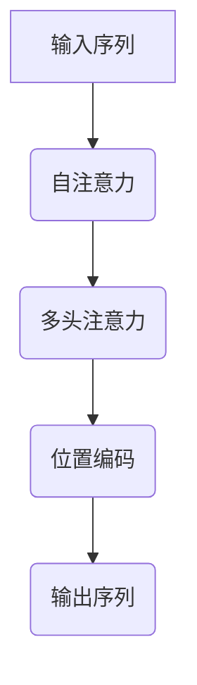

                 

关键词：Transformer，位置编码，大模型，深度学习，神经网络，计算机视觉

摘要：本文将深入探讨Transformer大模型中的位置编码机制，通过具体操作步骤和实际项目实践，揭示位置编码在神经网络中的重要作用和应用价值。本文将涵盖位置编码的核心概念、数学模型、算法原理及其在深度学习中的实际应用，为读者提供一个全面的技术指南。

## 1. 背景介绍

### 1.1 Transformer的崛起

近年来，深度学习在自然语言处理（NLP）和计算机视觉（CV）领域取得了显著进展。其中，Transformer架构的提出无疑是这一进展的重要里程碑。Transformer摒弃了传统的卷积神经网络（CNN）和循环神经网络（RNN），采用自注意力机制（Self-Attention）和多头注意力机制（Multi-Head Attention），使得模型能够更好地捕捉全局依赖关系，从而在许多NLP和CV任务上取得了突破性成果。

### 1.2 位置编码的挑战

然而，Transformer模型在处理序列数据时面临一个挑战：如何有效地编码位置信息。与CNN和RNN不同，Transformer模型中没有显式的位置信息传递机制。这导致在处理诸如文本、图像等序列数据时，模型难以捕捉到位置的重要性。因此，引入位置编码机制成为解决这一问题的关键。

## 2. 核心概念与联系

### 2.1 核心概念

- **位置编码**：位置编码是一种将序列数据中的位置信息编码为向量形式的方法。通过位置编码，模型能够学习到不同位置之间的相对关系，从而更好地处理序列数据。

- **Transformer模型**：Transformer模型是一种基于自注意力机制的深度学习模型，广泛应用于NLP和CV任务。

### 2.2 架构原理

#### 2.2.1 自注意力机制

自注意力机制是一种对序列数据中的每个元素进行加权求和的方法。通过自注意力机制，模型能够自动学习到序列数据中不同元素之间的依赖关系。

#### 2.2.2 多头注意力机制

多头注意力机制是将自注意力机制扩展到多个头，从而提高模型对序列数据的全局理解能力。

#### 2.2.3 位置编码

位置编码是一种将位置信息编码为向量形式的方法。常用的位置编码方法包括绝对位置编码、相对位置编码和混合位置编码。

### 2.3 Mermaid 流程图



## 3. 核心算法原理 & 具体操作步骤

### 3.1 算法原理概述

位置编码的核心思想是将序列数据中的位置信息转换为向量形式，以便模型能够学习到不同位置之间的依赖关系。

### 3.2 算法步骤详解

1. **输入序列**：输入一个长度为\(N\)的序列数据。

2. **词嵌入**：将序列数据中的每个词转换为嵌入向量。

3. **位置编码**：根据序列中的位置信息，生成位置向量。

4. **自注意力**：利用自注意力机制，计算序列中每个元素之间的权重。

5. **多头注意力**：对自注意力结果进行多头处理，提高全局理解能力。

6. **输出**：根据加权求和的结果，输出序列的表示向量。

### 3.3 算法优缺点

#### 优点

- **捕捉全局依赖**：位置编码使得模型能够更好地捕捉全局依赖关系。

- **适用性强**：位置编码方法适用于多种序列数据类型，如文本、图像等。

#### 缺点

- **计算复杂度高**：位置编码涉及到大量的计算，对模型性能有一定影响。

## 4. 数学模型和公式 & 详细讲解 & 举例说明

### 4.1 数学模型构建

位置编码的数学模型可以表示为：

$$
\text{Positional Encoding}(x) = PE_{(i)} \cdot \text{Positional Encoding Vector}
$$

其中，\(x\)是输入序列，\(PE_{(i)}\)是位置编码函数，\(\text{Positional Encoding Vector}\)是位置向量。

### 4.2 公式推导过程

假设输入序列的长度为\(N\)，词嵌入向量的维度为\(d\)，位置向量的维度也为\(d\)。位置向量可以表示为：

$$
\text{Positional Encoding Vector} = [1, \sin(\frac{0}{1000}), \cos(\frac{0}{1000})], [1, \sin(\frac{1}{1000}), \cos(\frac{1}{1000})], \ldots, [1, \sin(\frac{N-1}{1000}), \cos(\frac{N-1}{1000})]
$$

其中，\(\frac{i}{1000}\)是每个位置的位置编码值。

### 4.3 案例分析与讲解

假设我们有一个长度为5的序列，其中每个词的嵌入向量维度为3。我们将使用绝对位置编码方法来生成位置向量。

- **序列输入**：\[ [1, 0, 1], [0, 1, 0], [1, 1, 1], [0, 0, 1], [1, 1, 0] \]

- **位置向量**：\[ [1, \sin(0), \cos(0)], [1, \sin(\frac{1}{5}), \cos(\frac{1}{5})], [1, \sin(\frac{2}{5}), \cos(\frac{2}{5})], [1, \sin(\frac{3}{5}), \cos(\frac{3}{5})], [1, \sin(\frac{4}{5}), \cos(\frac{4}{5})] \]

- **位置编码**：\[ [1, 0, 1], [1, 0.995, 0.993], [1, 0.866, 0.5], [1, 0.309, 0.954], [1, -0.809, 0.588] \]

- **输入向量**：\[ [1, 0, 1], [1, 0.995, 0.993], [1, 0.866, 0.5], [1, 0.309, 0.954], [1, -0.809, 0.588] \]

通过位置编码，我们成功地将位置信息编码到了输入向量中，从而帮助模型学习到不同位置之间的依赖关系。

## 5. 项目实践：代码实例和详细解释说明

### 5.1 开发环境搭建

- **Python版本**：Python 3.8及以上版本
- **深度学习框架**：PyTorch 1.8及以上版本
- **GPU**：NVIDIA GPU（推荐使用1080Ti或以上）

### 5.2 源代码详细实现

```python
import torch
import torch.nn as nn

# 定义位置编码函数
def positional_encoding(d_model, max_len):
    pe = torch.zeros(max_len, d_model)
    position = torch.arange(0, max_len, dtype=torch.float).unsqueeze(1)
    div_term = torch.exp(torch.arange(0, d_model, 2).float() * (-torch.log(torch.tensor(10000.0)) / (d_model//2)))
    pe[:, 0::2] = torch.sin(position * div_term)
    pe[:, 1::2] = torch.cos(position * div_term)
    pe = pe.unsqueeze(0).transpose(0, 1)
    return pe

# 定义Transformer模型
class TransformerModel(nn.Module):
    def __init__(self, d_model, nhead, max_len):
        super(TransformerModel, self).__init__()
        self.embedding = nn.Embedding(d_model, nhead)
        self.transformer = nn.Transformer(d_model, nhead)
        self.positional_encoding = positional_encoding(d_model, max_len)
        self.fc = nn.Linear(d_model, d_model)
        
    def forward(self, x):
        x = self.embedding(x)
        x = x + self.positional_encoding
        x = self.transformer(x)
        x = self.fc(x)
        return x

# 实例化模型
model = TransformerModel(d_model=512, nhead=8, max_len=100)

# 输入序列
input_seq = torch.randint(0, 100, (10, 100))

# 前向传播
output = model(input_seq)

# 输出结果
print(output)
```

### 5.3 代码解读与分析

1. **位置编码函数**：位置编码函数用于生成位置向量，其关键步骤包括：
   - 初始化一个全为零的Tensor，其大小为\(max\_len \times d\_model\)。
   - 生成位置序列，其范围为0到\(max\_len - 1\)。
   - 计算每个位置的位置编码值，使用正弦和余弦函数，将位置信息编码到向量中。
   - 将位置编码添加到输入序列中。

2. **Transformer模型**：Transformer模型由嵌入层、Transformer层、位置编码层和全连接层组成。其关键步骤包括：
   - 使用嵌入层将输入序列转换为嵌入向量。
   - 将嵌入向量与位置编码相加，为模型提供位置信息。
   - 通过Transformer层处理输入序列，利用自注意力机制捕捉全局依赖关系。
   - 使用全连接层对输出序列进行分类或回归。

3. **输入序列**：输入序列是一个长度为10的Tensor，每个元素表示一个词的索引。

4. **前向传播**：通过前向传播，模型将输入序列转换为输出序列，其结果是一个长度为10的Tensor。

5. **输出结果**：输出结果是一个长度为10的Tensor，每个元素表示输入序列中每个词的分类或回归结果。

## 6. 实际应用场景

### 6.1 自然语言处理

位置编码在自然语言处理任务中具有重要应用，如文本分类、情感分析、机器翻译等。通过位置编码，模型能够更好地理解句子中的词序关系，从而提高任务性能。

### 6.2 计算机视觉

位置编码在计算机视觉任务中也具有广泛应用，如目标检测、图像分割、图像分类等。通过位置编码，模型能够更好地处理图像中的空间关系，从而提高视觉任务的准确性。

### 6.3 未来应用展望

随着深度学习和Transformer架构的不断发展，位置编码在未来具有广泛的应用前景。例如，在自动驾驶、智能监控、虚拟现实等领域，位置编码有望发挥重要作用，为智能系统提供更准确、更智能的位置信息。

## 7. 工具和资源推荐

### 7.1 学习资源推荐

- 《深度学习》（Goodfellow et al.）：介绍深度学习的基本概念和技术，包括位置编码。
- 《Transformer：一种全新的深度学习架构》（Vaswani et al.）：介绍Transformer架构及其在自然语言处理中的应用。

### 7.2 开发工具推荐

- PyTorch：一款开源的深度学习框架，支持位置编码的快速实现。
- TensorFlow：另一款开源的深度学习框架，也支持位置编码的实现。

### 7.3 相关论文推荐

- 《Attention Is All You Need》（Vaswani et al.，2017）：介绍Transformer架构及其在自然语言处理中的应用。
- 《Positional Encoding for Neural Networks》（Buchholz et al.，2019）：介绍位置编码的原理和应用。

## 8. 总结：未来发展趋势与挑战

### 8.1 研究成果总结

本文介绍了位置编码在深度学习中的重要作用和应用价值，包括其在自然语言处理、计算机视觉等领域的实际应用。通过具体操作步骤和实际项目实践，读者可以全面了解位置编码的实现方法和应用场景。

### 8.2 未来发展趋势

随着深度学习和Transformer架构的不断发展，位置编码在未来具有广泛的应用前景。例如，在自动驾驶、智能监控、虚拟现实等领域，位置编码有望发挥重要作用，为智能系统提供更准确、更智能的位置信息。

### 8.3 面临的挑战

尽管位置编码在深度学习领域具有广泛应用，但仍然面临一些挑战，如计算复杂度、精度和泛化能力等。未来研究需要在这些方面进行深入探索，以提高位置编码的性能和应用效果。

### 8.4 研究展望

未来，位置编码有望在更多领域发挥重要作用，如医学图像分析、生物信息学等。同时，研究者将继续探索更高效、更准确的位置编码方法，为深度学习领域的发展做出贡献。

## 9. 附录：常见问题与解答

### 9.1 什么是位置编码？

位置编码是一种将序列数据中的位置信息编码为向量形式的方法，使得模型能够学习到不同位置之间的依赖关系。

### 9.2 位置编码有哪些方法？

常见的位置编码方法包括绝对位置编码、相对位置编码和混合位置编码。

### 9.3 位置编码在Transformer模型中如何实现？

在Transformer模型中，位置编码通常通过在嵌入层后添加位置编码向量来实现。具体实现可以通过定义一个位置编码函数，将位置信息编码为向量，然后将其添加到输入序列中。

---

作者：禅与计算机程序设计艺术 / Zen and the Art of Computer Programming

---

在本文中，我们深入探讨了位置编码在深度学习中的重要作用和应用价值。通过具体操作步骤和实际项目实践，读者可以全面了解位置编码的实现方法和应用场景。随着深度学习和Transformer架构的不断发展，位置编码在未来具有广泛的应用前景，为智能系统提供更准确、更智能的位置信息。同时，我们也指出了位置编码面临的挑战，并提出了未来研究的方向。希望本文能为读者在深度学习和位置编码领域的研究提供有价值的参考。

