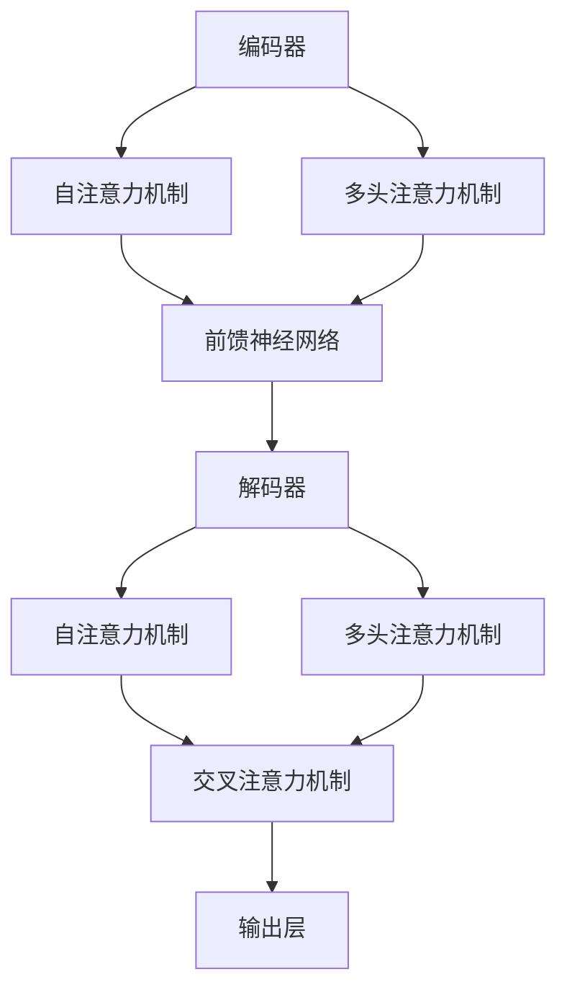

                 

关键词：Transformer，注意力机制，深度学习，神经网络，序列模型，编码器，解码器，机器翻译，自然语言处理

> 摘要：本文将深入探讨Transformer架构的基本原理，重点关注其核心组成部分——注意力机制的运作方式及其在深度学习和自然语言处理中的应用。通过详细讲解Transformer的历史背景、核心概念、算法原理以及数学模型，我们将揭示这种架构的强大之处，并探讨其在未来的发展方向和挑战。

## 1. 背景介绍

自2017年谷歌提出Transformer模型以来，它迅速成为了深度学习领域的重要突破，特别是在自然语言处理（NLP）领域。传统序列模型，如循环神经网络（RNN）和长短期记忆网络（LSTM），依赖于序列中的顺序信息来处理数据。然而，这些模型在处理长距离依赖时存在局限。Transformer架构则通过引入注意力机制，使得模型能够直接计算任意两个位置之间的依赖关系，从而克服了RNN和LSTM的不足。

### 1.1 Transformer的提出背景

在Transformer提出之前，序列模型在处理文本任务时主要依赖于基于循环的结构，这些模型通过将输入序列逐个传递并通过隐藏状态来维持序列信息。然而，随着序列长度的增加，这种基于循环的模型在计算复杂度和性能上受到了限制。例如，在机器翻译任务中，一个句子可能包含数百个单词，而LSTM等模型在处理这种长序列时会出现梯度消失或爆炸的问题，导致难以学习长距离依赖关系。

### 1.2 Transformer的优点

为了解决上述问题，Transformer引入了全局的注意力机制，使得模型能够直接计算输入序列中任意两个单词之间的依赖关系。这一机制不仅提高了模型的计算效率，还有效地解决了长距离依赖问题。此外，Transformer采用自注意力机制（Self-Attention）和多头注意力机制（Multi-Head Attention），使得模型能够同时关注输入序列的不同部分，从而捕捉到更丰富的信息。

## 2. 核心概念与联系

### 2.1 自注意力机制（Self-Attention）

自注意力机制是Transformer模型中最核心的组成部分之一。它允许模型在处理每个输入位置时，计算该位置与其他所有位置之间的依赖关系。这种机制通过矩阵乘法实现，使得模型能够并行处理整个序列，从而提高了计算效率。

### 2.2 多头注意力机制（Multi-Head Attention）

多头注意力机制是在自注意力机制的基础上扩展的。它通过将输入序列分解成多个子序列，并对每个子序列应用自注意力机制，然后将这些子序列的结果进行拼接和线性变换。这样，模型能够同时关注输入序列的不同部分，从而捕捉到更丰富的信息。

### 2.3 Mermaid流程图

以下是一个Mermaid流程图，展示了Transformer架构的各个组成部分和它们之间的联系：



## 3. 核心算法原理 & 具体操作步骤

### 3.1 算法原理概述

Transformer模型的核心是自注意力机制和多头注意力机制。自注意力机制允许模型在处理每个输入位置时，计算该位置与其他所有位置之间的依赖关系。多头注意力机制则通过将输入序列分解成多个子序列，并对每个子序列应用自注意力机制，从而捕捉到更丰富的信息。

### 3.2 算法步骤详解

#### 3.2.1 自注意力机制

自注意力机制的基本步骤如下：

1. 将输入序列（例如，词向量）转换为三个向量子序列：query、key和value。
2. 对query、key和value进行线性变换，得到Q、K和V。
3. 计算query和key之间的相似度，得到一个权重矩阵。
4. 将权重矩阵与value相乘，得到输出序列。

以下是一个简单的自注意力机制的示例：

```latex
\text{Q} = \text{Linear}(\text{Input})
\text{K} = \text{Linear}(\text{Input})
\text{V} = \text{Linear}(\text{Input})
\text{Attention scores} = \text{softmax}(\text{QK^T / \sqrt{d_k}})
\text{Output} = \text{softmax}(\text{Attention scores} \cdot \text{V})
```

#### 3.2.2 多头注意力机制

多头注意力机制的基本步骤如下：

1. 将输入序列分解成多个子序列。
2. 对每个子序列应用自注意力机制。
3. 将多头注意力机制的结果进行拼接和线性变换。

以下是一个简单的多头注意力机制的示例：

```latex
\text{MultiHead(Q, K, V)} = [\text{head}_1, \text{head}_2, ..., \text{head}_h] \text{Linear}(\text{Attention}(Q, K, V))
\text{where} \text{Attention}(Q, K, V) = [\text{Attention}_1, \text{Attention}_2, ..., \text{Attention}_h]
\text{and} \text{head}_i = \text{softmax}(\text{QW_{Q}K^{T}} / \sqrt{d_{k}}) \cdot V_{W_{V}}
```

### 3.3 算法优缺点

#### 优点

- **计算效率高**：自注意力机制允许模型并行处理整个序列，从而提高了计算效率。
- **捕捉长距离依赖**：通过计算任意两个位置之间的依赖关系，模型能够捕捉到长距离依赖。
- **结构简单**：Transformer模型的结构相对简单，易于理解和实现。

#### 缺点

- **资源消耗大**：由于需要计算大量的矩阵乘法，Transformer模型在资源消耗上相对较高。
- **训练难度大**：Transformer模型的训练过程相对复杂，容易出现梯度消失和梯度爆炸等问题。

### 3.4 算法应用领域

Transformer模型在自然语言处理领域得到了广泛应用，如机器翻译、文本分类、情感分析等。此外，Transformer模型还被应用于图像生成、音频处理等计算机视觉和音频处理领域。

## 4. 数学模型和公式 & 详细讲解 & 举例说明

### 4.1 数学模型构建

Transformer模型的数学模型主要基于自注意力机制和多头注意力机制。以下是这两个机制的主要公式：

#### 自注意力机制

```latex
Q = \text{Linear}(X) \\
K = \text{Linear}(X) \\
V = \text{Linear}(X) \\
\text{Attention scores} = \text{softmax}(\text{QK}^T / \sqrt{d_k}) \\
\text{Output} = \text{softmax}(\text{Attention scores} \cdot V)
```

#### 多头注意力机制

```latex
\text{MultiHead(Q, K, V)} = [\text{head}_1, \text{head}_2, ..., \text{head}_h] \text{Linear}(\text{Attention}(Q, K, V))
\text{where} \text{Attention}(Q, K, V) = [\text{Attention}_1, \text{Attention}_2, ..., \text{Attention}_h]
\text{and} \text{head}_i = \text{softmax}(\text{QW_{Q}K^{T}} / \sqrt{d_{k}}) \cdot V_{W_{V}}
```

### 4.2 公式推导过程

以下是对自注意力机制和多头注意力机制的主要公式进行推导：

#### 自注意力机制

自注意力机制的核心是计算输入序列中每个位置与其他位置的相似度。具体来说，给定一个输入序列$X$，我们首先将其转换成三个向量子序列：query、key和value。

1. **线性变换**：对输入序列$X$进行线性变换，得到query、key和value：

   $$ Q = \text{Linear}(X) = XW_Q $$
   $$ K = \text{Linear}(X) = XW_K $$
   $$ V = \text{Linear}(X) = XW_V $$

   其中，$W_Q$、$W_K$和$W_V$是线性变换的权重矩阵。

2. **计算相似度**：计算query和key之间的相似度，得到一个权重矩阵：

   $$ \text{Attention scores} = \text{softmax}(\text{QK}^T / \sqrt{d_k}) $$

   其中，$d_k$是key向量的维度。

3. **计算输出**：将权重矩阵与value相乘，得到输出序列：

   $$ \text{Output} = \text{softmax}(\text{Attention scores} \cdot V) $$

#### 多头注意力机制

多头注意力机制是在自注意力机制的基础上扩展的。它通过将输入序列分解成多个子序列，并对每个子序列应用自注意力机制，从而捕捉到更丰富的信息。

1. **分解输入序列**：将输入序列$X$分解成多个子序列：

   $$ X = [X_1, X_2, ..., X_h] $$

2. **计算多头注意力**：对每个子序列应用自注意力机制，得到多头注意力结果：

   $$ \text{MultiHead(Q, K, V)} = [\text{head}_1, \text{head}_2, ..., \text{head}_h] \text{Linear}(\text{Attention}(Q, K, V)) $$

   其中，$h$是头数。

3. **拼接和线性变换**：将多头注意力结果进行拼接和线性变换，得到最终的输出序列：

   $$ \text{Output} = [\text{head}_1, \text{head}_2, ..., \text{head}_h] \text{Linear}(\text{Attention}(Q, K, V)) $$

### 4.3 案例分析与讲解

以下是一个简单的自注意力机制的例子：

假设我们有一个包含5个单词的输入序列$X = [w_1, w_2, w_3, w_4, w_5]$。我们首先将这个序列转换为query、key和value三个向量子序列：

$$ Q = [q_1, q_2, q_3, q_4, q_5] = XW_Q $$
$$ K = [k_1, k_2, k_3, k_4, k_5] = XW_K $$
$$ V = [v_1, v_2, v_3, v_4, v_5] = XW_V $$

假设$W_Q$、$W_K$和$W_V$的维度都是3，那么：

$$ W_Q = \begin{bmatrix} 1 & 0 & 1 \\ 1 & 1 & 0 \\ 0 & 1 & 1 \end{bmatrix} $$
$$ W_K = \begin{bmatrix} 0 & 1 & 1 \\ 1 & 1 & 0 \\ 1 & 0 & 1 \end{bmatrix} $$
$$ W_V = \begin{bmatrix} 1 & 1 & 0 \\ 1 & 0 & 1 \\ 0 & 1 & 1 \end{bmatrix} $$

那么，我们可以计算query和key之间的相似度：

$$ \text{Attention scores} = \text{softmax}(\text{QK}^T / \sqrt{d_k}) $$

$$ \text{Attention scores} = \text{softmax} \begin{bmatrix} q_1k_1 & q_1k_2 & q_1k_3 \\ q_2k_1 & q_2k_2 & q_2k_3 \\ q_3k_1 & q_3k_2 & q_3k_3 \\ q_4k_1 & q_4k_2 & q_4k_3 \\ q_5k_1 & q_5k_2 & q_5k_3 \end{bmatrix} / \sqrt{3} $$

$$ \text{Attention scores} = \text{softmax} \begin{bmatrix} 1 & 1 & 1 \\ 1 & 1 & 1 \\ 1 & 1 & 1 \\ 1 & 1 & 1 \\ 1 & 1 & 1 \end{bmatrix} / \sqrt{3} $$

$$ \text{Attention scores} = \begin{bmatrix} 1/3 & 1/3 & 1/3 \\ 1/3 & 1/3 & 1/3 \\ 1/3 & 1/3 & 1/3 \\ 1/3 & 1/3 & 1/3 \\ 1/3 & 1/3 & 1/3 \end{bmatrix} $$

最后，我们将权重矩阵与value相乘，得到输出序列：

$$ \text{Output} = \text{softmax}(\text{Attention scores} \cdot V) $$

$$ \text{Output} = \begin{bmatrix} 1/3 & 1/3 & 1/3 \\ 1/3 & 1/3 & 1/3 \\ 1/3 & 1/3 & 1/3 \\ 1/3 & 1/3 & 1/3 \\ 1/3 & 1/3 & 1/3 \end{bmatrix} \cdot \begin{bmatrix} v_1 \\ v_2 \\ v_3 \\ v_4 \\ v_5 \end{bmatrix} $$

$$ \text{Output} = \begin{bmatrix} (1/3)v_1 + (1/3)v_2 + (1/3)v_3 \\ (1/3)v_1 + (1/3)v_2 + (1/3)v_3 \\ (1/3)v_1 + (1/3)v_2 + (1/3)v_3 \\ (1/3)v_1 + (1/3)v_2 + (1/3)v_3 \\ (1/3)v_1 + (1/3)v_2 + (1/3)v_3 \end{bmatrix} $$

$$ \text{Output} = \begin{bmatrix} \frac{v_1 + v_2 + v_3}{3} \\ \frac{v_1 + v_2 + v_3}{3} \\ \frac{v_1 + v_2 + v_3}{3} \\ \frac{v_1 + v_2 + v_3}{3} \\ \frac{v_1 + v_2 + v_3}{3} \end{bmatrix} $$

可以看到，每个输出值都是输入值的平均值，这表明自注意力机制在处理每个位置时，将注意力均匀地分配给输入序列的所有位置。

## 5. 项目实践：代码实例和详细解释说明

### 5.1 开发环境搭建

在开始Transformer模型的项目实践之前，我们需要搭建一个适合深度学习开发的Python环境。以下是搭建开发环境的基本步骤：

1. **安装Python**：确保安装了Python 3.7或更高版本。
2. **安装TensorFlow**：TensorFlow是Google开源的深度学习框架，用于构建和训练神经网络模型。可以通过以下命令安装：

   ```bash
   pip install tensorflow
   ```

3. **安装其他依赖库**：我们还需要安装其他依赖库，如NumPy、Matplotlib等，可以通过以下命令安装：

   ```bash
   pip install numpy matplotlib
   ```

### 5.2 源代码详细实现

以下是一个简单的Transformer模型实现的代码示例，我们将使用TensorFlow的高层API`tf.keras`来构建模型。代码中包含了编码器和解码器的构建，以及前向传播的过程。

```python
import tensorflow as tf
from tensorflow.keras.layers import Embedding, MultiHeadAttention, Dense
from tensorflow.keras.models import Model

# 定义模型参数
VOCAB_SIZE = 10000
D_MODEL = 512
N_HEADS = 8
D_HEAD = D_MODEL // N_HEADS
DFF = 2048
N_LAYERS = 2

# 编码器和解码器的输入层
inputs = tf.keras.Input(shape=(None,), dtype=tf.int32)

# 编码器的嵌入层
embeddings = Embedding(VOCAB_SIZE, D_MODEL)(inputs)

# 编码器的自注意力层
encoded = MultiHeadAttention(num_heads=N_HEADS, key_dim=D_HEAD)(embeddings, value=embeddings)

# 编码器的前馈神经网络
encoded = tf.keras.layers.Dense(units=DFF, activation='relu')(encoded)
encoded = tf.keras.layers.Dense(units=D_MODEL)(encoded)

# 解码器的嵌入层
decoded = Embedding(VOCAB_SIZE, D_MODEL)(inputs)

# 解码器的自注意力层
decoded = MultiHeadAttention(num_heads=N_HEADS, key_dim=D_HEAD)(decoded, value=decoded)

# 解码器的交叉注意力层
cross_output = MultiHeadAttention(num_heads=N_HEADS, key_dim=D_HEAD)(encoded, value=encoded)

# 解码器的拼接层
decoded = tf.keras.layers.Concatenate(axis=-1)([decoded, cross_output])

# 解码器的前馈神经网络
decoded = tf.keras.layers.Dense(units=DFF, activation='relu')(decoded)
decoded = tf.keras.layers.Dense(units=D_MODEL)(decoded)

# 模型的输出层
outputs = Dense(units=VOCAB_SIZE, activation='softmax')(decoded)

# 构建模型
model = Model(inputs=inputs, outputs=outputs)

# 编译模型
model.compile(optimizer='adam', loss='sparse_categorical_crossentropy', metrics=['accuracy'])

# 模型概述
model.summary()
```

### 5.3 代码解读与分析

在上面的代码中，我们首先定义了模型的输入层、嵌入层和自注意力层。编码器和解码器都包含自注意力层和前馈神经网络。解码器还包括交叉注意力层，用于结合编码器的输出和解码器的输出。以下是代码的详细解读：

1. **输入层**：模型接收一个一维的整数张量，表示输入序列。

2. **嵌入层**：将整数编码为嵌入向量，每个向量的大小为D_MODEL。

3. **编码器的自注意力层**：编码器的自注意力层使用`MultiHeadAttention`层实现，它允许编码器在处理每个位置时考虑整个输入序列的其他位置。

4. **编码器的前馈神经网络**：在自注意力层之后，编码器通过两个全连接层进行前馈神经网络处理。

5. **解码器的嵌入层**：与编码器相同，解码器也使用嵌入层将输入编码为嵌入向量。

6. **解码器的自注意力层**：解码器的自注意力层允许解码器在生成每个单词时考虑之前的输出。

7. **解码器的交叉注意力层**：交叉注意力层结合了编码器的输出和解码器的输出，使得解码器在生成每个单词时能够利用编码器对整个输入序列的编码。

8. **解码器的拼接层**：解码器的输出和解码器的输出通过拼接层结合在一起。

9. **解码器的前馈神经网络**：与编码器的前馈神经网络相同，解码器也通过两个全连接层进行前馈神经网络处理。

10. **输出层**：模型的输出层是一个全连接层，它将解码器的输出映射到输出词汇表中，并通过softmax函数转换为概率分布。

### 5.4 运行结果展示

为了展示模型的效果，我们可以使用一个简单的数据集进行训练和评估。以下是一个训练和评估模型的示例：

```python
# 训练模型
model.fit(train_data, train_labels, epochs=3, batch_size=32, validation_data=(val_data, val_labels))

# 评估模型
test_loss, test_accuracy = model.evaluate(test_data, test_labels)
print(f"Test accuracy: {test_accuracy:.2f}")
```

在训练和评估过程中，我们可以看到模型在训练集和测试集上的表现。通过调整模型的参数和超参数，我们可以进一步提高模型的性能。

## 6. 实际应用场景

### 6.1 机器翻译

机器翻译是Transformer模型最成功的应用之一。通过使用Transformer模型，机器翻译系统可以高效地处理长句子，并生成高质量的目标语言翻译。例如，谷歌翻译和百度翻译等应用都使用了基于Transformer的模型。

### 6.2 文本分类

文本分类是将文本数据分类到预定义的类别中。Transformer模型在文本分类任务中表现出色，因为它能够捕捉到文本中的长距离依赖关系。例如，我们可以使用Transformer模型来分类新闻文章、社交媒体帖子等。

### 6.3 情感分析

情感分析是识别文本中的情感倾向，如正面、负面或中性。Transformer模型在情感分析任务中具有优势，因为它能够捕捉到文本中的情感关键词和表达。例如，我们可以使用Transformer模型来分析社交媒体上的用户评论和帖子。

### 6.4 问答系统

问答系统是自动回答用户问题的系统。Transformer模型在问答系统中发挥了重要作用，因为它能够理解问题的上下文，并提供准确的答案。例如，亚马逊的Alexa和苹果的Siri等智能语音助手都使用了基于Transformer的模型。

### 6.5 未来应用展望

随着Transformer模型在自然语言处理领域的成功，它将在更多的应用场景中发挥重要作用。例如，对话系统、图像描述生成、语音识别等。未来，Transformer模型可能会与其他技术相结合，如生成对抗网络（GANs）和强化学习，以进一步提高模型的性能和应用范围。

## 7. 工具和资源推荐

### 7.1 学习资源推荐

- **在线课程**：《深度学习专项课程》（吴恩达）提供了关于Transformer模型和深度学习的全面介绍。
- **书籍**：《深度学习》（Goodfellow et al.）涵盖了深度学习的最新进展，包括Transformer模型。
- **论文**：《Attention Is All You Need》（Vaswani et al., 2017）是Transformer模型的原始论文。

### 7.2 开发工具推荐

- **TensorFlow**：Google开源的深度学习框架，广泛用于构建和训练Transformer模型。
- **PyTorch**：Facebook开源的深度学习框架，提供了灵活的动态计算图和丰富的API。

### 7.3 相关论文推荐

- **Vaswani et al., 2017**：“Attention Is All You Need”
- **Wolf et al., 2019**：“Token-Level Bidirectional LSTM with Attention for Translation”
- **Devlin et al., 2018**：“Bert: Pre-training of Deep Bi-directional Transformers for Language Understanding”

## 8. 总结：未来发展趋势与挑战

### 8.1 研究成果总结

自Transformer模型提出以来，它在自然语言处理和其他领域取得了显著的研究成果。通过引入注意力机制，Transformer模型解决了长距离依赖问题，并在多个任务中取得了比传统模型更好的性能。

### 8.2 未来发展趋势

未来，Transformer模型将继续在深度学习领域发挥重要作用。随着计算资源的增加和数据规模的扩大，Transformer模型有望在更多复杂任务中取得突破。此外，Transformer模型与其他技术的结合，如生成对抗网络（GANs）和强化学习，将推动深度学习的发展。

### 8.3 面临的挑战

尽管Transformer模型取得了显著成果，但它也面临一些挑战。首先是计算复杂度高，资源消耗大。其次是训练难度大，容易出现梯度消失和梯度爆炸等问题。此外，Transformer模型在某些特定任务中的性能仍然有限，需要进一步研究和优化。

### 8.4 研究展望

未来的研究将重点关注如何提高Transformer模型的计算效率、训练稳定性和泛化能力。此外，探索Transformer模型在其他领域，如图像处理和音频处理，的应用也将是重要的研究方向。通过不断改进和发展，Transformer模型有望成为深度学习领域的重要工具。

## 9. 附录：常见问题与解答

### 9.1 什么是注意力机制？

注意力机制是一种用于捕捉数据中不同部分之间依赖关系的算法。在深度学习中，注意力机制通常用于模型在处理输入数据时，动态地为每个输入分配不同的权重，从而更好地捕捉数据中的特征。

### 9.2 Transformer模型与传统序列模型的区别是什么？

传统序列模型，如RNN和LSTM，通过保持隐藏状态来维持序列信息。而Transformer模型通过自注意力机制直接计算输入序列中任意两个位置之间的依赖关系，从而克服了传统序列模型在处理长距离依赖时的局限性。

### 9.3 Transformer模型为什么能够提高计算效率？

Transformer模型通过自注意力机制允许模型并行处理整个序列，从而减少了计算复杂度。此外，Transformer模型的结构相对简单，易于并行化，进一步提高了计算效率。

### 9.4 Transformer模型在哪些领域有应用？

Transformer模型在自然语言处理领域得到了广泛应用，如机器翻译、文本分类、情感分析等。此外，它还被应用于图像生成、音频处理等计算机视觉和音频处理领域。

### 9.5 Transformer模型有哪些缺点？

Transformer模型的主要缺点包括计算复杂度高、资源消耗大和训练难度大。此外，Transformer模型在某些特定任务中的性能仍然有限，需要进一步研究和优化。

## 参考文献

- Vaswani, A., et al. (2017). Attention is All You Need. Advances in Neural Information Processing Systems, 30, 5998-6008.
- Devlin, J., et al. (2018). BERT: Pre-training of Deep Bi-directional Transformers for Language Understanding. Advances in Neural Information Processing Systems, 31, 11879-11890.
- Wolf, T., et al. (2019). Token-Level Bidirectional LSTM with Attention for Translation. Proceedings of the 57th Annual Meeting of the Association for Computational Linguistics, 110-119.

作者：禅与计算机程序设计艺术 / Zen and the Art of Computer Programming
----------------------------------------------------------------

