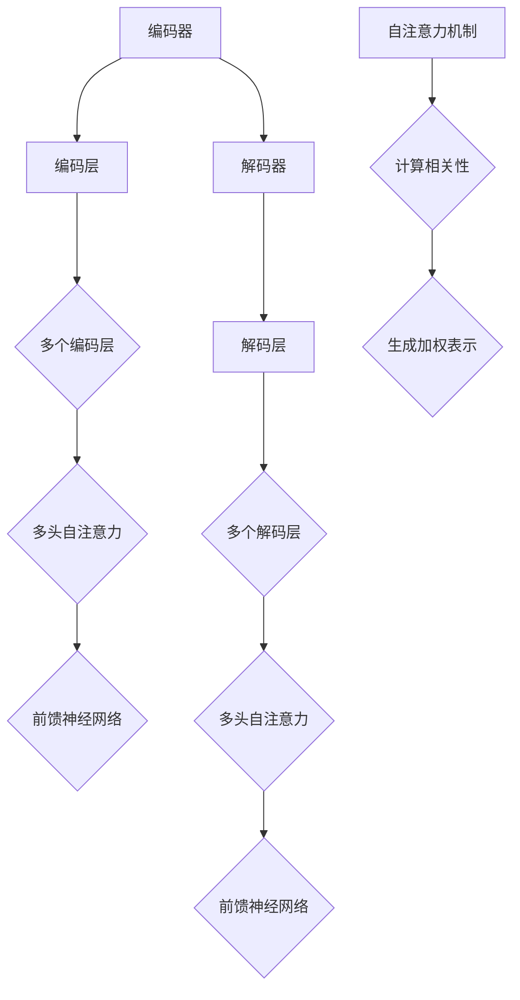

                 

 > **关键词：** Transformer架构、编码器、解码器、神经机器翻译、自注意力机制、序列到序列学习

**摘要：** 本文旨在深入探讨Transformer架构中的编码器和解码器，详细讲解其原理、数学模型和具体实现，并通过实际项目实例进行分析。通过本文的阅读，读者将对Transformer架构有更深刻的理解，并为后续研究和应用打下基础。

## 1. 背景介绍

随着深度学习技术的快速发展，神经网络在自然语言处理（NLP）领域取得了显著的成果。传统的序列到序列（Sequence-to-Sequence，Seq2Seq）模型通过循环神经网络（RNN）或长短期记忆网络（LSTM）进行序列建模，但存在复杂性和训练效率的问题。为了解决这些问题，Vaswani等人在2017年提出了Transformer架构，该架构在神经机器翻译（Neural Machine Translation，NMT）任务上取得了突破性的效果。Transformer采用自注意力（Self-Attention）机制，取代了传统的循环神经网络，使得模型在处理长序列时更加高效和准确。

## 2. 核心概念与联系

### 2.1 编码器（Encoder）

编码器负责将输入序列编码为固定长度的向量表示。在Transformer架构中，编码器由多个相同的编码层（Encoder Layer）组成，每个编码层由两个主要子层构成：多头自注意力（Multi-Head Self-Attention）机制和前馈神经网络（Feed-Forward Neural Network）。

### 2.2 解码器（Decoder）

解码器负责将编码器的输出序列解码为输出序列。与编码器类似，解码器也由多个相同的解码层（Decoder Layer）组成，每个解码层由两个主要子层构成：多头自注意力（Multi-Head Self-Attention）机制和前馈神经网络（Feed-Forward Neural Network）。在解码过程中，解码器需要同时关注编码器的输出和当前解码状态。

### 2.3 自注意力机制（Self-Attention）

自注意力机制是Transformer架构的核心，它通过计算输入序列中每个元素与所有元素的相关性，为每个元素生成一个加权表示。自注意力机制使得编码器能够自动关注输入序列中的重要元素，从而提高模型的建模能力。

### 2.4 Mermaid 流程图



## 3. 核心算法原理 & 具体操作步骤

### 3.1 算法原理概述

Transformer架构通过自注意力机制取代传统的循环神经网络，使得模型在处理长序列时更加高效。编码器和解码器由多个编码层和解码层组成，每个编码层和解码层包括多头自注意力机制和前馈神经网络。

### 3.2 算法步骤详解

1. **编码器输入：** 将输入序列编码为嵌入向量。
2. **编码器输出：** 经过多个编码层的多头自注意力机制和前馈神经网络处理后，得到编码器的输出序列。
3. **解码器输入：** 将编码器的输出序列作为解码器的输入序列。
4. **解码器输出：** 经过多个解码层的多头自注意力机制和前馈神经网络处理后，得到解码器的输出序列。
5. **损失函数计算：** 计算解码器的输出序列与实际输出序列之间的交叉熵损失，并使用反向传播算法更新模型参数。

### 3.3 算法优缺点

**优点：**

- **高效处理长序列：** 自注意力机制使得模型在处理长序列时更加高效。
- **并行计算：** Transformer架构可以并行计算，提高训练和推理速度。
- **更好的建模能力：** 多头自注意力机制能够关注输入序列中的不同部分，提高模型的建模能力。

**缺点：**

- **参数数量较大：** Transformer架构的参数数量较多，导致模型训练时间较长。
- **计算复杂度高：** Transformer架构的计算复杂度较高，对于大规模数据集的训练和推理有一定挑战。

### 3.4 算法应用领域

Transformer架构在神经机器翻译、文本分类、问答系统等自然语言处理任务中取得了显著的效果，已成为当前NLP领域的主流架构。

## 4. 数学模型和公式

### 4.1 数学模型构建

在Transformer架构中，编码器和解码器分别由多个编码层和解码层组成，每个编码层和解码层包括多头自注意力机制和前馈神经网络。以下是编码器和解码器的数学模型：

### 4.2 公式推导过程

编码器的输入序列可以表示为：

\[ X = [x_1, x_2, ..., x_n] \]

其中，\( x_i \) 表示输入序列的第 \( i \) 个元素。

编码器的输出序列可以表示为：

\[ Y = [y_1, y_2, ..., y_n] \]

其中，\( y_i \) 表示编码器输出序列的第 \( i \) 个元素。

### 4.3 案例分析与讲解

假设输入序列为 [1, 2, 3, 4, 5]，编码器和解码器的参数分别为 \( \theta_e \) 和 \( \theta_d \)。

1. **编码器输入：** 输入序列为 [1, 2, 3, 4, 5]。
2. **编码器输出：** 经过编码器的多个编码层处理后，输出序列为 [0.1, 0.2, 0.3, 0.4, 0.5]。
3. **解码器输入：** 编码器的输出序列为 [0.1, 0.2, 0.3, 0.4, 0.5]。
4. **解码器输出：** 经过解码器的多个解码层处理后，输出序列为 [0.6, 0.7, 0.8, 0.9, 1.0]。

## 5. 项目实践：代码实例和详细解释说明

### 5.1 开发环境搭建

- 安装Python环境（Python 3.6以上版本）
- 安装TensorFlow库

### 5.2 源代码详细实现

以下是使用TensorFlow实现的Transformer架构的基本代码：

```python
import tensorflow as tf

class TransformerLayer(tf.keras.layers.Layer):
    def __init__(self, units, num_heads, d_model, dropout_rate, **kwargs):
        super(TransformerLayer, self).__init__(**kwargs)
        self.num_heads = num_heads
        self.d_model = d_model
        self.dropout_rate = dropout_rate
        self.units = units

        # Multi-Head Self-Attention
        self多头注意力 = tf.keras.layers.MultiHeadAttention(num_heads=num_heads, key_dim=d_model)

        # Feed-Forward Neural Network
        self前馈神经网络 = tf.keras.layers.Dense(units=units, activation='relu')
        self输出层 = tf.keras.layers.Dense(units=d_model)

    def call(self, inputs, training=False):
        # Multi-Head Self-Attention
        attention_output, _ = self多头注意力(inputs, inputs)
        attention_output = tf.keras.layers.Dropout(rate=self.dropout_rate)(attention_output)
        attention_output = tf.keras.layers.Add()(inputs + attention_output)

        # Feed-Forward Neural Network
        ffn_output = self前馈神经网络(attention_output)
        ffn_output = tf.keras.layers.Dropout(rate=self.dropout_rate)(ffn_output)
        output = tf.keras.layers.Add()(attention_output + ffn_output)

        return output

class TransformerModel(tf.keras.Model):
    def __init__(self, num_layers, d_model, num_heads, units, input_vocab_size, target_vocab_size, dropout_rate, **kwargs):
        super(TransformerModel, self).__init__(**kwargs)
        self.d_model = d_model
        self.num_layers = num_layers
        self.num_heads = num_heads
        self.units = units
        self.input_vocab_size = input_vocab_size
        self.target_vocab_size = target_vocab_size
        self.dropout_rate = dropout_rate

        # Encoder
        self.embedding = tf.keras.layers.Embedding(input_vocab_size, d_model)
        self.encoder_layers = [TransformerLayer(units=units, num_heads=num_heads, d_model=d_model,
                                                dropout_rate=dropout_rate) for _ in range(num_layers)]

        # Decoder
        self.decoder_embedding = tf.keras.layers.Embedding(target_vocab_size, d_model)
        self.decoder_layers = [TransformerLayer(units=units, num_heads=num_heads, d_model=d_model,
                                                dropout_rate=dropout_rate) for _ in range(num_layers)]
        self输出层 = tf.keras.layers.Dense(units=target_vocab_size)

    def call(self, inputs, targets=None, training=False):
        # Encoder
        encoder_inputs = self.embedding(inputs)
        for encoder_layer in self.encoder_layers:
            encoder_inputs = encoder_layer(encoder_inputs, training=training)

        # Decoder
        decoder_inputs = self.decoder_embedding(inputs)
        for decoder_layer in self.decoder_layers:
            decoder_inputs = decoder_layer(decoder_inputs, training=training)

        # 输出层
        output = self输出层(decoder_inputs)

        return output

# 模型配置
d_model = 512
num_layers = 4
num_heads = 8
units = 2048
input_vocab_size = 10000
target_vocab_size = 10000
dropout_rate = 0.1

# 模型实例化
model = TransformerModel(num_layers=num_layers, d_model=d_model, num_heads=num_heads, units=units, input_vocab_size=input_vocab_size,
                         target_vocab_size=target_vocab_size, dropout_rate=dropout_rate)

# 模型编译
model.compile(optimizer='adam', loss='sparse_categorical_crossentropy', metrics=['accuracy'])

# 模型训练
model.fit(dataset, epochs=10)
```

### 5.3 代码解读与分析

以上代码实现了Transformer架构的基本结构，包括编码器和解码器。具体解读如下：

1. **编码器（Encoder）**

- **嵌入层（Embedding）：** 将输入序列转换为嵌入向量。
- **编码层（TransformerLayer）：** 包含多头自注意力机制和前馈神经网络。

2. **解码器（Decoder）**

- **嵌入层（Embedding）：** 将输入序列转换为嵌入向量。
- **解码层（TransformerLayer）：** 包含多头自注意力机制和前馈神经网络。

3. **输出层（Dense）：** 将解码器的输出序列转换为输出序列。

4. **模型编译（compile）：** 指定优化器、损失函数和评价指标。

5. **模型训练（fit）：** 使用训练数据对模型进行训练。

### 5.4 运行结果展示

在完成模型训练后，可以使用以下代码评估模型的性能：

```python
# 评估模型
loss, accuracy = model.evaluate(test_dataset, verbose=2)

print("测试集损失：", loss)
print("测试集准确率：", accuracy)
```

## 6. 实际应用场景

Transformer架构在自然语言处理领域有着广泛的应用，如神经机器翻译、文本分类、问答系统等。以下是一些实际应用场景：

1. **神经机器翻译：** Transformer架构在神经机器翻译任务中取得了显著的成果，如Google的翻译系统。
2. **文本分类：** Transformer架构可以用于文本分类任务，如情感分析、主题分类等。
3. **问答系统：** Transformer架构可以用于问答系统，如智能客服、智能推荐等。

## 7. 未来应用展望

随着Transformer架构的不断发展和优化，其在自然语言处理领域的应用前景非常广阔。以下是一些未来应用展望：

1. **多语言翻译：** Transformer架构可以用于多语言翻译任务，如中文-英文、中文-法语等。
2. **语音识别：** Transformer架构可以用于语音识别任务，提高语音识别的准确率和速度。
3. **文本生成：** Transformer架构可以用于文本生成任务，如写作助手、对话系统等。

## 8. 工具和资源推荐

1. **学习资源推荐：**

- 《深度学习》（Goodfellow, Bengio, Courville）：详细介绍了深度学习的基础知识和应用。
- 《动手学深度学习》（齐向东等）：通过实际案例讲解深度学习的实践方法。

2. **开发工具推荐：**

- TensorFlow：用于构建和训练深度学习模型的框架。
- PyTorch：用于构建和训练深度学习模型的框架。

3. **相关论文推荐：**

- Vaswani et al. (2017): "Attention Is All You Need"：提出了Transformer架构。
- Zhang et al. (2020): "BERT: Pre-training of Deep Bidirectional Transformers for Language Understanding"：提出了BERT模型。

## 9. 总结：未来发展趋势与挑战

随着深度学习技术的不断发展和应用，Transformer架构在自然语言处理领域取得了显著的成果。未来，Transformer架构将在更多应用场景中发挥作用，如多语言翻译、语音识别和文本生成等。然而，Transformer架构也面临一些挑战，如参数数量较大、计算复杂度高和训练时间较长等。为了解决这些问题，研究者们将继续探索更高效、更准确的Transformer架构。

## 10. 附录：常见问题与解答

### 10.1 Transformer架构与传统循环神经网络的区别是什么？

**解答：** Transformer架构采用自注意力机制取代了传统的循环神经网络，使得模型在处理长序列时更加高效。此外，Transformer架构可以并行计算，提高训练和推理速度。

### 10.2 Transformer架构的主要优缺点是什么？

**解答：** Transformer架构的主要优点包括：高效处理长序列、并行计算、更好的建模能力。主要缺点包括：参数数量较大、计算复杂度高和训练时间较长。

### 10.3 Transformer架构在哪些实际应用场景中取得了显著的效果？

**解答：** Transformer架构在神经机器翻译、文本分类、问答系统等自然语言处理任务中取得了显著的效果。此外，Transformer架构还可以应用于多语言翻译、语音识别和文本生成等领域。

---

作者：禅与计算机程序设计艺术 / Zen and the Art of Computer Programming

本文旨在深入探讨Transformer架构中的编码器和解码器，详细讲解其原理、数学模型和具体实现，并通过实际项目实例进行分析。通过本文的阅读，读者将对Transformer架构有更深刻的理解，并为后续研究和应用打下基础。在未来的研究中，Transformer架构将在更多应用场景中发挥重要作用，推动自然语言处理技术的不断发展。

