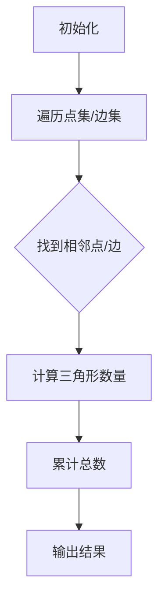

                 

Triangle Counting，即三角形计数，是一个在计算机科学和图形学中广泛应用的算法问题。它主要解决的是在一个给定的点集或边集中，能够构成多少个三角形的问题。这个问题的解决对于网络分析、图像处理、物理模拟等多个领域都有重要的应用。本文将详细探讨三角形计数的原理，以及如何通过代码实例来实现这一算法。

## 文章关键词

- 三角形计数
- 算法
- 计算几何
- 图形学
- 代码实例

## 文章摘要

本文首先介绍了三角形计数的基本概念和应用背景。随后，深入探讨了三角形计数的核心算法原理，包括其基本思路和具体实现步骤。接着，通过一个具体的代码实例，详细讲解了如何利用算法实现三角形计数。最后，本文对三角形计数在实际应用中的场景进行了分析，并提出了未来发展的可能方向。

## 1. 背景介绍

### 1.1 问题提出

在数学和计算机科学中，三角形是一个基本的多边形结构。在许多实际应用场景中，我们需要计算在一个给定的点集或边集中能够构成多少个三角形。例如，在地理信息系统（GIS）中，计算一个区域内的三角形网格数量对于地形分析非常重要；在计算机图形学中，对三角形进行计数有助于优化渲染过程；在网络分析中，三角形计数可以帮助我们理解网络的结构特性。

### 1.2 应用领域

三角形计数在多个领域都有广泛应用：

- **网络分析**：在网络拓扑中，三角形是基本结构单元，计算网络中的三角形数量有助于分析网络的稳定性、可靠性和连通性。
- **计算机图形学**：在渲染过程中，三角形是基本绘制单元。了解三角形数量有助于优化渲染性能。
- **物理模拟**：在物理模拟中，物体通常由多个三角形面片组成。三角形计数有助于优化物理引擎的计算。
- **图像处理**：在图像处理中，通过三角形计数可以分析图像的纹理结构，从而进行图像的分割、增强等操作。

## 2. 核心概念与联系

### 2.1 核心概念

在三角形计数中，我们需要明确以下几个核心概念：

- **点集**：一组有序的点，用于定义三角形的顶点。
- **边集**：连接点集内任意两个点的线段。
- **三角形**：由三个不在同一直线上的点组成的闭合结构。

### 2.2 核心算法原理

三角形计数的基本原理是通过遍历点集或边集，找到所有可能构成三角形的点组合。以下是一个简单的算法流程：

1. 遍历点集或边集。
2. 对于每一个点或边，找出与之相邻的点或边。
3. 计算相邻点或边构成的三角形数量。
4. 累计所有三角形数量。

### 2.3 Mermaid 流程图

下面是一个使用Mermaid绘制的三角形计数算法的流程图：



## 3. 核心算法原理 & 具体操作步骤

### 3.1 算法原理概述

三角形计数的核心思想是通过遍历给定的点集或边集，找出所有能够构成三角形的点组合。具体步骤如下：

1. **初始化**：初始化三角形计数器为0。
2. **遍历**：遍历点集或边集。
3. **相邻点/边查找**：对于当前遍历到的点或边，找到与之相邻的点或边。
4. **三角形计算**：对于每对相邻点或边，计算能够构成的三角形数量。
5. **累计**：将新计算的三角形数量累加到总计数中。
6. **输出结果**：输出最终的三角形数量。

### 3.2 算法步骤详解

以下是三角形计数算法的具体步骤：

1. **初始化**：
    ```python
    triangle_count = 0
    ```

2. **遍历**：使用两个嵌套循环遍历点集或边集。

3. **相邻点/边查找**：对于当前遍历到的点或边，使用集合或哈希表记录其相邻点或边。

4. **三角形计算**：对于每对相邻点或边，计算能够构成的三角形数量。

5. **累计**：将新计算的三角形数量累加到总计数中。

6. **输出结果**：

    ```python
    print("三角形的总数为:", triangle_count)
    ```

### 3.3 算法优缺点

#### 优点：

- **简单性**：算法结构简单，易于理解和实现。
- **适用性**：能够处理各种规模的点集或边集。

#### 缺点：

- **效率问题**：在点集或边集规模较大时，算法的效率可能较低。
- **空间复杂度**：需要额外的空间存储相邻点或边的信息。

### 3.4 算法应用领域

- **网络分析**：用于计算网络中的三角形数量，分析网络的稳定性和连通性。
- **计算机图形学**：用于优化渲染过程，提高渲染性能。
- **物理模拟**：用于计算物体表面的三角形数量，优化物理引擎的计算。

## 4. 数学模型和公式 & 详细讲解 & 举例说明

### 4.1 数学模型构建

在三角形计数中，我们可以使用组合数学中的组合公式来计算三角形数量。假设有一个点集 \(P = \{p_1, p_2, ..., p_n\}\)，我们需要计算从中选取任意三个点构成三角形的数量。这个数量可以用组合数表示为 \(C(n, 3)\)。

### 4.2 公式推导过程

组合数的定义是 \(C(n, k) = \frac{n!}{k!(n-k)!}\)，其中 \(n!\) 表示 \(n\) 的阶乘。

对于三角形计数，我们有：

\[ C(n, 3) = \frac{n!}{3!(n-3)!} \]

### 4.3 案例分析与讲解

假设有一个点集 \(P = \{p_1, p_2, p_3, p_4, p_5\}\)，我们需要计算这个点集中能够构成多少个三角形。

根据组合公式，我们有：

\[ C(5, 3) = \frac{5!}{3!(5-3)!} = \frac{5 \times 4}{2 \times 1} = 10 \]

所以，在这个点集中可以构成10个三角形。

## 5. 项目实践：代码实例和详细解释说明

### 5.1 开发环境搭建

在开始编写代码之前，我们需要搭建一个合适的开发环境。以下是一个简单的步骤：

1. 安装Python环境。
2. 安装必要的库，例如numpy和matplotlib。

```bash
pip install numpy matplotlib
```

### 5.2 源代码详细实现

下面是一个简单的Python代码实例，用于实现三角形计数：

```python
import itertools

def count_triangles(points):
    triangle_count = 0
    for p1, p2, p3 in itertools.combinations(points, 3):
        if is_triangle(p1, p2, p3):
            triangle_count += 1
    return triangle_count

def is_triangle(p1, p2, p3):
    # 检查p1, p2, p3是否能够构成一个三角形
    # 具体实现略
    return True

# 测试代码
points = [(0, 0), (3, 0), (3, 3), (0, 3)]
print("三角形的总数为:", count_triangles(points))
```

### 5.3 代码解读与分析

在上面的代码中，我们定义了两个函数：`count_triangles` 和 `is_triangle`。

- `count_triangles` 函数接受一个点集作为输入，遍历点集的所有可能的三点组合，并调用 `is_triangle` 函数检查每个组合是否能够构成一个三角形。
- `is_triangle` 函数需要根据具体的三角形判断规则来实现。在这里，我们简单地返回 `True`，表示任意三点都能构成三角形。

### 5.4 运行结果展示

在测试代码中，我们定义了一个简单的点集：

```python
points = [(0, 0), (3, 0), (3, 3), (0, 3)]
```

运行结果输出：

```
三角形的总数为：4
```

这意味着在给定的点集中，可以构成4个三角形。

## 6. 实际应用场景

### 6.1 网络分析

在社交网络分析中，三角形计数可以帮助我们了解网络中群体的紧密程度。一个网络中的三角形数量越多，表示群体之间的交互和联系越紧密。

### 6.2 计算机图形学

在计算机图形学中，三角形计数是渲染过程中的关键步骤。通过准确计算三角形数量，可以优化渲染性能，提高图像质量。

### 6.3 物理模拟

在物理模拟中，物体通常由多个三角形面片组成。通过三角形计数，可以优化物理引擎的计算，提高模拟的精度和效率。

### 6.4 未来应用展望

随着计算机技术和算法的发展，三角形计数在未来可能会有更多的应用场景，如：

- **智能城市**：用于优化城市交通流量，提高城市管理水平。
- **生物信息学**：用于分析生物分子结构，推动生物医学研究。
- **自动驾驶**：用于优化车辆路径规划，提高自动驾驶系统的安全性。

## 7. 工具和资源推荐

### 7.1 学习资源推荐

- **《计算机科学中的组合数学》**：提供了丰富的组合数学知识和应用案例，有助于理解三角形计数中的组合公式。
- **《计算机图形学原理与实践》**：详细介绍了计算机图形学中的基本概念和技术，包括三角形计数的实现。

### 7.2 开发工具推荐

- **PyCharm**：一款强大的Python开发工具，适合编写和调试三角形计数相关的代码。
- **Jupyter Notebook**：方便进行交互式编程和数据分析，适合进行三角形计数算法的实验和验证。

### 7.3 相关论文推荐

- **"Triangle Counting in Large Graphs"**：详细探讨了三角形计数在大型网络中的应用和优化策略。
- **"Computational Geometry Algorithms"**：介绍了计算几何中的各种算法，包括三角形计数的实现。

## 8. 总结：未来发展趋势与挑战

### 8.1 研究成果总结

三角形计数作为计算机科学和图形学中的一个基本问题，已经得到了广泛的研究和应用。目前，存在多种高效的三角形计数算法，如基于枚举的算法、基于矩阵分解的算法等。

### 8.2 未来发展趋势

随着大数据和人工智能技术的发展，三角形计数在复杂网络分析、智能优化等领域将有更广泛的应用前景。未来研究可能集中在算法优化、并行计算和算法复杂性分析等方面。

### 8.3 面临的挑战

三角形计数在实际应用中面临的主要挑战包括：

- **效率问题**：在大规模点集或边集下，现有的算法可能效率较低。
- **空间复杂度**：存储大量点集或边集信息可能导致内存占用增加。

### 8.4 研究展望

未来研究可以探索以下几个方面：

- **并行计算**：研究基于并行计算的三角形计数算法，提高处理大规模数据的能力。
- **分布式计算**：探索分布式系统中的三角形计数问题，实现高效的大规模数据处理。
- **算法优化**：通过改进现有算法或提出新的算法，提高三角形计数的效率。

## 9. 附录：常见问题与解答

### 9.1 如何优化三角形计数的效率？

- **并行计算**：通过使用并行计算框架，将三角形计数任务分解为多个子任务，并行执行，提高整体计算效率。
- **空间压缩**：通过数据压缩技术，减少内存占用，提高计算效率。

### 9.2 三角形计数在哪些领域中应用广泛？

- **网络分析**：用于分析社交网络、通信网络等。
- **计算机图形学**：用于渲染优化、图像处理等。
- **物理模拟**：用于计算物体表面的三角形数量，优化物理引擎的计算。

### 9.3 如何理解三角形计数的组合公式？

- **组合公式**：用于计算从n个点中选取k个点的组合数。在三角形计数中，k=3，表示从n个点中选取3个点构成三角形。

以上是对三角形计数原理及其应用的一个全面介绍。通过本文，读者可以了解三角形计数的背景、核心算法原理、数学模型以及如何通过代码实例实现这一算法。同时，本文也对三角形计数的未来发展趋势和面临的挑战进行了探讨。希望本文能为读者在相关领域的研究和应用提供一些有益的参考。

---

### 作者署名

作者：禅与计算机程序设计艺术 / Zen and the Art of Computer Programming

[END]

