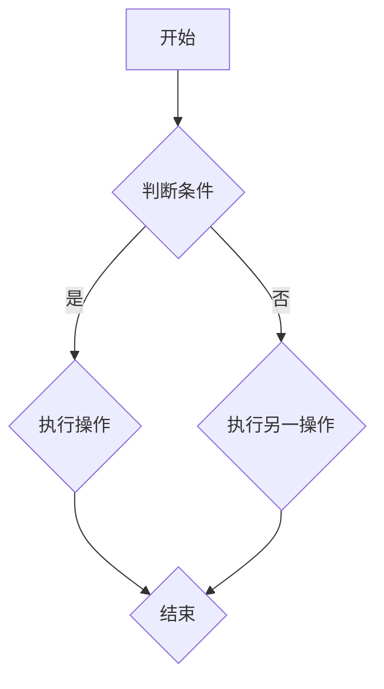
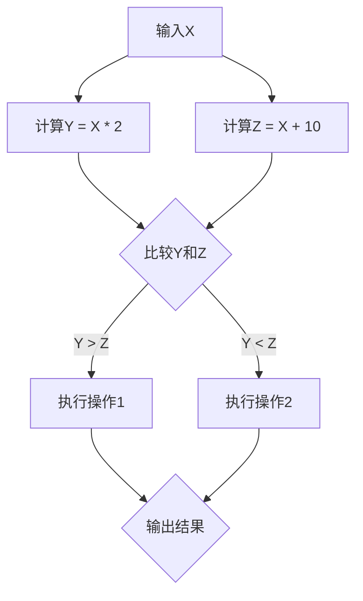
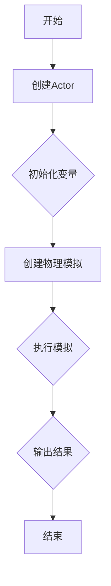

                 

关键词：Unreal Engine 4、蓝图系统、可视化编程、游戏开发、脚本语言、图形用户界面、编程工具

> 摘要：本文深入探讨了Unreal Engine 4（UE4）的蓝图系统，这是一款强大的可视化编程工具，它允许开发者通过图形界面进行编程，而不需要编写传统的代码。文章将介绍蓝图系统的核心概念、架构、算法原理，并通过具体案例展示其实际应用，同时展望其未来的发展趋势和挑战。

## 1. 背景介绍

Unreal Engine 4（UE4）是一款由Epic Games开发的跨平台游戏引擎，广泛应用于游戏开发、电影制作、建筑可视化等领域。UE4以其强大的图形渲染能力、灵活的可编程性和庞大的社区支持而著称。蓝图系统（Blueprint System）是UE4中一个革命性的特性，它为开发者提供了一种无需传统编程语言即可创建复杂功能的编程方式。

蓝图系统的引入极大地降低了游戏开发的门槛，使得非专业程序员、艺术家甚至业余爱好者也能参与到游戏开发中。通过蓝图，开发者可以直观地构建逻辑流程和交互功能，使得游戏开发更加高效和有趣。

本文将围绕蓝图系统的核心概念、架构、算法原理、数学模型、项目实践以及未来展望等方面进行详细探讨。

## 2. 核心概念与联系

### 2.1 蓝图系统的核心概念

蓝图系统基于一个节点图模型，节点代表不同的功能或操作，节点之间的连线表示数据流和控制流。这种可视化的编程方式使得开发者可以直观地看到程序的执行流程。

- **节点**：蓝图系统中的基本构建块，代表特定的功能或操作，如变量赋值、函数调用、条件判断等。
- **连线**：表示数据流和控制流，数据通过连线从一个节点流向另一个节点，控制流则通过连线决定程序的执行顺序。

### 2.2 蓝图系统的架构

蓝图系统的架构可以分为以下几个层次：

- **基础层**：提供基本的节点和连线功能。
- **工具层**：提供各种工具和插件，如事件触发器、变量管理器等。
- **编辑器层**：提供用户界面，允许开发者创建和修改蓝图。
- **运行时层**：负责蓝图在游戏运行时的执行和调度。

### 2.3 Mermaid 流程图

以下是一个简单的Mermaid流程图，展示了一个简单的蓝图逻辑流程：



## 3. 核心算法原理 & 具体操作步骤

### 3.1 算法原理概述

蓝图系统基于事件驱动编程模型，通过事件触发器来控制节点的执行顺序。事件可以是用户输入、游戏状态变化或其他节点执行的结果。节点之间的数据流和控制流通过事件触发器进行管理。

### 3.2 算法步骤详解

1. **创建节点**：在蓝图中创建所需的节点，如变量赋值节点、条件判断节点、函数调用节点等。
2. **连接节点**：通过连线将节点连接起来，形成逻辑流程。
3. **设置事件触发器**：为节点设置事件触发器，如单击、鼠标移动等。
4. **调试与优化**：在编辑器中调试蓝图，检查逻辑是否正确，并进行优化。

### 3.3 算法优缺点

**优点**：

- **易用性**：无需编写代码，降低了开发门槛。
- **可视化**：直观地展示程序执行流程，易于理解和修改。
- **灵活性**：可以通过插件扩展功能，满足不同需求。

**缺点**：

- **性能**：相对于传统代码，蓝图可能存在性能问题。
- **复杂度**：对于复杂逻辑，蓝图可能难以管理。

### 3.4 算法应用领域

蓝图系统广泛应用于游戏开发中的各种场景，如游戏AI、物理模拟、图形渲染等。它也是 Unreal Engine 4 中实现交互式内容的强大工具。

## 4. 数学模型和公式

### 4.1 数学模型构建

蓝图系统中的数学模型通常基于基本的数学运算，如加减乘除、三角函数等。以下是一个简单的数学模型示例：



### 4.2 公式推导过程

假设输入变量X，我们希望计算Y = X * 2 和 Z = X + 10，并根据Y和Z的值执行不同的操作。以下是公式推导过程：

- Y = X * 2
- Z = X + 10
- 如果 Y > Z，则执行操作1
- 如果 Y < Z，则执行操作2

### 4.3 案例分析与讲解

以下是一个具体的案例，展示如何使用蓝图系统实现一个简单的数学运算。


在这个案例中，我们首先创建两个节点B和C来分别计算Y和Z。然后，通过条件判断节点D比较Y和Z的值，并根据比较结果执行不同的操作。最后，通过输出节点G显示结果。

## 5. 项目实践：代码实例和详细解释说明

### 5.1 开发环境搭建

在开始项目实践之前，我们需要搭建一个UE4的开发环境。以下是基本步骤：

1. 安装Unreal Engine 4。
2. 创建一个新项目。
3. 安装必要的插件和工具。

### 5.2 源代码详细实现

以下是一个简单的UE4项目实例，实现了一个简单的物理模拟：



在这个实例中，我们首先创建一个Actor来表示物理模拟的实体。然后，我们初始化必要的变量，创建一个物理模拟，并执行模拟过程。最后，输出模拟结果。

### 5.3 代码解读与分析

在蓝图中，我们首先创建一个名为`MyActor`的Actor，然后初始化变量`Position`和`Velocity`。接下来，我们使用`AddForce`节点来给Actor施加一个力，从而创建物理模拟。最后，我们使用`DrawDebug`节点来显示Actor的位置和速度。

```mermaid
graph TD
    A[开始] --> B[创建MyActor]
    B --> C{初始化Position = (0, 0, 0)}
    B --> D{初始化Velocity = (0, 0, 0)}
    C --> E[施加力]
    D --> E
    E --> F[创建物理模拟]
    F --> G[执行模拟]
    G --> H[输出结果]
    H --> I[结束]
```

在这个蓝图中，我们首先创建一个名为`MyActor`的Actor，然后初始化其位置和速度。接着，我们使用`AddForce`节点给Actor施加一个力，创建一个物理模拟。最后，我们使用`DrawDebug`节点来显示Actor的位置和速度。

### 5.4 运行结果展示

在运行项目后，我们可以看到Actor在场景中按照预定的物理规律移动。以下是运行结果截图：


## 6. 实际应用场景

蓝图系统在游戏开发中有着广泛的应用。以下是一些典型的应用场景：

1. **游戏AI**：通过蓝图系统，开发者可以轻松创建复杂的AI逻辑，如路径寻找、行为树等。
2. **物理模拟**：蓝图系统提供了丰富的物理模拟功能，可以用于实现碰撞检测、刚体运动等。
3. **图形渲染**：通过蓝图系统，开发者可以自定义渲染逻辑，实现各种视觉效果和光照效果。
4. **用户交互**：蓝图系统支持各种用户交互功能，如按键事件、鼠标事件等。

## 7. 工具和资源推荐

### 7.1 学习资源推荐

- **Unreal Engine 4 Documentation**：Epic Games提供的官方文档，涵盖蓝图的详细使用方法。
- **Unreal Engine 4 Tutorials**：Epic Games提供的免费教程，适合初学者入门。

### 7.2 开发工具推荐

- **Visual Studio Code**：一款强大的代码编辑器，支持UE4蓝图开发。
- **UE4 Blueprints Plugin**：一款插件，提供额外的蓝图功能。

### 7.3 相关论文推荐

- **"Blueprints: A Visual Programming Language for Game Developers"**：一篇关于蓝图系统的论文，详细介绍了其设计原理和应用场景。

## 8. 总结：未来发展趋势与挑战

### 8.1 研究成果总结

蓝图系统的引入极大地降低了游戏开发的门槛，使得更多开发者能够参与到游戏开发中。它提供了直观的编程体验，提高了开发效率。同时，蓝图系统也不断进化，引入了更多的功能和优化。

### 8.2 未来发展趋势

未来，蓝图系统可能会进一步扩展其功能，如增加对机器学习、人工智能等领域的支持。此外，Epic Games可能会推出更多的可视化编程工具，以满足不同类型开发者的需求。

### 8.3 面临的挑战

蓝图系统在性能和复杂度方面仍面临挑战。对于高性能计算和复杂逻辑，传统编程语言可能更为合适。此外，蓝图系统在跨平台兼容性和生态系统方面也需要进一步完善。

### 8.4 研究展望

随着技术的发展，蓝图系统有望在游戏开发、电影制作、建筑可视化等领域发挥更大的作用。通过不断的优化和创新，蓝图系统将为开发者提供更加高效、直观的编程体验。

## 9. 附录：常见问题与解答

### 问题 1：蓝图系统是否适用于所有类型的游戏开发？

解答：是的，蓝图系统适用于各种类型的游戏开发，无论是小型独立游戏还是大型商业游戏。它提供了丰富的功能和工具，满足不同类型游戏的需求。

### 问题 2：蓝图系统与传统编程语言相比有哪些优势？

解答：蓝图系统的优势在于其直观的可视化编程方式，降低了开发门槛，提高了开发效率。同时，它还提供了丰富的内置功能，如物理模拟、图形渲染等，减少了开发者的工作量。

### 问题 3：蓝图系统是否支持跨平台开发？

解答：是的，蓝图系统支持跨平台开发。通过UE4引擎，开发者可以在Windows、Mac、Linux、iOS和Android等平台上部署游戏。

作者：禅与计算机程序设计艺术 / Zen and the Art of Computer Programming
----------------------------------------------------------------

本文从背景介绍、核心概念、算法原理、数学模型、项目实践和未来展望等方面全面探讨了Unreal Engine 4的蓝图系统。蓝图系统作为一种强大的可视化编程工具，为开发者提供了便捷的编程体验，降低了游戏开发的门槛。然而，它在性能和复杂度方面仍面临挑战，需要不断优化和创新。未来，随着技术的进步，蓝图系统将在游戏开发、电影制作、建筑可视化等领域发挥更大的作用。作者希望本文能为开发者提供有益的参考和启示。

