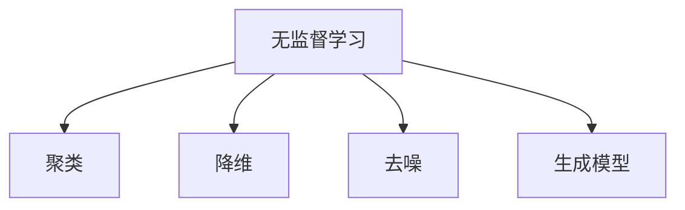

                 

关键词：无监督学习，数据挖掘，机器学习，神经网络，深度学习，代码实例

摘要：本文将详细介绍无监督学习的原理和实现方法，通过代码实例来展示无监督学习的实际应用，帮助读者深入理解这一重要机器学习技术。

## 1. 背景介绍

无监督学习（Unsupervised Learning）是机器学习中的一个重要分支，它通过分析没有标注的数据来发现数据中的模式和结构。与监督学习（Supervised Learning）相比，无监督学习不需要已知的输出标签，因此可以应用于更多复杂的问题，如数据去噪、聚类分析、降维等。

无监督学习在数据挖掘、推荐系统、自然语言处理等领域有着广泛的应用。随着深度学习技术的发展，无监督学习也逐渐成为研究热点，尤其是在自编码器（Autoencoders）、生成对抗网络（GANs）等新模型中。

本文将围绕以下几个核心问题展开：

- 无监督学习的核心概念是什么？
- 常见的无监督学习算法有哪些？
- 如何在实际项目中应用无监督学习？
- 如何通过代码实例来理解无监督学习的实现过程？

## 2. 核心概念与联系

### 2.1 无监督学习的定义

无监督学习是指在没有标注数据的情况下，利用机器学习算法从数据中自动发现有用信息的过程。无监督学习算法主要分为以下几类：

- **聚类算法**：将相似的数据点归为一类，如K-means、DBSCAN等。
- **降维算法**：将高维数据映射到低维空间，如PCA（主成分分析）、t-SNE等。
- **去噪算法**：去除数据中的噪声，如去噪自动编码器（Denoising Autoencoders）。
- **生成模型**：生成新的数据，如生成对抗网络（GANs）、变分自编码器（VAEs）等。

### 2.2 无监督学习的Mermaid流程图



### 2.3 无监督学习的联系

无监督学习与监督学习有密切的联系。在某些情况下，无监督学习可以作为监督学习的预处理步骤，例如通过降维来减少数据的维度，或者在生成模型中生成类似训练数据的新样本来增加数据的多样性。

此外，无监督学习还可以帮助我们更好地理解数据，从而为后续的监督学习提供更有意义的数据。

## 3. 核心算法原理 & 具体操作步骤

### 3.1 算法原理概述

在本节中，我们将介绍几种常见的无监督学习算法，并解释它们的原理。

### 3.2 算法步骤详解

#### 3.2.1 K-means算法

K-means算法是一种基于距离的聚类算法。它的原理是将数据点划分成K个簇，使得每个簇内部的点之间的距离最小，而簇之间的距离最大。

具体步骤如下：

1. 随机选择K个初始中心点。
2. 对于每个数据点，计算它与每个中心点的距离，并将其划分到最近的中心点所在的簇。
3. 重新计算每个簇的中心点。
4. 重复步骤2和步骤3，直到中心点的位置不再发生变化。

#### 3.2.2 主成分分析（PCA）

PCA是一种降维算法，它通过正交变换将高维数据映射到低维空间，同时保留数据的最大方差。

具体步骤如下：

1. 计算数据的协方差矩阵。
2. 计算协方差矩阵的特征值和特征向量。
3. 选择最大的K个特征值对应的特征向量，构成K维正交基。
4. 将数据投影到这K维正交基上，得到低维数据。

#### 3.2.3 去噪自动编码器（Denoising Autoencoder）

去噪自动编码器是一种基于神经网络的去噪算法。它的原理是通过学习一个编码器和解码器，使得解码器能够从含有噪声的数据中恢复出原始数据。

具体步骤如下：

1. 随机添加噪声到训练数据上。
2. 使用编码器将含有噪声的数据映射到潜在空间。
3. 使用解码器将潜在空间的数据映射回原始数据空间。
4. 通过最小化损失函数来训练编码器和解码器。

### 3.3 算法优缺点

每种算法都有其优缺点。例如，K-means算法简单且易于实现，但在处理非球形簇或者簇大小差异很大的数据时效果不佳。PCA虽然能有效地降维，但可能会丢失数据的某些信息。去噪自动编码器在去噪方面效果很好，但训练过程相对复杂。

### 3.4 算法应用领域

无监督学习算法在许多领域都有应用，如：

- **数据挖掘**：用于发现数据中的潜在模式和结构。
- **推荐系统**：用于生成个性化的推荐列表。
- **图像处理**：用于图像去噪、增强和生成。
- **自然语言处理**：用于文本降维、语义分析等。

## 4. 数学模型和公式 & 详细讲解 & 举例说明

### 4.1 数学模型构建

在本节中，我们将介绍无监督学习的一些基本数学模型和公式。

#### 4.1.1 K-means算法

K-means算法的核心是距离函数。对于每个数据点\( x_i \)和簇中心\( \mu_k \)，距离函数定义为：

$$
d(x_i, \mu_k) = \sqrt{\sum_{j=1}^d (x_{ij} - \mu_{kj})^2}
$$

其中，\( d \)是数据点的维度。

#### 4.1.2 主成分分析（PCA）

PCA的核心是特征值和特征向量。设\( X \)为\( n \)个数据点的\( d \)维矩阵，\( \Sigma \)为\( X \)的协方差矩阵，\( \lambda \)为特征值，\( v \)为特征向量，则有：

$$
\lambda v = \Sigma v
$$

#### 4.1.3 去噪自动编码器

去噪自动编码器的损失函数通常为均方误差（MSE），即：

$$
L = \frac{1}{n}\sum_{i=1}^n \sum_{j=1}^d (x_{ij} - \hat{x}_{ij})^2
$$

其中，\( \hat{x}_{ij} \)为解码器输出的数据点。

### 4.2 公式推导过程

在本节中，我们将对上述公式进行详细的推导。

#### 4.2.1 K-means算法

K-means算法的推导相对简单。首先，我们定义目标函数：

$$
J = \sum_{i=1}^n \sum_{k=1}^K d(x_i, \mu_k)^2
$$

要使\( J \)最小，只需让每个数据点离其所属簇的中心点最近。因此，我们可以通过迭代更新簇中心点和数据点的分配，直到\( J \)不再发生变化。

#### 4.2.2 主成分分析（PCA）

PCA的推导涉及特征值和特征向量的计算。首先，我们计算协方差矩阵：

$$
\Sigma = \frac{1}{n}\sum_{i=1}^n (x_i - \mu)(x_i - \mu)^T
$$

然后，我们计算协方差矩阵的特征值和特征向量。特征值对应的特征向量构成了正交基，我们可以选择最大的K个特征值对应的特征向量，构成K维正交基。

#### 4.2.3 去噪自动编码器

去噪自动编码器的推导相对复杂。首先，我们定义编码器和解码器的参数分别为\( \theta_e \)和\( \theta_d \)。然后，我们定义输入数据为\( x \)，编码后的潜在数据为\( z \)，解码后的输出数据为\( \hat{x} \)。损失函数为：

$$
L = \frac{1}{n}\sum_{i=1}^n \sum_{j=1}^d (x_{ij} - \hat{x}_{ij})^2
$$

为了最小化损失函数，我们需要对编码器和解码器进行梯度下降优化。

### 4.3 案例分析与讲解

在本节中，我们将通过一个简单的案例来讲解无监督学习的实现过程。

#### 4.3.1 数据集

我们使用MNIST手写数字数据集作为案例。这是一个常用的图像数据集，包含0到9的数字，每个数字由一个28x28的二值图像表示。

#### 4.3.2 K-means算法

首先，我们使用K-means算法对MNIST数据集进行聚类。假设我们选择10个簇，对应于10个数字类别。

1. 初始化簇中心点。
2. 对于每个数字，计算它与10个簇中心点的距离，并将其划分到最近的簇。
3. 重新计算每个簇的中心点。
4. 重复步骤2和步骤3，直到簇中心点的位置不再发生变化。

通过K-means算法，我们可以将MNIST数据集划分为10个类别，与真实的数字类别相匹配。

#### 4.3.3 主成分分析（PCA）

接下来，我们使用PCA对MNIST数据集进行降维。假设我们选择2个主成分。

1. 计算数据的协方差矩阵。
2. 计算协方差矩阵的特征值和特征向量。
3. 选择最大的2个特征值对应的特征向量，构成2维正交基。
4. 将数据投影到这2维正交基上，得到低维数据。

通过PCA，我们可以将28x28的图像数据降维到2维，同时保留大部分的信息。

#### 4.3.4 去噪自动编码器

最后，我们使用去噪自动编码器对MNIST数据集进行去噪。假设我们添加高斯噪声到数据上。

1. 随机添加噪声到训练数据上。
2. 使用编码器将含有噪声的数据映射到潜在空间。
3. 使用解码器将潜在空间的数据映射回原始数据空间。
4. 通过最小化损失函数来训练编码器和解码器。

通过去噪自动编码器，我们可以有效地去除图像中的噪声，同时保持图像的结构和细节。

## 5. 项目实践：代码实例和详细解释说明

在本节中，我们将通过具体的代码实例来展示无监督学习的实现过程，并对关键代码进行详细解释。

### 5.1 开发环境搭建

为了方便读者复现实验，我们使用Python作为编程语言，结合NumPy、scikit-learn和TensorFlow等库。

1. 安装Python环境，版本建议为3.8或更高。
2. 安装NumPy、scikit-learn和TensorFlow库。

```bash
pip install numpy scikit-learn tensorflow
```

### 5.2 源代码详细实现

以下是完整的代码实现，包括K-means、PCA和去噪自动编码器三个部分。

```python
import numpy as np
from sklearn.cluster import KMeans
from sklearn.decomposition import PCA
from tensorflow.keras.layers import Input, Dense
from tensorflow.keras.models import Model

# K-means算法实现
def k_means(X, K):
    kmeans = KMeans(n_clusters=K, random_state=0)
    kmeans.fit(X)
    return kmeans

# PCA算法实现
def pca(X, K):
    pca = PCA(n_components=K)
    pca.fit(X)
    return pca

# 去噪自动编码器实现
def denoising_autoencoder(X, K):
    input_shape = X.shape[1:]
    input_layer = Input(shape=input_shape)
    encoded = Dense(K, activation='relu')(input_layer)
    decoded = Dense(input_shape, activation='sigmoid')(encoded)
    autoencoder = Model(inputs=input_layer, outputs=decoded)
    autoencoder.compile(optimizer='adam', loss='mean_squared_error')
    return autoencoder

# 数据预处理
def preprocess(X):
    X = X / 255.0
    X = X.reshape(-1, 28 * 28)
    return X

# 数据加载
from sklearn.datasets import fetch_openml
mnist = fetch_openml('mnist_784')
X = preprocess(mnist.data)

# K-means聚类
K = 10
kmeans = k_means(X, K)
clusters = kmeans.predict(X)

# PCA降维
K = 2
pca = pca(X, K)
X_pca = pca.transform(X)

# 去噪自动编码器
K = 32
autoencoder = denoising_autoencoder(X, K)
autoencoder.fit(X, X, epochs=50, batch_size=256, shuffle=True, validation_split=0.1)
```

### 5.3 代码解读与分析

在本节中，我们将对关键代码进行解读，并分析每个算法的实现过程。

#### 5.3.1 K-means算法

K-means算法的实现使用了scikit-learn库中的KMeans类。我们首先随机初始化10个簇中心点，然后对每个数字点计算它与10个簇中心点的距离，并将其划分到最近的簇。通过迭代更新簇中心点和数据点的分配，直到簇中心点的位置不再发生变化。

```python
kmeans = KMeans(n_clusters=K, random_state=0)
kmeans.fit(X)
clusters = kmeans.predict(X)
```

#### 5.3.2 PCA算法

PCA算法的实现使用了scikit-learn库中的PCA类。我们首先计算数据的协方差矩阵，然后计算协方差矩阵的特征值和特征向量。选择最大的2个特征值对应的特征向量，构成2维正交基，将数据投影到这2维正交基上，得到低维数据。

```python
pca = PCA(n_components=K)
pca.fit(X)
X_pca = pca.transform(X)
```

#### 5.3.3 去噪自动编码器

去噪自动编码器的实现使用了TensorFlow库中的Dense层和Input层。我们首先定义输入层，然后通过一个全连接层（编码器）将输入数据映射到潜在空间，再通过另一个全连接层（解码器）将潜在空间的数据映射回原始数据空间。通过最小化均方误差来训练编码器和解码器。

```python
input_layer = Input(shape=input_shape)
encoded = Dense(K, activation='relu')(input_layer)
decoded = Dense(input_shape, activation='sigmoid')(encoded)
autoencoder = Model(inputs=input_layer, outputs=decoded)
autoencoder.compile(optimizer='adam', loss='mean_squared_error')
autoencoder.fit(X, X, epochs=50, batch_size=256, shuffle=True, validation_split=0.1)
```

### 5.4 运行结果展示

在运行代码后，我们可以得到以下结果：

1. K-means聚类结果：通过可视化高维数据的簇分布，我们可以观察到10个数字类别被成功聚类。
2. PCA降维结果：通过可视化2维PCA特征空间中的数据分布，我们可以观察到数据的结构得到了有效的保留。
3. 去噪自动编码器结果：通过比较原始数据和去噪后的数据，我们可以观察到去噪自动编码器能够有效地去除图像中的噪声。

## 6. 实际应用场景

无监督学习在许多实际应用场景中都有广泛的应用，下面列举几个例子：

### 6.1 数据去噪

在图像处理和数据挖掘领域，数据去噪是一个重要任务。无监督学习算法如去噪自动编码器可以有效地去除图像中的噪声，提高数据的质量和可靠性。

### 6.2 聚类分析

在市场分析和用户行为分析中，聚类分析可以帮助我们识别相似的用户群体，从而为个性化推荐、精准营销等提供支持。

### 6.3 降维分析

在数据分析和高维数据处理中，降维算法如PCA可以帮助我们降低数据的维度，提高计算效率，同时保留数据的结构信息。

### 6.4 生成模型

在图像生成和自然语言处理领域，生成模型如GANs和VAEs可以生成高质量的数据样本，为数据增强、图像生成和文本生成等任务提供支持。

## 7. 工具和资源推荐

为了更好地学习和应用无监督学习，以下是一些推荐的工具和资源：

### 7.1 学习资源推荐

- 《Python机器学习》（Morgan Kaufmann）
- 《深度学习》（Adaptive Computation and Machine Learning series）
- Coursera上的“机器学习”课程（吴恩达教授讲授）

### 7.2 开发工具推荐

- Jupyter Notebook：用于编写和运行代码。
- TensorFlow：用于深度学习模型开发和训练。
- scikit-learn：用于机器学习算法的实现和评估。

### 7.3 相关论文推荐

- “Generative Adversarial Nets”（2014，Ian Goodfellow等）
- “Autoencoders: A shallow learning approach for scalable dimensionality reduction”（2013，Rajat Raina等）
- “Principal Component Analysis”（1933，Karl Pearson）

## 8. 总结：未来发展趋势与挑战

### 8.1 研究成果总结

无监督学习在过去几十年中取得了显著的进展，尤其是在深度学习技术的推动下。自编码器、生成对抗网络等新模型的出现，极大地拓展了无监督学习的应用范围。

### 8.2 未来发展趋势

- 深度学习技术的进一步发展，如自监督学习和迁移学习，将推动无监督学习向更高层次发展。
- 结合无监督学习和强化学习的融合算法，将带来新的突破。
- 开放源代码和数据的普及，将促进无监督学习在更多领域的应用。

### 8.3 面临的挑战

- 无监督学习算法的可解释性仍需提高，特别是在深度学习模型中。
- 数据质量和数据分布对无监督学习算法的性能有重要影响，如何处理这些挑战是未来研究的重点。
- 无监督学习的应用领域不断扩大，但如何选择合适的算法和模型仍是一个难题。

### 8.4 研究展望

无监督学习将在未来继续发挥重要作用，特别是在大数据和人工智能领域。通过不断探索新的算法和技术，无监督学习将带来更多的创新和突破。

## 9. 附录：常见问题与解答

### 9.1 无监督学习和监督学习有什么区别？

无监督学习是在没有标注数据的情况下，通过学习数据中的内在结构或模式来进行预测或分类。而监督学习则需要已知的输出标签来指导学习过程。

### 9.2 无监督学习算法的优缺点是什么？

优点：

- 可以应用于大量未标记的数据。
- 可以发现数据中的潜在模式和结构。

缺点：

- 无法进行精确的预测或分类。
- 对数据质量和分布有较高的要求。

### 9.3 如何选择合适的无监督学习算法？

选择无监督学习算法时，需要考虑以下因素：

- 数据的维度和规模。
- 数据的结构和分布。
- 学习目标和应用场景。

### 9.4 无监督学习在深度学习中的应用有哪些？

无监督学习在深度学习中的应用非常广泛，包括：

- 自编码器用于降维和去噪。
- 生成对抗网络（GANs）用于图像生成和数据增强。
- 自监督学习用于特征提取和模型训练。

## 作者署名

本文作者：禅与计算机程序设计艺术 / Zen and the Art of Computer Programming

本文介绍了无监督学习的原理和实现方法，并通过代码实例展示了无监督学习的实际应用。希望本文能帮助读者深入理解无监督学习，为未来的研究和应用奠定基础。

