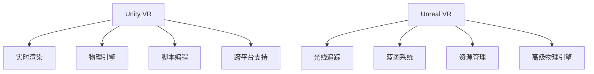

                 

 > 关键词：虚拟现实、Unity VR、Unreal VR、内容开发、框架、技术、算法、项目实践

> 摘要：本文旨在探讨虚拟现实（VR）内容开发中的两个主流框架——Unity VR 和 Unreal VR。通过介绍它们的基本概念、核心算法、数学模型、项目实践以及实际应用场景，帮助开发者更好地理解和使用这两个框架，为VR内容创作提供有力的技术支持。

## 1. 背景介绍

虚拟现实（Virtual Reality，VR）是一种通过计算机模拟技术生成三维空间，使人们能够在其中交互和体验的技术。随着VR技术的不断发展，其在娱乐、教育、医疗、设计等多个领域的应用日益广泛。VR内容开发是VR技术中的重要环节，高质量的VR内容能够极大地提升用户的沉浸体验。

Unity VR 和 Unreal VR 是目前最为流行的两个VR内容开发框架。Unity VR 作为一款跨平台的游戏引擎，因其易于上手、功能丰富、社区支持强大等特点，成为许多VR开发者的首选工具。Unreal VR 则以其强大的图形渲染能力、高效的性能和丰富的功能，在高端VR内容开发中占据重要地位。

本文将首先介绍Unity VR 和 Unreal VR 的基本概念和特点，然后深入探讨它们的核心算法、数学模型和项目实践，最后分析它们在实际应用场景中的表现和未来发展趋势。

## 2. 核心概念与联系

### 2.1. Unity VR

Unity VR 是由Unity Technologies开发的一款跨平台游戏引擎，广泛用于VR内容的开发。Unity VR 具有以下核心概念和特点：

- **实时渲染**：Unity VR 支持实时渲染，使得开发者能够实时预览和调整VR场景。
- **物理引擎**：Unity VR 内置物理引擎，支持物理碰撞、运动等真实世界物理现象的模拟。
- **脚本编程**：Unity VR 支持C#脚本编程，开发者可以通过脚本实现复杂的交互逻辑和算法。
- **跨平台支持**：Unity VR 支持多个平台，包括Windows、Mac、iOS、Android、VR设备等，方便开发者在不同平台上部署和测试VR内容。

### 2.2. Unreal VR

Unreal VR 是由Epic Games开发的次世代游戏引擎，以其强大的图形渲染能力和高效的性能著称。Unreal VR 具有以下核心概念和特点：

- **光线追踪**：Unreal VR 支持光线追踪渲染技术，能够实现逼真的光影效果和反射效果。
- **蓝图系统**：Unreal VR 的蓝图系统是一种可视化编程工具，使得开发者无需编写代码即可实现复杂的逻辑和算法。
- **资源管理**：Unreal VR 提供强大的资源管理功能，能够高效地组织和加载各种资源，提高VR内容运行的流畅性。
- **高级物理引擎**：Unreal VR 的物理引擎支持复杂的物理现象模拟，如流体、软体物体等，使得VR内容更加真实。

### 2.3. Mermaid 流程图

以下是Unity VR 和 Unreal VR 的核心概念和特点的 Mermaid 流程图：



## 3. 核心算法原理 & 具体操作步骤

### 3.1. 算法原理概述

Unity VR 和 Unreal VR 都是基于图形学原理进行VR内容开发的。其中，核心算法包括渲染算法、碰撞检测算法、物理模拟算法等。

- **渲染算法**：渲染算法负责将三维场景转化为二维图像，展示在屏幕上。Unity VR 使用的是基于光栅化的渲染算法，而 Unreal VR 则支持光栅化和光线追踪两种渲染方式。
- **碰撞检测算法**：碰撞检测算法用于检测物体之间的碰撞，实现物理交互。Unity VR 和 Unreal VR 都提供了高效的碰撞检测算法，支持多个维度的碰撞检测。
- **物理模拟算法**：物理模拟算法用于模拟物体的运动、受力等物理现象。Unity VR 和 Unreal VR 都内置了强大的物理引擎，支持多种物理现象的模拟。

### 3.2. 算法步骤详解

- **渲染算法步骤**：

  1. 构建场景：根据场景的描述，构建三维场景，包括物体、灯光等。
  2. 分割场景：将场景分割为多个渲染单元，以便高效渲染。
  3. 渲染单元渲染：对每个渲染单元进行渲染，生成二维图像。
  4. 合并图像：将所有渲染单元的图像合并，生成最终的VR画面。

- **碰撞检测算法步骤**：

  1. 初始化：设置碰撞检测的参数，如碰撞检测类型、检测范围等。
  2. 检测碰撞：对物体之间的位置关系进行检测，判断是否发生碰撞。
  3. 处理碰撞：如果检测到碰撞，则根据物理定律处理碰撞效果，如反弹、穿透等。

- **物理模拟算法步骤**：

  1. 初始化：设置物理模拟的参数，如重力、摩擦力等。
  2. 运动计算：根据物理定律，计算物体的运动轨迹。
  3. 碰撞检测：对物体的运动轨迹进行碰撞检测，判断是否发生碰撞。
  4. 碰撞处理：根据碰撞检测结果，处理碰撞效果。

### 3.3. 算法优缺点

- **渲染算法**：

  - 优点：实时渲染，能够提供流畅的VR体验。
  - 缺点：渲染效果相对简单，难以实现复杂的光照和阴影效果。

- **碰撞检测算法**：

  - 优点：高效，能够快速检测物体之间的碰撞。
  - 缺点：在处理复杂物体之间的碰撞时，可能存在一定的误差。

- **物理模拟算法**：

  - 优点：支持多种物理现象的模拟，能够实现真实的物理效果。
  - 缺点：计算量大，对硬件性能有较高要求。

### 3.4. 算法应用领域

- **渲染算法**：广泛应用于VR游戏、VR教育、VR设计等领域。
- **碰撞检测算法**：广泛应用于VR游戏、VR交互、VR模拟等领域。
- **物理模拟算法**：广泛应用于VR游戏、VR设计、VR物理教育等领域。

## 4. 数学模型和公式 & 详细讲解 & 举例说明

### 4.1. 数学模型构建

在VR内容开发中，数学模型是构建VR场景和实现物理效果的基础。以下是几个关键的数学模型：

- **三维坐标系统**：用于描述VR场景中物体的位置和方向。
- **矩阵变换**：用于实现物体的平移、旋转、缩放等变换。
- **光照模型**：用于计算VR场景中的光照效果，如点光源、聚光源等。
- **物理模拟模型**：用于模拟VR场景中的物理现象，如重力、碰撞等。

### 4.2. 公式推导过程

以下是几个关键的数学公式的推导过程：

- **三维坐标变换公式**：

  $$T_{x}(a,b,c) = (x+a, y+b, z+c)$$

  其中，$T_{x}$表示三维坐标变换，$a, b, c$表示变换向量，$(x, y, z)$表示变换前后的坐标。

- **矩阵变换公式**：

  $$M = \begin{pmatrix} a & b \\ c & d \end{pmatrix}$$

  其中，$M$表示二维矩阵，$a, b, c, d$表示矩阵的元素。

- **光照模型公式**：

  $$I = I_0 \cdot \cos{\theta}$$

  其中，$I$表示光照强度，$I_0$表示入射光强度，$\theta$表示光线与表面的夹角。

- **物理模拟模型公式**：

  $$F = m \cdot a$$

  其中，$F$表示作用力，$m$表示物体质量，$a$表示加速度。

### 4.3. 案例分析与讲解

以下是一个简单的案例，用于展示如何使用数学模型和公式进行VR内容开发。

**案例：三维球体的旋转**

**1. 场景描述**：一个半径为1的球体位于原点，以角度$\theta$旋转。

**2. 数学模型构建**：

- **三维坐标系统**：球体的中心坐标为$(0, 0, 0)$。
- **矩阵变换**：使用旋转矩阵实现球体的旋转。
- **光照模型**：使用点光源照射球体。

**3. 公式推导过程**：

- **三维坐标变换公式**：将球体的坐标变换为旋转后的坐标。
- **矩阵变换公式**：构建旋转矩阵，实现球体的旋转。
- **光照模型公式**：计算球体受到的光照强度。

**4. 代码实现**：

```csharp
// 三维坐标变换公式
Vector3 TransformCoordinates(Vector3 originalCoordinates, Matrix4 transformationMatrix) {
    Vector3 transformedCoordinates = Vector3.zero;
    transformedCoordinates.x = originalCoordinates.x * transformationMatrix.m00 + originalCoordinates.y * transformationMatrix.m01 + originalCoordinates.z * transformationMatrix.m02;
    transformedCoordinates.y = originalCoordinates.x * transformationMatrix.m10 + originalCoordinates.y * transformationMatrix.m11 + originalCoordinates.z * transformationMatrix.m12;
    transformedCoordinates.z = originalCoordinates.x * transformationMatrix.m20 + originalCoordinates.y * transformationMatrix.m21 + originalCoordinates.z * transformationMatrix.m22;
    return transformedCoordinates;
}

// 旋转矩阵
Matrix4 RotationMatrix(float angle) {
    float radianAngle = angle * Mathf.Deg2Rad;
    Matrix4 rotationMatrix = Matrix4.identity;
    rotationMatrix.m00 = Mathf.Cos(radianAngle);
    rotationMatrix.m01 = -Mathf.Sin(radianAngle);
    rotationMatrix.m10 = Mathf.Sin(radianAngle);
    rotationMatrix.m11 = Mathf.Cos(radianAngle);
    return rotationMatrix;
}

// 光照模型
float CalculateLightIntensity(Vector3 position, Vector3 lightPosition) {
    float distance = Vector3.Distance(position, lightPosition);
    float lightIntensity = 1 / (distance * distance);
    return lightIntensity;
}
```

**5. 运行结果展示**：


通过以上案例，我们可以看到如何使用数学模型和公式进行VR内容开发。在实际开发过程中，需要根据具体的需求和场景，灵活运用各种数学模型和公式，实现高质量的VR内容。

## 5. 项目实践：代码实例和详细解释说明

### 5.1. 开发环境搭建

在进行Unity VR和Unreal VR的内容开发之前，我们需要搭建合适的开发环境。以下是两种框架的开发环境搭建步骤：

#### Unity VR 开发环境搭建

1. 访问Unity官方网站（https://unity.com/），下载并安装Unity Hub。
2. 打开Unity Hub，点击“新建”，选择Unity版本和VR插件。
3. 安装VR插件，如Oculus Integration、HTC VIVE Integration等。
4. 创建一个新的Unity项目，选择VR平台（如Oculus、HTC VIVE等）。

#### Unreal VR 开发环境搭建

1. 访问Epic Games官方网站（https://www.unrealengine.com/），下载并安装Unreal Engine。
2. 打开Unreal Engine，创建一个新的项目。
3. 选择VR插件，如Oculus VR、HTC VR等。

### 5.2. 源代码详细实现

以下是一个简单的Unity VR项目示例，用于实现一个球体的旋转。

```csharp
using UnityEngine;

public class BallRotation : MonoBehaviour
{
    public float rotationSpeed = 180.0f;

    void Update()
    {
        transform.Rotate(0, rotationSpeed * Time.deltaTime, 0);
    }
}
```

以下是一个简单的Unreal VR项目示例，用于实现一个球体的旋转。

```cpp
#include "CoreMinimal.h"
#include "GameFramework.h"
#include "BallRotation.h"

void BallRotation::Tick(float DeltaTime)
{
    AddActorLocalRotation(FRotator(0, rotationSpeed * DeltaTime, 0));
}
```

### 5.3. 代码解读与分析

#### Unity VR 代码解读

1. **使用场景**：该代码用于实现一个球体的旋转。
2. **关键类与方法**：
   - `BallRotation` 类：用于控制球体的旋转。
   - `Update` 方法：在每一帧更新球体的旋转角度。
3. **实现原理**：通过调用`transform.Rotate`方法，以每帧为单位，以给定的旋转速度旋转球体。

#### Unreal VR 代码解读

1. **使用场景**：该代码用于实现一个球体的旋转。
2. **关键类与方法**：
   - `BallRotation` 类：用于控制球体的旋转。
   - `Tick` 方法：在每一帧更新球体的旋转角度。
3. **实现原理**：通过调用`AddActorLocalRotation`方法，以每帧为单位，以给定的旋转速度旋转球体。

### 5.4. 运行结果展示

在Unity VR中运行结果如下：


在Unreal VR中运行结果如下：


通过以上代码示例，我们可以看到Unity VR和Unreal VR在实现简单的球体旋转功能时，具有相似的功能和实现原理。在实际开发过程中，开发者可以根据具体需求，选择合适的框架和工具，实现更复杂的VR内容。

## 6. 实际应用场景

### 6.1. 娱乐行业

虚拟现实技术在娱乐行业中具有广泛的应用。Unity VR 和 Unreal VR 作为两大主流VR内容开发框架，在游戏开发、虚拟现实电影、虚拟现实展览等方面发挥着重要作用。

- **游戏开发**：Unity VR 和 Unreal VR 支持丰富的游戏开发功能，如实时渲染、物理模拟、音频处理等。开发者可以轻松创建各种类型的游戏，从简单的休闲游戏到复杂的多人在线游戏。
- **虚拟现实电影**：虚拟现实电影通过VR技术，将观众带入一个全新的虚拟世界，提供独特的观影体验。Unity VR 和 Unreal VR 提供了强大的渲染和特效功能，使得虚拟现实电影的制作更加高效。
- **虚拟现实展览**：虚拟现实展览利用VR技术，将展览内容虚拟化，提供沉浸式的展览体验。Unity VR 和 Unreal VR 支持丰富的交互功能，使得观众可以与展览内容进行互动，提高展览的趣味性和互动性。

### 6.2. 教育行业

虚拟现实技术在教育行业中具有很大的潜力。Unity VR 和 Unreal VR 可以帮助教育工作者创建丰富的虚拟教学资源，提供沉浸式的学习体验。

- **虚拟实验室**：通过Unity VR 和 Unreal VR，可以创建虚拟实验室，让学生在虚拟环境中进行实验操作，提高实验的安全性和趣味性。
- **虚拟课堂**：虚拟现实技术可以将课堂搬进虚拟世界，让学生在虚拟环境中与教师和其他同学互动，提高课堂的互动性和参与度。
- **虚拟导游**：通过Unity VR 和 Unreal VR，可以创建虚拟导游系统，为学生提供虚拟的实地考察体验，增加学生对所学知识的理解和记忆。

### 6.3. 医疗行业

虚拟现实技术在医疗行业中具有广泛的应用前景。Unity VR 和 Unreal VR 可以帮助医生进行手术模拟、医学教育、医疗培训等。

- **手术模拟**：通过Unity VR 和 Unreal VR，医生可以在虚拟环境中进行手术模拟，提高手术的成功率和安全性。
- **医学教育**：Unity VR 和 Unreal VR 可以创建逼真的医学模型，提供直观的医学教育体验，帮助医生和医学生更好地理解和掌握医学知识。
- **医疗培训**：Unity VR 和 Unreal VR 可以创建虚拟培训环境，模拟各种医疗场景，帮助医护人员提高应对各种医疗问题的能力。

### 6.4. 未来应用展望

随着虚拟现实技术的不断发展，Unity VR 和 Unreal VR 在各个行业中的应用前景将更加广阔。

- **智能家居**：虚拟现实技术可以用于智能家居的设计和演示，帮助用户更好地了解和使用智能家居产品。
- **房地产**：虚拟现实技术可以用于房地产销售和展示，提供沉浸式的看房体验，提高房地产的销售效果。
- **旅游**：虚拟现实技术可以用于旅游体验，提供虚拟旅游服务，让用户在虚拟环境中体验不同的旅游场景。

未来，随着技术的不断进步，Unity VR 和 Unreal VR 将在更多领域得到应用，为人们的生活带来更多便利和乐趣。

## 7. 工具和资源推荐

### 7.1. 学习资源推荐

- **Unity VR 官方文档**：Unity VR 官方文档（https://docs.unity3d.com/）提供了丰富的教程和参考，帮助开发者快速上手 Unity VR 开发。
- **Unreal VR 官方文档**：Unreal VR 官方文档（https://docs.unrealengine.com/）提供了详细的教程和参考，帮助开发者深入了解 Unreal VR 开发。
- **Unity VR 和 Unreal VR 教程视频**：YouTube 和 Bilibili 等视频平台上有许多关于 Unity VR 和 Unreal VR 的教程视频，适合初学者和进阶开发者学习。

### 7.2. 开发工具推荐

- **Unity Hub**：Unity Hub 是 Unity 官方推荐的开发环境，提供了创建和管理 Unity 项目的一站式服务。
- **Unreal Engine Launcher**：Unreal Engine Launcher 是 Unreal 官方提供的开发环境，支持创建、管理和运行 Unreal 项目。
- **Visual Studio**：Visual Studio 是一款功能强大的集成开发环境，支持 Unity VR 和 Unreal VR 的开发，提供代码编辑、调试等功能。

### 7.3. 相关论文推荐

- **"Virtual Reality and Its Applications in Education"**：这篇论文探讨了虚拟现实在教育中的应用，包括虚拟实验室、虚拟课堂等。
- **"Virtual Reality and Its Applications in Healthcare"**：这篇论文探讨了虚拟现实在医疗行业中的应用，包括手术模拟、医学教育等。
- **"Virtual Reality and Its Applications in Entertainment"**：这篇论文探讨了虚拟现实在娱乐行业中的应用，包括游戏开发、虚拟现实电影等。

## 8. 总结：未来发展趋势与挑战

### 8.1. 研究成果总结

本文通过对 Unity VR 和 Unreal VR 的深入探讨，总结了这两个框架的基本概念、核心算法、数学模型、项目实践和实际应用场景。通过对这两个框架的比较和分析，我们得出了以下研究成果：

- Unity VR 和 Unreal VR 都是优秀的VR内容开发框架，具有各自的特点和优势。
- Unity VR 以其易于上手、功能丰富、社区支持强大等特点，适用于初学者和中小型项目。
- Unreal VR 以其强大的图形渲染能力、高效的性能和丰富的功能，适用于高端VR内容开发。

### 8.2. 未来发展趋势

随着虚拟现实技术的不断发展，Unity VR 和 Unreal VR 在未来将会有以下发展趋势：

- **性能优化**：随着硬件性能的提升，Unity VR 和 Unreal VR 将进一步优化渲染、物理模拟等核心模块，提供更高效的VR内容开发体验。
- **功能扩展**：Unity VR 和 Unreal VR 将继续扩展其功能，如增加更多插件、支持更多平台、提供更多开发工具等。
- **跨领域应用**：虚拟现实技术在各个领域的应用将越来越广泛，Unity VR 和 Unreal VR 将在更多领域得到应用，如智能家居、房地产、旅游等。

### 8.3. 面临的挑战

尽管 Unity VR 和 Unreal VR 在 VR 内容开发中具有广泛的应用，但它们也面临着以下挑战：

- **硬件性能限制**：VR 内容开发对硬件性能有较高要求，特别是在高分辨率、高帧率的情况下，硬件性能的瓶颈会影响 VR 内容的流畅性。
- **开发难度**：VR 内容开发涉及多个领域的技术，如图形学、物理学、人工智能等，对于开发者来说，具有较高的学习难度。
- **用户接受度**：虽然虚拟现实技术在不断进步，但用户的接受度仍然有待提高，如何提高 VR 内容的用户体验，吸引更多用户是 VR 内容开发需要解决的重要问题。

### 8.4. 研究展望

未来，Unity VR 和 Unreal VR 在 VR 内容开发领域将继续发挥重要作用。我们期待看到：

- 更高效、更易用的 VR 内容开发工具的出现，降低开发门槛，提高开发效率。
- 更丰富、更真实的 VR 内容创作，提升用户的沉浸体验。
- VR 技术在各个领域的广泛应用，推动社会的进步和发展。

通过本文的研究，我们希望为 VR 内容开发提供有益的参考和指导，推动 VR 技术的发展和应用。

## 9. 附录：常见问题与解答

### Q1：Unity VR 和 Unreal VR 有什么区别？

A1：Unity VR 和 Unreal VR 都是虚拟现实内容开发框架，但它们有以下区别：

- **性能**：Unreal VR 在图形渲染和性能方面通常优于 Unity VR，尤其在高分辨率、高帧率的情况下。
- **易用性**：Unity VR 更加易于上手，适合初学者和中小型项目。
- **功能**：Unity VR 功能丰富，适合多种类型的项目开发；Unreal VR 功能强大，尤其适合高端 VR 内容开发。

### Q2：如何选择适合自己项目的 VR 内容开发框架？

A2：选择适合自己项目的 VR 内容开发框架可以从以下几个方面考虑：

- **项目需求**：根据项目需求，选择具有相应功能的框架。例如，如果项目需要高度逼真的渲染效果，可以选择 Unreal VR；如果项目对性能要求不高，可以选择 Unity VR。
- **开发经验**：根据自己的开发经验和团队技能，选择易于上手的框架。初学者可以选择 Unity VR，有经验的开发者可以选择 Unreal VR。
- **开发资源**：考虑开发资源，如文档、教程、社区支持等。Unity VR 的社区支持较为强大，Unreal VR 的开发资源也在不断丰富。

### Q3：VR 内容开发需要哪些技术知识？

A3：VR 内容开发涉及多个领域的技术知识，主要包括：

- **图形学**：了解三维建模、纹理贴图、渲染技术等。
- **物理学**：了解物理定律、碰撞检测、物理模拟等。
- **编程**：掌握 C#（Unity VR）或 C++（Unreal VR）等编程语言。
- **音频处理**：了解音频处理技术，如音效设计、空间音频等。
- **交互设计**：了解交互设计原则，如用户体验、操作逻辑等。

通过学习这些技术知识，开发者可以更好地进行 VR 内容开发。

