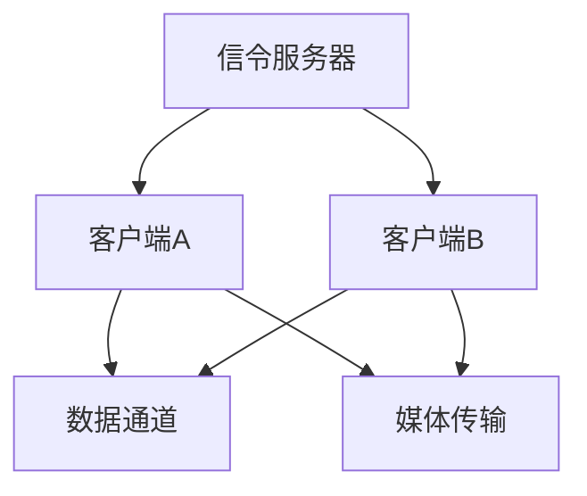

                 

关键词：WebRTC、实时通信、网络技术、协议、数据传输、视频会议、流媒体、互联网应用

> 摘要：本文将深入探讨WebRTC技术，分析其在实时通信领域的应用和优势，并展望其未来的发展趋势。通过详细的架构解析、算法讲解和实例展示，帮助读者全面了解WebRTC的工作原理及其在实际应用中的价值。

## 1. 背景介绍

随着互联网的普及和移动设备的广泛应用，实时通信（Real-Time Communication，RTC）技术在近年来得到了飞速发展。WebRTC（Web Real-Time Communication）作为一种开放的网络通信协议，旨在实现Web应用中的实时音视频通信。它由Google提出，旨在解决网页中实时通信的难题，使得开发者无需依赖第三方插件，便能轻松实现网页上的实时通信功能。

WebRTC的核心目标是在各种网络环境下提供高质量的实时通信服务。它支持多种网络协议，包括UDP、TCP和STUN/TURN等，能够自动适应网络环境的变化，保证通信的稳定性和高效性。WebRTC不仅适用于视频会议、在线教育、远程医疗等传统领域，还广泛应用于直播、游戏、社交网络等新兴领域。

## 2. 核心概念与联系

### 2.1 WebRTC协议概述

WebRTC协议由三个核心组件组成：数据通道（Data Channel）、媒体传输（Media Transport）和信令（Signaling）。

- **数据通道**：数据通道允许两个WebRTC客户端之间进行双向数据传输。它支持文本、二进制数据等各种类型的数据传输，并且具有可靠性和顺序保证。
- **媒体传输**：媒体传输负责处理音视频数据的编码、传输和解码。它支持H.264、VP8等主流视频编码格式，以及G.711、OPUS等音频编码格式。
- **信令**：信令负责在两个WebRTC客户端之间传递控制信息，包括网络地址、媒体参数等。信令通常通过HTTP/HTTPS协议传输，以保证安全性和可靠性。

### 2.2 WebRTC架构

WebRTC的架构如图1所示：



图1：WebRTC架构

- **信令服务器**：信令服务器负责在客户端之间传递信令信息，确保客户端能够建立连接。
- **客户端A和客户端B**：客户端A和客户端B是WebRTC通信的双方，它们通过数据通道和媒体传输组件实现实时通信。
- **数据通道**：数据通道允许客户端之间进行双向数据传输，支持各种类型的数据。
- **媒体传输**：媒体传输负责处理音视频数据的编码、传输和解码。

## 3. 核心算法原理 & 具体操作步骤

### 3.1 算法原理概述

WebRTC的核心算法主要包括以下三个方面：

- **NAT穿透（NAT Traversal）**：WebRTC通过STUN/TURN协议实现NAT穿透，使得位于NAT或防火墙后的客户端能够与外部网络进行通信。
- **自适应流控（Adaptive Flow Control）**：WebRTC根据网络状况动态调整数据传输速率，以避免网络拥塞和数据丢失。
- **媒体协商（Media Negotiation）**：WebRTC在建立连接时，通过SDP（Session Description Protocol）进行媒体参数的协商，以确保双方能够兼容并使用最优的编码格式和参数。

### 3.2 算法步骤详解

1. **信令建立**：客户端A和客户端B首先通过信令服务器进行信令交换，传递双方的网络地址、端口等信息。
2. **NAT穿透**：客户端A和客户端B通过STUN/TURN协议进行NAT穿透，获取对方的公网IP和端口。
3. **媒体协商**：客户端A和客户端B通过SDP进行媒体参数的协商，确定使用何种编码格式和参数。
4. **数据通道建立**：客户端A和客户端B通过数据通道进行数据传输，支持双向通信。
5. **媒体传输**：客户端A和客户端B通过媒体传输组件进行音视频数据的编码、传输和解码。

### 3.3 算法优缺点

**优点**：

- **跨平台**：WebRTC支持各种主流浏览器和操作系统，无需依赖第三方插件。
- **自动适应网络环境**：WebRTC能够自动适应网络环境的变化，提供高质量的实时通信服务。
- **低延迟和高稳定性**：WebRTC采用自适应流控和NAT穿透等技术，保证通信的稳定性和低延迟。

**缺点**：

- **安全性问题**：WebRTC在传输过程中存在一定的安全风险，如中间人攻击等。
- **兼容性问题**：虽然WebRTC支持多种编码格式，但并非所有浏览器都完全支持。

### 3.4 算法应用领域

WebRTC技术广泛应用于以下领域：

- **视频会议**：WebRTC使得网页端视频会议变得简单高效，支持多人会议、实时语音和视频传输。
- **在线教育**：WebRTC支持实时在线教学，使得学生能够与老师进行实时互动，提高教学质量。
- **远程医疗**：WebRTC支持实时远程医疗诊断和治疗，降低医疗资源分布不均的问题。
- **直播**：WebRTC使得网页直播变得简单可行，支持高质量的实时视频传输。

## 4. 数学模型和公式 & 详细讲解 & 举例说明

### 4.1 数学模型构建

WebRTC的数学模型主要包括以下几个方面：

- **网络模型**：WebRTC采用TCP/IP协议栈，结合STUN/TURN协议实现NAT穿透。
- **编码模型**：WebRTC支持多种视频编码格式（如H.264、VP8）和音频编码格式（如G.711、OPUS）。
- **传输模型**：WebRTC采用UDP/TCP混合传输，根据网络状况动态调整传输方式。

### 4.2 公式推导过程

- **NAT穿透公式**：假设客户端A位于NAT防火墙后，其内部IP为\(A_{IP}\)，公网IP为\(P_{IP}\)。STUN协议通过发送请求到公网IP\(P_{IP}\)，获取客户端A的公网IP和端口，公式如下：

  $$ 
  STUN_{request} = P_{IP} : port, STUN_{response} = A_{IP} : port
  $$

- **编码模型公式**：假设视频帧大小为\(F_{size}\)，帧率 \(F_{rate}\)，则视频流带宽 \(B_{rate}\) 可以通过以下公式计算：

  $$ 
  B_{rate} = F_{size} \times F_{rate}
  $$

- **传输模型公式**：假设网络延迟为\(L_{delay}\)，传输带宽为\(B_{bandwidth}\)，则传输一个视频帧所需时间 \(T_{frame}\) 可以通过以下公式计算：

  $$ 
  T_{frame} = L_{delay} + \frac{B_{bandwidth}}{F_{size} \times F_{rate}}
  $$

### 4.3 案例分析与讲解

假设一个视频会议应用，要求支持1080p（1920x1080）分辨率，帧率30fps，音频编码格式为OPUS，带宽限制为1Mbps。我们需要计算视频和音频的带宽需求，并确定传输方式。

- **视频带宽需求**：

  $$ 
  B_{video} = 1080 \times 1920 \times 30 = 61.44 Mbps
  $$

- **音频带宽需求**：

  $$ 
  B_{audio} = 1 \times 48000 = 0.48 Mbps
  $$

- **总带宽需求**：

  $$ 
  B_{total} = B_{video} + B_{audio} = 61.92 Mbps
  $$

由于总带宽需求超过了1Mbps的限制，我们需要采用UDP传输方式，并使用VP8编码格式，以减少带宽占用。

## 5. 项目实践：代码实例和详细解释说明

### 5.1 开发环境搭建

为了实践WebRTC技术，我们需要搭建一个简单的视频会议应用。以下是一个基本的开发环境搭建步骤：

1. **安装Node.js**：WebRTC依赖于Node.js环境，我们需要安装Node.js。
2. **安装WebRTC库**：使用npm安装WebRTC库，例如：

   ```bash
   npm install webrtc
   ```

3. **创建项目**：创建一个新项目文件夹，并初始化项目结构。

### 5.2 源代码详细实现

以下是一个简单的WebRTC视频会议应用示例：

```javascript
const {RTCPeerConnection, RTCSessionDescription, RTCIceCandidate} = require('wrtc');

// 创建RTCPeerConnection
const pc = new RTCPeerConnection({
  sdpSemantics: 'unified-plan',
  iceServers: [
    {
      urls: 'stun:stun.l.google.com:19302'
    }
  ]
});

// 监听ICE候选事件
pc.onicecandidate = (event) => {
  if (event.candidate) {
    // 将ICE候选发送给对方
    socket.emit('ice-candidate', {candidate: event.candidate});
  }
};

// 监听远程ICE候选
socket.on('ice-candidate', (data) => {
  pc.addIceCandidate(new RTCIceCandidate(data.candidate));
});

// 创建offer
pc.createOffer({offerToReceiveVideo: 1})
  .then((offer) => pc.setLocalDescription(offer))
  .then(() => {
    socket.emit('offer', {sdp: pc.localDescription});
  });

// 处理远程offer
socket.on('offer', (data) => {
  pc.setRemoteDescription(new RTCSessionDescription(data.sdp));
  pc.createAnswer({answerToReceiveVideo: 1})
    .then((answer) => pc.setLocalDescription(answer))
    .then(() => {
      socket.emit('answer', {sdp: pc.localDescription});
    });
});

// 处理远程answer
socket.on('answer', (data) => {
  pc.setRemoteDescription(new RTCSessionDescription(data.sdp));
});

// 添加视频轨道
const videoTracks = pc.getSenders().map(sender => sender.track);
const videoTrack = new MediaStreamTrack({track: videoTracks[0], kind: 'video'})

pc.addTransceiver('video', {direction: 'sendonly', codec: 'H.264'})

// 添加音频轨道
const audioTracks = pc.getSenders().map(sender => sender.track);
const audioTrack = new MediaStreamTrack({track: audioTracks[0], kind: 'audio'})

pc.addTransceiver('audio', {direction: 'sendonly', codec: 'OPUS'})

// 连接成功回调
pc.onconnectionstatechange = (event) => {
  if (pc.connectionState === 'connected') {
    console.log('Connected!');
  }
};
```

### 5.3 代码解读与分析

- **RTCPeerConnection**：创建RTCPeerConnection对象，并设置NAT穿透服务器地址。
- **ICE候选事件监听**：监听本地的ICE候选事件，并将其发送给对方。
- **远程ICE候选监听**：监听对方的ICE候选，并将其添加到RTCPeerConnection中。
- **创建offer**：创建本地offer，并将其发送给对方。
- **处理远程offer**：设置远程offer为远程描述，并创建answer。
- **处理远程answer**：设置本地answer为远程描述，完成通信握手。
- **添加视频和音频轨道**：将本地视频和音频轨道添加到RTCPeerConnection中，并指定编码格式。
- **连接成功回调**：监听连接状态变化，当连接成功时输出提示信息。

### 5.4 运行结果展示

运行上述代码后，我们可以通过WebSocket连接与对方进行实时视频通信。在WebSocket服务器端，我们需要处理ICE候选和offer/answer消息，并将其转发给对方。

## 6. 实际应用场景

### 6.1 视频会议

WebRTC技术使得视频会议应用变得更加简单和高效。通过WebRTC，用户无需下载和安装任何插件，只需通过浏览器即可实现实时视频和音频通信。WebRTC支持多人会议，使得企业、学校等机构能够更加便捷地组织会议，提高沟通效率。

### 6.2 在线教育

在线教育是一个快速发展的领域，WebRTC技术为在线教育提供了实时互动的可能性。通过WebRTC，教师和学生可以进行实时视频和音频通信，实现实时授课和互动问答。这不仅提高了教学效果，还解决了传统教育中地域和时间的限制。

### 6.3 远程医疗

远程医疗是一个新兴的领域，WebRTC技术在其中发挥着重要作用。通过WebRTC，医生和患者可以进行实时视频和音频沟通，实现远程诊断、咨询和治疗。这为偏远地区的患者提供了便捷的医疗资源，提高了医疗服务质量。

### 6.4 直播

直播是当前互联网中一个热门的应用场景，WebRTC技术为直播提供了高质量的实时视频传输能力。通过WebRTC，用户可以观看实时直播，无需下载任何软件，实现便捷的观看体验。直播平台可以利用WebRTC技术实现实时互动、弹幕等功能，提高用户体验。

## 7. 工具和资源推荐

### 7.1 学习资源推荐

- **WebRTC官网**：https://www.webrtc.org/
- **WebRTC文档**：https://www.w3.org/TR/webrtc/
- **WebRTC教程**：https://webrtc.org/getting-started/
- **WebRTC示例代码**：https://github.com/muaz-khan/RTCMultiConnection

### 7.2 开发工具推荐

- **WebRTC测试工具**：https://webrtc.github.io/samples/
- **WebRTC浏览器测试**：https://www.rtcfiddle.net/
- **WebRTC API文档**：https://developer.mozilla.org/en-US/docs/Web/API/WebRTC_API

### 7.3 相关论文推荐

- **"WebRTC: Real-Time Communication on the Web"**：这篇论文详细介绍了WebRTC的技术原理和应用场景。
- **"WebRTC in Practice"**：这本书提供了大量关于WebRTC的实际应用案例和编程技巧。
- **"WebRTC Deployment Guide"**：这篇文档提供了WebRTC部署的详细指南和最佳实践。

## 8. 总结：未来发展趋势与挑战

### 8.1 研究成果总结

WebRTC技术自提出以来，已经在多个领域取得了显著的成果。其开放、跨平台、低延迟和高稳定性的特点，使得WebRTC成为实时通信领域的重要技术。通过WebRTC，开发者可以轻松实现网页端的实时音视频通信，提高了用户体验和沟通效率。

### 8.2 未来发展趋势

1. **低延迟和高并发**：随着5G网络的普及，WebRTC将能够实现更低延迟和高并发性能，进一步优化实时通信体验。
2. **AI与WebRTC融合**：人工智能技术的发展将使WebRTC在语音识别、图像处理等方面得到更多应用，提升实时通信的智能化水平。
3. **隐私和安全**：随着WebRTC应用场景的扩展，隐私和安全问题将成为未来的重要研究方向，如端到端加密、安全信令等。

### 8.3 面临的挑战

1. **兼容性问题**：不同浏览器和操作系统对WebRTC的支持程度存在差异，如何保证跨平台的兼容性仍是一个挑战。
2. **性能优化**：随着应用场景的复杂化，如何优化WebRTC的性能，提高传输质量和稳定性，是未来的重要研究方向。
3. **安全性问题**：WebRTC在传输过程中存在一定的安全风险，如中间人攻击等，如何提高WebRTC的安全性是未来的重要挑战。

### 8.4 研究展望

WebRTC技术在未来将继续发挥重要作用，推动实时通信领域的发展。通过不断优化和扩展，WebRTC有望实现更低延迟、更高性能和更安全可靠的实时通信服务。同时，WebRTC与人工智能、物联网等技术的融合，将带来更多创新应用场景，为人类社会带来更多便利。

## 9. 附录：常见问题与解答

### 9.1 问题1：WebRTC是否支持多人群聊？

**解答**：是的，WebRTC支持多人群聊。通过创建多个RTCPeerConnection实例，可以将多个用户连接到同一个会议中，实现多人群聊功能。

### 9.2 问题2：WebRTC是否支持录制和播放本地媒体流？

**解答**：是的，WebRTC支持录制和播放本地媒体流。开发者可以使用MediaRecorder API录制本地视频和音频流，并通过MediaSource和HTML5的<video>或<audio>标签播放已录制的媒体流。

### 9.3 问题3：WebRTC是否支持屏幕共享？

**解答**：是的，WebRTC支持屏幕共享。开发者可以使用WebRTC的screen-capturing API捕获屏幕内容，并将其作为媒体流发送给其他用户。

### 9.4 问题4：WebRTC是否支持实时翻译？

**解答**：目前WebRTC本身并不支持实时翻译功能，但可以通过与外部翻译API（如Google翻译API）集成，实现实时翻译功能。

### 9.5 问题5：WebRTC是否支持低功耗模式？

**解答**：是的，WebRTC支持低功耗模式。开发者可以通过调整视频帧率和编码参数，实现低功耗传输，以适应不同场景的需求。

----------------------------------------------------------------

### 作者署名

> 作者：禅与计算机程序设计艺术 / Zen and the Art of Computer Programming

以上就是关于WebRTC技术的详细文章，希望对您有所帮助。在撰写过程中，如有任何疑问或需要进一步的帮助，请随时提问。祝您写作顺利！

