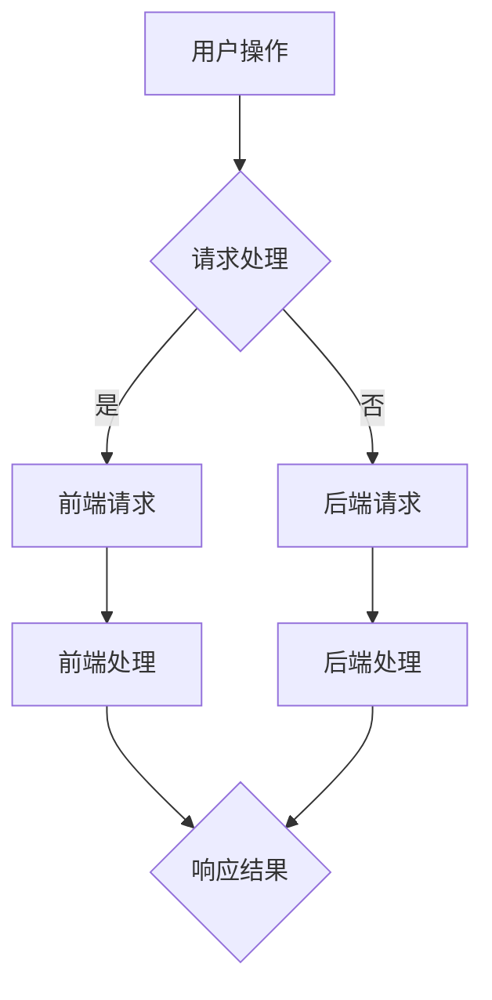

                 

关键词：Web全栈开发、前端开发、后端开发、全栈工程师、全栈技术栈、前端框架、后端框架、全栈项目实战、全栈开发最佳实践

> 摘要：本文将为您深入探讨Web全栈开发的方方面面，从基础理论到实战应用，再到未来趋势，助您成为一名出色的全栈开发者。

## 1. 背景介绍

随着互联网的迅速发展，Web全栈开发已经成为当下热门的编程领域。全栈开发指的是同时掌握前端和后端开发技能，能够独立完成一个Web应用的整个开发过程。这种开发模式不仅提高了开发效率，还能够更好地理解和协调前后端的工作。

全栈开发不仅仅是技术的集合，更是一种思维方式。它要求开发者具备全局视野，能够从用户需求出发，综合运用多种技术，设计并实现高质量的Web应用。

本文将分为以下几个部分：

- **1. 背景介绍**：介绍Web全栈开发的背景和发展历程。
- **2. 核心概念与联系**：阐述Web全栈开发中的核心概念及其联系。
- **3. 核心算法原理 & 具体操作步骤**：讲解常用的算法原理及其应用。
- **4. 数学模型和公式 & 详细讲解 & 举例说明**：介绍相关的数学模型和公式。
- **5. 项目实践：代码实例和详细解释说明**：通过实际项目展示开发过程。
- **6. 实际应用场景**：探讨Web全栈开发的实际应用场景。
- **7. 工具和资源推荐**：推荐一些学习资源和开发工具。
- **8. 总结：未来发展趋势与挑战**：总结当前趋势和未来挑战。
- **9. 附录：常见问题与解答**：回答一些常见问题。

接下来，我们将逐步深入探讨这些主题。

## 2. 核心概念与联系

### 2.1. Web全栈开发的概念

Web全栈开发涉及两个主要部分：前端和后端。

- **前端开发**：关注用户界面和用户体验，主要包括HTML、CSS和JavaScript等前端技术。前端开发的目标是创建一个用户友好的界面，确保网站在各种设备和浏览器上都能良好运行。
  
- **后端开发**：关注服务器端逻辑和数据管理，主要包括服务器、数据库和应用程序等后端技术。后端开发的目标是处理用户请求、存储数据和提供API接口。

### 2.2. 前端和后端的联系

前端和后端并非完全独立的两个部分，它们之间有着紧密的联系：

- **数据交互**：前端需要从后端获取数据，如用户信息、文章内容等。同时，前端也需要将用户输入的数据发送给后端进行处理。
  
- **逻辑处理**：前端处理用户交互，如按钮点击、表单提交等。后端处理业务逻辑，如用户认证、数据处理等。

- **界面渲染**：前端负责将数据和模板渲染成用户界面。后端通过API接口提供数据，前端根据这些数据生成界面。

### 2.3. Mermaid流程图

为了更好地展示前端和后端的联系，我们可以使用Mermaid流程图来表示它们之间的交互流程：



在这个流程图中，用户操作会触发请求处理，请求处理会根据请求类型决定是前端请求还是后端请求。前端请求和后端请求分别由前端和后端进行处理，最终生成响应结果返回给前端。

## 3. 核心算法原理 & 具体操作步骤

### 3.1. 算法原理概述

Web全栈开发中，常用的算法包括：

- **排序算法**：如快速排序、归并排序等，用于对数据进行排序。
- **搜索算法**：如二分搜索、深度优先搜索等，用于在数据中查找特定信息。
- **哈希算法**：如MD5、SHA-1等，用于生成唯一标识符。
- **加密算法**：如AES、RSA等，用于保护数据传输和存储的安全。

### 3.2. 算法步骤详解

以快速排序算法为例，其基本步骤如下：

1. **选择基准**：从数组中选取一个元素作为基准。
2. **分区操作**：将数组划分为两部分，一部分小于基准，另一部分大于基准。
3. **递归排序**：对小于和大于基准的两部分数组分别进行快速排序。

### 3.3. 算法优缺点

快速排序算法的优点是时间复杂度较低，适用于大规模数据排序。但其缺点是递归操作可能会导致栈溢出，且不稳定。

### 3.4. 算法应用领域

快速排序算法广泛应用于各种场景，如数据库索引、文件排序、算法竞赛等。

## 4. 数学模型和公式 & 详细讲解 & 举例说明

### 4.1. 数学模型构建

在Web全栈开发中，常用的数学模型包括：

- **线性模型**：用于预测线性关系。
- **逻辑回归模型**：用于分类问题。
- **神经网络模型**：用于复杂非线性关系。

### 4.2. 公式推导过程

以线性模型为例，其公式推导过程如下：

设自变量为\(x\)，因变量为\(y\)，线性模型可以表示为：

\[ y = w_0 + w_1 \cdot x \]

其中，\(w_0\)和\(w_1\)分别为模型的权重。

### 4.3. 案例分析与讲解

假设我们要预测一家餐厅的日营业额，自变量为顾客人数\(x\)，因变量为营业额\(y\)。根据历史数据，我们可以建立线性模型：

\[ y = 10 + 5 \cdot x \]

其中，\(w_0 = 10\)，\(w_1 = 5\)。

通过这个模型，我们可以预测当顾客人数为100时，营业额为：

\[ y = 10 + 5 \cdot 100 = 510 \]

## 5. 项目实践：代码实例和详细解释说明

### 5.1. 开发环境搭建

在进行Web全栈开发之前，我们需要搭建开发环境。这里以Node.js和React为例，介绍开发环境的搭建步骤：

1. 安装Node.js：从官方网站下载并安装Node.js。
2. 安装React：使用npm（Node.js的包管理器）安装React：

   ```shell
   npm install react
   ```

### 5.2. 源代码详细实现

下面是一个简单的React应用，展示了一个计数器功能：

```jsx
import React, { useState } from 'react';

function Counter() {
  const [count, setCount] = useState(0);

  return (
    <div>
      <h1>计数器</h1>
      <p>当前计数：{count}</p>
      <button onClick={() => setCount(count + 1)}>增加</button>
      <button onClick={() => setCount(count - 1)}>减少</button>
    </div>
  );
}

export default Counter;
```

### 5.3. 代码解读与分析

这个简单的React应用使用了React的函数组件和`useState`钩子。

- **函数组件**：Counter是一个函数组件，接受一个`props`对象作为参数，返回一个React元素。
- **`useState`钩子**：用于在组件内部管理状态，这里用于管理计数器的值。
- **按钮事件**：通过`onClick`事件处理函数，当用户点击按钮时更新计数器的值。

### 5.4. 运行结果展示

运行这个React应用，我们会在浏览器中看到一个简单的计数器界面，可以通过按钮增加或减少计数器的值。

## 6. 实际应用场景

Web全栈开发可以应用于各种场景，如电子商务、社交媒体、在线教育等。

- **电子商务**：全栈开发可以帮助构建一个完整的电商平台，包括商品展示、购物车、订单管理等。
- **社交媒体**：全栈开发可以实现用户注册、登录、发布动态、评论等功能。
- **在线教育**：全栈开发可以帮助构建一个在线学习平台，包括课程管理、作业提交、成绩查询等。

## 7. 工具和资源推荐

### 7.1. 学习资源推荐

- **《深入理解计算机系统》**：详细介绍了计算机系统的各个组成部分，包括前端和后端。
- **《你不知道的JavaScript》**：深入探讨了JavaScript的核心概念和最佳实践。

### 7.2. 开发工具推荐

- **Visual Studio Code**：一款功能强大的代码编辑器，支持多种编程语言。
- **React Developer Tools**：用于调试React应用的浏览器插件。

### 7.3. 相关论文推荐

- **《大规模分布式存储系统：原理解析与架构设计》**：介绍了分布式存储系统的设计和实现。
- **《Web性能优化：原理与最佳实践》**：详细介绍了Web性能优化的方法和技巧。

## 8. 总结：未来发展趋势与挑战

### 8.1. 研究成果总结

Web全栈开发已经成为互联网时代的核心技术之一。随着云计算、大数据、人工智能等技术的发展，Web全栈开发的应用场景和需求也在不断扩展。

### 8.2. 未来发展趋势

- **云计算和容器化**：云计算和容器化技术将进一步提高Web全栈开发的效率和可扩展性。
- **前端框架的演进**：如React、Vue、Angular等前端框架将继续优化和演进，提供更好的开发体验。
- **后端服务的微服务化**：微服务架构将使得后端开发更加灵活和模块化。

### 8.3. 面临的挑战

- **技术栈的复杂性**：随着技术的不断更新，开发者需要不断学习新的技术和框架。
- **性能优化**：随着应用规模的扩大，性能优化将成为一个重要的挑战。

### 8.4. 研究展望

未来的Web全栈开发将更加注重用户体验、性能优化和安全性。开发者需要具备全面的技能，不仅能够掌握前端和后端技术，还需要关注前端工程化和后端服务的最佳实践。

## 9. 附录：常见问题与解答

### 9.1. 如何选择前端框架？

选择前端框架主要取决于项目需求和开发团队的技能。常用的前端框架有React、Vue、Angular等。React适合需要高度组件化和动态性的项目，Vue适合快速开发和小型项目，Angular适合大型单页面应用。

### 9.2. 如何优化Web应用性能？

优化Web应用性能可以从以下几个方面入手：

- **减少HTTP请求**：合并CSS、JavaScript文件，使用CDN加速资源加载。
- **使用缓存**：使用浏览器缓存和CDN缓存减少重复请求。
- **优化代码**：减少DOM操作，使用虚拟DOM等技术。
- **压缩资源**：压缩CSS、JavaScript文件，使用GZIP压缩图片等。

### 9.3. 如何进行全栈项目测试？

全栈项目测试可以从以下几个方面进行：

- **前端测试**：使用Jest、Enzyme等工具进行单元测试和集成测试。
- **后端测试**：使用JUnit、TestNG等工具进行单元测试和集成测试。
- **接口测试**：使用Postman、JMeter等工具进行接口测试。
- **性能测试**：使用LoadRunner、JMeter等工具进行性能测试。

---

全文完。感谢您的阅读，希望这篇文章能够帮助您更好地了解Web全栈开发，并在实践中取得成功。作者：禅与计算机程序设计艺术 / Zen and the Art of Computer Programming。

