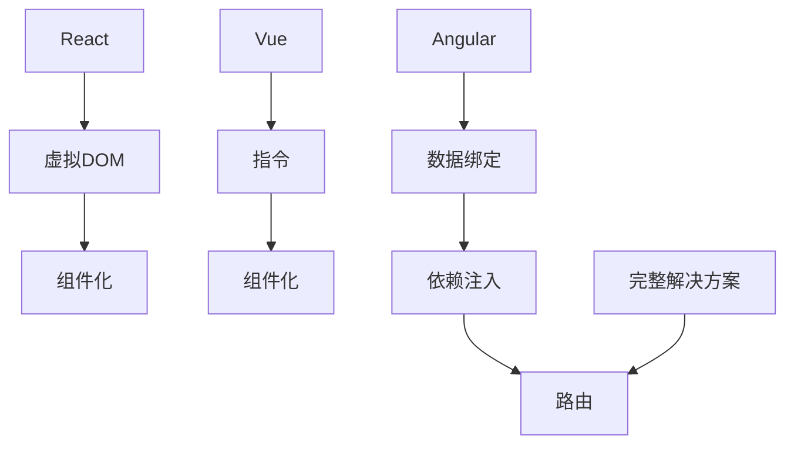

                 

关键词：Web前端技术栈，React，Vue，Angular，比较，框架，性能，适用场景

> 摘要：本文将深入探讨Web前端三大主流框架React、Vue和Angular的特点、优势和局限性，并通过对比分析，帮助开发者选择适合自己项目的框架。

## 1. 背景介绍

随着互联网的快速发展，Web前端技术日益重要。为了提高开发效率和代码质量，前端开发者们逐渐采用各种框架来简化开发流程。目前，React、Vue和Angular是三大最流行的Web前端框架，它们各自拥有独特的特点和适用场景。本文将详细比较这三个框架，帮助开发者选择最适合自己项目的框架。

### 1.1 React

React由Facebook于2013年推出，是一个用于构建用户界面的JavaScript库。React的核心思想是组件化开发，通过虚拟DOM实现高效的数据绑定和界面更新。React得到了广泛的应用，并在前端开发领域占据了重要地位。

### 1.2 Vue

Vue由尤雨溪于2014年创建，是一个用于构建用户界面的渐进式JavaScript框架。Vue的设计哲学是易于上手和灵活，它拥有简洁的语法和强大的组件系统，使得开发者可以快速构建复杂的单页面应用。

### 1.3 Angular

Angular由Google于2010年推出，是一个用于构建大型应用程序的框架。Angular采用TypeScript作为开发语言，提供了一套完整的解决方案，包括数据绑定、依赖注入、路由等。

## 2. 核心概念与联系

### 2.1 概念解释

- **React**：React主要关注于界面层的构建，通过虚拟DOM实现高效的界面更新。
- **Vue**：Vue是一个渐进式框架，既可以用于小项目，也可以用于大型项目，它提供了丰富的组件和指令。
- **Angular**：Angular是一个功能丰富的框架，提供了数据绑定、依赖注入、路由等完整的解决方案。

### 2.2 Mermaid流程图

下面是React、Vue和Angular的核心概念和联系的Mermaid流程图：



## 3. 核心算法原理 & 具体操作步骤

### 3.1 算法原理概述

React、Vue和Angular的核心算法原理各有不同：

- **React**：React通过虚拟DOM实现高效的界面更新，减少了直接操作DOM的开销。
- **Vue**：Vue采用双向数据绑定机制，通过观察者模式实现数据变化与视图同步。
- **Angular**：Angular使用脏检查机制来更新界面，它通过依赖注入来管理组件之间的依赖关系。

### 3.2 算法步骤详解

#### React

1. 数据变化时，React首先生成新的虚拟DOM。
2. 将新的虚拟DOM与旧的虚拟DOM进行对比，找出变化的部分。
3. 根据变化的部分，直接更新DOM。

#### Vue

1. Vue通过观察者模式，监听数据的变化。
2. 数据变化时，Vue会通知订阅者，并更新视图。

#### Angular

1. Angular通过脏检查机制，定期检查数据是否发生变化。
2. 数据发生变化时，Angular会重新渲染组件。

### 3.3 算法优缺点

#### React

- 优点：高效的虚拟DOM更新机制，性能优异。
- 缺点：需要一定的学习成本，构建大型项目时可能需要额外的工具支持。

#### Vue

- 优点：易于上手，语法简洁。
- 缺点：双向数据绑定在某些情况下可能引起性能问题。

#### Angular

- 优点：功能丰富，提供了完整的解决方案。
- 缺点：学习曲线较陡峭，构建大型项目时可能显得过于复杂。

### 3.4 算法应用领域

#### React

- 适用于构建高性能、动态的单页面应用。
- 如：社交媒体、电商平台等。

#### Vue

- 适用于构建中小型应用，尤其是对界面交互要求较高的场景。
- 如：后台管理系统、数据可视化等。

#### Angular

- 适用于构建大型、复杂的应用程序。
- 如：企业级应用、金融系统等。

## 4. 数学模型和公式 & 详细讲解 & 举例说明

### 4.1 数学模型构建

在Web前端框架中，数学模型主要涉及数据绑定和界面更新。以下是几个关键的数学模型：

- **React**：虚拟DOM模型
- **Vue**：双向数据绑定模型
- **Angular**：脏检查模型

### 4.2 公式推导过程

#### React

虚拟DOM的更新公式：

$$
\text{DOM更新} = \text{新虚拟DOM} \oplus \text{旧虚拟DOM}
$$

其中，$\oplus$ 表示虚拟DOM的对比操作。

#### Vue

双向数据绑定公式：

$$
\text{数据变化} \Rightarrow \text{视图更新} \\
\text{视图更新} \Rightarrow \text{数据变化}
$$

#### Angular

脏检查更新公式：

$$
\text{脏检查} = \text{当前值} \oplus \text{上次值}
$$

其中，$\oplus$ 表示值的变化比较。

### 4.3 案例分析与讲解

#### React

假设有一个简单的React组件，它包含一个数字输入框和一个展示数字的段落。当用户输入数字时，组件会实时更新展示的数字。

```jsx
import React, { useState } from 'react';

function App() {
  const [number, setNumber] = useState(0);

  return (
    <div>
      <input type="number" value={number} onChange={e => setNumber(e.target.value)} />
      <p>{number}</p>
    </div>
  );
}

export default App;
```

在上述代码中，React通过虚拟DOM实现了高效的数据绑定和界面更新。

#### Vue

假设有一个简单的Vue组件，它也包含一个数字输入框和一个展示数字的段落。当用户输入数字时，Vue会实时更新展示的数字。

```vue
<template>
  <div>
    <input v-model="number" />
    <p>{{ number }}</p>
  </div>
</template>

<script>
export default {
  data() {
    return {
      number: 0,
    };
  },
};
</script>
```

在上述代码中，Vue通过双向数据绑定实现了数据变化与视图同步。

#### Angular

假设有一个简单的Angular组件，它同样包含一个数字输入框和一个展示数字的段落。当用户输入数字时，Angular会实时更新展示的数字。

```typescript
@Component({
  selector: 'app-root',
  templateUrl: './app.component.html',
})
export class AppComponent {
  number: number = 0;

  ngOnChanges(changes: SimpleChange) {
    if (changes['number']) {
      this.number = changes['number'].currentValue;
    }
  }
}
```

在上述代码中，Angular通过脏检查实现了界面更新。

## 5. 项目实践：代码实例和详细解释说明

### 5.1 开发环境搭建

为了实践React、Vue和Angular，我们需要搭建相应的开发环境。

#### React

1. 安装Node.js和npm。
2. 使用`create-react-app`脚手架创建新项目。

```bash
npx create-react-app my-app
cd my-app
npm start
```

#### Vue

1. 安装Node.js和npm。
2. 使用`vue-cli`脚手架创建新项目。

```bash
npm install -g @vue/cli
vue create my-app
cd my-app
npm run serve
```

#### Angular

1. 安装Node.js和npm。
2. 使用`@angular/cli`脚手架创建新项目。

```bash
npm install -g @angular/cli
ng new my-app
cd my-app
ng serve
```

### 5.2 源代码详细实现

以下是三个框架的简单代码示例：

#### React

```jsx
// App.js
import React, { useState } from 'react';

function App() {
  const [number, setNumber] = useState(0);

  return (
    <div>
      <input type="number" value={number} onChange={e => setNumber(e.target.value)} />
      <p>{number}</p>
    </div>
  );
}

export default App;
```

#### Vue

```vue
<!-- App.vue -->
<template>
  <div>
    <input v-model="number" />
    <p>{{ number }}</p>
  </div>
</template>

<script>
export default {
  data() {
    return {
      number: 0,
    };
  },
};
</script>
```

#### Angular

```typescript
// app.component.ts
import { Component } from '@angular/core';

@Component({
  selector: 'app-root',
  templateUrl: './app.component.html',
})
export class AppComponent {
  number: number = 0;

  ngOnChanges(changes: SimpleChange) {
    if (changes['number']) {
      this.number = changes['number'].currentValue;
    }
  }
}
```

### 5.3 代码解读与分析

以上三个代码示例分别展示了React、Vue和Angular在简单场景下的应用。通过对比，我们可以看出：

- **React**：通过`useState`钩子实现了状态管理，通过事件处理函数更新状态。
- **Vue**：通过`v-model`实现了数据绑定，通过组件的`data`属性管理状态。
- **Angular**：通过`ngOnChanges`钩子实现了状态管理，通过事件处理函数更新状态。

## 6. 实际应用场景

### 6.1 社交媒体

社交媒体平台通常需要高性能的界面更新和复杂的数据交互。React是最佳选择，因为它提供了高效的虚拟DOM更新机制和强大的社区支持。

### 6.2 后台管理系统

后台管理系统通常需要简洁的界面和丰富的交互功能。Vue是最佳选择，因为它提供了简洁的语法和强大的组件系统，使得开发者可以快速构建复杂的单页面应用。

### 6.3 企业级应用

企业级应用通常需要稳定性和扩展性。Angular是最佳选择，因为它提供了完整的解决方案，包括数据绑定、依赖注入、路由等，使得开发者可以轻松构建大型、复杂的应用程序。

## 7. 工具和资源推荐

### 7.1 学习资源推荐

- **React**：[React 官方文档](https://reactjs.org/docs/getting-started.html)
- **Vue**：[Vue 官方文档](https://vuejs.org/v2/guide/)
- **Angular**：[Angular 官方文档](https://angular.io/docs)

### 7.2 开发工具推荐

- **React**：[Create React App](https://create-react-app.dev/)
- **Vue**：[Vue CLI](https://cli.vuejs.org/zh/)
- **Angular**：[Angular CLI](https://angular.io/cli)

### 7.3 相关论文推荐

- **React**：[React: A JavaScript Library for Building User Interfaces](https://facebook.github.io/react/docs/intro.html)
- **Vue**：[Vue.js: The Progressive JavaScript Framework](https://vuejs.org/v2/guide/)
- **Angular**：[Angular: Modern web app framework](https://angular.io/docs)

## 8. 总结：未来发展趋势与挑战

### 8.1 研究成果总结

本文通过对React、Vue和Angular的深入比较，总结了它们的核心特点、算法原理、实际应用场景以及学习资源。结果表明，每个框架都有其独特的优势和应用领域。

### 8.2 未来发展趋势

随着技术的不断发展，Web前端框架将更加注重性能、易用性和扩展性。React、Vue和Angular将继续演进，为开发者提供更好的开发体验。

### 8.3 面临的挑战

Web前端框架面临的挑战包括：

- **性能优化**：随着应用复杂度的增加，性能优化变得尤为重要。
- **兼容性**：需要确保框架在不同浏览器和设备上具有良好的兼容性。
- **社区支持**：框架的社区支持对开发者的重要性日益增加。

### 8.4 研究展望

未来，Web前端框架将更加注重用户体验和开发效率。新的技术和框架可能会涌现，为开发者提供更丰富的选择。

## 9. 附录：常见问题与解答

### 9.1 问题1

**问：React、Vue和Angular哪个更好？**

**答：没有一个框架是绝对更好的，它们各有优势和局限性。选择哪个框架取决于项目的具体需求、开发团队的熟悉度以及应用场景。**

### 9.2 问题2

**问：如何选择适合自己项目的框架？**

**答：首先，了解每个框架的核心特点和适用场景。然后，评估自己的团队对框架的熟悉程度。最后，考虑项目的实际需求，选择最适合的框架。**

### 9.3 问题3

**问：React、Vue和Angular哪个性能最好？**

**答：性能取决于具体的应用场景和优化策略。React通常在性能方面表现优秀，尤其是对于动态和复杂的单页面应用。Vue和Angular的性能也相当不错，但具体取决于开发者的优化策略。**

以上就是对Web前端技术栈中React、Vue和Angular的比较的详细分析。希望这篇文章能够帮助到各位开发者，在选择框架时做出更明智的决策。作者：禅与计算机程序设计艺术 / Zen and the Art of Computer Programming。

