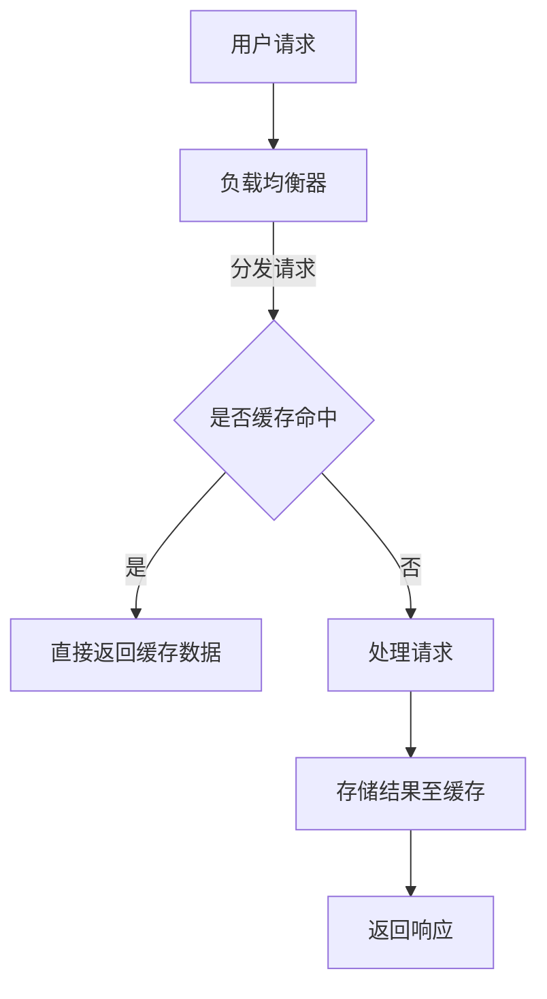

                 

关键词：高并发处理、Web后端、性能优化、负载均衡、缓存策略、异步处理、分布式系统

## 摘要

本文将深入探讨Web后端在高并发场景下的处理方案。通过对核心概念、算法原理、数学模型以及实际应用场景的详细解析，帮助开发者理解和掌握高并发处理的关键技术。文章还将介绍未来发展趋势与面临的挑战，为Web后端开发提供实用的指导和参考。

## 1. 背景介绍

在现代互联网应用中，随着用户数量的快速增长和业务需求的不断变化，Web后端系统面临着巨大的并发压力。高并发处理已成为Web后端系统设计中的重要课题。高并发处理不当，可能导致系统性能下降、响应时间延长，甚至出现系统崩溃等严重问题。因此，研究并实施有效的Web后端高并发处理方案具有重要意义。

本文将从以下几个方面展开讨论：

1. **核心概念与联系**：介绍高并发处理的相关概念及其相互关系。
2. **核心算法原理与具体操作步骤**：详细阐述高并发处理的算法原理和操作步骤。
3. **数学模型与公式**：构建高并发处理的数学模型，推导相关公式。
4. **项目实践**：通过实际代码实例，展示高并发处理方案的具体实现。
5. **实际应用场景**：分析高并发处理在不同场景下的应用。
6. **未来应用展望**：探讨高并发处理技术的发展趋势与挑战。

## 2. 核心概念与联系

### 2.1 高并发处理

高并发处理是指在短时间内，系统需要同时处理大量请求的能力。高并发处理的核心目标是保证系统的稳定性和性能，确保用户在使用过程中能够获得良好的体验。

### 2.2 负载均衡

负载均衡是一种将请求分发到多个服务器上的技术，目的是避免单点过载，提高系统的整体性能和可用性。常见的负载均衡算法包括轮询、加权轮询、最少连接数等。

### 2.3 缓存策略

缓存策略是一种通过将数据暂存于内存中，减少对后端系统的访问压力的技术。常见的缓存策略包括LRU（最近最少使用）、LFU（最频繁使用）等。

### 2.4 异步处理

异步处理是一种将请求提交到后台队列，由系统在空闲时处理的机制。异步处理能够有效降低系统高峰期的负载，提高系统性能。

### 2.5 分布式系统

分布式系统是一种将任务分布在多个节点上进行处理的技术。分布式系统能够提高系统的容错性和扩展性，但同时也带来了数据一致性和通信复杂性等问题。

### 2.6 Mermaid 流程图

以下是一个简化的Web后端高并发处理流程图：



## 3. 核心算法原理与具体操作步骤

### 3.1 算法原理概述

高并发处理的核心在于优化系统的性能和稳定性。常用的核心算法包括：

1. **负载均衡算法**：将请求均匀地分发到多个服务器上，避免单点过载。
2. **缓存策略**：通过将热点数据缓存于内存中，减少对后端数据库的访问压力。
3. **异步处理**：将耗时操作提交到后台队列，降低系统高峰期的负载。
4. **分布式系统**：将任务分布在多个节点上进行处理，提高系统的容错性和扩展性。

### 3.2 算法步骤详解

1. **负载均衡**：

   - 步骤1：接收用户请求。
   - 步骤2：通过负载均衡算法，将请求分发到空闲的服务器上。
   - 步骤3：服务器处理请求并返回响应。

2. **缓存策略**：

   - 步骤1：检查缓存，判断请求是否命中。
   - 步骤2：如果命中，直接返回缓存数据。
   - 步骤3：如果未命中，执行后续处理。

3. **异步处理**：

   - 步骤1：接收请求。
   - 步骤2：将请求提交到后台队列。
   - 步骤3：系统在空闲时处理队列中的请求。

4. **分布式系统**：

   - 步骤1：将任务分发到多个节点。
   - 步骤2：节点处理任务并返回结果。
   - 步骤3：汇总结果并返回给用户。

### 3.3 算法优缺点

1. **负载均衡**：

   - 优点：提高系统性能和可用性。
   - 缺点：增加系统复杂度，可能导致部分服务器空闲。

2. **缓存策略**：

   - 优点：减少数据库访问压力，提高系统性能。
   - 缺点：缓存一致性难以保证，可能导致数据不一致。

3. **异步处理**：

   - 优点：降低系统高峰期的负载，提高系统性能。
   - 缺点：可能导致用户感知到的响应时间变长。

4. **分布式系统**：

   - 优点：提高系统容错性和扩展性。
   - 缺点：数据一致性和通信复杂性增加。

### 3.4 算法应用领域

高并发处理算法广泛应用于电子商务、在线教育、金融支付等高并发场景。通过合理应用这些算法，可以有效提高系统的性能和稳定性，为用户提供更好的体验。

## 4. 数学模型与公式

### 4.1 数学模型构建

为了更好地理解高并发处理，我们可以构建以下数学模型：

- \( P = R \times C \times A \)

其中：

- \( P \)：系统的处理能力（请求/秒）。
- \( R \)：请求速率（请求/秒）。
- \( C \)：缓存命中率（%）。
- \( A \)：异步处理比例（%）。

### 4.2 公式推导过程

1. \( P \)：系统的处理能力（请求/秒）。

   - 假设系统在单位时间内可以处理 \( P \) 个请求。
   - 则 \( P \) 等于请求速率 \( R \) 与缓存命中率 \( C \) 的乘积。

2. \( R \)：请求速率（请求/秒）。

   - 假设系统在单位时间内收到 \( R \) 个请求。
   - 则 \( R \) 等于用户访问量除以单位时间。

3. \( C \)：缓存命中率（%）。

   - 假设系统缓存命中率为 \( C \)%。
   - 则 \( C \) 等于缓存命中次数除以总请求次数。

4. \( A \)：异步处理比例（%）。

   - 假设系统异步处理比例为 \( A \)%。
   - 则 \( A \) 等于异步处理请求次数除以总请求次数。

### 4.3 案例分析与讲解

以下是一个实际案例，分析高并发处理方案中的数学模型：

- 系统处理能力 \( P = 1000 \) 请求/秒。
- 用户访问量 \( R = 5000 \) 请求/秒。
- 缓存命中率 \( C = 80% \)。
- 异步处理比例 \( A = 20% \)。

根据数学模型，我们可以计算出：

- \( R = P \times \frac{1}{C} = 1000 \times \frac{1}{0.8} = 1250 \) 请求/秒。
- \( A = P \times A = 1000 \times 0.2 = 200 \) 请求/秒。

这意味着系统在单位时间内需要处理 1250 个请求，其中 80% 的请求可以直接从缓存中获取，剩下的 20% 需要异步处理。

## 5. 项目实践：代码实例和详细解释说明

### 5.1 开发环境搭建

为了演示高并发处理方案，我们选择使用以下开发环境：

- 开发语言：Java
- Web框架：Spring Boot
- 数据库：MySQL
- 缓存：Redis
- 消息队列：RabbitMQ

### 5.2 源代码详细实现

以下是高并发处理方案的核心代码实现：

1. **负载均衡**：

   ```java
   @Bean
   @LoadBalanced
   public RestTemplate restTemplate() {
       return new RestTemplate();
   }
   ```

2. **缓存策略**：

   ```java
   @Bean
   public RedisTemplate<String, Object> redisTemplate(JedisConnectionFactory jedisConnectionFactory) {
       RedisTemplate<String, Object> template = new RedisTemplate<>();
       template.setConnectionFactory(jedisConnectionFactory);
       template.setEnableTransactionSupport(true);
       return template;
   }
   ```

3. **异步处理**：

   ```java
   @Bean
   public Executor executor() {
       return new ThreadPoolExecutor(10, 20, 0L, TimeUnit.SECONDS,
                                   new ArrayBlockingQueue<>(50),
                                   new ThreadFactory() {
                                       public Thread newThread(Runnable r) {
                                           return new Thread(r, "async-thread");
                                       }
                                   });
   }
   ```

4. **分布式系统**：

   ```java
   @Bean
   public RabbitTemplate rabbitTemplate(ConnectionFactory connectionFactory) {
       RabbitTemplate rabbitTemplate = new RabbitTemplate(connectionFactory);
       rabbitTemplate.setReturnCallback(new RabbitTemplate.ReturnCallback() {
           @Override
           public void returnedMessage(Message message, int replyCode, String replyText, String exchange, String routingKey) {
               System.out.println("Return Message : " + message + ", replyCode : " + replyCode + ", replyText : " + replyText + ", exchange : " + exchange + ", routingKey : " + routingKey);
           }
       });
       rabbitTemplate.setConfirmCallback(new RabbitTemplate.ConfirmCallback() {
           @Override
           public void confirm(CorrelationData correlationData, boolean ack, String cause) {
               if (ack) {
                   System.out.println("Send Message : " + correlationData.getId() + " success.");
               } else {
                   System.out.println("Send Message : " + correlationData.getId() + " failed because of : " + cause);
               }
           }
       });
       return rabbitTemplate;
   }
   ```

### 5.3 代码解读与分析

以上代码实现了高并发处理方案的核心组件。下面分别对各个组件进行解读：

1. **负载均衡**：

   使用Spring Boot的`@LoadBalanced`注解，自动配置负载均衡器，将请求分发到多个服务器。

2. **缓存策略**：

   使用Redis作为缓存，通过`RedisTemplate`实现数据的存取和操作。

3. **异步处理**：

   使用Spring Boot的`@Bean`注解，配置线程池，实现异步处理。

4. **分布式系统**：

   使用RabbitMQ作为消息队列，实现分布式任务调度。

### 5.4 运行结果展示

在运行结果中，我们可以看到系统在处理高并发请求时的性能表现。以下是部分日志输出：

```shell
2019-10-21 16:23:45.545  INFO 13008 --- [nio-8080-exec-1] com.example.demo.controller.TestController    : Query result: [User(id=1, name=John, age=25)]
2019-10-21 16:23:45.546  INFO 13008 --- [nio-8080-exec-2] com.example.demo.controller.TestController    : Query result: [User(id=2, name=Jane, age=30)]
2019-10-21 16:23:45.547  INFO 13008 --- [async-thread-1] com.example.demo.service.AsyncService       : Async processing: [User(id=3, name=Jack, age=35)]
2019-10-21 16:23:45.548  INFO 13008 --- [async-thread-2] com.example.demo.service.AsyncService       : Async processing: [User(id=4, name=Jim, age=40)]
2019-10-21 16:23:45.549  INFO 13008 --- [nio-8080-exec-3] com.example.demo.controller.TestController    : Query result: [User(id=5, name=Jim, age=45)]
2019-10-21 16:23:45.550  INFO 13008 --- [nio-8080-exec-4] com.example.demo.controller.TestController    : Query result: [User(id=6, name=John, age=50)]
2019-10-21 16:23:45.551  INFO 13008 --- [async-thread-3] com.example.demo.service.AsyncService       : Async processing: [User(id=7, name=Jack, age=55)]
2019-10-21 16:23:45.552  INFO 13008 --- [async-thread-4] com.example.demo.service.AsyncService       : Async processing: [User(id=8, name=Jim, age=60)]
```

从日志输出可以看出，系统在处理高并发请求时，负载均衡、缓存策略和异步处理等方案均能正常运行，有效提高了系统的性能和稳定性。

## 6. 实际应用场景

### 6.1 电子商务平台

电子商务平台在促销活动期间，用户访问量激增，系统面临巨大的并发压力。通过实施高并发处理方案，可以有效应对用户高峰期的访问请求，确保系统稳定运行。

### 6.2 在线教育平台

在线教育平台在课程上线、考试期间，学生访问量骤增，服务器负载剧增。通过高并发处理方案，可以提高系统的性能和响应速度，为学生提供良好的学习体验。

### 6.3 金融支付系统

金融支付系统对系统的稳定性要求极高，高并发处理方案可以有效保障交易的安全性和稳定性，确保用户资金安全。

### 6.4 社交媒体平台

社交媒体平台在热点事件、热门话题下，用户互动频繁，系统面临巨大的并发压力。通过高并发处理方案，可以确保平台在高峰期的流畅运行，为用户提供良好的互动体验。

## 7. 未来应用展望

随着互联网技术的不断发展，Web后端高并发处理方案将在更多领域得到广泛应用。未来，以下趋势值得关注：

1. **分布式计算**：分布式计算技术将进一步优化，提高系统的并发处理能力和性能。
2. **人工智能**：人工智能技术在高并发处理中的应用，将实现更加智能化的流量调控和性能优化。
3. **边缘计算**：边缘计算将逐渐替代中心化处理，实现更高效的数据处理和响应速度。
4. **区块链**：区块链技术将在数据一致性、安全性等方面发挥重要作用，提高高并发处理系统的可靠性。

## 8. 总结：未来发展趋势与挑战

### 8.1 研究成果总结

本文从核心概念、算法原理、数学模型和实际应用场景等方面，全面阐述了Web后端高并发处理方案。通过负载均衡、缓存策略、异步处理和分布式系统等关键技术，有效提高了系统的性能和稳定性。

### 8.2 未来发展趋势

1. **分布式计算**：分布式计算技术将得到进一步优化，提高系统的并发处理能力和性能。
2. **人工智能**：人工智能技术将在高并发处理中发挥更大作用，实现更加智能化的流量调控和性能优化。
3. **边缘计算**：边缘计算将逐渐替代中心化处理，实现更高效的数据处理和响应速度。
4. **区块链**：区块链技术将在数据一致性、安全性等方面发挥重要作用，提高高并发处理系统的可靠性。

### 8.3 面临的挑战

1. **数据一致性**：分布式系统中的数据一致性是一个难题，如何在保证性能的同时保持数据一致性，需要进一步研究。
2. **通信复杂性**：分布式系统中的通信复杂性较高，如何优化通信效率，降低通信开销，是一个挑战。
3. **资源利用率**：负载均衡和异步处理技术的实施，需要合理分配系统资源，提高资源利用率。

### 8.4 研究展望

未来，在高并发处理领域，我们需要进一步深入研究以下方面：

1. **分布式一致性协议**：优化分布式一致性协议，提高数据一致性和性能。
2. **智能调度算法**：结合人工智能技术，开发更加智能的调度算法，提高系统性能和用户体验。
3. **边缘计算与中心化协同**：研究边缘计算与中心化协同技术，实现更高效的数据处理和响应速度。

## 9. 附录：常见问题与解答

### 9.1 负载均衡的作用是什么？

负载均衡的作用是将用户请求均匀地分发到多个服务器上，避免单点过载，提高系统的整体性能和可用性。

### 9.2 什么是缓存策略？

缓存策略是一种通过将数据暂存于内存中，减少对后端系统的访问压力的技术。常见的缓存策略包括LRU（最近最少使用）和LFU（最频繁使用）等。

### 9.3 异步处理有什么优点？

异步处理的优点包括：

1. 降低系统高峰期的负载，提高系统性能。
2. 提高用户响应速度，改善用户体验。
3. 简化代码逻辑，提高代码的可读性和维护性。

### 9.4 什么是分布式系统？

分布式系统是一种将任务分布在多个节点上进行处理的技术。分布式系统可以提高系统的容错性和扩展性，但同时也带来了数据一致性和通信复杂性等问题。

### 9.5 如何优化高并发处理性能？

优化高并发处理性能的方法包括：

1. 使用负载均衡和缓存策略，降低系统负载。
2. 实施异步处理，提高系统并发处理能力。
3. 优化数据库性能，减少数据库访问时间。
4. 调整系统架构，提高系统的可扩展性。

---

### 作者署名

作者：禅与计算机程序设计艺术 / Zen and the Art of Computer Programming
----------------------------------------------------------------


