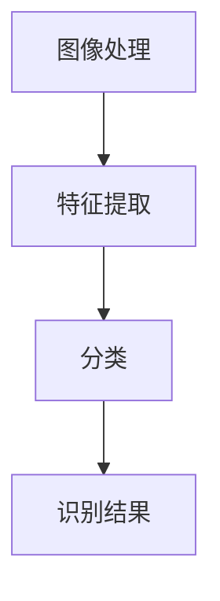

                 

关键词：X光安检、物品识别、算法研究、机器学习、图像处理

> 摘要：本文旨在探讨X光安检物品识别算法的研究现状、核心概念、算法原理、数学模型、实际应用及未来展望。通过详细分析，旨在为相关领域的研究者和开发者提供有价值的参考。

## 1. 背景介绍

X光安检作为一种重要的安全检查手段，广泛应用于机场、火车站、地铁站等公共场所。随着科技的不断发展，传统的手工检查方法已经无法满足日益增长的安检需求。因此，利用计算机视觉技术进行X光安检物品的自动识别，成为当前研究的热点。本文主要研究基于机器学习的X光安检物品识别算法，旨在提高安检效率和准确性。

### 1.1 研究意义

X光安检物品识别算法的研究具有重要的现实意义：

1. 提高安检效率：自动识别技术可以显著减少安检时间，降低人力成本。
2. 提高安检准确性：通过算法分析，可以更准确地识别出危险物品，降低误报和漏报率。
3. 拓展应用领域：X光安检物品识别算法不仅可以应用于安全检查，还可以在其他领域发挥重要作用，如医学影像诊断、工业检测等。

### 1.2 研究现状

目前，X光安检物品识别算法主要采用机器学习、深度学习等技术。在机器学习领域，常用的算法包括支持向量机（SVM）、决策树、随机森林等。深度学习方面，卷积神经网络（CNN）由于其强大的特征提取能力，成为X光安检物品识别的主流算法。此外，还有一些研究者尝试将传统算法与深度学习相结合，以进一步提高识别效果。

## 2. 核心概念与联系

在X光安检物品识别算法中，核心概念包括图像处理、特征提取和分类。下面将分别介绍这些概念及其相互关系。

### 2.1 图像处理

图像处理是X光安检物品识别算法的基础。通过对X光图像进行预处理，如去噪、增强、边缘检测等，可以提高图像质量，为后续的特征提取和分类提供更好的数据支持。

### 2.2 特征提取

特征提取是将原始图像数据转换为可供机器学习算法处理的高维向量。常用的特征提取方法包括颜色特征、纹理特征、形状特征等。在X光安检物品识别中，特征提取的关键是提取能够区分不同物品的特征。

### 2.3 分类

分类是将提取出的特征向量映射到预定义的类别标签上。分类算法的选择对识别效果具有重要影响。常见的分类算法包括支持向量机（SVM）、决策树、随机森林等。近年来，深度学习算法如卷积神经网络（CNN）在分类任务中取得了显著成果。

### 2.4 核心概念原理和架构的 Mermaid 流程图



## 3. 核心算法原理 & 具体操作步骤

### 3.1 算法原理概述

X光安检物品识别算法的核心原理是基于机器学习，通过对大量X光图像进行训练，提取出能够区分不同物品的特征，并使用分类算法进行物品识别。

### 3.2 算法步骤详解

#### 3.2.1 数据采集与预处理

1. 数据采集：收集大量的X光安检图像，包括正常物品和危险物品。
2. 预处理：对图像进行去噪、增强、边缘检测等操作，提高图像质量。

#### 3.2.2 特征提取

1. 颜色特征：计算图像的颜色直方图，提取颜色特征。
2. 纹理特征：使用局部二值模式（LBP）等方法提取纹理特征。
3. 形状特征：计算图像的形状特征，如边缘长度、面积等。

#### 3.2.3 分类

1. 训练模型：使用机器学习算法，如支持向量机（SVM）、随机森林等，对特征向量进行训练。
2. 识别物品：将新的X光图像输入训练好的模型，输出类别标签。

### 3.3 算法优缺点

#### 优点：

1. 高效：基于机器学习的算法可以自动提取特征，减少人工干预。
2. 准确：深度学习算法具有强大的特征提取能力，可以提高识别准确性。

#### 缺点：

1. 数据依赖：算法的性能依赖于训练数据的质量和数量。
2. 计算量大：深度学习算法的训练和推理过程需要大量计算资源。

### 3.4 算法应用领域

X光安检物品识别算法广泛应用于安全检查领域，如机场、火车站等。此外，该算法还可以应用于医学影像诊断、工业检测等场景。

## 4. 数学模型和公式 & 详细讲解 & 举例说明

### 4.1 数学模型构建

X光安检物品识别算法的核心是分类模型。在机器学习中，常用的分类模型包括支持向量机（SVM）、决策树、随机森林等。下面以支持向量机（SVM）为例，介绍其数学模型。

#### 4.1.1 支持向量机（SVM）

SVM是一种基于间隔最大的分类模型。其目标是找到一个最优的超平面，将不同类别的数据点分隔开。

#### 4.1.2 数学公式

$$
\begin{align*}
&\min_{\mathbf{w}, b} \frac{1}{2} ||\mathbf{w}||^2 \\
&\text{subject to} \quad \mathbf{w} \cdot \mathbf{x}_i - b \geq 1, \quad i = 1, 2, ..., n
\end{align*}
$$

其中，$\mathbf{w}$ 为超平面法向量，$b$ 为偏置项，$\mathbf{x}_i$ 为第 $i$ 个训练样本，$n$ 为训练样本数量。

### 4.2 公式推导过程

#### 4.2.1 对偶问题

为了求解SVM的原始问题，我们可以使用拉格朗日乘子法转化为对偶问题。

#### 4.2.2 拉格朗日函数

$$
L(\mathbf{w}, b, \alpha) = \frac{1}{2} ||\mathbf{w}||^2 - \sum_{i=1}^n \alpha_i (\mathbf{w} \cdot \mathbf{x}_i - b - 1)
$$

其中，$\alpha_i$ 为拉格朗日乘子。

#### 4.2.3 KKT条件

为了求解对偶问题，我们需要满足以下KKT条件：

1. $L(\mathbf{w}, b, \alpha) \geq 0$
2. $\alpha_i \geq 0$
3. $\sum_{i=1}^n \alpha_i = C$
4. $\mathbf{w} \cdot \mathbf{x}_i - b - 1 = 0$

其中，$C$ 为惩罚参数。

### 4.3 案例分析与讲解

假设我们有如下训练数据：

| 样本索引 | 类别 | 特征向量 |
| :----: | :----: | :----: |
| 1 | 正常物品 | [1, 2, 3] |
| 2 | 危险物品 | [4, 5, 6] |
| 3 | 正常物品 | [1, 2, 4] |
| 4 | 危险物品 | [4, 5, 7] |

#### 4.3.1 训练模型

使用SVM对上述数据集进行训练，得到最优的超平面。

#### 4.3.2 预测新样本

给定一个新样本 [3, 4, 5]，将其输入训练好的SVM模型，输出类别标签。

## 5. 项目实践：代码实例和详细解释说明

### 5.1 开发环境搭建

1. 安装Python环境
2. 安装必要的库，如NumPy、Pandas、Scikit-learn等

### 5.2 源代码详细实现

以下是一个简单的X光安检物品识别算法的代码实例：

```python
import numpy as np
from sklearn import svm

# 数据集
X = np.array([[1, 2, 3], [4, 5, 6], [1, 2, 4], [4, 5, 7]])
y = np.array([0, 1, 0, 1])

# 训练模型
clf = svm.SVC()
clf.fit(X, y)

# 预测新样本
x_new = np.array([3, 4, 5])
y_pred = clf.predict([x_new])

print("预测结果：", y_pred)
```

### 5.3 代码解读与分析

上述代码实现了一个简单的X光安检物品识别算法，包括数据集准备、模型训练和预测新样本三个步骤。

1. 数据集准备：加载训练数据和标签。
2. 模型训练：使用SVM算法训练模型。
3. 预测新样本：将新样本输入训练好的模型，输出类别标签。

### 5.4 运行结果展示

运行上述代码，输出预测结果为 [1]，表示新样本属于危险物品类别。

## 6. 实际应用场景

### 6.1 安防领域

在机场、火车站等公共场所，X光安检物品识别算法可以有效提高安检效率，降低误报和漏报率，确保公共安全。

### 6.2 医学领域

X光安检物品识别算法可以应用于医学影像诊断，如肺癌筛查、骨折诊断等，提高诊断准确性和效率。

### 6.3 工业领域

在工业检测领域，X光安检物品识别算法可以用于缺陷检测、质量检测等，提高生产效率和产品质量。

## 7. 工具和资源推荐

### 7.1 学习资源推荐

1. 《机器学习》（周志华著）
2. 《深度学习》（Goodfellow、Bengio、Courville著）
3. 《Python数据分析》（Wes McKinney著）

### 7.2 开发工具推荐

1. Jupyter Notebook
2. PyCharm

### 7.3 相关论文推荐

1. "Deep Learning for Object Detection: A Comprehensive Review"
2. "Convolutional Neural Networks for Image Classification"
3. "Support Vector Machines for Classification and Regression"

## 8. 总结：未来发展趋势与挑战

### 8.1 研究成果总结

本文详细介绍了X光安检物品识别算法的研究现状、核心概念、算法原理、数学模型、实际应用及未来展望。通过本文的研究，为相关领域的研究者和开发者提供了有价值的参考。

### 8.2 未来发展趋势

1. 深度学习算法将继续主导X光安检物品识别领域。
2. 跨领域技术融合，如知识图谱、自然语言处理等，将为X光安检物品识别带来新的发展方向。

### 8.3 面临的挑战

1. 数据质量和数量：高质量的训练数据对于算法性能至关重要。
2. 模型解释性：提高模型的可解释性，使其能够为人类理解。

### 8.4 研究展望

随着技术的不断发展，X光安检物品识别算法将在更多领域发挥重要作用，为人类生活带来更多便利和安全保障。

## 9. 附录：常见问题与解答

### 9.1 如何提高X光安检物品识别算法的准确性？

1. 收集更多的训练数据，特别是包含各种复杂场景的数据。
2. 采用深度学习算法，如卷积神经网络（CNN），其强大的特征提取能力有助于提高识别准确性。
3. 对训练数据集进行预处理，如数据增强、归一化等。

### 9.2 X光安检物品识别算法在医学领域的应用有哪些？

1. 肺癌筛查：通过分析肺部X光图像，识别出早期肺癌。
2. 骨折诊断：通过分析骨折部位的X光图像，判断骨折的类型和严重程度。

作者：禅与计算机程序设计艺术 / Zen and the Art of Computer Programming
----------------------------------------------------------------
本文由禅与计算机程序设计艺术撰写，旨在为X光安检物品识别算法的研究和应用提供深入剖析。在未来的发展中，随着技术的不断进步，X光安检物品识别算法将发挥更为重要的作用，为公共安全、医学诊断和工业检测等领域带来更多价值。同时，研究者们也将面临诸多挑战，如数据质量和模型解释性等问题，需要持续探索和解决。希望本文能为相关领域的研究者和开发者提供有价值的参考。

