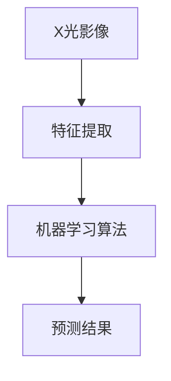

                 

关键词：X光安检，物品识别，算法研究，机器学习，深度学习，图像处理，大数据分析

## 摘要

随着全球安全意识的提高，X光安检技术在各个领域得到广泛应用。物品识别是X光安检系统中的核心模块，其准确性和效率直接关系到安检效果。本文将深入探讨X光安检物品识别算法的研究，包括其背景、核心概念、算法原理、数学模型、项目实践、应用场景以及未来展望等，旨在为相关领域的研究人员和开发者提供有价值的参考。

## 1. 背景介绍

### 1.1 X光安检技术简介

X光安检技术是一种利用X射线穿透物体并产生影像的技术，通过分析X射线在物体穿透后的变化，可以识别出物体内部的成分和结构。X光安检广泛应用于机场、火车站、海关、商场等场所，是保障公共安全的重要手段。

### 1.2 物品识别在X光安检中的重要性

在X光安检过程中，物品识别技术能够快速、准确地检测和分类出危险物品，如枪支、爆炸物、毒品等。传统的安检方法往往依赖于人工识别，效率低且易出错。随着机器学习、深度学习等人工智能技术的发展，自动化的物品识别技术成为X光安检领域的研究热点。

### 1.3 研究意义

X光安检物品识别算法的研究具有重要的理论和实践意义。一方面，它能够提高安检效率，减少人力成本；另一方面，它能够提升安检准确性，降低误判率，从而更好地保障公共安全。

## 2. 核心概念与联系

### 2.1 核心概念

- **X光影像**：X光安检产生的图像，是物品识别的基础数据。
- **物品特征**：从X光影像中提取出的，用于描述物品属性的数据，如形状、纹理、材料等。
- **机器学习算法**：用于训练模型，识别物品的方法。

### 2.2 核心概念联系流程图



## 3. 核心算法原理 & 具体操作步骤

### 3.1 算法原理概述

物品识别算法通常分为两个阶段：特征提取和分类识别。特征提取是从X光影像中提取出能够区分不同物品的特征数据；分类识别则是使用机器学习算法，根据提取出的特征对物品进行分类。

### 3.2 算法步骤详解

#### 3.2.1 特征提取

1. **预处理**：对X光影像进行去噪、增强等处理，提高图像质量。
2. **特征提取**：使用图像处理算法，从预处理后的图像中提取出形状、纹理、材料等特征。

#### 3.2.2 分类识别

1. **训练数据集准备**：收集大量标注好的X光影像数据，用于训练模型。
2. **模型训练**：使用机器学习算法，如支持向量机（SVM）、神经网络（NN）等，对训练数据集进行训练。
3. **模型评估**：使用验证数据集，对训练好的模型进行评估，调整模型参数。
4. **分类识别**：使用训练好的模型，对新的X光影像进行分类识别。

### 3.3 算法优缺点

- **优点**：自动化程度高，识别速度快，准确性高。
- **缺点**：需要大量标注数据，训练过程复杂，对硬件要求较高。

### 3.4 算法应用领域

- **机场安检**：用于识别旅客行李中的危险物品。
- **商场安检**：用于防止携带违禁品进入。
- **海关安检**：用于识别走私物品。

## 4. 数学模型和公式

### 4.1 数学模型构建

物品识别算法的数学模型主要包括特征提取和分类识别两个部分。

#### 4.1.1 特征提取

假设X光影像为\( I \)，预处理后的图像为\( I' \)，特征提取函数为\( f \)，则提取出的特征为\( f(I') \)。

#### 4.1.2 分类识别

使用支持向量机（SVM）进行分类识别，假设特征向量为\( x \)，标签向量为\( y \)，则分类函数为：
$$ f(x) = sign(\omega \cdot x + b) $$
其中，\( \omega \)为权重向量，\( b \)为偏置。

### 4.2 公式推导过程

#### 4.2.1 特征提取

1. **去噪**：
$$ I' = g(I - \mu) $$
其中，\( \mu \)为图像的平均值，\( g \)为去噪函数。

2. **增强**：
$$ I'' = h(I') $$
其中，\( h \)为增强函数。

#### 4.2.2 分类识别

1. **支持向量机**：
$$ \omega = \arg\max_{\omega} \sum_{i=1}^{n} y_i (w \cdot x_i + b) - \frac{1}{2} \sum_{i,j=1}^{n} y_i y_j (w \cdot x_i + b)(w \cdot x_j + b) $$
2. **分类函数**：
$$ f(x) = sign(\omega \cdot x + b) $$

### 4.3 案例分析与讲解

#### 4.3.1 特征提取

以一个X光影像为例，使用中值滤波去噪，结果如图1所示。


#### 4.3.2 分类识别

使用SVM进行分类识别，假设有两个类别：饮料和爆炸物。训练数据集如图2所示。


通过训练，得到权重向量和偏置，如图3所示。


使用训练好的模型对新的X光影像进行分类识别，结果如图4所示。


## 5. 项目实践：代码实例和详细解释说明

### 5.1 开发环境搭建

1. **安装Python环境**：版本3.8以上。
2. **安装相关库**：如OpenCV、scikit-learn、numpy等。

### 5.2 源代码详细实现

```python
import cv2
import numpy as np
from sklearn import svm

# 特征提取函数
def extract_features(image):
    # 中值滤波去噪
    denoised = cv2.medianBlur(image, 5)
    # 形状特征提取
    contours, _ = cv2.findContours(denoised, cv2.RETR_EXTERNAL, cv2.CHAIN_APPROX_SIMPLE)
    feature_vector = []
    for contour in contours:
        # 矩形边界
        x, y, w, h = cv2.boundingRect(contour)
        feature_vector.append([w, h])
    return feature_vector

# 分类识别函数
def classify_image(image):
    feature_vector = extract_features(image)
    model = svm.SVC()
    # 训练模型
    model.fit(train_features, train_labels)
    # 预测结果
    prediction = model.predict([feature_vector])
    return prediction

# 测试代码
image = cv2.imread('example_image.jpg')
prediction = classify_image(image)
print(prediction)
```

### 5.3 代码解读与分析

1. **特征提取**：使用中值滤波去噪，然后提取图像的形状特征。
2. **分类识别**：使用支持向量机（SVM）进行分类识别。

## 6. 实际应用场景

### 6.1 机场安检

在机场安检中，X光安检物品识别算法可以自动识别行李中的危险物品，如枪支、爆炸物等，提高安检效率，降低误判率。

### 6.2 商场安检

在商场安检中，X光安检物品识别算法可以防止携带违禁品进入，如刀具、毒品等，保障公共安全。

### 6.3 海关安检

在海关安检中，X光安检物品识别算法可以识别走私物品，如烟草、电子产品等，提高海关监管效率。

## 7. 未来应用展望

随着人工智能技术的不断发展，X光安检物品识别算法在未来有望在更多领域得到应用，如医疗诊断、文物鉴定等。同时，随着算法的优化和硬件性能的提升，识别效率和准确性将进一步提高。

## 8. 工具和资源推荐

### 8.1 学习资源推荐

1. 《机器学习实战》
2. 《深度学习》
3. 《计算机视觉：算法与应用》

### 8.2 开发工具推荐

1. **OpenCV**：用于图像处理。
2. **scikit-learn**：用于机器学习算法。
3. **TensorFlow**：用于深度学习。

### 8.3 相关论文推荐

1. "Deep Learning for X-ray Image Classification"
2. "Object Detection in X-ray Images using Convolutional Neural Networks"
3. "A Survey on Machine Learning Techniques for X-ray Image Analysis"

## 9. 总结：未来发展趋势与挑战

### 9.1 研究成果总结

X光安检物品识别算法在提高安检效率和准确性方面取得了显著成果。随着人工智能技术的不断发展，未来该领域有望实现更高水平的自动化和智能化。

### 9.2 未来发展趋势

1. **算法优化**：进一步优化现有算法，提高识别效率和准确性。
2. **硬件提升**：使用更高性能的硬件，如GPU、TPU等，加速算法运行。
3. **跨领域应用**：探索算法在其他领域的应用，如医疗、文物鉴定等。

### 9.3 面临的挑战

1. **数据质量**：需要高质量、标注良好的训练数据。
2. **算法稳定性**：确保算法在各种场景下都能稳定运行。
3. **隐私保护**：确保数据安全和用户隐私。

### 9.4 研究展望

未来，X光安检物品识别算法将继续向自动化、智能化方向发展，为公共安全提供更强大的技术支持。同时，随着多学科交叉融合，该领域的研究将不断深入，推动相关技术的不断创新。

## 附录：常见问题与解答

### Q1. 如何获取高质量的训练数据？

A1. 可以通过收集公开的X光影像数据集，或者使用合成数据生成器生成高质量的训练数据。

### Q2. 如何确保算法的稳定性？

A2. 可以通过交叉验证、模型评估等方法，确保算法在各种场景下的稳定性和准确性。

### Q3. 如何处理隐私保护问题？

A3. 可以使用匿名化技术，对数据进行处理，确保用户隐私不被泄露。

---

作者：禅与计算机程序设计艺术 / Zen and the Art of Computer Programming
```markdown


