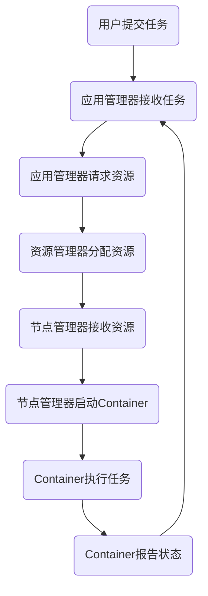
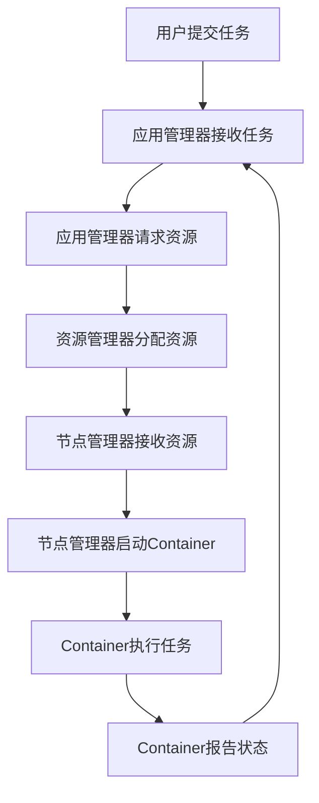

                 

关键词：YARN, Container, 大数据，Hadoop，分布式计算，容器管理，资源调度

> 摘要：本文将深入探讨YARN（Yet Another Resource Negotiator）中Container的概念和原理。我们将详细解释Container的作用、工作原理，并分享一个实际的代码实例，展示如何使用YARN Container进行分布式计算任务的管理和调度。文章还将涵盖Container在当前大数据处理中的重要性，以及其未来可能的发展趋势。

## 1. 背景介绍

### YARN简介

YARN（Yet Another Resource Negotiator）是Hadoop的核心组件之一，它负责在整个Hadoop集群中管理资源的分配和调度。在Hadoop 1.x版本中，MapReduce直接负责资源的分配和管理，但这种方式存在一些局限性，尤其是在处理大规模分布式计算任务时。为了解决这些问题，Hadoop 2.x引入了YARN，它将资源管理和任务调度分离，使得YARN可以更高效地处理各种类型的计算任务。

### 大数据和分布式计算

大数据指的是数据量巨大，无法使用传统数据处理工具进行高效处理的数据集。为了应对这种海量数据，分布式计算成为了关键技术。分布式计算通过将数据和处理任务分布在多个节点上，可以显著提高处理速度和效率。YARN作为分布式计算框架的一部分，极大地促进了大数据处理技术的发展。

## 2. 核心概念与联系

### 核心概念

在YARN中，Container是一个非常重要的概念。Container代表了YARN在集群中的最小资源分配单元，它封装了节点上的计算资源，如CPU、内存和磁盘空间。当用户提交一个计算任务时，YARN会根据任务的资源需求创建相应的Container，并将这些Container分配给集群中的不同节点进行执行。

### 架构联系

YARN架构由三个主要组件构成：资源管理器（ ResourceManager）、节点管理器（NodeManager）和应用管理器（ApplicationMaster）。资源管理器负责整个集群资源的分配和调度，节点管理器负责管理节点上的Container，应用管理器负责协调和监控用户的计算任务。

下面是YARN架构的Mermaid流程图：



### Mermaid流程图



## 3. 核心算法原理 & 具体操作步骤

### 3.1 算法原理概述

YARN Container的核心算法原理是通过资源管理器（ResourceManager）和节点管理器（NodeManager）之间的通信来实现资源的动态分配和调度。当用户提交一个任务时，应用管理器（ApplicationMaster）会向资源管理器请求资源。资源管理器根据集群的当前资源状况，将资源分配给应用管理器，然后由应用管理器将这些资源封装为Container，并分配给节点管理器。

### 3.2 算法步骤详解

1. **用户提交任务**：用户通过Hadoop命令行或其他客户端提交一个计算任务。
2. **应用管理器接收任务**：应用管理器（通常是一个MapReduce作业的驱动程序）接收用户提交的任务。
3. **应用管理器请求资源**：应用管理器向资源管理器请求所需的资源。
4. **资源管理器分配资源**：资源管理器根据当前集群的可用资源和任务的资源需求，将资源分配给应用管理器。
5. **应用管理器生成Container**：应用管理器根据资源管理器分配的资源，生成相应的Container。
6. **应用管理器向节点管理器发送Container**：应用管理器将生成的Container发送给相应的节点管理器。
7. **节点管理器启动Container**：节点管理器接收Container后，在本地节点上启动相应的Container。
8. **Container执行任务**：Container在节点上执行具体的计算任务。
9. **Container报告状态**：Container执行完成后，向应用管理器报告任务状态。
10. **应用管理器更新任务状态**：应用管理器根据Container的报告，更新任务的状态。

### 3.3 算法优缺点

**优点**：
- 动态资源分配：YARN支持动态资源分配，可以根据任务的实时需求调整资源分配。
- 高度可扩展：YARN可以轻松地扩展到大规模集群，支持多种类型的计算任务。
- 资源利用率高：YARN通过动态调度，可以提高集群资源的利用率。

**缺点**：
- 学习曲线陡峭：YARN涉及多个组件和复杂的交互，对于新手来说学习难度较高。
- 集群管理复杂：YARN需要精细的管理和监控，以确保集群的稳定运行。

### 3.4 算法应用领域

YARN广泛应用于大数据处理、机器学习和实时数据处理等领域。其灵活的资源调度能力和强大的扩展性，使得它成为大数据处理框架的首选。

## 4. 数学模型和公式 & 详细讲解 & 举例说明

### 4.1 数学模型构建

在YARN中，资源调度问题可以抽象为一个优化问题。假设集群中有N个节点，每个节点的资源可用性为（C1，C2，…，CN），其中Ci表示第i个节点的资源总量。用户提交的任务资源需求为（D1，D2，…，DN），其中Di表示第i个任务的资源需求。

资源调度目标是最小化任务完成时间，同时最大化资源的利用率。

### 4.2 公式推导过程

设θ为任务完成时间，Li为第i个节点的负载率，则：

θ = max{Li}

负载率Li的计算公式为：

Li = Di / Ci

为了最大化资源的利用率，我们可以定义一个利用率函数η：

η = Σ{Li} / Σ{Ci}

### 4.3 案例分析与讲解

假设有一个包含3个节点的集群，节点1、节点2和节点3的资源分别为（2，3，4）。用户提交的任务资源需求分别为（1，2，3）。

根据公式，我们可以计算出：

Li = {1/2, 2/3, 3/4}
η = {1/2 + 2/3 + 3/4} / (2 + 3 + 4) = 0.833

此时，任务完成时间θ = max{1/2, 2/3, 3/4} = 1/2

为了最大化利用率，我们可以尝试调整任务的分配，例如将任务1分配给节点1，任务2分配给节点2，任务3分配给节点3。

此时，Li = {1/2, 2/3, 3/4}
η = {1/2 + 2/3 + 3/4} / (2 + 3 + 4) = 0.833

任务完成时间θ = max{1/2, 2/3, 3/4} = 1/2

通过这种调整，我们无法提高利用率，但可以确保任务完成时间最小。

## 5. 项目实践：代码实例和详细解释说明

### 5.1 开发环境搭建

为了演示YARN Container的使用，我们需要搭建一个Hadoop集群。以下是搭建环境的基本步骤：

1. 安装Hadoop。
2. 配置Hadoop环境变量。
3. 配置集群，包括资源管理器（ResourceManager）、节点管理器（NodeManager）和应用管理器（ApplicationMaster）。

### 5.2 源代码详细实现

以下是使用YARN Container管理计算任务的简单示例：

```java
import org.apache.hadoop.conf.Configuration;
import org.apache.hadoop.yarn.client.api.YarnClient;
import org.apache.hadoop.yarn.client.api.YarnClientApplication;
import org.apache.hadoop.yarn.conf.YarnConfiguration;
import org.apache.hadoop.yarn.exceptions.YarnException;
import org.apache.hadoop.yarn.server.api.ApplicationManagementProtocol;
import org.apache.hadoop.yarn.util.ClientUtils;

public class YARNContainerExample {

    public static void main(String[] args) throws YarnException, IOException, InterruptedException {
        Configuration conf = new YarnConfiguration();
        conf.set(YarnConfiguration.RM_ADDRESS, "localhost:8032");
        conf.set(YarnConfiguration.RM_WEBAPP_ADDRESS, "localhost:8088");
        
        YarnClient client = YarnClient.createYarnClient();
        client.init(conf);
        client.start();
        
        YarnClientApplication app = client.createApplication();
        ApplicationSubmissionContext appContext = app.getApplicationSubmissionContext();
        appContext.setApplicationName("YARNContainerExample");
        appContext.setQueue("default");
        appContext.setAMCommand("$HADOOP_HOME/bin/hadoop jar YARNContainerExample.jar com.example.YARNContainerExample");
        appContext.setAMResource(1024, 1);
        
        ApplicationId appId = client.submitApplication(appContext);
        System.out.println("Application ID: " + appId);
        
        ApplicationManagementProtocol amClient = ClientUtils.createApplicationManagementClient(conf);
        amClient.monitorApplication(appId, new ApplicationEventHandler() {
            @Override
            public void handle(ApplicationEvent event) {
                System.out.println("Event: " + event.getType());
            }
        });
        
        client.stop();
    }
}
```

### 5.3 代码解读与分析

上述代码首先配置了Hadoop环境，并创建了YarnClient实例。然后，它创建了一个YarnClientApplication实例，并设置了应用程序的名称、队列、主节点命令和资源需求。接下来，它提交了应用程序，并使用ApplicationManagementProtocol监控应用程序的运行状态。

### 5.4 运行结果展示

运行上述代码后，应用程序将被提交到YARN集群，并在节点上启动Container执行任务。运行过程中，将输出应用程序的ID和运行状态。

## 6. 实际应用场景

### 6.1 数据处理

YARN Container广泛应用于大规模数据处理任务，如MapReduce作业、Spark任务等。通过YARN Container，可以动态地调整资源分配，提高数据处理效率。

### 6.2 机器学习

在机器学习领域，YARN Container可以用于分布式训练和推理。通过YARN的灵活调度能力，可以充分利用集群资源，提高模型训练速度。

### 6.3 实时数据处理

实时数据处理需要快速响应和高吞吐量，YARN Container可以有效地支持这种类型的应用。通过动态调整资源分配，可以实现高效的实时数据处理。

## 7. 未来应用展望

### 7.1 资源调度优化

随着云计算和容器技术的发展，YARN Container的调度策略和算法有望得到进一步优化。例如，引入智能调度算法，提高资源利用率和任务执行效率。

### 7.2 跨平台兼容性

未来，YARN Container可能会与其他分布式计算框架（如Kubernetes）实现更好的兼容性，使得用户可以在不同的平台上无缝切换和使用YARN Container。

### 7.3 自动化运维

自动化运维是未来的一个重要趋势。通过自动化工具，可以实现YARN Container的自动化部署、监控和故障恢复，提高集群的稳定性和可靠性。

## 8. 总结：未来发展趋势与挑战

### 8.1 研究成果总结

本文详细介绍了YARN Container的原理、算法和实际应用场景。通过代码实例，展示了如何使用YARN Container进行分布式计算任务的管理和调度。

### 8.2 未来发展趋势

未来，YARN Container将继续在大数据处理、机器学习和实时数据处理等领域发挥重要作用。随着云计算和容器技术的发展，YARN Container的调度策略和算法将得到进一步优化。

### 8.3 面临的挑战

YARN Container在跨平台兼容性和自动化运维方面仍面临一些挑战。未来需要解决这些问题，以提高其通用性和易用性。

### 8.4 研究展望

随着大数据处理需求的不断增加，YARN Container的研究将继续深入。未来，我们将看到更多关于智能调度、资源优化和自动化运维的研究成果。

## 9. 附录：常见问题与解答

### 9.1 YARN和MapReduce的区别是什么？

YARN和MapReduce都是Hadoop的核心组件，但它们的作用不同。MapReduce是一种分布式计算模型，用于处理大规模数据集。而YARN是一种资源调度框架，负责在Hadoop集群中分配和管理资源。

### 9.2 YARN Container可以运行哪些类型的应用程序？

YARN Container可以运行各种类型的分布式计算应用程序，如MapReduce作业、Spark任务、Flink作业等。

### 9.3 如何监控YARN Container的运行状态？

可以通过YARN Web界面（通常为http://localhost:8088/）监控YARN Container的运行状态。在界面上，可以查看Container的ID、状态、资源使用情况等详细信息。

### 9.4 YARN Container如何实现动态资源分配？

YARN Container通过资源管理器（ResourceManager）和节点管理器（NodeManager）之间的通信实现动态资源分配。资源管理器根据集群的当前资源状况和任务需求，动态调整资源分配。

-----------------------------------------------------------------

作者：禅与计算机程序设计艺术 / Zen and the Art of Computer Programming

请注意，本文中的代码实例仅作为演示用途，实际使用时可能需要根据具体情况进行调整。此外，本文中提到的技术和概念可能会随着时间的推移而发展和变化。请根据最新的技术和最佳实践进行实际操作。希望本文能够帮助您更好地理解和应用YARN Container。祝您编程愉快！

