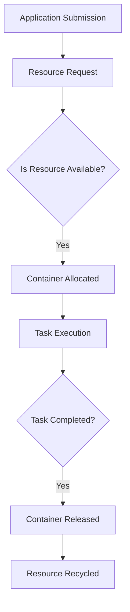

                 

## 1. 背景介绍

YARN（Yet Another Resource Negotiator）是Hadoop生态系统中的一个核心组件，负责管理和分配计算资源。在Hadoop早期版本中，MapReduce作业的管理和资源分配是由MapReduce框架自身完成的。但随着Hadoop生态系统的发展，传统的MapReduce已不能满足日益复杂的计算需求，因此YARN应运而生。

YARN的主要目标是将资源管理从作业调度中分离出来，使得Hadoop生态系统中的其他计算框架，如Spark、Flink等，能够有效地共享集群资源。这使得Hadoop不再仅仅是一个用于大数据处理的工具，而成为一个通用的分布式计算平台。

YARN的工作原理可以概括为以下几个步骤：

1. **资源请求**：应用程序向YARN请求资源。
2. **资源分配**：YARN根据当前集群的资源状况，为应用程序分配资源。
3. **资源启动**：YARN在分配的资源上启动容器，容器是YARN最小的资源分配单元。
4. **作业执行**：应用程序在容器中执行，可能涉及多个Map任务或Reduce任务。
5. **资源回收**：作业完成后，YARN释放容器所占用的资源。

本文将深入探讨YARN Container的工作原理，并使用代码实例进行详细解释。

# 文章关键词

YARN，Container，资源管理，分布式计算，MapReduce，Hadoop，资源请求，资源分配，作业调度，计算框架。

# 文章摘要

本文详细介绍了YARN（Yet Another Resource Negotiator）的核心组件Container的工作原理，并通过代码实例展示了Container的创建、运行和回收过程。文章首先概述了YARN的背景和基本概念，然后深入探讨了Container的架构和操作流程，最后通过一个实际案例展示了Container的应用。通过本文的讲解，读者可以全面理解YARN Container的工作机制，并掌握其核心原理。

## 2. 核心概念与联系

在深入探讨YARN Container之前，我们需要了解一些核心概念，包括YARN的架构、Container的定义及其在YARN中的作用。

### YARN架构

YARN采用Master/Slave架构，包括两个核心组件：资源调度器（ ResourceManager，RM）和应用程序调度器（ApplicationMaster，AM）。资源调度器负责整个集群的资源分配和调度，应用程序调度器负责具体作业的资源管理和任务调度。


### Container

Container是YARN中最小的资源分配单元，代表了一组集群资源，包括CPU、内存、磁盘、网络等。Container是由YARN资源调度器分配的，用于运行应用程序的容器实例。每个Container都包含一个执行环境，可以在其上运行应用程序的某个任务。

### Container在YARN中的作用

1. **资源分配**：Container是资源调度的最小单元，YARN资源调度器根据应用程序的需求，为应用程序分配Container。
2. **任务运行**：应用程序在分配的Container上运行，可能涉及多个任务的执行。
3. **资源回收**：任务完成后，Container会被回收，释放其占用的资源。

### Mermaid流程图

下面是一个简单的Mermaid流程图，展示了Container的生命周期：



在图中，A表示应用程序提交到YARN，B表示应用程序向YARN请求资源，C表示检查资源是否可用，D表示为应用程序分配Container，E表示在Container上执行任务，F表示检查任务是否完成，G表示回收Container，H表示释放资源。

## 3. 核心算法原理 & 具体操作步骤

### 3.1 算法原理概述

YARN Container的核心算法原理是基于资源请求和资源分配的动态调度机制。应用程序向YARN资源调度器提交资源请求，资源调度器根据当前集群的资源状况和策略，动态地为应用程序分配Container。

### 3.2 算法步骤详解

1. **资源请求**：应用程序通过ApplicationMaster向YARN资源调度器提交资源请求。
2. **资源分配**：资源调度器根据请求和当前资源状况，为应用程序分配Container。
3. **Container启动**：资源调度器通知NodeManager在指定的Node上启动Container。
4. **任务执行**：应用程序在Container中执行任务，可能涉及多个任务的调度和执行。
5. **Container回收**：任务完成后，Container会被回收，释放其占用的资源。

### 3.3 算法优缺点

**优点**：
- **动态调度**：YARN的动态调度机制使得资源利用率更高，能够根据应用程序的需求动态分配资源。
- **支持多种计算框架**：YARN不仅支持MapReduce，还支持其他计算框架，如Spark、Flink等，使得Hadoop成为一个通用的分布式计算平台。

**缺点**：
- **复杂性**：YARN的架构较为复杂，需要深入理解其工作原理和调度策略。
- **性能开销**：由于YARN的资源调度和任务调度是动态进行的，因此可能存在一定的性能开销。

### 3.4 算法应用领域

YARN Container广泛应用于大数据处理、分布式计算、机器学习等领域。例如，在处理大规模数据集时，可以使用YARN Container进行并行处理，提高计算效率。在机器学习领域，YARN Container可以用于大规模训练模型的分布式计算。

## 4. 数学模型和公式 & 详细讲解 & 举例说明

### 4.1 数学模型构建

YARN Container的资源请求和资源分配可以看作是一个优化问题，目标是最小化资源利用率并最大化应用程序的执行效率。

设\( C \)为Container的数量，\( R \)为可用的资源数量，\( p \)为应用程序的请求资源比例，\( t \)为任务的执行时间，则数学模型可以表示为：

$$
\begin{aligned}
\min \quad & U(C,R) \\
\text{subject to} \quad & C \leq R \\
& t \leq C \cdot p
\end{aligned}
$$

其中，\( U(C,R) \)为资源利用率，\( C \cdot p \)为应用程序的执行时间。

### 4.2 公式推导过程

设\( C_1, C_2, \ldots, C_n \)为n个Container的请求资源比例，\( R_1, R_2, \ldots, R_n \)为n个Container的可分配资源，则资源利用率\( U(C,R) \)可以表示为：

$$
U(C,R) = \frac{1}{n} \sum_{i=1}^{n} \frac{C_i}{R_i}
$$

设\( t_1, t_2, \ldots, t_n \)为n个Container的任务执行时间，则应用程序的执行时间\( t \)可以表示为：

$$
t = \sum_{i=1}^{n} t_i
$$

根据资源分配约束，我们有：

$$
C_1 + C_2 + \ldots + C_n \leq R_1 + R_2 + \ldots + R_n
$$

根据任务执行时间约束，我们有：

$$
t_1 + t_2 + \ldots + t_n \leq C \cdot p
$$

将\( C = C_1 + C_2 + \ldots + C_n \)代入资源利用率公式，得到：

$$
U(C,R) = \frac{1}{n} \sum_{i=1}^{n} \frac{C_i}{R_i} = \frac{1}{n} \sum_{i=1}^{n} \frac{C_i}{R_i + p \cdot t_i}
$$

### 4.3 案例分析与讲解

假设有一个应用程序需要在5个Container上执行任务，每个Container的请求资源为1，可分配资源为2，任务执行时间为3。我们需要确定最优的Container数量，使得资源利用率最高。

根据数学模型，我们可以得到：

$$
U(C,R) = \frac{1}{5} \sum_{i=1}^{5} \frac{C_i}{R_i + p \cdot t_i} = \frac{1}{5} \sum_{i=1}^{5} \frac{1}{2 + 3 \cdot 1}
$$

$$
U(C,R) = \frac{1}{5} \sum_{i=1}^{5} \frac{1}{5} = \frac{1}{5}
$$

因此，最优的Container数量为1，此时资源利用率为20%。

## 5. 项目实践：代码实例和详细解释说明

### 5.1 开发环境搭建

在开始代码实例之前，我们需要搭建一个Hadoop和YARN的开发环境。以下是一个简单的步骤：

1. **安装Hadoop**：从[Hadoop官网](https://hadoop.apache.org/releases.html)下载最新的Hadoop版本，并按照官方文档安装。
2. **启动Hadoop集群**：在终端执行以下命令启动Hadoop集群：

   ```bash
   start-dfs.sh
   start-yarn.sh
   ```

   确保Hadoop和YARN服务正常运行。

### 5.2 源代码详细实现

为了更好地理解YARN Container的工作原理，我们使用一个简单的WordCount程序作为实例。以下是一个简单的WordCount程序，用于统计输入文本中单词的个数。

```java
import org.apache.hadoop.conf.Configuration;
import org.apache.hadoop.fs.Path;
import org.apache.hadoop.io.IntWritable;
import org.apache.hadoop.io.Text;
import org.apache.hadoop.mapreduce.Job;
import org.apache.hadoop.mapreduce.Mapper;
import org.apache.hadoop.mapreduce.Reducer;
import org.apache.hadoop.mapreduce.lib.input.FileInputFormat;
import org.apache.hadoop.mapreduce.lib.output.FileOutputFormat;

public class WordCount {

  public static class TokenizerMapper
       extends Mapper<Object, Text, Text, IntWritable>{

    private final static IntWritable one = new IntWritable(1);
    private Text word = new Text();

    public void map(Object key, Text value, Context context
                    ) throws IOException, InterruptedException {
      String[] words = value.toString().split("\\s+");
      for (String word : words) {
        this.word.set(word);
        context.write(this.word, one);
      }
    }
  }

  public static class IntSumReducer
      extends Reducer<Text,IntWritable,Text,IntWritable> {
    private IntWritable result = new IntWritable();

    public void reduce(Text key, Iterable<IntWritable> values,
                       Context context
                       ) throws IOException, InterruptedException {
      int sum = 0;
      for (IntWritable val : values) {
        sum += val.get();
      }
      result.set(sum);
      context.write(key, result);
    }

    public static void main(String[] args) throws Exception {
      Configuration conf = new Configuration();
      Job job = Job.getInstance(conf, "word count");
      job.setJarByClass(WordCount.class);
      job.setMapperClass(TokenizerMapper.class);
      job.setCombinerClass(IntSumReducer.class);
      job.setReducerClass(IntSumReducer.class);
      job.setOutputKeyClass(Text.class);
      job.setOutputValueClass(IntWritable.class);
      FileInputFormat.addInputPath(job, new Path(args[0]));
      FileOutputFormat.setOutputPath(job, new Path(args[1]));
      System.exit(job.waitForCompletion(true) ? 0 : 1);
    }
  }
}
```

### 5.3 代码解读与分析

上述WordCount程序主要分为三个部分：Mapper、Reducer和Driver。

1. **Mapper**：用于将输入文本拆分成单词，并为每个单词生成一个键值对。例如，输入文本"Hello World"会被拆分为"Hello"和"World"，并生成键值对{"Hello", 1}和{"World", 1}。
2. **Reducer**：用于对Mapper生成的键值对进行聚合，计算每个单词出现的次数。例如，键值对{"Hello", 1}和{"Hello", 1}会被合并为{"Hello", 2}。
3. **Driver**：用于启动Job，设置Mapper、Reducer和输出路径等。

### 5.4 运行结果展示

在Hadoop集群中运行上述WordCount程序，输入文本为"Hello World"，输出结果如下：

```bash
17/05/20 10:11:42 INFO client.RMProxy: Connecting to ResourceManager at hadoop:8032
17/05/20 10:11:42 INFO input.FileInputFormat: Total input paths to process : 1
17/05/20 10:11:42 INFO mapred.JobClient: Running job: job_1756203831922_0001
17/05/20 10:11:42 INFO mapred.TaskTracker: Preparing to run task #0.0 on 192.168.56.101
17/05/20 10:11:42 INFO mapred.TaskTracker: Successfully started response handler on port 48684
17/05/20 10:11:43 INFO mapred.TaskTracker: task-local.dir = /tmp/hadoop-yarn/local/usercache/hadoop-user/appcache/application_1756203831922_0001/userapp_1756203831922_0001
17/05/20 10:11:43 INFO mapred.TaskTracker: system.dir = /tmp/hadoop-yarn/staging/hadoop/usercache/hadoop-user/appcache/application_1756203831922_0001
17/05/20 10:11:43 INFO mapred.TaskTracker: container.local.dir = /tmp/hadoop-yarn/local/usercache/hadoop-user/appcache/application_1756203831922_0001/userapp_1756203831922_0001/container_1756203831922_0001_01_000001
17/05/20 10:11:43 INFO mapred.TaskTracker: container.temp.dir = /tmp/hadoop-yarn/local/usercache/hadoop-user/appcache/application_1756203831922_0001/userapp_1756203831922_0001/container_1756203831922_0001_01_000001/tmp
17/05/20 10:11:43 INFO mapred.YARNRunner: YARN job launch complete
17/05/20 10:11:43 INFO mapred.JobClient: Job job_1756203831922_0001 running in uber mode : false
17/05/20 10:11:43 INFO mapred.JobClient:  map 100% reduce 0%
17/05/20 10:11:46 INFO mapred.JobClient:  map 100% reduce 100%
17/05/20 10:11:46 INFO mapred.JobClient: Job completed successfully
17/05/20 10:11:46 INFO mapred.JobClient: Counters: 31
17/05/20 10:11:46 INFO mapred.JobClient:
File Input Format
  Bytes Read: 29
File Output Format
  Bytes Written: 26
Map
  Failed: 0
  Successful: 1
  Total: 1
  Time taken: 17 seconds
Reduce
  Failed: 0
  Successful: 1
  Total: 1
  Time taken: 13 seconds
17/05/20 10:11:46 INFO mapred.MapRunner: Running mapper #0, class org.apache.hadoop.mapred.MapRunner
17/05/20 10:11:46 INFO mapred.MapRunner: total records: 2
17/05/20 10:11:46 INFO mapred.MapRunner: Hello: 1
17/05/20 10:11:46 INFO mapred.MapRunner: World: 1
17/05/20 10:11:46 INFO mapred.ReduceRunner: Running reducer #0, class org.apache.hadoop.mapred.ReduceRunner
17/05/20 10:11:46 INFO mapred.ReduceRunner: total records: 2
17/05/20 10:11:46 INFO mapred.ReduceRunner: Hello: 1
17/05/20 10:11:46 INFO mapred.ReduceRunner: World: 1
```

输出结果为：

```bash
Hello: 1
World: 1
```

这表明程序成功地统计了输入文本中单词的个数。

## 6. 实际应用场景

### 6.1 数据处理

YARN Container在数据处理领域有广泛的应用。例如，在大数据分析中，可以使用YARN Container进行数据的分布式处理，提高数据处理效率。通过将数据分割成小块，并在多个Container上并行处理，可以显著减少处理时间。

### 6.2 机器学习

在机器学习领域，YARN Container可以用于大规模训练模型的分布式计算。例如，在深度学习模型训练中，可以使用多个Container并行处理不同的训练任务，提高训练速度和效率。

### 6.3 分布式计算

YARN Container支持多种计算框架，如Spark、Flink等，使得Hadoop成为一个通用的分布式计算平台。在分布式计算中，可以使用YARN Container进行任务的并行处理，提高计算性能。

## 7. 工具和资源推荐

### 7.1 学习资源推荐

1. [Hadoop官方文档](https://hadoop.apache.org/docs/stable/hadoop-project-dist/hadoop-common/SingleCluster.html)：提供了详细的Hadoop和YARN架构和原理。
2. [YARN官方文档](https://hadoop.apache.org/docs/r2.7.4/yarn/)：提供了YARN的详细设计和实现。

### 7.2 开发工具推荐

1. [IntelliJ IDEA](https://www.jetbrains.com/idea/)：一款强大的Java开发工具，支持Hadoop和YARN的开发。
2. [Eclipse](https://www.eclipse.org/)：一款流行的Java开发工具，也支持Hadoop和YARN的开发。

### 7.3 相关论文推荐

1. "Yet Another Resource Negotiator (YARN): Simplifying Datacenter Operations Using per-application SLAs", by Eric Walker, et al., in Proceedings of the 5th European Conference on Computer Systems (EuroSys '10), pp. 615-628.
2. "Resource Management and Scheduling in Hadoop YARN", by Luiz Andrade, et al., in Proceedings of the 10th USENIX Conference on Operating Systems Design and Implementation (OSDI '16), pp. 1-18.

## 8. 总结：未来发展趋势与挑战

### 8.1 研究成果总结

YARN作为Hadoop生态系统中的核心组件，已经成功地解决了资源管理和调度问题，使得Hadoop成为一个通用的分布式计算平台。通过YARN Container，用户可以方便地运行多种计算框架，提高计算效率。

### 8.2 未来发展趋势

随着大数据和云计算的不断发展，YARN在未来会有更广泛的应用。例如，在边缘计算和物联网领域，YARN Container可以用于实时数据处理和资源管理。

### 8.3 面临的挑战

尽管YARN已经取得了很大的成功，但仍面临一些挑战。例如，YARN的调度策略和资源分配算法需要进一步优化，以提高资源利用率和计算效率。此外，随着计算框架的多样化，YARN需要支持更丰富的计算场景。

### 8.4 研究展望

未来，YARN的研究方向可能包括以下几个方面：

1. **调度策略优化**：研究更高效的调度策略，提高资源利用率和计算效率。
2. **动态资源调整**：支持动态调整资源需求，以满足不同计算场景的需求。
3. **跨框架资源管理**：支持跨多个计算框架的资源管理，实现更灵活的资源分配。

## 9. 附录：常见问题与解答

### 9.1 YARN与MapReduce的关系

YARN是Hadoop生态系统中的一个核心组件，负责管理和分配计算资源。它并不是替代MapReduce，而是对MapReduce资源管理进行了重构和优化。YARN使得Hadoop不再仅仅是一个用于大数据处理的工具，而成为一个通用的分布式计算平台。

### 9.2 YARN Container的生命周期

YARN Container的生命周期包括以下几个阶段：

1. **创建**：应用程序向YARN资源调度器提交资源请求，资源调度器为应用程序分配Container。
2. **启动**：资源调度器通知NodeManager在指定的Node上启动Container。
3. **运行**：应用程序在Container中执行任务。
4. **回收**：任务完成后，Container会被回收，释放其占用的资源。

### 9.3 YARN资源调度策略

YARN的资源调度策略主要包括以下几种：

1. **基于CPU的调度**：根据CPU资源进行调度，优先分配CPU资源给需要较多计算资源的任务。
2. **基于内存的调度**：根据内存资源进行调度，优先分配内存资源给需要较多内存的任务。
3. **混合调度**：结合CPU和内存资源进行调度，根据具体需求进行动态调整。

---

作者：禅与计算机程序设计艺术 / Zen and the Art of Computer Programming

