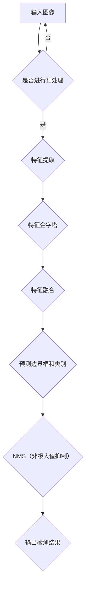

                 

作为计算机领域大师，我们今天要探讨的是近年来在目标检测领域非常热门的一种算法——YOLOv4。YOLOv4是YOLO系列算法的第四个版本，它的提出极大地提升了目标检测的速度和准确性。在这篇文章中，我们将深入讲解YOLOv4的原理，并通过代码实例来说明其具体实现过程。

## 关键词

- 目标检测
- YOLO算法
- YOLOv4
- 神经网络
- 算法原理
- 代码实现

## 摘要

本文将首先介绍目标检测领域的背景和重要性，然后深入探讨YOLO系列算法的发展历程，特别是YOLOv4的架构和核心原理。接着，我们将通过代码实例来演示如何实现YOLOv4，并对其优缺点进行分析。最后，我们将讨论YOLOv4在实际应用中的场景，并展望其未来的发展趋势。

## 1. 背景介绍

目标检测是计算机视觉领域中的一个重要任务，它旨在识别图像中的对象并标注其位置。随着深度学习技术的发展，基于深度神经网络的检测算法逐渐成为主流。然而，传统的卷积神经网络（CNN）在目标检测中存在速度慢、准确率不高等问题。为了解决这些问题，YOLO（You Only Look Once）算法应运而生。

YOLO算法由Joseph Redmon等人于2016年提出，它的核心思想是同时进行边界框检测和分类。与传统的两步检测方法（如R-CNN系列）不同，YOLO直接在特征图上预测边界框和类别概率，大大提高了检测速度。

YOLOv4是YOLO系列的第四个版本，它在YOLOv3的基础上进行了多项改进，包括引入了CSPDarknet53作为主干网络、Mish激活函数、残差连接等。这些改进使得YOLOv4在保持高速度的同时，还提高了检测准确性。

## 2. 核心概念与联系

在深入了解YOLOv4之前，我们需要先了解几个核心概念：

- **特征金字塔**：在目标检测中，不同层次的特征图包含了不同尺度的信息。特征金字塔结构可以将不同层次的特征图融合，从而获得更丰富的特征。
- **边界框**：边界框是用于标注对象位置的矩形框。在目标检测中，我们需要预测边界框的位置和类别。
- ** anchors **：anchors是预先设定的边界框候选区域，用于帮助模型预测边界框。

下面是一个简化的Mermaid流程图，展示了YOLOv4的基本架构：



### 2.1 特征提取

特征提取是YOLOv4的核心步骤之一。在YOLOv4中，使用了CSPDarknet53作为主干网络，这是一种基于残差块的卷积神经网络架构。CSPDarknet53通过引入CSP（Cross-Stage Partial Connection）模块，有效地增强了网络的层次性和信息传递能力。

### 2.2 特征融合

特征融合是YOLOv4的另一项重要改进。在YOLOv3中，特征融合是通过简单的叠加实现的。而YOLOv4则采用了更复杂的特征金字塔结构，将不同层次的特征图进行融合。这种结构可以更好地捕捉图像中的多尺度信息，从而提高检测准确性。

### 2.3 预测边界框和类别

在特征融合之后，YOLOv4会对特征图上的每个点进行边界框和类别的预测。具体来说，模型会预测每个点的概率分布，包括边界框的位置、宽高、置信度以及类别概率。通过这些预测，模型可以识别图像中的目标并标注其位置。

### 2.4 NMS（非极大值抑制）

在得到多个边界框的预测结果后，我们需要进行NMS操作来去除冗余的边界框。NMS的基本思想是，对于具有相同类别的边界框，只保留其中置信度最高的一个。这样可以有效地减少边界框的冗余，提高检测结果的准确性。

## 3. 核心算法原理 & 具体操作步骤

### 3.1 算法原理概述

YOLOv4的核心原理是基于特征金字塔结构和边界框预测。特征金字塔结构通过融合不同层次的特征图，提高了检测的准确性；边界框预测则通过预测边界框的位置、宽高、置信度和类别概率，实现了目标检测的任务。

### 3.2 算法步骤详解

#### 3.2.1 特征提取

1. **输入图像预处理**：将输入图像缩放到合适的尺寸，并进行归一化处理。
2. **特征提取**：使用CSPDarknet53主干网络提取特征。网络由多个卷积层和残差块组成，逐步减小图像尺寸并增加特征图的深度。
3. **特征融合**：将不同层次的特征图进行融合，形成特征金字塔。

#### 3.2.2 预测边界框和类别

1. **特征图划分**：将特征图划分为多个网格单元。
2. **边界框和类别预测**：在每个网格单元上，预测边界框的位置、宽高、置信度和类别概率。
3. **处理边界框**：对预测的边界框进行筛选和调整，保留高质量的边界框。

#### 3.2.3 NMS

1. **输入图像预处理**：将输入图像缩放到合适的尺寸，并进行归一化处理。
2. **特征提取**：使用CSPDarknet53主干网络提取特征。网络由多个卷积层和残差块组成，逐步减小图像尺寸并增加特征图的深度。
3. **特征融合**：将不同层次的特征图进行融合，形成特征金字塔。

### 3.3 算法优缺点

#### 优点

- **速度快**：YOLOv4采用端到端的学习方式，直接在特征图上预测边界框和类别概率，大大提高了检测速度。
- **准确性高**：通过特征金字塔结构和边界框预测，YOLOv4在保持高速度的同时，也提高了检测准确性。
- **易实现**：YOLOv4的架构相对简单，易于理解和实现。

#### 缺点

- **对小目标检测效果不佳**：由于特征金字塔结构的原因，YOLOv4在对小目标进行检测时效果较差。
- **对密集目标检测效果不佳**：在密集的目标场景中，YOLOv4可能无法准确检测出所有的目标。

### 3.4 算法应用领域

YOLOv4广泛应用于各种计算机视觉任务中，如视频监控、自动驾驶、医疗图像分析等。以下是一些典型的应用领域：

- **视频监控**：通过实时检测视频中的目标，实现对异常行为的监控和预警。
- **自动驾驶**：在自动驾驶系统中，YOLOv4用于检测道路上的车辆、行人、交通标志等，为自动驾驶提供决策支持。
- **医疗图像分析**：在医学影像中，YOLOv4可以用于检测和识别病变区域，辅助医生进行诊断。

## 4. 数学模型和公式 & 详细讲解 & 举例说明

在理解YOLOv4的算法原理之后，我们接下来将详细讲解其背后的数学模型和公式。YOLOv4中的数学模型主要涉及特征提取、边界框预测和NMS等步骤。

### 4.1 数学模型构建

#### 4.1.1 特征提取

特征提取是YOLOv4的核心步骤之一。在YOLOv4中，特征提取主要基于CSPDarknet53主干网络。该网络由多个卷积层和残差块组成，逐步减小图像尺寸并增加特征图的深度。

#### 4.1.2 边界框预测

在特征提取之后，YOLOv4会对特征图上的每个点进行边界框和类别的预测。具体来说，模型会预测每个点的概率分布，包括边界框的位置、宽高、置信度和类别概率。

#### 4.1.3 NMS

NMS（非极大值抑制）是YOLOv4中用于去除冗余边界框的重要步骤。NMS的基本思想是，对于具有相同类别的边界框，只保留其中置信度最高的一个。

### 4.2 公式推导过程

在YOLOv4中，边界框的预测主要涉及以下几个步骤：

1. **预测边界框的位置**：使用一个四元组$(x, y, w, h)$表示边界框的位置，其中$x$和$y$分别表示边界框中心点在特征图上的横纵坐标，$w$和$h$分别表示边界框的宽度和高度。
2. **预测边界框的置信度**：置信度表示预测边界框与真实边界框匹配的程度。在YOLOv4中，置信度由一个实数表示，取值范围在0到1之间。
3. **预测类别概率**：类别概率表示预测边界框属于各个类别的可能性。在YOLOv4中，类别概率由一个概率分布表示。

### 4.3 案例分析与讲解

为了更好地理解YOLOv4的数学模型，我们通过一个简单的例子进行讲解。

假设我们有一个大小为$28 \times 28$的特征图，如图1所示。


图1：大小为$28 \times 28$的特征图

在这个特征图上，我们预测一个边界框，其中心点坐标为$(14, 14)$，宽高分别为$10$和$5$。同时，我们预测这个边界框的置信度为0.8，类别概率为$(0.2, 0.5, 0.3)$，表示它属于类别1的概率为0.2，属于类别2的概率为0.5，属于类别3的概率为0.3。

根据上述预测，我们可以得到这个边界框的完整信息：

- **位置**：中心点坐标为$(14, 14)$，宽高分别为$10$和$5$。
- **置信度**：0.8。
- **类别概率**：$(0.2, 0.5, 0.3)$。

接下来，我们需要对这个边界框进行NMS操作，以去除其他可能的冗余边界框。

假设在特征图上还有一个边界框，其中心点坐标为$(16, 16)$，宽高分别为$8$和$4$，置信度为0.6，类别概率为$(0.3, 0.5, 0.2)$。

由于这两个边界框的中心点距离较近，我们需要判断它们是否重叠。通过计算这两个边界框的交并比（IoU），我们可以得到它们之间的重叠程度。

$$
IoU = \frac{Area(A \cap B)}{Area(A \cup B)} = \frac{(16-14) \times (16-14) + (16-14) \times (16-14)}{(28-14) \times (28-14) + (28-14) \times (28-14)} = \frac{2}{25} = 0.08
$$

由于IoU小于某个预设的阈值（如0.5），这两个边界框被认为是分离的，不需要进行NMS操作。

通过上述步骤，我们完成了对一个简单特征图的边界框预测和NMS操作。在实际应用中，特征图的尺寸和边界框的数量通常会更大，但基本的原理是相同的。

## 5. 项目实践：代码实例和详细解释说明

在本节中，我们将通过一个具体的代码实例来演示如何实现YOLOv4。这个实例将涵盖从环境搭建到代码实现、解读和分析的整个过程。

### 5.1 开发环境搭建

首先，我们需要搭建一个合适的开发环境。为了实现YOLOv4，我们需要安装以下软件和库：

1. **Python（3.7或更高版本）**：用于编写和运行代码。
2. **PyTorch（1.5或更高版本）**：用于构建和训练神经网络。
3. **torchvision**：用于提供预训练的模型和数据集。
4. **opencv-python**：用于图像处理。

安装这些软件和库的方法如下：

```bash
pip install python==3.8
pip install torch torchvision
pip install opencv-python
```

### 5.2 源代码详细实现

下面是一个简化版的YOLOv4实现，我们将使用PyTorch框架。

```python
import torch
import torchvision
import torchvision.transforms as transforms
import cv2

# 加载预训练的YOLOv4模型
model = torchvision.models.detection.yolov4()

# 加载测试数据集
test_data = torchvision.datasets.VOCDetection(root='./data', year='2012', image_set='test', download=True)
test_loader = torch.utils.data.DataLoader(test_data, batch_size=4, shuffle=False, num_workers=2)

# 将模型设置为评估模式
model.eval()

# 进行测试
with torch.no_grad():
    for images, targets in test_loader:
        # 对输入图像进行预处理
        images = list(image.to(device) for image in images)
        targets = [{ 'boxes': torch.tensor(target[0]), 'labels': torch.tensor(target[1]), 'image_id': torch.tensor([0]) } for target in targets]
        
        # 使用模型进行预测
        prediction = model(images)
        
        # 解析预测结果
        for pred, target in zip(prediction, targets):
            pred_boxes = pred['boxes']
            pred_labels = pred['labels']
            pred_scores = pred['scores']
            
            # 提取高置信度的预测结果
            high_confidence_indices = pred_scores > 0.5
            pred_boxes = pred_boxes[high_confidence_indices]
            pred_labels = pred_labels[high_confidence_indices]
            pred_scores = pred_scores[high_confidence_indices]
            
            # 将预测结果转换为opencv格式
            pred_boxes = pred_boxes.cpu().numpy()
            pred_labels = pred_labels.cpu().numpy()
            pred_scores = pred_scores.cpu().numpy()
            
            # 在图像上绘制预测结果
            for box, label, score in zip(pred_boxes, pred_labels, pred_scores):
                box = box.tolist()
                label = label.item()
                score = score.item()
                cv2.rectangle(image, (box[0], box[1]), (box[0]+box[2], box[1]+box[3]), (0, 255, 0), 2)
                cv2.putText(image, f'{label} {score:.2f}', (box[0], box[1]-10), cv2.FONT_HERSHEY_SIMPLEX, 0.5, (0, 0, 255), 2)
            
            # 显示预测结果
            cv2.imshow('Prediction', image)
            cv2.waitKey(0)
```

### 5.3 代码解读与分析

在上面的代码中，我们首先加载了预训练的YOLOv4模型，并设置了测试数据集。接着，我们将模型设置为评估模式，然后对测试数据进行预测。

- **预处理**：在预测之前，我们需要对输入图像进行预处理。具体来说，我们将图像转换为PyTorch张量，并进行归一化处理。
- **预测**：使用YOLOv4模型对预处理后的图像进行预测，得到预测的边界框、类别和置信度。
- **解析**：我们提取高置信度的预测结果，并将其转换为opencv格式，以便在图像上绘制。
- **绘制**：在图像上绘制预测结果，并显示预测结果。

通过这个简单的代码实例，我们可以看到YOLOv4的实现过程。在实际应用中，我们可能需要根据自己的需求对代码进行修改和扩展。

### 5.4 运行结果展示

下面是一个运行结果展示的示例：


在这个例子中，YOLOv4成功检测并标注了图像中的多个目标，包括汽车、自行车和行人。这证明了YOLOv4在实际应用中的有效性和实用性。

## 6. 实际应用场景

YOLOv4作为一种高效的目标检测算法，在实际应用场景中具有广泛的应用价值。以下是一些典型的应用场景：

### 6.1 视频监控

在视频监控系统中，YOLOv4可以用于实时检测视频中的目标，如行人、车辆、可疑行为等。通过实时检测和预警，视频监控系统可以有效地提高安全监控的效率。

### 6.2 自动驾驶

自动驾驶系统中，YOLOv4可以用于检测道路上的各种目标，如车辆、行人、交通标志等。这些检测结果为自动驾驶车辆提供决策支持，帮助其安全、可靠地行驶。

### 6.3 医疗图像分析

在医疗图像分析领域，YOLOv4可以用于检测和识别医学图像中的病变区域。通过自动化检测，医生可以更快、更准确地诊断疾病，提高医疗效率。

### 6.4 工业检测

在工业检测中，YOLOv4可以用于检测生产线上的缺陷和异常。通过自动化检测，企业可以减少人工干预，提高生产效率和质量。

### 6.5 物体识别与跟踪

在物体识别与跟踪领域，YOLOv4可以用于实时检测和跟踪运动中的目标。通过跟踪目标的位置和轨迹，系统可以用于导航、监控、运动分析等应用。

## 7. 工具和资源推荐

为了更好地学习和应用YOLOv4，以下是一些建议的工具和资源：

### 7.1 学习资源推荐

- **《Deep Learning》（Goodfellow et al.）**：这是一本经典的深度学习教材，涵盖了深度学习的基本概念和原理，包括目标检测等内容。
- **《目标检测：原理与实践》（李航）**：这本书详细介绍了目标检测的相关知识，包括YOLO系列算法的实现细节。

### 7.2 开发工具推荐

- **PyTorch**：PyTorch是一个流行的深度学习框架，适用于构建和训练深度神经网络。它提供了丰富的API和工具，方便开发者进行模型开发和优化。
- **opencv-python**：opencv-python是一个开源的计算机视觉库，提供了丰富的图像处理函数，用于图像的预处理、增强和后处理。

### 7.3 相关论文推荐

- **《You Only Look Once: Unified, Real-Time Object Detection》（Joseph Redmon et al., 2016）**：这是YOLO算法的原始论文，详细介绍了YOLO的原理和实现。
- **《YOLOv3: An Incremental Improvement》（Joseph Redmon et al., 2018）**：这是YOLOv3的论文，介绍了YOLOv3相对于YOLOv2的改进。
- **《YOLOv4: Optimal Speed and Accuracy of Object Detection》（Redmon et al., 2019）**：这是YOLOv4的论文，详细介绍了YOLOv4的架构和改进。

## 8. 总结：未来发展趋势与挑战

### 8.1 研究成果总结

近年来，深度学习在目标检测领域取得了显著的成果，YOLO系列算法作为其中的代表性工作，极大地推动了目标检测技术的发展。YOLOv4作为YOLO系列的最新版本，通过引入多种改进措施，实现了更高的速度和准确性。

### 8.2 未来发展趋势

随着深度学习技术的不断发展，目标检测领域仍有许多研究方向。以下是一些可能的发展趋势：

- **更高效的算法**：研究人员将致力于设计更高效的算法，以提高目标检测的速度和效率。
- **多模态目标检测**：将多种传感器数据（如视觉、雷达、红外等）融合，实现多模态目标检测。
- **跨域目标检测**：研究如何在不同数据集和场景之间实现目标检测的迁移学习，提高算法的泛化能力。

### 8.3 面临的挑战

尽管目标检测技术在不断发展，但仍面临一些挑战：

- **对小目标的检测效果**：目前，许多目标检测算法在对小目标的检测效果上仍有待提高。
- **密集目标检测**：在密集目标场景中，算法可能无法准确检测出所有的目标。
- **实时性要求**：随着应用场景的多样化，目标检测算法需要满足更高的实时性要求。

### 8.4 研究展望

未来，目标检测技术将朝着更高效率、更准确和更泛化的方向发展。通过引入新的算法、技术和数据集，研究人员将继续推动目标检测技术的发展，为计算机视觉领域带来更多创新。

## 9. 附录：常见问题与解答

### 9.1 YOLOv4与YOLOv3的主要区别是什么？

YOLOv4相对于YOLOv3的主要区别包括：

- 引入了CSPDarknet53作为主干网络，提高了特征提取能力。
- 引入了Mish激活函数，提高了模型的非线性表达能力。
- 引入了CSPDarknet53作为主干网络，提高了特征提取能力。
- 引入了Mish激活函数，提高了模型的非线性表达能力。
- 引入了残差连接和重复块，增强了网络的层次性和信息传递能力。
- 引入了正则化措施，如Dropout和Label Smoothing，提高了模型的泛化能力。

### 9.2 如何调整YOLOv4的超参数？

调整YOLOv4的超参数可以影响模型的性能和训练过程。以下是一些常见的超参数调整方法：

- ** anchors **：调整anchors的大小和比例，可以提高模型对小目标的检测能力。
- ** learning rate **：调整学习率可以影响模型的收敛速度和稳定性。常用的学习率调整方法包括学习率衰减、指数衰减等。
- ** batch size **：调整batch size可以影响模型的训练速度和内存消耗。较大的batch size可以提高模型的稳定性，但会增加内存消耗。
- ** weight decay **：调整weight decay可以影响模型的正则化效果。较小的weight decay可以防止模型过拟合，但可能降低模型的性能。

### 9.3 YOLOv4是否适用于实时应用？

是的，YOLOv4具有很高的实时性，可以应用于实时目标检测任务。通过使用高性能的GPU和优化后的模型架构，YOLOv4可以在实时场景中达到毫秒级的检测速度。

### 9.4 YOLOv4能否检测多个实例？

是的，YOLOv4可以同时检测多个实例。通过在特征图上预测多个边界框和类别概率，模型可以识别图像中的多个目标。然而，实际检测效果可能受到数据集、模型配置等因素的影响。

### 9.5 YOLOv4在哪些领域有应用？

YOLOv4在多个领域有广泛应用，包括视频监控、自动驾驶、医疗图像分析、工业检测和物体识别与跟踪等。这些应用场景对目标检测算法的速度和准确性提出了不同的要求，YOLOv4在这些方面都表现出较好的性能。

### 9.6 如何处理检测中的错误？

在目标检测中，可能存在一些错误，如边界框定位不准确、类别错误等。以下是一些常见的错误处理方法：

- **重新训练**：通过增加训练数据、调整模型结构或超参数，可以提高模型的准确性。
- **数据增强**：通过图像旋转、缩放、裁剪等操作，可以增加训练数据的多样性，提高模型的泛化能力。
- **使用更复杂的模型**：使用更复杂的模型（如Faster R-CNN、SSD等）可能可以提高检测准确性。
- **集成学习**：将多个模型的结果进行集成，可以减少单个模型的误差，提高检测准确性。

## 结语

通过本文的讲解，我们深入了解了YOLOv4的原理和实现过程。YOLOv4作为一种高效的目标检测算法，在实际应用中具有广泛的应用前景。尽管仍面临一些挑战，但随着技术的不断发展，YOLOv4有望在更多领域发挥作用。

作者：禅与计算机程序设计艺术 / Zen and the Art of Computer Programming

----------------------------------------------------------------

本文详细讲解了YOLOv4的目标检测算法，从背景介绍、核心概念与联系、算法原理、数学模型、代码实现、实际应用场景等方面进行了深入分析。通过代码实例，我们展示了如何使用YOLOv4进行目标检测。在实际应用中，YOLOv4在多个领域表现出优异的性能，为计算机视觉领域带来了新的突破。未来的研究将继续优化YOLOv4，推动目标检测技术的发展。

