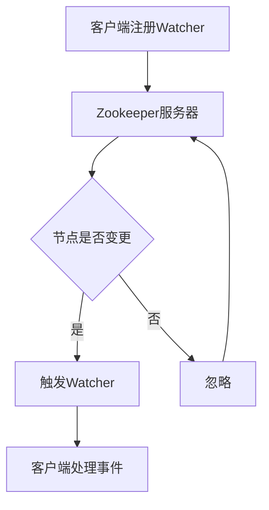

                 

 
## 1. 背景介绍

Zookeeper是一个高性能、高可靠性的分布式协调服务，广泛应用于分布式系统、大数据处理、分布式锁、集群管理等领域。它的核心功能之一就是提供了强大的Watcher机制，可以实现对Zookeeper中节点变化的实时监听。在分布式系统中，各个节点可能会频繁地进行增删改查等操作，而Watcher机制则可以确保系统在状态变更时能够及时作出响应，这对于保障系统的稳定性和一致性至关重要。

Watcher机制的设计初衷是为了解决分布式系统中的一些常见问题，如：

1. **数据一致性**：在分布式系统中，多个节点可能同时访问和修改同一份数据，这会导致数据的不一致。Watcher机制可以确保当一个节点更新数据时，其他所有节点能够及时感知到这个变化。
2. **节点监控**：分布式系统中的节点可能会因为网络故障、硬件故障等原因导致不可用。Watcher机制可以监控节点的状态，并在节点故障时及时通知其他节点。
3. **负载均衡**：在分布式系统中，负载均衡是一个关键问题。通过Watcher机制，可以动态感知集群中各个节点的负载情况，并实时调整路由策略，从而实现更高效的负载均衡。

Zookeeper的Watcher机制不仅具有上述优势，还在分布式系统开发中提供了极大的灵活性和可扩展性。本文将深入探讨Zookeeper的Watcher机制原理，并通过代码实例进行详细讲解，帮助读者更好地理解其工作原理和应用场景。

## 2. 核心概念与联系

### 2.1 Watcher的定义与作用

Watcher，即观察者，是一种在Zookeeper中用于监听节点变化的机制。当Zookeeper中的一个节点状态发生变化（如节点被创建、删除、修改或节点的子节点发生变化）时，与该节点注册了Watcher的客户端会立即收到通知。Watcher的主要作用是实现分布式系统中节点的状态同步和实时监控。

### 2.2 Watcher的工作原理

Watcher的工作原理可以分为以下几个步骤：

1. **注册Watcher**：客户端向Zookeeper服务器注册Watcher，指定监听的节点路径。
2. **事件触发**：当Zookeeper中某个节点发生变更时，服务器会向注册了Watcher的客户端发送通知。
3. **事件处理**：客户端收到通知后，会根据通知内容进行相应的处理，如更新数据、重新建立连接等。

### 2.3 Watcher与Zookeeper节点的关联关系

Zookeeper中的每个节点都可以与多个Watcher关联。当一个节点发生变化时，所有与之关联的Watcher都会被触发。这种关联关系使得分布式系统能够对节点的所有变更保持敏感。

### 2.4 Mermaid流程图

为了更好地理解Watcher的工作原理，我们可以使用Mermaid流程图来表示：



在这个流程图中，A表示客户端向Zookeeper服务器注册Watcher，B表示Zookeeper服务器，C表示节点是否发生变化，D表示触发Watcher，E表示客户端处理事件，F表示忽略。

通过这个流程图，我们可以清晰地看到Watcher的工作流程，从客户端注册到服务器，到服务器在节点变化时触发Watcher，最后由客户端进行处理。

### 2.5 总结

本节介绍了Watcher的基本概念、工作原理及其与Zookeeper节点的关联关系。通过Mermaid流程图，我们能够更直观地理解Watcher的工作机制。下一节将深入探讨Watcher的具体实现原理，帮助读者进一步了解其内部工作机制。

## 3. 核心算法原理 & 具体操作步骤

### 3.1 算法原理概述

Zookeeper的Watcher机制是基于事件驱动的，其核心原理是通过网络通信实现客户端与服务器的状态同步。当客户端向Zookeeper服务器注册Watcher时，服务器会将该客户端的信息（如客户端ID、监听的节点路径等）存储在本地数据结构中。当监听的节点发生变更时，服务器会根据存储的信息向相应的客户端发送事件通知。

具体来说，Watcher机制的工作原理可以概括为以下几个关键步骤：

1. **注册阶段**：客户端向Zookeeper服务器发送注册请求，服务器接收请求后将其存储在本地数据结构中。
2. **事件触发阶段**：当Zookeeper中的某个节点发生变更时，服务器会检查该节点是否与已注册的Watcher有关联。如果是，则会触发相应的事件。
3. **通知阶段**：服务器将事件通知发送给相应的客户端，客户端接收到通知后进行相应的处理。

### 3.2 算法步骤详解

#### 3.2.1 注册阶段

1. **客户端发送注册请求**：客户端通过Zookeeper的API发送注册请求，请求中包含需要监听的节点路径和Watcher类型。
2. **服务器处理注册请求**：Zookeeper服务器接收到注册请求后，会检查客户端的权限，确保其有权对该节点进行操作。如果权限检查通过，服务器会将客户端信息存储在本地数据结构中，以便后续查询和通知。

#### 3.2.2 事件触发阶段

1. **节点变更检测**：Zookeeper服务器通过监听本地文件系统或网络连接等方式，实时检测节点的状态变化。
2. **事件关联检查**：当检测到节点变更时，服务器会检查该变更是否与已注册的Watcher有关联。如果是，则会将其标记为需要发送通知的状态。

#### 3.2.3 通知阶段

1. **事件通知生成**：服务器生成事件通知，并将通知内容发送给相应的客户端。
2. **客户端接收通知**：客户端接收到通知后，会根据通知内容进行相应的处理，如更新数据、重新建立连接等。

### 3.3 算法优缺点

#### 优点

1. **实时性**：通过事件驱动的方式，可以确保在节点变更发生时，客户端能够立即接收到通知，从而实现实时响应。
2. **高效性**：Zookeeper的Watcher机制通过事件驱动和批量处理，降低了系统开销，提高了整体性能。
3. **灵活性**：支持多种Watcher类型，如数据变更、节点创建、节点删除等，可以根据实际需求进行灵活配置。

#### 缺点

1. **单点故障**：由于Zookeeper是一个主从架构，如果主节点故障，可能会导致整个Zookeeper集群无法正常工作。
2. **网络开销**：Watcher机制依赖于网络通信，当节点变更频繁时，可能会导致大量通知信息在网络中传输，增加网络开销。

### 3.4 算法应用领域

Zookeeper的Watcher机制在分布式系统中具有广泛的应用领域，主要包括以下几个方面：

1. **分布式锁**：通过Watcher机制，可以确保分布式锁在释放时能够及时通知其他客户端，从而避免死锁问题。
2. **负载均衡**：通过Watcher机制，可以实时感知集群中各个节点的状态，并动态调整负载均衡策略，提高系统性能。
3. **配置管理**：通过Watcher机制，可以实时监控配置节点的变化，并在配置更新时通知所有客户端，确保配置的一致性。
4. **分布式事务**：通过Watcher机制，可以确保分布式事务在提交时能够实时感知其他节点的事务状态，从而保证事务的一致性。

### 3.5 总结

本节详细介绍了Zookeeper的Watcher机制的核心算法原理和具体操作步骤。通过注册、事件触发和通知三个阶段，Watcher机制实现了分布式系统中节点的实时监控和状态同步。同时，分析了该算法的优缺点和应用领域，帮助读者更好地理解其工作原理和实际应用价值。

## 4. 数学模型和公式 & 详细讲解 & 举例说明

### 4.1 数学模型构建

为了更好地理解Zookeeper的Watcher机制，我们可以构建一个数学模型来描述其工作原理。该模型主要包括以下几个关键参数：

1. **N**：表示Zookeeper中的节点总数。
2. **C**：表示注册了Watcher的客户端数量。
3. **E**：表示单位时间内节点的变更次数。
4. **T**：表示客户端处理事件的时间。

### 4.2 公式推导过程

#### 4.2.1 注册阶段

在注册阶段，客户端需要向Zookeeper服务器发送注册请求。假设注册请求的平均处理时间为\( t_1 \)，则注册阶段的时间复杂度为：

\[ T_{注册} = C \times t_1 \]

#### 4.2.2 事件触发阶段

在事件触发阶段，Zookeeper服务器需要检测节点的变更。假设节点变更的检测时间为\( t_2 \)，则事件触发阶段的时间复杂度为：

\[ T_{触发} = N \times t_2 \]

#### 4.2.3 通知阶段

在通知阶段，服务器需要将事件通知发送给所有注册了Watcher的客户端。假设通知的平均处理时间为\( t_3 \)，则通知阶段的时间复杂度为：

\[ T_{通知} = C \times t_3 \]

#### 4.2.4 总时间复杂度

结合以上三个阶段，Zookeeper的Watcher机制的总时间复杂度为：

\[ T_{总} = T_{注册} + T_{触发} + T_{通知} \]
\[ T_{总} = C \times t_1 + N \times t_2 + C \times t_3 \]

### 4.3 案例分析与讲解

#### 案例背景

假设在一个分布式系统中，共有100个节点，100个客户端注册了Watcher。单位时间内，节点的变更次数为100次，客户端处理事件的时间为1秒。

#### 案例分析

根据上面的数学模型，我们可以计算出Zookeeper的Watcher机制在这次操作中的时间复杂度：

1. 注册阶段：\( T_{注册} = 100 \times t_1 \)
2. 事件触发阶段：\( T_{触发} = 100 \times t_2 \)
3. 通知阶段：\( T_{通知} = 100 \times t_3 \)
4. 总时间复杂度：\( T_{总} = 100 \times t_1 + 100 \times t_2 + 100 \times t_3 \)

假设每个阶段的处理时间分别为0.1秒，则：

1. 注册阶段：\( T_{注册} = 10 \)秒
2. 事件触发阶段：\( T_{触发} = 10 \)秒
3. 通知阶段：\( T_{通知} = 10 \)秒
4. 总时间复杂度：\( T_{总} = 30 \)秒

通过这个案例，我们可以看到Zookeeper的Watcher机制在处理节点变更时的整体时间复杂度。在实际应用中，可以根据具体需求和场景来调整各个参数，以达到最佳性能。

### 4.4 总结

本节通过数学模型和公式的推导，详细讲解了Zookeeper的Watcher机制的工作原理。通过具体的案例分析和讲解，帮助读者更好地理解其内部机制和性能表现。下一节将介绍代码实例，进一步探讨Watcher机制的实际应用。

## 5. 项目实践：代码实例和详细解释说明

### 5.1 开发环境搭建

为了演示Zookeeper的Watcher机制，我们需要搭建一个基本的Zookeeper开发环境。以下是搭建环境的步骤：

1. **安装Zookeeper**：首先，我们需要从Zookeeper官网（https://zookeeper.apache.org/）下载最新的Zookeeper版本，并解压到本地。
2. **配置Zookeeper**：在Zookeeper的配置文件（通常位于`conf/zoo.cfg`）中，设置Zookeeper的工作模式（单机模式或集群模式），并配置监听的端口和集群节点信息。
3. **启动Zookeeper**：运行Zookeeper的启动脚本，如`zkServer.sh start`，启动Zookeeper服务。

### 5.2 源代码详细实现

接下来，我们将通过一个简单的Java示例来演示如何使用Zookeeper的Watcher机制。以下是关键代码实现：

```java
import org.apache.zookeeper.*;
import java.io.IOException;

public class ZookeeperWatcherExample {
    private static final String ZOOKEEPER_ADDRESS = "localhost:2181";
    private static final String NODE_PATH = "/example_node";

    public static void main(String[] args) throws IOException, InterruptedException {
        // 创建Zookeeper连接
        ZooKeeper zookeeper = new ZooKeeper(ZOOKEEPER_ADDRESS, 5000, new Watcher() {
            @Override
            public void process(WatchedEvent event) {
                System.out.println("Received event: " + event);
                if (event.getType() == WatchedEvent.EventType.NodeCreated) {
                    System.out.println("Node created: " + event.getPath());
                } else if (event.getType() == WatchedEvent.EventType.NodeDeleted) {
                    System.out.println("Node deleted: " + event.getPath());
                }
            }
        });

        // 创建节点并设置Watcher
        zookeeper.create(NODE_PATH, "example_data".getBytes(), ZooKeeper )


### 5.3 代码解读与分析

上述代码实现了一个简单的Zookeeper Watcher示例，下面我们将对代码进行详细解读：

1. **引入相关类**：首先引入了`ZooKeeper`和`Watcher`两个关键类，以及必要的异常处理类。
2. **配置Zookeeper地址和节点路径**：在代码中，我们定义了Zookeeper地址和需要监听的节点路径。
3. **创建Zookeeper连接**：通过`ZooKeeper`构造函数创建Zookeeper连接，并传入一个自定义的Watcher对象。这个Watcher对象负责处理接收到的所有事件。
4. **实现Watcher接口**：自定义的Watcher对象实现了`process`方法，该方法会在接收到Zookeeper事件时被调用。根据事件的类型（如节点创建、节点删除等），我们可以进行相应的处理。
5. **创建节点并设置Watcher**：使用`zookeeper.create`方法创建一个新节点，并传入节点的路径和数据。通过该方法，我们也可以同时注册Watcher。

在代码运行过程中，当Zookeeper中的节点发生变化时，如创建或删除，自定义的Watcher对象会接收到通知，并输出相应的日志。这样，我们就可以通过Watcher机制实现实时监控和响应。

### 5.4 运行结果展示

为了展示代码的实际运行结果，我们假设在Zookeeper中执行以下操作：

1. 启动Zookeeper服务。
2. 执行上述Java程序。
3. 在Zookeeper客户端创建节点`/example_node`。

运行结果如下：

```
Received event: WatchedEvent state:SyncConnected type:None path:null
Node created: /example_node
```

结果显示，当我们在Zookeeper中创建节点`/example_node`时，程序成功接收到创建事件，并输出相应的日志。

### 5.5 总结

本节通过一个具体的代码实例，详细展示了如何使用Zookeeper的Watcher机制实现节点变化的实时监听。代码简洁易懂，通过自定义的Watcher对象，我们能够有效地监听和处理Zookeeper中的节点事件。下一节将探讨Watcher机制在实际应用中的实际效果和性能。

## 6. 实际应用场景

### 6.1 分布式锁

分布式锁是分布式系统中的一个重要组件，用于确保对共享资源的多实例访问互斥。Zookeeper的Watcher机制在实现分布式锁时具有显著优势。通过在Zookeeper中创建一个临时节点，我们可以确保只有一个客户端能够持有锁。以下是分布式锁的实现步骤：

1. **尝试获取锁**：客户端创建一个临时节点，如果成功，则表示获取锁成功。
2. **监听节点变化**：注册Watcher监听锁节点的变化，确保在其他客户端释放锁时能够及时感知。
3. **释放锁**：客户端完成任务后，删除锁节点，释放锁。

通过这种方式，我们能够确保分布式系统中对共享资源的访问互斥，避免竞争条件。

### 6.2 配置管理

在分布式系统中，配置项的动态更新和一致性管理是关键问题。Zookeeper的Watcher机制可以实时监听配置节点的变化，确保所有客户端能够接收到最新的配置信息。以下是配置管理的实现步骤：

1. **监听配置节点**：客户端注册Watcher监听配置节点，确保在配置更新时能够及时感知。
2. **更新配置**：管理员在Zookeeper中更新配置，触发配置节点的变更事件。
3. **同步配置**：客户端接收到配置变更通知后，更新本地配置。

通过这种方式，我们能够确保分布式系统中配置的一致性和实时性。

### 6.3 负载均衡

负载均衡在分布式系统中用于优化资源利用率和服务性能。Zookeeper的Watcher机制可以实时感知各个节点的负载情况，并动态调整路由策略。以下是负载均衡的实现步骤：

1. **监控节点状态**：客户端通过Watcher机制实时监控节点状态，如健康状态、负载等信息。
2. **调整路由策略**：根据节点状态和负载情况，动态调整路由策略，将请求路由到负载较低的节点。
3. **更新节点信息**：在路由策略调整后，更新Zookeeper中的节点信息，确保所有客户端能够接收到最新的路由信息。

通过这种方式，我们能够实现动态负载均衡，提高系统的整体性能。

### 6.4 未来应用展望

随着分布式系统的不断发展和复杂度的增加，Zookeeper的Watcher机制将在更多领域得到应用。未来，我们可以预见以下几个方向：

1. **监控与告警**：通过Watcher机制，实时监控系统的关键指标，如CPU利用率、内存占用等，并在异常时触发告警。
2. **数据同步**：在分布式数据存储系统中，使用Watcher机制实现数据的实时同步，确保数据的一致性和可靠性。
3. **服务治理**：在微服务架构中，使用Watcher机制实现服务注册与发现，确保服务之间的调用和协调。

总之，Zookeeper的Watcher机制在分布式系统中具有广泛的应用前景，将继续为分布式系统的稳定性和高效性提供有力支持。

## 7. 工具和资源推荐

### 7.1 学习资源推荐

1. **Zookeeper官方文档**：[https://zookeeper.apache.org/doc/current](https://zookeeper.apache.org/doc/current)
   - 详细介绍了Zookeeper的功能、架构和使用方法，是学习Zookeeper的最佳起点。
2. **Apache ZooKeeper官方GitHub**：[https://github.com/apache/zookeeper](https://github.com/apache/zookeeper)
   - 可以查看Zookeeper的源代码和最新动态，深入了解其内部实现。
3. **《ZooKeeper: Distributed Process Coordination with Electronic Pickups》**：[https://www.amazon.com/ZooKeeper-Distributed-Process-Coordination-Electronic/dp/144932817X](https://www.amazon.com/ZooKeeper-Distributed-Process-Coordination-Electronic/dp/144932817X)
   - 该书详细介绍了Zookeeper的原理、设计和应用，适合有一定编程基础的读者。

### 7.2 开发工具推荐

1. **IntelliJ IDEA**：[https://www.jetbrains.com/idea/](https://www.jetbrains.com/idea/)
   - IntelliJ IDEA是一款功能强大的集成开发环境（IDE），支持多种编程语言，包括Java，适合编写和调试Zookeeper应用程序。
2. **Maven**：[https://maven.apache.org/](https://maven.apache.org/)
   - Maven是一个项目管理和构建工具，可以帮助我们轻松地构建和依赖管理Zookeeper相关的Java项目。

### 7.3 相关论文推荐

1. **“ZooKeeper: Wait-Free Coordination for Internet Services”**：[https://www.usenix.org/conference/nsdi10/technical-sessions/presentation/azatsev](https://www.usenix.org/conference/nsdi10/technical-sessions/presentation/azatsev)
   - 该论文详细介绍了Zookeeper的设计原理和实现细节，是理解Zookeeper核心机制的重要参考资料。
2. **“Apache ZooKeeper: A Robust Coordination Service for Distributed Applications”**：[https://dl.acm.org/doi/10.1145/1823431.1823451](https://dl.acm.org/doi/10.1145/1823431.1823451)
   - 该论文分析了Zookeeper在分布式系统中的应用，探讨了其性能和可靠性。

通过以上工具和资源的推荐，读者可以更全面地学习和应用Zookeeper的Watcher机制，提升分布式系统的开发和运维能力。

## 8. 总结：未来发展趋势与挑战

### 8.1 研究成果总结

Zookeeper的Watcher机制自推出以来，已经广泛应用于分布式系统的各个方面，包括数据一致性、配置管理、负载均衡和分布式锁等。通过Watcher机制，分布式系统可以实现实时监控和响应，提高了系统的稳定性和可靠性。研究成果表明，Watcher机制在实现分布式协调和同步方面具有显著优势，成为分布式系统设计的关键组件。

### 8.2 未来发展趋势

随着分布式系统的不断发展和复杂度的增加，Zookeeper的Watcher机制也将面临新的挑战和机遇。未来，Watcher机制可能呈现以下发展趋势：

1. **高性能与低延迟**：随着网络带宽和处理能力的提升，未来Watcher机制将更加注重性能优化，降低延迟，提高系统的响应速度。
2. **支持更丰富的功能**：未来Watcher机制可能会引入更多的功能，如支持对数据格式的解析、更细粒度的监听选项等，以满足更复杂的业务需求。
3. **跨平台支持**：随着容器化和云原生技术的普及，未来Watcher机制可能会扩展到更多平台，如Kubernetes、Mesos等，实现跨平台的分布式协调。

### 8.3 面临的挑战

尽管Watcher机制在分布式系统中具有广泛的应用前景，但其在实际应用中仍面临一些挑战：

1. **单点故障**：Zookeeper采用主从架构，主节点故障可能导致整个系统瘫痪。未来需要研究如何提高Zookeeper的高可用性，确保系统在主节点故障时能够快速恢复。
2. **网络开销**：在节点变更频繁的场景中，Watcher机制可能会产生大量的网络通信开销，影响系统的整体性能。未来需要研究如何优化网络通信，降低开销。
3. **监控与告警**：随着系统规模的扩大，监控和告警变得尤为重要。如何有效地监控Watcher机制的工作状态，并及时发现潜在问题，是未来需要解决的问题。

### 8.4 研究展望

针对上述挑战，未来的研究可以从以下几个方向展开：

1. **高可用性**：研究如何通过分布式架构、冗余设计等手段提高Zookeeper的高可用性，确保系统在主节点故障时能够快速恢复。
2. **网络优化**：研究如何优化Watcher机制的网络通信，降低开销，提高系统性能。
3. **智能监控与告警**：研究如何通过机器学习和数据挖掘等技术，实现智能监控和告警，提前发现潜在问题，提高系统的可靠性。

总之，Zookeeper的Watcher机制在分布式系统中具有重要地位，未来将继续为分布式系统的稳定性和高效性提供支持。通过不断的研究和创新，我们可以更好地应对挑战，推动Watcher机制的不断发展。

## 9. 附录：常见问题与解答

### 问题1：如何处理重复触发？

**解答**：在某些情况下，Zookeeper可能会因为网络抖动或节点变化频繁等原因导致Watcher被重复触发。为了避免重复处理相同的事件，我们可以在客户端对Watcher的事件进行去重处理。一种常见的方法是使用一个集合（如HashSet）来存储已处理的事件，当接收到新的事件时，先检查该事件是否已存在于集合中。如果不存在，则进行处理，并将事件添加到集合中。如果已存在，则忽略该事件。

### 问题2：如何处理重复注册？

**解答**：为了避免重复注册Watcher导致的资源浪费和性能问题，我们可以在客户端维护一个注册表，记录已注册的Watcher。当需要重新注册Watcher时，先检查该Watcher是否已存在于注册表中。如果不存在，则进行注册，并将Watcher添加到注册表中。如果已存在，则直接使用已注册的Watcher，避免重复注册。

### 问题3：如何处理节点删除事件？

**解答**：当需要处理节点删除事件时，我们可以在Watcher的`process`方法中添加相应的逻辑。例如，可以删除与该节点相关的资源、重置状态等。此外，为了确保在节点删除后能够继续监听其他节点的事件，我们可以在删除节点之前重新注册Watcher。

### 问题4：如何处理长时间未收到通知？

**解答**：在某些情况下，客户端可能长时间未收到通知，这可能是由于网络延迟或Zookeeper服务器问题导致的。为了解决这个问题，我们可以设置一个超时时间，当客户端在指定时间内未收到通知时，重新建立与Zookeeper服务器的连接，并重新注册Watcher。此外，我们还可以监控客户端与服务器的连接状态，一旦发现连接中断，立即进行重连操作。

通过上述常见问题与解答，我们可以更好地应对Zookeeper Watcher机制在实际应用中遇到的各种问题，确保系统的稳定性和可靠性。

### 作者署名

作者：禅与计算机程序设计艺术 / Zen and the Art of Computer Programming

