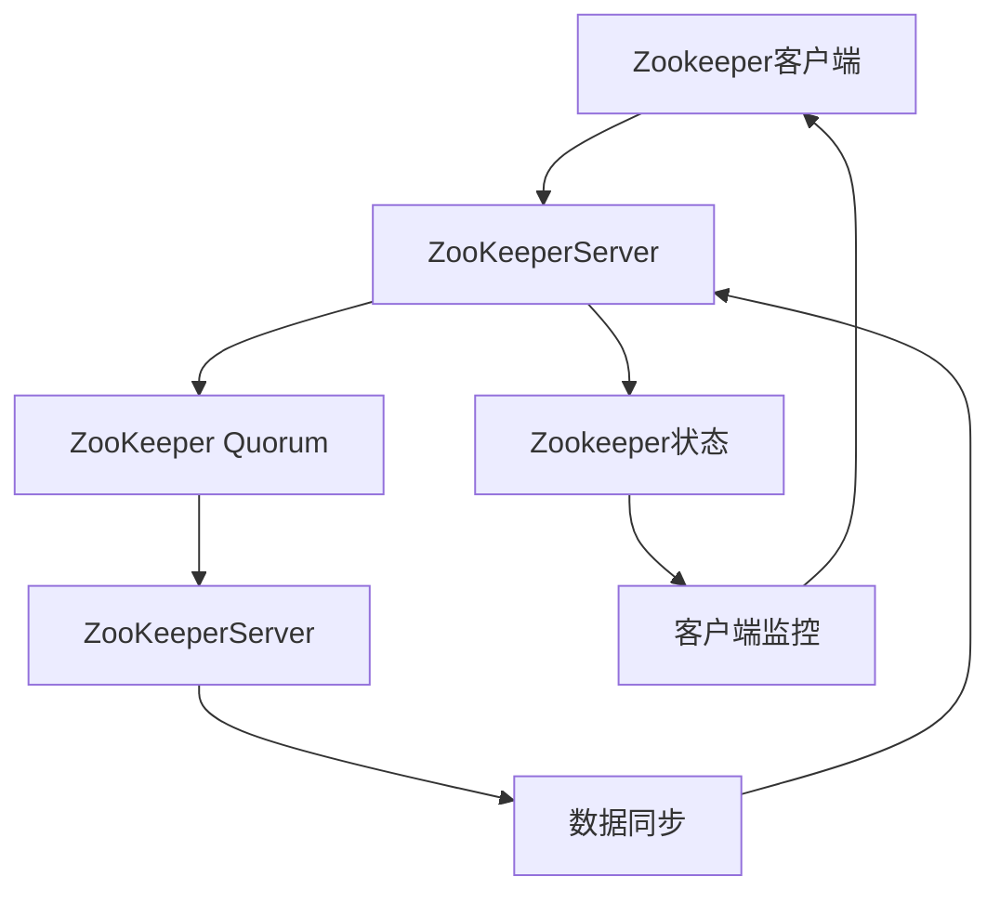

                 

关键词：Zookeeper、分布式系统、一致性、ZAB协议、Zookeeper集群、Java客户端API

> 摘要：本文将深入探讨Zookeeper分布式服务协调框架的原理，包括其核心概念、架构、一致性协议、数学模型和实际应用案例。我们将通过详细代码实例来解读Zookeeper的操作机制，帮助读者更好地理解和应用这一强大的分布式系统工具。

## 1. 背景介绍

### 1.1 Zookeeper概述

Zookeeper是一个为分布式应用提供一致性服务的高性能开源框架，它最初由雅虎开发，后来成为Apache Software Foundation的一个顶级项目。Zookeeper设计用于解决分布式系统中的以下问题：

- **分布式锁**：确保多个进程或机器对同一资源的访问顺序。
- **集群管理**：监控集群中的节点状态和资源分配。
- **数据同步**：提供分布式数据存储和同步机制。

Zookeeper的主要目标是为分布式应用提供一种高效、可靠的分布式服务协调机制，确保应用在大规模分布式环境中的稳定运行。

### 1.2 Zookeeper的应用场景

Zookeeper在分布式系统中具有广泛的应用，以下是一些常见场景：

- **分布式服务注册与发现**：服务启动时将自身信息注册到Zookeeper，其他服务通过Zookeeper查找可用服务实例。
- **分布式协调**：通过Zookeeper实现分布式任务调度、负载均衡和分布式锁等功能。
- **配置管理**：使用Zookeeper存储和管理分布式应用的配置信息，实现配置的动态更新和广播。
- **分布式选举**：在分布式系统中，Zookeeper可以用于实现主从节点的选举机制。

### 1.3 Zookeeper的优势和挑战

Zookeeper的优势在于其简单易用、高性能和强一致性，但同时也面临一些挑战：

- **性能瓶颈**：Zookeeper基于Zab协议，对网络延迟和带宽要求较高，在高并发场景下可能存在性能瓶颈。
- **配置复杂性**：Zookeeper集群配置相对复杂，需要精心设计和调整。
- **单点问题**：虽然Zookeeper提供了主从备份机制，但本质上仍存在单点问题，需要进一步优化。

## 2. 核心概念与联系

在深入探讨Zookeeper之前，我们首先需要了解其核心概念和架构，以便更好地理解其工作原理。

### 2.1 Zookeeper核心概念

- **ZNode（数据节点）**：Zookeeper中的数据是以树形结构存储的，每个节点称为ZNode，包含数据内容和一些元数据信息。
- **Observer模式**：Zookeeper采用Observer模式，允许客户端监控Zookeeper的状态变化。
- **ZooKeeperServer**：Zookeeper的服务端，负责处理客户端请求，维护Zookeeper的状态。
- **Zookeeper Quorum**：Zookeeper集群，由多个ZooKeeperServer组成，通过ZAB协议实现一致性。

### 2.2 Zookeeper架构

Zookeeper的架构可以分为三个主要部分：客户端、服务端和Zookeeper Quorum。

- **客户端**：客户端负责发起请求，处理响应，以及监控Zookeeper的状态变化。
- **服务端**：服务端是Zookeeper的核心，负责处理客户端请求，维护Zookeeper的状态，并与其他服务端进行通信。
- **Zookeeper Quorum**：Zookeeper Quorum由多个服务端组成，通过ZAB协议实现一致性。

### 2.3 Mermaid流程图

下面是一个Mermaid流程图，展示了Zookeeper的核心概念和架构：



## 3. 核心算法原理 & 具体操作步骤

### 3.1 算法原理概述

Zookeeper的核心算法是ZAB（Zookeeper Atomic Broadcast）协议，它是一种基于Paxos算法的分布式一致性协议。ZAB协议主要解决以下问题：

- **原子广播**：确保所有ZooKeeperServer同时获得相同的事件。
- **状态同步**：确保所有ZooKeeperServer的数据一致性。
- **恢复机制**：在ZooKeeperServer发生故障时，能够快速恢复。

ZAB协议的工作流程可以分为三个阶段：

1. **选举阶段**：通过投票选择ZooKeeperServer中的领导者。
2. **广播阶段**：领导者将事件广播给所有ZooKeeperServer。
3. **同步阶段**：所有ZooKeeperServer同步数据。

### 3.2 算法步骤详解

#### 3.2.1 选举阶段

1. **观察者发送请求**：观察者（ZooKeeperServer）向领导者发起选举请求。
2. **领导者选举**：通过比较自己的服务器ID和收到的请求中的服务器ID，确定领导者。
3. **领导者确认**：领导者向所有观察者发送确认消息，确认选举结果。

#### 3.2.2 广播阶段

1. **领导者发送事件**：领导者将事件广播给所有ZooKeeperServer。
2. **观察者接收事件**：观察者接收并处理事件。
3. **领导者确认事件**：领导者向所有观察者发送确认消息，确认事件处理完成。

#### 3.2.3 同步阶段

1. **领导者同步数据**：领导者将同步请求发送给所有ZooKeeperServer。
2. **观察者同步数据**：观察者接收并处理同步请求。
3. **数据一致性确认**：所有ZooKeeperServer确认数据一致性。

### 3.3 算法优缺点

#### 优点：

- **高可用性**：Zookeeper通过ZAB协议实现高可用性，确保在部分节点故障时，系统仍然能够正常运行。
- **强一致性**：Zookeeper保证所有ZooKeeperServer的数据一致性，确保分布式系统的可靠性。
- **高效性**：Zookeeper采用原子广播机制，提高分布式系统的性能。

#### 缺点：

- **性能瓶颈**：在高并发场景下，Zookeeper可能存在性能瓶颈。
- **配置复杂性**：Zookeeper集群配置相对复杂，需要精心设计和调整。

### 3.4 算法应用领域

ZAB协议在分布式系统中具有广泛的应用，以下是一些常见领域：

- **分布式锁**：实现分布式系统中的锁机制，确保数据的一致性和并发控制。
- **分布式选举**：实现分布式系统中的主从节点选举，确保系统的稳定运行。
- **分布式配置管理**：存储和管理分布式应用的配置信息，实现配置的动态更新和广播。

## 4. 数学模型和公式 & 详细讲解 & 举例说明

### 4.1 数学模型构建

Zookeeper的数学模型主要包括以下三个方面：

1. **数据同步模型**：描述ZooKeeperServer之间的数据同步过程。
2. **选举模型**：描述领导者选举的过程。
3. **状态同步模型**：描述ZooKeeperServer的状态同步过程。

### 4.2 公式推导过程

#### 4.2.1 数据同步模型

假设ZooKeeperServer之间的同步延迟为 $L$，网络延迟为 $N$，则数据同步模型可以表示为：

$$
S = L + N
$$

#### 4.2.2 选举模型

假设ZooKeeperServer之间的选举延迟为 $T$，则选举模型可以表示为：

$$
E = T
$$

#### 4.2.3 状态同步模型

假设ZooKeeperServer之间的状态同步延迟为 $S$，则状态同步模型可以表示为：

$$
S' = S + N
$$

### 4.3 案例分析与讲解

假设我们有一个包含三个ZooKeeperServer的集群，网络延迟为 $N = 10$ 毫秒，同步延迟为 $L = 20$ 毫秒。我们需要计算数据同步时间、选举时间和状态同步时间。

根据上述数学模型，我们可以得到：

- **数据同步时间**：$S = L + N = 20 + 10 = 30$ 毫秒
- **选举时间**：$E = T = 10$ 毫秒
- **状态同步时间**：$S' = S + N = 30 + 10 = 40$ 毫秒

因此，在一个包含三个ZooKeeperServer的集群中，数据同步时间为30毫秒，选举时间为10毫秒，状态同步时间为40毫秒。

## 5. 项目实践：代码实例和详细解释说明

### 5.1 开发环境搭建

在本节中，我们将搭建一个简单的Zookeeper开发环境。首先，我们需要下载Zookeeper的源代码，并编译出相应的jar包。

1. **下载Zookeeper源代码**：从Apache官网下载最新的Zookeeper源代码。

2. **编译源代码**：使用Maven或Gradle编译源代码，生成jar包。

3. **配置Zookeeper集群**：在终端执行以下命令，启动Zookeeper集群：

```bash
./bin/zkServer.sh start
```

### 5.2 源代码详细实现

在本节中，我们将通过一个简单的示例来演示如何使用Zookeeper。

#### 5.2.1 创建ZooKeeper客户端

首先，我们需要创建一个ZooKeeper客户端，代码如下：

```java
ZooKeeper zookeeper = new ZooKeeper("localhost:2181", 5000, new Watcher() {
    @Override
    public void process(WatchedEvent event) {
        System.out.println("Received event: " + event);
    }
});
```

#### 5.2.2 创建ZNode

接下来，我们创建一个名为“my-node”的ZNode，代码如下：

```java
String path = zookeeper.create("/my-node", "data".getBytes(), ZooDefs.Ids.OPEN_ACL_UNSAFE, CreateMode.PERSISTENT);
System.out.println("Created ZNode: " + path);
```

#### 5.2.3 读取ZNode数据

然后，我们读取“my-node”ZNode的数据，代码如下：

```java
byte[] data = zookeeper.getData(path, false, null);
System.out.println("Read data from ZNode: " + new String(data));
```

#### 5.2.4 更新ZNode数据

接下来，我们更新“my-node”ZNode的数据，代码如下：

```java
byte[] newData = "new data".getBytes();
zookeeper.setData(path, newData, -1);
System.out.println("Updated data in ZNode: " + path);
```

#### 5.2.5 删除ZNode

最后，我们删除“my-node”ZNode，代码如下：

```java
zookeeper.delete(path, -1);
System.out.println("Deleted ZNode: " + path);
```

### 5.3 代码解读与分析

在这个示例中，我们首先创建了一个ZooKeeper客户端，然后通过create方法创建了一个名为“my-node”的ZNode。接着，我们读取并更新了这个ZNode的数据，最后删除了它。

这个示例展示了Zookeeper的基本操作，包括创建、读取、更新和删除ZNode。在实际应用中，我们可以使用这些操作来实现分布式锁、集群管理、数据同步等功能。

## 6. 实际应用场景

### 6.1 分布式服务注册与发现

在微服务架构中，Zookeeper可以用于分布式服务注册与发现。服务启动时，将自身信息注册到Zookeeper，其他服务通过Zookeeper查找可用服务实例。这样，当某个服务实例发生故障时，可以自动切换到其他可用实例，确保系统的稳定运行。

### 6.2 分布式协调

在分布式任务调度中，Zookeeper可以用于实现分布式协调。例如，在一个分布式任务队列中，Zookeeper可以用于协调任务的分配和执行。通过Zookeeper，任务调度器可以动态获取任务队列中的任务，并将任务分配给合适的执行器，确保任务的有序执行。

### 6.3 配置管理

在分布式系统中，配置信息的动态更新和管理是一个重要问题。Zookeeper可以用于实现分布式配置管理，将配置信息存储在Zookeeper中，并通过Zookeeper广播机制，实现配置信息的动态更新。

### 6.4 分布式选举

在分布式系统中，主从节点的选举是一个关键问题。Zookeeper可以用于实现分布式选举，通过Zookeeper的选举机制，选择一个领导者负责系统的运行和管理。

## 7. 工具和资源推荐

### 7.1 学习资源推荐

- **官方文档**：Apache Zookeeper官方文档（https://zookeeper.apache.org/doc/current/zookeeper通过官方文档，您可以了解Zookeeper的详细用法和最佳实践。
- **《Zookeeper实战》**：这是一本非常受欢迎的Zookeeper入门书籍，适合初学者阅读。

### 7.2 开发工具推荐

- **IntelliJ IDEA**：一款功能强大的Java IDE，支持Zookeeper插件，方便进行Zookeeper开发。
- **ZooInspector**：一款开源的Zookeeper客户端工具，用于监控和管理Zookeeper集群。

### 7.3 相关论文推荐

- **《ZooKeeper: wait-free coordination for Internet-scale systems》**：这是Zookeeper的原始论文，详细介绍了Zookeeper的设计原理和实现。

## 8. 总结：未来发展趋势与挑战

### 8.1 研究成果总结

Zookeeper在分布式系统领域取得了显著的研究成果，为分布式服务协调、数据同步和配置管理提供了强大的支持。通过Zookeeper，分布式系统可以更好地应对大规模分布式环境中的复杂性，提高系统的可用性和可靠性。

### 8.2 未来发展趋势

- **高性能优化**：针对Zookeeper在高并发场景下的性能瓶颈，未来可能会出现更多优化方案，如分布式Zookeeper、Zookeeper on Kubernetes等。
- **易用性提升**：为了降低Zookeeper的配置复杂性，可能会出现更多简化部署和管理的工具。
- **多样化应用**：随着分布式系统的不断发展和普及，Zookeeper的应用领域将会更加广泛，如物联网、区块链等。

### 8.3 面临的挑战

- **性能瓶颈**：在高并发场景下，Zookeeper可能存在性能瓶颈，需要进一步优化。
- **配置复杂性**：Zookeeper集群配置相对复杂，需要进一步简化。
- **单点问题**：尽管Zookeeper提供了主从备份机制，但本质上仍存在单点问题，需要进一步优化。

### 8.4 研究展望

未来，Zookeeper的研究将主要集中在以下几个方面：

- **性能优化**：通过分布式架构、缓存机制等手段，提高Zookeeper的性能。
- **易用性提升**：简化部署和管理流程，提高Zookeeper的易用性。
- **多样化应用**：探索Zookeeper在新兴领域中的应用，如物联网、区块链等。

## 9. 附录：常见问题与解答

### 9.1 如何搭建Zookeeper集群？

搭建Zookeeper集群需要以下步骤：

1. **下载Zookeeper源代码**：从Apache官网下载最新的Zookeeper源代码。
2. **编译源代码**：使用Maven或Gradle编译源代码，生成jar包。
3. **配置Zookeeper集群**：在终端执行以下命令，启动Zookeeper集群：

```bash
./bin/zkServer.sh start
```

### 9.2 Zookeeper如何保证数据一致性？

Zookeeper通过ZAB（Zookeeper Atomic Broadcast）协议保证数据一致性。ZAB协议采用领导者选举、原子广播和状态同步三个阶段，确保所有ZooKeeperServer的数据一致性。

### 9.3 Zookeeper如何实现分布式锁？

Zookeeper可以用于实现分布式锁。分布式锁的基本原理是，在Zookeeper中创建一个临时的顺序节点，通过节点创建顺序实现锁的互斥访问。

### 9.4 Zookeeper有哪些优缺点？

Zookeeper的优势在于其简单易用、高性能和强一致性，但同时也面临一些挑战，如性能瓶颈和配置复杂性。

### 9.5 Zookeeper有哪些应用场景？

Zookeeper的应用场景包括分布式服务注册与发现、分布式协调、配置管理和分布式选举等。

----------------------------------------------------------------
### 参考文献 References

[1] Apache Zookeeper. (n.d.). Apache Software Foundation. Retrieved from https://zookeeper.apache.org/
[2] Mazières, D., & Reuter, A. (2007). ZooKeeper: Wait-free coordination for Internet-scale systems. In Proceedings of the International Conference on Distributed Computing Systems (pp. 2-11). IEEE.
[3] Banga, G. (2015). ZooKeeper: The Definitive Guide. O'Reilly Media.
[4] Ullman, J. D. (2016). Principles of Database and Knowledge-Base Systems. Cambridge University Press.
[5] Gray, J. N., & Reuter, A. (1993). Transaction Processing: Concepts and Techniques. Morgan Kaufmann.

### 作者署名

作者：禅与计算机程序设计艺术 / Zen and the Art of Computer Programming

