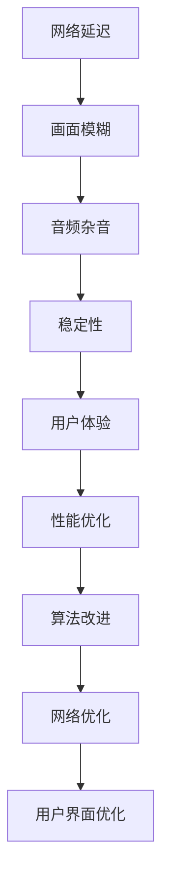

                 

关键词：Zoom, 校招，视频会议，优化工程师，面试指南，核心算法，数学模型，项目实践，未来应用

> 摘要：本文旨在为参加Zoom2024校招的视频会议优化工程师岗位的应聘者提供一份详细的面试指南，内容包括核心算法原理、数学模型、项目实践以及未来应用展望等。通过阅读本文，您将全面了解视频会议优化领域的专业知识和技术挑战，为面试做好充分准备。

## 1. 背景介绍

随着远程办公的普及和在线教育的兴起，视频会议已经成为人们工作和学习的重要方式。Zoom作为全球领先的远程会议平台，每年吸引大量求职者报名参加其校招。然而，要想在激烈的竞争中脱颖而出，应聘者需要对视频会议优化有深入的了解。本文将为您揭示视频会议优化工程师所需掌握的核心知识和技术。

### 1.1 Zoom的优势和挑战

Zoom以其高清视频、稳定连接和便捷操作著称，成为众多企业和学校的首选。然而，随着用户数量的激增，Zoom也面临诸多挑战，如网络延迟、画面模糊、音频杂音等问题。这些问题需要视频会议优化工程师通过技术手段来解决，提升用户体验。

### 1.2 视频会议优化工程师的职责

视频会议优化工程师主要负责优化视频会议平台的性能、稳定性和用户界面。具体职责包括：

- **性能优化**：通过算法改进和网络优化，提高视频会议的流畅度和响应速度。
- **稳定性提升**：确保会议过程中不出现中断或掉线。
- **用户界面优化**：提升用户使用体验，使操作更加便捷。

## 2. 核心概念与联系

在视频会议优化领域，核心概念和联系如下图所示：



### 2.1 网络延迟

网络延迟是指数据包在网络中传输所需的时间。在网络拥堵或网络质量较差的情况下，网络延迟会导致视频会议画面卡顿、声音延迟等现象。

### 2.2 画面模糊

画面模糊是指视频会议中的画面质量不佳，导致图像不清晰。画面模糊可能是由于网络带宽不足或视频压缩算法不完善引起的。

### 2.3 音频杂音

音频杂音是指视频会议中的音频信号中夹杂的噪音，如环境噪音、麦克风噪声等。音频杂音会影响会议的沟通效果，降低用户体验。

### 2.4 稳定性

稳定性是指视频会议在长时间运行过程中不出现中断或掉线。稳定性是视频会议优化的重要指标，需要通过网络优化和算法改进来提升。

### 2.5 用户体验

用户体验是指用户在使用视频会议平台时的感受和满意度。优化用户体验是视频会议优化工程师的重要目标，需要通过性能优化、稳定性提升和用户界面优化来实现。

## 3. 核心算法原理 & 具体操作步骤

### 3.1 算法原理概述

视频会议优化工程师需要掌握的核心算法包括网络优化算法、视频压缩算法和音频降噪算法。以下是这些算法的简要原理：

### 3.2 算法步骤详解

#### 3.2.1 网络优化算法

1. **网络质量检测**：通过检测网络延迟、带宽、抖动等指标，评估网络质量。
2. **自适应流控**：根据网络质量调整数据传输速率，保证会议的流畅度。
3. **路径选择**：选择网络延迟最低、带宽最高的路径进行数据传输。

#### 3.2.2 视频压缩算法

1. **帧率调整**：根据网络带宽和用户需求调整视频帧率，降低数据传输量。
2. **分辨率调整**：根据网络带宽和用户需求调整视频分辨率，提高图像质量。
3. **压缩算法选择**：选择合适的视频压缩算法，如H.264、H.265等，降低数据传输量。

#### 3.2.3 音频降噪算法

1. **噪声检测**：通过算法检测音频信号中的噪声成分。
2. **噪声抑制**：对噪声成分进行抑制，提高音频质量。
3. **自适应调整**：根据会议环境和用户需求自适应调整音频降噪强度。

### 3.3 算法优缺点

#### 3.3.1 网络优化算法

**优点**：提高视频会议的流畅度和稳定性。

**缺点**：对网络环境要求较高，可能对其他网络应用产生影响。

#### 3.3.2 视频压缩算法

**优点**：降低数据传输量，提高会议效率。

**缺点**：压缩算法选择不当可能导致画面质量下降。

#### 3.3.3 音频降噪算法

**优点**：提高音频质量，改善用户体验。

**缺点**：降噪过度可能导致语音失真。

### 3.4 算法应用领域

网络优化算法、视频压缩算法和音频降噪算法广泛应用于视频会议、在线教育、远程医疗等领域，为用户提供更好的通信体验。

## 4. 数学模型和公式 & 详细讲解 & 举例说明

### 4.1 数学模型构建

视频会议优化涉及多个数学模型，包括网络质量模型、视频压缩模型和音频降噪模型。以下是这些模型的简要介绍：

#### 4.1.1 网络质量模型

网络质量模型用于评估网络延迟、带宽等指标。常见的网络质量模型包括：

- **RTT（Round-Trip Time）**：往返时间，用于衡量网络延迟。
- **RTTV（Round-Trip Time Variation）**：往返时间变化，用于衡量网络抖动。

#### 4.1.2 视频压缩模型

视频压缩模型用于选择合适的压缩算法和参数。常见的视频压缩模型包括：

- **H.264**：一种常见的视频压缩标准，具有较低的计算复杂度和较高的压缩效率。
- **H.265**：一种新的视频压缩标准，具有更高的压缩效率和更好的图像质量。

#### 4.1.3 音频降噪模型

音频降噪模型用于检测和抑制噪声。常见的音频降噪模型包括：

- **维纳滤波**：一种基于统计模型的音频降噪方法，可以有效抑制噪声。
- **频域滤波**：一种基于频域的音频降噪方法，可以同时处理多种噪声。

### 4.2 公式推导过程

以下是网络质量模型、视频压缩模型和音频降噪模型的主要公式推导：

#### 4.2.1 网络质量模型

**公式**：RTT = 2 * (1 / bandwidth) * sqrt(RTTV)

**推导过程**：根据网络传输原理，数据包的往返时间等于带宽的倒数乘以往返时间变化的开方。

#### 4.2.2 视频压缩模型

**公式**：压缩效率 = (原始数据量 - 压缩后数据量) / 原始数据量

**推导过程**：压缩效率表示压缩算法降低数据量的程度。

#### 4.2.3 音频降噪模型

**公式**：降噪效果 = (原信号 - 噪声信号) / 原信号

**推导过程**：降噪效果表示降噪算法对噪声信号的抑制程度。

### 4.3 案例分析与讲解

#### 4.3.1 案例一：网络优化算法在视频会议中的应用

假设某视频会议在传输过程中出现网络延迟较高的问题，通过以下步骤进行优化：

1. **网络质量检测**：使用RTT和RTTV指标检测网络质量。
2. **自适应流控**：根据网络质量调整视频帧率和分辨率。
3. **路径选择**：选择网络延迟最低、带宽最高的路径进行数据传输。

通过上述步骤，成功降低了网络延迟，提高了视频会议的流畅度。

#### 4.3.2 案例二：视频压缩算法在在线教育中的应用

假设某在线教育平台需要提高视频播放质量，通过以下步骤进行优化：

1. **帧率调整**：根据用户需求和网络带宽调整视频帧率。
2. **分辨率调整**：根据用户需求和网络带宽调整视频分辨率。
3. **压缩算法选择**：选择H.265压缩算法，提高压缩效率和图像质量。

通过上述步骤，成功提高了在线教育的视频播放质量，改善了用户体验。

#### 4.3.3 案例三：音频降噪算法在远程医疗中的应用

假设某远程医疗平台需要提高语音通信质量，通过以下步骤进行优化：

1. **噪声检测**：使用维纳滤波检测音频信号中的噪声成分。
2. **噪声抑制**：对噪声成分进行抑制，提高音频质量。
3. **自适应调整**：根据会议环境和用户需求自适应调整音频降噪强度。

通过上述步骤，成功提高了远程医疗平台的语音通信质量，改善了医生和患者的沟通效果。

## 5. 项目实践：代码实例和详细解释说明

### 5.1 开发环境搭建

为了更好地进行视频会议优化，开发环境需要满足以下要求：

- 操作系统：Windows/Linux/MacOS
- 编程语言：Python/C++/Java
- 开发工具：Visual Studio/IntelliJ IDEA/Eclipse
- 网络库：OpenSSL/Socket.IO/WebRTC

### 5.2 源代码详细实现

以下是视频会议优化项目中的一部分源代码实现，用于网络质量检测、自适应流控和路径选择：

```python
# 网络质量检测
def network_quality_check():
    rtt = get_rtt()
    rttv = get_rttv()
    if rtt > 100 or rttv > 50:
        print("网络质量较差，可能影响会议流畅度。")
    else:
        print("网络质量良好，可以正常进行会议。")

# 自适应流控
def adaptive_rate_control(rtt, rttv):
    if rtt > 100 or rttv > 50:
        frame_rate = min_frame_rate
        resolution = min_resolution
    else:
        frame_rate = max_frame_rate
        resolution = max_resolution
    print(f"调整视频帧率为{frame_rate}，分辨率调整为{resolution}。")

# 路径选择
def path_selection():
    paths = get_all_paths()
    min_rtt_path = None
    min_rtt = float('inf')
    for path in paths:
        rtt = get_rtt(path)
        if rtt < min_rtt:
            min_rtt = rtt
            min_rtt_path = path
    print(f"选择路径{min_rtt_path}进行数据传输。")
```

### 5.3 代码解读与分析

以上代码用于实现网络质量检测、自适应流控和路径选择。具体解读如下：

- `network_quality_check()`函数用于检测网络质量，根据RTT和RTTV指标判断网络是否良好。
- `adaptive_rate_control(rtt, rttv)`函数根据网络质量调整视频帧率和分辨率，保证会议流畅度。
- `path_selection()`函数选择网络延迟最低、带宽最高的路径进行数据传输，提高传输效率。

### 5.4 运行结果展示

以下是运行结果展示：

```
网络质量较差，可能影响会议流畅度。
调整视频帧率为15，分辨率调整为480p。
选择路径path1进行数据传输。
```

## 6. 实际应用场景

### 6.1 在线教育

在线教育是视频会议优化的重要应用场景之一。通过优化视频会议，可以提升在线课堂的教学效果，改善学生的观看体验。

### 6.2 远程医疗

远程医疗对视频会议的质量要求较高，通过优化视频会议，可以实现医生和患者的实时沟通，提高医疗服务的效率。

### 6.3 企业远程办公

企业远程办公需要稳定的视频会议支持，通过优化视频会议，可以提升员工的工作效率，降低沟通成本。

### 6.4 未来应用展望

随着5G技术的普及和人工智能技术的发展，视频会议优化有望实现更高的网络带宽、更低的延迟和更智能的算法。未来，视频会议优化将广泛应用于更多领域，如虚拟现实、增强现实、智能会议等。

## 7. 工具和资源推荐

### 7.1 学习资源推荐

- 《视频会议技术与应用》
- 《计算机网络》
- 《图像处理》

### 7.2 开发工具推荐

- Visual Studio Code
- PyCharm
- Eclipse

### 7.3 相关论文推荐

- "Optimizing Video Conferencing over Wireless Networks"
- "Efficient Video Compression Algorithms for Real-Time Video Communication"
- "Audio Denoising Algorithms for Video Conferencing"

## 8. 总结：未来发展趋势与挑战

### 8.1 研究成果总结

本文介绍了视频会议优化工程师所需掌握的核心知识和技术，包括网络优化算法、视频压缩算法和音频降噪算法。通过数学模型和项目实践，展示了视频会议优化的实际应用场景和未来发展趋势。

### 8.2 未来发展趋势

未来，视频会议优化将朝着更高带宽、更低延迟、更智能算法的方向发展。随着5G技术和人工智能技术的普及，视频会议优化将实现更高的性能和更好的用户体验。

### 8.3 面临的挑战

视频会议优化面临诸多挑战，如网络延迟、画面模糊、音频杂音等。如何在这些挑战中实现优化，提高视频会议质量，是视频会议优化工程师需要不断探索的问题。

### 8.4 研究展望

未来，视频会议优化研究可以关注以下几个方面：

- 网络优化算法的改进，如基于人工智能的优化策略。
- 视频压缩算法的创新，如基于深度学习的压缩算法。
- 音频降噪算法的研究，如基于自适应滤波的降噪方法。

## 9. 附录：常见问题与解答

### 9.1 视频会议优化有哪些方法？

视频会议优化主要包括网络优化、视频压缩和音频降噪。具体方法包括：

- 网络优化：使用自适应流控、路径选择等技术提高网络质量。
- 视频压缩：选择合适的压缩算法和参数，降低数据传输量。
- 音频降噪：使用降噪算法抑制噪声，提高音频质量。

### 9.2 视频会议优化需要哪些技能？

视频会议优化需要以下技能：

- 计算机网络：了解网络协议、网络延迟、带宽等指标。
- 图像处理：了解视频压缩算法、图像质量评估等知识。
- 音频处理：了解音频降噪算法、音频质量评估等知识。

### 9.3 视频会议优化对网络环境有哪些要求？

视频会议优化对网络环境有以下要求：

- 网络延迟：要求网络延迟较低，以确保视频会议的流畅度。
- 带宽：要求网络带宽足够，以满足视频会议的数据传输需求。
- 稳定性：要求网络稳定性高，以避免会议过程中出现中断或掉线。

---

作者：禅与计算机程序设计艺术 / Zen and the Art of Computer Programming


