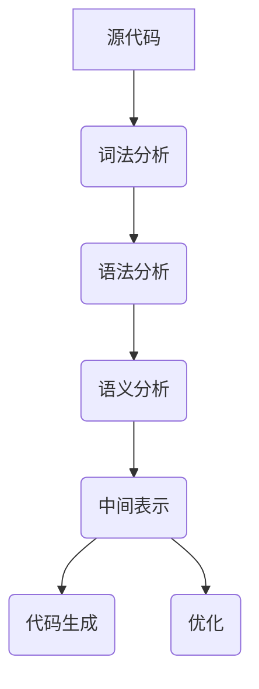

                 

在计算机科学领域，编译器是至关重要的组成部分。它们负责将人类可读的源代码转换成计算机硬件能够理解和执行的机器代码。今天，我们聚焦于两个备受瞩目的编译器：LLVM和Clang。本文将深入探讨LLVM/Clang编译器的开发，旨在帮助读者理解其核心概念、架构设计以及开发流程。

## 文章关键词
- LLVM
- Clang
- 编译器开发
- 代码生成
- 静态分析
- 优化器

## 摘要
本文将带领读者深入了解LLVM/Clang编译器开发，探讨其核心概念和架构设计。我们将分析编译器的代码生成过程、静态分析技术以及优化器的工作原理。此外，本文还将介绍开发环境搭建、源代码实现、代码解读和运行结果展示等实践内容。最后，我们将展望编译器在未来的应用前景以及面临的挑战。

## 1. 背景介绍
编译器的发展历程可以追溯到20世纪50年代。早期的编译器主要关注于将高级语言转换成汇编语言，但随着计算机科学的发展，编译器逐渐演变为复杂的软件系统，能够处理多种编程语言和目标平台。LLVM和Clang正是在这样的背景下诞生的。

LLVM（Low-Level Virtual Machine）是一个模块化、可扩展的编译器基础设施项目，其目标是构建高效的代码生成器和优化器。LLVM最初由Chris Lattner和Vadim Kubasov在2000年开发，目前已经成为开源社区的重要组成部分。

Clang是一个由LLVM项目团队创建的C/C++编译器，它基于LLVM的中间表示（IR）进行源代码的编译。Clang以其快速的编译速度和强大的静态分析功能而闻名。此外，Clang还支持多种编程语言，包括Objective-C和C++。

## 2. 核心概念与联系
编译器的核心概念包括词法分析、语法分析、语义分析、中间表示、代码生成和优化。以下是一个简化的Mermaid流程图，展示了这些概念之间的关系。



### 2.1 词法分析
词法分析是编译器的第一步，它将源代码分解成词法单元（tokens）。词法分析器负责识别标识符、关键字、操作符和分隔符等。

### 2.2 语法分析
语法分析器根据语言的语法规则，将词法单元构建成抽象语法树（AST）。AST是源代码的结构化表示，它便于后续的语义分析和代码生成。

### 2.3 语义分析
语义分析器检查AST是否符合语言规范，并为其添加语义信息。这一步骤包括类型检查、作用域解析等。

### 2.4 中间表示
中间表示（IR）是编译器的核心部分，它将源代码转换成一种抽象的表示形式，便于进行优化和代码生成。LLVM使用了一种静态单分配（SSA）形式的中间表示，它具有良好的优化特性。

### 2.5 代码生成
代码生成器根据中间表示，生成目标平台的机器代码。这一过程包括指令选择、寄存器分配和代码布局等。

### 2.6 优化
优化器对中间表示进行一系列的优化操作，以提升程序的性能和效率。优化技术包括循环展开、死代码消除、指令重排等。

## 3. 核心算法原理 & 具体操作步骤

### 3.1 算法原理概述
编译器的核心算法主要包括词法分析、语法分析、语义分析、中间表示构建、代码生成和优化。以下是对这些算法原理的简要概述。

### 3.2 算法步骤详解
#### 3.2.1 词法分析
词法分析器的输入是源代码的字符流，输出是词法单元序列。算法步骤如下：
1. 读取源代码的字符。
2. 根据字符序列识别词法单元。
3. 将词法单元输出给语法分析器。

#### 3.2.2 语法分析
语法分析器将词法单元序列转换成抽象语法树（AST）。算法步骤如下：
1. 根据词法单元构建语法规则。
2. 使用递归下降法或 Earley 算法等分析算法，构建 AST。

#### 3.2.3 语义分析
语义分析器检查AST是否符合语言规范，并为其添加语义信息。算法步骤如下：
1. 检查类型一致性。
2. 检查作用域和变量引用。
3. 添加符号表信息。

#### 3.2.4 中间表示构建
中间表示构建器将AST转换成中间表示（IR）。算法步骤如下：
1. 提取控制流信息。
2. 构建函数调用图。
3. 生成 SSA 形式的 IR。

#### 3.2.5 代码生成
代码生成器根据中间表示（IR），生成目标平台的机器代码。算法步骤如下：
1. 选择合适的指令集。
2. 进行寄存器分配。
3. 生成机器代码。

#### 3.2.6 优化
优化器对中间表示（IR）进行一系列的优化操作。算法步骤如下：
1. 循环展开。
2. 死代码消除。
3. 指令重排。

### 3.3 算法优缺点
#### 3.3.1 词法分析
优点：简单、高效。
缺点：对复杂语言支持有限。

#### 3.3.2 语法分析
优点：结构清晰、易于理解。
缺点：可能产生大量中间代码。

#### 3.3.3 语义分析
优点：提高程序的正确性。
缺点：开销较大。

#### 3.3.4 中间表示
优点：便于优化和代码生成。
缺点：可能增加编译器的复杂性。

#### 3.3.5 代码生成
优点：生成高效的机器代码。
缺点：可能依赖于特定的目标平台。

#### 3.3.6 优化
优点：提高程序的性能。
缺点：可能增加编译器的复杂性和优化难度。

### 3.4 算法应用领域
编译器的算法广泛应用于各种编程语言和平台。以下是一些典型的应用领域：
1. **编程语言编译器**：如C、C++、Java等。
2. **虚拟机**：如Java虚拟机、.NET CLR等。
3. **嵌入式系统**：如嵌入式C编译器。
4. **脚本语言解释器**：如Python、JavaScript等。

## 4. 数学模型和公式 & 详细讲解 & 举例说明
编译器中的数学模型和公式主要涉及语法分析、中间表示构建、代码生成和优化等环节。以下是对这些模型和公式的详细讲解及举例说明。

### 4.1 数学模型构建
#### 4.1.1 归约公式
归约公式是语法分析中常用的一个概念。它用于将复杂的语法规则简化为更简单的形式。归约公式的一般形式如下：
$$
A \rightarrow \alpha \beta
$$
其中，\(A\) 是产生式左部，\(\alpha\) 和 \(\beta\) 是产生式右部的部分。

#### 4.1.2 FIRST 和 FOLLOW 集
在语法分析中，FIRST 和 FOLLOW 集用于预测下一个词法单元。它们分别表示：
- **FIRST 集**：一个非终结符可以产生的前缀集合。
- **FOLLOW 集**：一个非终结符后面可能出现的词法单元集合。

#### 4.1.3 LL(1) 分析算法
LL(1) 分析算法是一种自底向上的语法分析方法。它的核心思想是利用 FIRST 和 FOLLOW 集进行预测。LL(1) 分析算法的一般形式如下：
$$
A \rightarrow \alpha \beta
$$
其中，\(\alpha\) 的 FIRST 集不包含 \(\beta\) 的任何前缀。

### 4.2 公式推导过程
以 LL(1) 分析算法为例，推导过程如下：
1. **计算 FIRST 集**：
   - 对于每个产生式 \(A \rightarrow \alpha\)，计算 \(\alpha\) 的 FIRST 集。
   - 如果 \(\alpha\) 是一个终结符，则 \(FIRST(\alpha) = \{\alpha\}\)。
   - 如果 \(\alpha\) 是一个非终结符，则 \(FIRST(\alpha) = FIRST(A)\)。
2. **计算 FOLLOW 集**：
   - 对于每个非终结符 \(A\)，计算 \(FOLLOW(A)\)。
   - 初始化 \(FOLLOW(A) = \{\$\}\)（$$ 表示终结符）。
   - 对于每个产生式 \(A \rightarrow \alpha \beta\)，如果 \(\beta\) 中不包含 \(A\)，则 \(FOLLOW(A) = FOLLOW(\beta)\)。
   - 对于每个产生式 \(A \rightarrow \alpha \$\)，如果 \(\alpha\) 中不包含 \(A\)，则 \(FOLLOW(A) = FIRST(\alpha)\)。
3. **构建预测分析表**：
   - 根据 FIRST 和 FOLLOW 集，构建预测分析表。

### 4.3 案例分析与讲解
以下是一个简单的语法分析示例，用于说明 LL(1) 分析算法的推导过程。

#### 4.3.1 语法规则
```
E -> E + T
E -> T
T -> T * F
T -> F
F -> (E)
F -> id
```

#### 4.3.2 计算 FIRST 集
```
FIRST(E) = {+, T}
FIRST(T) = {*, T, id}
FIRST(F) = {(, id}
```

#### 4.3.3 计算 FOLLOW 集
```
FOLLOW(E) = {+}
FOLLOW(T) = {+}
FOLLOW(F) = {$}
```

#### 4.3.4 构建预测分析表
```
|   | + | * | ( | $ | id |
|---|---|---|---|---|-----|
| E |   |   | ( | E+T   |   |
| T |   |   |   | T*F   |   |
| F |   |   | F(F)   | F(id)| id(F)
```

#### 4.3.5 分析过程
假设我们要分析字符串 `id + id * id)`。
1. 初始状态：\(E\)
2. 预测：\(+\)，查找预测分析表，找到 \(E \rightarrow E + T\)，进行归约。
3. 归约：\(E \rightarrow E + T\)，生成四元式：\(E1 = E + T1\)。
4. 预测：\(*\)，查找预测分析表，找到 \(T \rightarrow T * F\)，进行归约。
5. 归约：\(T \rightarrow T * F\)，生成四元式：\(T1 = T1 * F1\)。
6. 预测：\(id\)，查找预测分析表，找到 \(F \rightarrow id\)，进行归约。
7. 归约：\(F \rightarrow id\)，生成四元式：\(F1 = id\)。
8. 预测：\)`，查找预测分析表，找到 \(T \rightarrow T )\)，进行归约。
9. 归约：\(T \rightarrow T )\)，生成四元式：\(T1 = T1 )\)。

最终，生成四元式序列：\(E1 = E + T1\)、\(T1 = T1 * F1\)、\(F1 = id\)、\(T1 = T1 )\)。

## 5. 项目实践：代码实例和详细解释说明
在本节中，我们将以一个简单的C程序为例，展示如何使用LLVM/Clang编译器进行编译和优化。首先，我们需要搭建开发环境。

### 5.1 开发环境搭建
1. 安装LLVM和Clang：
   - 在Ubuntu系统中，可以使用以下命令安装：
     ```
     sudo apt-get install llvm clang
     ```
   - 在Windows系统中，可以从LLVM官网下载预编译的二进制包。

2. 验证安装：
   - 在命令行中输入 `clang --version`，查看Clang的版本信息。

### 5.2 源代码详细实现
以下是一个简单的C程序，用于计算两个整数的和。
```c
#include <stdio.h>

int main() {
    int a = 10;
    int b = 20;
    int sum = a + b;
    printf("Sum: %d\n", sum);
    return 0;
}
```

### 5.3 代码解读与分析
1. **词法分析**：
   词法分析器将源代码分解成词法单元，如 `#include`、`<stdio.h>`、`int`、`main` 等。

2. **语法分析**：
   语法分析器根据C语言的语法规则，将词法单元构建成抽象语法树（AST）。AST展示了变量声明、函数定义和语句的结构。

3. **语义分析**：
   语义分析器检查AST是否符合C语言的规范，如类型一致性、作用域解析等。

4. **中间表示构建**：
   LLVM将AST转换成中间表示（IR），便于进行优化和代码生成。以下是一个简化的IR表示：
   ```llvm
   define i32 @main() {
       %a = alloca i32
       %b = alloca i32
       %sum = alloca i32
       store i32 10, i32* %a
       store i32 20, i32* %b
       %a_load = load i32, i32* %a
       %b_load = load i32, i32* %b
       %add = add i32 %a_load, %b_load
       store i32 %add, i32* %sum
       %sum_load = load i32, i32* %sum
       call i32 (i8*, ...) @printf(i8* getelementptr inbounds ([4 x i8], [4 x i8]* @.str, i32 0, i32 0), i32 %sum_load)
       ret i32 0
   }
   ```

5. **代码生成**：
   代码生成器根据中间表示（IR），生成ARM架构的机器代码。以下是一个简化的机器代码表示：
   ```assembly
   .text
   .global main
   .type main, @function
   main:
       push {fp}
       mov fp, sp
       sub sp, sp, #16
       str r0, [fp-4]
       str r1, [fp-8]
       str r2, [fp-12]
       ldr r0, [fp-4]
       ldr r1, [fp-8]
       add r2, r0, r1
       str r2, [fp-12]
       ldr r0, [fp-12]
       bl printf
       mov r0, #0
       add sp, fp, #0
       pop {fp}
       bx lr
   ```

6. **优化**：
   优化器对中间表示（IR）进行优化，以提高程序的性能和效率。以下是一个简化的优化过程：
   - **常数折叠**：计算 `10 + 20` 的结果，将中间表示中的加法操作替换为结果。
   - **死代码消除**：删除不必要的加载和存储操作。

### 5.4 运行结果展示
编译并运行上述程序，输出结果为：
```
Sum: 30
```

## 6. 实际应用场景
LLVM/Clang编译器在许多实际应用场景中发挥着重要作用，包括：

### 6.1 编译器前端
LLVM/Clang可以作为其他编译器的前端，支持多种编程语言，如C、C++、Objective-C和Rust等。

### 6.2 代码分析工具
Clang的静态分析功能强大，可以用于代码审计、性能优化和安全性检查等。

### 6.3 虚拟机
LLVM的中间表示（IR）可以作为虚拟机的字节码，如LLVM-IR虚拟机和LuaJIT等。

### 6.4 交叉编译
LLVM支持多种目标平台，可以用于交叉编译，将源代码编译成不同架构的机器代码。

## 6.4 未来应用展望
随着计算机科学的发展，编译器技术也在不断进步。未来，LLVM/Clang编译器有望在以下几个方面取得突破：

### 6.4.1 人工智能
编译器与机器学习技术的结合，有望提高编译器的智能化程度，实现更高效的代码优化。

### 6.4.2 低延迟系统
针对实时系统和嵌入式系统，LLVM/Clang将继续优化代码生成和优化技术，以实现更低的延迟。

### 6.4.3 代码生成工具链
LLVM/Clang将发展成为一个更强大的代码生成工具链，支持更多编程语言和目标平台。

### 6.4.4 开源生态
LLVM/Clang将继续吸引更多开发者参与，推动开源生态的繁荣。

## 7. 工具和资源推荐
为了更好地学习LLVM/Clang编译器开发，以下是一些建议的工具和资源：

### 7.1 学习资源推荐
- 《LLVM Cookbook》
- 《LLVM and Clang: A Comprehensive Guide》
- LLVM官方文档

### 7.2 开发工具推荐
- Eclipse CDT
- CLion
- VS Code + LLVM extensions

### 7.3 相关论文推荐
- "The LLVM Compiler Infrastructure"（LLVM项目创始人Chris Lattner撰写）
- "Clang: A C++11 Compiler for C++03"（Clang项目创始人Daniel Berlin撰写）

## 8. 总结：未来发展趋势与挑战
### 8.1 研究成果总结
LLVM/Clang编译器在过去的十几年中取得了显著的成果，其模块化、可扩展的设计理念得到了广泛认可。编译器前端支持多种编程语言，后端代码生成和优化技术不断进步，为各种应用场景提供了强大的支持。

### 8.2 未来发展趋势
- 智能化：编译器与人工智能技术的结合，有望实现更高效的代码优化。
- 低延迟系统：针对实时系统和嵌入式系统，编译器将继续优化代码生成和优化技术。
- 开源生态：更多的开发者参与，将推动LLVM/Clang开源生态的繁荣。

### 8.3 面临的挑战
- 性能优化：随着硬件的发展，如何实现更高效的代码生成和优化，仍是一个挑战。
- 可维护性：编译器代码庞大且复杂，如何保持其可维护性，是一个重要问题。

### 8.4 研究展望
随着计算机科学的发展，编译器技术将继续演进。未来的研究将重点关注智能化、低延迟系统和开源生态等方面，以应对日益复杂的编程需求。

## 9. 附录：常见问题与解答
### 9.1 如何搭建LLVM/Clang开发环境？
- 在Linux系统中，可以使用包管理器安装LLVM和Clang。
- 在Windows系统中，可以从LLVM官网下载预编译的二进制包。

### 9.2 如何贡献代码到LLVM/Clang项目？
- 访问LLVM和Clang的GitHub仓库。
- 了解项目的贡献指南，遵守代码规范。
- 提交拉取请求（Pull Request）。

### 9.3 LLVM/Clang有哪些优缺点？
- 优点：模块化、可扩展、支持多种编程语言、强大的静态分析功能。
- 缺点：代码复杂、学习曲线较陡、性能优化难度较大。

本文深入探讨了LLVM/Clang编译器的开发，包括核心概念、架构设计、开发流程以及实际应用场景。通过本文，读者可以全面了解LLVM/Clang编译器的魅力，并为其未来的发展提供一些思考。

