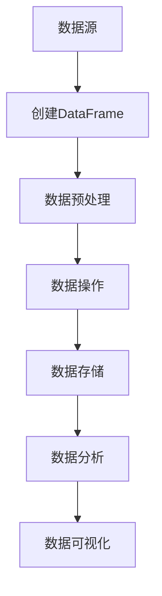

                 

  
关键词：大数据计算、DataFrame、数据处理、性能优化、代码实例

摘要：本文旨在深入探讨大数据计算中的DataFrame原理，结合具体代码实例，讲解DataFrame的使用方法、性能优化策略以及实际应用场景。通过本文，读者可以全面了解DataFrame在大数据领域的应用，为实际开发提供指导。

## 1. 背景介绍

在当今信息爆炸的时代，数据量呈现出指数级增长。为了应对这一挑战，大数据技术应运而生。大数据技术旨在对海量数据进行高效处理和分析，从而提取有价值的信息。在众多大数据技术中，DataFrame作为一种数据结构，因其高效性和灵活性，成为了数据处理领域的重要工具。

DataFrame最早由Apache Spark提出，旨在提供一种易于使用且高效的分布式数据处理框架。DataFrame允许用户以编程方式对大量数据进行操作，大大提高了数据处理效率和开发效率。

## 2. 核心概念与联系

### 2.1 DataFrame定义

DataFrame是一种分布式数据结构，用于存储和操作大数据集。它由一系列列组成，每列可以是不同类型的数据，如整数、浮点数、字符串等。DataFrame支持多种操作，如筛选、排序、聚合等，使得大数据处理变得更加简单和高效。

### 2.2 DataFrame与RDD的关系

DataFrame是基于Apache Spark的弹性分布式数据集（RDD）构建的。RDD是一种底层的数据结构，提供了丰富的操作接口，如map、filter、reduce等。DataFrame在RDD的基础上，提供了一种更为抽象和易用的数据结构，使得开发者能够以更高的效率处理大数据。

### 2.3 DataFrame与数据库的关系

DataFrame与关系型数据库（如MySQL、PostgreSQL）也有一定的联系。DataFrame支持与数据库的连接，可以使用SQL查询语言对数据进行操作。这使得DataFrame成为一种兼具分布式处理和关系型数据库优势的数据处理工具。

### 2.4 Mermaid 流程图

下面是一个简单的DataFrame操作的Mermaid流程图：



## 3. 核心算法原理 & 具体操作步骤

### 3.1 算法原理概述

DataFrame的核心算法原理主要涉及以下几个方面：

1. 分布式存储：DataFrame采用分布式存储方式，将数据分布在多个节点上，以提高数据处理效率。
2. 列式存储：DataFrame采用列式存储方式，将数据按照列进行存储，这样可以大大减少磁盘I/O操作，提高数据处理速度。
3. 数据压缩：DataFrame支持多种数据压缩算法，如LZ4、Snappy等，可以进一步减少存储空间，提高数据处理效率。
4. 数据索引：DataFrame支持数据索引，可以快速定位数据，提高查询效率。

### 3.2 算法步骤详解

以下是使用DataFrame进行数据处理的基本步骤：

1. 创建DataFrame：首先，需要从数据源创建DataFrame。可以使用Spark内置的API，如`spark.read.csv()`、`spark.read.json()`等，从不同类型的数据源读取数据。
2. 数据预处理：在处理数据之前，通常需要进行数据预处理，如数据清洗、去重、填充等。DataFrame提供了丰富的数据预处理方法，如`dropDuplicates()`、`fill()`等。
3. 数据操作：DataFrame支持多种数据操作，如筛选、排序、聚合等。可以使用Spark SQL查询语言，或者使用DataFrame的API进行操作。
4. 数据存储：处理完数据后，可以将DataFrame存储到文件、数据库或其他数据源中。DataFrame提供了多种存储方法，如`saveAsCsv()`、`saveAsParquet()`等。
5. 数据分析：DataFrame支持数据分析，可以使用Spark的MLlib库进行机器学习、图计算等高级分析。

### 3.3 算法优缺点

DataFrame具有以下优点：

1. 分布式处理：DataFrame基于Spark，可以充分利用分布式计算的优势，处理海量数据。
2. 列式存储：DataFrame采用列式存储，可以提高数据处理速度。
3. 简单易用：DataFrame提供了丰富的API，使得数据处理变得更加简单和高效。

然而，DataFrame也存在一些缺点：

1. 内存占用：由于DataFrame采用分布式存储，每个节点都需要存储数据，这可能会导致内存占用较高。
2. 学习成本：DataFrame的使用需要掌握Spark的相关知识，对于初学者来说可能有一定的学习成本。

### 3.4 算法应用领域

DataFrame广泛应用于以下领域：

1. 数据分析：用于处理和分析大量数据，提取有价值的信息。
2. 数据仓库：用于存储和管理企业级数据，支持复杂的查询和分析。
3. 机器学习：用于处理和预处理数据，为机器学习算法提供数据支持。
4. 图计算：用于处理大规模图数据，支持复杂的图分析。

## 4. 数学模型和公式 & 详细讲解 & 举例说明

### 4.1 数学模型构建

DataFrame的数据模型可以看作是一个二维数组，其中每个元素可以是一个数据值。DataFrame的数学模型主要包括以下几个方面：

1. 列名：DataFrame中的每个列都有一个唯一的列名，用于标识数据的类型。
2. 数据类型：DataFrame中的数据可以是不同类型，如整数、浮点数、字符串等。
3. 数据结构：DataFrame的数据结构是一个分布式数据集，由多个分区组成。

### 4.2 公式推导过程

DataFrame的公式推导主要涉及以下几个方面：

1. 数据处理速度：DataFrame采用列式存储，可以大大减少磁盘I/O操作，提高数据处理速度。具体公式如下：

   $$ \text{处理速度} = \frac{\text{数据处理量}}{\text{磁盘I/O操作次数}} $$

2. 内存占用：由于DataFrame采用分布式存储，每个节点都需要存储数据，这可能会导致内存占用较高。具体公式如下：

   $$ \text{内存占用} = \text{数据量} \times \text{节点数量} $$

### 4.3 案例分析与讲解

假设有一个包含1000万条记录的数据集，我们需要计算其中所有记录的总和。使用DataFrame进行计算的步骤如下：

1. 创建DataFrame：使用`spark.read.csv()`方法从CSV文件中读取数据，创建DataFrame。
2. 数据预处理：对数据进行去重、填充等预处理操作。
3. 数据操作：使用`sum()`方法计算所有记录的总和。
4. 数据存储：将计算结果存储到文件或数据库中。

以下是具体的代码实现：

```python
# 导入相关库
from pyspark.sql import SparkSession

# 创建SparkSession
spark = SparkSession.builder.appName("DataFrameExample").getOrCreate()

# 读取CSV文件，创建DataFrame
df = spark.read.csv("data.csv", header=True)

# 数据预处理
df = df.dropDuplicates()

# 数据操作：计算总和
total = df.sum()

# 数据存储
df.write.csv("result.csv")
```

## 5. 项目实践：代码实例和详细解释说明

### 5.1 开发环境搭建

在开始项目实践之前，需要搭建合适的开发环境。以下是一个简单的开发环境搭建指南：

1. 安装Java环境：DataFrame基于Java开发，因此需要安装Java环境。可以从Oracle官网下载Java安装包，并按照提示安装。
2. 安装Scala环境：DataFrame使用Scala进行开发，因此需要安装Scala环境。可以从Scala官网下载Scala安装包，并按照提示安装。
3. 安装Spark环境：DataFrame是基于Spark开发的，因此需要安装Spark环境。可以从Spark官网下载Spark安装包，并按照提示安装。

### 5.2 源代码详细实现

以下是一个简单的DataFrame处理项目的源代码实现：

```scala
import org.apache.spark.sql.SparkSession

// 创建SparkSession
val spark = SparkSession.builder.appName("DataFrameExample").getOrCreate()

// 读取CSV文件，创建DataFrame
val df = spark.read.csv("data.csv", header=True)

// 数据预处理
val df_processed = df.dropDuplicates()

// 数据操作：计算总和
val total = df_processed.sum()

// 数据存储
df_processed.write.csv("result.csv")

// 关闭SparkSession
spark.stop()
```

### 5.3 代码解读与分析

以上代码实现了一个简单的DataFrame处理项目，主要包含以下几个步骤：

1. 创建SparkSession：使用`SparkSession.builder.appName("DataFrameExample").getOrCreate()`方法创建SparkSession。
2. 读取CSV文件，创建DataFrame：使用`spark.read.csv("data.csv", header=True)`方法从CSV文件中读取数据，创建DataFrame。
3. 数据预处理：使用`df.dropDuplicates()`方法对数据进行去重操作，生成预处理后的DataFrame。
4. 数据操作：使用`df_processed.sum()`方法计算所有记录的总和，得到总结果。
5. 数据存储：使用`df_processed.write.csv("result.csv")`方法将预处理后的DataFrame存储到CSV文件中。
6. 关闭SparkSession：使用`spark.stop()`方法关闭SparkSession。

### 5.4 运行结果展示

在运行以上代码后，我们可以得到以下结果：

1. 预处理后的DataFrame包含去重后的数据。
2. 计算结果存储到CSV文件中。

## 6. 实际应用场景

DataFrame在实际应用中有着广泛的应用场景，以下是一些常见的应用场景：

1. 数据分析：DataFrame可以用于处理和分析大量数据，提取有价值的信息，如用户行为分析、市场趋势分析等。
2. 数据仓库：DataFrame可以用于构建企业级数据仓库，支持复杂的查询和分析，如销售数据统计、库存分析等。
3. 机器学习：DataFrame可以用于处理和预处理数据，为机器学习算法提供数据支持，如数据清洗、特征提取等。
4. 图计算：DataFrame可以用于处理大规模图数据，支持复杂的图分析，如社交网络分析、推荐系统等。

## 7. 工具和资源推荐

为了更好地学习和使用DataFrame，以下是一些建议的工具和资源：

1. 学习资源推荐：

   - 《Spark: The Definitive Guide》：这是一本关于Spark的权威指南，详细介绍了DataFrame的使用方法。
   - 《Learning Spark》：这是一本针对初学者的Spark学习指南，内容包括DataFrame的详细介绍。

2. 开发工具推荐：

   - IntelliJ IDEA：这是一个功能强大的集成开发环境（IDE），支持Scala和Java开发，是开发Spark应用的理想选择。
   - PyCharm：这是一个适用于Python和Scala的IDE，支持Spark开发，提供了丰富的功能。

3. 相关论文推荐：

   - "Spark: Cluster Computing with Working Sets"：这是DataFrame的原始论文，详细介绍了DataFrame的设计和实现。
   - "In-Memory Computing for Big Data"：这是一篇关于内存计算和大数据处理的综述，介绍了DataFrame在分布式计算中的优势。

## 8. 总结：未来发展趋势与挑战

随着大数据技术的不断发展，DataFrame作为一种高效的数据处理工具，将继续发挥重要作用。未来发展趋势主要包括以下几个方面：

1. 性能优化：随着数据量的不断增长，如何提高DataFrame的性能成为了一个重要的研究方向。未来可能会出现更多高效的DataFrame实现，如基于GPU的DataFrame计算。
2. 扩展性：DataFrame将更加注重扩展性，支持更多的数据源和数据格式，如时间序列数据、图像数据等。
3. 易用性：为了降低学习成本，DataFrame的易用性将得到进一步提升，提供更多直观易用的API和工具。

然而，DataFrame在发展过程中也面临着一些挑战：

1. 内存占用：由于DataFrame采用分布式存储，每个节点都需要存储数据，这可能会导致内存占用较高。如何优化内存占用成为了一个重要课题。
2. 学习成本：DataFrame的使用需要掌握Scala和Spark的相关知识，对于初学者来说可能有一定的学习成本。如何降低学习成本是一个需要解决的问题。

总的来说，DataFrame在未来将继续发挥重要作用，为大数据处理提供强大的支持。通过不断优化和改进，DataFrame将更好地应对大数据时代的挑战。

## 9. 附录：常见问题与解答

### 9.1 如何处理大数据？

处理大数据的关键在于采用分布式计算和高效的数据结构。DataFrame是一种基于分布式计算的数据结构，可以高效地处理海量数据。以下是一些处理大数据的常见方法：

1. 使用分布式计算框架：如Spark、Hadoop等，可以将大数据分片到多个节点上处理，提高计算效率。
2. 使用高效的数据结构：如DataFrame、RDD等，可以减少数据传输和存储的开销，提高数据处理速度。
3. 数据分片：将大数据集分成多个较小的数据集，分片到不同的节点上处理，可以提高处理效率。

### 9.2 如何优化DataFrame的性能？

优化DataFrame的性能可以从以下几个方面入手：

1. 数据压缩：使用有效的数据压缩算法，如LZ4、Snappy等，可以减少数据存储空间，提高数据处理速度。
2. 数据索引：使用数据索引，如hash索引、B树索引等，可以加快数据查询速度。
3. 优化数据处理流程：合理设计数据处理流程，避免不必要的中间步骤，减少数据处理时间。
4. 硬件优化：提高计算节点的性能，如使用SSD硬盘、增加内存等，可以提高数据处理速度。

### 9.3 DataFrame与关系型数据库的区别？

DataFrame与关系型数据库（如MySQL、PostgreSQL）在数据存储和操作方式上有所不同：

1. 数据存储：DataFrame采用分布式存储方式，将数据存储在多个节点上，支持大规模数据处理；关系型数据库采用集中式存储方式，将数据存储在单个数据库服务器上。
2. 数据操作：DataFrame提供丰富的API，支持高层次的抽象操作，如筛选、排序、聚合等；关系型数据库使用SQL查询语言进行操作，需要编写复杂的SQL语句。
3. 性能：DataFrame在处理大规模数据时具有更高的性能，因为它采用了分布式计算和数据压缩等优化技术；关系型数据库在处理小规模数据时可能具有更高的性能，因为它可以充分利用索引等优化技术。

总之，DataFrame和关系型数据库各有优缺点，适用于不同的应用场景。在实际开发中，可以根据具体需求选择合适的工具。

