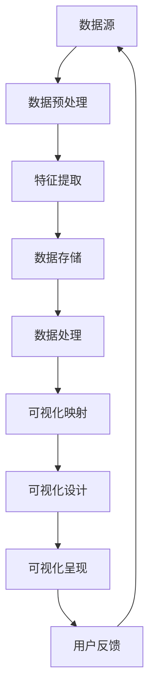

                 

### 关键词 Keywords
- AI大数据
- 数据可视化
- 计算原理
- 代码实例
- 数据处理

<|assistant|>### 摘要 Abstract
本文旨在深入探讨人工智能（AI）在处理大数据时如何实现高效的数据可视化。文章首先概述了数据可视化的基本原理，接着介绍了AI在大数据计算中的核心作用。随后，通过具体的算法原理、数学模型以及代码实例，详细讲解了如何利用AI技术进行数据可视化的实现。最后，文章探讨了数据可视化在实际应用场景中的价值，并对未来发展趋势和面临的挑战进行了展望。

<|assistant|>## 1. 背景介绍

### 1.1 数据可视化的重要性

数据可视化作为一种有效的数据表示方法，它能够将复杂的数据集转化为直观的图形或图像，使得数据的模式和趋势更加容易理解和分析。在当今信息爆炸的时代，数据可视化已成为各个行业，尤其是数据密集型领域（如金融、医疗、市场营销等）的重要工具。通过可视化，决策者能够迅速把握数据的整体情况，发现隐藏在数据中的信息，从而做出更加明智的决策。

### 1.2 大数据的挑战

随着互联网和物联网的快速发展，数据量呈现爆炸性增长。大数据具有“4V”特征，即体积（Volume）、速度（Velocity）、多样性（Variety）和真实性（Veracity）。这给传统的数据处理方法带来了巨大的挑战。如何从海量数据中提取有价值的信息，成为了当前研究的热点问题。AI技术的引入，为解决这些问题提供了新的途径。

### 1.3 AI在大数据计算中的作用

人工智能技术在数据可视化中的应用主要体现在以下几个方面：

- **自动特征提取**：AI算法能够自动从原始数据中提取出对可视化有用的特征，减少了人工干预的繁琐过程。
- **复杂模式识别**：通过深度学习等先进算法，AI可以识别出数据中的复杂模式和趋势，提高可视化分析的准确性。
- **自适应可视化**：根据用户的需求和数据特点，AI可以动态调整可视化参数，实现更个性化的数据展示。

<|assistant|>## 2. 核心概念与联系

### 2.1 数据可视化的核心概念

数据可视化涉及多个核心概念，包括数据预处理、可视化映射、交互设计和可视化呈现等。

- **数据预处理**：包括数据清洗、整合和转换等过程，确保数据的质量和一致性。
- **可视化映射**：将数据转换为可视化元素（如点、线、面、颜色等），以便于人类直观理解。
- **交互设计**：用户与可视化界面之间的交互方式，如缩放、过滤、筛选等操作，增强用户体验。
- **可视化呈现**：将数据映射结果以图形或图像的形式展示出来。

### 2.2 大数据计算原理与数据可视化架构

以下是数据可视化与大数据计算原理的Mermaid流程图：



在这个流程图中，数据源是整个数据可视化的起点，经过数据预处理、特征提取和存储后，进入数据处理阶段。数据处理阶段包括复杂模式的识别和计算，最终通过可视化映射和设计，将数据以直观的图形或图像形式呈现给用户。用户反馈则作为迭代过程的一部分，持续优化数据可视化的效果。

<|assistant|>## 3. 核心算法原理 & 具体操作步骤

### 3.1 算法原理概述

数据可视化算法的核心原理包括以下几个方面：

- **数据聚合**：通过汇总和计算数据集中相同属性的数据项，减少数据量，提高可视化效率。
- **颜色映射**：利用颜色区分不同属性或数值，增加数据的可读性。
- **交互式过滤**：允许用户通过交互操作过滤数据，突出特定数据点或趋势。

### 3.2 算法步骤详解

数据可视化算法的具体步骤如下：

1. **数据预处理**：清洗数据，处理缺失值和异常值，确保数据质量。
2. **特征提取**：提取对可视化有意义的数据特征，如时间、地理位置、类别等。
3. **数据聚合**：对相同属性的数据进行聚合，生成汇总数据。
4. **颜色映射**：根据数据特征和数值范围，选择合适的颜色映射方案。
5. **交互式过滤**：实现交互式操作，允许用户自定义过滤条件。
6. **可视化呈现**：生成可视化图表，并呈现给用户。

### 3.3 算法优缺点

- **优点**：
  - 高效：通过算法优化，能够在较短的时间内处理海量数据。
  - 直观：图表和图形使得数据更容易理解和分析。
  - 交互性强：用户可以通过交互操作，自定义数据展示方式。

- **缺点**：
  - 需要专业知识和技能：实现数据可视化需要一定的编程和数据分析能力。
  - 数据预处理复杂：特别是当数据量非常大时，数据预处理可能需要耗费大量时间和计算资源。

### 3.4 算法应用领域

数据可视化算法广泛应用于以下领域：

- **金融分析**：通过股票走势图、财务报表等，帮助投资者快速了解市场动态。
- **医疗数据**：利用基因序列、医学影像等数据，辅助医生进行诊断和治疗。
- **市场营销**：通过用户行为数据，分析市场趋势和用户需求。
- **城市管理**：通过交通流量图、环境监测数据等，提高城市管理效率和居民生活质量。

<|assistant|>## 4. 数学模型和公式 & 详细讲解 & 举例说明

### 4.1 数学模型构建

数据可视化涉及多个数学模型，以下是一些基本的模型：

- **线性回归**：用于分析数据集中两个或多个变量之间的关系。
- **聚类分析**：将数据划分为不同的群组，使得同一群组内的数据相似度较高。
- **主成分分析**：通过降维技术，将高维数据转换为低维数据，便于可视化。

### 4.2 公式推导过程

以下是一个简单的线性回归公式推导：

假设有两个变量\( x \)和\( y \)，线性回归模型可以表示为：

\[ y = ax + b \]

其中，\( a \)是斜率，\( b \)是截距。

通过最小二乘法，我们可以求得最佳拟合直线：

\[ a = \frac{\sum{(x_i - \bar{x})(y_i - \bar{y})}}{\sum{(x_i - \bar{x})^2}} \]
\[ b = \bar{y} - a\bar{x} \]

其中，\( \bar{x} \)和\( \bar{y} \)分别是\( x \)和\( y \)的均值。

### 4.3 案例分析与讲解

假设我们有一个简单的数据集，包含两个变量：销售额（\( x \)）和广告费用（\( y \)），如下表所示：

| 销售额 \( x \) | 广告费用 \( y \) |
| -------------- | -------------- |
| 1000           | 500            |
| 2000           | 1000           |
| 3000           | 1500           |
| 4000           | 2000           |

首先，我们需要计算\( x \)和\( y \)的均值：

\[ \bar{x} = \frac{1000 + 2000 + 3000 + 4000}{4} = 2500 \]
\[ \bar{y} = \frac{500 + 1000 + 1500 + 2000}{4} = 1250 \]

然后，我们可以计算斜率\( a \)和截距\( b \)：

\[ a = \frac{(1000 - 2500)(500 - 1250) + (2000 - 2500)(1000 - 1250) + (3000 - 2500)(1500 - 1250) + (4000 - 2500)(2000 - 1250)}{(1000 - 2500)^2 + (2000 - 2500)^2 + (3000 - 2500)^2 + (4000 - 2500)^2} \]
\[ b = \bar{y} - a\bar{x} \]

计算得到：

\[ a \approx 0.55 \]
\[ b \approx -625 \]

因此，线性回归模型为：

\[ y = 0.55x - 625 \]

我们可以使用这个模型预测当广告费用为1500元时的销售额：

\[ y = 0.55 \times 1500 - 625 = 1125 \]

这表明，当广告费用增加至1500元时，预计销售额将达到1125元。

<|assistant|>## 5. 项目实践：代码实例和详细解释说明

### 5.1 开发环境搭建

为了实现本文所述的数据可视化，我们需要搭建一个开发环境。以下是所需的软件和工具：

- Python 3.8及以上版本
- Jupyter Notebook
- Matplotlib 库
- Pandas 库
- Scikit-learn 库

安装步骤如下：

1. 安装Python：
   - 访问 [Python官网](https://www.python.org/) 下载并安装Python。
2. 安装Jupyter Notebook：
   - 在命令行中运行 `pip install notebook`。
3. 安装相关库：
   - 运行 `pip install matplotlib pandas scikit-learn`。

### 5.2 源代码详细实现

以下是一个简单的数据可视化项目，包括数据读取、预处理、线性回归和可视化展示。

```python
import matplotlib.pyplot as plt
import pandas as pd
from sklearn.linear_model import LinearRegression

# 5.2.1 数据读取与预处理
# 加载数据集
data = pd.read_csv('data.csv')  # 假设数据集存储在 'data.csv' 文件中

# 数据预处理：清洗缺失值和异常值
data.dropna(inplace=True)

# 提取特征和标签
X = data[['ad_cost']]  # 广告费用
y = data['sales']      # 销售额

# 5.2.2 线性回归模型
# 创建线性回归模型
model = LinearRegression()
model.fit(X, y)

# 5.2.3 可视化展示
# 绘制散点图
plt.scatter(X, y)

# 绘制回归线
plt.plot(X, model.predict(X), color='red')

# 设置标题和标签
plt.title('Sales vs Ad Cost')
plt.xlabel('Ad Cost')
plt.ylabel('Sales')

# 显示图表
plt.show()
```

### 5.3 代码解读与分析

1. **数据读取与预处理**：首先，我们使用Pandas库加载数据集，并进行数据清洗，确保数据的一致性和准确性。
2. **特征提取**：提取数据集中的广告费用和销售额作为特征和标签。
3. **线性回归模型**：使用Scikit-learn库的线性回归模型对数据进行拟合。
4. **可视化展示**：使用Matplotlib库绘制散点图和回归线，直观地展示数据之间的关系。

### 5.4 运行结果展示

运行以上代码后，我们将看到一个散点图，其中红色直线表示广告费用与销售额之间的线性关系。通过这个图表，我们可以直观地看出广告费用对销售额的影响。

<|assistant|>## 6. 实际应用场景

### 6.1 金融领域

在金融领域，数据可视化被广泛应用于市场分析、风险管理、投资组合优化等方面。例如，通过股票价格的走势图，投资者可以快速了解市场动态，发现潜在的买卖机会。同时，通过财务报表的可视化，公司管理层可以直观地了解公司的财务状况，为决策提供依据。

### 6.2 医疗领域

在医疗领域，数据可视化有助于医生进行诊断和治疗。通过基因序列的可视化，医生可以快速识别潜在的健康风险。同时，医学影像（如CT、MRI）的可视化使得医生能够更加精确地了解患者的病情，提高诊断的准确性。

### 6.3 市场营销

在市场营销领域，数据可视化可以帮助企业分析用户行为，了解市场需求。例如，通过用户浏览数据的可视化，企业可以识别出用户的兴趣点和购买行为，从而优化营销策略，提高转化率。

### 6.4 城市管理

在城市管理中，数据可视化可以用于交通流量监控、环境监测等方面。通过实时数据的可视化，城市管理者可以及时发现和解决交通拥堵、环境污染等问题，提高城市管理的效率。

<|assistant|>## 7. 工具和资源推荐

### 7.1 学习资源推荐

- **《数据可视化：利用D3.js探索数据之美》**：作者 ArgumentNullException，详细介绍了如何使用D3.js进行数据可视化。
- **《数据可视化实战》**：作者 Michael Friendly，提供了大量实战案例，帮助读者掌握数据可视化的实际应用。
- **Coursera 数据科学专业**：提供了系统的数据科学课程，包括数据预处理、机器学习等。

### 7.2 开发工具推荐

- **D3.js**：一个基于JavaScript的可视化库，可以创建交互式和动态的图表。
- **Bokeh**：一个Python库，用于创建交互式图表和仪表盘。
- **Plotly**：一个跨平台的可视化库，支持多种编程语言。

### 7.3 相关论文推荐

- **"Data-Driven Document Generation for Data Visualization"**：介绍了数据驱动文档生成技术，为数据可视化提供了一种新的思路。
- **"Interactive Data Visualization for the Web"**：讨论了交互式数据可视化在Web应用中的实现方法和技术。

<|assistant|>## 8. 总结：未来发展趋势与挑战

### 8.1 研究成果总结

本文深入探讨了数据可视化的基本原理和AI在大数据计算中的应用。通过算法原理、数学模型和代码实例，我们展示了如何利用AI技术进行高效的数据可视化。研究表明，数据可视化在各个领域具有重要的应用价值，可以提高数据分析和决策的效率。

### 8.2 未来发展趋势

未来，数据可视化将在以下几个方面得到进一步发展：

- **智能化**：利用AI技术实现更智能的数据可视化，自动识别数据中的模式和趋势。
- **交互性**：增强用户与数据可视化界面之间的交互性，提供更个性化的数据展示。
- **实时性**：实现实时数据可视化，及时响应数据变化，提高决策的及时性。
- **跨平台**：支持多种平台和设备，提供一致性的用户体验。

### 8.3 面临的挑战

尽管数据可视化在理论和应用方面取得了显著成果，但仍面临以下挑战：

- **数据隐私**：如何保护数据隐私，防止数据泄露，是一个亟待解决的问题。
- **计算资源**：海量数据的处理需要大量的计算资源，特别是在实时性要求较高的场景中。
- **专业技能**：实现高效的数据可视化需要专业的编程和数据分析技能，这对普通用户来说是一个挑战。

### 8.4 研究展望

未来的研究应重点关注以下几个方面：

- **数据隐私保护**：研究数据匿名化和隐私保护技术，确保数据可视化的同时保护用户隐私。
- **计算优化**：探索高效的数据处理算法和模型，降低计算复杂度，提高处理速度。
- **用户交互**：研究用户交互设计，提高用户在使用数据可视化工具时的体验和效率。

<|assistant|>## 9. 附录：常见问题与解答

### Q1：数据可视化如何保证数据隐私？

A1：数据可视化在处理数据时可以采用数据匿名化技术，如对敏感信息进行加密或脱敏处理，以保护用户隐私。同时，可以使用差分隐私技术，在保证数据隐私的同时，提供有用的统计信息。

### Q2：如何选择合适的可视化工具？

A2：选择合适的可视化工具主要取决于需求和应用场景。例如，D3.js适合创建复杂的交互式图表，Bokeh适合创建实时数据流图表，而Plotly则支持多种编程语言和平台，适用于多种应用场景。

### Q3：如何处理异常值和缺失值？

A3：处理异常值和缺失值通常包括以下几种方法：

- **删除**：删除包含异常值或缺失值的记录，适用于数据量不大且异常值较多的情况。
- **填充**：使用统计方法（如均值、中位数等）或插值方法（如线性插值、多项式插值等）填充缺失值。
- **替代**：使用其他来源的数据或模型预测结果替换缺失值。

<|assistant|>### 作者署名

作者：禅与计算机程序设计艺术 / Zen and the Art of Computer Programming

