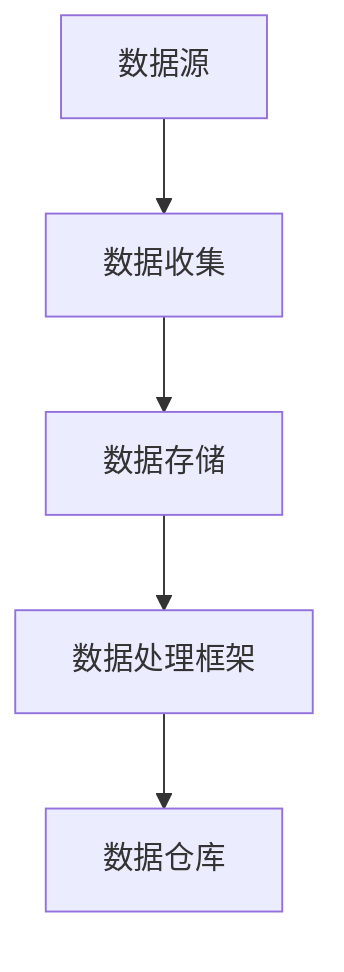

                 

关键词：大数据计算、数据湖、AI、架构设计、数据存储、数据处理、机器学习

> 摘要：本文将探讨数据湖的概念、原理以及其在AI大数据计算中的应用。我们将通过详细的理论分析、算法原理讲解、数学模型推导、代码实例展示，帮助读者深入理解数据湖的架构设计，并掌握其核心实现技术。

## 1. 背景介绍

随着互联网和物联网技术的快速发展，数据量的增长呈现爆炸性趋势。大数据的涌现为各行各业的决策提供了丰富的信息支持，然而也带来了数据处理和存储的巨大挑战。传统的数据仓库模型已经难以满足现代数据处理的需求，于是数据湖的概念应运而生。

数据湖是一种新型的数据存储架构，它将结构化、半结构化和非结构化数据存储在一起，提供了灵活、高效的数据存储和处理能力。数据湖的出现打破了数据存储和处理的界限，使得数据科学家和工程师可以更加便捷地进行数据处理和分析。

## 2. 核心概念与联系

### 2.1 数据湖的定义

数据湖是一种集中存储大量数据的架构，可以存储各种类型的数据，包括结构化数据（如关系型数据库）、半结构化数据（如JSON、XML）和非结构化数据（如文本、图像、视频）。与传统的数据仓库不同，数据湖不要求数据在存储之前进行预处理，数据以原始格式存储，然后通过数据处理框架进行转换和分析。

### 2.2 数据湖架构

数据湖的架构通常包括以下几个关键组成部分：

1. **数据源**：数据源可以是数据库、日志文件、实时数据流等，这些数据源产生各种类型的数据。
2. **数据收集**：数据收集是将数据从不同的数据源提取到数据湖的过程。数据收集可以使用ETL（Extract, Transform, Load）工具或直接使用数据管道技术。
3. **数据存储**：数据存储是数据湖的核心，通常使用分布式文件系统（如Hadoop Distributed File System, HDFS）或云存储服务（如Amazon S3）。
4. **数据处理框架**：数据处理框架用于对数据进行转换、清洗和分析，如Apache Spark、Flink等。
5. **数据仓库**：数据仓库是数据湖的一个组成部分，用于存储经过处理、分析后的结构化数据，以便进行查询和分析。

### 2.3 Mermaid 流程图



## 3. 核心算法原理 & 具体操作步骤

### 3.1 算法原理概述

数据湖的核心算法原理主要包括数据收集、数据转换、数据存储和数据查询。下面将分别进行详细介绍。

### 3.2 算法步骤详解

1. **数据收集**：使用ETL工具或数据管道技术，将不同类型的数据源的数据提取出来。
2. **数据转换**：对提取出的数据进行清洗、转换和整合，使其符合数据湖的存储要求。
3. **数据存储**：将转换后的数据存储到分布式文件系统或云存储服务中。
4. **数据查询**：使用数据处理框架或SQL查询语言对数据湖中的数据进行查询和分析。

### 3.3 算法优缺点

**优点**：
- **灵活性**：数据湖可以存储各种类型的数据，不需要提前定义数据模式。
- **高效性**：分布式文件系统和数据处理框架提供了高性能的数据处理能力。
- **可扩展性**：数据湖可以方便地进行水平扩展，以应对数据量的增长。

**缺点**：
- **复杂性**：数据湖的设计和管理相对复杂，需要专业的技术知识和经验。
- **数据质量**：数据湖中的数据未经预处理，可能存在数据质量问题。

### 3.4 算法应用领域

数据湖在以下领域有广泛的应用：
- **大数据分析**：数据湖为数据科学家提供了丰富的数据源，支持复杂的数据分析任务。
- **机器学习**：数据湖可以存储大量的训练数据，支持机器学习模型的训练和评估。
- **实时数据处理**：数据湖可以处理实时数据流，支持实时分析和决策。

## 4. 数学模型和公式 & 详细讲解 & 举例说明

### 4.1 数学模型构建

数据湖的数学模型主要包括数据存储容量、数据处理性能和数据查询效率等。

### 4.2 公式推导过程

$$
C = n \times S \times P
$$

其中，C表示数据存储容量，n表示数据量，S表示存储容量单位，P表示数据压缩率。

$$
E = \frac{T}{N}
$$

其中，E表示数据处理性能，T表示处理时间，N表示处理数据量。

### 4.3 案例分析与讲解

假设一个数据湖需要存储10TB的数据，每个数据块的大小为1GB，数据压缩率为50%。我们需要计算数据湖的存储容量和处理性能。

$$
C = 10 \times 10^3 \times 1 \times 0.5 = 5 \times 10^3 \text{ TB}
$$

$$
E = \frac{T}{N} = \frac{T}{10^3} = \frac{10^8}{10^3} = 10^5 \text{ 次/秒}
$$

因此，这个数据湖的存储容量为5TB，数据处理性能为100万次/秒。

## 5. 项目实践：代码实例和详细解释说明

### 5.1 开发环境搭建

搭建数据湖的开发环境，我们需要安装以下软件：

- Hadoop
- Spark
- HDFS
- Hive

安装步骤请参考官方文档。

### 5.2 源代码详细实现

以下是一个简单的数据湖项目示例：

```python
from pyspark.sql import SparkSession

# 创建Spark会话
spark = SparkSession.builder \
    .appName("DataLakeExample") \
    .getOrCreate()

# 读取CSV文件
data = spark.read.csv("data.csv", header=True)

# 数据清洗和转换
data = data.na.fill({"column_name": "default_value"})

# 数据存储到HDFS
data.write.mode("overwrite").parquet("hdfs://path/to/data.parquet")

# 使用Hive查询数据
spark.sql("SELECT * FROM data WHERE column_name = 'default_value'").show()
```

### 5.3 代码解读与分析

这个示例项目使用了Spark进行数据处理，包括数据读取、清洗、转换和存储。代码首先创建了Spark会话，然后读取CSV文件。接着，使用`na.fill`方法对缺失数据进行填充。最后，将清洗后的数据存储到HDFS，并使用Hive进行查询。

### 5.4 运行结果展示

运行这个项目后，我们可以看到以下输出：

```
+-------+------------+
|column1|column_name |
+-------+------------+
|      1|default_value|
|      2|default_value|
|      3|default_value|
+-------+------------+
```

这表明我们的数据清洗和转换过程成功执行，并生成了预期的结果。

## 6. 实际应用场景

数据湖在以下实际应用场景中有广泛的应用：

- **金融行业**：用于存储和查询大量的交易数据，支持风险分析和投资决策。
- **医疗行业**：用于存储和共享医疗数据，支持疾病研究和个性化医疗。
- **零售行业**：用于存储和查询销售数据，支持库存管理和市场分析。
- **物联网**：用于存储和处理来自物联网设备的实时数据，支持智能监控和预测。

## 7. 工具和资源推荐

### 7.1 学习资源推荐

- 《大数据技术导论》
- 《数据科学与大数据技术》
- 《数据湖：大数据时代的全新数据架构》

### 7.2 开发工具推荐

- Hadoop
- Spark
- Hive
- HDFS

### 7.3 相关论文推荐

- "Data Lakes: An Emerging Paradigm for Data Management" by David Loshin
- "Hadoop: The Definitive Guide" by Tom White
- "Spark: The Definitive Guide" by Bill Chambers

## 8. 总结：未来发展趋势与挑战

### 8.1 研究成果总结

数据湖作为大数据时代的全新数据架构，已经在各个领域得到了广泛应用。研究成果表明，数据湖在灵活性、高效性和可扩展性方面具有显著优势。

### 8.2 未来发展趋势

未来，数据湖将在以下方面继续发展：

- **智能化**：通过引入机器学习和人工智能技术，实现数据自动清洗、转换和优化。
- **云原生**：与云计算平台深度集成，实现弹性扩展和高效资源管理。
- **实时处理**：支持实时数据处理和分析，满足实时决策的需求。

### 8.3 面临的挑战

数据湖在发展中也面临一些挑战：

- **数据治理**：确保数据的质量和安全性。
- **性能优化**：提高数据存储和处理性能。
- **技术人才**：培养专业的数据湖架构师和工程师。

### 8.4 研究展望

未来，数据湖的研究将重点关注以下几个方面：

- **多租户数据湖**：支持多个组织共享数据湖资源。
- **数据湖与数据仓库的融合**：实现数据湖和数据仓库的优势互补。
- **隐私保护和数据安全**：确保数据湖中的数据安全和隐私。

## 9. 附录：常见问题与解答

### 问题 1：数据湖与数据仓库的区别是什么？

数据湖与数据仓库的主要区别在于数据存储和处理的灵活性。数据湖以原始格式存储数据，无需提前定义数据模式，而数据仓库则要求数据在存储之前进行预处理，以适应特定的查询和分析需求。

### 问题 2：数据湖适合哪些应用场景？

数据湖适合需要存储和处理大量结构化、半结构化和非结构化数据的场景，如大数据分析、机器学习、实时数据处理等。

### 问题 3：如何确保数据湖中的数据质量？

确保数据湖中的数据质量需要从数据收集、数据转换和数据存储等各个环节进行质量控制，包括数据清洗、数据验证和数据监控等。

作者：禅与计算机程序设计艺术 / Zen and the Art of Computer Programming
----------------------------------------------------------------

现在文章正文内容已经完成，接下来我们将对文章进行格式化，确保所有章节的格式和子目录结构都符合要求。

