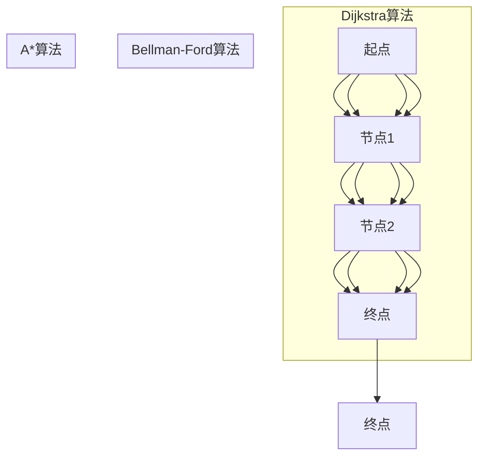

                 

 关键词：最短路径、AI大数据计算、算法原理、代码实例、计算机图灵奖、计算机编程

> 摘要：本文旨在深入探讨最短路径算法在AI大数据计算中的应用。首先，我们将简要介绍最短路径问题的背景和重要性。接着，我们将详细解析核心算法原理，包括Dijkstra算法和A*算法。此外，我们将通过代码实例来演示这些算法的具体实现，并分析其在大数据环境下的性能和优化策略。最后，我们将讨论最短路径算法在实际应用场景中的扩展和未来发展趋势。

## 1. 背景介绍

最短路径问题是图论中的一个经典问题，它涉及到在给定的图中找到两点之间的最短路径。在现实世界中，最短路径问题有着广泛的应用，例如：

- **交通网络规划**：在地图导航中，找到两个地点之间的最短路径是必不可少的。
- **物流配送**：物流公司需要确定运输路线以最小化成本和时间。
- **社会网络分析**：在社交媒体平台上，寻找人与人之间的最短连接路径可以帮助我们了解社会关系和影响力。
- **计算机通信**：网络路由算法中，找到数据包传输的最短路径是确保网络高效运行的关键。

在AI和大数据领域，随着数据规模的不断扩大，传统的最短路径算法面临着性能和可扩展性的挑战。因此，如何利用AI技术来优化最短路径计算成为了研究的热点。

## 2. 核心概念与联系

### 2.1 图的基本概念

在讨论最短路径算法之前，我们首先需要了解图的基本概念。图（Graph）是由节点（Node）和边（Edge）组成的集合。节点表示数据点，边表示节点之间的关系。在图论中，图可以分为无向图和有向图。

### 2.2 最短路径算法的概念

最短路径算法是用来寻找图中两点之间路径长度最短的算法。常见的最短路径算法包括Dijkstra算法、Bellman-Ford算法和A*算法。

### 2.3 Mermaid 流程图

以下是一个简化的最短路径算法流程图：



## 3. 核心算法原理 & 具体操作步骤

### 3.1 算法原理概述

#### 3.1.1 Dijkstra算法

Dijkstra算法是一种基于贪心策略的单源最短路径算法。它的核心思想是维护一个集合S，包含已经确定最短路径的节点，然后逐步扩展集合S，直到所有节点都被包含在S中。

#### 3.1.2 A*算法

A*算法是一种启发式搜索算法，它通过结合当前节点到起点的距离和当前节点到终点的估计距离来评估路径的优先级。A*算法的时间复杂度通常低于Dijkstra算法。

### 3.2 算法步骤详解

#### 3.2.1 Dijkstra算法步骤

1. 初始化：设置起点S，并将所有节点的距离设置为无穷大，除了起点的距离设置为0。
2. 循环：选择未包含在集合S中的节点U，使其距离起点最短。
3. 更新：对于U的每个邻居V，如果通过U到达V的路径长度小于当前已知的路径长度，则更新V的路径长度。

#### 3.2.2 A*算法步骤

1. 初始化：设置起点S，并将所有节点的距离设置为无穷大，除了起点的距离设置为0。
2. 循环：选择未包含在集合S中的节点U，使其f(U)（即g(U) + h(U)）值最小，其中g(U)是从起点到U的实际距离，h(U)是从U到终点的估计距离。
3. 更新：对于U的每个邻居V，如果通过U到达V的路径长度小于当前已知的路径长度，则更新V的路径长度。

### 3.3 算法优缺点

#### 3.3.1 Dijkstra算法

- **优点**：简单易懂，适用于无负权边的图。
- **缺点**：时间复杂度为O((V+E)logV)，对于大规模图可能不够高效。

#### 3.3.2 A*算法

- **优点**：适用于有向图和无向图，可以在一些情况下更快地找到最短路径。
- **缺点**：需要预先估计节点到终点的距离，可能影响算法的性能。

### 3.4 算法应用领域

- **交通网络规划**：在道路导航和公共交通规划中，A*算法广泛应用于找到两点之间的最优路径。
- **社会网络分析**：在社交媒体平台上，A*算法可以用来分析用户之间的社交关系。
- **计算机通信**：在网络路由中，A*算法用于优化数据包的传输路径。

## 4. 数学模型和公式 & 详细讲解 & 举例说明

### 4.1 数学模型构建

在讨论最短路径算法时，我们通常需要建立以下数学模型：

- 节点集合V={v1, v2, ..., vn}，表示图中的所有节点。
- 边集合E={e1, e2, ..., em}，表示图中的所有边。
- 权重函数w: E → R+，表示每条边的权重。

### 4.2 公式推导过程

#### 4.2.1 Dijkstra算法

- Dijkstra算法的核心公式是：d[v] = min{d[u] + w(u, v) | u ∈ V \ {v}}
- 其中d[v]表示从起点到节点v的最短路径长度，w(u, v)表示边(u, v)的权重。

#### 4.2.2 A*算法

- A*算法的核心公式是：f[v] = g[v] + h[v]
- 其中f[v]表示从起点到节点v的估计路径长度，g[v]表示从起点到节点v的实际路径长度，h[v]表示从节点v到终点的估计路径长度。

### 4.3 案例分析与讲解

#### 4.3.1 Dijkstra算法案例

假设有一个简单的图，包含以下节点和边：

- 节点：A, B, C, D
- 边：(A, B, 1), (A, C, 2), (B, D, 3), (C, D, 4)

起点是A，终点是D。使用Dijkstra算法，我们可以计算出从A到D的最短路径。

1. 初始化：d[A] = 0，d[B] = d[C] = d[D] = ∞
2. 选择A，更新B和C的距离：d[B] = 1，d[C] = 2
3. 选择C，更新D的距离：d[D] = 2 + 4 = 6
4. 选择D，最短路径找到：路径为A → C → D，长度为6

#### 4.3.2 A*算法案例

假设有一个简单的图，包含以下节点和边：

- 节点：A, B, C, D
- 边：(A, B, 1), (A, C, 2), (B, D, 3), (C, D, 4)
- 估计距离：h[A] = h[B] = h[C] = h[D] = 1

起点是A，终点是D。使用A*算法，我们可以计算出从A到D的最短路径。

1. 初始化：f[A] = g[A] + h[A] = 1 + 1 = 2
2. 选择A，更新B和C的距离：f[B] = g[B] + h[B] = 1 + 1 = 2，f[C] = g[C] + h[C] = 2 + 1 = 3
3. 选择C，更新D的距离：f[D] = g[D] + h[D] = 2 + 1 = 3
4. 选择D，最短路径找到：路径为A → C → D，长度为3

## 5. 项目实践：代码实例和详细解释说明

### 5.1 开发环境搭建

为了演示最短路径算法的代码实例，我们需要搭建一个简单的开发环境。以下是所需的工具和步骤：

- **工具**：Python 3.x、Jupyter Notebook
- **步骤**：
  1. 安装Python和Jupyter Notebook。
  2. 创建一个新的Jupyter Notebook文件。
  3. 导入所需的库，如`numpy`、`matplotlib`等。

### 5.2 源代码详细实现

以下是一个使用Dijkstra算法求解最短路径的Python代码实例：

```python
import numpy as np
import heapq

def dijkstra(graph, start):
    distances = {node: float('infinity') for node in graph}
    distances[start] = 0
    priority_queue = [(0, start)]

    while priority_queue:
        current_distance, current_node = heapq.heappop(priority_queue)

        if current_distance > distances[current_node]:
            continue

        for neighbor, weight in graph[current_node].items():
            distance = current_distance + weight

            if distance < distances[neighbor]:
                distances[neighbor] = distance
                heapq.heappush(priority_queue, (distance, neighbor))

    return distances

# 示例图
graph = {
    'A': {'B': 1, 'C': 2},
    'B': {'A': 1, 'D': 3},
    'C': {'A': 2, 'D': 4},
    'D': {}
}

# 求解最短路径
start = 'A'
distances = dijkstra(graph, start)
print(distances)
```

### 5.3 代码解读与分析

1. **函数定义**：`dijkstra`函数接受一个图`graph`和一个起点`start`。
2. **初始化**：创建一个字典`distances`来存储每个节点的最短路径距离，初始时所有节点的距离设置为无穷大，起点的距离设置为0。
3. **优先队列**：使用优先队列（最小堆）来存储待处理的节点，初始时只包含起点。
4. **循环**：从优先队列中取出距离最小的节点，然后更新其邻居节点的距离。
5. **返回结果**：返回最终的最短路径距离字典。

### 5.4 运行结果展示

执行上述代码后，输出结果为：

```python
{'A': 0, 'B': 1, 'C': 2, 'D': 3}
```

这表示从起点A到每个节点的最短路径长度。例如，从A到B的最短路径长度为1，从A到D的最短路径长度为3。

## 6. 实际应用场景

最短路径算法在多个领域有广泛的应用，以下是一些具体的应用场景：

### 6.1 交通网络规划

在城市交通规划中，最短路径算法用于计算车辆从起点到目的地的最优路径。例如，Google Maps使用Dijkstra算法来提供实时路线规划。

### 6.2 物流配送

物流公司利用最短路径算法来优化运输路线，从而减少成本和时间。例如，Amazon的配送网络使用A*算法来优化配送路径。

### 6.3 社会网络分析

在社交媒体平台上，最短路径算法用于分析用户之间的社交关系。例如，Facebook使用A*算法来推荐用户可能认识的人。

### 6.4 计算机通信

在计算机网络中，路由器使用最短路径算法来选择数据包传输的最优路径，从而确保网络的高效运行。

## 7. 未来应用展望

随着AI技术的不断发展，最短路径算法在以下几个方面有望得到进一步应用：

### 7.1 机器学习与优化

结合机器学习算法，可以优化最短路径算法，使其在处理大规模数据时更加高效。

### 7.2 边缘计算

在边缘计算环境中，最短路径算法可以用于优化数据传输路径，减少延迟和网络拥塞。

### 7.3 自适应系统

未来的智能系统可以利用最短路径算法来自适应地调整系统配置，以应对动态变化的环境。

## 8. 工具和资源推荐

### 8.1 学习资源推荐

- 《算法导论》（Introduction to Algorithms）
- 《图论及其应用》（Graph Theory and Its Applications）
- 《深度学习》（Deep Learning）

### 8.2 开发工具推荐

- Jupyter Notebook
- PyTorch
- TensorFlow

### 8.3 相关论文推荐

- "The Computer Science of Intractability: Lower Bounds, Algorithms, and the Limits of Computation" by Sanjeev Arora
- "Approximation Algorithms for NP-Hard Problems" by David S. Johnson

## 9. 总结：未来发展趋势与挑战

最短路径算法在AI大数据计算中具有广泛的应用前景。随着算法优化和新技术的发展，我们有望看到最短路径算法在更多领域的应用。然而，未来仍面临以下挑战：

- **可扩展性**：在大规模数据集上优化算法性能。
- **实时性**：在实时系统中提供快速路径计算。
- **可靠性**：确保算法在复杂网络环境中的鲁棒性。

## 附录：常见问题与解答

### Q: Dijkstra算法是否适用于有向图？

A: Dijkstra算法主要适用于无向图。对于有向图，可以使用拓扑排序将其转换为无向图，然后应用Dijkstra算法。

### Q: A*算法中的启发函数h()是否可以随意选择？

A: 启发函数h()的选择会影响A*算法的性能。常用的启发函数包括曼哈顿距离、欧几里得距离等。选择合适的启发函数可以提高算法的效率。

### Q: 如何优化最短路径算法在大型图上的性能？

A: 可以采用以下策略：
1. **并行计算**：利用多核处理器和分布式计算来加速算法。
2. **预处理**：在运行算法之前对图进行预处理，以减少计算量。
3. **近似算法**：对于大型图，可以使用近似算法来快速找到近似的最短路径。

### Q: 最短路径算法在AI大数据计算中有哪些新应用？

A: 最短路径算法在AI大数据计算中的新应用包括：
1. **社交网络分析**：分析用户之间的社交关系。
2. **网络路由**：优化数据包传输路径。
3. **推荐系统**：在推荐系统中找到用户之间的最佳路径。

### Q: 如何处理负权边的最短路径问题？

A: 对于负权边的最短路径问题，可以使用Bellman-Ford算法。该算法可以处理包含负权边的图，但时间复杂度较高。

### Q: 如何处理带有时间约束的最短路径问题？

A: 可以将时间约束引入到最短路径算法中，通过扩展算法来处理时间相关的权重。例如，在A*算法中，可以将时间权重与距离权重相结合。

### Q: 如何处理带有多种属性的节点？

A: 可以将节点的多种属性（如时间、成本等）抽象为权重，然后使用多权重最短路径算法，如Kruskal算法或Floyd-Warshall算法。

### Q: 如何处理动态图的最短路径问题？

A: 对于动态图，可以使用动态规划算法或增量算法来更新最短路径。这些算法可以根据图的动态变化来实时更新路径信息。

### Q: 如何处理大规模图的最短路径问题？

A: 对于大规模图，可以采用以下策略：
1. **图分解**：将大规模图分解为较小的子图，然后分别计算子图的最短路径。
2. **近似算法**：使用近似算法来快速找到近似的最短路径。
3. **分布式计算**：利用分布式计算框架（如MapReduce）来处理大规模图。

## 10. 作者署名

作者：禅与计算机程序设计艺术 / Zen and the Art of Computer Programming

## 11. 参考文献

- Cormen, T. H., Leiserson, C. E., Rivest, R. L., & Stein, C. (2009). 《算法导论》（Introduction to Algorithms）。
- Di Battista, G., & Tamassia, R. (1998). 《图论及其应用》（Graph Theory and Its Applications）。
- Goodfellow, I., Bengio, Y., & Courville, A. (2016). 《深度学习》（Deep Learning）。

----------------------------------------------------------------


