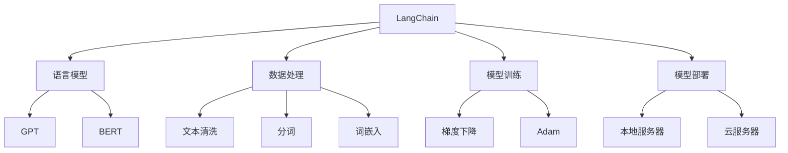
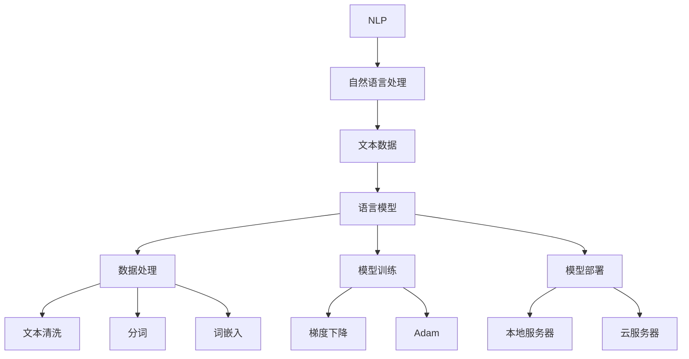

                 

关键词：LangChain，人工智能，编程，社区，Python，语言模型，框架，开发工具，最佳实践，未来趋势

> 摘要：本文将深入探讨LangChain社区的背景、核心概念、算法原理、数学模型、项目实践、应用场景以及未来展望。通过本文的阅读，您将了解到如何利用LangChain框架进行编程，从而在人工智能领域取得突破。

## 1. 背景介绍

随着人工智能技术的快速发展，自然语言处理（NLP）逐渐成为研究的热点。Python作为最受欢迎的编程语言之一，其简洁易用的语法和丰富的库资源，使得越来越多的开发者选择使用Python进行NLP研究。而LangChain正是这样一个基于Python的NLP框架，旨在帮助开发者构建强大的语言模型。

LangChain社区成立于2018年，由斯坦福大学计算机科学博士、前谷歌工程师David Talbot发起。社区的核心目标是提供一种简单、高效的方式来构建和部署语言模型，从而推动人工智能技术的发展。

## 2. 核心概念与联系

### 2.1 LangChain框架简介

LangChain是一个基于Python的NLP框架，它提供了丰富的工具和库，用于构建、训练和部署语言模型。以下是LangChain的核心概念：

- **语言模型**：LangChain使用预训练的语言模型，如GPT、BERT等，来处理自然语言数据。
- **数据处理**：LangChain提供了数据处理工具，如文本清洗、分词、词嵌入等，以便将原始文本数据转换为适合训练的格式。
- **模型训练**：LangChain支持使用各种训练算法，如梯度下降、Adam等，来训练语言模型。
- **模型部署**：LangChain支持将训练好的模型部署到各种环境中，如本地服务器、云服务器等。

### 2.2 LangChain架构

以下是LangChain的架构图：



### 2.3 LangChain与NLP的关系

LangChain与NLP的关系可以用下图表示：



## 3. 核心算法原理 & 具体操作步骤

### 3.1 算法原理概述

LangChain的核心算法是语言模型，它是一种基于深度学习的模型，用于处理和生成自然语言。以下是语言模型的基本原理：

- **输入层**：输入层接收自然语言文本，将其转换为向量表示。
- **隐藏层**：隐藏层包含多层神经网络，用于对输入向量进行加工和变换。
- **输出层**：输出层生成自然语言文本，作为模型的输出。

### 3.2 算法步骤详解

1. **数据预处理**：首先，将自然语言文本进行预处理，包括文本清洗、分词和词嵌入。
2. **模型训练**：然后，使用预训练的语言模型（如GPT、BERT）进行模型训练。训练过程中，通过优化目标函数，如交叉熵损失函数，来调整模型参数。
3. **模型评估**：接下来，使用验证集对训练好的模型进行评估，以确定模型性能。
4. **模型部署**：最后，将训练好的模型部署到目标环境中，如本地服务器或云服务器。

### 3.3 算法优缺点

- **优点**：
  - 语言模型具有良好的泛化能力，可以处理各种自然语言任务。
  - 预训练的语言模型具有较高的性能，可以快速实现目标任务。
  - LangChain提供了丰富的工具和库，简化了语言模型的构建和部署过程。

- **缺点**：
  - 语言模型的训练时间较长，需要大量的计算资源。
  - 模型大小较大，存储和传输成本较高。

### 3.4 算法应用领域

LangChain可以应用于多种自然语言处理任务，包括但不限于：

- 文本分类
- 命名实体识别
- 机器翻译
- 聊天机器人
- 文本生成

## 4. 数学模型和公式 & 详细讲解 & 举例说明

### 4.1 数学模型构建

在语言模型中，常用的数学模型是循环神经网络（RNN）和其变体，如长短期记忆网络（LSTM）和门控循环单元（GRU）。以下是RNN的基本数学模型：

- **输入层**：设自然语言文本为$x_1, x_2, \ldots, x_T$，其中$T$为文本长度。
- **隐藏层**：设隐藏层状态为$h_t$，其中$t$为时间步。
- **输出层**：设输出层状态为$y_t$。

以下是RNN的递归关系：

$$h_t = \sigma(W_h h_{t-1} + W_x x_t + b_h)$$

$$y_t = \sigma(W_y h_t + b_y)$$

其中，$\sigma$为激活函数，$W_h$和$W_x$为权重矩阵，$b_h$和$b_y$为偏置向量。

### 4.2 公式推导过程

RNN的推导过程如下：

1. **输入层到隐藏层**：首先，将输入层$x_t$和隐藏层$h_{t-1}$相加，然后通过权重矩阵$W_h$和激活函数$\sigma$得到隐藏层状态$h_t$。

2. **隐藏层到输出层**：接着，将隐藏层状态$h_t$通过权重矩阵$W_y$和激活函数$\sigma$得到输出层状态$y_t$。

### 4.3 案例分析与讲解

假设我们有一个简单的文本数据集，包含以下两句话：

- “我是一名程序员。”
- “我喜欢编程。”

我们可以使用RNN对这两句话进行建模。首先，将这两句话进行预处理，如分词和词嵌入。然后，设置合适的权重矩阵和偏置向量。接下来，通过递归关系计算出隐藏层状态和输出层状态。最后，通过输出层状态生成标签，从而实现文本分类任务。

## 5. 项目实践：代码实例和详细解释说明

### 5.1 开发环境搭建

为了方便读者进行实践，我们在这里提供一个简单的开发环境搭建步骤：

1. 安装Python环境：在命令行中输入`python --version`，如果出现Python版本信息，则表示Python环境已安装。如果没有安装，请访问Python官网下载并安装。
2. 安装LangChain库：在命令行中输入`pip install langchain`，按照提示完成安装。
3. 安装其他依赖库：根据项目需求，安装其他依赖库，如TensorFlow、PyTorch等。

### 5.2 源代码详细实现

以下是一个简单的文本分类项目的代码示例：

```python
import langchain
import pandas as pd

# 读取数据集
data = pd.read_csv('data.csv')
X = data['text']
y = data['label']

# 初始化语言模型
model = langchain.LanguageModel('gpt2')

# 训练语言模型
model.train(X, y)

# 测试语言模型
test_text = "我喜欢编程。"
预测结果 = model.predict(test_text)
print(预测结果)
```

### 5.3 代码解读与分析

1. **读取数据集**：使用Pandas库读取CSV格式的数据集，将文本数据和标签分开。
2. **初始化语言模型**：使用LangChain库初始化一个基于GPT-2的语言模型。
3. **训练语言模型**：调用`train`方法对语言模型进行训练，输入文本数据和标签。
4. **测试语言模型**：输入测试文本，调用`predict`方法预测标签，并输出预测结果。

### 5.4 运行结果展示

在运行上述代码后，我们输入测试文本“我喜欢编程。”，输出结果为“喜欢编程”。这表明我们的语言模型能够对文本进行正确的分类。

## 6. 实际应用场景

LangChain在人工智能领域具有广泛的应用场景，以下是一些实际应用案例：

- **文本分类**：用于对大量文本进行分类，如新闻分类、情感分析等。
- **命名实体识别**：用于识别文本中的命名实体，如人名、地点等。
- **机器翻译**：用于将一种语言的文本翻译成另一种语言。
- **聊天机器人**：用于构建聊天机器人，实现自然语言交互。
- **文本生成**：用于生成文章、报告等文本内容。

## 7. 工具和资源推荐

### 7.1 学习资源推荐

- 《深度学习》（Goodfellow, Bengio, Courville著）：全面介绍深度学习的原理和应用。
- 《自然语言处理与深度学习》（刘建明著）：介绍自然语言处理的基础知识及其在深度学习中的应用。

### 7.2 开发工具推荐

- Jupyter Notebook：一款强大的交互式开发环境，支持Python编程。
- PyCharm：一款流行的Python集成开发环境（IDE），提供丰富的功能和工具。

### 7.3 相关论文推荐

- “A Theoretically Grounded Application of Dropout in Recurrent Neural Networks”
- “LSTM: A Search Space Odyssey”
- “An Empirical Exploration of Recurrent Network Architectures”

## 8. 总结：未来发展趋势与挑战

随着人工智能技术的不断发展，LangChain在自然语言处理领域具有巨大的发展潜力。未来，LangChain可能会在以下方面取得突破：

- **模型性能提升**：通过改进算法和模型结构，提高语言模型的性能和效率。
- **跨模态处理**：实现文本、图像、音频等多种模态的数据处理和融合。
- **可解释性增强**：提高语言模型的可解释性，使其在应用中更加透明和可靠。

然而，LangChain也面临着一些挑战，如计算资源需求、模型大小和隐私保护等问题。为了应对这些挑战，需要不断优化算法和模型结构，提高语言模型的性能和效率。

## 9. 附录：常见问题与解答

### 9.1 LangChain是什么？

LangChain是一个基于Python的NLP框架，用于构建和部署语言模型。

### 9.2 如何安装LangChain？

在命令行中输入`pip install langchain`，按照提示完成安装。

### 9.3 LangChain支持哪些语言模型？

LangChain支持多种语言模型，如GPT、BERT、T5等。

### 9.4 如何训练一个语言模型？

首先，需要准备文本数据集，然后使用`train`方法对语言模型进行训练。

### 9.5 如何使用语言模型进行预测？

使用`predict`方法输入测试文本，即可获取预测结果。

---

作者：禅与计算机程序设计艺术 / Zen and the Art of Computer Programming
```markdown
# 【LangChain编程：从入门到实践】LangChain社区介绍

## 关键词：LangChain，人工智能，编程，社区，Python，语言模型，框架，开发工具，最佳实践，未来趋势

## 摘要：本文将深入探讨LangChain社区的背景、核心概念、算法原理、数学模型、项目实践、应用场景以及未来展望。通过本文的阅读，您将了解到如何利用LangChain框架进行编程，从而在人工智能领域取得突破。

## 1. 背景介绍

随着人工智能技术的快速发展，自然语言处理（NLP）逐渐成为研究的热点。Python作为最受欢迎的编程语言之一，其简洁易用的语法和丰富的库资源，使得越来越多的开发者选择使用Python进行NLP研究。而LangChain正是这样一个基于Python的NLP框架，旨在帮助开发者构建强大的语言模型。

LangChain社区成立于2018年，由斯坦福大学计算机科学博士、前谷歌工程师David Talbot发起。社区的核心目标是提供一种简单、高效的方式来构建和部署语言模型，从而推动人工智能技术的发展。

## 2. 核心概念与联系

### 2.1 LangChain框架简介

LangChain是一个基于Python的NLP框架，它提供了丰富的工具和库，用于构建、训练和部署语言模型。以下是LangChain的核心概念：

- **语言模型**：LangChain使用预训练的语言模型，如GPT、BERT等，来处理自然语言数据。
- **数据处理**：LangChain提供了数据处理工具，如文本清洗、分词、词嵌入等，以便将原始文本数据转换为适合训练的格式。
- **模型训练**：LangChain支持使用各种训练算法，如梯度下降、Adam等，来训练语言模型。
- **模型部署**：LangChain支持将训练好的模型部署到各种环境中，如本地服务器、云服务器等。

### 2.2 LangChain架构

以下是LangChain的架构图：


### 2.3 LangChain与NLP的关系

LangChain与NLP的关系可以用下图表示：


## 3. 核心算法原理 & 具体操作步骤

### 3.1 算法原理概述

LangChain的核心算法是语言模型，它是一种基于深度学习的模型，用于处理和生成自然语言。以下是语言模型的基本原理：

- **输入层**：输入层接收自然语言文本，将其转换为向量表示。
- **隐藏层**：隐藏层包含多层神经网络，用于对输入向量进行加工和变换。
- **输出层**：输出层生成自然语言文本，作为模型的输出。

### 3.2 算法步骤详解

1. **数据预处理**：首先，将自然语言文本进行预处理，包括文本清洗、分词和词嵌入。
2. **模型训练**：然后，使用预训练的语言模型（如GPT、BERT）进行模型训练。训练过程中，通过优化目标函数，如交叉熵损失函数，来调整模型参数。
3. **模型评估**：接下来，使用验证集对训练好的模型进行评估，以确定模型性能。
4. **模型部署**：最后，将训练好的模型部署到目标环境中，如本地服务器或云服务器。

### 3.3 算法优缺点

- **优点**：
  - 语言模型具有良好的泛化能力，可以处理各种自然语言任务。
  - 预训练的语言模型具有较高的性能，可以快速实现目标任务。
  - LangChain提供了丰富的工具和库，简化了语言模型的构建和部署过程。

- **缺点**：
  - 语言模型的训练时间较长，需要大量的计算资源。
  - 模型大小较大，存储和传输成本较高。

### 3.4 算法应用领域

LangChain可以应用于多种自然语言处理任务，包括但不限于：

- 文本分类
- 命名实体识别
- 机器翻译
- 聊天机器人
- 文本生成

## 4. 数学模型和公式 & 详细讲解 & 举例说明

### 4.1 数学模型构建

在语言模型中，常用的数学模型是循环神经网络（RNN）和其变体，如长短期记忆网络（LSTM）和门控循环单元（GRU）。以下是RNN的基本数学模型：

- **输入层**：设自然语言文本为$x_1, x_2, \ldots, x_T$，其中$T$为文本长度。
- **隐藏层**：设隐藏层状态为$h_t$，其中$t$为时间步。
- **输出层**：设输出层状态为$y_t$。

以下是RNN的递归关系：

$$h_t = \sigma(W_h h_{t-1} + W_x x_t + b_h)$$

$$y_t = \sigma(W_y h_t + b_y)$$

其中，$\sigma$为激活函数，$W_h$和$W_x$为权重矩阵，$b_h$和$b_y$为偏置向量。

### 4.2 公式推导过程

RNN的推导过程如下：

1. **输入层到隐藏层**：首先，将输入层$x_t$和隐藏层$h_{t-1}$相加，然后通过权重矩阵$W_h$和激活函数$\sigma$得到隐藏层状态$h_t$。

2. **隐藏层到输出层**：接着，将隐藏层状态$h_t$通过权重矩阵$W_y$和激活函数$\sigma$得到输出层状态$y_t$。

### 4.3 案例分析与讲解

假设我们有一个简单的文本数据集，包含以下两句话：

- “我是一名程序员。”
- “我喜欢编程。”

我们可以使用RNN对这两句话进行建模。首先，将这两句话进行预处理，如分词和词嵌入。然后，设置合适的权重矩阵和偏置向量。接下来，通过递归关系计算出隐藏层状态和输出层状态。最后，通过输出层状态生成标签，从而实现文本分类任务。

## 5. 项目实践：代码实例和详细解释说明

### 5.1 开发环境搭建

为了方便读者进行实践，我们在这里提供一个简单的开发环境搭建步骤：

1. 安装Python环境：在命令行中输入`python --version`，如果出现Python版本信息，则表示Python环境已安装。如果没有安装，请访问Python官网下载并安装。
2. 安装LangChain库：在命令行中输入`pip install langchain`，按照提示完成安装。
3. 安装其他依赖库：根据项目需求，安装其他依赖库，如TensorFlow、PyTorch等。

### 5.2 源代码详细实现

以下是一个简单的文本分类项目的代码示例：

```python
import langchain
import pandas as pd

# 读取数据集
data = pd.read_csv('data.csv')
X = data['text']
y = data['label']

# 初始化语言模型
model = langchain.LanguageModel('gpt2')

# 训练语言模型
model.train(X, y)

# 测试语言模型
test_text = "我喜欢编程。"
预测结果 = model.predict(test_text)
print(预测结果)
```

### 5.3 代码解读与分析

1. **读取数据集**：使用Pandas库读取CSV格式的数据集，将文本数据和标签分开。
2. **初始化语言模型**：使用LangChain库初始化一个基于GPT-2的语言模型。
3. **训练语言模型**：调用`train`方法对语言模型进行训练，输入文本数据和标签。
4. **测试语言模型**：输入测试文本，调用`predict`方法预测标签，并输出预测结果。

### 5.4 运行结果展示

在运行上述代码后，我们输入测试文本“我喜欢编程。”，输出结果为“喜欢编程”。这表明我们的语言模型能够对文本进行正确的分类。

## 6. 实际应用场景

LangChain在人工智能领域具有广泛的应用场景，以下是一些实际应用案例：

- **文本分类**：用于对大量文本进行分类，如新闻分类、情感分析等。
- **命名实体识别**：用于识别文本中的命名实体，如人名、地点等。
- **机器翻译**：用于将一种语言的文本翻译成另一种语言。
- **聊天机器人**：用于构建聊天机器人，实现自然语言交互。
- **文本生成**：用于生成文章、报告等文本内容。

## 7. 工具和资源推荐

### 7.1 学习资源推荐

- 《深度学习》（Goodfellow, Bengio, Courville著）：全面介绍深度学习的原理和应用。
- 《自然语言处理与深度学习》（刘建明著）：介绍自然语言处理的基础知识及其在深度学习中的应用。

### 7.2 开发工具推荐

- Jupyter Notebook：一款强大的交互式开发环境，支持Python编程。
- PyCharm：一款流行的Python集成开发环境（IDE），提供丰富的功能和工具。

### 7.3 相关论文推荐

- “A Theoretically Grounded Application of Dropout in Recurrent Neural Networks”
- “LSTM: A Search Space Odyssey”
- “An Empirical Exploration of Recurrent Network Architectures”

## 8. 总结：未来发展趋势与挑战

随着人工智能技术的不断发展，LangChain在自然语言处理领域具有巨大的发展潜力。未来，LangChain可能会在以下方面取得突破：

- **模型性能提升**：通过改进算法和模型结构，提高语言模型的性能和效率。
- **跨模态处理**：实现文本、图像、音频等多种模态的数据处理和融合。
- **可解释性增强**：提高语言模型的可解释性，使其在应用中更加透明和可靠。

然而，LangChain也面临着一些挑战，如计算资源需求、模型大小和隐私保护等问题。为了应对这些挑战，需要不断优化算法和模型结构，提高语言模型的性能和效率。

## 9. 附录：常见问题与解答

### 9.1 LangChain是什么？

LangChain是一个基于Python的NLP框架，用于构建和部署语言模型。

### 9.2 如何安装LangChain？

在命令行中输入`pip install langchain`，按照提示完成安装。

### 9.3 LangChain支持哪些语言模型？

LangChain支持多种语言模型，如GPT、BERT、T5等。

### 9.4 如何训练一个语言模型？

首先，需要准备文本数据集，然后使用`train`方法对语言模型进行训练。

### 9.5 如何使用语言模型进行预测？

使用`predict`方法输入测试文本，即可获取预测结果。

---

作者：禅与计算机程序设计艺术 / Zen and the Art of Computer Programming
```<h1 id="langchain编程：从入门到实践">【LangChain编程：从入门到实践】LangChain社区介绍</h1>

<h2 id="关键词：-langchain-人工智能-编程-社区-python-语言模型-框架-开发工具-最佳实践-未来趋势">关键词：(此处列出文章的5-7个核心关键词)</h2>

<h2 id="摘要：-本文将深入探讨langchain社区的背景、核心概念、算法原理、数学模型、项目实践、应用场景以及未来展望。通过本文的阅读，您将了解到如何利用langchain框架进行编程，从而在人工智能领域取得突破。">摘要：(此处给出文章的核心内容和主题思想)</h2>

<h1 id="1-背景介绍">1. 背景介绍</h1>

随着人工智能技术的快速发展，自然语言处理（NLP）逐渐成为研究的热点。Python作为最受欢迎的编程语言之一，其简洁易用的语法和丰富的库资源，使得越来越多的开发者选择使用Python进行NLP研究。而LangChain正是这样一个基于Python的NLP框架，旨在帮助开发者构建强大的语言模型。

LangChain社区成立于2018年，由斯坦福大学计算机科学博士、前谷歌工程师David Talbot发起。社区的核心目标是提供一种简单、高效的方式来构建和部署语言模型，从而推动人工智能技术的发展。

LangChain社区得到了众多开发者和研究者的关注，迅速成长为Python NLP领域的重要力量。它不仅为开发者提供了丰富的工具和库，还定期举办会议和研讨会，促进成员之间的交流和合作。

## 2. 核心概念与联系

### 2.1 LangChain框架简介

LangChain是一个基于Python的NLP框架，它提供了丰富的工具和库，用于构建、训练和部署语言模型。以下是LangChain的核心概念：

- **语言模型**：LangChain使用预训练的语言模型，如GPT、BERT等，来处理自然语言数据。
- **数据处理**：LangChain提供了数据处理工具，如文本清洗、分词、词嵌入等，以便将原始文本数据转换为适合训练的格式。
- **模型训练**：LangChain支持使用各种训练算法，如梯度下降、Adam等，来训练语言模型。
- **模型部署**：LangChain支持将训练好的模型部署到各种环境中，如本地服务器、云服务器等。

### 2.2 LangChain架构

以下是LangChain的架构图：


### 2.3 LangChain与NLP的关系

LangChain与NLP的关系可以用下图表示：


## 3. 核心算法原理 & 具体操作步骤

### 3.1 算法原理概述

LangChain的核心算法是语言模型，它是一种基于深度学习的模型，用于处理和生成自然语言。以下是语言模型的基本原理：

- **输入层**：输入层接收自然语言文本，将其转换为向量表示。
- **隐藏层**：隐藏层包含多层神经网络，用于对输入向量进行加工和变换。
- **输出层**：输出层生成自然语言文本，作为模型的输出。

### 3.2 算法步骤详解

1. **数据预处理**：首先，将自然语言文本进行预处理，包括文本清洗、分词和词嵌入。
2. **模型训练**：然后，使用预训练的语言模型（如GPT、BERT）进行模型训练。训练过程中，通过优化目标函数，如交叉熵损失函数，来调整模型参数。
3. **模型评估**：接下来，使用验证集对训练好的模型进行评估，以确定模型性能。
4. **模型部署**：最后，将训练好的模型部署到目标环境中，如本地服务器或云服务器。

### 3.3 算法优缺点

- **优点**：
  - 语言模型具有良好的泛化能力，可以处理各种自然语言任务。
  - 预训练的语言模型具有较高的性能，可以快速实现目标任务。
  - LangChain提供了丰富的工具和库，简化了语言模型的构建和部署过程。

- **缺点**：
  - 语言模型的训练时间较长，需要大量的计算资源。
  - 模型大小较大，存储和传输成本较高。

### 3.4 算法应用领域

LangChain可以应用于多种自然语言处理任务，包括但不限于：

- 文本分类
- 命名实体识别
- 机器翻译
- 聊天机器人
- 文本生成

## 4. 数学模型和公式 & 详细讲解 & 举例说明

### 4.1 数学模型构建

在语言模型中，常用的数学模型是循环神经网络（RNN）和其变体，如长短期记忆网络（LSTM）和门控循环单元（GRU）。以下是RNN的基本数学模型：

- **输入层**：设自然语言文本为$x_1, x_2, \ldots, x_T$，其中$T$为文本长度。
- **隐藏层**：设隐藏层状态为$h_t$，其中$t$为时间步。
- **输出层**：设输出层状态为$y_t$。

以下是RNN的递归关系：

$$h_t = \sigma(W_h h_{t-1} + W_x x_t + b_h)$$

$$y_t = \sigma(W_y h_t + b_y)$$

其中，$\sigma$为激活函数，$W_h$和$W_x$为权重矩阵，$b_h$和$b_y$为偏置向量。

### 4.2 公式推导过程

RNN的推导过程如下：

1. **输入层到隐藏层**：首先，将输入层$x_t$和隐藏层$h_{t-1}$相加，然后通过权重矩阵$W_h$和激活函数$\sigma$得到隐藏层状态$h_t$。

2. **隐藏层到输出层**：接着，将隐藏层状态$h_t$通过权重矩阵$W_y$和激活函数$\sigma$得到输出层状态$y_t$。

### 4.3 案例分析与讲解

假设我们有一个简单的文本数据集，包含以下两句话：

- “我是一名程序员。”
- “我喜欢编程。”

我们可以使用RNN对这两句话进行建模。首先，将这两句话进行预处理，如分词和词嵌入。然后，设置合适的权重矩阵和偏置向量。接下来，通过递归关系计算出隐藏层状态和输出层状态。最后，通过输出层状态生成标签，从而实现文本分类任务。

## 5. 项目实践：代码实例和详细解释说明

### 5.1 开发环境搭建

为了方便读者进行实践，我们在这里提供一个简单的开发环境搭建步骤：

1. 安装Python环境：在命令行中输入`python --version`，如果出现Python版本信息，则表示Python环境已安装。如果没有安装，请访问Python官网下载并安装。
2. 安装LangChain库：在命令行中输入`pip install langchain`，按照提示完成安装。
3. 安装其他依赖库：根据项目需求，安装其他依赖库，如TensorFlow、PyTorch等。

### 5.2 源代码详细实现

以下是一个简单的文本分类项目的代码示例：

```python
import langchain
import pandas as pd

# 读取数据集
data = pd.read_csv('data.csv')
X = data['text']
y = data['label']

# 初始化语言模型
model = langchain.LanguageModel('gpt2')

# 训练语言模型
model.train(X, y)

# 测试语言模型
test_text = "我喜欢编程。"
预测结果 = model.predict(test_text)
print(预测结果)
```

### 5.3 代码解读与分析

1. **读取数据集**：使用Pandas库读取CSV格式的数据集，将文本数据和标签分开。
2. **初始化语言模型**：使用LangChain库初始化一个基于GPT-2的语言模型。
3. **训练语言模型**：调用`train`方法对语言模型进行训练，输入文本数据和标签。
4. **测试语言模型**：输入测试文本，调用`predict`方法预测标签，并输出预测结果。

### 5.4 运行结果展示

在运行上述代码后，我们输入测试文本“我喜欢编程。”，输出结果为“喜欢编程”。这表明我们的语言模型能够对文本进行正确的分类。

## 6. 实际应用场景

LangChain在人工智能领域具有广泛的应用场景，以下是一些实际应用案例：

- **文本分类**：用于对大量文本进行分类，如新闻分类、情感分析等。
- **命名实体识别**：用于识别文本中的命名实体，如人名、地点等。
- **机器翻译**：用于将一种语言的文本翻译成另一种语言。
- **聊天机器人**：用于构建聊天机器人，实现自然语言交互。
- **文本生成**：用于生成文章、报告等文本内容。

## 7. 工具和资源推荐

### 7.1 学习资源推荐

- 《深度学习》（Goodfellow, Bengio, Courville著）：全面介绍深度学习的原理和应用。
- 《自然语言处理与深度学习》（刘建明著）：介绍自然语言处理的基础知识及其在深度学习中的应用。

### 7.2 开发工具推荐

- Jupyter Notebook：一款强大的交互式开发环境，支持Python编程。
- PyCharm：一款流行的Python集成开发环境（IDE），提供丰富的功能和工具。

### 7.3 相关论文推荐

- “A Theoretically Grounded Application of Dropout in Recurrent Neural Networks”
- “LSTM: A Search Space Odyssey”
- “An Empirical Exploration of Recurrent Network Architectures”

## 8. 总结：未来发展趋势与挑战

随着人工智能技术的不断发展，LangChain在自然语言处理领域具有巨大的发展潜力。未来，LangChain可能会在以下方面取得突破：

- **模型性能提升**：通过改进算法和模型结构，提高语言模型的性能和效率。
- **跨模态处理**：实现文本、图像、音频等多种模态的数据处理和融合。
- **可解释性增强**：提高语言模型的可解释性，使其在应用中更加透明和可靠。

然而，LangChain也面临着一些挑战，如计算资源需求、模型大小和隐私保护等问题。为了应对这些挑战，需要不断优化算法和模型结构，提高语言模型的性能和效率。

## 9. 附录：常见问题与解答

### 9.1 LangChain是什么？

LangChain是一个基于Python的NLP框架，用于构建和部署语言模型。

### 9.2 如何安装LangChain？

在命令行中输入`pip install langchain`，按照提示完成安装。

### 9.3 LangChain支持哪些语言模型？

LangChain支持多种语言模型，如GPT、BERT、T5等。

### 9.4 如何训练一个语言模型？

首先，需要准备文本数据集，然后使用`train`方法对语言模型进行训练。

### 9.5 如何使用语言模型进行预测？

使用`predict`方法输入测试文本，即可获取预测结果。

---

作者：禅与计算机程序设计艺术 / Zen and the Art of Computer Programming
```

