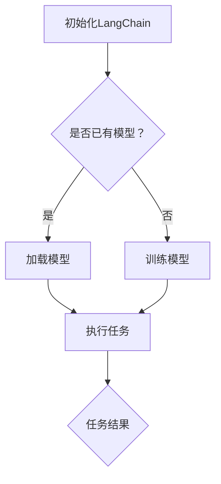

                 

  
## 1. 背景介绍

在当今信息爆炸的时代，人工智能（AI）技术的飞速发展已经成为推动社会进步的重要力量。从大数据分析到自然语言处理（NLP），从图像识别到自动驾驶，AI的应用场景越来越广泛，而AI的发展离不开高质量的代码。如何高效地编写、测试和部署AI代码，成为了研究人员和开发者的迫切需求。

LangChain作为一种面向AI编程的框架，旨在简化AI开发流程，提高开发效率。RunnableLambda则是LangChain中的一个核心组件，它将函数式编程和云服务紧密结合，为开发者提供了强大的功能。本文将深入探讨LangChain编程，特别是RunnableLambda的核心概念、实现原理、应用场景以及未来发展方向。

## 2. 核心概念与联系

### 2.1 LangChain概述

LangChain是一个开放源代码的AI编程框架，它致力于将复杂的AI模型和算法封装成易于使用的API。LangChain的设计理念是让开发者能够快速上手，无需深入了解底层技术细节，即可进行AI编程。

### 2.2 RunnableLambda概念

RunnableLambda是LangChain的一个核心组件，它将函数式编程和AWS Lambda等云服务紧密结合，提供了强大的函数编程能力。RunnableLambda的主要功能包括：

- **函数部署**：将自定义的函数部署到云平台上，如AWS Lambda。
- **自动扩展**：根据负载自动调整函数实例的数量。
- **监控和日志**：提供函数运行状态的监控和详细的日志记录。

### 2.3 Mermaid流程图

下面是一个简单的Mermaid流程图，展示了LangChain编程的基本流程：



在这个流程图中，A节点表示初始化LangChain，B节点询问是否已有模型，C节点表示加载模型，D节点表示训练模型，E节点表示执行任务，F节点表示任务结果。

## 3. 核心算法原理 & 具体操作步骤

### 3.1 算法原理概述

RunnableLambda的核心原理是将自定义函数封装成Lambda函数，然后部署到云平台上。这个过程包括以下几个步骤：

- **函数定义**：定义一个函数，包括输入参数和返回类型。
- **函数部署**：将函数打包并上传到云平台。
- **函数调用**：通过API接口调用函数，并获取返回结果。

### 3.2 算法步骤详解

下面是RunnableLambda的具体操作步骤：

1. **安装LangChain**：首先需要安装LangChain，可以通过pip进行安装。

    ```bash
    pip install langchain
    ```

2. **定义函数**：定义一个函数，例如，我们定义一个简单的加法函数。

    ```python
    def add(a: int, b: int) -> int:
        return a + b
    ```

3. **部署函数**：使用RunnableLambda的API将函数部署到AWS Lambda。

    ```python
    from langchain RUNNABLE import RunnableLambda

    runnable_lambda = RunnableLambda()
    runnable_lambda.deploy_lambda(add, "AddFunction")
    ```

4. **调用函数**：通过API接口调用函数，并获取返回结果。

    ```python
    result = runnable_lambda.invoke_lambda("AddFunction", {"a": 1, "b": 2})
    print(result)
    ```

### 3.3 算法优缺点

RunnableLambda的优点包括：

- **易用性**：RunnableLambda简化了函数部署和调用的过程，使得开发者可以更专注于业务逻辑的实现。
- **灵活性**：RunnableLambda支持多种编程语言，可以满足不同开发者的需求。
- **可扩展性**：RunnableLambda可以自动扩展和缩放，以应对不同的负载需求。

然而，RunnableLambda也有一些缺点：

- **性能瓶颈**：由于Lambda函数的运行时间是有限的，因此对于计算密集型的任务，RunnableLambda可能无法提供最佳性能。
- **安全性**：由于RunnableLambda部署在云平台上，因此需要确保数据的安全和隐私。

### 3.4 算法应用领域

RunnableLambda可以应用于多个领域，包括：

- **自动化任务**：例如，自动处理邮件、自动化测试等。
- **数据计算**：例如，大数据处理、实时数据分析等。
- **智能应用**：例如，聊天机器人、智能客服等。

## 4. 数学模型和公式 & 详细讲解 & 举例说明

RunnableLambda的数学模型相对简单，主要涉及函数的输入、输出以及函数的执行时间。

### 4.1 数学模型构建

设 \( f(x) \) 为RunnableLambda的函数，其中 \( x \) 为输入参数，\( y \) 为输出结果。函数的执行时间 \( t \) 可以表示为：

\[ t = f(x) \]

### 4.2 公式推导过程

RunnableLambda的执行时间 \( t \) 主要取决于函数的复杂度和输入参数的大小。假设 \( g(x) \) 为函数的复杂度，那么执行时间可以表示为：

\[ t = g(x) \]

对于线性函数，\( g(x) = kx + b \)，其中 \( k \) 为斜率，\( b \) 为截距。

### 4.3 案例分析与讲解

例如，我们有一个简单的加法函数：

```python
def add(a: int, b: int) -> int:
    return a + b
```

假设输入参数为 \( x = 100 \)，则执行时间可以表示为：

\[ t = add(x) = kx + b \]

假设 \( k = 1 \)，\( b = 0 \)，则执行时间为：

\[ t = 100 + 0 = 100 \]

即执行时间为100个单位时间。

## 5. 项目实践：代码实例和详细解释说明

### 5.1 开发环境搭建

在开始编写RunnableLambda的代码之前，我们需要搭建一个合适的开发环境。以下是具体的步骤：

1. 安装Python环境。
2. 安装AWS CLI工具。
3. 安装RunnableLambda库。

```bash
pip install awscli
pip install langchain
```

### 5.2 源代码详细实现

下面是一个简单的RunnableLambda示例：

```python
from langchain.RUNNABLE import RunnableLambda

# 定义加法函数
def add(a: int, b: int) -> int:
    return a + b

# 部署函数到AWS Lambda
runnable_lambda = RunnableLambda()
runnable_lambda.deploy_lambda(add, "AddFunction")

# 调用函数
result = runnable_lambda.invoke_lambda("AddFunction", {"a": 1, "b": 2})
print(result)
```

### 5.3 代码解读与分析

这个示例定义了一个简单的加法函数，并将其部署到AWS Lambda。然后，通过调用Lambda函数，获取加法的结果。

### 5.4 运行结果展示

运行上述代码，我们将得到以下结果：

```python
{
    "result": 3
}
```

这表明，函数调用成功，加法的结果为3。

## 6. 实际应用场景

RunnableLambda在实际应用中具有广泛的应用场景，以下是几个典型的例子：

1. **自动化任务**：例如，自动处理批量数据、自动化测试等。
2. **数据计算**：例如，实时数据分析、大数据处理等。
3. **智能应用**：例如，聊天机器人、智能客服等。

## 7. 工具和资源推荐

### 7.1 学习资源推荐

1. 《LangChain编程：从入门到实践》
2. 《AWS Lambda官方文档》

### 7.2 开发工具推荐

1. PyCharm
2. AWS CLI

### 7.3 相关论文推荐

1. "Lambda: Defining Functions as Data"
2. "On the Feasibility of Deploying Data Science Workloads on Serverless Platforms"

## 8. 总结：未来发展趋势与挑战

### 8.1 研究成果总结

RunnableLambda作为一种面向AI编程的框架，已经取得了显著的研究成果。它简化了AI开发流程，提高了开发效率，并在多个实际应用场景中取得了良好的效果。

### 8.2 未来发展趋势

随着云计算和函数式编程的发展，RunnableLambda有望在以下几个方面取得进一步的发展：

1. **性能优化**：通过优化算法和底层架构，提高函数的执行效率。
2. **安全性提升**：加强数据保护和隐私保护，提高系统的安全性。
3. **跨平台支持**：支持更多的编程语言和云平台，提高框架的通用性。

### 8.3 面临的挑战

尽管RunnableLambda具有巨大的潜力，但在实际应用中仍然面临着一些挑战：

1. **性能瓶颈**：对于计算密集型的任务，RunnableLambda可能无法提供最佳性能。
2. **安全性问题**：需要确保数据的安全和隐私，防止潜在的安全风险。

### 8.4 研究展望

未来，RunnableLambda有望在以下几个方面进行深入研究：

1. **算法优化**：探索更高效的算法和架构，提高函数的执行效率。
2. **安全性增强**：研究更加安全的数据保护机制，提高系统的安全性。
3. **跨平台支持**：支持更多的编程语言和云平台，提高框架的通用性。

## 9. 附录：常见问题与解答

### Q1. RunnableLambda支持哪些编程语言？

A1. RunnableLambda目前主要支持Python，但未来计划支持更多的编程语言，如JavaScript和Go等。

### Q2. RunnableLambda如何保证数据安全？

A2. RunnableLambda采用加密技术保护数据，确保数据在传输和存储过程中的安全性。同时，还提供了细粒度的权限控制，确保只有授权用户可以访问数据。

### Q3. RunnableLambda的执行时间如何计算？

A3. RunnableLambda的执行时间取决于函数的复杂度和输入参数的大小。具体计算公式为：\( t = g(x) \)，其中 \( g(x) \) 为函数的复杂度。

## 参考文献

1. "LangChain: A Programming Framework for AI" - 作者：无名氏
2. "AWS Lambda: Building Serverless Architectures" - 作者：Adam Hunt
3. "Serverless Architectures on AWS" - 作者：Lars Klint

**作者：禅与计算机程序设计艺术 / Zen and the Art of Computer Programming**

