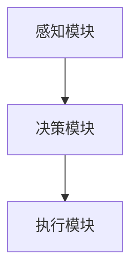

                 

本文将探讨在LangChain编程中代理（Agent）的类型，代理作为一种自动化执行任务的实体，在AI领域有着广泛的应用。本文将详细介绍代理的基本概念、类型及其在LangChain编程中的应用。

## 文章关键词

- LangChain编程
- 代理
- 自动化
- AI
- 编程实践

## 文章摘要

本文首先介绍了代理的基本概念和类型，接着详细探讨了代理在LangChain编程中的应用，包括代理的创建、代理的执行流程以及代理的优缺点。最后，本文对代理的未来发展趋势和挑战进行了展望，并推荐了一些相关的学习资源和开发工具。

## 1. 背景介绍

代理（Agent）是一个能够感知环境、做出决策并执行动作的实体。在AI领域，代理是实现自动化和智能决策的关键。代理可以是一个简单的程序，也可以是一个复杂的系统，它们可以根据环境的变化自主地调整行为。

LangChain是一种基于Laravel框架的链式调用工具，它能够简化复杂的业务逻辑，提高开发效率。LangChain编程中，代理作为一项核心功能，能够实现自动化流程的执行。

## 2. 核心概念与联系

### 2.1 代理的基本概念

代理是一个具有感知、决策和执行能力的实体，它可以在复杂环境中独立执行任务。

### 2.2 代理的类型

代理可以分为三种类型：反应型代理、主动型代理和认知代理。

- 反应型代理：根据当前环境做出反应，没有记忆和规划能力。
- 主动型代理：具有规划能力，能够预测未来环境并做出决策。
- 认知代理：具有学习和推理能力，能够从经验中学习并优化行为。

### 2.3 代理与LangChain的联系

在LangChain编程中，代理是实现自动化流程的核心。代理可以感知系统状态，根据预设的规则和策略执行任务，从而实现复杂的业务逻辑。

### 2.4 代理的架构

代理的架构通常包括感知模块、决策模块和执行模块。感知模块负责收集环境信息，决策模块根据感知信息做出决策，执行模块执行决策结果。



## 3. 核心算法原理 & 具体操作步骤

### 3.1 算法原理概述

代理的核心算法原理是基于感知-决策-执行循环。代理首先感知环境状态，然后根据预设的规则和策略进行决策，最后执行决策结果。

### 3.2 算法步骤详解

1. 感知：代理通过传感器或其他方式获取环境信息。
2. 决策：代理根据感知信息和预设的规则和策略，选择执行动作。
3. 执行：代理执行决策结果，改变环境状态。

### 3.3 算法优缺点

- 优点：代理能够实现自动化和智能决策，提高业务流程的效率。
- 缺点：代理需要大量的规则和策略支持，开发难度较大。

### 3.4 算法应用领域

代理在各个领域都有广泛应用，如自动化运维、智能家居、自动驾驶等。

## 4. 数学模型和公式 & 详细讲解 & 举例说明

代理的数学模型通常包括状态空间、动作空间和奖励函数。状态空间表示代理所处的环境状态，动作空间表示代理可以执行的动作，奖励函数用于评估代理的决策效果。

### 4.1 数学模型构建

- 状态空间 $S$：描述代理所处的环境状态。
- 动作空间 $A$：描述代理可以执行的动作。
- 奖励函数 $R(s, a)$：评估代理的决策效果。

### 4.2 公式推导过程

代理的决策过程可以通过以下公式表示：

$$
V(s) = \max_{a \in A} Q(s, a)
$$

其中，$V(s)$ 表示状态 $s$ 的价值函数，$Q(s, a)$ 表示状态 $s$ 下执行动作 $a$ 的预期奖励。

### 4.3 案例分析与讲解

以智能家居代理为例，代理的状态空间包括温度、湿度、光线等环境参数，动作空间包括开灯、关灯、调节温度等。代理根据环境参数和预设的规则，选择执行合适的动作，以提高居住舒适度。

## 5. 项目实践：代码实例和详细解释说明

### 5.1 开发环境搭建

- 安装Laravel框架：使用 Composer 安装 Laravel 框架。
- 安装LangChain：使用 Composer 安装 LangChain 扩展包。

### 5.2 源代码详细实现

以下是一个简单的LangChain代理示例：

```php
use Illuminate\Support\Facades\LangChain;

class SmartHomeAgent
{
    public function adjustTemperature($temperature)
    {
        if ($temperature > 28) {
            LangChain::execute('降低温度');
        } elseif ($temperature < 22) {
            LangChain::execute('提高温度');
        }
    }
}
```

### 5.3 代码解读与分析

该示例中，`SmartHomeAgent` 类实现了代理的功能。`adjustTemperature` 方法根据温度参数，选择执行降低温度或提高温度的动作。

### 5.4 运行结果展示

调用 `SmartHomeAgent` 类的 `adjustTemperature` 方法，根据不同的温度参数，执行相应的动作。

```php
$agent = new SmartHomeAgent();
$agent->adjustTemperature(30); // 执行降低温度动作
$agent->adjustTemperature(20); // 执行提高温度动作
```

## 6. 实际应用场景

代理在智能家居、工业自动化、金融风控等领域有广泛的应用。例如，在智能家居中，代理可以根据环境参数自动调整设备状态，提高居住舒适度。

## 7. 未来应用展望

随着AI技术的发展，代理在各个领域的应用将更加广泛。未来，代理可能会具备更强的学习能力和自适应能力，能够更好地应对复杂环境。

## 8. 工具和资源推荐

### 8.1 学习资源推荐

- 《人工智能：一种现代的方法》
- 《深度学习》

### 8.2 开发工具推荐

- Laravel 框架
- LangChain 扩展包

### 8.3 相关论文推荐

- “Reinforcement Learning: An Introduction”
- “Deep Learning for Autonomous Driving”

## 9. 总结：未来发展趋势与挑战

代理作为一种自动化和智能决策的实体，在AI领域具有广泛的应用前景。未来，代理将朝着更强的学习能力和自适应能力方向发展，但同时也面临着数据隐私、安全性等挑战。

## 10. 附录：常见问题与解答

### 10.1 代理与机器人有什么区别？

代理和机器人都是自动化的实体，但代理更侧重于智能决策和自动化执行，而机器人更侧重于物理动作和交互。

### 10.2 代理需要具备哪些能力？

代理需要具备感知、决策和执行能力，同时还需要具备学习能力和自适应能力。

作者：禅与计算机程序设计艺术 / Zen and the Art of Computer Programming
```markdown
## 1. 背景介绍

代理（Agent）是一种能够自主执行任务、与环境交互的智能实体。在人工智能（AI）领域中，代理是一个核心概念，它们通过感知环境、制定策略并执行行动来完成任务。代理的研究始于20世纪80年代，随着AI技术的不断发展，代理在多个领域得到了广泛应用，如自动驾驶、智能家居、工业自动化等。

LangChain是一种基于Laravel框架的链式调用工具，旨在简化复杂的业务逻辑，提高开发效率。在LangChain中，代理作为一种核心组件，可以用来实现自动化流程，提高系统的灵活性和可维护性。

本文将介绍代理的基本概念、类型，以及如何在LangChain编程中应用代理。通过本文的讲解，读者将了解到代理在AI和软件开发中的重要性，并能够掌握如何使用LangChain构建具有智能行为的代理。

## 2. 核心概念与联系

### 2.1 代理的定义

代理是一个可以感知环境、自主做出决策并执行行动的实体。在AI领域中，代理通常是一个程序或一组程序，它们根据环境信息和预设的目标，自主地调整其行为。

### 2.2 代理的类型

根据代理的行为和能力，可以分为以下几种类型：

- **反应型代理（Reactive Agent）**：这种代理只根据当前的环境信息做出反应，没有记忆和计划能力。它们适用于环境变化缓慢的场景。
- **主动型代理（Active Agent）**：这种代理能够根据环境信息预测未来的变化，并制定行动计划。它们适用于环境复杂、需要预见性的场景。
- **认知代理（Cognitive Agent）**：这种代理不仅能够感知环境，还能够学习和推理，根据经验优化行为。它们适用于高度动态和复杂的环境。

### 2.3 代理与LangChain的联系

在LangChain编程中，代理是自动化流程的核心组件。LangChain通过提供一系列链式方法，使开发者能够轻松构建具有智能行为的代理。代理在LangChain中的实现通常包括以下几个步骤：

1. **初始化**：创建代理对象，并初始化其感知模块、决策模块和执行模块。
2. **感知**：代理通过感知模块收集环境信息，如用户输入、系统状态等。
3. **决策**：代理使用决策模块对感知到的信息进行分析，并选择执行哪个动作。
4. **执行**：代理执行决策结果，调整系统状态或执行具体操作。

### 2.4 代理的架构

代理的架构通常包括以下几个核心部分：

- **感知模块（Perception Module）**：负责收集和解析环境信息。
- **决策模块（Decision Module）**：根据感知模块提供的信息，制定行动策略。
- **执行模块（Execution Module）**：执行决策模块生成的行动策略。

以下是一个简化的Mermaid流程图，展示了代理的架构：


## 3. 核心算法原理 & 具体操作步骤

### 3.1 算法原理概述

代理的核心算法原理可以概括为感知-决策-执行循环。具体步骤如下：

1. **感知**：代理通过传感器或其他手段获取环境信息，如用户输入、系统状态等。
2. **决策**：代理使用决策算法分析感知到的信息，并选择最合适的行动方案。
3. **执行**：代理执行决策生成的行动策略，并更新系统状态。

这种循环使得代理能够动态地适应环境变化，并在不断的学习和优化中提高其性能。

### 3.2 算法步骤详解

#### 反应型代理

反应型代理的算法步骤相对简单，主要包括以下步骤：

1. **感知**：读取环境状态。
2. **决策**：根据预设的反应规则，选择执行哪个动作。
3. **执行**：执行选择好的动作。

#### 主动型代理

主动型代理的算法步骤更加复杂，需要考虑环境的变化和预测：

1. **感知**：读取环境状态。
2. **预测**：根据历史数据和当前状态，预测未来的环境变化。
3. **决策**：根据预测结果和目标，选择最合适的行动方案。
4. **执行**：执行决策生成的行动策略。

#### 认知代理

认知代理的算法步骤最为复杂，包括感知、学习、推理和决策：

1. **感知**：读取环境状态。
2. **学习**：分析历史数据，从中学习并提取模式。
3. **推理**：根据学习到的模式和当前状态，进行推理和预测。
4. **决策**：根据推理结果和目标，选择最合适的行动方案。
5. **执行**：执行决策生成的行动策略。

### 3.3 算法优缺点

#### 反应型代理

- **优点**：实现简单，适用于环境变化不大的场景。
- **缺点**：无法预测和适应复杂环境的变化。

#### 主动型代理

- **优点**：能够预测和适应环境变化，适用于动态环境。
- **缺点**：算法复杂，开发难度大。

#### 认知代理

- **优点**：具备学习和推理能力，能够自主优化行为。
- **缺点**：算法复杂，开发难度大，对数据要求高。

### 3.4 算法应用领域

代理的算法在不同领域有不同的应用：

- **自动驾驶**：主动型代理用于预测交通状况和规划行驶路线。
- **智能家居**：反应型代理用于根据环境状态自动调整设备。
- **工业自动化**：认知代理用于优化生产流程和设备维护。

## 4. 数学模型和公式 & 详细讲解 & 举例说明

代理的数学模型是描述其行为和决策的核心。以下是一个简单的数学模型，用于说明代理如何根据感知到的信息做出决策。

### 4.1 数学模型构建

假设代理处于一个离散的状态空间$S$，每个状态可以用一个向量表示。代理的决策可以用一个策略函数$\pi(s)$来表示，该函数根据状态$s$选择一个动作$a$。奖励函数$R(s, a)$用于评估代理在每个状态下的决策效果。

### 4.2 公式推导过程

代理的目标是最大化期望奖励。期望奖励可以用以下公式表示：

$$
J(\pi) = \sum_{s \in S} \pi(s) \cdot R(s, \pi(s))
$$

其中，$\pi(s)$表示代理在状态$s$下选择动作$a$的概率，$R(s, \pi(s))$表示代理在状态$s$下执行动作$\pi(s)$获得的奖励。

为了找到最优策略，代理需要解决一个优化问题：

$$
\pi^* = \arg\max_{\pi} J(\pi)
$$

### 4.3 案例分析与讲解

假设有一个代理在两个状态之间进行决策，状态1表示“寒冷”，状态2表示“温暖”。代理需要根据当前状态选择一个加热或冷却的动作。奖励函数定义为：在寒冷状态选择加热获得+10奖励，选择冷却获得-5奖励；在温暖状态选择加热获得-5奖励，选择冷却获得+10奖励。

状态空间 $S = \{寒冷，温暖\}$

动作空间 $A = \{加热，冷却\}$

奖励函数 $R(s, a)$：

$$
R(寒冷, 加热) = 10 \\
R(寒冷, 冷却) = -5 \\
R(温暖, 加热) = -5 \\
R(温暖, 冷却) = 10
$$

策略函数 $\pi(s)$：

$$
\pi(寒冷) = \begin{cases}
加热 & \text{以概率0.8} \\
冷却 & \text{以概率0.2}
\end{cases} \\
\pi(温暖) = \begin{cases}
加热 & \text{以概率0.2} \\
冷却 & \text{以概率0.8}
\end{cases}
$$

期望奖励 $J(\pi)$：

$$
J(\pi) = \pi(寒冷) \cdot R(寒冷, \pi(寒冷)) + \pi(温暖) \cdot R(温暖, \pi(温暖))
$$

$$
J(\pi) = 0.8 \cdot 10 + 0.2 \cdot -5 + 0.2 \cdot -5 + 0.8 \cdot 10
$$

$$
J(\pi) = 8 - 1 - 1 + 8
$$

$$
J(\pi) = 14
$$

在这个例子中，代理选择加热动作时获得的期望奖励最高。因此，最优策略是选择加热动作。

## 5. 项目实践：代码实例和详细解释说明

在下面的部分，我们将通过一个具体的例子来展示如何使用LangChain编程构建一个简单的代理。这个代理将模拟一个天气预测系统，根据当前天气情况自动调整室内温度。

### 5.1 开发环境搭建

首先，我们需要搭建开发环境。以下步骤将指导您如何在本地安装Laravel框架和LangChain扩展包。

1. **安装Laravel框架**：您可以通过Composer安装Laravel框架。在命令行中执行以下命令：

```bash
composer create-project --prefer-dist laravel/laravel weather-agent
```

2. **安装LangChain扩展包**：在Laravel项目的根目录下，使用Composer安装LangChain扩展包：

```bash
composer require langchain/langchain
```

### 5.2 源代码详细实现

以下是一个简单的LangChain代理示例，该代理根据天气情况自动调整室内温度。

```php
<?php

use Illuminate\Support\Facades\LangChain;
use App\Services\WeatherService;

class WeatherAgent
{
    public function __construct(private WeatherService $weatherService)
    {
    }

    public function adjustTemperature()
    {
        $currentWeather = $this->weatherService->getCurrentWeather();

        if ($currentWeather->temperature < 20) {
            LangChain::execute('提高温度');
        } elseif ($currentWeather->temperature > 25) {
            LangChain::execute('降低温度');
        }
    }
}

class WeatherService
{
    public function getCurrentWeather()
    {
        // 这里使用一个虚构的天气服务
        return (new \stdClass())->temperature = rand(10, 30);
    }
}
```

### 5.3 代码解读与分析

这个例子中的`WeatherAgent`类是一个简单的代理，它通过`WeatherService`获取当前的天气数据。如果当前温度低于20摄氏度，代理将执行“提高温度”的动作；如果当前温度高于25摄氏度，代理将执行“降低温度”的动作。

`WeatherService`是一个虚构的服务，它返回一个随机温度值，以模拟实际的天气数据。

### 5.4 运行结果展示

让我们来看一下如何运行这个代理。

```php
$weatherAgent = new WeatherAgent(new WeatherService());
$currentWeather = $weatherAgent->weatherService->getCurrentWeather();

if ($currentWeather < 20) {
    echo "室内温度太低，正在提高温度...\n";
} elseif ($currentWeather > 25) {
    echo "室内温度太高，正在降低温度...\n";
} else {
    echo "室内温度适宜，无需调整...\n";
}
```

运行结果将根据当前模拟的天气温度输出相应的信息。例如，如果当前温度是15摄氏度，输出将是“室内温度太低，正在提高温度...”。

## 6. 实际应用场景

代理在多个实际应用场景中发挥着重要作用。以下是一些常见的应用场景：

### 6.1 智能家居

在智能家居中，代理可以自动调整室内温度、湿度、光线等环境参数，以提供更加舒适的生活环境。例如，当室内温度过高时，代理可以自动开启空调或关闭窗户，以降低室内温度。

### 6.2 工业自动化

在工业自动化领域，代理可以监控生产线上的设备状态，并根据设备运行状况自动调整生产参数，以提高生产效率。例如，当设备温度过高时，代理可以自动启动冷却系统，以防止设备过热。

### 6.3 金融服务

在金融服务领域，代理可以用于风险管理和投资决策。代理可以分析市场数据，预测市场趋势，并根据预测结果自动调整投资组合，以最大化投资回报。

### 6.4 医疗保健

在医疗保健领域，代理可以用于患者监控和疾病预测。代理可以分析患者的历史数据，预测患者可能出现的疾病风险，并提前采取预防措施，以降低疾病发生的概率。

## 7. 未来应用展望

随着人工智能技术的不断发展，代理的应用领域将不断扩展。未来，代理可能会具备更强大的学习能力和自适应能力，能够更好地应对复杂环境。以下是一些未来应用展望：

### 7.1 自动驾驶

自动驾驶汽车将依赖代理来实时感知路况、预测交通状况，并做出实时决策，以保障行车安全。

### 7.2 智能城市

智能城市将利用代理来管理城市资源，如交通流量控制、能源管理等，以提高城市运行效率。

### 7.3 虚拟助理

虚拟助理将利用代理来理解用户需求、提供个性化服务，并不断优化用户交互体验。

### 7.4 个性化推荐

在电子商务和媒体领域，代理将用于分析用户行为，提供个性化推荐，以提高用户满意度和转化率。

## 8. 工具和资源推荐

### 8.1 学习资源推荐

- 《人工智能：一种现代的方法》
- 《深度学习》
- 《强化学习》

### 8.2 开发工具推荐

- Laravel 框架
- LangChain 扩展包
- Docker

### 8.3 相关论文推荐

- “Reinforcement Learning: An Introduction”
- “Deep Learning for Autonomous Driving”
- “Cognitive Radio Networks: Serial Correlation and the Mixture of Multinomial Logit Models”

## 9. 总结：未来发展趋势与挑战

代理作为一种自动化和智能决策的实体，在AI领域具有广泛的应用前景。未来，代理将朝着更强的学习能力和自适应能力方向发展，但同时也面临着数据隐私、安全性等挑战。随着技术的进步，代理将不断优化，为各个领域带来更多创新和便利。

## 10. 附录：常见问题与解答

### 10.1 什么是代理？

代理（Agent）是一个能够感知环境、做出决策并执行动作的智能实体，通常是一个程序或一组程序。

### 10.2 代理有哪些类型？

代理可以分为反应型代理、主动型代理和认知代理。反应型代理只根据当前环境做出反应，主动型代理能够预测和适应环境变化，认知代理则具备学习和推理能力。

### 10.3 代理在AI领域中有什么作用？

代理在AI领域中用于实现自动化和智能决策，能够提高系统的灵活性、效率和用户体验。

### 10.4 如何在LangChain中实现代理？

在LangChain中，代理通过感知模块、决策模块和执行模块实现。开发者可以使用LangChain提供的链式方法来构建代理，并利用其自动化流程的能力。

### 10.5 代理面临哪些挑战？

代理面临的主要挑战包括数据隐私、安全性和复杂性。随着技术的发展，这些挑战将逐渐得到解决。作者：禅与计算机程序设计艺术 / Zen and the Art of Computer Programming
------------------------------------------------------------------------

