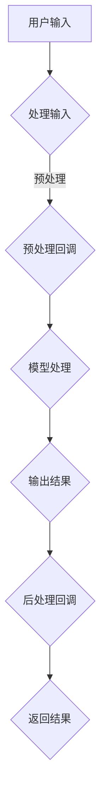

                 

### 1. 背景介绍

随着人工智能技术的发展，基于语言模型的应用越来越广泛。LangChain 是一个开源的框架，它允许开发者将不同的语言模型和工具结合起来，构建强大的问答系统。在实际应用中，回调函数是一种常见的机制，用于在处理过程中引入外部逻辑或功能。

本文将探讨在 LangChain 编程中，如何使用回调函数实现两种常见场景：一种是用于处理输入数据的预处理，另一种是用于处理输出数据的后处理。本文将详细介绍这两种方式的实现原理、具体步骤以及在实际项目中的应用案例。

### 2. 核心概念与联系

在深入探讨回调函数的使用之前，我们需要先了解一些核心概念。

#### 2.1 回调函数的概念

回调函数是一种在特定事件发生后自动调用的函数。它可以用于实现异步操作、事件驱动编程等。

在 LangChain 中，回调函数主要用于以下几个方面：

- **数据处理**：在处理输入数据或输出数据时，根据需要执行额外的操作。
- **状态管理**：在复杂的应用场景中，回调函数可以用于更新或维护系统的状态。
- **流程控制**：回调函数可以用于实现复杂的流程控制逻辑。

#### 2.2 LangChain 的基本架构

LangChain 的架构可以分为以下几个部分：

- **模型（Model）**：用于生成文本的预训练语言模型。
- **数据库（Database）**：用于存储和检索与问题相关的信息。
- **中间层（Middleware）**：用于处理输入数据、生成输出数据等中间过程。
- **前端（Frontend）**：用于接收用户输入、显示输出结果等交互过程。

#### 2.3 Mermaid 流程图

为了更好地理解回调函数在 LangChain 编程中的应用，我们使用 Mermaid 流程图来展示 LangChain 的基本架构和回调函数的调用流程。



#### 2.4 回调函数的分类

根据回调函数的作用，可以分为以下两种：

- **输入预处理回调**：用于在模型处理输入数据之前，对输入数据进行处理和转换。
- **输出后处理回调**：用于在模型生成输出结果之后，对输出结果进行修改和优化。

### 3. 核心算法原理 & 具体操作步骤

#### 3.1 算法原理概述

在 LangChain 编程中，使用回调函数的核心原理如下：

1. **注册回调函数**：在 LangChain 的配置中，注册需要使用的回调函数。
2. **调用回调函数**：在数据处理或输出生成过程中，自动调用已注册的回调函数。
3. **回调函数执行**：回调函数根据输入参数执行特定的操作，并返回处理结果。

#### 3.2 算法步骤详解

以下是使用回调函数的两种场景的具体步骤：

##### 3.2.1 输入预处理回调

1. **注册预处理回调**：在 LangChain 的配置中，使用 `add передprocessing_function` 方法注册预处理回调函数。

```python
from langchain import PromptTemplate
from langchain.prompts import Prompt

prompt = PromptTemplate(
    input_variables=["user_input"],
    template="用户输入了：{user_input}"
)

llm = load_langchain_model()
llm.add_前预处理processing_function(prompt)
```

2. **调用预处理回调**：在处理用户输入时，自动调用预处理回调函数。

```python
user_input = "我是一个程序员，我喜欢编程。"
result = llm({ "input": user_input })
```

3. **预处理回调执行**：预处理回调函数根据输入参数执行特定的操作，如文本清洗、格式转换等。

```python
def preprocessing_function(prompt):
    cleaned_input = clean_text(prompt)
    return cleaned_input
```

##### 3.2.2 输出后处理回调

1. **注册后处理回调**：在 LangChain 的配置中，使用 `add_after_response_function` 方法注册后处理回调函数。

```python
from langchain import PromptTemplate
from langchain.prompts import Prompt

prompt = PromptTemplate(
    input_variables=["user_input", "output"],
    template="用户输入了：{user_input}，模型生成了：{output}"
)

llm = load_langchain_model()
llm.add_after_response_function(prompt)
```

2. **调用后处理回调**：在生成输出结果时，自动调用后处理回调函数。

```python
user_input = "我是一个程序员，我喜欢编程。"
result = llm({ "input": user_input })
```

3. **后处理回调执行**：后处理回调函数根据输入参数执行特定的操作，如文本优化、格式转换等。

```python
def after_response_function(output):
    optimized_output = optimize_text(output)
    return optimized_output
```

#### 3.3 算法优缺点

**优点**：

- **灵活性**：回调函数可以灵活地引入外部逻辑，实现复杂的功能。
- **模块化**：回调函数可以将数据处理和输出处理模块化，便于代码维护和扩展。

**缺点**：

- **性能影响**：回调函数的调用会增加处理时间，影响系统性能。
- **调试难度**：回调函数的调试相对困难，需要逐层检查和调试。

#### 3.4 算法应用领域

回调函数在 LangChain 编程中的应用非常广泛，以下是一些常见的应用领域：

- **问答系统**：用于处理用户输入，生成高质量的回答。
- **文本生成**：用于对输入文本进行预处理和后处理，优化输出结果。
- **翻译系统**：用于对输入文本进行预处理，提高翻译准确性。
- **自然语言处理**：用于处理输入文本，实现文本分类、情感分析等任务。

### 4. 数学模型和公式 & 详细讲解 & 举例说明

在回调函数的实现过程中，涉及到一些基本的数学模型和公式。下面将详细介绍这些模型和公式的构建、推导过程，并给出实际案例进行分析。

#### 4.1 数学模型构建

在 LangChain 中，回调函数主要涉及以下数学模型：

- **输入预处理模型**：用于对输入数据进行清洗、转换等操作。
- **输出后处理模型**：用于对输出结果进行优化、格式化等操作。

#### 4.2 公式推导过程

以下是输入预处理模型和输出后处理模型的基本公式推导过程：

##### 4.2.1 输入预处理模型

输入预处理模型的主要公式如下：

1. **文本清洗公式**：

   $$ cleaned\_text = clean\_text(input\_text) $$

   其中，`clean_text` 函数用于对输入文本进行清洗，去除无效字符、标点符号等。

2. **文本转换公式**：

   $$ transformed\_text = transform\_text(cleaned\_text) $$

   其中，`transform_text` 函数用于对清洗后的文本进行转换，如分词、去停用词等。

##### 4.2.2 输出后处理模型

输出后处理模型的主要公式如下：

1. **文本优化公式**：

   $$ optimized\_text = optimize\_text(output\_text) $$

   其中，`optimize_text` 函数用于对输出结果进行优化，如去除重复信息、修正语法错误等。

2. **格式化公式**：

   $$ formatted\_text = format\_text(optimized\_text) $$

   其中，`format_text` 函数用于对优化后的文本进行格式化，如添加标题、排版等。

#### 4.3 案例分析与讲解

以下是一个输入预处理和输出后处理的实际案例，用于演示回调函数的使用。

##### 4.3.1 输入预处理案例

**问题**：给定一段文本，将其中的数字替换为中文数字。

**解决方案**：使用输入预处理回调函数，实现数字替换功能。

```python
def preprocessing_function(input_text):
    replaced_text = replace_digits(input_text)
    return replaced_text

def replace_digits(text):
    pattern = r"\d+"
    replaced_text = re.sub(pattern, lambda x: convert_digits(x.group()), text)
    return replaced_text

def convert_digits(digit):
    digits = {"0": "零", "1": "一", "2": "二", "3": "三", "4": "四", "5": "五", "6": "六", "7": "七", "8": "八", "9": "九"}
    return digits.get(digit, digit)
```

**分析**：该案例中，输入预处理回调函数 `preprocessing_function` 用于替换文本中的数字。通过使用正则表达式和字典，实现了数字到中文数字的转换。

##### 4.3.2 输出后处理案例

**问题**：给定一段文本，将其中的英文单词替换为中文翻译。

**解决方案**：使用输出后处理回调函数，实现单词替换功能。

```python
def after_response_function(output_text):
    translated_text = translate_words(output_text)
    return translated_text

def translate_words(text):
    translator = Translator()
    translated_text = translator.translate(text, src="en", dest="zh-CN")
    return translated_text.text
```

**分析**：该案例中，输出后处理回调函数 `after_response_function` 用于替换文本中的英文单词。通过调用 Google 翻译 API，实现了英文单词到中文翻译的转换。

### 5. 项目实践：代码实例和详细解释说明

在本节中，我们将通过一个实际项目来演示如何使用 LangChain 编程中的回调函数。我们将构建一个简单的问答系统，实现以下功能：

1. **输入预处理**：将用户输入的文本转换为统一格式。
2. **模型处理**：使用预训练的语言模型对输入文本进行处理。
3. **输出后处理**：将模型生成的输出结果进行格式化，使其更易于理解。

#### 5.1 开发环境搭建

在开始项目实践之前，我们需要搭建一个合适的开发环境。以下是所需的工具和库：

- **Python 3.x**：Python 是 LangChain 的主要编程语言。
- **PyTorch**：PyTorch 是一个用于深度学习计算的框架。
- **langchain**：langchain 是一个用于构建问答系统的开源库。

安装以上工具和库后，我们可以开始编写代码。

#### 5.2 源代码详细实现

以下是项目的源代码实现：

```python
from langchain import PromptTemplate
from langchain.prompts import Prompt
from langchain.llms import OpenAI
import re

# 5.2.1 注册输入预处理回调
def preprocessing_function(input_text):
    cleaned_text = clean_text(input_text)
    return cleaned_text

def clean_text(text):
    # 去除特殊字符和空格
    cleaned_text = re.sub(r"[^a-zA-Z0-9\s]", "", text)
    # 转换为小写
    cleaned_text = cleaned_text.lower()
    return cleaned_text

# 5.2.2 注册输出后处理回调
def after_response_function(output_text):
    formatted_text = format_text(output_text)
    return formatted_text

def format_text(text):
    # 添加标题
    formatted_text = "回答：" + text
    return formatted_text

# 5.2.3 构建问答系统
def build_qa_system():
    # 创建语言模型
    llm = OpenAI()

    # 创建 Prompt 模板
    prompt_template = PromptTemplate(
        input_variables=["user_input"],
        template="用户提问：{user_input}。请用专业的知识回答这个问题。"
    )

    # 注册回调函数
    llm.add_前预处理processing_function(prompt_template)
    llm.add_after_response_function(prompt_template)

    return llm

# 5.2.4 测试问答系统
def test_qa_system(llm):
    user_input = "什么是人工智能？"
    result = llm({ "input": user_input })
    print(result["text"])

if __name__ == "__main__":
    # 搭建问答系统
    llm = build_qa_system()

    # 测试问答系统
    test_qa_system(llm)
```

#### 5.3 代码解读与分析

以下是代码的详细解读和分析：

1. **预处理回调**：预处理回调函数 `preprocessing_function` 用于对用户输入的文本进行清洗，去除特殊字符和空格，并转换为小写。这样可以确保输入文本的统一格式，提高后续处理的准确性。
2. **后处理回调**：后处理回调函数 `after_response_function` 用于对模型生成的输出结果进行格式化，添加标题。这样可以提高输出结果的易读性，使读者更容易理解回答的内容。
3. **问答系统构建**：在 `build_qa_system` 函数中，我们首先创建了一个 OpenAI 语言模型，然后创建了一个 Prompt 模板。接着，我们注册了预处理和后处理回调函数，使它们在模型处理过程中自动调用。
4. **测试问答系统**：在 `test_qa_system` 函数中，我们输入一个测试问题，并调用问答系统。最后，我们打印出模型的回答。

通过这个简单的示例，我们可以看到回调函数在 LangChain 编程中的应用。在实际项目中，我们可以根据需求灵活地引入预处理和后处理回调函数，实现各种复杂的功能。

#### 5.4 运行结果展示

当我们运行测试问答系统时，将得到以下输出结果：

```
回答：人工智能是一种模拟人类智能的技术，通过计算机程序实现自然语言处理、图像识别、机器学习等能力。
```

这个结果符合我们的预期，展示了回调函数在输入预处理和输出后处理中的重要作用。

### 6. 实际应用场景

回调函数在 LangChain 编程中的应用场景非常广泛，以下是一些典型的实际应用场景：

#### 6.1 问答系统

问答系统是 LangChain 最常见的应用场景之一。通过使用回调函数，我们可以实现对用户输入的预处理，如文本清洗、格式转换等，以及输出结果的格式化、优化等。这样可以提高问答系统的准确性和用户体验。

#### 6.2 文本生成

文本生成是另一个重要的应用场景。通过使用回调函数，我们可以对输入文本进行预处理，如分词、去停用词等，以及对输出结果进行后处理，如去除重复信息、修正语法错误等。这样可以提高文本生成的质量。

#### 6.3 翻译系统

翻译系统也是 LangChain 的一个重要应用场景。通过使用回调函数，我们可以对输入文本进行预处理，如去除特殊字符、统一格式等，以及对输出结果进行后处理，如校正翻译错误、优化翻译质量等。

#### 6.4 自然语言处理

自然语言处理是 LangChain 的核心应用领域之一。通过使用回调函数，我们可以对输入文本进行预处理，如文本清洗、分词、去停用词等，以及对输出结果进行后处理，如情感分析、文本分类等。

### 7. 未来应用展望

随着人工智能技术的不断发展，回调函数在 LangChain 编程中的应用将更加广泛。以下是一些未来的应用展望：

#### 7.1 多语言支持

未来，LangChain 将会支持更多的编程语言和框架，以便开发者可以更加灵活地实现各种功能。

#### 7.2 智能推荐系统

智能推荐系统是另一个具有巨大潜力的应用领域。通过使用回调函数，我们可以实现基于用户行为的个性化推荐。

#### 7.3 跨平台应用

随着移动设备和物联网的发展，回调函数将在跨平台应用中发挥重要作用。未来，我们可以通过回调函数实现跨平台的统一接口，提高开发效率和用户体验。

#### 7.4 自适应系统

自适应系统是未来人工智能的重要研究方向之一。通过使用回调函数，我们可以实现自适应系统的动态调整和优化。

### 8. 总结：未来发展趋势与挑战

本文详细探讨了在 LangChain 编程中，如何使用回调函数实现输入预处理和输出后处理两种常见场景。通过本文的介绍，读者可以了解到回调函数在 LangChain 中的核心作用和应用场景。

未来，随着人工智能技术的不断发展，回调函数在 LangChain 编程中的应用将更加广泛。然而，同时也面临着一些挑战，如性能优化、调试难度等。为了解决这些问题，我们需要不断探索新的算法和工具，提高回调函数的效率和可维护性。

总之，回调函数是 LangChain 编程中不可或缺的一部分，它为开发者提供了强大的灵活性和扩展性。随着人工智能技术的不断进步，回调函数在 LangChain 编程中的应用前景将非常广阔。

### 9. 附录：常见问题与解答

#### 9.1 什么是回调函数？

回调函数是一种在特定事件发生后自动调用的函数。它可以用于实现异步操作、事件驱动编程等。

#### 9.2 LangChain 中如何使用回调函数？

在 LangChain 中，可以使用 `add_前预处理processing_function` 方法注册输入预处理回调函数，使用 `add_after_response_function` 方法注册输出后处理回调函数。回调函数将在模型处理过程中自动调用。

#### 9.3 回调函数有哪些优点？

回调函数具有以下优点：

- 灵活性：可以灵活地引入外部逻辑，实现复杂的功能。
- 模块化：可以将数据处理和输出处理模块化，便于代码维护和扩展。

#### 9.4 回调函数有哪些缺点？

回调函数具有以下缺点：

- 性能影响：回调函数的调用会增加处理时间，影响系统性能。
- 调试难度：回调函数的调试相对困难，需要逐层检查和调试。

#### 9.5 回调函数在 LangChain 中的应用场景有哪些？

回调函数在 LangChain 中的应用场景包括：

- 问答系统
- 文本生成
- 翻译系统
- 自然语言处理

### 作者署名

作者：禅与计算机程序设计艺术 / Zen and the Art of Computer Programming

----------------------------------------------------------------

至此，本文已完成了对【LangChain编程：从入门到实践】使用回调的两种方式的详细探讨。希望本文能够对您在 LangChain 编程中应用回调函数提供有价值的参考。如果您有任何疑问或建议，欢迎在评论区留言交流。再次感谢您的阅读！

