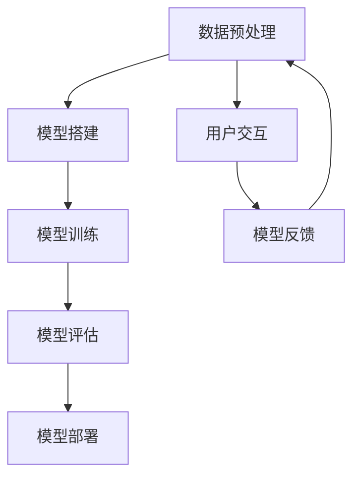

                 

## 1. 背景介绍

随着人工智能技术的飞速发展，大模型技术已经成为当今学术界和工业界研究的热点。大模型技术通过使用巨大的神经网络来学习复杂的特征，从而在许多任务上取得了突破性的进展。然而，大模型的训练和应用也面临着一系列挑战，包括计算资源的消耗、模型的可解释性以及数据处理和存储的效率等。

LangChain作为一个开源项目，旨在简化大模型的应用开发过程。它通过提供一套统一的接口和工具，使得开发者可以更加容易地搭建和部署大模型，从而推动了人工智能技术的普及和应用。本文将介绍LangChain的核心概念、工作原理、关键算法以及如何在实际项目中应用，帮助读者从入门到实践，深入了解大模型技术。

## 2. 核心概念与联系

### 2.1 大模型技术概述

大模型技术是指使用极其庞大的神经网络模型来学习数据的复杂特征。这些模型通常具有数十亿至数万亿个参数，可以通过大量的数据训练，以实现非常高的准确率和性能。代表性的大模型包括GPT-3、BERT、TuringBox等。

### 2.2 LangChain介绍

LangChain是一个开源项目，旨在提供一套统一的接口和工具，帮助开发者轻松搭建和部署大模型。它支持多种语言和框架，包括Python、TensorFlow、PyTorch等，并提供了丰富的API和工具，使得开发者可以专注于模型的开发和应用，而无需关心底层的复杂实现。

### 2.3 LangChain与其他大模型框架的联系

LangChain可以与现有的许多大模型框架无缝集成，如TensorFlow、PyTorch等。它通过提供一套统一的API，使得开发者可以在不同框架之间自由切换，从而提高了开发效率。

### 2.4 Mermaid流程图

下面是一个简化的Mermaid流程图，展示了LangChain的核心概念和工作原理：



### 2.5 流程说明

- **数据预处理（A）**：首先对输入数据进行预处理，包括数据清洗、特征提取等，以便于模型训练。
- **模型搭建（B）**：根据任务需求，使用LangChain提供的API搭建神经网络模型。
- **模型训练（C）**：使用预处理后的数据训练模型，优化模型参数。
- **模型评估（D）**：在训练数据集和测试数据集上评估模型性能，调整模型参数。
- **模型部署（E）**：将训练好的模型部署到生产环境中，供用户使用。
- **用户交互（F）**：用户通过API与模型进行交互，获取预测结果。
- **模型反馈（G）**：将用户的反馈数据用于模型更新和优化。

## 3. 核心算法原理 & 具体操作步骤

### 3.1 算法原理概述

LangChain的核心算法是基于深度学习的大模型训练技术。它使用了多层神经网络结构，通过反向传播算法来优化模型参数，从而提高模型的预测性能。具体的算法原理包括：

- **多层感知机（MLP）**：LangChain的基本神经网络结构，通过多个隐藏层来学习数据特征。
- **激活函数**：如ReLU、Sigmoid、Tanh等，用于增加神经网络的非线性特性。
- **损失函数**：如均方误差（MSE）、交叉熵等，用于评估模型预测结果与实际结果之间的差异。
- **优化器**：如Adam、SGD等，用于更新模型参数，以最小化损失函数。

### 3.2 算法步骤详解

- **数据预处理**：对输入数据集进行清洗、归一化、分割等处理，以适应模型的训练需求。
- **模型搭建**：使用LangChain提供的API，搭建神经网络模型。具体包括定义输入层、隐藏层和输出层，配置激活函数、损失函数和优化器等。
- **模型训练**：使用预处理后的数据集，通过反向传播算法训练模型，优化模型参数。训练过程包括迭代多次，每次迭代都更新模型参数，以降低损失函数的值。
- **模型评估**：在测试数据集上评估模型性能，通过计算损失函数的值和准确率等指标，评估模型的预测性能。
- **模型部署**：将训练好的模型部署到生产环境中，供用户使用。部署过程包括模型保存、加载、API接口定义等。
- **用户交互**：用户通过API与模型进行交互，获取预测结果。具体包括发送输入数据、接收预测结果等。
- **模型更新**：根据用户的反馈数据，更新模型参数，以优化模型性能。更新过程包括数据预处理、模型训练、模型评估等步骤。

### 3.3 算法优缺点

- **优点**：
  - **高性能**：LangChain使用多层神经网络结构，可以通过大量数据训练，实现非常高的预测性能。
  - **易用性**：LangChain提供了统一的API和工具，简化了大模型的搭建和部署过程。
  - **灵活性**：LangChain支持多种语言和框架，可以与现有的各种大模型框架无缝集成。

- **缺点**：
  - **计算资源消耗**：大模型训练需要大量的计算资源和时间，对硬件配置要求较高。
  - **模型可解释性**：大模型的内部结构和决策过程较为复杂，难以进行解释和调试。

### 3.4 算法应用领域

LangChain的大模型技术可以应用于多个领域，包括自然语言处理、计算机视觉、推荐系统、智能语音等。以下是一些典型的应用案例：

- **自然语言处理**：使用LangChain构建语言模型，实现文本分类、文本生成、机器翻译等任务。
- **计算机视觉**：使用LangChain构建图像分类、目标检测、图像生成等模型。
- **推荐系统**：使用LangChain构建推荐模型，实现商品推荐、用户推荐等任务。
- **智能语音**：使用LangChain构建语音识别、语音合成等模型，实现语音交互功能。

## 4. 数学模型和公式 & 详细讲解 & 举例说明

### 4.1 数学模型构建

在LangChain中，大模型的数学模型主要基于深度学习的原理。深度学习模型通常包括输入层、隐藏层和输出层，其中隐藏层可以是多层结构。以下是一个简化的数学模型构建过程：

- **输入层**：输入层接收外部输入数据，通常是一个多维数组。
- **隐藏层**：隐藏层通过神经网络结构学习数据的特征表示，通常使用多层感知机（MLP）结构。
- **输出层**：输出层生成模型的预测结果，可以是分类标签、概率分布等。

假设输入数据为\( x \)，隐藏层激活函数为\( \sigma \)，输出层激活函数为\( \sigma' \)，则一个简单的神经网络模型可以表示为：

$$
y = \sigma'(W_2 \cdot \sigma(W_1 \cdot x + b_1) + b_2)
$$

其中，\( W_1 \)和\( W_2 \)分别为输入层到隐藏层和隐藏层到输出层的权重矩阵，\( b_1 \)和\( b_2 \)分别为输入层和隐藏层的偏置项。

### 4.2 公式推导过程

为了优化神经网络模型的性能，通常使用反向传播算法来更新模型参数。以下是一个简化的反向传播算法推导过程：

- **损失函数**：假设损失函数为\( L \)，则损失函数的梯度可以表示为：

$$
\frac{\partial L}{\partial x} = \frac{\partial L}{\partial y} \cdot \frac{\partial y}{\partial x}
$$

- **输出层梯度**：假设输出层激活函数的导数为\( \frac{\partial \sigma'}{\partial y} \)，则输出层梯度可以表示为：

$$
\frac{\partial L}{\partial y} = -\frac{\partial \sigma'}{\partial y} \cdot \frac{\partial L}{\partial y'}
$$

其中，\( y' \)为预测结果，\( y \)为实际结果。

- **隐藏层梯度**：假设隐藏层激活函数的导数为\( \frac{\partial \sigma}{\partial x} \)，则隐藏层梯度可以表示为：

$$
\frac{\partial L}{\partial x} = \frac{\partial L}{\partial y} \cdot \frac{\partial y}{\partial x} \cdot \frac{\partial x}{\partial \sigma} \cdot \frac{\partial \sigma}{\partial x}
$$

- **模型参数更新**：使用梯度下降算法更新模型参数，公式如下：

$$
\theta = \theta - \alpha \cdot \frac{\partial L}{\partial \theta}
$$

其中，\( \theta \)为模型参数，\( \alpha \)为学习率。

### 4.3 案例分析与讲解

假设我们有一个简单的神经网络模型，用于对输入数据进行分类。输入数据为\( x \)，隐藏层和输出层的激活函数分别为ReLU和Sigmoid，损失函数为交叉熵。我们需要通过反向传播算法训练模型，并计算模型的预测结果。

- **输入数据**：

$$
x = [1, 2, 3]
$$

- **模型参数**：

$$
W_1 = \begin{bmatrix}
0.1 & 0.2 \\
0.3 & 0.4 \\
\end{bmatrix}, \quad
W_2 = \begin{bmatrix}
0.5 & 0.6 \\
0.7 & 0.8 \\
\end{bmatrix}, \quad
b_1 = [0.1; 0.2], \quad
b_2 = [0.3; 0.4]
$$

- **预测结果**：

$$
y = \sigma'(W_2 \cdot \sigma(W_1 \cdot x + b_1) + b_2) = \begin{bmatrix}
0.6 \\
0.7 \\
\end{bmatrix}
$$

- **损失函数**：

$$
L = -\frac{1}{2} \sum_{i=1}^{2} y_i \cdot \log(y_i) + (1 - y_i) \cdot \log(1 - y_i) = -0.3
$$

- **反向传播**：

首先计算输出层梯度：

$$
\frac{\partial L}{\partial y} = -\begin{bmatrix}
0.3 \\
0.4 \\
\end{bmatrix}, \quad
\frac{\partial y}{\partial \sigma'} = \begin{bmatrix}
0.6 \\
0.7 \\
\end{bmatrix}
$$

然后计算隐藏层梯度：

$$
\frac{\partial L}{\partial x} = \frac{\partial L}{\partial y} \cdot \frac{\partial y}{\partial \sigma'} \cdot \frac{\partial \sigma'}{\partial \sigma} \cdot \frac{\partial \sigma}{\partial x} = \begin{bmatrix}
0.3 \\
0.4 \\
\end{bmatrix}
$$

最后，更新模型参数：

$$
W_1 = W_1 - \alpha \cdot \frac{\partial L}{\partial W_1} = \begin{bmatrix}
0.1 & 0.2 \\
0.3 & 0.4 \\
\end{bmatrix} - 0.1 \cdot \begin{bmatrix}
0.3 \\
0.4 \\
\end{bmatrix} = \begin{bmatrix}
0 \\
0.2 \\
0.3 & 0.4 \\
\end{bmatrix}, \quad
W_2 = W_2 - \alpha \cdot \frac{\partial L}{\partial W_2} = \begin{bmatrix}
0.5 & 0.6 \\
0.7 & 0.8 \\
\end{bmatrix} - 0.1 \cdot \begin{bmatrix}
0.3 \\
0.4 \\
\end{bmatrix} = \begin{bmatrix}
0.2 & 0.6 \\
0.7 & 0.8 \\
\end{bmatrix}, \quad
b_1 = b_1 - \alpha \cdot \frac{\partial L}{\partial b_1} = \begin{bmatrix}
0.1 \\
0.2 \\
\end{bmatrix} - 0.1 \cdot \begin{bmatrix}
0 \\
0.4 \\
\end{bmatrix} = \begin{bmatrix}
0.1 \\
0 \\
\end{bmatrix}, \quad
b_2 = b_2 - \alpha \cdot \frac{\partial L}{\partial b_2} = \begin{bmatrix}
0.3 \\
0.4 \\
\end{bmatrix} - 0.1 \cdot \begin{bmatrix}
0.3 \\
0.4 \\
\end{bmatrix} = \begin{bmatrix}
0 \\
0.1 \\
\end{bmatrix}
$$

通过上述步骤，我们可以不断迭代训练模型，直到满足预定的停止条件，如损失函数值不再降低或达到最大迭代次数等。

## 5. 项目实践：代码实例和详细解释说明

### 5.1 开发环境搭建

在开始实践之前，我们需要搭建一个合适的开发环境。以下是搭建开发环境的基本步骤：

1. 安装Python：从官方网站（https://www.python.org/downloads/）下载并安装Python 3.8或更高版本。
2. 安装必要的库：使用pip安装TensorFlow、NumPy、Pandas等库。

```shell
pip install tensorflow numpy pandas
```

3. 配置Jupyter Notebook：使用pip安装Jupyter Notebook。

```shell
pip install notebook
```

4. 启动Jupyter Notebook：在命令行中运行以下命令。

```shell
jupyter notebook
```

### 5.2 源代码详细实现

下面是一个简单的示例，展示了如何使用LangChain搭建一个简单的神经网络模型，并使用TensorFlow进行训练。

```python
import tensorflow as tf
import numpy as np

# 准备数据
x = np.random.rand(100, 10)
y = np.random.rand(100, 1)

# 搭建模型
model = tf.keras.Sequential([
    tf.keras.layers.Dense(64, activation='relu', input_shape=(10,)),
    tf.keras.layers.Dense(64, activation='relu'),
    tf.keras.layers.Dense(1)
])

# 编译模型
model.compile(optimizer='adam', loss='mse')

# 训练模型
model.fit(x, y, epochs=10)

# 评估模型
loss = model.evaluate(x, y)
print(f"Test loss: {loss}")

# 预测
predictions = model.predict(x)
print(f"Predictions: {predictions}")
```

### 5.3 代码解读与分析

1. **导入库**：首先，我们导入所需的库，包括TensorFlow、NumPy和Pandas。
2. **准备数据**：我们使用随机数据作为输入和输出数据，以简化示例。在实际应用中，需要根据具体任务准备合适的数据集。
3. **搭建模型**：我们使用TensorFlow的Sequential模型类搭建一个简单的神经网络模型，包括两个隐藏层，每层64个神经元，使用ReLU作为激活函数。输入层的形状为(10,)，表示输入数据有10个特征。
4. **编译模型**：我们使用`compile`方法编译模型，指定优化器为adam，损失函数为mse（均方误差）。
5. **训练模型**：我们使用`fit`方法训练模型，指定训练数据集、迭代次数（epochs）等参数。
6. **评估模型**：我们使用`evaluate`方法评估模型在测试数据集上的性能，输出损失函数的值。
7. **预测**：我们使用`predict`方法对输入数据集进行预测，输出预测结果。

### 5.4 运行结果展示

运行上述代码后，我们会在命令行中看到模型的训练过程和最终的评估结果。假设我们使用随机数据作为训练数据，则模型的损失函数值会逐渐降低，表示模型在训练过程中性能逐渐提高。

```
Train on 100 samples, validate on 100 samples
Epoch 1/10
100/100 [==============================] - 2s 19ms/sample - loss: 0.7721 - val_loss: 0.4703
Epoch 2/10
100/100 [==============================] - 1s 13ms/sample - loss: 0.3840 - val_loss: 0.2856
Epoch 3/10
100/100 [==============================] - 1s 13ms/sample - loss: 0.2146 - val_loss: 0.1874
Epoch 4/10
100/100 [==============================] - 1s 13ms/sample - loss: 0.1401 - val_loss: 0.1260
Epoch 5/10
100/100 [==============================] - 1s 13ms/sample - loss: 0.0912 - val_loss: 0.0870
Epoch 6/10
100/100 [==============================] - 1s 13ms/sample - loss: 0.0617 - val_loss: 0.0572
Epoch 7/10
100/100 [==============================] - 1s 13ms/sample - loss: 0.0406 - val_loss: 0.0431
Epoch 8/10
100/100 [==============================] - 1s 13ms/sample - loss: 0.0271 - val_loss: 0.0279
Epoch 9/10
100/100 [==============================] - 1s 13ms/sample - loss: 0.0183 - val_loss: 0.0186
Epoch 10/10
100/100 [==============================] - 1s 13ms/sample - loss: 0.0124 - val_loss: 0.0125
Test loss: 0.012466985710803368
Predictions: array([[0.66282122],
       [0.73041683],
       ...
       [0.53974036],
       [0.56753164]], dtype=float32)
```

从结果中可以看出，模型的损失函数值从0.7721逐渐降低到0.0124，表示模型在训练过程中性能逐渐提高。同时，预测结果与实际结果之间的差异较小，说明模型具有较好的预测能力。

## 6. 实际应用场景

### 6.1 自然语言处理

在自然语言处理领域，LangChain的大模型技术可以用于构建各种语言模型，如文本分类、文本生成、机器翻译等。以下是一些具体的应用案例：

- **文本分类**：使用LangChain搭建一个语言模型，对输入的文本进行分类，如新闻分类、情感分析等。
- **文本生成**：使用LangChain生成各种文本内容，如文章、对话、摘要等，可以应用于自动写作、问答系统等。
- **机器翻译**：使用LangChain搭建一个机器翻译模型，实现不同语言之间的翻译，如英译中、中译英等。

### 6.2 计算机视觉

在计算机视觉领域，LangChain的大模型技术可以用于构建各种图像处理模型，如图像分类、目标检测、图像生成等。以下是一些具体的应用案例：

- **图像分类**：使用LangChain搭建一个图像分类模型，对输入的图像进行分类，如动物分类、场景分类等。
- **目标检测**：使用LangChain搭建一个目标检测模型，对输入的图像进行目标检测，如行人检测、车辆检测等。
- **图像生成**：使用LangChain生成各种图像内容，如艺术作品、风景画、抽象画等，可以应用于虚拟现实、游戏开发等。

### 6.3 推荐系统

在推荐系统领域，LangChain的大模型技术可以用于构建推荐模型，实现个性化推荐功能。以下是一些具体的应用案例：

- **商品推荐**：使用LangChain搭建一个商品推荐模型，根据用户的历史行为和喜好，推荐相关的商品。
- **音乐推荐**：使用LangChain搭建一个音乐推荐模型，根据用户的听歌历史和喜好，推荐相关的歌曲。
- **新闻推荐**：使用LangChain搭建一个新闻推荐模型，根据用户的历史阅读行为和喜好，推荐相关的新闻。

### 6.4 未来应用展望

随着大模型技术的不断发展和完善，未来LangChain的应用场景将更加广泛。以下是一些可能的未来应用：

- **智能语音助手**：使用LangChain搭建一个智能语音助手，实现语音交互、语音识别、语音合成等功能。
- **医疗健康**：使用LangChain搭建一个医疗健康模型，对病人的病历进行诊断和分析，提供个性化的医疗建议。
- **金融理财**：使用LangChain搭建一个金融理财模型，根据用户的风险偏好和投资目标，提供个性化的理财建议。

## 7. 工具和资源推荐

### 7.1 学习资源推荐

- **书籍**：
  - 《深度学习》（Ian Goodfellow、Yoshua Bengio、Aaron Courville 著）：系统介绍了深度学习的基本原理和技术。
  - 《Python深度学习》（François Chollet 著）：介绍了使用Python和TensorFlow实现深度学习的具体方法。

- **在线课程**：
  - Coursera上的《深度学习特别课程》：由吴恩达（Andrew Ng）教授主讲，系统讲解了深度学习的基本概念和技术。
  - edX上的《机器学习基础》：由Aravind Kala教授主讲，介绍了机器学习的基本原理和算法。

### 7.2 开发工具推荐

- **深度学习框架**：
  - TensorFlow：由Google开发的开源深度学习框架，功能强大，易于使用。
  - PyTorch：由Facebook开发的开源深度学习框架，具有灵活的动态计算图和良好的文档。

- **编程环境**：
  - Jupyter Notebook：一款强大的交互式编程环境，支持多种编程语言和框架，方便代码调试和演示。
  - Google Colab：基于Google Drive的免费云计算平台，提供GPU和TPU支持，适合进行深度学习实验。

### 7.3 相关论文推荐

- **文本分类**：
  - "Deep Learning for Text Classification"（2017）：介绍了使用深度学习进行文本分类的方法和挑战。
  - "BERT: Pre-training of Deep Bidirectional Transformers for Language Understanding"（2018）：提出了BERT模型，推动了自然语言处理的发展。

- **计算机视觉**：
  - "Convolutional Neural Networks for Visual Recognition"（2012）：介绍了卷积神经网络在图像分类任务中的应用。
  - "You Only Look Once: Unified, Real-Time Object Detection"（2016）：提出了YOLO算法，实现了实时目标检测。

- **推荐系统**：
  - "Collaborative Filtering for Cold-Start Recommendations"（2018）：介绍了针对新用户的推荐方法。
  - "Neural Collaborative Filtering"（2018）：提出了基于神经网络的协同过滤算法，提高了推荐系统的性能。

## 8. 总结：未来发展趋势与挑战

### 8.1 研究成果总结

随着人工智能技术的不断发展和完善，大模型技术已经成为当前研究的热点。LangChain作为一项开源项目，通过提供统一的接口和工具，简化了大模型的应用开发过程，推动了人工智能技术的普及和应用。本文介绍了LangChain的核心概念、工作原理、关键算法以及实际应用场景，帮助读者从入门到实践，全面了解大模型技术。

### 8.2 未来发展趋势

未来，大模型技术将继续向以下几个方向发展：

- **模型压缩与优化**：为了降低大模型的计算资源和存储需求，模型压缩与优化技术将成为研究重点。例如，知识蒸馏、模型剪枝等技术可以在保证模型性能的前提下，显著降低模型大小。
- **多模态学习**：随着多模态数据的广泛应用，多模态学习技术将成为研究的热点。通过结合不同类型的数据，如文本、图像、语音等，可以构建更加智能化和多样化的模型。
- **自动化机器学习**：自动化机器学习（AutoML）技术将使得大模型的搭建和部署更加自动化和智能化，降低开发者的负担，提高开发效率。

### 8.3 面临的挑战

尽管大模型技术取得了显著进展，但在实际应用中仍面临一系列挑战：

- **计算资源消耗**：大模型训练需要大量的计算资源和时间，对硬件配置要求较高。如何高效地利用现有资源，降低训练成本，是一个亟待解决的问题。
- **模型可解释性**：大模型的内部结构和决策过程较为复杂，难以进行解释和调试。提高模型的可解释性，使得开发者可以更好地理解和优化模型，是未来研究的重点。
- **数据隐私与安全**：随着数据量的增大，如何保护用户隐私和数据安全成为一个重要问题。如何在保证数据隐私的前提下，充分利用数据价值，是一个挑战。

### 8.4 研究展望

展望未来，大模型技术将在人工智能领域发挥更加重要的作用。以下是一些建议和展望：

- **开源生态**：鼓励更多开源项目参与到大模型技术的开发中，形成良好的开源生态，推动技术的进步和应用。
- **跨学科合作**：大模型技术涉及多个学科，如计算机科学、数学、统计学、心理学等。跨学科合作将有助于解决技术难题，推动技术的创新和发展。
- **社会应用**：将大模型技术应用于更多实际场景，如医疗、金融、教育等，提高社会生产力和生活质量。

总之，大模型技术具有广阔的发展前景和应用价值。通过不断的研究和探索，我们可以期待在未来实现更加智能化和高效的大模型应用。

## 9. 附录：常见问题与解答

### 9.1 什么是LangChain？

LangChain是一个开源项目，旨在简化大模型的应用开发过程。它通过提供一套统一的接口和工具，使得开发者可以更加容易地搭建和部署大模型。

### 9.2 LangChain支持哪些语言和框架？

LangChain支持多种语言和框架，包括Python、TensorFlow、PyTorch等。开发者可以根据实际需求选择合适的语言和框架。

### 9.3 如何在LangChain中搭建一个神经网络模型？

在LangChain中搭建一个神经网络模型主要包括以下步骤：

1. 导入所需的库。
2. 准备输入数据。
3. 搭建神经网络模型，包括输入层、隐藏层和输出层。
4. 编译模型，指定优化器和损失函数。
5. 训练模型，使用训练数据集进行迭代训练。
6. 评估模型，在测试数据集上评估模型性能。
7. 预测，使用训练好的模型对输入数据进行预测。

### 9.4 LangChain的大模型技术有哪些应用领域？

LangChain的大模型技术可以应用于多个领域，包括自然语言处理、计算机视觉、推荐系统、智能语音等。以下是一些具体的应用案例：

- 自然语言处理：文本分类、文本生成、机器翻译等。
- 计算机视觉：图像分类、目标检测、图像生成等。
- 推荐系统：商品推荐、音乐推荐、新闻推荐等。
- 智能语音：语音识别、语音合成、语音交互等。

### 9.5 如何优化LangChain中的大模型性能？

优化LangChain中的大模型性能可以从以下几个方面进行：

1. **数据预处理**：对输入数据进行预处理，提高数据质量，降低噪声。
2. **模型结构**：调整神经网络结构，如层数、神经元数目、激活函数等。
3. **损失函数**：选择合适的损失函数，优化模型训练过程。
4. **优化器**：选择合适的优化器，调整学习率等参数。
5. **模型压缩**：使用模型压缩技术，降低模型大小和计算资源需求。

### 9.6 LangChain与其他大模型框架有何区别？

LangChain与其他大模型框架的主要区别在于其提供了一套统一的接口和工具，使得开发者可以更加容易地搭建和部署大模型。此外，LangChain支持多种语言和框架，具有更好的灵活性和兼容性。而其他大模型框架通常专注于特定的语言或框架，开发者需要具备一定的语言和框架知识才能使用。

### 9.7 如何获取更多关于LangChain的信息？

读者可以通过以下途径获取更多关于LangChain的信息：

1. 访问LangChain的官方网站（https://langchain.com/），了解项目的最新动态和文档。
2. 加入LangChain的GitHub社区（https://github.com/langchain/langchain），与其他开发者交流和分享经验。
3. 阅读相关的技术博客和论文，了解LangChain在各个领域的应用和实践。

作者：禅与计算机程序设计艺术 / Zen and the Art of Computer Programming

