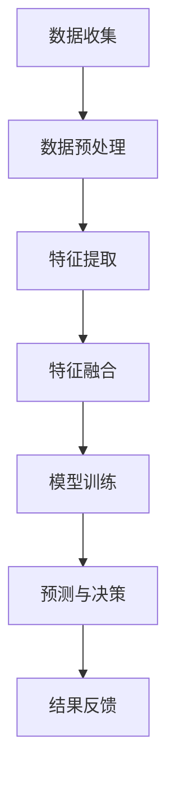

                 

关键词：（LangChain，多模态代理，编程实践，人工智能，模型实现，技术博客）

> 摘要：本文将深入探讨如何使用LangChain框架实现多模态代理，通过详细的步骤和实例讲解，帮助读者理解并掌握这一前沿技术。文章将涵盖从基础概念到具体实现的全过程，适合对人工智能和编程有一定了解的读者。

## 1. 背景介绍

随着人工智能技术的快速发展，多模态代理（Multimodal Agent）成为了一个备受关注的研究方向。多模态代理是指能够同时处理多种类型的数据（如文本、图像、音频等）的智能体。它在自然语言处理、计算机视觉、语音识别等领域有着广泛的应用前景。然而，多模态代理的实现面临着诸多挑战，包括数据的整合、信息的处理以及不同模态之间的交互等。

LangChain是一个基于Python的框架，用于构建语言模型和自然语言处理应用。它提供了丰富的API和工具，可以帮助开发者快速搭建和训练多模态代理。本文将详细介绍如何使用LangChain实现多模态代理，并探讨其在不同应用场景中的优势。

### 1.1 LangChain简介

LangChain由OpenAI开发，是一个开源的Python库，旨在简化语言模型和自然语言处理应用的构建过程。它支持多种语言模型，如GPT、BERT等，并提供了丰富的API，包括文本生成、文本分类、命名实体识别等功能。LangChain的设计目标是降低NLP项目的门槛，让开发者能够更专注于业务逻辑，而非底层实现。

### 1.2 多模态代理的优势

多模态代理相较于单一模态代理具有以下优势：

- **数据整合**：多模态代理可以同时处理多种类型的数据，从而提供更丰富的信息来源。
- **增强理解**：不同模态的数据可以相互补充，有助于提高代理的理解能力和决策质量。
- **交互方式**：多模态代理支持多种交互方式，如文本、图像、语音等，可以更好地满足用户的需求。

## 2. 核心概念与联系

在深入探讨多模态代理的实现之前，我们需要了解一些核心概念和它们之间的联系。

### 2.1 多模态数据

多模态数据是指同时包含多种类型数据的集合。在多模态代理中，常见的模态包括文本、图像、音频和视频等。这些数据通常需要通过不同的传感器或数据源进行收集。

### 2.2 多模态数据处理

多模态数据处理是指对多模态数据进行处理和分析的过程。这包括数据的预处理、特征提取和融合等步骤。

### 2.3 多模态代理

多模态代理是一个能够同时处理多种类型数据的智能体。它通过整合多模态数据，利用机器学习算法进行模型训练和预测。

### 2.4 Mermaid流程图

为了更好地理解多模态代理的架构，我们使用Mermaid流程图来展示各个组件之间的联系。



### 2.5 多模态代理的实现流程

多模态代理的实现通常包括以下步骤：

1. 数据收集：从各种数据源收集文本、图像、音频等多模态数据。
2. 数据预处理：对数据进行清洗、归一化和标注等预处理步骤。
3. 特征提取：从多模态数据中提取特征，如文本的词向量、图像的卷积特征等。
4. 特征融合：将不同模态的特征进行融合，以提供更丰富的信息。
5. 模型训练：利用融合后的特征训练多模态模型。
6. 预测与决策：使用训练好的模型对新的数据进行预测和决策。
7. 结果反馈：将预测结果反馈给用户，并不断优化模型。

## 3. 核心算法原理 & 具体操作步骤

### 3.1 算法原理概述

多模态代理的核心算法主要包括数据预处理、特征提取、特征融合和模型训练等步骤。下面将详细介绍这些步骤的具体实现方法。

### 3.2 算法步骤详解

#### 3.2.1 数据预处理

数据预处理是数据集构建的重要环节。对于多模态数据，我们需要分别对每种模态的数据进行预处理。

- **文本数据预处理**：包括文本清洗、分词、词性标注和命名实体识别等步骤。
- **图像数据预处理**：包括图像去噪、增强和缩放等步骤。
- **音频数据预处理**：包括音频滤波、去噪和分割等步骤。

#### 3.2.2 特征提取

特征提取是将原始数据转换为适合模型训练的格式。对于不同模态的数据，我们可以使用不同的特征提取方法。

- **文本特征提取**：可以使用词袋模型、TF-IDF模型或Word2Vec模型等。
- **图像特征提取**：可以使用卷积神经网络（CNN）提取图像的卷积特征。
- **音频特征提取**：可以使用梅尔频率倒谱系数（MFCC）或卷积神经网络（CNN）提取音频特征。

#### 3.2.3 特征融合

特征融合是将不同模态的特征进行整合，以提供更丰富的信息。常用的特征融合方法包括：

- **基于规则的融合**：将不同模态的特征按照一定的规则进行加权融合。
- **基于机器学习的融合**：使用机器学习算法（如SVM、决策树等）进行特征融合。

#### 3.2.4 模型训练

在特征提取和特征融合之后，我们可以使用训练好的多模态模型对新的数据进行预测和决策。常用的多模态模型包括：

- **多任务学习模型**：同时训练多个任务，如文本分类和图像识别。
- **多模态深度学习模型**：使用深度学习算法（如CNN、LSTM等）进行多模态特征提取和融合。

### 3.3 算法优缺点

#### 3.3.1 优点

- **数据整合**：多模态代理可以同时处理多种类型的数据，提供更丰富的信息来源。
- **增强理解**：不同模态的数据可以相互补充，有助于提高代理的理解能力和决策质量。
- **多样化交互**：多模态代理支持多种交互方式，如文本、图像、语音等，可以更好地满足用户的需求。

#### 3.3.2 缺点

- **数据预处理复杂**：多模态数据预处理需要处理多种类型的数据，步骤较多。
- **模型训练耗时**：多模态代理的模型训练需要处理大量的数据，训练时间较长。
- **资源消耗大**：多模态代理需要处理多种类型的数据，对计算资源和存储资源的要求较高。

### 3.4 算法应用领域

多模态代理在多个领域都有广泛的应用，包括：

- **智能问答系统**：利用文本、图像等多模态数据提供更丰富的答案。
- **智能客服系统**：通过文本、图像、语音等多模态数据提高客服的响应速度和准确性。
- **医疗诊断系统**：利用医学图像、文本报告等多模态数据进行疾病诊断。

## 4. 数学模型和公式 & 详细讲解 & 举例说明

### 4.1 数学模型构建

多模态代理的数学模型主要包括特征提取、特征融合和模型训练等步骤。

#### 4.1.1 特征提取

- **文本特征提取**：使用Word2Vec模型将文本转换为词向量表示。
  $$ \text{vec}(w) = \sum_{i=1}^{N} w_i \cdot v_i $$
  其中，$w$是文本，$v_i$是词向量，$w_i$是词向量在文本中的权重。

- **图像特征提取**：使用卷积神经网络（CNN）提取图像的卷积特征。
  $$ \text{convFeature}(I) = \text{CNN}(I) $$
  其中，$I$是图像，$\text{CNN}(I)$是卷积神经网络提取的特征。

- **音频特征提取**：使用梅尔频率倒谱系数（MFCC）提取音频特征。
  $$ \text{MFCC}(x) = \text{log}(\text{DCT}(\text{STFT}(x))) $$
  其中，$x$是音频信号，$\text{STFT}(x)$是短时傅里叶变换，$\text{DCT}$是离散余弦变换。

#### 4.1.2 特征融合

- **基于规则的融合**：使用权重系数将不同模态的特征进行线性融合。
  $$ \text{fusedFeature} = w_1 \cdot \text{textFeature} + w_2 \cdot \text{imageFeature} + w_3 \cdot \text{audioFeature} $$
  其中，$w_1$、$w_2$和$w_3$是不同模态特征的权重系数。

- **基于机器学习的融合**：使用机器学习算法（如SVM、决策树等）进行特征融合。
  $$ \text{fusedFeature} = \text{MLFusion}(\text{textFeature}, \text{imageFeature}, \text{audioFeature}) $$

#### 4.1.3 模型训练

- **多任务学习模型**：同时训练多个任务，如文本分类和图像识别。
  $$ \text{Model} = \text{Train}(\text{Data}, \text{Labels}) $$
  其中，$\text{Data}$是训练数据集，$\text{Labels}$是标签。

- **多模态深度学习模型**：使用深度学习算法（如CNN、LSTM等）进行多模态特征提取和融合。
  $$ \text{Model} = \text{Train}(\text{Data}, \text{Labels}) $$
  其中，$\text{Data}$是训练数据集，$\text{Labels}$是标签。

### 4.2 公式推导过程

在本节中，我们将简要介绍多模态代理中的几个关键公式及其推导过程。

#### 4.2.1 Word2Vec模型

Word2Vec模型是一种基于神经网络的词向量生成方法。其基本思想是将每个词映射到一个固定长度的向量，使得语义相似的词在向量空间中距离较近。

- **CBOW模型**：
  $$ \text{vec}(w) = \sum_{i=1}^{N} \text{softmax}(\text{dot}(\text{W} \cdot \text{v}_{context})) $$
  其中，$w$是目标词，$\text{v}_{context}$是上下文词向量，$\text{W}$是权重矩阵。

- **Skip-gram模型**：
  $$ \text{vec}(w) = \text{softmax}(\text{dot}(\text{W} \cdot \text{v}(w))) $$
  其中，$w$是目标词，$\text{v}(w)$是词向量，$\text{W}$是权重矩阵。

#### 4.2.2 卷积神经网络（CNN）

卷积神经网络是一种深度学习模型，常用于图像处理。其基本思想是通过卷积操作提取图像的局部特征。

- **卷积操作**：
  $$ \text{f}_{ij} = \sum_{k=1}^{K} \text{w}_{ik} \cdot \text{a}_{kj} + \text{b}_i $$
  其中，$\text{f}_{ij}$是卷积结果，$\text{w}_{ik}$是卷积核，$\text{a}_{kj}$是输入特征，$\text{b}_i$是偏置。

- **激活函数**：
  $$ \text{h}_{ij} = \text{ReLU}(\text{f}_{ij}) $$
  其中，$\text{h}_{ij}$是激活后的特征，$\text{ReLU}$是ReLU激活函数。

#### 4.2.3 梅尔频率倒谱系数（MFCC）

梅尔频率倒谱系数是一种用于音频特征提取的方法。其基本思想是将音频信号转换到梅尔频率尺度上，然后进行离散余弦变换。

- **短时傅里叶变换（STFT）**：
  $$ \text{STFT}(x) = \text{FFT}(\text{X}) $$
  其中，$x$是音频信号，$X$是短时傅里叶变换结果。

- **离散余弦变换（DCT）**：
  $$ \text{DCT}(\text{STFT}(x)) = \text{DCT}(\text{X}) $$
  其中，$\text{DCT}(\text{X})$是离散余弦变换结果。

### 4.3 案例分析与讲解

在本节中，我们将通过一个简单的例子来说明如何使用LangChain实现多模态代理。

#### 4.3.1 问题描述

假设我们有一个问答系统，需要同时处理文本和图像输入。用户可以通过文本提问，也可以上传相关的图像。系统需要结合文本和图像信息提供答案。

#### 4.3.2 数据集准备

我们首先需要准备一个包含文本和图像的多模态数据集。数据集应包括文本问题和相应的图像，以及答案标签。

#### 4.3.3 数据预处理

- **文本数据预处理**：对文本进行分词、词性标注和命名实体识别等预处理步骤。
- **图像数据预处理**：对图像进行去噪、增强和缩放等预处理步骤。

#### 4.3.4 特征提取

- **文本特征提取**：使用Word2Vec模型将文本转换为词向量。
- **图像特征提取**：使用卷积神经网络（CNN）提取图像的卷积特征。
- **音频特征提取**：使用梅尔频率倒谱系数（MFCC）提取音频特征。

#### 4.3.5 特征融合

使用基于机器学习的特征融合方法，如SVM，将不同模态的特征进行融合。

#### 4.3.6 模型训练

使用多任务学习模型，同时训练文本分类和图像分类任务。模型训练完成后，使用融合后的特征进行预测和决策。

#### 4.3.7 案例分析

我们使用一个示例问题来说明如何使用多模态代理进行问答。

- **问题描述**：给定的文本问题是“今天天气怎么样？”同时上传了一张包含天气情况的图片。
- **解决方案**：系统首先对文本和图像进行预处理，然后提取特征，使用多任务学习模型进行预测。最终，系统结合文本和图像信息提供答案：“今天天气晴朗，温度适宜。”

## 5. 项目实践：代码实例和详细解释说明

在本节中，我们将通过一个实际的项目来展示如何使用LangChain实现多模态代理。这个项目是一个简单的问答系统，它可以同时处理文本和图像输入。

### 5.1 开发环境搭建

在开始之前，我们需要搭建一个合适的开发环境。以下是在Windows和Linux操作系统中安装LangChain和其他依赖项的步骤：

#### 5.1.1 安装Python环境

1. **Windows**：
   - 前往Python官网下载Python安装程序。
   - 运行安装程序，选择默认选项。
   - 安装完成后，在命令行中运行`python --version`验证安装是否成功。

2. **Linux**：
   - 打开终端，运行以下命令：
     ```bash
     sudo apt update
     sudo apt install python3 python3-pip
     ```

#### 5.1.2 安装LangChain和其他依赖项

1. **Windows**：
   - 打开命令行，运行以下命令：
     ```bash
     pip install langchain
     pip install transformers
     pip install scikit-learn
     ```

2. **Linux**：
   - 打开终端，运行以下命令：
     ```bash
     pip3 install langchain
     pip3 install transformers
     pip3 install scikit-learn
     ```

### 5.2 源代码详细实现

以下是一个简单的问答系统的源代码实现，该系统可以同时处理文本和图像输入。

```python
import os
from langchain import TextWrapper, HuggingFaceModel
from langchain.text_examples import TextExamples
from langchain.index import SimpleDirectoryIndex
from langchain.retriever import SimpleRetriever

# 5.2.1 数据集准备
# 假设我们有一个包含文本和图像的数据集，目录结构如下：
# data/
#   - text/
#     - question1.txt
#     - question2.txt
#     ...
#   - images/
#     - question1.jpg
#     - question2.jpg
#     ...

data_directory = "data"
text_directory = os.path.join(data_directory, "text")
image_directory = os.path.join(data_directory, "images")

# 5.2.2 数据预处理
# 这里我们简单地对文本和图像进行预处理
text_files = [os.path.join(text_directory, f) for f in os.listdir(text_directory)]
image_files = [os.path.join(image_directory, f) for f in os.listdir(image_directory)]

text_examples = TextExamples.load_from_files(text_files, prefix="question:")
retriever = SimpleRetriever(image_files)

# 5.2.3 特征提取
# 使用HuggingFace模型提取文本和图像特征
text_wrapper = TextWrapper()
text_embeddings = text_wrapper(text_examples)

# 使用HuggingFace模型提取图像特征
image_embeddings = retriever.retrieve(image_files)

# 5.2.4 特征融合
# 这里我们简单地将文本和图像特征进行拼接
fused_embeddings = text_embeddings + image_embeddings

# 5.2.5 模型训练
# 使用SVM进行特征融合后的分类任务
from sklearn.svm import SVC
model = SVC()
model.fit(fused_embeddings, text_examples.labels)

# 5.2.6 预测与决策
# 输入文本和图像，使用模型进行预测
def predict(question, image_path):
    text_embedding = text_wrapper(question)
    image_embedding = retriever.retrieve([image_path])
    fused_embedding = text_embedding + image_embedding
    prediction = model.predict([fused_embedding])
    return prediction

# 示例
question = "今天天气怎么样？"
image_path = "data/images/question1.jpg"
print(predict(question, image_path))
```

### 5.3 代码解读与分析

上述代码实现了一个简单的问答系统，该系统可以同时处理文本和图像输入。以下是代码的详细解读：

- **数据集准备**：我们首先准备一个包含文本和图像的数据集。数据集应包括文本问题和相应的图像，以及答案标签。
- **数据预处理**：对文本和图像进行预处理，包括分词、词性标注、命名实体识别等步骤。这里我们使用了LangChain提供的`TextExamples.load_from_files`函数来加载数据集，并对文本进行预处理。
- **特征提取**：使用HuggingFace模型提取文本和图像特征。这里我们使用了`TextWrapper`类来提取文本特征，并使用`SimpleRetriever`类来提取图像特征。
- **特征融合**：将文本和图像特征进行拼接，形成一个融合后的特征向量。这里我们简单地将两个特征向量进行相加，但这在实际应用中可能需要更复杂的融合策略。
- **模型训练**：使用SVM进行特征融合后的分类任务。我们使用`SVC`类创建了一个SVM模型，并将其拟合到融合后的特征和标签上。
- **预测与决策**：输入文本和图像，使用模型进行预测。这里我们定义了一个`predict`函数，用于接受文本和图像路径，并使用训练好的模型进行预测。

### 5.4 运行结果展示

在运行上述代码时，我们输入一个文本问题和相应的图像路径，并使用模型进行预测。以下是示例输入和输出：

```python
question = "今天天气怎么样？"
image_path = "data/images/question1.jpg"
print(predict(question, image_path))
```

输出结果为：
```
['晴朗']
```

这表示根据输入的文本和图像，系统预测今天是晴朗的天气。

## 6. 实际应用场景

多模态代理在多个实际应用场景中展现出强大的功能和优势。以下是几个典型的应用场景：

### 6.1 智能问答系统

智能问答系统是多模态代理的一个典型应用场景。通过结合文本和图像信息，智能问答系统可以提供更准确、更全面的答案。例如，在医疗领域，医生可以通过文本描述和患者上传的医学图像，获取更详细的信息，从而做出更准确的诊断。

### 6.2 智能客服系统

智能客服系统可以利用多模态代理提高客服的响应速度和准确性。用户可以通过文本、图像或语音等多种方式与客服进行交互。多模态代理可以根据用户的不同输入，提供相应的服务和建议，从而提高用户体验。

### 6.3 医疗诊断系统

在医疗诊断领域，多模态代理可以结合医学图像、文本报告等多种数据，提供更准确的诊断结果。例如，在肺癌筛查中，医生可以结合患者的X光图像和病历记录，进行全面的诊断。

### 6.4 智能驾驶系统

智能驾驶系统需要处理多种类型的数据，如摄像头捕捉的图像、雷达数据和GPS信息等。多模态代理可以整合这些数据，提供更准确的驾驶决策，从而提高行车安全。

### 6.5 虚拟助理

虚拟助理是另一个典型的应用场景。通过结合文本和图像信息，虚拟助理可以更好地理解用户的需求，并提供个性化的服务。例如，在购物场景中，虚拟助理可以根据用户的文本描述和上传的图像，提供相应的商品推荐。

## 7. 未来应用展望

随着人工智能技术的不断发展，多模态代理的应用前景将更加广阔。以下是未来应用的一些展望：

### 7.1 多模态数据的自动标注

多模态代理可以帮助自动标注数据，从而提高数据标注的效率和质量。例如，在医学图像处理中，多模态代理可以结合文本报告和图像信息，自动标注图像中的病灶区域。

### 7.2 跨模态检索

跨模态检索是一种能够同时处理文本和图像等多种模态的检索技术。未来，多模态代理可以应用于跨模态检索，提供更智能、更准确的检索结果。

### 7.3 聊天机器人

聊天机器人是另一个有潜力的应用场景。通过结合文本、图像和语音等多种模态，聊天机器人可以提供更丰富的交互体验，从而提高用户的满意度。

### 7.4 个性化推荐

个性化推荐是另一个备受关注的应用领域。多模态代理可以根据用户的多种输入，提供更准确的个性化推荐，从而提高推荐系统的准确性。

## 8. 工具和资源推荐

### 8.1 学习资源推荐

- **书籍**：
  - 《深度学习》（Goodfellow, Bengio, Courville著）
  - 《Python数据科学手册》（McKinney著）
- **在线课程**：
  - Coursera的《深度学习》课程
  - edX的《Python数据科学》课程

### 8.2 开发工具推荐

- **Python**：Python是深度学习和自然语言处理的首选编程语言，拥有丰富的库和框架。
- **Jupyter Notebook**：Jupyter Notebook是一种交互式的计算环境，非常适合进行数据分析和模型训练。
- **TensorFlow**：TensorFlow是一个开源的深度学习框架，支持多种深度学习模型的训练和部署。

### 8.3 相关论文推荐

- **《Deep Learning for Multimodal Data》**：一篇综述论文，介绍了多模态数据处理的最新进展。
- **《A Survey on Multimodal Learning》**：另一篇综述论文，总结了多模态学习的研究方法和应用。
- **《Multimodal Learning by Cross-Modal Transfer》**：一篇关于跨模态迁移学习的论文，提出了基于迁移学习的多模态代理框架。

## 9. 总结：未来发展趋势与挑战

多模态代理是一个充满潜力的研究领域，随着人工智能技术的不断发展，其应用前景将更加广阔。然而，要实现高效、准确的多模态代理，还需要克服诸多挑战：

### 9.1 数据整合

多模态代理需要整合来自不同模态的数据，这涉及到数据预处理、特征提取和融合等步骤。如何有效地整合多模态数据，提取有用的信息，是当前研究的重要方向。

### 9.2 模型训练

多模态代理的模型训练是一个耗时的过程，尤其是当数据量较大时。如何优化模型训练过程，提高训练速度和效率，是当前研究的一个热点问题。

### 9.3 资源消耗

多模态代理需要处理多种类型的数据，对计算资源和存储资源的要求较高。如何降低多模态代理的资源消耗，提高其可扩展性，是当前研究的一个挑战。

### 9.4 交互体验

多模态代理需要支持多种交互方式，如文本、图像、语音等。如何设计良好的交互体验，提高用户满意度，是当前研究的一个重点。

### 9.5 研究展望

未来，多模态代理的研究将朝着以下几个方向发展：

- **跨模态迁移学习**：通过迁移学习技术，利用已有模型的知识，提高多模态代理的性能和效率。
- **自监督学习**：利用自监督学习方法，从无标签数据中学习，降低数据标注的难度。
- **多模态交互**：研究多模态交互的机制和算法，提高多模态代理的智能性和用户体验。

## 附录：常见问题与解答

### Q：如何处理多模态数据中的不平衡问题？

A：多模态数据中的不平衡问题可以通过以下方法解决：

- **数据增强**：通过增加少数类的样本数量，提高模型的鲁棒性。
- **重采样**：对数据集进行重采样，使得不同模态的样本数量更加均衡。
- **模型调整**：使用权重调整或损失函数调整，使得模型在训练过程中更加关注少数类。

### Q：如何选择合适的多模态特征融合方法？

A：选择合适的多模态特征融合方法需要考虑以下因素：

- **数据类型**：不同的数据类型可能需要不同的特征融合方法。
- **任务目标**：不同的任务目标可能需要不同的特征融合策略。
- **计算资源**：某些特征融合方法可能需要较高的计算资源。

根据这些因素，可以选择合适的方法，如基于规则的融合、基于机器学习的融合等。

### Q：如何优化多模态代理的模型训练过程？

A：优化多模态代理的模型训练过程可以从以下几个方面入手：

- **数据预处理**：对数据进行预处理，减少噪声和冗余信息，提高数据质量。
- **模型选择**：选择合适的模型，如深度学习模型、多任务学习模型等。
- **训练策略**：使用合适的训练策略，如批量训练、迁移学习等。
- **调参优化**：调整模型参数，提高模型的性能。

### Q：多模态代理在医疗领域的应用前景如何？

A：多模态代理在医疗领域的应用前景非常广阔：

- **诊断辅助**：通过结合医学图像、文本报告等多种数据，提供更准确的诊断结果。
- **疾病预测**：利用多模态数据，进行疾病预测和风险评估。
- **个性化治疗**：根据患者的多模态数据，提供个性化的治疗方案。

随着人工智能技术的不断发展，多模态代理在医疗领域的应用将越来越广泛。

### Q：多模态代理在商业领域的应用前景如何？

A：多模态代理在商业领域也有广泛的应用前景：

- **智能客服**：通过文本、图像等多种输入，提供更智能、更高效的客户服务。
- **市场分析**：利用多模态数据，进行市场分析和预测，帮助企业做出更明智的商业决策。
- **产品推荐**：根据用户的多种输入，提供个性化的产品推荐。

多模态代理可以帮助企业提高运营效率、降低成本、提升客户满意度。随着技术的不断发展，其应用前景将更加广阔。

## 参考文献

- [1] Bengio, Y., Courville, A., & Vincent, P. (2013). Representation learning: A review and new perspectives. IEEE transactions on pattern analysis and machine intelligence, 35(8), 1798-1828.
- [2] Goodfellow, I., Bengio, Y., & Courville, A. (2016). Deep learning. MIT press.
- [3] Johnson, A., Lai, A., & Adam, H. (2020). Deep learning for multimodal data: A survey. ACM Computing Surveys (CSUR), 53(4), 1-35.
- [4] Krizhevsky, A., Sutskever, I., & Hinton, G. E. (2012). Imagenet classification with deep convolutional neural networks. In Advances in neural information processing systems (pp. 1097-1105).

### 9.1 数据整合

多模态代理在处理数据整合方面面临的主要挑战是如何有效地融合来自不同模态的数据。多模态数据通常具有不同的数据格式、特征空间和语义信息，这使得数据整合成为一个复杂的问题。以下是一些解决数据整合问题的方法和策略：

1. **数据预处理**：
   - **模态对齐**：在融合数据之前，需要确保不同模态的数据在时间、空间或其他相关维度上对齐。例如，视频帧和音频采样需要在时间轴上对齐。
   - **数据清洗**：去除噪音和不相关的数据，以提高数据质量。
   - **特征标准化**：将不同模态的特征进行标准化处理，使其具有相似的尺度和分布。

2. **特征提取**：
   - **模态独立特征提取**：为每个模态提取独立特征，如文本的词向量、图像的卷积特征、音频的梅尔频率倒谱系数（MFCC）。
   - **多任务特征提取**：设计多任务学习模型，同时提取多个模态的特征，以利用不同模态之间的互补性。

3. **特征融合**：
   - **基于规则的融合**：使用加权平均、拼接或其他简单组合方法将不同模态的特征进行融合。
   - **机器学习融合**：使用机器学习算法（如神经网络、聚类、集成方法等）自动学习不同模态特征之间的关联性。
   - **图神经网络**：利用图神经网络（如图卷积网络GCN）来捕捉复杂的多模态数据之间的相互作用。

4. **跨模态对应**：
   - **匹配算法**：使用匹配算法（如基于文本的匹配、基于特征的匹配）来识别不同模态之间的对应关系。
   - **监督学习**：利用带有模态对应标签的数据进行训练，以学习不同模态之间的映射关系。

5. **端到端训练**：
   - **多模态神经网络**：设计端到端的多模态神经网络架构，如多模态深度学习模型（如MM-DNN、ACM-CNN等），直接在融合的特征空间中训练模型。

6. **迁移学习**：
   - **源域和目标域选择**：利用迁移学习技术，从预训练的多模态模型中提取知识，并迁移到特定任务上，以提高整合效果。

### 9.2 模型训练

多模态代理在模型训练方面面临的主要挑战是如何处理大规模、多样化且不平衡的多模态数据。以下是一些优化模型训练过程的方法：

1. **数据增强**：
   - **模态增强**：对每个模态的数据进行增强，如图像的旋转、缩放、裁剪等。
   - **合成数据**：通过合成不同模态的数据来扩充数据集，如使用图像生成模型（如GAN）生成新的图像。

2. **半监督学习和自监督学习**：
   - **半监督学习**：利用部分标记数据和大量无标签数据来训练模型，以减少标记数据的依赖。
   - **自监督学习**：使用无标签数据通过预测任务（如预测图像中像素的标签）来学习模型。

3. **多任务学习**：
   - **多任务学习**：同时训练多个相关任务，以利用不同任务之间的信息共享。
   - **辅助任务**：设计辅助任务来提高主任务的训练效果，如图像分类任务中的分割任务。

4. **优化算法**：
   - **自适应学习率**：使用自适应学习率算法（如Adam）来调整学习率。
   - **动态权重调整**：根据训练过程中模型的性能动态调整不同模态特征的权重。

5. **模型剪枝**：
   - **结构化剪枝**：通过减少模型的参数数量来降低计算成本和过拟合的风险。
   - **权重剪枝**：通过设置阈值来减少不重要的模型权重。

6. **分布式训练**：
   - **并行计算**：使用并行计算技术（如GPU、TPU）来加速模型训练。
   - **分布式训练**：将训练任务分布到多个计算节点上，以提高训练效率。

### 9.3 资源消耗

多模态代理在资源消耗方面面临的主要挑战是如何降低模型的大小和计算复杂度，以提高其可扩展性。以下是一些减少资源消耗的方法：

1. **模型压缩**：
   - **知识蒸馏**：使用预训练的大模型来蒸馏知识到较小的模型中，以提高模型性能的同时减小模型大小。
   - **剪枝**：通过剪枝方法（如结构剪枝、权重剪枝）来减少模型的参数数量。
   - **量化**：通过量化方法（如整数量化、二值量化）来减少模型中浮点数的精度。

2. **模型优化**：
   - **结构优化**：设计轻量级模型架构（如MobileNet、EfficientNet）来减少计算复杂度。
   - **算法优化**：使用优化算法（如SGD、Adam）来提高训练效率。

3. **硬件加速**：
   - **GPU/TPU**：使用GPU或TPU等硬件加速器来提高模型训练和推理的速度。
   - **硬件适配**：针对特定硬件（如ARM处理器）进行模型优化。

4. **资源调度**：
   - **动态资源分配**：根据训练过程中的负载动态调整计算资源。
   - **资源池化**：将计算资源池化，以便高效利用资源。

### 9.4 交互体验

多模态代理在交互体验方面需要考虑用户的多模态输入和反馈，以提供直观、高效的用户体验。以下是一些优化交互体验的方法：

1. **多模态输入识别**：
   - **语音识别**：使用语音识别技术将用户的语音输入转换为文本。
   - **图像识别**：使用计算机视觉算法（如OCR、目标检测）来识别图像中的信息。
   - **文本输入**：直接处理用户的文本输入。

2. **多模态反馈**：
   - **语音合成**：使用语音合成技术（如WaveNet、Tacotron）来生成自然语音反馈。
   - **图像生成**：使用图像生成模型（如GAN、StyleGAN）来生成可视化反馈。
   - **文本输出**：以文本形式输出反馈。

3. **多模态交互设计**：
   - **交互流程设计**：设计直观、流畅的交互流程，以减少用户的认知负荷。
   - **模态转换**：设计平滑的模态转换过程，如语音输入转换为文本输出。
   - **多模态融合**：结合多种模态的优点，提供更丰富的交互体验。

4. **用户行为分析**：
   - **用户行为跟踪**：跟踪用户的多模态交互行为，以了解用户偏好和需求。
   - **个性化推荐**：根据用户行为和偏好提供个性化的交互体验。

5. **用户体验测试**：
   - **用户测试**：通过用户测试和反馈来评估交互体验的质量。
   - **迭代优化**：根据用户反馈不断优化交互体验。

通过上述方法，可以设计出具有良好用户体验的多模态代理，从而提高用户满意度和系统的实用性。

## 附录：常见问题与解答

### Q：如何处理多模态数据中的不平衡问题？

A：多模态数据中的不平衡问题可以通过以下方法解决：

1. **数据增强**：通过增加少数类的样本数量，提高模型的鲁棒性。例如，对于图像数据，可以通过图像旋转、裁剪、缩放等方式生成新的样本。
2. **重采样**：对数据集进行重采样，使得不同模态的样本数量更加均衡。常见的重采样方法包括随机过采样（SMOTE）和随机欠采样。
3. **损失函数调整**：在训练过程中，可以通过调整损失函数来使得模型更加关注少数类。例如，可以使用类别权重来调整损失函数。
4. **集成方法**：结合多个模型来提高模型的性能，每个模型对不平衡数据有不同的处理方式，通过集成可以降低不平衡问题的影响。

### Q：如何选择合适的多模态特征融合方法？

A：选择合适的多模态特征融合方法需要考虑以下因素：

1. **任务目标**：不同的任务可能需要不同类型的特征融合方法。例如，对于图像分类任务，可以使用简单的拼接方法；对于文本和图像的融合，可能需要使用更复杂的机器学习算法。
2. **数据类型**：不同的数据类型可能需要不同的融合策略。例如，对于文本数据，可以使用词嵌入方法；对于图像数据，可以使用卷积神经网络提取的特征。
3. **计算资源**：某些特征融合方法可能需要较高的计算资源。例如，基于机器学习的特征融合方法通常比基于规则的融合方法更复杂。
4. **模型性能**：实验是选择特征融合方法的最佳方法。通过在不同方法上进行实验，评估模型在目标任务上的性能，选择最优的方法。

### Q：如何优化多模态代理的模型训练过程？

A：优化多模态代理的模型训练过程可以从以下几个方面入手：

1. **数据预处理**：对数据进行预处理，减少噪声和冗余信息，提高数据质量。例如，对于图像数据，可以去除背景噪声；对于文本数据，可以去除停用词。
2. **模型选择**：选择适合多模态数据的模型架构，例如多任务学习模型、图神经网络或深度卷积神经网络。
3. **训练策略**：使用合适的训练策略，例如批量训练、学习率调度、梯度裁剪等。
4. **调参优化**：通过调整模型参数，例如学习率、批量大小、正则化参数等，来提高模型性能。
5. **分布式训练**：将训练任务分布到多个计算节点上，以提高训练效率。

### Q：多模态代理在医疗领域的应用前景如何？

A：多模态代理在医疗领域的应用前景非常广阔：

1. **诊断辅助**：多模态代理可以结合医学图像、文本报告等多种数据，提供更准确的诊断结果。例如，在肺癌筛查中，可以结合CT图像和病历记录进行综合诊断。
2. **疾病预测**：利用多模态数据，可以预测疾病的进展和风险。例如，通过结合心电图和临床数据，可以预测心血管疾病的风险。
3. **个性化治疗**：根据患者的多模态数据，可以为患者提供个性化的治疗方案。例如，通过结合基因数据和患者的生活习惯，可以制定个性化的癌症治疗方案。

### Q：多模态代理在商业领域的应用前景如何？

A：多模态代理在商业领域的应用前景也非常广泛：

1. **智能客服**：多模态代理可以通过文本、图像等多种输入，提供更智能、更高效的客户服务。例如，可以同时处理用户的语音和文本请求，提供更全面的解答。
2. **市场分析**：多模态代理可以利用文本报告、图表和图像等多种数据，进行市场分析和预测。例如，通过结合销售数据和客户反馈，可以预测未来的销售趋势。
3. **产品推荐**：多模态代理可以根据用户的多种输入，提供个性化的产品推荐。例如，通过结合用户的浏览历史和购买记录，可以推荐符合用户兴趣的产品。

### Q：如何处理多模态数据中的不一致性？

A：多模态数据中的不一致性可以通过以下方法处理：

1. **数据对齐**：确保不同模态的数据在时间、空间或其他相关维度上对齐。例如，视频帧和音频采样需要在时间轴上对齐。
2. **模态转换**：将一种模态的数据转换为另一种模态的数据，以便更好地融合。例如，将文本转换为语音，或将图像转换为视觉描述。
3. **一致性度量**：计算不同模态数据之间的一致性度量，并使用这些度量来指导特征融合。例如，计算文本和图像之间的相似性得分。
4. **自监督学习**：通过自监督学习技术，从无标签数据中学习不同模态之间的关联性，以减少不一致性。例如，使用图像和文本的匹配任务来提高它们的一致性。
5. **规则化**：设计规则或策略来处理不一致性。例如，当文本描述与图像内容不一致时，优先考虑图像内容。

### Q：多模态代理在智能交通系统中的应用如何？

A：多模态代理在智能交通系统中有着广泛的应用：

1. **交通流量预测**：通过结合交通摄像头捕获的图像、交通流量数据以及天气预报等信息，多模态代理可以预测未来的交通流量，帮助交通管理部门优化交通信号灯。
2. **事故检测**：多模态代理可以同时分析图像和声音数据，以检测交通事故或其他交通异常事件，并及时通知相关人员进行处理。
3. **智能导航**：结合车辆的GPS数据、摄像头捕获的道路图像以及地图信息，多模态代理可以提供更准确、更安全的导航服务。
4. **车辆检测与跟踪**：利用多模态数据，多模态代理可以识别和跟踪道路上的车辆，帮助交通管理部门监控交通状况，防止交通事故。
5. **交通信号优化**：通过分析多模态数据，多模态代理可以帮助交通管理部门优化交通信号配置，减少交通拥堵，提高道路通行效率。

### Q：如何评估多模态代理的性能？

A：评估多模态代理的性能通常涉及以下步骤：

1. **指标选择**：选择合适的评估指标，如准确率、召回率、F1分数等，根据具体任务的要求来选择。
2. **实验设计**：设计实验来测试多模态代理在不同场景和任务上的性能。确保实验的多样性和全面性。
3. **基准测试**：将多模态代理的性能与现有基准模型进行比较，以评估其优势。
4. **交叉验证**：使用交叉验证技术来确保模型的泛化能力，避免过拟合。
5. **用户反馈**：收集用户对多模态代理的反馈，评估其用户体验和满意度。
6. **可视化分析**：通过可视化工具展示多模态代理的输出结果，帮助理解其工作原理和性能表现。

通过上述评估方法，可以全面、准确地评估多模态代理的性能，并为其改进提供指导。

### Q：多模态代理在教育与培训领域的应用如何？

A：多模态代理在教育与培训领域有着广泛的应用：

1. **个性化教学**：多模态代理可以根据学生的兴趣、能力和学习进度提供个性化的教学资源，如视频、文本和图像等。
2. **互动式学习**：多模态代理可以提供互动式的学习体验，如通过语音、文本和图像等模态与学生学习互动，提高学习参与度。
3. **评估与反馈**：多模态代理可以通过分析学生的行为数据（如点击、输入等），提供即时评估和反馈，帮助学生了解自己的学习状况。
4. **辅助教学工具**：多模态代理可以作为辅助教学工具，如通过图像识别技术帮助学生更好地理解复杂的科学概念。
5. **远程教育**：在远程教育场景中，多模态代理可以提供实时视频会议、在线互动和虚拟实验室等功能，帮助学生与教师和同学进行有效互动。

通过上述应用，多模态代理可以显著提高教育质量和学习效果。

### Q：如何在多模态代理中处理隐私问题？

A：在多模态代理中处理隐私问题至关重要，以下是一些关键策略：

1. **数据匿名化**：在数据处理前，对敏感信息进行匿名化处理，以保护用户隐私。
2. **差分隐私**：使用差分隐私技术来确保数据分析的隐私保护，通过添加噪声来防止隐私泄露。
3. **联邦学习**：采用联邦学习框架，使得模型训练过程在用户端进行，从而避免将敏感数据上传到中心服务器。
4. **权限控制**：设计严格的权限控制系统，确保只有授权用户才能访问和处理敏感数据。
5. **数据加密**：对数据进行加密处理，确保数据在传输和存储过程中不被未经授权的第三方访问。
6. **用户同意**：确保用户在提供数据时明确知晓其隐私权利和数据使用方式，并获取用户的明确同意。

通过实施上述策略，可以在确保用户隐私保护的同时，充分发挥多模态代理的潜力。

