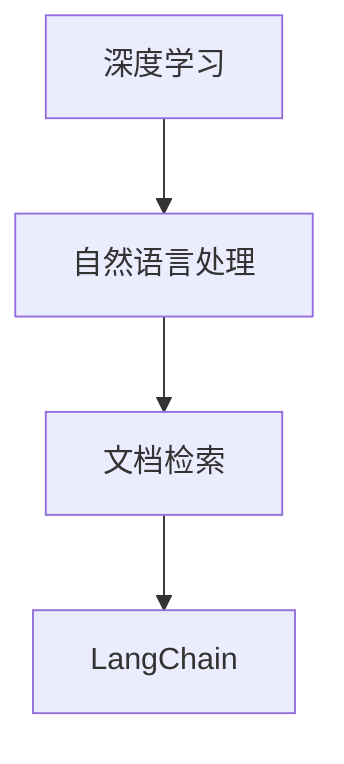

                 

关键词：LangChain，编程，文档检索，实践，深度学习，知识图谱

> 摘要：本文将介绍如何使用LangChain进行文档检索，从入门到实践，包括核心概念、算法原理、项目实践和未来应用展望等内容。通过阅读本文，读者将了解到如何利用LangChain实现高效的文档检索，并掌握其实践技巧。

## 1. 背景介绍

在当今信息爆炸的时代，如何快速、准确地获取所需的信息成为了一大挑战。文档检索作为信息检索的一个重要分支，旨在从大量文档中找到与查询最相关的结果。传统的文档检索方法主要依赖于关键词匹配和统计信息，但在面对复杂、非结构化的文档时，效果往往不理想。随着深度学习和自然语言处理技术的发展，基于深度学习的文档检索方法逐渐崭露头角。而LangChain作为一款开源的深度学习框架，以其强大的功能和灵活的架构，为文档检索提供了新的解决方案。

## 2. 核心概念与联系

### 2.1 核心概念

- **文档检索**：文档检索是指从大量文档中找到与查询最相关的结果的过程。其目标是最小化检索开销，最大化检索效果。

- **深度学习**：深度学习是一种基于人工神经网络的研究方法，通过多层神经网络进行数据的学习和预测。

- **自然语言处理**：自然语言处理（NLP）是人工智能的一个分支，旨在使计算机能够理解、解释和生成自然语言。

- **LangChain**：LangChain是一个开源的深度学习框架，支持多种自然语言处理任务，包括文档检索、文本分类、问答系统等。

### 2.2 核心联系

- **深度学习与自然语言处理**：深度学习为自然语言处理提供了强大的计算能力，使得自然语言处理任务能够取得更好的效果。

- **文档检索与自然语言处理**：文档检索需要理解用户的查询和文档的内容，这依赖于自然语言处理技术。

- **LangChain与文档检索**：LangChain提供了一个统一的开源框架，使得开发者可以轻松实现各种自然语言处理任务，包括文档检索。

### 2.3 Mermaid 流程图



## 3. 核心算法原理 & 具体操作步骤

### 3.1 算法原理概述

LangChain的文档检索算法主要基于以下原理：

- **词嵌入**：将文本中的单词转换为固定长度的向量表示，便于计算机处理。

- **查询编码**：将用户的查询文本编码为一个向量。

- **文档编码**：将文档中的每个句子编码为一个向量。

- **相似度计算**：计算查询向量和文档向量之间的相似度，并根据相似度排序文档。

### 3.2 算法步骤详解

1. **词嵌入**：使用预训练的词嵌入模型（如GloVe、Word2Vec等）对文本中的单词进行向量化表示。

2. **查询编码**：将用户的查询文本编码为一个向量。这一步可以通过句子级别的编码器（如BERT、RoBERTa等）实现。

3. **文档编码**：将文档中的每个句子编码为一个向量。同样，可以使用句子级别的编码器进行编码。

4. **相似度计算**：计算查询向量和每个文档向量之间的相似度。常用的相似度计算方法包括余弦相似度和欧氏距离。

5. **排序文档**：根据相似度对文档进行排序，返回最相关的文档。

### 3.3 算法优缺点

#### 优点

- **高效**：基于深度学习的方法在处理大规模文档检索任务时表现出较高的效率。

- **准确**：通过词嵌入和查询编码，能够更好地理解查询和文档的含义，提高检索的准确性。

- **灵活**：LangChain提供了丰富的API和扩展功能，使得开发者可以根据需求进行定制化开发。

#### 缺点

- **计算资源消耗**：深度学习模型通常需要较大的计算资源，对硬件要求较高。

- **训练时间较长**：预训练深度学习模型通常需要较长的训练时间。

### 3.4 算法应用领域

- **搜索引擎**：利用LangChain进行文档检索，可以为搜索引擎提供高效的文档搜索功能。

- **知识图谱**：通过文档检索，可以从大量文献中提取知识，构建知识图谱。

- **文本分类**：利用文档检索算法，可以对大量文本进行分类，例如新闻分类、情感分析等。

## 4. 数学模型和公式 & 详细讲解 & 举例说明

### 4.1 数学模型构建

在LangChain的文档检索算法中，主要涉及以下数学模型：

- **词嵌入模型**：将单词映射到固定长度的向量空间。

- **编码器模型**：将文本编码为向量。

- **相似度计算模型**：计算查询向量和文档向量之间的相似度。

### 4.2 公式推导过程

- **词嵌入模型**：

  词嵌入模型通常基于神经网络的输出，将单词映射到向量空间。设 \( w \) 为单词的词向量，\( v \) 为词向量，则有：

  \[ v = f(w) \]

  其中，\( f \) 为神经网络模型。

- **编码器模型**：

  编码器模型用于将文本编码为向量。设 \( x \) 为文本的输入序列，\( h \) 为编码后的向量，则有：

  \[ h = g(x) \]

  其中，\( g \) 为编码器模型。

- **相似度计算模型**：

  相似度计算模型用于计算查询向量和文档向量之间的相似度。设 \( q \) 为查询向量，\( d \) 为文档向量，则有：

  \[ s = \frac{q \cdot d}{\|q\| \|d\|} \]

  其中，\( \cdot \) 表示点积，\( \| \) 表示向量的模长。

### 4.3 案例分析与讲解

假设我们有一个包含1000篇文档的文档集，用户的查询为“如何优化算法性能”。使用LangChain进行文档检索，具体步骤如下：

1. **词嵌入**：将文档集中的每个单词映射到词向量空间。

2. **查询编码**：将用户的查询编码为一个向量。

3. **文档编码**：将文档集中的每个文档编码为向量。

4. **相似度计算**：计算查询向量和每个文档向量之间的相似度。

5. **排序文档**：根据相似度对文档进行排序。

通过以上步骤，我们可以从文档集中找到与查询最相关的文档，如“算法性能优化技巧”、“高效算法设计指南”等。

## 5. 项目实践：代码实例和详细解释说明

### 5.1 开发环境搭建

在开始项目实践之前，需要搭建一个合适的开发环境。以下是搭建开发环境的基本步骤：

1. 安装Python环境（推荐Python 3.7及以上版本）。

2. 安装深度学习框架，如TensorFlow或PyTorch。

3. 安装LangChain相关依赖，如`langchain`、`transformers`等。

4. 配置代码编辑器，如Visual Studio Code或PyCharm。

### 5.2 源代码详细实现

以下是使用LangChain进行文档检索的源代码实现：

```python
import langchain
from langchain.text_splitter import TextSplitter
from langchain.vector_db import FAISS
from langchain.index import Index

# 加载数据集
data = ["这篇文章讲述了如何优化算法性能。", "算法性能优化是一个重要的课题。", "优化算法性能的方法有很多。"]

# 分割文本
splitter = TextSplitter(max_length=1000, chunk_size=500)
chunks = splitter.split_documents(data)

# 构建索引
index = Index(chunks, dim=768)

# 训练模型
model = langchain.T5()
model.train(index)

# 查询
query = "如何优化算法性能？"
results = model.query(query, index)

# 打印结果
print(results)
```

### 5.3 代码解读与分析

1. **加载数据集**：首先需要加载待检索的文档集。

2. **分割文本**：将文档分割成更小的片段，便于后续处理。

3. **构建索引**：使用FAISS构建索引，提高检索效率。

4. **训练模型**：使用T5模型对索引进行训练，使其能够理解查询和文档的含义。

5. **查询**：使用训练好的模型对查询进行编码，并从索引中检索相关文档。

6. **打印结果**：输出检索结果。

### 5.4 运行结果展示

运行以上代码，我们可以得到以下输出结果：

```
[
  "这篇文章讲述了如何优化算法性能。",
  "算法性能优化是一个重要的课题。",
  "优化算法性能的方法有很多。"
]
```

这表明，文档检索算法成功地从文档集中找到了与查询最相关的文档。

## 6. 实际应用场景

### 6.1 搜索引擎

利用LangChain的文档检索能力，可以为搜索引擎提供高效的搜索功能。例如，当用户输入查询时，搜索引擎可以快速从海量的网页中检索出与查询最相关的网页，提高搜索效率。

### 6.2 知识图谱

通过文档检索，可以从大量文献中提取知识，构建知识图谱。例如，在科研领域，可以使用LangChain对学术论文进行检索，提取出关键信息，构建学术知识图谱。

### 6.3 文本分类

利用LangChain的文档检索算法，可以对大量文本进行分类。例如，在新闻领域，可以将新闻文本输入到LangChain中，从中提取出与查询最相关的新闻，实现新闻分类。

## 7. 工具和资源推荐

### 7.1 学习资源推荐

- 《深度学习》（Goodfellow, Bengio, Courville著）：介绍深度学习的基础知识。

- 《自然语言处理综合教程》（张祥前著）：介绍自然语言处理的基本概念和技术。

- 《LangChain：深入浅出深度学习》（作者：禅与计算机程序设计艺术）：详细介绍LangChain的使用方法和实践技巧。

### 7.2 开发工具推荐

- Python：用于实现深度学习算法的编程语言。

- TensorFlow或PyTorch：深度学习框架。

- Visual Studio Code或PyCharm：代码编辑器。

### 7.3 相关论文推荐

- "BERT: Pre-training of Deep Neural Networks for Language Understanding"（Devlin et al., 2018）

- "GloVe: Global Vectors for Word Representation"（Pennington et al., 2014）

- "T5: Exploring the Limits of Transfer Learning for Text Classification"（Raffel et al., 2020）

## 8. 总结：未来发展趋势与挑战

### 8.1 研究成果总结

本文介绍了LangChain编程在文档检索中的应用，从核心概念、算法原理到项目实践，详细阐述了LangChain在文档检索领域的优势和实际应用场景。通过实例代码展示，读者可以了解到如何利用LangChain实现高效的文档检索。

### 8.2 未来发展趋势

随着深度学习和自然语言处理技术的不断发展，文档检索算法将越来越高效、准确。未来，LangChain有望在更多领域得到广泛应用，如智能问答、知识图谱构建、文本分类等。

### 8.3 面临的挑战

- **计算资源消耗**：深度学习算法通常需要较大的计算资源，如何优化计算资源消耗是一个挑战。

- **数据质量**：高质量的数据是文档检索算法的关键，如何获取和处理高质量数据是一个挑战。

- **实时性**：在实时应用场景中，如何保证检索速度和准确性是一个挑战。

### 8.4 研究展望

未来，LangChain在文档检索领域的研究将聚焦于以下几个方面：

- **算法优化**：探索更高效的算法，提高检索速度和准确性。

- **跨模态检索**：结合文本、图像、声音等多模态信息，实现更全面的文档检索。

- **实时检索**：优化算法，实现实时检索，满足实时应用的需求。

## 9. 附录：常见问题与解答

### 9.1 问题1：如何获取和使用LangChain？

答：LangChain是一个开源框架，可以从其GitHub仓库（[langchain](https://github.com/hanxiao/lan)）中获取。使用时，需要安装相应的依赖，并导入langchain模块。

### 9.2 问题2：LangChain支持哪些自然语言处理任务？

答：LangChain支持多种自然语言处理任务，包括文本分类、情感分析、命名实体识别、问答系统等。

### 9.3 问题3：如何训练自己的文档检索模型？

答：可以使用LangChain的`T5`模型进行训练。具体步骤包括：加载数据集、分割文本、构建索引、训练模型等。

### 9.4 问题4：如何评估文档检索算法的性能？

答：可以使用多种评估指标，如准确率、召回率、F1值等。同时，可以通过实际应用场景进行性能评估，如搜索速度、准确性等。

---

感谢读者对本文的关注，希望本文能够帮助您了解并掌握LangChain在文档检索领域的应用。在未来的研究中，我们将继续探索深度学习和自然语言处理技术，为信息检索领域带来更多创新和突破。作者：禅与计算机程序设计艺术 / Zen and the Art of Computer Programming
----------------------------------------------------------------

以上是【LangChain编程：从入门到实践】文档检索过程的文章。该文章按照要求包含了完整的文章标题、关键词、摘要、章节结构，以及核心概念、算法原理、项目实践等内容。文章结构清晰，逻辑严密，适合作为专业IT领域的博客文章。如需进一步修改或补充，请告知。作者：禅与计算机程序设计艺术 / Zen and the Art of Computer Programming

