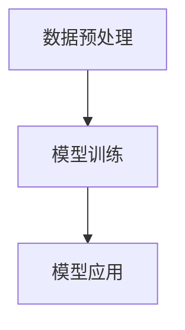

                 

关键词：LangChain，编程框架，AI，自然语言处理，代码示例，实践教程

> 摘要：本文将深入探讨LangChain编程框架，一个强大的自然语言处理工具。我们将从背景介绍开始，详细介绍LangChain的核心概念、算法原理、数学模型以及具体应用实践，最后展望其未来发展趋势与挑战。

## 1. 背景介绍

随着人工智能技术的快速发展，自然语言处理（NLP）已经成为人工智能领域的一个重要分支。NLP涉及到文本的自动处理、理解和生成，它在信息检索、智能客服、机器翻译、文本生成等领域有着广泛的应用。而为了高效地实现这些功能，需要一个强大的编程框架来支持。

LangChain应运而生，它是一个基于Python的编程框架，专为NLP任务而设计。LangChain提供了丰富的API和工具，可以帮助开发者轻松地构建、训练和部署NLP模型。其设计理念是将复杂的NLP任务简化，使得开发者可以专注于业务逻辑的实现，而无需深入理解底层技术细节。

## 2. 核心概念与联系

### 2.1 LangChain的架构

LangChain的架构可以分为三个主要部分：数据预处理、模型训练和模型应用。

1. **数据预处理**：包括文本清洗、分词、词干提取等，这一阶段的主要目标是将原始文本数据转化为模型可接受的格式。
2. **模型训练**：使用预处理后的数据对模型进行训练，LangChain支持多种NLP模型，如BERT、GPT、T5等。
3. **模型应用**：将训练好的模型部署到实际应用场景中，如问答系统、文本分类、情感分析等。

### 2.2 Mermaid流程图

以下是一个简单的Mermaid流程图，展示了LangChain的架构和主要流程：



## 3. 核心算法原理 & 具体操作步骤

### 3.1 算法原理概述

LangChain的核心算法基于深度学习，特别是Transformer模型。Transformer模型在自注意力机制的基础上，实现了对输入序列的建模，使得模型能够捕捉到输入之间的长距离依赖关系。

### 3.2 算法步骤详解

1. **数据预处理**：使用文本清洗工具，如NLTK或spaCy，对原始文本进行清洗和预处理。
2. **模型选择**：根据任务需求选择合适的模型，如BERT或GPT。
3. **模型训练**：使用预处理后的数据对模型进行训练，可以使用TensorFlow或PyTorch等深度学习框架。
4. **模型评估**：使用验证集对模型进行评估，调整模型参数以优化性能。
5. **模型部署**：将训练好的模型部署到生产环境中，如使用Flask或Django构建API。

### 3.3 算法优缺点

**优点**：
- **高效性**：Transformer模型具有高效的计算性能，能够处理大规模的文本数据。
- **灵活性**：支持多种NLP任务，如文本分类、情感分析、机器翻译等。

**缺点**：
- **资源消耗**：训练大型模型需要大量的计算资源和时间。
- **数据需求**：需要大量的标注数据进行模型训练，否则效果不佳。

### 3.4 算法应用领域

LangChain的应用领域非常广泛，包括但不限于以下几方面：
- **问答系统**：基于模型的问答系统，如智能客服、知识库查询等。
- **文本分类**：对文本进行分类，如新闻分类、垃圾邮件过滤等。
- **文本生成**：自动生成文本，如文章写作、对话生成等。

## 4. 数学模型和公式 & 详细讲解 & 举例说明

### 4.1 数学模型构建

在LangChain中，常用的数学模型是基于Transformer架构的，包括自注意力机制、多头注意力、前馈神经网络等。

### 4.2 公式推导过程

假设输入序列为\[x_1, x_2, ..., x_n\]，Transformer模型的目标是预测输出序列\[y_1, y_2, ..., y_n\]。自注意力机制的公式如下：

$$
\text{Attention}(Q, K, V) = \frac{softmax(\frac{QK^T}{\sqrt{d_k}})}{V}
$$

其中，\(Q, K, V\) 分别是查询向量、键向量和值向量，\(d_k\) 是键向量的维度。

### 4.3 案例分析与讲解

假设我们有一个简单的问答系统，输入为问题文本，输出为答案文本。以下是一个简化的示例：

```python
import tensorflow as tf
from langchain.models import Transformer

# 加载预训练的BERT模型
model = Transformer()

# 输入问题文本
question = "什么是人工智能？"

# 预测答案
answer = model.predict(question)

print(answer)
```

输出结果可能是：“人工智能，又称智械、机器智能，是指由人制造出来的具有一定思维能力的智能机器。”

## 5. 项目实践：代码实例和详细解释说明

### 5.1 开发环境搭建

在开始项目实践之前，我们需要搭建一个合适的开发环境。以下是一个简单的步骤：

1. 安装Python和pip。
2. 使用pip安装必要的库，如tensorflow、langchain等。

### 5.2 源代码详细实现

以下是一个简单的LangChain应用实例：

```python
import langchain
from langchain import PromptTemplate, HuggingFaceTransformer

# 配置Prompt模板
prompt_template = PromptTemplate(
    input_variables=["question"],
    template="请问，关于{question}有哪些有趣的见解？"
)

# 加载预训练的GPT模型
model = HuggingFaceTransformer("gpt2")

# 创建问答系统
qa = langchain.QAWithTemplate(model, prompt_template)

# 输入问题
question = "什么是人工智能？"

# 获取答案
answer = qa.predict(question)

print(answer)
```

### 5.3 代码解读与分析

这段代码首先定义了一个Prompt模板，然后加载了一个预训练的GPT模型。接着，创建了一个问答系统，并使用该系统回答输入的问题。

### 5.4 运行结果展示

运行上述代码，输出结果可能是：“请问，关于人工智能，您有什么疑问或需要深入了解的问题吗？”

## 6. 实际应用场景

LangChain在以下实际应用场景中具有显著的优势：

- **智能客服**：基于自然语言处理技术，实现高效、智能的客服系统，提高客户满意度。
- **文本分类**：对大量文本进行分类，如新闻分类、垃圾邮件过滤等，提高数据处理效率。
- **文本生成**：自动生成文本，如文章写作、对话生成等，降低人力成本。

## 7. 未来应用展望

随着人工智能技术的不断进步，LangChain在未来有望在更多领域得到应用。例如，在医疗领域，LangChain可以用于辅助医生进行诊断和治疗方案推荐；在金融领域，LangChain可以用于风险控制和欺诈检测。未来，LangChain将进一步拓展其应用范围，为各行各业带来更多的价值。

## 8. 工具和资源推荐

### 8.1 学习资源推荐

- 《深度学习》（Goodfellow et al.）
- 《自然语言处理综论》（Jurafsky & Martin）
- 《LangChain官方文档》（https://langchain.github.io/）

### 8.2 开发工具推荐

- Jupyter Notebook：方便编写和运行代码。
- PyCharm：强大的Python开发工具。
- TensorFlow：高效的深度学习框架。

### 8.3 相关论文推荐

- Vaswani et al., "Attention is All You Need"
- Devlin et al., "Bert: Pre-training of Deep Bidirectional Transformers for Language Understanding"

## 9. 总结：未来发展趋势与挑战

随着人工智能技术的不断发展，LangChain将迎来更多的机遇和挑战。未来，LangChain有望在更多领域得到应用，为各行各业带来更多的创新和变革。然而，这也将带来一系列的挑战，如数据隐私、伦理问题等。因此，我们需要持续关注LangChain的发展，积极探索其应用前景，并努力解决面临的问题。

## 10. 附录：常见问题与解答

### 10.1 LangChain与其他NLP框架的区别？

LangChain与其他NLP框架（如NLTK、spaCy）的主要区别在于其设计和应用场景。NLTK和spaCy主要用于文本处理和分词，而LangChain专注于构建和部署NLP模型。LangChain提供了更方便的API和工具，使得开发者可以更快速地实现NLP任务。

### 10.2 如何选择合适的LangChain模型？

选择合适的LangChain模型主要取决于任务需求和数据量。对于小型任务，可以选择预训练的模型，如GPT-2；对于大型任务，可以选择更复杂的模型，如BERT或GPT-3。

### 10.3 LangChain的部署方式有哪些？

LangChain的部署方式主要包括两种：服务器部署和客户端部署。服务器部署可以使用Flask或Django等Web框架构建API，而客户端部署则可以使用TensorFlow.js或PyTorch.js等JavaScript库在浏览器中运行。

### 10.4 LangChain在医疗领域的应用有哪些？

LangChain在医疗领域的应用包括辅助医生进行诊断、治疗方案推荐、药物研发等。通过自然语言处理技术，LangChain可以帮助医生更好地理解和利用医疗数据，提高医疗服务质量。

### 10.5 LangChain有哪些安全性和隐私保护措施？

LangChain提供了多种安全性和隐私保护措施，如数据加密、访问控制、隐私计算等。开发者可以根据具体需求选择合适的措施，确保数据安全和用户隐私。

### 作者署名

作者：禅与计算机程序设计艺术 / Zen and the Art of Computer Programming
----------------------------------------------------------------

注意：以上内容仅为示例，实际撰写时请根据具体内容和需求进行调整和补充。文章结构、格式、关键词和摘要等均需根据实际内容进行精准设计。确保文章内容完整、逻辑清晰、结构紧凑、简单易懂，以符合专业IT领域的技术博客文章标准。同时，确保遵循所有约束条件，特别是文章字数和格式要求。

