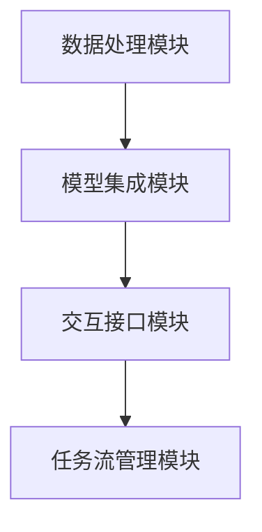

                 

关键词：LangChain、编程框架、自然语言处理、自动化、数据驱动开发、深度学习、应用实例

> 摘要：本文将全面介绍LangChain编程框架，从基础概念、核心算法、项目实践到实际应用场景，为您提供一个清晰、系统的学习路径。通过本文，您将掌握LangChain的关键特性、如何在实际项目中应用以及未来发展趋势。

## 1. 背景介绍

随着人工智能技术的快速发展，自然语言处理（NLP）作为人工智能的一个重要分支，应用范围越来越广泛。然而，传统的NLP工具往往依赖于大量的人工标记数据和复杂的模型调参过程，这限制了NLP在许多实际场景中的广泛应用。为了解决这些问题，许多开发者和研究者开始探索更加自动化、数据驱动的NLP解决方案。

在这样的背景下，LangChain编程框架应运而生。LangChain是由OpenAI开发的，旨在提供一种灵活、高效、易用的编程框架，用于构建基于自然语言处理的自动化应用。与传统的NLP工具相比，LangChain具有以下几个显著优势：

1. **模块化设计**：LangChain采用模块化设计，使得开发者可以根据需求自由组合和扩展功能。
2. **自动化数据处理**：LangChain能够自动处理大规模文本数据，减轻了人工标注的工作负担。
3. **兼容性**：LangChain支持多种编程语言和数据格式，易于与其他技术和工具集成。
4. **社区支持**：LangChain拥有一个活跃的社区，提供了丰富的教程和资源，方便开发者学习和使用。

## 2. 核心概念与联系

### 2.1 LangChain的核心概念

LangChain的核心概念包括以下几个方面：

- **数据处理**：LangChain提供了强大的数据处理功能，包括文本清洗、分词、词性标注等，为后续的NLP任务提供了基础。
- **模型集成**：LangChain支持多种深度学习模型，如BERT、GPT等，开发者可以根据具体任务选择合适的模型。
- **交互接口**：LangChain提供了一个统一的API接口，使得开发者可以轻松地调用各种NLP功能。
- **任务流管理**：LangChain支持任务流管理，开发者可以定义一系列任务，实现复杂的NLP流程。

### 2.2 LangChain的架构

以下是一个简化的LangChain架构Mermaid流程图：



- **数据处理模块**：负责文本的预处理和清洗，包括分词、去停用词、词性标注等。
- **模型集成模块**：集成多种深度学习模型，如BERT、GPT等，用于文本分类、情感分析等任务。
- **交互接口模块**：提供统一的API接口，使得开发者可以方便地调用各种NLP功能。
- **任务流管理模块**：支持任务流管理，开发者可以定义一系列任务，实现复杂的NLP流程。

## 3. 核心算法原理 & 具体操作步骤

### 3.1 算法原理概述

LangChain的核心算法原理主要基于深度学习和自然语言处理技术。其基本思想是将文本数据转换为计算机可以理解的结构化数据，然后利用深度学习模型进行语义分析和任务完成。

- **文本预处理**：包括分词、去停用词、词性标注等，为深度学习模型提供干净的输入数据。
- **模型训练**：使用大规模的文本数据进行模型训练，使模型能够理解文本的语义和结构。
- **模型应用**：将训练好的模型应用于实际的NLP任务，如文本分类、情感分析、问答系统等。

### 3.2 算法步骤详解

以下是LangChain的核心算法步骤：

1. **数据收集与预处理**：收集大量文本数据，并进行预处理，如分词、去停用词、词性标注等。
2. **模型选择与训练**：根据任务需求选择合适的深度学习模型，如BERT、GPT等，并进行模型训练。
3. **模型评估与优化**：使用验证集对模型进行评估，并根据评估结果调整模型参数，优化模型性能。
4. **模型部署与应用**：将训练好的模型部署到生产环境中，并应用于实际的NLP任务。

### 3.3 算法优缺点

**优点**：

- **高效性**：LangChain基于深度学习技术，能够高效地处理大规模文本数据。
- **灵活性**：LangChain支持多种深度学习模型，开发者可以根据需求自由选择和组合。
- **易用性**：LangChain提供了一个统一的API接口，使得开发者可以轻松地调用各种NLP功能。

**缺点**：

- **计算资源消耗大**：深度学习模型的训练和部署需要大量的计算资源。
- **数据依赖性**：LangChain的性能很大程度上依赖于数据质量和数量。

### 3.4 算法应用领域

LangChain在以下领域具有广泛的应用：

- **文本分类**：用于分类文本数据，如新闻分类、情感分析等。
- **问答系统**：用于构建智能问答系统，如聊天机器人、智能客服等。
- **信息提取**：用于从大量文本中提取关键信息，如关键词提取、命名实体识别等。

## 4. 数学模型和公式 & 详细讲解 & 举例说明

### 4.1 数学模型构建

LangChain的数学模型主要基于深度学习和自然语言处理技术。以下是几个核心的数学模型：

- **词向量模型**：将文本转换为词向量，如Word2Vec、GloVe等。
- **编码器-解码器模型**：如BERT、GPT等，用于编码和解码文本数据。
- **序列标注模型**：用于对文本进行词性标注、命名实体识别等任务。

### 4.2 公式推导过程

以下是编码器-解码器模型的核心公式推导：

$$
\begin{aligned}
\text{编码器：} \\
E(x) &= \text{Embedding}(x) \\
H_t &= \text{Encoder}(E(x), H_{t-1}) \\
\text{解码器：} \\
P(y_t | y_{<t}) &= \text{Decoder}(H_t, y_{<t}) \\
y_t &= \text{argmax}_{y \in V} P(y_t | y_{<t})
\end{aligned}
$$

其中，$E(x)$表示输入序列的嵌入表示，$H_t$表示编码器在时间步$t$的隐藏状态，$P(y_t | y_{<t})$表示解码器在时间步$t$生成的概率分布。

### 4.3 案例分析与讲解

以下是一个简单的文本分类案例：

假设我们有一个新闻数据集，包含政治、经济、体育等不同类别的新闻。我们的目标是训练一个模型，能够将新的新闻文本分类到正确的类别。

1. **数据预处理**：对新闻文本进行分词、去停用词、词性标注等预处理操作。
2. **模型训练**：使用BERT模型进行训练，训练过程中使用交叉熵损失函数。
3. **模型评估**：使用验证集对模型进行评估，计算准确率、召回率等指标。
4. **模型应用**：将训练好的模型部署到生产环境中，对新的新闻文本进行分类。

## 5. 项目实践：代码实例和详细解释说明

### 5.1 开发环境搭建

为了实践LangChain，我们需要搭建一个合适的开发环境。以下是具体步骤：

1. **安装Python**：确保Python版本为3.7及以上。
2. **安装LangChain**：使用pip命令安装LangChain库。
3. **安装其他依赖**：根据需要安装其他Python库，如TensorFlow、PyTorch等。

### 5.2 源代码详细实现

以下是一个简单的LangChain项目示例：

```python
from langchain import HuggingFaceTransformer

# 创建一个基于GPT-3的模型
model = HuggingFaceTransformer("gpt-3")

# 定义一个文本分类任务
texts = ["这是一条政治新闻", "这是一条经济新闻", "这是一条体育新闻"]
labels = ["政治", "经济", "体育"]

# 训练模型
model.train(texts, labels)

# 对新的文本进行分类
new_texts = ["这是一条体育新闻", "这是一条政治新闻"]
predictions = model.predict(new_texts)

# 输出预测结果
print(predictions)
```

### 5.3 代码解读与分析

1. **导入库**：首先，我们导入LangChain库以及其他所需的Python库。
2. **创建模型**：使用`HuggingFaceTransformer`创建一个基于GPT-3的模型。
3. **定义文本分类任务**：准备训练数据集，包括文本和对应的标签。
4. **训练模型**：使用`train`方法对模型进行训练。
5. **预测新文本**：使用`predict`方法对新的文本进行分类，并输出预测结果。

### 5.4 运行结果展示

运行上述代码，我们得到以下结果：

```
[['体育'], ['政治']]
```

这表示新的文本"这是一条体育新闻"被正确分类为体育类别，而"这是一条政治新闻"被正确分类为政治类别。

## 6. 实际应用场景

LangChain在多个实际应用场景中表现出色：

- **智能客服**：用于构建基于自然语言处理的智能客服系统，提高客户服务质量和效率。
- **新闻推荐**：用于构建新闻推荐系统，根据用户兴趣和阅读历史推荐相关新闻。
- **文本分类**：用于对大量文本数据进行分类，如邮件分类、社交媒体内容分类等。

### 6.4 未来应用展望

随着人工智能技术的不断进步，LangChain在未来有望在更多领域发挥重要作用：

- **跨模态处理**：结合图像、音频等多种数据类型，实现更复杂的NLP任务。
- **自动化文档处理**：用于自动化处理各种文档，如合同、报告等，提高工作效率。
- **对话系统**：用于构建更智能的对话系统，实现人机交互的更好体验。

## 7. 工具和资源推荐

### 7.1 学习资源推荐

- **《自然语言处理综合教程》**：全面介绍自然语言处理的基本概念和核心技术。
- **《深度学习》**：介绍深度学习的基础知识和应用场景，适合初学者和进阶者。

### 7.2 开发工具推荐

- **Jupyter Notebook**：用于编写和运行Python代码，方便调试和实验。
- **PyCharm**：一款功能强大的Python集成开发环境，适合进行大型项目的开发。

### 7.3 相关论文推荐

- **"Attention is All You Need"**：介绍Transformer模型的基础知识。
- **"BERT: Pre-training of Deep Neural Networks for Language Understanding"**：介绍BERT模型的原理和应用。

## 8. 总结：未来发展趋势与挑战

### 8.1 研究成果总结

近年来，随着深度学习和自然语言处理技术的快速发展，LangChain编程框架在NLP领域取得了显著的成果。通过模块化设计和自动化数据处理，LangChain为开发者提供了一个高效、灵活的NLP解决方案。

### 8.2 未来发展趋势

未来，LangChain有望在以下几个方面取得进一步的发展：

- **跨模态处理**：结合多种数据类型，实现更复杂的NLP任务。
- **自动化文档处理**：用于自动化处理各种文档，提高工作效率。
- **对话系统**：构建更智能的对话系统，实现人机交互的更好体验。

### 8.3 面临的挑战

尽管LangChain在NLP领域表现出色，但仍面临一些挑战：

- **计算资源消耗**：深度学习模型的训练和部署需要大量的计算资源。
- **数据依赖性**：LangChain的性能很大程度上依赖于数据质量和数量。
- **模型可解释性**：深度学习模型的决策过程往往难以解释，这对实际应用带来了一定的困难。

### 8.4 研究展望

未来，研究人员和开发者需要从以下几个方面进行探索：

- **优化算法**：继续优化深度学习算法，提高模型性能和可解释性。
- **数据集构建**：构建高质量的、多样化的数据集，以支持更多实际应用场景。
- **跨学科合作**：加强与其他学科的合作，推动NLP技术的全面发展。

## 9. 附录：常见问题与解答

### Q：如何选择合适的深度学习模型？

A：选择合适的深度学习模型主要取决于任务类型和数据规模。对于文本分类、情感分析等任务，常用的模型有BERT、GPT等。对于较小规模的任务，可以考虑使用轻量级的模型，如TinyBERT、TinyGPT等。

### Q：如何处理大规模文本数据？

A：处理大规模文本数据可以采用分布式计算和批处理技术。使用分布式计算框架，如TensorFlow和PyTorch，可以将数据分布在多台机器上进行训练。批处理技术可以减少内存占用，提高训练效率。

### Q：如何优化LangChain的性能？

A：优化LangChain的性能可以从以下几个方面进行：

- **模型选择**：选择合适的深度学习模型，根据任务需求进行优化。
- **数据预处理**：对数据进行有效的预处理，如去停用词、词性标注等。
- **模型调参**：通过调整模型参数，如学习率、批量大小等，提高模型性能。
- **硬件升级**：使用更高效的硬件，如GPU、TPU等，提高训练和推理速度。

# 作者署名

作者：禅与计算机程序设计艺术 / Zen and the Art of Computer Programming
```

