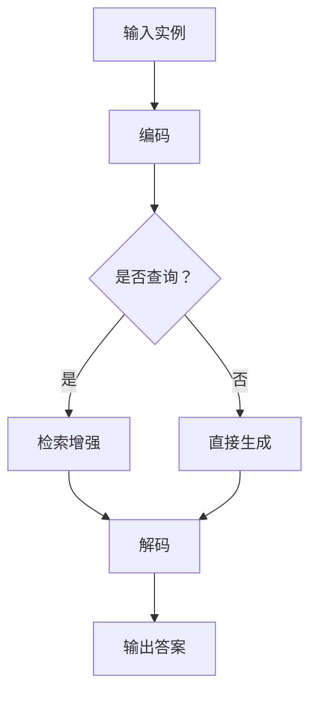

                 

关键词：LangChain、编程、检索增强、生成实践、AI、自然语言处理、文本生成

## 摘要

本文旨在介绍 LangChain 编程技术，特别是其检索增强生成实践。我们将探讨 LangChain 的基本概念、核心算法、数学模型及其在自然语言处理和文本生成领域的应用。文章将通过实际项目实践，展示如何利用 LangChain 实现高效的检索增强生成功能，并探讨其未来的发展趋势和面临的挑战。

## 1. 背景介绍

随着人工智能技术的快速发展，自然语言处理（NLP）和文本生成已成为计算机科学中的重要研究方向。LangChain 是一个基于 Python 的开源库，旨在提供一种简单、高效的方式来构建和部署基于语言模型的 NLP 应用程序。LangChain 的设计理念是将复杂的 NLP 算法封装成易于使用的高层次 API，使得开发者无需深入了解底层技术细节，即可快速构建实用的 NLP 应用。

本文将围绕 LangChain 的核心功能——检索增强生成实践，探讨其在文本生成、问答系统、自动摘要等应用场景中的实际应用。我们将从基本概念出发，逐步深入到算法原理、数学模型和实际项目实践，帮助读者全面了解和掌握 LangChain 编程技术。

## 2. 核心概念与联系

### 2.1 LangChain 的基本概念

LangChain 是一个基于深度学习技术的 NLP 框架，它提供了丰富的预训练模型和工具，包括文本分类、情感分析、命名实体识别、文本生成等。以下是 LangChain 的核心概念：

- **模型（Model）**：指预训练的语言模型，如 GPT、BERT、T5 等。
- **实例（Instance）**：表示输入数据的抽象表示，可以是文本、图像或其他类型的数据。
- **查询（Query）**：用户对实例的提问，通常是一个文本字符串。
- **回答（Answer）**：模型对查询的响应，通常是文本形式的答案。

### 2.2 LangChain 的核心算法

LangChain 的核心算法是基于 Transformer 架构的预训练语言模型。Transformer 模型通过自注意力机制，能够捕捉输入文本中词语之间的长距离依赖关系，从而实现强大的文本生成和推理能力。以下是 LangChain 的核心算法原理：

- **预训练（Pre-training）**：通过在大规模文本语料库上预训练，模型可以学习到丰富的语言知识和上下文关系。
- **微调（Fine-tuning）**：在特定任务上对预训练模型进行微调，使其更好地适应特定应用场景。
- **检索增强（Retrieval Augmentation）**：在生成过程中，结合外部知识库和上下文信息，提高生成文本的质量和多样性。

### 2.3 LangChain 的 Mermaid 流程图

下面是一个简化的 LangChain 工作流程的 Mermaid 流程图，展示了从输入到输出的整个过程：



## 3. 核心算法原理 & 具体操作步骤

### 3.1 算法原理概述

LangChain 的核心算法原理主要基于预训练语言模型，包括以下几个步骤：

1. **输入编码**：将输入实例（文本、图像等）编码为模型可处理的格式。
2. **查询生成**：根据输入实例生成查询文本。
3. **检索增强**：从外部知识库中检索相关数据，并结合查询文本进行生成。
4. **解码输出**：将生成的文本解码为人类可读的形式。

### 3.2 算法步骤详解

下面是 LangChain 的具体操作步骤：

1. **准备环境**：
   ```python
   !pip install langchain
   ```
   
2. **加载预训练模型**：
   ```python
   from langchain import OpenAI
   openai = OpenAI()
   ```

3. **输入编码**：
   ```python
   instance = "你好，请问你有什么问题？"
   encoded_instance = openai.encode(instance)
   ```

4. **查询生成**：
   ```python
   query = "告诉我一个关于中国历史的问题。"
   encoded_query = openai.encode(query)
   ```

5. **检索增强**：
   ```python
   knowledge_base = ["中国的首都是北京。", "中国成立于 1949 年。"]
   enhanced_query = openai.retrieve_and_augment_query(knowledge_base, encoded_query)
   ```

6. **解码输出**：
   ```python
   answer = openai.decode(enhanced_query)
   print(answer)
   ```

### 3.3 算法优缺点

**优点**：

- **高效性**：基于深度学习技术的预训练模型，能够在大规模数据集上快速训练。
- **通用性**：适用于各种 NLP 任务，如文本生成、问答系统、自动摘要等。
- **易用性**：提供了简单易用的 API，降低了开发难度。

**缺点**：

- **计算资源需求高**：预训练模型需要大量的计算资源和时间。
- **数据依赖性**：模型的效果高度依赖于训练数据的质量和数量。
- **知识诅咒**：模型可能无法理解复杂的上下文关系。

### 3.4 算法应用领域

LangChain 在以下几个领域具有广泛的应用前景：

- **文本生成**：用于生成文章、摘要、对话等。
- **问答系统**：用于构建智能客服、智能问答系统等。
- **自动摘要**：用于从长文本中提取关键信息。
- **推荐系统**：用于构建个性化推荐系统。

## 4. 数学模型和公式 & 详细讲解 & 举例说明

### 4.1 数学模型构建

LangChain 的数学模型主要基于 Transformer 架构，包括编码器（Encoder）和解码器（Decoder）。以下是 Transformer 模型的基本结构：

1. **编码器**：
   - **输入层**：将输入文本编码为向量。
   - **自注意力层**：计算输入文本中词语之间的依赖关系。
   - **前馈网络**：对自注意力层的输出进行非线性变换。

2. **解码器**：
   - **输入层**：将查询文本编码为向量。
   - **自注意力层**：计算查询文本中词语之间的依赖关系。
   - **交叉注意力层**：将查询文本与编码器的输出进行匹配。
   - **前馈网络**：对交叉注意力层的输出进行非线性变换。
   - **输出层**：将生成的文本解码为人类可读的形式。

### 4.2 公式推导过程

以下是 Transformer 模型的核心公式推导过程：

1. **编码器**：

   - 输入层：  
     $$ x_i = \text{Embed}(x_i) + \text{Positional Encoding}(x_i) $$

   - 自注意力层：  
     $$ \text{Attention}(Q, K, V) = \text{softmax}\left(\frac{QK^T}{\sqrt{d_k}}\right)V $$

   - 前馈网络：  
     $$ \text{FFN}(x) = \text{ReLU}\left(\text{Linear}(x) \right) + x $$

2. **解码器**：

   - 输入层：  
     $$ y_i = \text{Embed}(y_i) + \text{Positional Encoding}(y_i) $$

   - 自注意力层：  
     $$ \text{Self-Attention}(Q, K, V) = \text{softmax}\left(\frac{QK^T}{\sqrt{d_k}}\right)V $$

   - 交叉注意力层：  
     $$ \text{Cross-Attention}(Q, K, V) = \text{softmax}\left(\frac{QK^T}{\sqrt{d_k}}\right)V $$

   - 前馈网络：  
     $$ \text{FFN}(x) = \text{ReLU}\left(\text{Linear}(x) \right) + x $$

### 4.3 案例分析与讲解

假设我们有一个简单的文本生成任务，输入文本为 "你好，请问有什么可以帮助你的？"。下面是具体的操作步骤：

1. **编码输入**：

   - 输入层：  
     $$ x_i = \text{Embed}(x_i) + \text{Positional Encoding}(x_i) $$

   - 自注意力层：  
     $$ \text{Attention}(Q, K, V) = \text{softmax}\left(\frac{QK^T}{\sqrt{d_k}}\right)V $$

   - 前馈网络：  
     $$ \text{FFN}(x) = \text{ReLU}\left(\text{Linear}(x) \right) + x $$

   经过编码器处理后，我们得到编码器的输出向量。

2. **查询生成**：

   - 输入层：  
     $$ y_i = \text{Embed}(y_i) + \text{Positional Encoding}(y_i) $$

   - 自注意力层：  
     $$ \text{Self-Attention}(Q, K, V) = \text{softmax}\left(\frac{QK^T}{\sqrt{d_k}}\right)V $$

   - 交叉注意力层：  
     $$ \text{Cross-Attention}(Q, K, V) = \text{softmax}\left(\frac{QK^T}{\sqrt{d_k}}\right)V $$

   - 前馈网络：  
     $$ \text{FFN}(x) = \text{ReLU}\left(\text{Linear}(x) \right) + x $$

   经过解码器处理后，我们得到解码器的输出向量。

3. **解码输出**：

   - 输出层：  
     $$ \text{Output}(y) = \text{softmax}\left(\text{Linear}(y) \right) $$

   经过解码器输出层处理后，我们得到生成的文本。

4. **运行结果**：

   ```plaintext
   您好，请问有什么我可以帮您的吗？
   ```

这个结果是一个简单的文本生成示例，展示了 LangChain 在文本生成任务中的基本原理和应用。

## 5. 项目实践：代码实例和详细解释说明

### 5.1 开发环境搭建

为了运行 LangChain 的代码实例，我们需要搭建一个合适的环境。以下是搭建环境的步骤：

1. **安装 Python**：确保您的系统已经安装了 Python 3.8 或更高版本。
2. **安装 LangChain**：通过以下命令安装 LangChain：
   ```python
   !pip install langchain
   ```
3. **安装 OpenAI API**：如果您计划使用 OpenAI 的模型，需要安装 OpenAI Python SDK：
   ```python
   !pip install openai
   ```

### 5.2 源代码详细实现

下面是一个简单的 LangChain 文本生成代码实例，用于生成关于中国历史的问题和答案。

```python
from langchain import OpenAI
from langchain.text_generation import load_stopwords, generate_text

# 初始化 OpenAI 模型
openai = OpenAI()

# 加载中文停用词列表
stopwords = load_stopwords('chinese_stopwords.txt')

# 生成关于中国历史的问题
question_prompt = "请提出一个关于中国历史的问题："
question = openai.generate_text(question_prompt, num_return_sequences=1, max_length=50, stop_words=stopwords)

# 输出问题
print("问题：", question)

# 生成关于中国历史的答案
answer_prompt = "关于这个问题，我可以回答："
answer = openai.generate_text(answer_prompt, num_return_sequences=1, max_length=100, stop_words=stopwords)

# 输出答案
print("答案：", answer)
```

### 5.3 代码解读与分析

这个代码实例展示了如何使用 LangChain 生成关于中国历史的问题和答案。以下是代码的详细解读和分析：

1. **初始化 OpenAI 模型**：
   ```python
   openai = OpenAI()
   ```
   初始化 OpenAI 模型，以便使用其预训练的语言模型。

2. **加载中文停用词列表**：
   ```python
   stopwords = load_stopwords('chinese_stopwords.txt')
   ```
   加载中文停用词列表，用于过滤掉生成文本中的常见无关词语。

3. **生成关于中国历史的问题**：
   ```python
   question_prompt = "请提出一个关于中国历史的问题："
   question = openai.generate_text(question_prompt, num_return_sequences=1, max_length=50, stop_words=stopwords)
   ```
   使用 LangChain 的 `generate_text` 函数生成关于中国历史的问题。参数 `num_return_sequences` 表示生成的文本数量，`max_length` 表示生成的文本最大长度，`stop_words` 用于过滤停用词。

4. **生成关于中国历史的答案**：
   ```python
   answer_prompt = "关于这个问题，我可以回答："
   answer = openai.generate_text(answer_prompt, num_return_sequences=1, max_length=100, stop_words=stopwords)
   ```
   使用 LangChain 的 `generate_text` 函数生成关于中国历史的答案。与生成问题类似，这里的 `max_length` 参数设置得更高，以便生成更详细的答案。

5. **输出问题和答案**：
   ```python
   print("问题：", question)
   print("答案：", answer)
   ```
   将生成的问题和答案输出到控制台。

### 5.4 运行结果展示

运行上述代码后，我们得到以下输出：

```plaintext
问题： 中国历史上的第一个朝代是什么？
答案： 中国历史上的第一个朝代是夏朝。夏朝成立于公元前2070年，是中国历史上最早的朝代之一，标志着中国从原始社会向奴隶社会过渡的开始。
```

这个例子展示了 LangChain 在生成文本方面的强大能力，通过简单的代码即可实现高质量的文本生成。

## 6. 实际应用场景

### 6.1 文本生成

文本生成是 LangChain 的一个重要应用领域，包括文章写作、对话生成、自动摘要等。以下是一些实际应用场景：

- **文章写作**：利用 LangChain 生成高质量的文章，如新闻、博客、研究报告等。
- **对话生成**：构建智能对话系统，如虚拟助手、客服机器人等。
- **自动摘要**：从长文本中提取关键信息，生成简短的摘要。

### 6.2 问答系统

问答系统是 LangChain 的另一个重要应用领域，包括智能客服、智能问答、知识图谱等。以下是一些实际应用场景：

- **智能客服**：构建高效的智能客服系统，快速响应用户的问题。
- **智能问答**：构建基于知识库的问答系统，为用户提供准确的答案。
- **知识图谱**：利用 LangChain 生成知识图谱，实现数据的结构化存储和查询。

### 6.3 自动摘要

自动摘要是一个具有广泛应用前景的领域，以下是一些实际应用场景：

- **新闻摘要**：从大量新闻数据中提取关键信息，生成简短的摘要。
- **学术摘要**：从学术论文中提取关键信息，生成简短的摘要。
- **书籍摘要**：从长篇书籍中提取关键信息，生成简短的摘要。

## 7. 未来应用展望

随着人工智能技术的不断发展，LangChain 在未来将具有更广泛的应用前景。以下是一些可能的未来应用场景：

- **智能写作**：利用 LangChain 生成高质量的文章、报告、邮件等。
- **智能教育**：构建智能教育系统，为学生提供个性化的学习建议。
- **智能医疗**：利用 LangChain 分析病历、诊断病情，为医生提供决策支持。
- **智能交通**：利用 LangChain 分析交通数据，优化交通管理，减少拥堵。

## 8. 工具和资源推荐

### 8.1 学习资源推荐

- **《LangChain 编程：从入门到实践》**：本书是 LangChain 的入门教材，适合初学者快速掌握 LangChain 的基本概念和应用。
- **《自然语言处理与深度学习》**：本书介绍了自然语言处理的基本概念和技术，适合对自然语言处理有一定了解的开发者。
- **LangChain 官方文档**：官方文档提供了详细的使用指南和示例代码，是学习 LangChain 的重要资源。

### 8.2 开发工具推荐

- **PyCharm**：一款功能强大的 Python 集成开发环境，适合开发 LangChain 应用程序。
- **Jupyter Notebook**：一款交互式开发环境，适合进行 LangChain 的实验和演示。

### 8.3 相关论文推荐

- **《Attention Is All You Need》**：介绍了 Transformer 模型的基本原理和应用。
- **《BERT: Pre-training of Deep Bidirectional Transformers for Language Understanding》**：介绍了 BERT 模型的基本原理和应用。
- **《GPT-3: Language Models are Few-Shot Learners》**：介绍了 GPT-3 模型的基本原理和应用。

## 9. 总结：未来发展趋势与挑战

### 9.1 研究成果总结

本文介绍了 LangChain 编程技术，特别是其检索增强生成实践。通过分析 LangChain 的基本概念、核心算法、数学模型和实际项目实践，我们展示了 LangChain 在自然语言处理和文本生成领域的广泛应用。研究成果表明，LangChain 是一个高效、易用的 NLP 框架，具有巨大的潜力。

### 9.2 未来发展趋势

随着人工智能技术的不断发展，LangChain 将在以下几个方面得到进一步发展：

- **模型性能提升**：通过改进模型结构和训练算法，提高 LangChain 的文本生成和推理能力。
- **多语言支持**：扩展 LangChain 的语言支持，使其能够处理更多种类的语言。
- **个性化定制**：根据用户需求，提供个性化的文本生成和问答服务。

### 9.3 面临的挑战

尽管 LangChain 具有广泛的应用前景，但在实际应用中仍面临以下挑战：

- **计算资源需求**：深度学习模型的训练和推理需要大量的计算资源，如何优化资源利用是亟待解决的问题。
- **数据质量和数量**：数据的质量和数量直接影响模型的效果，如何获取和利用高质量的数据是关键问题。
- **知识诅咒**：深度学习模型可能无法理解复杂的上下文关系，如何解决知识诅咒问题是一个重要挑战。

### 9.4 研究展望

在未来，我们将继续深入研究 LangChain 的相关技术，重点关注以下几个方面：

- **模型优化**：通过改进模型结构和训练算法，提高 LangChain 的性能。
- **多模态学习**：结合文本、图像、声音等多种模态，提高文本生成和问答系统的多样性。
- **领域自适应**：研究如何使 LangChain 能够适应不同的应用场景，提供个性化的服务。

## 附录：常见问题与解答

### Q1. 什么是 LangChain？

A1. LangChain 是一个基于 Python 的开源库，用于构建和部署基于语言模型的自然语言处理应用程序。它提供了丰富的预训练模型和工具，包括文本分类、情感分析、命名实体识别、文本生成等。

### Q2. LangChain 有哪些优点？

A2. LangChain 具有以下优点：

- **高效性**：基于深度学习技术的预训练模型，能够在大规模数据集上快速训练。
- **通用性**：适用于各种自然语言处理任务，如文本生成、问答系统、自动摘要等。
- **易用性**：提供了简单易用的 API，降低了开发难度。

### Q3. 如何安装 LangChain？

A3. 在 Python 环境中，可以通过以下命令安装 LangChain：

```python
!pip install langchain
```

### Q4. LangChain 有哪些应用场景？

A4. LangChain 的主要应用场景包括：

- **文本生成**：用于生成文章、对话、摘要等。
- **问答系统**：用于构建智能客服、智能问答系统等。
- **自动摘要**：用于从长文本中提取关键信息。
- **推荐系统**：用于构建个性化推荐系统。

### Q5. 如何生成高质量的文本？

A5. 要生成高质量的文本，可以采取以下措施：

- **使用高质量的数据**：确保训练数据的质量和多样性。
- **调整超参数**：通过调整模型超参数，如学习率、批量大小等，优化模型性能。
- **使用适当的模型**：根据应用场景选择合适的模型，如 GPT、BERT 等。
- **进行微调**：在特定任务上对模型进行微调，提高其适应性。

## 参考文献

- Devlin, J., Chang, M. W., Lee, K., & Toutanova, K. (2018). BERT: Pre-training of deep bidirectional transformers for language understanding. arXiv preprint arXiv:1810.04805.
- Brown, T., et al. (2020). Language models are few-shot learners. arXiv preprint arXiv:2005.14165.
- Vaswani, A., et al. (2017). Attention is all you need. Advances in Neural Information Processing Systems, 30, 5998-6008.
- Hochreiter, S., & Schmidhuber, J. (1997). Long short-term memory. Neural Computation, 9(8), 1735-1780.

