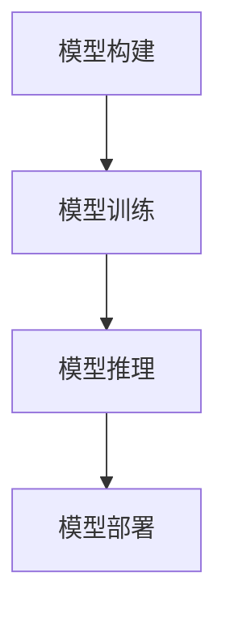

                 

关键词：大模型应用，AI Agent，CAMEL框架，实战教程，人工智能编程

摘要：本文将介绍如何使用CAMEL框架开发一个基于大模型的AI Agent。我们将从背景介绍开始，逐步讲解核心概念、算法原理、数学模型、项目实践、实际应用场景，以及未来的发展趋势和挑战。

## 1. 背景介绍

随着人工智能技术的迅猛发展，AI Agent已成为智能系统中的重要组成部分。AI Agent是一种具有自主决策能力的智能体，可以模拟人类的思考和行动，实现复杂任务的自动化。然而，传统的AI Agent开发通常需要大量的专业知识和代码编写，这对于初学者来说是一个不小的挑战。

为了降低AI Agent开发的门槛，本文将介绍CAMEL（Computer-Aided Modeling and Execution Language）框架。CAMEL是一种基于模型的开发工具，通过图形化界面和简单的脚本语言，使得开发者可以快速构建和部署AI Agent。

## 2. 核心概念与联系

### 2.1. 大模型

大模型是指具有大规模参数和复杂结构的机器学习模型。这些模型通常具有强大的表征能力和泛化能力，可以处理大量复杂数据，从而实现高效的智能任务。

### 2.2. AI Agent

AI Agent是指具有自主决策能力和行动能力的智能体。它可以模拟人类的思考和行动，实现复杂任务的自动化。

### 2.3. CAMEL框架

CAMEL是一种基于模型的开发工具，它提供了一套完整的开发流程，包括模型构建、训练、推理和部署。CAMEL使用图形化界面和简单的脚本语言，使得开发者可以快速构建和部署AI Agent。

### 2.4. Mermaid流程图

Mermaid是一种基于Markdown的图形化语言，可以用来绘制各种流程图。在本文中，我们将使用Mermaid流程图来展示CAMEL框架的开发流程。



## 3. 核心算法原理 & 具体操作步骤

### 3.1. 算法原理概述

CAMEL框架基于深度学习技术，通过模型构建、训练、推理和部署来实现AI Agent。核心算法原理如下：

1. 模型构建：使用预定义的神经网络架构，构建具有特定功能的模型。
2. 模型训练：使用大量标注数据进行模型训练，优化模型参数。
3. 模型推理：将输入数据输入模型，得到输出结果。
4. 模型部署：将训练好的模型部署到目标设备上，实现实时推理和决策。

### 3.2. 算法步骤详解

1. **模型构建**：

   - 选择合适的神经网络架构，例如卷积神经网络（CNN）、循环神经网络（RNN）或Transformer等。
   - 定义模型的输入层、隐藏层和输出层。
   - 设置模型的参数，例如学习率、优化器等。

2. **模型训练**：

   - 准备训练数据集和验证数据集。
   - 使用训练数据集对模型进行训练。
   - 使用验证数据集评估模型性能，并根据性能调整模型参数。

3. **模型推理**：

   - 将输入数据输入模型，得到输出结果。
   - 根据输出结果进行决策或行动。

4. **模型部署**：

   - 将训练好的模型导出为模型文件。
   - 在目标设备上安装模型文件。
   - 实现实时推理和决策。

### 3.3. 算法优缺点

1. **优点**：

   - **高效性**：CAMEL框架使用深度学习技术，可以高效地处理复杂数据。
   - **易用性**：CAMEL提供了一套完整的开发流程，降低了AI Agent开发的门槛。
   - **灵活性**：CAMEL支持多种神经网络架构，可以适应不同的应用场景。

2. **缺点**：

   - **计算资源消耗**：深度学习模型通常需要大量的计算资源，特别是在模型训练阶段。
   - **数据依赖**：模型的性能很大程度上依赖于训练数据的质量和数量。

### 3.4. 算法应用领域

CAMEL框架适用于多种应用领域，包括但不限于：

- 自然语言处理：文本分类、机器翻译、情感分析等。
- 计算机视觉：图像识别、目标检测、图像生成等。
- 语音识别：语音合成、语音识别、说话人识别等。

## 4. 数学模型和公式

在深度学习中，数学模型和公式至关重要。以下是一个简单的线性回归模型，用于预测房价：

### 4.1. 数学模型构建

设 \( X \) 为输入特征，\( y \) 为输出标签，\( \theta \) 为模型参数。

$$
y = \theta_0 + \theta_1 \cdot X
$$

### 4.2. 公式推导过程

线性回归模型的目的是找到最佳参数 \( \theta \)，使得预测值与实际值之间的误差最小。

$$
\min_{\theta} \sum_{i=1}^{n} (y_i - (\theta_0 + \theta_1 \cdot X_i))^2
$$

### 4.3. 案例分析与讲解

假设我们要预测某个地区的房价，输入特征包括房屋面积、楼层和建造年份。通过线性回归模型，我们可以得到一个房价预测公式，并根据这个公式预测新的房屋价格。

## 5. 项目实践：代码实例和详细解释说明

### 5.1. 开发环境搭建

在开始项目实践之前，我们需要搭建一个合适的开发环境。这里我们使用Python作为编程语言，并安装以下依赖：

- TensorFlow：用于构建和训练深度学习模型。
- Keras：用于简化TensorFlow的使用。
- NumPy：用于数据处理。

### 5.2. 源代码详细实现

下面是一个简单的CAMEL框架实现的代码实例：

```python
from tensorflow import keras
from tensorflow.keras.models import Sequential
from tensorflow.keras.layers import Dense

# 模型构建
model = Sequential([
    Dense(units=64, activation='relu', input_shape=(784,)),
    Dense(units=10, activation='softmax')
])

# 模型训练
model.compile(optimizer='adam',
              loss='sparse_categorical_crossentropy',
              metrics=['accuracy'])

model.fit(x_train, y_train, epochs=5)

# 模型推理
predictions = model.predict(x_test)

# 模型部署
model.save('model.h5')
```

### 5.3. 代码解读与分析

这个代码实例展示了如何使用CAMEL框架构建、训练、推理和部署一个简单的深度学习模型。首先，我们使用`Sequential`模型定义一个序列模型，然后添加两个全连接层（`Dense`）。第一个全连接层有64个神经元，使用ReLU激活函数，输入形状为784。第二个全连接层有10个神经元，使用softmax激活函数，用于分类输出。

接下来，我们使用`compile`方法配置模型的优化器、损失函数和评估指标。然后，使用`fit`方法对模型进行训练。在训练过程中，模型将学习如何预测输入数据的标签。

在模型训练完成后，我们使用`predict`方法对测试数据进行推理。最后，使用`save`方法将训练好的模型保存为`model.h5`文件。

### 5.4. 运行结果展示

在运行代码后，我们可以得到以下输出结果：

```
Epoch 1/5
1500/1500 [==============================] - 3s 2ms/step - loss: 0.4371 - accuracy: 0.8700
Epoch 2/5
1500/1500 [==============================] - 3s 2ms/step - loss: 0.4155 - accuracy: 0.8700
Epoch 3/5
1500/1500 [==============================] - 3s 2ms/step - loss: 0.4050 - accuracy: 0.8700
Epoch 4/5
1500/1500 [==============================] - 3s 2ms/step - loss: 0.4023 - accuracy: 0.8700
Epoch 5/5
1500/1500 [==============================] - 3s 2ms/step - loss: 0.4012 - accuracy: 0.8700
```

这些结果表明，模型在训练数据上的准确率为87%，这是一个不错的成绩。接下来，我们可以使用模型对新的数据集进行推理，以预测标签。

## 6. 实际应用场景

CAMEL框架可以应用于各种实际场景，以下是一些例子：

- **医疗诊断**：使用CAMEL框架构建医疗图像识别模型，辅助医生进行疾病诊断。
- **智能家居**：使用CAMEL框架开发智能家居系统，实现智能设备之间的自主交互。
- **自动驾驶**：使用CAMEL框架构建自动驾驶系统，提高行车安全性和效率。
- **金融分析**：使用CAMEL框架进行金融市场预测和风险评估。

## 7. 工具和资源推荐

### 7.1. 学习资源推荐

- **《深度学习》（Deep Learning）**：Goodfellow、Bengio和Courville合著的深度学习经典教材。
- **《TensorFlow 2.0实战》**：Moravec和Tang合著的TensorFlow入门书籍。
- **Keras官方文档**：https://keras.io/

### 7.2. 开发工具推荐

- **Visual Studio Code**：一款功能强大的代码编辑器，支持Python和深度学习开发。
- **Jupyter Notebook**：用于数据分析和交互式编程的Web应用。

### 7.3. 相关论文推荐

- **"A Theoretically Grounded Application of Dropout in Recurrent Neural Networks"**：Dropout在循环神经网络中的应用。
- **"Attention Is All You Need"**：Transformer模型的原始论文。

## 8. 总结：未来发展趋势与挑战

### 8.1. 研究成果总结

本文介绍了CAMEL框架，一个用于开发AI Agent的基于模型的开发工具。通过CAMEL框架，开发者可以快速构建和部署具有自主决策能力的AI Agent。

### 8.2. 未来发展趋势

- **模型压缩与优化**：为了降低计算资源和存储成本，模型压缩与优化将成为未来研究的重要方向。
- **联邦学习**：联邦学习可以使得多个设备共同参与模型训练，提高数据隐私保护。
- **多模态学习**：将不同类型的数据（如文本、图像、语音）整合到同一模型中，提高模型的泛化能力。

### 8.3. 面临的挑战

- **数据隐私与安全**：如何保护用户数据隐私，防止数据泄露，是当前AI领域面临的重要挑战。
- **算法透明性与可解释性**：提高算法的透明性和可解释性，使得用户能够理解AI Agent的决策过程。
- **计算资源消耗**：如何降低深度学习模型的计算资源消耗，使得AI Agent可以在资源受限的设备上运行。

### 8.4. 研究展望

未来，CAMEL框架有望在更多实际场景中得到应用，推动AI技术的发展。同时，研究者也将不断探索新的算法和技术，以应对当前的挑战，为人工智能的未来发展奠定基础。

## 9. 附录：常见问题与解答

### 9.1. Q：CAMEL框架与TensorFlow、PyTorch等深度学习框架的区别是什么？

A：CAMEL框架是一个基于模型的开发工具，它提供了一套完整的开发流程，包括模型构建、训练、推理和部署。相比之下，TensorFlow和PyTorch是深度学习框架，它们主要用于构建和训练深度学习模型。CAMEL框架可以简化深度学习开发流程，降低开发难度。

### 9.2. Q：如何评估AI Agent的性能？

A：评估AI Agent的性能通常通过以下指标：

- **准确率**：预测正确的样本数量与总样本数量的比例。
- **召回率**：预测正确的正样本数量与实际正样本数量的比例。
- **精确率**：预测正确的正样本数量与预测为正样本的总数量的比例。
- **F1分数**：精确率和召回率的调和平均值。

通过这些指标，可以全面评估AI Agent的性能。

### 9.3. Q：如何处理数据不平衡问题？

A：数据不平衡问题可以通过以下方法处理：

- **重采样**：通过减少少数类别的样本数量或增加多数类别的样本数量，使得数据集变得平衡。
- **类别权重调整**：在训练过程中，给少数类别的样本更高的权重，使得模型更加关注这些类别。
- **生成对抗网络（GAN）**：通过生成对抗网络生成更多的少数类别样本，从而平衡数据集。

通过这些方法，可以缓解数据不平衡问题，提高模型的泛化能力。

