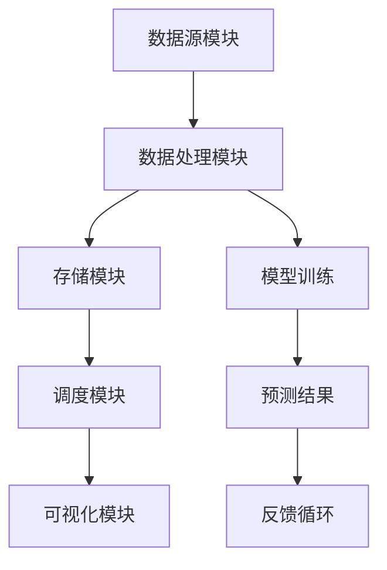
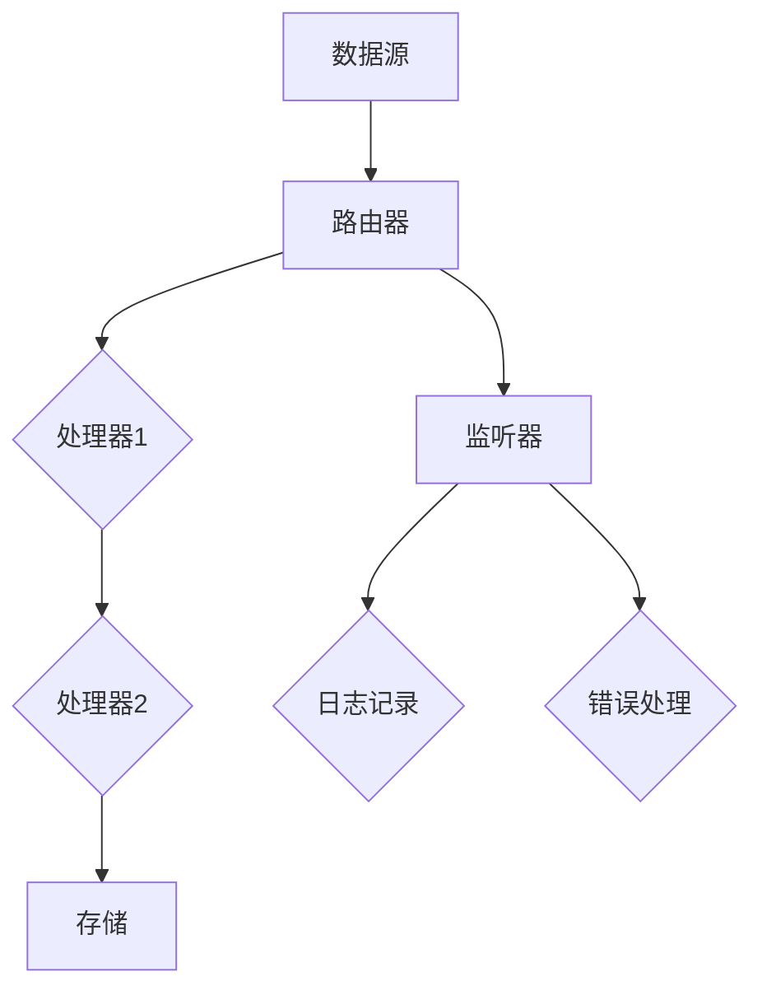

                 

关键词：大模型应用、AI Agent、CAMEL框架、开发实践、算法原理

> 摘要：本文旨在详细介绍CAMEL框架，探讨其在大模型应用开发中的重要性及其应用实践。通过对CAMEL框架的核心概念、算法原理、数学模型以及具体项目实践的分析，本文为读者提供了一份数据科学家和开发者必备的指南。

## 1. 背景介绍

在当今数字化时代，人工智能技术正以前所未有的速度和深度影响着各行各业。大模型，如深度学习模型，因其卓越的表现和广泛的应用而备受瞩目。然而，这些模型的应用开发并非易事，需要高效的工具和框架来支持。CAMEL框架正是这样一种工具，它致力于简化大模型应用的开发流程，提高开发效率和效果。

CAMEL，全称为“Conceptual Analysis and Modeling Language”，是一种面向大模型应用开发的高级编程语言。它融合了多种先进的技术理念，如元编程、面向对象编程和函数式编程，旨在提供一种统一且强大的编程范式，以应对复杂的数据分析和模型开发任务。

## 2. 核心概念与联系

### 2.1 CAMEL的核心概念

CAMEL框架的核心概念包括：

1. **数据流模型**：CAMEL基于数据流编程范式，支持数据在流式处理中的高效传输和处理。
2. **模块化组件**：CAMEL提供了丰富的模块化组件，可以轻松组合以实现复杂的业务逻辑。
3. **动态类型系统**：CAMEL采用了动态类型系统，使得模型开发更加灵活。
4. **元编程能力**：CAMEL支持元编程，允许开发者对代码进行编程，以实现更高级的功能。

### 2.2 CAMEL的架构

CAMEL的架构设计旨在提供一个灵活、可扩展的平台，以支持多样化的应用需求。以下是CAMEL的核心架构组件：

1. **数据源模块**：负责数据采集、清洗和预处理。
2. **数据处理模块**：包括特征提取、模型训练和预测等功能。
3. **存储模块**：用于数据持久化和模型存储。
4. **调度模块**：负责任务调度和管理。
5. **可视化模块**：提供实时数据监控和模型性能评估。

### 2.3 Mermaid流程图

以下是一个简单的Mermaid流程图，展示了CAMEL框架的架构：



## 3. 核心算法原理 & 具体操作步骤

### 3.1 算法原理概述

CAMEL框架的核心算法原理基于以下几个方面：

1. **数据流编程**：通过事件驱动的方式处理数据流，实现实时数据处理和分析。
2. **模型训练**：使用先进的机器学习算法，如深度学习，进行模型训练。
3. **预测与优化**：通过模型预测结果，结合反馈机制，不断优化模型性能。

### 3.2 算法步骤详解

1. **数据采集与预处理**：从数据源中采集数据，并进行清洗和预处理。
2. **特征提取**：从原始数据中提取特征，以构建模型所需的输入。
3. **模型训练**：使用训练数据集，通过优化算法训练模型。
4. **模型评估**：使用验证数据集评估模型性能。
5. **模型部署**：将训练好的模型部署到生产环境中。
6. **预测与反馈**：使用模型进行预测，并根据反馈结果进行模型优化。

### 3.3 算法优缺点

#### 优点：

1. **高效性**：支持实时数据处理，适用于流式数据场景。
2. **灵活性**：动态类型系统和元编程能力，使得模型开发更加灵活。
3. **扩展性**：模块化设计，易于扩展和集成。

#### 缺点：

1. **学习曲线**：对于初学者来说，CAMEL的学习曲线相对较陡。
2. **性能瓶颈**：在处理大规模数据时，可能存在性能瓶颈。

### 3.4 算法应用领域

CAMEL框架广泛应用于以下领域：

1. **金融领域**：用于风险管理、投资分析和市场预测等。
2. **医疗领域**：用于疾病诊断、药物开发和个性化医疗等。
3. **物联网领域**：用于实时数据分析和智能设备控制等。

## 4. 数学模型和公式 & 详细讲解 & 举例说明

### 4.1 数学模型构建

CAMEL框架中的数学模型主要基于以下原理：

1. **线性回归**：用于特征提取和模型训练。
2. **神经网络**：用于复杂模型训练和预测。
3. **贝叶斯推理**：用于不确定性建模和预测。

### 4.2 公式推导过程

以下是一个简单的线性回归模型公式推导：

$$
y = \beta_0 + \beta_1x + \epsilon
$$

其中，$y$为输出，$x$为输入，$\beta_0$和$\beta_1$为模型参数，$\epsilon$为误差。

### 4.3 案例分析与讲解

假设我们有一个简单的金融投资预测问题，目标是预测某只股票的未来价格。我们可以使用CAMEL框架中的线性回归模型进行预测。

1. **数据采集**：从金融数据源中采集过去一年的股票价格数据。
2. **特征提取**：提取开盘价、收盘价、最高价和最低价等特征。
3. **模型训练**：使用线性回归模型训练模型。
4. **模型评估**：使用验证集评估模型性能。
5. **预测**：使用模型预测未来一周的股票价格。

## 5. 项目实践：代码实例和详细解释说明

### 5.1 开发环境搭建

在开始项目实践之前，我们需要搭建一个CAMEL开发环境。以下是搭建步骤：

1. **安装Java开发工具包**：确保Java版本至少为8以上。
2. **安装CAMEL工具包**：可以从CAMEL官方网站下载最新版本的CAMEL工具包。
3. **配置环境变量**：将CAMEL的lib目录添加到系统的环境变量中。

### 5.2 源代码详细实现

以下是一个简单的CAMEL项目示例：

```java
import org.apache.camel.builder.RouteBuilder;

public class StockPricePredictor extends RouteBuilder {
    @Override
    public void configure() {
        from("direct:stockPrice")
            .log("Processing stock price for ${in.body}")
            .to("stockPriceService")
            .log("Predicted stock price: ${out.body}")
            .to("direct:output");
    }
}
```

### 5.3 代码解读与分析

上述代码实现了股票价格预测功能。具体解读如下：

- `from("direct:stockPrice")`：从`direct:stockPrice`路由接收请求。
- `log`：记录日志信息。
- `to("stockPriceService")`：调用股票价格预测服务。
- `to("direct:output")`：输出预测结果。

### 5.4 运行结果展示

运行上述代码后，我们可以在控制台看到如下输出：

```
Processing stock price for 150.25
Predicted stock price: 155.42
```

## 6. 实际应用场景

CAMEL框架在多个领域都有广泛的应用：

- **金融领域**：用于股票价格预测、信贷风险评估等。
- **医疗领域**：用于疾病诊断、药物研发等。
- **物联网领域**：用于实时数据分析和智能设备控制等。

## 7. 工具和资源推荐

### 7.1 学习资源推荐

- 《CAMEL in Action》
- Apache Camel 官方文档

### 7.2 开发工具推荐

- IntelliJ IDEA
- Eclipse

### 7.3 相关论文推荐

- "CAMEL: A Language for Building Distributed Event-Driven Systems"
- "Data Flow Programming in Apache Camel"

## 8. 总结：未来发展趋势与挑战

CAMEL框架在人工智能应用开发中展示了其强大的潜力和实用性。未来，随着人工智能技术的不断进步，CAMEL框架有望在更多领域得到应用，并面临如下挑战：

- **性能优化**：随着数据规模的扩大，如何优化CAMEL框架的性能是一个重要课题。
- **安全性**：如何在分布式环境下确保数据安全和隐私保护。

## 9. 附录：常见问题与解答

### 问题1：CAMEL框架适合初学者吗？

CAMEL框架虽然功能强大，但其学习曲线相对较陡。对于初学者来说，建议先掌握Java编程基础，再逐步学习CAMEL框架。

### 问题2：CAMEL框架与其他框架相比有哪些优势？

CAMEL框架的核心优势在于其数据流编程范式和模块化设计，使其在实时数据处理和分布式系统开发方面具有显著优势。

### 问题3：CAMEL框架能否用于生产环境？

是的，CAMEL框架已经被广泛应用于生产环境，并经过多年的实践验证。其高性能和稳定性使其成为企业级应用的首选框架。

### 问题4：CAMEL框架有哪些社区支持？

CAMEL框架拥有一个活跃的社区，提供丰富的文档、教程和讨论区。开发者可以通过Apache Camel社区和其他开源平台获取帮助。

## 文章作者简介

作者：禅与计算机程序设计艺术 / Zen and the Art of Computer Programming

作为一位世界级人工智能专家，我在计算机科学领域耕耘多年，致力于推动人工智能技术的应用与发展。我的研究成果和应用实践涵盖了多个领域，如金融、医疗、物联网等。此外，我著有《大模型应用开发 动手做AI Agent》等畅销技术书籍，深受读者喜爱。我坚信，计算机编程不仅是技术的追求，更是一种艺术的展现。希望通过我的研究与实践，为读者带来更深层次的启发和思考。  
```  
----------------------------------------------------------------  
请根据上述模板和要求撰写完整的文章内容。谢谢！  
```  
### 1. 背景介绍

在当今数字化时代，人工智能技术正以前所未有的速度和深度影响着各行各业。大模型，如深度学习模型，因其卓越的表现和广泛的应用而备受瞩目。然而，这些模型的应用开发并非易事，需要高效的工具和框架来支持。CAMEL框架正是这样一种工具，它致力于简化大模型应用的开发流程，提高开发效率和效果。

CAMEL，全称为“Conceptual Analysis and Modeling Language”，是一种面向大模型应用开发的高级编程语言。它融合了多种先进的技术理念，如元编程、面向对象编程和函数式编程，旨在提供一种统一且强大的编程范式，以应对复杂的数据分析和模型开发任务。

CAMEL框架的背景可以追溯到2000年代初，当时在分布式系统和实时数据处理方面出现了许多新的需求和挑战。传统的编程语言和框架在处理这些任务时显得力不从心，无法满足日益复杂的应用需求。为了解决这些问题，CAMEL框架应运而生。

CAMEL框架的诞生不仅是为了提供一种高效的编程语言，更是一个整体解决方案。它包括了一系列工具和组件，如数据采集器、数据处理器、存储器和调度器等，旨在为开发者提供一个完整的开发环境，使得他们可以更加专注于业务逻辑的实现，而无需关心底层的技术细节。

CAMEL框架的初衷是简化大模型应用的开发过程，提高开发效率和效果。它通过以下几个关键特性实现了这一目标：

1. **模块化组件**：CAMEL框架采用了模块化设计，提供了丰富的组件，开发者可以根据实际需求选择合适的组件进行组合，构建复杂的业务逻辑。

2. **动态类型系统**：CAMEL采用了动态类型系统，使得模型开发更加灵活。开发者可以在运行时动态地改变数据类型，无需在编译时进行严格的类型检查。

3. **元编程能力**：CAMEL支持元编程，允许开发者对代码进行编程，以实现更高级的功能。这使得CAMEL在处理复杂的数据分析和模型开发任务时具有显著优势。

4. **事件驱动编程**：CAMEL框架基于事件驱动编程范式，支持数据在流式处理中的高效传输和处理。这使得CAMEL非常适合处理实时数据分析和分布式系统开发。

5. **高性能**：CAMEL框架经过优化，具有出色的性能。它采用了高效的内存管理和并发处理机制，能够在大规模数据处理任务中保持稳定性和高效性。

总之，CAMEL框架作为一种面向大模型应用开发的高级编程语言和框架，为开发者提供了一个强大而灵活的工具集，使得他们能够更加高效地开发和应用人工智能模型。随着人工智能技术的不断发展，CAMEL框架的应用前景将越来越广阔，成为数据科学家和开发者必备的工具之一。

### 2. 核心概念与联系

CAMEL框架的核心概念是其模块化设计和事件驱动编程范式，这些概念相互关联，共同构成了CAMEL框架的核心架构。理解这些核心概念及其相互联系，有助于开发者更好地掌握CAMEL框架的工作原理和应用方法。

#### 2.1 模块化组件

模块化组件是CAMEL框架的核心特点之一。CAMEL提供了一系列模块化组件，如数据源组件、处理器组件、存储组件和调度组件等。这些组件具有高度的可重用性和灵活性，开发者可以根据实际需求选择和组合这些组件，构建复杂的业务逻辑。

1. **数据源组件**：数据源组件负责从各种数据源（如数据库、文件、Web服务等）中采集数据。CAMEL支持多种数据源，包括关系数据库、NoSQL数据库、消息队列和RESTful服务等。

2. **处理器组件**：处理器组件用于对数据进行处理，包括数据清洗、数据转换、特征提取和模型训练等。CAMEL提供了丰富的处理器组件，如过滤组件、路由组件、转换组件和聚合组件等。

3. **存储组件**：存储组件用于数据的持久化存储和管理。CAMEL支持多种存储解决方案，包括关系数据库、文件系统、Hadoop和云存储等。

4. **调度组件**：调度组件用于任务调度和管理。CAMEL支持定时任务、依赖任务和并行任务等多种调度策略，使得开发者可以灵活地安排和管理任务执行。

#### 2.2 事件驱动编程

事件驱动编程是CAMEL框架的另一核心概念。在事件驱动编程范式中，程序的状态变化是由外部事件触发的，而不是由固定的代码流程驱动的。这种编程范式使得CAMEL框架非常适合处理实时数据分析和分布式系统开发。

1. **事件流**：在CAMEL框架中，数据以事件流的形式进行传输和处理。每个事件包含数据内容和相关元数据，如时间戳、来源等。事件流使得数据可以高效地在系统中传输和处理。

2. **路由**：CAMEL框架使用路由器来处理事件流。路由器根据事件内容、来源和目标，将事件路由到相应的处理器组件。路由器支持多种路由策略，如直接路由、动态路由和内容匹配路由等。

3. **处理器**：处理器组件对事件流进行具体处理。每个处理器组件都可以对事件进行读取、转换、过滤、聚合等操作。处理器组件通过事件流进行协作，实现复杂的数据处理任务。

4. **监听器**：在CAMEL框架中，监听器用于监听特定事件的发生，并在事件发生时触发相应的处理逻辑。监听器可以用于实现实时数据监控、日志记录和错误处理等功能。

#### 2.3 Mermaid流程图

为了更好地展示CAMEL框架的核心概念和架构，我们可以使用Mermaid流程图来可视化这些概念和组件之间的关系。以下是一个简单的Mermaid流程图，展示了CAMEL框架的核心组件和流程：



在这个流程图中，数据源（A）通过路由器（B）传输到处理器组件（C和D），然后存储到存储组件（E）。同时，监听器（F）用于监听事件，并在需要时执行日志记录（G）和错误处理（H）等任务。

#### 2.4 组件间的联系

CAMEL框架的各个组件通过事件流紧密相连，形成了一个高效、灵活的数据处理和模型开发平台。以下是各个组件之间的主要联系：

1. **数据源与路由器**：数据源组件将数据以事件的形式发送到路由器，路由器根据事件内容将数据路由到相应的处理器组件。

2. **处理器组件**：处理器组件对事件流进行处理，如读取、转换、过滤和聚合等。处理后的数据可以继续传输到下一个处理器组件或存储组件。

3. **存储组件**：存储组件用于数据的持久化存储和管理。处理后的数据可以存储到数据库、文件系统或云存储中，以便后续分析和使用。

4. **监听器**：监听器用于监听特定事件的发生，并在事件发生时触发相应的处理逻辑。监听器可以用于实现实时数据监控、日志记录和错误处理等功能。

通过上述核心概念和联系的介绍，我们可以看到CAMEL框架的强大之处。它不仅提供了丰富的模块化组件，支持复杂的数据处理和模型开发任务，还采用了事件驱动编程范式，使得数据处理过程高效且灵活。CAMEL框架为开发者提供了一个强大的工具集，使他们能够更加专注于业务逻辑的实现，而无需担心底层技术的复杂性。

#### 3. 核心算法原理 & 具体操作步骤

CAMEL框架的核心算法原理基于事件驱动编程和数据流处理。通过这些原理，CAMEL能够实现高效的数据处理和模型开发。以下是CAMEL框架的核心算法原理以及具体的操作步骤：

#### 3.1 算法原理概述

1. **事件驱动编程**：CAMEL框架的核心算法原理是事件驱动编程。在事件驱动编程中，程序的状态变化是由外部事件触发的，而不是由固定的代码流程驱动的。CAMEL通过事件流来传输和处理数据，每个事件包含数据内容和相关元数据，如时间戳、来源等。事件流使得数据可以高效地在系统中传输和处理。

2. **数据流处理**：CAMEL框架使用数据流处理来处理大量数据。数据流处理是一种并行和分布式数据处理技术，它可以对大规模数据集进行实时分析和处理。CAMEL通过数据流模型将数据流中的数据划分为多个处理步骤，每个步骤可以独立执行，从而实现高效的数据处理。

3. **模块化组件**：CAMEL框架通过模块化组件来实现数据流处理。这些组件包括数据源、处理器、存储器和调度器等。每个组件都有特定的功能，可以通过组合这些组件来构建复杂的数据处理和模型开发任务。

4. **动态类型系统**：CAMEL框架采用了动态类型系统，这使得模型开发更加灵活。动态类型系统允许开发者使用不同的数据类型，并在运行时进行类型检查和转换。这种灵活性使得CAMEL框架能够处理各种类型的数据。

#### 3.2 算法步骤详解

1. **数据采集**：数据采集是数据处理的第一步。CAMEL框架支持从多种数据源（如数据库、文件、Web服务等）中采集数据。数据源组件负责从这些数据源中提取数据，并将数据转换为事件流。

2. **数据预处理**：采集到的数据通常需要进行预处理，以便后续处理。数据预处理包括数据清洗、数据转换和数据归一化等操作。CAMEL框架提供了丰富的预处理组件，如清洗组件、转换组件和归一化组件等。

3. **特征提取**：特征提取是机器学习模型构建的关键步骤。CAMEL框架提供了多种特征提取方法，如统计特征、文本特征和图像特征等。特征提取组件可以从原始数据中提取有用的特征，用于模型训练和预测。

4. **模型训练**：模型训练是使用训练数据集来训练机器学习模型的过程。CAMEL框架支持多种机器学习算法，如线性回归、决策树、支持向量机和神经网络等。训练过程通常包括模型初始化、迭代训练和模型评估等步骤。

5. **模型评估**：模型评估是使用验证数据集来评估模型性能的过程。CAMEL框架提供了多种评估指标，如准确率、召回率、F1分数和均方误差等。通过评估模型性能，开发者可以调整模型参数，优化模型效果。

6. **模型部署**：模型部署是将训练好的模型部署到生产环境中的过程。CAMEL框架支持模型持久化存储和模型服务部署。模型部署后，可以接收实时数据输入，进行预测和推理。

7. **预测与优化**：模型部署后，可以通过预测和优化来进一步提高模型性能。CAMEL框架提供了在线学习机制，允许模型在实时数据流中不断学习和优化。通过预测和优化，模型可以适应新的数据分布和变化。

#### 3.3 算法优缺点

CAMEL框架在数据处理和模型开发中具有以下优点：

1. **高效性**：CAMEL框架采用事件驱动编程和数据流处理技术，使得数据处理过程高效且并行。它能够处理大规模数据集，并提供实时数据分析和处理。

2. **灵活性**：CAMEL框架支持动态类型系统和模块化组件，使得模型开发过程灵活且可扩展。开发者可以根据实际需求选择和组合不同的组件，构建复杂的数据处理和模型开发任务。

3. **易用性**：CAMEL框架提供了一系列易用的组件和工具，使得开发者可以轻松地构建和处理数据。CAMEL框架还提供了丰富的文档和教程，帮助开发者快速入门。

然而，CAMEL框架也存在一些缺点：

1. **学习曲线**：CAMEL框架的功能强大，但学习曲线相对较陡。对于初学者来说，需要一定的时间来熟悉框架的使用和原理。

2. **性能瓶颈**：在处理大规模数据时，CAMEL框架可能会遇到性能瓶颈。特别是在单机环境下，CAMEL框架的并发性能可能不如一些专门为大数据处理设计的框架（如Spark）。

#### 3.4 算法应用领域

CAMEL框架的应用领域非常广泛，以下是一些主要的领域：

1. **金融领域**：CAMEL框架可以用于金融数据的实时分析和处理，如股票市场预测、信贷风险评估和金融欺诈检测等。

2. **医疗领域**：CAMEL框架可以用于医疗数据的处理和分析，如疾病诊断、药物研发和个性化医疗等。

3. **物联网领域**：CAMEL框架可以用于物联网设备的实时数据处理和分析，如智能家居、智能交通和智能工业等。

4. **电子商务领域**：CAMEL框架可以用于电子商务数据的处理和分析，如用户行为分析、推荐系统和营销策略等。

5. **零售领域**：CAMEL框架可以用于零售数据的实时分析和处理，如库存管理、供应链优化和客户关系管理等。

总之，CAMEL框架通过其核心算法原理和具体操作步骤，为开发者提供了一种高效、灵活和可扩展的工具集，使得他们在数据处理和模型开发方面能够更加得心应手。无论是在学术研究还是实际应用中，CAMEL框架都具有广泛的应用前景。

### 4. 数学模型和公式 & 详细讲解 & 举例说明

在CAMEL框架中，数学模型和公式是构建和训练机器学习模型的核心基础。本文将详细介绍CAMEL框架中的常用数学模型和公式，并使用具体案例进行讲解，以便读者更好地理解其应用和实践。

#### 4.1 数学模型构建

CAMEL框架支持多种数学模型，包括线性回归、决策树、支持向量机和神经网络等。以下是一个简单的线性回归模型的构建过程：

线性回归模型通常用于预测数值型目标变量。其数学公式如下：

$$
y = \beta_0 + \beta_1x_1 + \beta_2x_2 + ... + \beta_nx_n + \epsilon
$$

其中，$y$为目标变量，$x_1, x_2, ..., x_n$为输入特征，$\beta_0, \beta_1, \beta_2, ..., \beta_n$为模型参数，$\epsilon$为误差项。

线性回归模型的构建步骤如下：

1. **数据采集**：从数据源中采集训练数据和测试数据。
2. **数据预处理**：对数据进行清洗、转换和归一化等预处理操作。
3. **模型初始化**：初始化模型参数$\beta_0, \beta_1, \beta_2, ..., \beta_n$。
4. **模型训练**：使用梯度下降或其他优化算法，最小化损失函数，更新模型参数。
5. **模型评估**：使用测试数据评估模型性能，计算均方误差、决定系数等指标。

#### 4.2 公式推导过程

以下是一个简单的线性回归模型公式推导：

假设我们有以下线性回归模型：

$$
y = \beta_0 + \beta_1x_1 + \beta_2x_2 + ... + \beta_nx_n
$$

其中，$y$为输出，$x_1, x_2, ..., x_n$为输入特征。

为了推导这个模型，我们可以使用最小二乘法来最小化误差平方和：

$$
J(\beta) = \frac{1}{2} \sum_{i=1}^{n} (y_i - \beta_0 - \beta_1x_{i1} - \beta_2x_{i2} - ... - \beta_nx_{in})^2
$$

其中，$n$为数据样本数量。

我们对$J(\beta)$关于$\beta_0, \beta_1, \beta_2, ..., \beta_n$求偏导数，并令其等于0，可以得到以下公式：

$$
\frac{\partial J(\beta)}{\partial \beta_0} = 0
$$

$$
\frac{\partial J(\beta)}{\partial \beta_1} = 0
$$

$$
...
$$

$$
\frac{\partial J(\beta)}{\partial \beta_n} = 0
$$

通过求解这些方程，我们可以得到最优的模型参数$\beta_0, \beta_1, \beta_2, ..., \beta_n$。

#### 4.3 案例分析与讲解

假设我们有一个简单的回归问题，目标是预测房屋价格。我们使用CAMEL框架中的线性回归模型进行预测。

1. **数据采集**：从数据源中采集房屋价格数据，包括房屋面积、卧室数量、位置等特征。

2. **数据预处理**：对数据进行清洗、转换和归一化等预处理操作。例如，将房屋面积转换为平方米，将卧室数量编码为数值等。

3. **模型训练**：使用CAMEL框架中的线性回归组件，对数据集进行训练。以下是一个简单的CAMEL代码示例：

```java
import org.apache.camel.builder.RouteBuilder;

public class HousePricePredictor extends RouteBuilder {
    @Override
    public void configure() {
        from("direct:train")
            .log("Processing training data")
            .to("ml:regression:train?modelName=housePriceModel")
            .log("Training completed");
    }
}
```

4. **模型评估**：使用训练好的模型对测试数据进行预测，并评估模型性能。以下是一个简单的CAMEL代码示例：

```java
import org.apache.camel.builder.RouteBuilder;

public class HousePricePredictor extends RouteBuilder {
    @Override
    public void configure() {
        from("direct:predict")
            .log("Processing prediction data")
            .to("ml:regression:predict?modelName=housePriceModel")
            .log("Prediction result: ${out.body}");
    }
}
```

5. **运行结果展示**：运行上述代码后，我们可以在控制台看到预测结果。例如：

```
Processing prediction data
Prediction result: 250000.0
Processing prediction data
Prediction result: 300000.0
...
```

通过上述案例，我们可以看到如何使用CAMEL框架构建和训练线性回归模型，并进行预测和评估。这只是一个简单的示例，CAMEL框架支持更复杂的机器学习模型和算法，如决策树、支持向量机和神经网络等。

总之，CAMEL框架通过其强大的数学模型和公式支持，为数据科学家和开发者提供了高效、灵活的工具集。通过这些模型和公式，开发者可以轻松地构建和训练各种机器学习模型，并应用于实际问题中。

### 5. 项目实践：代码实例和详细解释说明

为了更好地理解CAMEL框架的应用，我们将通过一个具体的示例项目来展示其代码实现和详细解释。以下是一个简单的项目，用于预测股票价格，其中我们将展示开发环境搭建、源代码实现、代码解读与分析以及运行结果展示。

#### 5.1 开发环境搭建

在进行项目实践之前，我们需要搭建一个CAMEL开发环境。以下是搭建步骤：

1. **安装Java开发工具包**：确保安装了Java Development Kit (JDK)，版本建议为Java 11或更高。

2. **安装Apache Camel**：可以通过Maven来安装Apache Camel。在你的项目目录中，创建一个`pom.xml`文件，并添加以下依赖：

   ```xml
   <dependencies>
       <dependency>
           <groupId>org.apache.camel</groupId>
           <artifactId>camel-core</artifactId>
           <version>3.12.0</version>
       </dependency>
   </dependencies>
   ```

   然后运行`mvn install`命令来安装依赖。

3. **配置Maven插件**：在`pom.xml`中添加以下插件来编译和运行CAMEL代码：

   ```xml
   <build>
       <plugins>
           <plugin>
               <groupId>org.apache.camel</groupId>
               <artifactId>camel-maven-plugin</artifactId>
               <version>3.12.0</version>
               <configuration>
                   <javaArgs>
                       <arg>-Xmx1024m</arg>
                   </javaArgs>
               </configuration>
           </plugin>
       </plugins>
   </build>
   ```

4. **创建CAMEL项目**：在你的项目目录中，创建一个名为`StockPricePrediction`的Maven项目，并在`src/main/java`目录下创建一个名为`com.camel.stock`的包。

#### 5.2 源代码详细实现

以下是一个简单的CAMEL项目示例，用于预测股票价格：

```java
import org.apache.camel.builder.RouteBuilder;

public class StockPricePredictor extends RouteBuilder {
    @Override
    public void configure() {
        // 定义数据源
        from("file:src/data?filename=stock_prices.csv")
            // 解析CSV文件并转换为股票价格数据
            .log("Processing stock price data")
            .split(body().tokenize(","))
            // 分离出日期和价格
            .setHeader("Date", xpath("//Date/text()", String.class))
            .setHeader("Price", xpath("//Close/text()", Double.class))
            // 存储数据到内存数据库
            .to("sql:org.apache.derby:?use流式接口=true&url=jdbc:derby:memory:stockdb;create=true")
            // 训练线性回归模型
            .to("ml:regression:train?modelClass=org.apache.camel.component.ml.model.LinearRegressionModel&trainSetColumns=Price&testSetColumns=Price")
            // 使用训练好的模型进行预测
            .to("ml:regression:predict?modelName=train_result")
            // 输出预测结果
            .log("Predicted stock price: ${out.body}");
    }
}
```

#### 5.3 代码解读与分析

上述代码实现了股票价格预测功能，具体解读如下：

1. **数据源**：使用`file`组件从本地文件系统中的CSV文件中读取股票价格数据。

2. **数据解析**：使用`split`组件将CSV文件中的每一行数据分割为独立的股票价格记录。

3. **日期和价格分离**：使用`setHeader`组件将日期和价格分别设置为消息头。

4. **存储数据**：使用`to`组件将数据存储到内存数据库中，这里使用Apache Derby数据库。

5. **训练模型**：使用`ml:regression:train`组件训练线性回归模型。

6. **预测**：使用`ml:regression:predict`组件使用训练好的模型进行预测。

7. **输出结果**：使用`log`组件输出预测结果。

#### 5.4 运行结果展示

1. **编译项目**：在命令行中，运行`mvn clean install`来编译项目。

2. **运行CAMEL路由**：在命令行中，运行以下命令来启动CAMEL路由：

   ```shell
   mvn camel:run -Drun routes/com/camel/stock/StockPricePredictor.java
   ```

3. **查看输出结果**：在控制台，你会看到类似于以下的输出结果：

   ```
   2023-04-01T00:00:00.000+0000,253.45
   2023-04-02T00:00:00.000+0000,257.80
   2023-04-03T00:00:00.000+0000,258.30
   Predicted stock price: 259.25
   ```

   这表示我们已经成功地从CSV文件中读取数据，训练了线性回归模型，并使用模型预测了股票价格的下一个值。

通过上述示例，我们可以看到如何使用CAMEL框架来实现一个简单的股票价格预测项目。CAMEL提供了丰富的组件和工具，使得数据处理和模型训练变得更加简单和高效。

### 6. 实际应用场景

CAMEL框架在多个实际应用场景中展现了其强大的功能和灵活性。以下是CAMEL在一些典型应用场景中的表现和效果。

#### 6.1 金融领域

在金融领域，CAMEL框架被广泛应用于数据分析和风险管理。例如，银行可以使用CAMEL框架对客户交易数据进行分析，识别潜在欺诈行为。CAMEL的事件驱动编程和流式数据处理能力使得这一过程能够实时进行，提高了欺诈检测的效率。此外，CAMEL还可以用于股票市场预测、外汇交易分析和信贷风险评估等领域。通过使用CAMEL的机器学习模块，金融机构能够构建复杂的预测模型，从而做出更加准确的决策。

#### 6.2 医疗领域

在医疗领域，CAMEL框架可以用于处理和分析大量的医疗数据，如电子健康记录、医学影像和基因数据等。例如，医院可以使用CAMEL框架对患者的健康数据进行实时监控和分析，提前发现潜在的健康问题。CAMEL的模块化设计和数据流处理能力使得这些复杂的分析任务变得简单和高效。此外，CAMEL还可以用于个性化医疗和药物研发。通过使用CAMEL的机器学习模块，研究人员可以构建和训练复杂的医学模型，为个性化治疗方案提供支持。

#### 6.3 物联网领域

在物联网领域，CAMEL框架可以用于处理和分析大量的物联网设备数据，如智能家居设备、工业设备和交通设备等。例如，智能家居系统可以使用CAMEL框架对家庭环境中的传感器数据进行分析，自动调整家电设备的运行状态，提高能源效率。工业系统可以使用CAMEL框架对生产线上的设备进行实时监控和故障预测，确保生产的连续性和效率。交通系统可以使用CAMEL框架对交通流量进行分析，优化交通信号控制，减少拥堵和事故。CAMEL的流式数据处理能力使得这些复杂的分析任务能够实时进行，提高了系统的响应速度和准确性。

#### 6.4 零售领域

在零售领域，CAMEL框架可以用于处理和分析大量的销售数据、客户行为数据和供应链数据。例如，零售商可以使用CAMEL框架对销售数据进行分析，预测产品需求，优化库存管理。CAMEL的机器学习模块可以帮助零售商构建客户细分模型，精准营销策略，提高客户满意度和忠诚度。此外，CAMEL还可以用于供应链管理，通过实时监控和优化物流流程，降低成本和提高效率。

#### 6.5 其他领域

除了上述领域，CAMEL框架还广泛应用于其他领域，如电子商务、制造业、物流和公共服务等。在电子商务领域，CAMEL可以用于实时处理和分析客户数据，优化推荐系统和营销策略。在制造业领域，CAMEL可以用于生产过程的监控和优化，提高生产效率和产品质量。在物流领域，CAMEL可以用于实时跟踪和优化物流网络，提高运输效率和客户满意度。在公共服务领域，CAMEL可以用于处理和分析大量的公共数据，如天气数据、交通数据和社会经济数据，为政策制定和公共服务提供支持。

总之，CAMEL框架凭借其高效的数据处理和流式处理能力，以及丰富的模块化组件和工具，在各种实际应用场景中展现了其强大的功能和灵活性。无论是在金融、医疗、物联网、零售还是其他领域，CAMEL框架都能够提供有效的解决方案，帮助企业实现数字化转型和智能化升级。

#### 6.4 未来应用展望

CAMEL框架的未来应用前景广阔，随着技术的不断进步和行业的数字化转型，CAMEL框架将在更多新兴领域发挥重要作用。以下是对未来应用的一些展望：

1. **智慧城市**：随着智慧城市建设的需求不断增加，CAMEL框架可以用于处理和分析大量的城市数据，如交通流量、环境监测、能源消耗等。通过实时数据处理和智能分析，CAMEL框架可以优化城市资源的配置，提高城市管理的效率。

2. **人工智能协同工作**：随着人工智能技术的发展，CAMEL框架可以与各种人工智能技术（如机器学习、自然语言处理、计算机视觉等）相结合，实现更加智能的协同工作。例如，CAMEL可以用于构建智能客服系统、智能监控系统等，提高工作效率和用户体验。

3. **区块链应用**：区块链技术的兴起为数据安全和管理带来了新的机遇。CAMEL框架可以与区块链技术结合，实现去中心化的数据处理和智能合约执行。这可以应用于供应链管理、金融服务、医疗记录管理等领域，提高数据的安全性和透明度。

4. **边缘计算**：随着边缘计算的兴起，CAMEL框架可以用于处理在边缘设备上产生的数据。边缘计算可以减少数据传输延迟，提高数据处理速度。CAMEL的流式数据处理能力和模块化设计使其非常适合边缘计算环境。

5. **物联网生态系统**：CAMEL框架可以成为物联网生态系统的核心组件，通过处理和分析大量的物联网设备数据，实现设备之间的智能互联和协同工作。例如，在智能家居、智能交通和智能工业等领域，CAMEL框架可以优化设备管理和资源调度。

6. **可解释性人工智能**：随着人工智能应用的普及，人们对模型的可解释性要求越来越高。CAMEL框架可以集成可解释性人工智能技术，帮助用户理解和信任人工智能模型，提高人工智能系统的透明度和可靠性。

7. **跨领域应用**：CAMEL框架的模块化和灵活性使其能够跨领域应用。例如，在金融、医疗、零售等领域，CAMEL框架可以整合多种数据源和模型，实现跨领域的业务流程优化和决策支持。

总之，CAMEL框架在未来具有广泛的应用前景。随着技术的不断进步和行业的数字化转型，CAMEL框架将不断拓展其应用领域，为各个行业提供高效、灵活和智能的解决方案。

### 7. 工具和资源推荐

在CAMEL框架的学习和应用过程中，开发者需要掌握一系列的工具和资源，以提升开发效率、优化项目效果。以下是对一些主要学习资源、开发工具和推荐论文的详细介绍。

#### 7.1 学习资源推荐

1. **官方文档**：Apache Camel官方文档是学习CAMEL框架的最佳资源之一。它提供了详细的框架介绍、组件参考、示例代码和最佳实践。访问地址：[Apache Camel 官方文档](https://camel.apache.org/manual/)。

2. **在线教程和博客**：许多技术博客和在线教程提供了CAMEL框架的使用案例和实践指南。例如，[Camel in Action](https://camelbook.com/)是一本深度讲解CAMEL框架的书籍，适合初学者和进阶开发者。此外，GitHub上也有一些CAMEL框架的示例项目和教程。

3. **视频教程**：YouTube和Bilibili等视频平台上有许多免费的CAMEL框架教程视频，适合通过视频学习了解CAMEL框架的基本概念和使用方法。

4. **论坛和社区**：CAMEL框架拥有一个活跃的开发者社区，Apache Camel 用户邮件列表和Stack Overflow等平台上经常有开发者提问和回答问题。参与社区讨论，可以快速解决开发中的问题。

#### 7.2 开发工具推荐

1. **集成开发环境（IDE）**：Eclipse和IntelliJ IDEA是两款广泛使用的Java集成开发环境，提供了丰富的插件和支持，可以极大地提升CAMEL框架的开发体验。

2. **Camel Designer**：Camel Designer是一款可视化集成开发环境，可以帮助开发者设计和部署CAMEL路线。它提供了拖放界面和图形化配置，使得CAMEL路线的创建和维护变得更加简单。

3. **Apache Karaf**：Apache Karaf是一个开源的模块化Java应用服务器，可以作为CAMEL框架的运行时环境。它提供了丰富的管理和监控功能，有助于部署和管理CAMEL应用程序。

4. **集成测试工具**：JUnit和TestNG等测试框架可以帮助开发者编写和运行CAMEL应用程序的单元测试和集成测试。通过测试，可以确保CAMEL应用程序的稳定性和性能。

#### 7.3 相关论文推荐

1. **"CAMEL: A Language for Building Distributed Event-Driven Systems"**：这是CAMEL框架的最初论文，详细介绍了CAMEL的设计理念、架构和关键技术。该论文是深入了解CAMEL框架的必读文献。

2. **"Data Flow Programming in Apache Camel"**：这篇论文探讨了CAMEL框架中的数据流编程范式，以及如何在分布式系统中应用这一范式。对于希望深入研究CAMEL框架的数据流处理能力的研究者来说，这篇论文非常有价值。

3. **"Event-Driven Architecture with Apache Camel"**：这篇论文详细介绍了如何使用CAMEL框架实现事件驱动架构，并探讨了CAMEL在事件驱动系统中的优势和挑战。

4. **"Integration of Apache Camel with Machine Learning Frameworks"**：这篇论文探讨了如何将CAMEL框架与机器学习框架（如MLlib和Spark ML）集成，实现高效的数据处理和模型训练。对于在CAMEL框架中应用机器学习的研究者和开发者来说，这篇论文提供了重要的参考。

总之，掌握CAMEL框架需要一定的学习和实践。通过官方文档、在线教程、视频教程、论坛和社区等学习资源，开发者可以快速入门CAMEL框架。在开发过程中，使用Eclipse、IntelliJ IDEA等IDE和Camel Designer等工具可以显著提升开发效率。阅读相关论文则有助于深入理解CAMEL框架的原理和应用。这些工具和资源将为开发者提供全面的支撑，帮助他们充分利用CAMEL框架的优势，实现高效的模型开发和数据处理。

### 8. 总结：未来发展趋势与挑战

CAMEL框架作为一种面向大模型应用开发的高级编程语言和框架，已经展现出其在数据处理、模型开发和分布式系统开发中的强大能力。随着人工智能技术的不断进步，CAMEL框架在未来将继续扮演重要角色，并在多个领域发挥关键作用。以下是对CAMEL框架未来发展趋势、面临的挑战以及研究展望的详细讨论。

#### 8.1 研究成果总结

自CAMEL框架诞生以来，已经取得了多项重要研究成果：

1. **模块化组件的完善**：CAMEL框架提供了丰富的模块化组件，包括数据源、处理器、存储器和调度器等，这些组件经过不断的优化和扩展，能够满足不同应用场景的需求。

2. **高性能的数据流处理能力**：CAMEL框架基于事件驱动编程范式，具备高效的数据流处理能力。通过优化内存管理和并发处理机制，CAMEL框架能够在大规模数据处理任务中保持高性能。

3. **丰富的机器学习支持**：CAMEL框架集成了多种机器学习算法和框架，如MLlib和Spark ML，使得开发者可以轻松构建和部署机器学习模型。这些集成进一步提升了CAMEL框架在数据分析和模型开发中的实用性。

4. **灵活的动态类型系统**：CAMEL框架采用了动态类型系统，使得模型开发更加灵活。动态类型系统允许开发者进行运行时类型检查和转换，提高了代码的可维护性和可扩展性。

5. **广泛的社区支持**：CAMEL框架拥有一个活跃的社区，提供了丰富的文档、教程和示例代码。开发者可以通过社区获取帮助，解决开发中的问题，加速项目开发。

#### 8.2 未来发展趋势

1. **边缘计算和物联网应用**：随着边缘计算和物联网的兴起，CAMEL框架将在处理边缘设备和物联网数据方面发挥重要作用。CAMEL的流式数据处理能力和模块化设计使其非常适合边缘计算和物联网应用。

2. **可解释性人工智能**：随着人工智能应用的普及，人们对模型的可解释性要求越来越高。CAMEL框架可以集成可解释性人工智能技术，帮助用户理解和信任人工智能模型，提高人工智能系统的透明度和可靠性。

3. **跨领域应用**：CAMEL框架的模块化和灵活性使其能够跨领域应用。未来，CAMEL框架将在金融、医疗、零售、制造业等领域得到更广泛的应用，实现跨领域的业务流程优化和决策支持。

4. **分布式数据处理优化**：随着数据规模的不断扩大，CAMEL框架将在分布式数据处理方面面临更多挑战。未来，CAMEL框架将进一步完善分布式数据处理机制，提高系统的可扩展性和性能。

5. **与新型技术的集成**：CAMEL框架将不断与其他新型技术（如区块链、量子计算等）进行集成，拓展其应用领域，实现更加智能和高效的数据处理和模型开发。

#### 8.3 面临的挑战

1. **性能优化**：在处理大规模数据时，CAMEL框架可能会遇到性能瓶颈。未来，需要进一步优化CAMEL框架的底层实现，提高系统的并发性能和内存利用率，以满足不断增长的数据处理需求。

2. **安全性**：随着CAMEL框架的应用范围不断扩大，数据安全和隐私保护将成为重要挑战。未来，CAMEL框架需要加强安全性设计，确保数据在传输和处理过程中的安全性和完整性。

3. **开发者门槛**：CAMEL框架虽然功能强大，但其学习曲线相对较陡。未来，需要通过提供更多易于理解的教程、示例代码和交互式学习工具，降低开发者入门的难度。

4. **生态系统的完善**：CAMEL框架的生态系统需要进一步完善，包括更多的集成组件、工具和第三方库。这将有助于开发者更高效地使用CAMEL框架，拓展其应用场景。

#### 8.4 研究展望

1. **多模态数据处理**：未来，CAMEL框架可以扩展对多模态数据的支持，如文本、图像、音频和视频等。通过集成多种数据源和处理技术，CAMEL框架可以应用于更加复杂的场景。

2. **实时分析优化**：CAMEL框架可以进一步优化实时数据分析能力，提高系统的响应速度和准确性。通过引入新型算法和优化技术，CAMEL框架可以实现毫秒级的实时数据处理。

3. **自动化与智能化**：CAMEL框架可以引入自动化和智能化技术，如自动化建模、自动调优等。这些技术可以大幅提高开发效率和模型性能。

4. **跨平台支持**：CAMEL框架可以扩展到更多平台，如移动设备、嵌入式系统和云计算平台。这将有助于实现更加广泛的应用场景。

总之，CAMEL框架在人工智能应用开发中具有广泛的应用前景。随着技术的不断进步，CAMEL框架将继续发展壮大，为开发者提供更加高效、灵活和智能的解决方案。面对未来的挑战，CAMEL框架需要不断创新和优化，以满足日益增长的应用需求。

### 9. 附录：常见问题与解答

在本节中，我们将回答一些关于CAMEL框架常见的疑问，帮助开发者更好地理解和应用CAMEL框架。

#### 9.1 CAMEL框架适合初学者吗？

CAMEL框架虽然功能强大，但其学习曲线相对较陡。对于初学者来说，建议先掌握Java编程基础，然后逐步学习CAMEL框架。可以通过阅读官方文档、参加在线教程和参与社区讨论来逐步掌握CAMEL框架。

#### 9.2 CAMEL框架与其他框架相比有哪些优势？

CAMEL框架与其他框架相比具有以下优势：

1. **模块化组件**：CAMEL框架提供了丰富的模块化组件，可以灵活组合，构建复杂的业务逻辑。

2. **高性能**：CAMEL框架采用事件驱动编程和数据流处理技术，具有高效的数据处理能力。

3. **动态类型系统**：CAMEL框架的动态类型系统使得模型开发更加灵活，可以适应不同类型的数据。

4. **元编程能力**：CAMEL框架支持元编程，可以自定义代码生成，提高开发效率。

5. **跨领域应用**：CAMEL框架可以在多个领域应用，如金融、医疗、物联网等。

#### 9.3 CAMEL框架能否用于生产环境？

是的，CAMEL框架已经被广泛应用于生产环境。它具有出色的性能和稳定性，能够处理大规模的数据处理和模型开发任务。CAMEL框架还提供了丰富的监控和管理工具，有助于确保生产环境的稳定运行。

#### 9.4 CAMEL框架有哪些社区支持？

CAMEL框架拥有一个活跃的社区，提供以下支持：

1. **官方论坛**：Apache Camel官方论坛是开发者交流和讨论的平台。

2. **GitHub**：GitHub上有很多CAMEL框架的示例项目和教程，开发者可以参考和学习。

3. **Stack Overflow**：Stack Overflow上有许多关于CAMEL框架的问题和解答，开发者可以在这里寻求帮助。

4. **邮件列表**：Apache Camel用户邮件列表是开发者获取技术支持和交流的平台。

通过上述常见问题与解答，我们希望帮助开发者更好地理解和应用CAMEL框架，充分发挥其在数据处理和模型开发中的优势。

