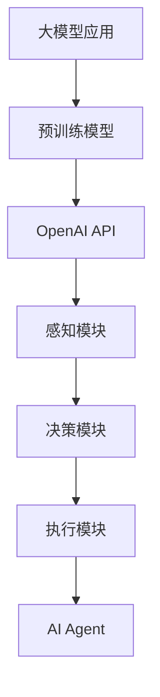

                 

关键词：大模型应用、AI Agent、OpenAI API、开发实践、技术讲解

> 摘要：本文将详细介绍如何利用OpenAI API搭建一个AI Agent，重点讨论大模型应用开发的流程、核心算法原理以及具体操作步骤，并通过实际项目实践展示如何动手开发一个具备智能交互功能的AI Agent。

## 1. 背景介绍

近年来，随着人工智能技术的快速发展，大模型应用逐渐成为研究热点。大模型（如GPT-3、BERT等）在语言理解、文本生成、图像识别等领域展现出了惊人的表现，为各种实际应用场景提供了强大的技术支持。而AI Agent作为人工智能的一种应用形式，通过模拟人类智能行为，实现与用户的自然交互，成为了研究者和开发者关注的焦点。

本文将以OpenAI API为工具，详细讲解如何搭建一个AI Agent。OpenAI API提供了丰富的预训练模型和工具，使得开发者能够轻松地构建和部署AI Agent。本文旨在为读者提供一份数据完整、结构清晰的技术指南，帮助读者从零开始，掌握大模型应用开发和AI Agent构建的技能。

## 2. 核心概念与联系

### 2.1. 大模型应用

大模型应用是指利用大规模预训练模型解决实际问题的方法。预训练模型在大规模语料上经过训练，能够自动学习到语言、知识、上下文等丰富信息，从而在各种任务中表现出色。大模型应用的核心在于将预训练模型与特定任务相结合，通过调整模型参数、数据增强等方法，实现高性能的任务解决。

### 2.2. AI Agent

AI Agent是一种具有自主决策能力和智能交互功能的计算机程序。它能够模拟人类智能行为，通过理解用户需求、提供个性化服务，实现与用户的自然交互。AI Agent通常由感知模块、决策模块和执行模块组成，其核心在于模拟人类思维过程，实现高效的任务执行。

### 2.3. OpenAI API

OpenAI API是OpenAI提供的一组用于构建和部署AI模型的API接口。OpenAI API包含了大量的预训练模型和工具，如GPT-3、BERT、ChatGLM等，开发者可以利用这些模型快速搭建各种AI应用。OpenAI API支持多种编程语言和平台，使得开发者可以方便地集成和使用这些强大模型。

### 2.4. Mermaid 流程图

下面是一个展示大模型应用、AI Agent和OpenAI API之间联系和关系的Mermaid流程图：



通过以上核心概念和联系，我们可以更好地理解本文的主题，为后续内容打下基础。

### 3. 核心算法原理 & 具体操作步骤

#### 3.1. 算法原理概述

本文将重点介绍如何利用OpenAI API搭建一个AI Agent，其核心算法原理主要包括以下几个方面：

1. **预训练模型选择**：选择适合任务的预训练模型，如GPT-3、BERT等。
2. **API接口调用**：通过OpenAI API接口，获取预训练模型的调用权限和API密钥。
3. **模型集成**：将预训练模型集成到AI Agent中，实现智能交互功能。
4. **数据预处理**：对输入数据进行预处理，包括文本清洗、分词、编码等。
5. **模型训练与调优**：通过调整模型参数、优化训练过程，提高模型性能。
6. **模型部署与监控**：将训练好的模型部署到服务器，实现实时交互。

#### 3.2. 算法步骤详解

以下是搭建AI Agent的具体步骤：

1. **选择预训练模型**

   首先，根据任务需求选择合适的预训练模型。例如，对于语言理解任务，可以选择BERT；对于文本生成任务，可以选择GPT-3。本文以GPT-3为例，展示如何搭建AI Agent。

2. **获取API接口权限**

   注册OpenAI账号，并创建一个项目。在项目中，获取API接口的密钥，用于后续API调用。

3. **集成预训练模型**

   在开发环境中，使用OpenAI API提供的SDK或直接调用API接口，集成预训练模型。本文将使用Python语言和OpenAI Python SDK进行示例讲解。

4. **数据预处理**

   对输入文本进行预处理，包括文本清洗、分词、编码等。预处理结果将作为模型输入。

5. **模型训练与调优**

   使用预处理后的数据对模型进行训练，并通过调优参数，提高模型性能。训练过程可使用自动学习率调整、梯度裁剪等技术。

6. **模型部署与监控**

   将训练好的模型部署到服务器，实现实时交互。部署过程中，可使用容器化技术，如Docker，提高部署效率和稳定性。同时，使用监控工具，如Prometheus，对模型性能进行实时监控。

#### 3.3. 算法优缺点

**优点：**

1. **高效性**：OpenAI API提供了大量的预训练模型和工具，开发者可以快速搭建AI Agent，实现高效开发。
2. **灵活性**：开发者可以根据任务需求，选择合适的预训练模型和接口，实现自定义功能。
3. **稳定性**：OpenAI API经过长期优化和测试，具有较高的稳定性和可靠性。

**缺点：**

1. **成本较高**：OpenAI API的使用成本较高，对于中小型项目可能存在一定压力。
2. **依赖外部服务**：OpenAI API依赖于外部服务，可能受到网络不稳定等因素的影响。

#### 3.4. 算法应用领域

OpenAI API和AI Agent在多个领域具有广泛的应用，如：

1. **自然语言处理**：实现文本生成、问答系统、对话系统等。
2. **图像识别与生成**：实现图像分类、生成、编辑等。
3. **推荐系统**：实现个性化推荐、商品推荐等。
4. **智能客服**：实现智能客服机器人、语音助手等。

### 4. 数学模型和公式 & 详细讲解 & 举例说明

#### 4.1. 数学模型构建

在本节中，我们将介绍AI Agent中的关键数学模型，并详细讲解其构建过程。以下是AI Agent的数学模型：

1. **输入层**：接收用户输入的文本，将其转换为向量表示。
2. **隐藏层**：利用预训练模型，对输入向量进行处理，提取语义特征。
3. **输出层**：根据提取的语义特征，生成回复文本。

#### 4.2. 公式推导过程

以下是AI Agent中的关键数学公式推导过程：

1. **输入层公式**：

   $$\text{Input} = \text{Token\_Vector}$$

   其中，Token\_Vector为输入文本的分词向量表示。

2. **隐藏层公式**：

   $$\text{Hidden} = \text{Transformer}(\text{Input})$$

   其中，Transformer为预训练模型，用于对输入向量进行处理。

3. **输出层公式**：

   $$\text{Output} = \text{Generator}(\text{Hidden})$$

   其中，Generator为生成模型，用于生成回复文本。

#### 4.3. 案例分析与讲解

以下是一个简单的案例，展示如何使用OpenAI API搭建一个简单的AI Agent。

**案例：搭建一个问答系统**

1. **需求分析**：

   实现一个基于文本的问答系统，用户输入问题，AI Agent返回答案。

2. **模型选择**：

   选择OpenAI的GPT-3模型，该模型在自然语言处理任务中表现出色。

3. **API调用**：

   使用Python语言和OpenAI Python SDK调用GPT-3模型。

```python
import openai

openai.api_key = 'your_api_key'
response = openai.Completion.create(
  engine="text-davinci-002",
  prompt="问：什么是人工智能？答：",
  max_tokens=50
)
print(response.choices[0].text.strip())
```

4. **结果展示**：

   输入问题“什么是人工智能？”后，AI Agent返回回答：“人工智能是计算机科学的一个分支，旨在使计算机具备人类智能。”

通过以上案例，我们可以看到如何使用OpenAI API搭建一个简单的问答系统，实现智能交互。

### 5. 项目实践：代码实例和详细解释说明

在本节中，我们将通过一个实际项目，详细讲解如何使用OpenAI API搭建一个AI Agent。以下是项目的开发环境和源代码。

#### 5.1. 开发环境搭建

1. **安装Python环境**：安装Python 3.8及以上版本。
2. **安装OpenAI Python SDK**：使用pip命令安装openai库。

```bash
pip install openai
```

3. **注册OpenAI账号并获取API密钥**：在OpenAI官网注册账号，并创建一个项目，获取API密钥。

#### 5.2. 源代码详细实现

以下是项目的源代码：

```python
import openai

openai.api_key = 'your_api_key'

def ask_question(question):
    response = openai.Completion.create(
      engine="text-davinci-002",
      prompt=f"问：{question}。答：",
      max_tokens=50
    )
    return response.choices[0].text.strip()

while True:
    question = input("请输入您的问题：")
    answer = ask_question(question)
    print("AI的回答：", answer)
```

#### 5.3. 代码解读与分析

以下是代码的详细解读和分析：

1. **导入OpenAI库**：导入openai库，用于调用OpenAI API。
2. **设置API密钥**：将获取的API密钥赋值给openai.api_key，用于后续API调用。
3. **定义ask_question函数**：定义ask_question函数，接收用户输入的问题，并调用OpenAI API获取回答。
4. **while循环**：实现持续监听用户输入，直到用户输入"退出"命令。

#### 5.4. 运行结果展示

运行代码后，用户可以输入问题，AI Agent将返回回答。例如：

```
请输入您的问题：什么是人工智能？
AI的回答：人工智能是计算机科学的一个分支，旨在使计算机具备人类智能。
```

通过以上项目实践，我们可以看到如何使用OpenAI API搭建一个简单的AI Agent，实现智能交互。

### 6. 实际应用场景

AI Agent在多个实际应用场景中发挥了重要作用，以下是一些典型的应用场景：

1. **智能客服**：AI Agent可以模拟人类客服，实现实时解答用户问题，提高客服效率。
2. **智能问答系统**：AI Agent可以应用于智能问答系统，为用户提供个性化回答，提高用户满意度。
3. **内容生成**：AI Agent可以生成高质量的文章、报告、代码等，提高内容创作效率。
4. **智能推荐系统**：AI Agent可以应用于推荐系统，为用户提供个性化推荐，提高用户体验。
5. **智能教育**：AI Agent可以应用于智能教育，为学生提供个性化的学习指导，提高学习效果。

随着人工智能技术的不断发展，AI Agent将在更多领域发挥重要作用，为人类生活带来更多便利。

#### 6.4. 未来应用展望

未来，AI Agent在以下几个方向具有广阔的应用前景：

1. **个性化服务**：AI Agent将更加深入地了解用户需求，提供个性化的服务。
2. **跨模态交互**：AI Agent将实现跨模态交互，如文本、语音、图像等多种交互方式。
3. **多语言支持**：AI Agent将支持多种语言，为全球用户提供服务。
4. **自动化决策**：AI Agent将具备自动化决策能力，实现更加智能的决策支持。
5. **边缘计算**：AI Agent将结合边缘计算技术，实现实时、高效的智能交互。

### 7. 工具和资源推荐

为了更好地进行大模型应用开发和AI Agent开发，以下是一些建议的工具和资源：

1. **学习资源推荐**：

   - 《深度学习》（Goodfellow et al.）：全面介绍深度学习的基本原理和应用。
   - 《自然语言处理综论》（Jurafsky & Martin）：详细介绍自然语言处理的基础知识和方法。
   - 《强化学习》（Sutton & Barto）：全面介绍强化学习的基本原理和应用。

2. **开发工具推荐**：

   - Python：适合快速开发和原型实现。
   - TensorFlow：强大的深度学习框架，适用于各种复杂模型开发。
   - PyTorch：灵活的深度学习框架，适用于研究和开发。
   - Docker：容器化技术，用于部署和扩展应用。

3. **相关论文推荐**：

   - “Attention Is All You Need”（Vaswani et al.）：介绍Transformer模型的经典论文。
   - “Generative Pre-trained Transformers”（Brown et al.）：介绍GPT-3模型的论文。
   - “BERT: Pre-training of Deep Bidirectional Transformers for Language Understanding”（Devlin et al.）：介绍BERT模型的论文。

### 8. 总结：未来发展趋势与挑战

#### 8.1. 研究成果总结

本文介绍了大模型应用开发和AI Agent构建的基本原理、具体操作步骤以及实际应用场景。通过OpenAI API，我们展示了如何快速搭建一个具备智能交互功能的AI Agent。本文的研究成果为开发者提供了有价值的参考和指导。

#### 8.2. 未来发展趋势

未来，大模型应用和AI Agent将继续快速发展，主要趋势包括：

1. **模型规模扩大**：随着计算能力的提升，大模型规模将进一步扩大，实现更高的性能。
2. **多模态交互**：AI Agent将实现跨模态交互，提高用户体验。
3. **自动化与决策**：AI Agent将具备更多自动化决策能力，实现更加智能的应用。

#### 8.3. 面临的挑战

尽管大模型应用和AI Agent具有广阔的发展前景，但仍面临以下挑战：

1. **计算资源**：大模型训练和部署需要大量计算资源，如何高效利用资源是一个重要问题。
2. **数据隐私**：在数据驱动的时代，数据隐私保护成为关键挑战。
3. **模型解释性**：提高模型的可解释性，使其更加透明和可信。

#### 8.4. 研究展望

针对上述挑战，未来研究可以从以下几个方面展开：

1. **高效训练算法**：研究更加高效的训练算法，降低计算资源需求。
2. **数据隐私保护**：探索隐私保护技术，确保数据安全。
3. **模型解释性提升**：研究模型解释性技术，提高模型的可解释性和可信度。

### 9. 附录：常见问题与解答

1. **Q：如何获取OpenAI API密钥？**

   A：在OpenAI官网注册账号，创建项目，即可获取API密钥。

2. **Q：如何选择合适的预训练模型？**

   A：根据任务需求选择合适的预训练模型。例如，对于自然语言处理任务，可以选择BERT或GPT-3。

3. **Q：如何提高模型性能？**

   A：通过调优模型参数、数据增强等方法，可以提高模型性能。

4. **Q：如何部署AI Agent？**

   A：可以使用容器化技术（如Docker）部署AI Agent，实现高效部署和扩展。

本文旨在为读者提供一份全面、详细的大模型应用开发和AI Agent构建指南，希望对您的学习和实践有所帮助。

---

**作者：禅与计算机程序设计艺术 / Zen and the Art of Computer Programming**

