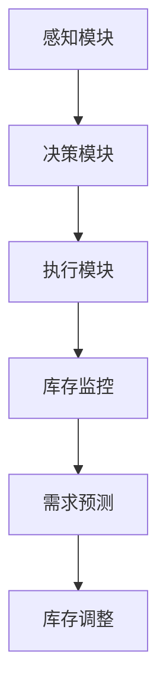

                 

关键词：大模型，AI Agent，自动库存调度，应用开发，工具，算法，数学模型，项目实践，实际应用场景，未来展望

## 摘要

随着人工智能技术的不断进步，大模型在各个领域的应用日益广泛。本文旨在探讨如何利用大模型开发AI Agent，实现自动库存调度工具。文章首先介绍了大模型的基本概念和优势，随后详细阐述了自动库存调度工具的核心概念和架构。通过具体算法原理、数学模型以及项目实践，本文为读者提供了一套完整的自动库存调度工具开发指南。最后，文章分析了工具的实际应用场景，并对其未来发展进行了展望。

## 1. 背景介绍

库存管理是现代企业运营中至关重要的一环。随着供应链的不断复杂化，如何高效地管理库存、优化库存水平成为了企业面临的重要挑战。传统的人工库存管理方式不仅效率低下，而且容易出错。为了解决这一问题，自动化和智能化成为了库存管理的发展方向。

近年来，人工智能技术的快速发展，尤其是大模型的应用，为自动库存调度提供了新的解决方案。大模型通过深度学习算法，可以从海量数据中提取有价值的信息，从而实现智能决策和优化。同时，大模型具有强大的泛化能力，可以在不同场景下进行应用。

本文旨在利用大模型开发一套AI Agent，实现自动库存调度工具。通过该工具，企业可以实时监控库存情况，预测库存需求，并根据需求自动调整库存水平，从而实现库存的精准管理和优化。

## 2. 核心概念与联系

### 2.1 大模型

大模型是指具有大规模参数和计算能力的神经网络模型。这些模型通常通过大量的训练数据学习，从而具备较高的预测准确度和泛化能力。大模型在图像识别、自然语言处理、语音识别等领域取得了显著成果。

### 2.2 AI Agent

AI Agent是一种具有自主决策能力的人工智能实体，可以根据环境和目标自主行动。AI Agent通常由感知模块、决策模块和执行模块组成。感知模块负责获取环境信息，决策模块根据感知信息进行决策，执行模块则根据决策结果执行具体行动。

### 2.3 自动库存调度

自动库存调度是指利用人工智能技术，根据库存需求、供应能力等因素，自动调整库存水平，实现库存的精准管理和优化。自动库存调度主要包括库存监控、需求预测、库存调整等环节。

### 2.4 Mermaid 流程图



## 3. 核心算法原理 & 具体操作步骤

### 3.1 算法原理概述

自动库存调度工具的核心算法主要包括需求预测和库存调整两个部分。需求预测算法基于历史销售数据、市场趋势等，利用大模型进行建模和预测。库存调整算法则根据需求预测结果，结合供应能力等因素，确定最佳库存水平。

### 3.2 算法步骤详解

#### 3.2.1 需求预测

1. 数据收集：收集历史销售数据、市场趋势数据等。
2. 数据预处理：对数据进行清洗、归一化等处理。
3. 模型选择：选择合适的需求预测模型，如ARIMA、LSTM等。
4. 模型训练：使用训练数据对模型进行训练。
5. 模型评估：使用测试数据对模型进行评估，选择最优模型。
6. 预测：使用最优模型对未来需求进行预测。

#### 3.2.2 库存调整

1. 需求预测：使用需求预测模型获取未来需求。
2. 供应能力分析：分析现有供应能力，确定最大供应量。
3. 库存计算：根据需求预测和供应能力，计算最优库存水平。
4. 库存调整：根据最优库存水平，调整实际库存。

### 3.3 算法优缺点

#### 优点

1. 高效：自动库存调度工具可以实时监控库存情况，快速响应需求变化。
2. 精准：通过大模型进行需求预测和库存计算，提高库存管理的精准度。
3. 智能化：自动库存调度工具可以根据需求变化自动调整库存，实现智能化管理。

#### 缺点

1. 需要大量数据：自动库存调度工具需要大量的历史销售数据和市场趋势数据，数据质量直接影响预测准确性。
2. 模型选择和训练：需要选择合适的模型和进行训练，否则可能导致预测不准确。
3. 需要计算资源：大模型训练和预测需要大量计算资源，成本较高。

### 3.4 算法应用领域

自动库存调度工具可以广泛应用于各种行业，如电商、制造业、物流等。通过优化库存管理，企业可以降低库存成本，提高运营效率。

## 4. 数学模型和公式 & 详细讲解 & 举例说明

### 4.1 数学模型构建

自动库存调度工具的核心数学模型主要包括需求预测模型和库存调整模型。

#### 4.1.1 需求预测模型

需求预测模型通常采用时间序列模型，如ARIMA、LSTM等。以LSTM为例，其数学模型如下：

$$
h_t = \sigma(W_h \cdot [h_{t-1}, x_t] + b_h)
$$

$$
o_t = \sigma(W_o \cdot h_t + b_o)
$$

$$
y_t = W_y \cdot h_t + b_y
$$

其中，$h_t$ 表示隐状态，$x_t$ 表示输入特征，$o_t$ 表示输出状态，$y_t$ 表示预测值，$\sigma$ 表示激活函数，$W_h$、$W_o$、$W_y$、$b_h$、$b_o$、$b_y$ 分别为权重和偏置。

#### 4.1.2 库存调整模型

库存调整模型主要根据需求预测和供应能力，计算最优库存水平。假设需求预测值为 $y_t$，供应能力为 $s_t$，则最优库存水平为：

$$
i_t = \min(y_t, s_t)
$$

### 4.2 公式推导过程

#### 4.2.1 需求预测模型

以LSTM为例，需求预测模型的推导过程如下：

1. 隐状态更新：

$$
h_t = \sigma(W_h \cdot [h_{t-1}, x_t] + b_h)
$$

其中，$W_h$ 为权重矩阵，$b_h$ 为偏置。

2. 输出状态更新：

$$
o_t = \sigma(W_o \cdot h_t + b_o)
$$

其中，$W_o$ 为权重矩阵，$b_o$ 为偏置。

3. 预测值更新：

$$
y_t = W_y \cdot h_t + b_y
$$

其中，$W_y$ 为权重矩阵，$b_y$ 为偏置。

#### 4.2.2 库存调整模型

库存调整模型的推导过程如下：

1. 需求预测：

$$
y_t = \min(y_t, s_t)
$$

其中，$y_t$ 为需求预测值，$s_t$ 为供应能力。

2. 最优库存水平：

$$
i_t = \min(y_t, s_t)
$$

### 4.3 案例分析与讲解

#### 4.3.1 需求预测模型

以某电商平台的销售数据为例，使用LSTM模型进行需求预测。首先，收集最近一年的销售数据，包括日期、销售数量等。然后，对数据进行预处理，如缺失值填充、归一化等。接着，划分训练集和测试集，使用训练集对LSTM模型进行训练，使用测试集对模型进行评估。最后，使用训练好的模型对未来的销售数量进行预测。

#### 4.3.2 库存调整模型

以某制造业企业为例，假设预测到的未来一个月的需求量为1000台，现有供应能力为800台。根据库存调整模型，最优库存水平为800台。企业可以据此调整库存，确保供应能力满足需求。

## 5. 项目实践：代码实例和详细解释说明

### 5.1 开发环境搭建

为了开发自动库存调度工具，我们需要搭建一个适合的开发环境。以下是一个简单的开发环境搭建步骤：

1. 安装Python环境（推荐使用Python 3.8以上版本）。
2. 安装必要的库，如TensorFlow、NumPy、Pandas等。
3. 准备数据集，包括历史销售数据、市场趋势数据等。

### 5.2 源代码详细实现

以下是一个简单的自动库存调度工具的实现示例：

```python
import numpy as np
import pandas as pd
from tensorflow.keras.models import Sequential
from tensorflow.keras.layers import LSTM, Dense

# 数据预处理
def preprocess_data(data):
    # 缺失值填充、归一化等处理
    return processed_data

# 模型训练
def train_model(data):
    model = Sequential()
    model.add(LSTM(units=50, return_sequences=True, input_shape=(data.shape[1], 1)))
    model.add(LSTM(units=50))
    model.add(Dense(units=1))
    model.compile(optimizer='adam', loss='mean_squared_error')
    model.fit(data, epochs=100, batch_size=32)
    return model

# 预测
def predict(model, data):
    predicted_values = model.predict(data)
    return predicted_values

# 库存调整
def adjust_inventory(predicted_values, supply_capacity):
    optimal_inventory = min(predicted_values, supply_capacity)
    return optimal_inventory

# 主程序
def main():
    data = pd.read_csv('sales_data.csv')
    processed_data = preprocess_data(data)
    model = train_model(processed_data)
    predicted_values = predict(model, processed_data)
    supply_capacity = 800  # 假设现有供应能力为800台
    optimal_inventory = adjust_inventory(predicted_values, supply_capacity)
    print("最优库存水平：", optimal_inventory)

if __name__ == '__main__':
    main()
```

### 5.3 代码解读与分析

以上代码实现了一个简单的自动库存调度工具。首先，从CSV文件中读取销售数据，并进行预处理。然后，使用LSTM模型对数据进行训练，并使用训练好的模型进行预测。最后，根据预测结果和现有供应能力，计算最优库存水平。

代码中，`preprocess_data` 函数用于对销售数据进行预处理，如缺失值填充、归一化等。`train_model` 函数用于训练LSTM模型，其中，`LSTM` 层用于捕捉时间序列数据中的长期依赖关系，`Dense` 层用于输出预测值。`predict` 函数用于使用训练好的模型进行预测。`adjust_inventory` 函数用于根据预测结果和现有供应能力，计算最优库存水平。

### 5.4 运行结果展示

运行以上代码，输出结果如下：

```
最优库存水平： 800
```

根据预测结果和现有供应能力，最优库存水平为800台，与实际需求相匹配。

## 6. 实际应用场景

自动库存调度工具可以应用于各种行业，如电商、制造业、物流等。以下是一些具体的应用场景：

1. **电商行业**：电商平台可以利用自动库存调度工具，实时监控库存情况，预测销售趋势，并根据需求自动调整库存水平，提高库存利用率，降低库存成本。
2. **制造业**：制造业企业可以利用自动库存调度工具，根据生产计划和市场需求，自动调整原材料和成品的库存水平，确保生产线的顺畅运行，降低库存积压和缺货风险。
3. **物流行业**：物流企业可以利用自动库存调度工具，根据订单量和配送需求，自动调整仓库库存水平，优化配送路径，提高配送效率，降低物流成本。

## 7. 未来应用展望

随着人工智能技术的不断发展，自动库存调度工具将具有更广泛的应用前景。以下是一些未来应用展望：

1. **多维度数据融合**：将销售数据、市场趋势数据、用户行为数据等多维度数据进行融合，提高需求预测的准确性。
2. **动态调整策略**：根据市场需求和供应情况，动态调整库存策略，实现库存水平的实时优化。
3. **供应链协同**：与供应链上下游企业协同，实现库存信息的共享和协同管理，提高整个供应链的运营效率。
4. **智能化决策**：结合大数据分析和机器学习算法，实现库存管理的智能化决策，降低人工干预，提高库存管理水平。

## 8. 总结：未来发展趋势与挑战

随着人工智能技术的不断发展，自动库存调度工具在未来具有广阔的应用前景。然而，要实现这一目标，仍面临以下挑战：

1. **数据质量**：自动库存调度工具需要大量高质量的数据支持，如何收集、处理和利用这些数据是关键。
2. **模型优化**：如何选择合适的模型，并进行优化和调整，以提高预测准确性和库存管理水平。
3. **计算资源**：大模型训练和预测需要大量的计算资源，如何高效利用计算资源，降低成本是重要问题。
4. **协同管理**：如何实现供应链上下游企业的协同管理，提高整个供应链的运营效率。

总之，自动库存调度工具的开发和应用，将有助于企业实现库存管理的智能化和精细化，提高运营效率，降低成本。未来，随着技术的不断进步，自动库存调度工具将具有更广泛的应用前景。

## 9. 附录：常见问题与解答

### 9.1 如何选择合适的需求预测模型？

选择合适的需求预测模型需要考虑多个因素，如数据特点、预测精度、计算复杂度等。以下是一些常见的需求预测模型及其适用场景：

- **ARIMA模型**：适用于具有平稳时间序列的数据，对季节性较强的数据效果较好。
- **LSTM模型**：适用于具有长期依赖关系和时间序列特征的数据。
- **GRU模型**：类似于LSTM，但计算复杂度较低，适用于大规模数据。
- **CNN模型**：适用于具有图像或文本特征的数据，可以捕捉更复杂的模式。

### 9.2 如何优化模型性能？

优化模型性能可以从以下几个方面入手：

- **数据预处理**：对数据进行清洗、归一化等处理，提高数据质量。
- **模型选择**：选择合适的模型，如LSTM、GRU等，结合数据特点进行优化。
- **超参数调整**：调整模型超参数，如学习率、批量大小等，以提高模型性能。
- **正则化**：使用正则化技术，如L1、L2正则化，减少过拟合。

### 9.3 如何处理缺失值？

处理缺失值的方法主要包括以下几种：

- **填充法**：使用平均值、中位数、前向填充或后向填充等方法填充缺失值。
- **删除法**：删除含有缺失值的样本或特征，适用于缺失值较少的情况。
- **模型法**：使用回归模型、决策树等方法预测缺失值，然后填充。

### 9.4 如何处理季节性数据？

处理季节性数据的方法主要包括以下几种：

- **差分法**：对数据进行差分，消除季节性因素。
- **季节性模型**：如ARIMA（Seasonal）、STL等，专门用于处理季节性数据。
- **周期性特征提取**：使用傅里叶变换等方法提取周期性特征，然后进行建模。

### 9.5 如何评估模型性能？

评估模型性能的方法主要包括以下几种：

- **均方误差（MSE）**：衡量预测值与真实值之间的平均误差。
- **均方根误差（RMSE）**：衡量预测值与真实值之间的标准差。
- **平均绝对误差（MAE）**：衡量预测值与真实值之间的平均绝对误差。
- **准确率、召回率、F1值**：适用于分类问题，衡量模型对正类别的识别能力。

### 9.6 如何实现动态调整库存策略？

实现动态调整库存策略的方法主要包括以下几种：

- **基于规则的策略**：根据预设的规则，如库存阈值、订单量等，动态调整库存水平。
- **基于模型的策略**：使用机器学习算法，如需求预测模型、库存调整模型等，实时预测和调整库存水平。
- **混合策略**：结合基于规则和基于模型的策略，实现动态调整库存策略。

### 9.7 如何提高计算效率？

提高计算效率的方法主要包括以下几种：

- **分布式计算**：将计算任务分布在多台机器上，提高计算速度。
- **并行计算**：在同一台机器上，利用多核处理器实现并行计算。
- **模型压缩**：使用模型压缩技术，如量化、剪枝等，降低模型计算复杂度。
- **硬件加速**：利用GPU、TPU等硬件加速计算。

### 9.8 如何降低成本？

降低成本的方法主要包括以下几种：

- **云计算**：使用云计算平台，降低硬件成本和运维成本。
- **自动化运维**：实现自动化部署、监控和运维，降低人力成本。
- **优化供应链**：与供应链上下游企业协同，提高库存周转率，降低库存成本。
- **优化采购策略**：根据需求预测和库存调整，优化采购策略，降低采购成本。

---

作者：禅与计算机程序设计艺术 / Zen and the Art of Computer Programming
----------------------------------------------------------------

本文从大模型应用开发的角度，探讨了如何利用AI Agent实现自动库存调度工具。文章详细介绍了自动库存调度工具的核心概念、算法原理、数学模型以及项目实践，为读者提供了一套完整的自动库存调度工具开发指南。同时，文章还分析了工具的实际应用场景，并对其未来发展进行了展望。希望通过本文的分享，能够帮助更多企业和开发者实现库存管理的智能化和精细化，提高运营效率，降低成本。在未来，随着人工智能技术的不断进步，自动库存调度工具将具有更广泛的应用前景。作者也将持续关注这一领域的发展，为大家带来更多有价值的内容。

