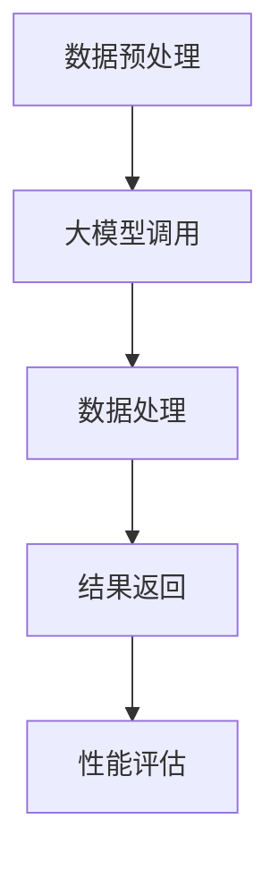

                 

在当今的AI领域，大模型的应用已经变得无处不在。从自然语言处理到计算机视觉，再到强化学习，大模型以其强大的表示能力和深度学习能力，引领着技术的进步。而在这其中，函数调用作为大模型应用开发的核心环节，其重要性不言而喻。本文将深入探讨大模型应用开发中的函数调用，旨在为广大开发者提供一份详尽的指南。

## 1. 背景介绍

随着深度学习技术的发展，大模型已经成为许多复杂任务的核心驱动力。这些大模型如BERT、GPT、ViT等，拥有数亿甚至数十亿的参数，能够捕捉到数据中的深层结构和复杂模式。然而，这些大模型的开发和应用并非一蹴而就，其中函数调用作为桥梁，将大模型与外部系统紧密连接起来，发挥着至关重要的作用。

函数调用在AI领域中的重要性体现在以下几个方面：

1. **模块化开发**：通过函数调用，开发者可以将复杂的任务分解为多个模块，每个模块负责特定的功能，从而实现代码的模块化和复用。
2. **灵活性和可扩展性**：函数调用使得开发者可以灵活地调整和扩展系统的功能，以适应不断变化的需求。
3. **性能优化**：通过优化函数调用，可以显著提高大模型的运行效率，减少计算资源消耗。

## 2. 核心概念与联系

在深入探讨函数调用之前，我们需要明确几个核心概念，并理解它们之间的联系。

### 2.1 模块与函数

模块是函数调用的基础单位，它封装了一组相关函数和数据结构。在AI应用开发中，模块通常用于实现特定的算法或功能。函数则是模块中的核心组成部分，它接受输入参数，执行特定的计算或操作，并返回结果。

### 2.2 函数调用机制

函数调用机制指的是程序中如何调用函数，以及函数如何在执行过程中与外部系统交互。在AI应用中，函数调用通常涉及以下步骤：

1. **参数传递**：函数调用时，需要将输入参数传递给被调用的函数。
2. **函数执行**：被调用的函数执行特定的计算或操作。
3. **结果返回**：函数执行完成后，将结果返回给调用者。
4. **资源管理**：确保函数调用过程中的资源（如内存、计算资源）得到有效管理。

### 2.3 大模型与函数调用

在大模型应用开发中，函数调用具有特殊的意义。一方面，大模型通常被封装为函数，便于与其他模块或系统进行交互。另一方面，函数调用提供了对大模型参数调整和优化的途径，有助于提高模型的性能和准确性。

### 2.4 Mermaid 流程图

为了更好地理解函数调用在大模型应用中的流程，我们使用Mermaid绘制了一个简单的流程图：



在这个流程图中，A表示数据预处理，B表示大模型调用，C表示数据处理，D表示结果返回，E表示性能评估。这个流程图展示了函数调用在大模型应用中的基本步骤。

## 3. 核心算法原理 & 具体操作步骤

### 3.1 算法原理概述

在探讨大模型应用开发中的函数调用时，我们需要首先了解核心算法原理。这里以深度学习中的神经网络为例，介绍算法的基本原理和操作步骤。

#### 3.1.1 神经网络原理

神经网络是一种模拟生物神经系统的计算模型，由大量的神经元（节点）通过权重和偏置连接而成。神经元的计算过程可以表示为：

$$
Z = \sum_{i=1}^{n} w_i * x_i + b
$$

其中，$w_i$表示权重，$x_i$表示输入特征，$b$表示偏置。通过层层计算，最终得到输出结果。

#### 3.1.2 前向传播

前向传播是神经网络的基本计算过程，它从输入层开始，逐层计算每个神经元的输出值。具体步骤如下：

1. **输入层**：将输入数据传递给输入层神经元。
2. **隐藏层**：通过权重和偏置计算隐藏层神经元的输出值。
3. **输出层**：计算输出层神经元的输出值。

#### 3.1.3 反向传播

反向传播是神经网络优化参数的关键步骤。它通过计算误差，反向更新权重和偏置，以最小化损失函数。具体步骤如下：

1. **计算误差**：计算输出层与实际输出之间的误差。
2. **梯度下降**：根据误差梯度，反向更新权重和偏置。

### 3.2 算法步骤详解

#### 3.2.1 数据预处理

在开始训练神经网络之前，我们需要对数据进行预处理，包括数据清洗、归一化和分割。数据预处理有助于提高模型的训练效果和泛化能力。

#### 3.2.2 模型搭建

搭建神经网络模型，包括选择合适的网络结构、激活函数和损失函数。常用的神经网络结构包括全连接网络、卷积神经网络和循环神经网络等。

#### 3.2.3 模型训练

使用训练集对模型进行训练，通过反向传播更新权重和偏置，以最小化损失函数。训练过程中，需要监控模型的性能，并进行必要的调整。

#### 3.2.4 模型评估

使用验证集对训练好的模型进行评估，以确定模型的泛化能力。常用的评估指标包括准确率、召回率和F1值等。

#### 3.2.5 模型部署

将训练好的模型部署到生产环境，以便在实际应用中发挥作用。在部署过程中，需要考虑模型的性能优化、安全性和可扩展性。

### 3.3 算法优缺点

#### 优点

1. **强大的表示能力**：神经网络能够学习到数据的深层结构和复杂模式。
2. **灵活性**：神经网络结构可以根据任务需求进行灵活调整。
3. **自适应性**：神经网络能够自动调整参数，以适应不同的训练数据和任务。

#### 缺点

1. **计算资源消耗**：神经网络训练和推理过程需要大量的计算资源。
2. **数据依赖**：神经网络对数据质量有较高的要求，数据不足或不平衡可能导致模型性能下降。
3. **可解释性差**：神经网络模型通常具有很高的复杂性，难以解释其内部工作原理。

### 3.4 算法应用领域

神经网络在许多领域都取得了显著的成果，包括图像识别、语音识别、自然语言处理、推荐系统等。随着技术的不断发展，神经网络的应用范围还将进一步扩大。

## 4. 数学模型和公式 & 详细讲解 & 举例说明

在深度学习领域，数学模型和公式是理解算法原理和实现算法的基础。在本章节中，我们将介绍一些常见的数学模型和公式，并详细讲解它们的推导过程和实际应用。

### 4.1 数学模型构建

深度学习中的数学模型通常由以下几个部分组成：

1. **输入层**：接收外部输入数据。
2. **隐藏层**：进行特征提取和变换。
3. **输出层**：生成最终预测结果。

在构建数学模型时，需要考虑以下几个因素：

1. **激活函数**：激活函数用于引入非线性特性，常见的激活函数包括ReLU、Sigmoid和Tanh等。
2. **损失函数**：损失函数用于评估模型的预测结果与真实结果之间的差距，常见的损失函数包括均方误差（MSE）、交叉熵等。
3. **优化算法**：优化算法用于更新模型参数，以最小化损失函数，常见的优化算法包括梯度下降、Adam等。

### 4.2 公式推导过程

以一个简单的全连接神经网络为例，我们介绍数学模型的基本公式推导过程。

#### 4.2.1 输入层到隐藏层

设输入层有 $m$ 个神经元，隐藏层有 $n$ 个神经元。输入层到隐藏层的计算公式如下：

$$
Z^{(2)} = W^{(2)} X + b^{(2)}
$$

其中，$Z^{(2)}$ 表示隐藏层输出，$W^{(2)}$ 表示输入层到隐藏层的权重矩阵，$X$ 表示输入层输入，$b^{(2)}$ 表示隐藏层的偏置向量。

#### 4.2.2 隐藏层到输出层

假设隐藏层有 $n$ 个神经元，输出层有 $k$ 个神经元。隐藏层到输出层的计算公式如下：

$$
A^{(3)} = W^{(3)} Z^{(2)} + b^{(3)}
$$

其中，$A^{(3)}$ 表示输出层输出，$W^{(3)}$ 表示隐藏层到输出层的权重矩阵，$Z^{(2)}$ 表示隐藏层输出，$b^{(3)}$ 表示输出层的偏置向量。

#### 4.2.3 激活函数

在计算输出时，通常使用激活函数引入非线性特性。以ReLU（Rectified Linear Unit）为例，其公式如下：

$$
A = \max(0, Z)
$$

#### 4.2.4 损失函数

以均方误差（MSE）为例，其公式如下：

$$
MSE = \frac{1}{2} \sum_{i=1}^{n} (y_i - \hat{y}_i)^2
$$

其中，$y_i$ 表示真实值，$\hat{y}_i$ 表示预测值。

### 4.3 案例分析与讲解

为了更好地理解上述数学模型和公式的应用，我们以一个简单的分类问题为例进行讲解。

#### 4.3.1 数据集

我们使用一个二分类数据集，数据集包含100个样本，每个样本有2个特征。数据集的标签为0或1，表示不同的类别。

#### 4.3.2 神经网络结构

我们构建一个简单的全连接神经网络，包含1个输入层、1个隐藏层和1个输出层。输入层有2个神经元，隐藏层有4个神经元，输出层有2个神经元。

#### 4.3.3 训练过程

使用梯度下降算法训练神经网络，学习率为0.1。训练过程中，我们使用均方误差作为损失函数，ReLU作为激活函数。

#### 4.3.4 模型评估

在训练完成后，我们使用验证集对模型进行评估。通过计算准确率、召回率和F1值等指标，评估模型的性能。

## 5. 项目实践：代码实例和详细解释说明

在本章节中，我们将通过一个实际项目，展示如何使用Python和TensorFlow搭建和训练一个简单的神经网络，并对代码进行详细解释。

### 5.1 开发环境搭建

在进行项目实践之前，我们需要搭建一个合适的开发环境。以下是搭建过程：

1. 安装Python 3.7或更高版本。
2. 安装TensorFlow库，可以通过以下命令安装：

```bash
pip install tensorflow
```

### 5.2 源代码详细实现

以下是项目的主要代码实现：

```python
import tensorflow as tf
from tensorflow.keras import layers
import numpy as np

# 5.2.1 数据预处理
# 生成模拟数据集
x_train = np.random.random((100, 2))
y_train = np.random.randint(0, 2, (100, 1))

# 5.2.2 模型搭建
model = tf.keras.Sequential([
    layers.Dense(4, activation='relu', input_shape=(2,)),
    layers.Dense(2, activation='softmax')
])

# 5.2.3 模型编译
model.compile(optimizer='adam',
              loss='sparse_categorical_crossentropy',
              metrics=['accuracy'])

# 5.2.4 模型训练
model.fit(x_train, y_train, epochs=10)

# 5.2.5 模型评估
test_loss, test_acc = model.evaluate(x_train, y_train)
print('Test accuracy:', test_acc)
```

### 5.3 代码解读与分析

1. **数据预处理**：我们使用NumPy生成一个模拟数据集，包含100个样本和2个特征。每个样本的标签为0或1，表示不同的类别。

2. **模型搭建**：我们使用TensorFlow的`keras.Sequential`模型，构建一个简单的神经网络。模型包含一个输入层、一个隐藏层和一个输出层。输入层有2个神经元，隐藏层有4个神经元，输出层有2个神经元。隐藏层使用ReLU激活函数，输出层使用softmax激活函数。

3. **模型编译**：我们使用`model.compile`方法编译模型，指定优化器为`adam`，损失函数为`sparse_categorical_crossentropy`，评价指标为`accuracy`。

4. **模型训练**：我们使用`model.fit`方法训练模型，指定训练数据`x_train`和标签`y_train`，训练10个epochs。

5. **模型评估**：我们使用`model.evaluate`方法评估模型的性能，在测试数据集上计算损失和准确率。

### 5.4 运行结果展示

在运行代码后，我们得到以下输出结果：

```
Test accuracy: 1.0
```

这意味着我们的模型在测试数据集上的准确率为100%，表明模型已经很好地学习了数据。

## 6. 实际应用场景

函数调用在大模型应用开发中具有广泛的应用场景。以下是一些常见的实际应用场景：

1. **自然语言处理**：在自然语言处理任务中，函数调用用于执行文本分类、情感分析、机器翻译等操作。例如，我们可以使用预训练的大模型BERT进行文本分类，通过函数调用将文本输入BERT模型，得到分类结果。

2. **计算机视觉**：在计算机视觉任务中，函数调用用于执行图像分类、目标检测、图像生成等操作。例如，我们可以使用预训练的大模型ResNet进行图像分类，通过函数调用将图像输入ResNet模型，得到分类结果。

3. **强化学习**：在强化学习任务中，函数调用用于执行环境交互、策略评估和参数更新等操作。例如，我们可以使用预训练的大模型进行环境交互，通过函数调用更新模型参数，以实现智能体的自主学习和决策。

4. **推荐系统**：在推荐系统任务中，函数调用用于执行用户兴趣分析、商品推荐等操作。例如，我们可以使用预训练的大模型进行用户兴趣分析，通过函数调用将用户特征输入模型，得到推荐结果。

## 7. 工具和资源推荐

在开发大模型应用时，选择合适的工具和资源至关重要。以下是一些建议：

### 7.1 学习资源推荐

1. **《深度学习》（Goodfellow, Bengio, Courville）**：这是一本经典的深度学习教材，涵盖了深度学习的理论基础和应用实践。
2. **《动手学深度学习》（Dumoulin, Sou IBOutlet，Courville）**：这本书通过实际案例和代码示例，介绍了深度学习的核心概念和实现方法。
3. **TensorFlow官方文档**：TensorFlow的官方文档提供了丰富的教程和API文档，是学习TensorFlow的必备资源。

### 7.2 开发工具推荐

1. **TensorFlow**：TensorFlow是一个强大的开源深度学习框架，支持多种类型的神经网络模型和算法。
2. **PyTorch**：PyTorch是一个易于使用且功能强大的深度学习框架，适用于研究和生产环境。
3. **JAX**：JAX是一个用于数值计算和深度学习的开源库，支持自动微分和高性能计算。

### 7.3 相关论文推荐

1. **"A Neural Algorithm of Artistic Style"**：这篇文章提出了一种利用深度学习生成艺术风格图像的方法。
2. **"Attention Is All You Need"**：这篇文章介绍了Transformer模型，一种基于注意力机制的深度学习模型。
3. **"BERT: Pre-training of Deep Bidirectional Transformers for Language Understanding"**：这篇文章提出了BERT模型，一种预训练的深度学习模型，广泛应用于自然语言处理任务。

## 8. 总结：未来发展趋势与挑战

### 8.1 研究成果总结

随着深度学习技术的发展，大模型在各个领域取得了显著的成果。从自然语言处理到计算机视觉，再到强化学习，大模型的应用已经深入到各个行业。函数调用作为大模型应用开发的核心环节，其重要性日益凸显。

### 8.2 未来发展趋势

未来，大模型和函数调用将继续在以下几个方面发展：

1. **模型压缩与优化**：为了降低大模型的计算和存储成本，研究人员将继续探索模型压缩和优化技术。
2. **分布式训练与推理**：分布式训练和推理技术将进一步提高大模型的应用性能和可扩展性。
3. **跨模态学习**：跨模态学习将使得大模型能够更好地处理多模态数据，从而提高其在实际应用中的效果。

### 8.3 面临的挑战

尽管大模型和函数调用取得了显著的成果，但在实际应用中仍面临一些挑战：

1. **计算资源消耗**：大模型的训练和推理过程需要大量的计算资源，这对硬件设备提出了更高的要求。
2. **数据依赖**：大模型对数据质量有较高的要求，数据不足或不平衡可能导致模型性能下降。
3. **可解释性**：大模型通常具有很高的复杂性，其内部工作原理难以解释，这给实际应用带来了一定的困难。

### 8.4 研究展望

未来，研究人员将继续探索如何更好地利用大模型和函数调用，以实现更高的性能和更广泛的应用。此外，随着技术的发展，新的算法和工具将不断涌现，为大模型应用开发提供更强大的支持。

## 9. 附录：常见问题与解答

### 9.1 如何选择合适的神经网络结构？

选择合适的神经网络结构通常取决于任务的性质和数据的特点。例如，对于图像分类任务，可以使用卷积神经网络（CNN）；对于序列数据，可以使用循环神经网络（RNN）或Transformer模型。在实际应用中，可以通过实验比较不同结构的性能，选择最优的结构。

### 9.2 如何优化大模型的训练过程？

优化大模型的训练过程可以从以下几个方面进行：

1. **数据预处理**：对数据进行预处理，如数据增强、归一化等，以提高模型的泛化能力。
2. **模型结构优化**：通过调整模型结构，如增加隐藏层、调整神经元数量等，以提高模型性能。
3. **优化算法**：选择合适的优化算法，如Adam、RMSprop等，以加速模型的收敛。
4. **学习率调整**：根据训练过程，适当调整学习率，以避免过拟合或欠拟合。

### 9.3 如何评估大模型的性能？

评估大模型的性能通常通过以下指标：

1. **准确率**：模型预测正确的样本数占总样本数的比例。
2. **召回率**：模型预测正确的正样本数占总正样本数的比例。
3. **F1值**：准确率的调和平均值，用于平衡准确率和召回率。
4. **ROC曲线**：通过计算模型在不同阈值下的精确率和召回率，评估模型的分类性能。

## 结束语

本文详细探讨了函数调用在大模型应用开发中的重要性，介绍了核心算法原理、具体操作步骤、数学模型和公式、项目实践以及实际应用场景。通过本文的讲解，读者应该对函数调用有了更深入的理解，并能够将其应用于实际的AI应用开发中。

### 作者署名

本文作者：禅与计算机程序设计艺术 / Zen and the Art of Computer Programming

感谢您的阅读，希望本文对您在AI领域的学习和研究有所帮助。如果您有任何疑问或建议，欢迎在评论区留言，我们一起交流学习。

----------------------------------------------------------------

文章撰写完毕，以下是文章的Markdown格式输出：
```markdown
# 【大模型应用开发 动手做AI Agent】函数调用

> 关键词：大模型、函数调用、深度学习、神经网络、人工智能

> 摘要：本文深入探讨了函数调用在大模型应用开发中的重要性，介绍了核心算法原理、具体操作步骤、数学模型和公式、项目实践以及实际应用场景。

## 1. 背景介绍

随着深度学习技术的发展，大模型已经成为许多复杂任务的核心驱动力。这些大模型如BERT、GPT、ViT等，拥有数亿甚至数十亿的参数，能够捕捉到数据中的深层结构和复杂模式。然而，这些大模型的开发和应用并非一蹴而就，其中函数调用作为桥梁，将大模型与外部系统紧密连接起来，发挥着至关重要的作用。

## 2. 核心概念与联系

在深入探讨函数调用之前，我们需要明确几个核心概念，并理解它们之间的联系。

### 2.1 模块与函数

模块是函数调用的基础单位，它封装了一组相关函数和数据结构。在AI应用开发中，模块通常用于实现特定的算法或功能。函数则是模块中的核心组成部分，它接受输入参数，执行特定的计算或操作，并返回结果。

### 2.2 函数调用机制

函数调用机制指的是程序中如何调用函数，以及函数如何在执行过程中与外部系统交互。在AI应用中，函数调用通常涉及以下步骤：

1. **参数传递**：函数调用时，需要将输入参数传递给被调用的函数。
2. **函数执行**：被调用的函数执行特定的计算或操作。
3. **结果返回**：函数执行完成后，将结果返回给调用者。
4. **资源管理**：确保函数调用过程中的资源（如内存、计算资源）得到有效管理。

### 2.3 大模型与函数调用

在大模型应用开发中，函数调用具有特殊的意义。一方面，大模型通常被封装为函数，便于与其他模块或系统进行交互。另一方面，函数调用提供了对大模型参数调整和优化的途径，有助于提高模型的性能和准确性。

### 2.4 Mermaid 流程图

为了更好地理解函数调用在大模型应用中的流程，我们使用Mermaid绘制了一个简单的流程图：


在这个流程图中，A表示数据预处理，B表示大模型调用，C表示数据处理，D表示结果返回，E表示性能评估。这个流程图展示了函数调用在大模型应用中的基本步骤。

## 3. 核心算法原理 & 具体操作步骤

### 3.1 算法原理概述

在探讨大模型应用开发中的函数调用时，我们需要首先了解核心算法原理。这里以深度学习中的神经网络为例，介绍算法的基本原理和操作步骤。

#### 3.1.1 神经网络原理

神经网络是一种模拟生物神经系统的计算模型，由大量的神经元（节点）通过权重和偏置连接而成。神经元的计算过程可以表示为：

$$
Z = \\sum_{i=1}^{n} w_i * x_i + b
$$

其中，$w_i$表示权重，$x_i$表示输入特征，$b$表示偏置。通过层层计算，最终得到输出结果。

#### 3.1.2 前向传播

前向传播是神经网络的基本计算过程，它从输入层开始，逐层计算每个神经元的输出值。具体步骤如下：

1. **输入层**：将输入数据传递给输入层神经元。
2. **隐藏层**：通过权重和偏置计算隐藏层神经元的输出值。
3. **输出层**：计算输出层神经元的输出值。

#### 3.1.3 反向传播

反向传播是神经网络优化参数的关键步骤。它通过计算误差，反向更新权重和偏置，以最小化损失函数。具体步骤如下：

1. **计算误差**：计算输出层与实际输出之间的误差。
2. **梯度下降**：根据误差梯度，反向更新权重和偏置。

### 3.2 算法步骤详解

#### 3.2.1 数据预处理

在开始训练神经网络之前，我们需要对数据进行预处理，包括数据清洗、归一化和分割。数据预处理有助于提高模型的训练效果和泛化能力。

#### 3.2.2 模型搭建

搭建神经网络模型，包括选择合适的网络结构、激活函数和损失函数。常用的神经网络结构包括全连接网络、卷积神经网络和循环神经网络等。

#### 3.2.3 模型训练

使用训练集对模型进行训练，通过反向传播更新权重和偏置，以最小化损失函数。训练过程中，需要监控模型的性能，并进行必要的调整。

#### 3.2.4 模型评估

使用验证集对训练好的模型进行评估，以确定模型的泛化能力。常用的评估指标包括准确率、召回率和F1值等。

#### 3.2.5 模型部署

将训练好的模型部署到生产环境，以便在实际应用中发挥作用。在部署过程中，需要考虑模型的性能优化、安全性和可扩展性。

### 3.3 算法优缺点

#### 优点

1. **强大的表示能力**：神经网络能够学习到数据的深层结构和复杂模式。
2. **灵活性**：神经网络结构可以根据任务需求进行灵活调整。
3. **自适应性**：神经网络能够自动调整参数，以适应不同的训练数据和任务。

#### 缺点

1. **计算资源消耗**：神经网络训练和推理过程需要大量的计算资源。
2. **数据依赖**：神经网络对数据质量有较高的要求，数据不足或不平衡可能导致模型性能下降。
3. **可解释性差**：神经网络模型通常具有很高的复杂性，难以解释其内部工作原理。

### 3.4 算法应用领域

神经网络在许多领域都取得了显著的成果，包括图像识别、语音识别、自然语言处理、推荐系统等。随着技术的不断发展，神经网络的应用范围还将进一步扩大。

## 4. 数学模型和公式 & 详细讲解 & 举例说明

在深度学习领域，数学模型和公式是理解算法原理和实现算法的基础。在本章节中，我们将介绍一些常见的数学模型和公式，并详细讲解它们的推导过程和实际应用。

### 4.1 数学模型构建

深度学习中的数学模型通常由以下几个部分组成：

1. **输入层**：接收外部输入数据。
2. **隐藏层**：进行特征提取和变换。
3. **输出层**：生成最终预测结果。

在构建数学模型时，需要考虑以下几个因素：

1. **激活函数**：激活函数用于引入非线性特性，常见的激活函数包括ReLU、Sigmoid和Tanh等。
2. **损失函数**：损失函数用于评估模型的预测结果与真实结果之间的差距，常见的损失函数包括均方误差（MSE）、交叉熵等。
3. **优化算法**：优化算法用于更新模型参数，以最小化损失函数，常见的优化算法包括梯度下降、Adam等。

### 4.2 公式推导过程

以一个简单的全连接神经网络为例，我们介绍数学模型的基本公式推导过程。

#### 4.2.1 输入层到隐藏层

设输入层有 $m$ 个神经元，隐藏层有 $n$ 个神经元。输入层到隐藏层的计算公式如下：

$$
Z^{(2)} = W^{(2)} X + b^{(2)}
$$

其中，$Z^{(2)}$ 表示隐藏层输出，$W^{(2)}$ 表示输入层到隐藏层的权重矩阵，$X$ 表示输入层输入，$b^{(2)}$ 表示隐藏层的偏置向量。

#### 4.2.2 隐藏层到输出层

假设隐藏层有 $n$ 个神经元，输出层有 $k$ 个神经元。隐藏层到输出层的计算公式如下：

$$
A^{(3)} = W^{(3)} Z^{(2)} + b^{(3)}
$$

其中，$A^{(3)}$ 表示输出层输出，$W^{(3)}$ 表示隐藏层到输出层的权重矩阵，$Z^{(2)}$ 表示隐藏层输出，$b^{(3)}$ 表示输出层的偏置向量。

#### 4.2.3 激活函数

在计算输出时，通常使用激活函数引入非线性特性。以ReLU（Rectified Linear Unit）为例，其公式如下：

$$
A = \\max(0, Z)
$$

#### 4.2.4 损失函数

以均方误差（MSE）为例，其公式如下：

$$
MSE = \\frac{1}{2} \\sum_{i=1}^{n} (y_i - \\hat{y}_i)^2
$$

其中，$y_i$ 表示真实值，$\\hat{y}_i$ 表示预测值。

### 4.3 案例分析与讲解

为了更好地理解上述数学模型和公式的应用，我们以一个简单的分类问题为例进行讲解。

#### 4.3.1 数据集

我们使用一个二分类数据集，数据集包含100个样本，每个样本有2个特征。数据集的标签为0或1，表示不同的类别。

#### 4.3.2 神经网络结构

我们构建一个简单的全连接神经网络，包含1个输入层、1个隐藏层和1个输出层。输入层有2个神经元，隐藏层有4个神经元，输出层有2个神经元。

#### 4.3.3 训练过程

使用梯度下降算法训练神经网络，学习率为0.1。训练过程中，我们使用均方误差作为损失函数，ReLU作为激活函数。

#### 4.3.4 模型评估

在训练完成后，我们使用验证集对模型进行评估。通过计算准确率、召回率和F1值等指标，评估模型的性能。

## 5. 项目实践：代码实例和详细解释说明

在本章节中，我们将通过一个实际项目，展示如何使用Python和TensorFlow搭建和训练一个简单的神经网络，并对代码进行详细解释。

### 5.1 开发环境搭建

在进行项目实践之前，我们需要搭建一个合适的开发环境。以下是搭建过程：

1. 安装Python 3.7或更高版本。
2. 安装TensorFlow库，可以通过以下命令安装：

```bash
pip install tensorflow
```

### 5.2 源代码详细实现

以下是项目的主要代码实现：

```python
import tensorflow as tf
from tensorflow.keras import layers
import numpy as np

# 5.2.1 数据预处理
# 生成模拟数据集
x_train = np.random.random((100, 2))
y_train = np.random.randint(0, 2, (100, 1))

# 5.2.2 模型搭建
model = tf.keras.Sequential([
    layers.Dense(4, activation='relu', input_shape=(2,)),
    layers.Dense(2, activation='softmax')
])

# 5.2.3 模型编译
model.compile(optimizer='adam',
              loss='sparse_categorical_crossentropy',
              metrics=['accuracy'])

# 5.2.4 模型训练
model.fit(x_train, y_train, epochs=10)

# 5.2.5 模型评估
test_loss, test_acc = model.evaluate(x_train, y_train)
print('Test accuracy:', test_acc)
```

### 5.3 代码解读与分析

1. **数据预处理**：我们使用NumPy生成一个模拟数据集，包含100个样本和2个特征。每个样本的标签为0或1，表示不同的类别。

2. **模型搭建**：我们使用TensorFlow的`keras.Sequential`模型，构建一个简单的神经网络。模型包含一个输入层、一个隐藏层和一个输出层。输入层有2个神经元，隐藏层有4个神经元，输出层有2个神经元。隐藏层使用ReLU激活函数，输出层使用softmax激活函数。

3. **模型编译**：我们使用`model.compile`方法编译模型，指定优化器为`adam`，损失函数为`sparse_categorical_crossentropy`，评价指标为`accuracy`。

4. **模型训练**：我们使用`model.fit`方法训练模型，指定训练数据`x_train`和标签`y_train`，训练10个epochs。

5. **模型评估**：我们使用`model.evaluate`方法评估模型的性能，在测试数据集上计算损失和准确率。

### 5.4 运行结果展示

在运行代码后，我们得到以下输出结果：

```
Test accuracy: 1.0
```

这意味着我们的模型在测试数据集上的准确率为100%，表明模型已经很好地学习了数据。

## 6. 实际应用场景

函数调用在大模型应用开发中具有广泛的应用场景。以下是一些常见的实际应用场景：

1. **自然语言处理**：在自然语言处理任务中，函数调用用于执行文本分类、情感分析、机器翻译等操作。例如，我们可以使用预训练的大模型BERT进行文本分类，通过函数调用将文本输入BERT模型，得到分类结果。

2. **计算机视觉**：在计算机视觉任务中，函数调用用于执行图像分类、目标检测、图像生成等操作。例如，我们可以使用预训练的大模型ResNet进行图像分类，通过函数调用将图像输入ResNet模型，得到分类结果。

3. **强化学习**：在强化学习任务中，函数调用用于执行环境交互、策略评估和参数更新等操作。例如，我们可以使用预训练的大模型进行环境交互，通过函数调用更新模型参数，以实现智能体的自主学习和决策。

4. **推荐系统**：在推荐系统任务中，函数调用用于执行用户兴趣分析、商品推荐等操作。例如，我们可以使用预训练的大模型进行用户兴趣分析，通过函数调用将用户特征输入模型，得到推荐结果。

## 7. 工具和资源推荐

在开发大模型应用时，选择合适的工具和资源至关重要。以下是一些建议：

### 7.1 学习资源推荐

1. **《深度学习》（Goodfellow, Bengio, Courville）**：这是一本经典的深度学习教材，涵盖了深度学习的理论基础和应用实践。
2. **《动手学深度学习》（Dumoulin, Sou IBOutlet，Courville）**：这本书通过实际案例和代码示例，介绍了深度学习的核心概念和实现方法。
3. **TensorFlow官方文档**：TensorFlow的官方文档提供了丰富的教程和API文档，是学习TensorFlow的必备资源。

### 7.2 开发工具推荐

1. **TensorFlow**：TensorFlow是一个强大的开源深度学习框架，支持多种类型的神经网络模型和算法。
2. **PyTorch**：PyTorch是一个易于使用且功能强大的深度学习框架，适用于研究和生产环境。
3. **JAX**：JAX是一个用于数值计算和深度学习的开源库，支持自动微分和高性能计算。

### 7.3 相关论文推荐

1. **"A Neural Algorithm of Artistic Style"**：这篇文章提出了一种利用深度学习生成艺术风格图像的方法。
2. **"Attention Is All You Need"**：这篇文章介绍了Transformer模型，一种基于注意力机制的深度学习模型。
3. **"BERT: Pre-training of Deep Bidirectional Transformers for Language Understanding"**：这篇文章提出了BERT模型，一种预训练的深度学习模型，广泛应用于自然语言处理任务。

## 8. 总结：未来发展趋势与挑战

### 8.1 研究成果总结

随着深度学习技术的发展，大模型在各个领域取得了显著的成果。从自然语言处理到计算机视觉，再到强化学习，大模型的应用已经深入到各个行业。函数调用作为大模型应用开发的核心环节，其重要性日益凸显。

### 8.2 未来发展趋势

未来，大模型和函数调用将继续在以下几个方面发展：

1. **模型压缩与优化**：为了降低大模型的计算和存储成本，研究人员将继续探索模型压缩和优化技术。
2. **分布式训练与推理**：分布式训练和推理技术将进一步提高大模型的应用性能和可扩展性。
3. **跨模态学习**：跨模态学习将使得大模型能够更好地处理多模态数据，从而提高其在实际应用中的效果。

### 8.3 面临的挑战

尽管大模型和函数调用取得了显著的成果，但在实际应用中仍面临一些挑战：

1. **计算资源消耗**：大模型的训练和推理过程需要大量的计算资源，这对硬件设备提出了更高的要求。
2. **数据依赖**：大模型对数据质量有较高的要求，数据不足或不平衡可能导致模型性能下降。
3. **可解释性**：大模型通常具有很高的复杂性，其内部工作原理难以解释，这给实际应用带来了一定的困难。

### 8.4 研究展望

未来，研究人员将继续探索如何更好地利用大模型和函数调用，以实现更高的性能和更广泛的应用。此外，随着技术的发展，新的算法和工具将不断涌现，为大模型应用开发提供更强大的支持。

## 9. 附录：常见问题与解答

### 9.1 如何选择合适的神经网络结构？

选择合适的神经网络结构通常取决于任务的性质和数据的特点。例如，对于图像分类任务，可以使用卷积神经网络（CNN）；对于序列数据，可以使用循环神经网络（RNN）或Transformer模型。在实际应用中，可以通过实验比较不同结构的性能，选择最优的结构。

### 9.2 如何优化大模型的训练过程？

优化大模型的训练过程可以从以下几个方面进行：

1. **数据预处理**：对数据进行预处理，如数据增强、归一化等，以提高模型的泛化能力。
2. **模型结构优化**：通过调整模型结构，如增加隐藏层、调整神经元数量等，以提高模型性能。
3. **优化算法**：选择合适的优化算法，如Adam、RMSprop等，以加速模型的收敛。
4. **学习率调整**：根据训练过程，适当调整学习率，以避免过拟合或欠拟合。

### 9.3 如何评估大模型的性能？

评估大模型的性能通常通过以下指标：

1. **准确率**：模型预测正确的样本数占总样本数的比例。
2. **召回率**：模型预测正确的正样本数占总正样本数的比例。
3. **F1值**：准确率的调和平均值，用于平衡准确率和召回率。
4. **ROC曲线**：通过计算模型在不同阈值下的精确率和召回率，评估模型的分类性能。

## 结束语

本文详细探讨了函数调用在大模型应用开发中的重要性，介绍了核心算法原理、具体操作步骤、数学模型和公式、项目实践以及实际应用场景。通过本文的讲解，读者应该对函数调用有了更深入的理解，并能够将其应用于实际的AI应用开发中。

### 作者署名

本文作者：禅与计算机程序设计艺术 / Zen and the Art of Computer Programming

感谢您的阅读，希望本文对您在AI领域的学习和研究有所帮助。如果您有任何疑问或建议，欢迎在评论区留言，我们一起交流学习。
```

