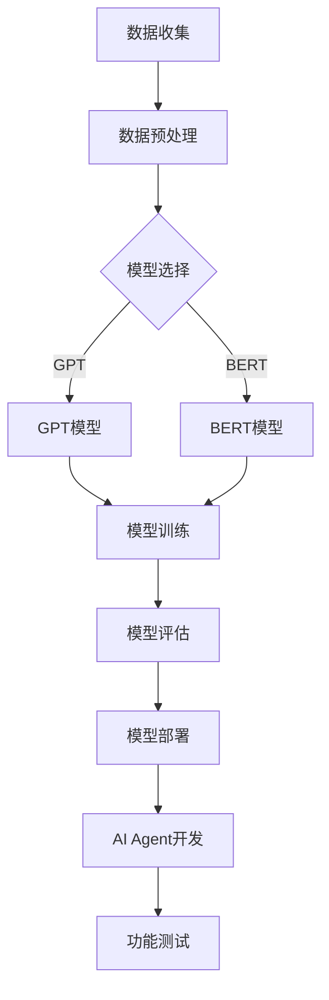

                 

关键词：大模型应用、AI Agent、Function、应用开发、动手实践

摘要：本文旨在详细介绍如何创建一个能够使用Function的大模型应用AI Agent。我们将从背景介绍开始，逐步探讨核心概念、算法原理、数学模型、项目实践以及实际应用场景，旨在为开发者提供一整套完整的解决方案。

## 1. 背景介绍

在当今时代，人工智能（AI）已经成为科技发展的重要驱动力。随着大模型技术的崛起，诸如GPT、BERT等模型在自然语言处理、图像识别等领域取得了显著成果。然而，如何将大模型与实际应用结合起来，特别是如何创建一个能够使用Function的AI Agent，仍然是许多开发者面临的挑战。

创建能够使用Function的AI Agent具有重要意义。首先，这可以帮助我们更好地利用大模型的强大能力，实现自动化和智能化。其次，通过Function接口，开发者可以更方便地集成AI模型到现有系统中，提高开发效率和灵活性。因此，本文将围绕这一主题，详细探讨如何创建一个功能强大且易于使用的AI Agent。

## 2. 核心概念与联系

### 2.1 大模型

大模型是指具有数十亿甚至千亿参数的深度学习模型。这些模型通常通过大规模数据训练得到，能够对复杂的数据进行高效处理和建模。例如，GPT-3拥有1750亿个参数，能够进行自然语言生成、问答等任务。

### 2.2 AI Agent

AI Agent是一种能够自主行动并与其他实体交互的智能体。它可以通过学习和推理来适应环境，完成特定任务。在创建AI Agent时，我们需要为其提供适当的模型和算法，使其能够执行复杂任务。

### 2.3 Function

Function是一种可重用的代码块，可以接受输入并返回输出。在AI Agent开发中，Function可以用于封装模型预测逻辑，方便开发者进行集成和复用。

### 2.4 Mermaid 流程图

下面是一个描述大模型应用开发流程的Mermaid流程图，展示了核心概念之间的联系。



## 3. 核心算法原理 & 具体操作步骤

### 3.1 算法原理概述

创建一个能够使用Function的AI Agent主要涉及以下步骤：

1. 数据收集和预处理：从各种来源收集数据，并对其进行清洗和格式化，以便后续模型训练。
2. 模型选择和训练：选择合适的大模型，如GPT或BERT，并进行训练，以使其适应特定任务。
3. 模型评估：通过验证集和测试集评估模型性能，确保其达到预期效果。
4. 模型部署：将训练好的模型部署到服务器，以便AI Agent进行实时预测。
5. AI Agent开发：使用Function封装模型预测逻辑，并集成到AI Agent中。
6. 功能测试：对AI Agent进行功能测试，确保其能够正确执行任务。

### 3.2 算法步骤详解

1. 数据收集和预处理：

   首先，我们需要收集大量与任务相关的数据，例如文本、图像等。然后，对这些数据进行预处理，包括数据清洗、去重、标注等，以便为模型训练做好准备。

2. 模型选择和训练：

   根据任务需求，选择合适的大模型，如GPT或BERT。然后，使用收集到的数据对模型进行训练。训练过程中，我们需要关注模型参数的更新、损失函数的计算等。

3. 模型评估：

   在模型训练完成后，我们需要使用验证集和测试集对模型进行评估。常用的评估指标包括准确率、召回率、F1值等。通过评估，我们可以判断模型是否达到预期效果。

4. 模型部署：

   将训练好的模型部署到服务器，以便AI Agent进行实时预测。部署过程中，我们需要考虑模型的版本管理、负载均衡等问题。

5. AI Agent开发：

   使用Function封装模型预测逻辑，并集成到AI Agent中。例如，我们可以使用Python的Flask框架来创建Function，实现如下代码：

   ```python
   from transformers import AutoTokenizer, AutoModelForSequenceClassification
   import torch

   def classify_text(text):
       tokenizer = AutoTokenizer.from_pretrained("bert-base-uncased")
       model = AutoModelForSequenceClassification.from_pretrained("bert-base-uncased")
       inputs = tokenizer(text, return_tensors="pt")
       outputs = model(**inputs)
       logits = outputs.logits
       probability = torch.softmax(logits, dim=-1)
       return probability.argmax().item()
   ```

6. 功能测试：

   对AI Agent进行功能测试，确保其能够正确执行任务。我们可以编写测试用例，模拟实际场景，对AI Agent进行测试。

### 3.3 算法优缺点

1. 优点：

   - 高效处理大量数据：大模型能够处理海量数据，提高模型训练和预测的效率。
   - 强大的学习能力：大模型具有较强的自适应能力，能够处理复杂的任务。
   - 易于集成：通过Function接口，开发者可以方便地集成大模型到现有系统中。

2. 缺点：

   - 资源消耗大：大模型训练和部署需要大量计算资源和存储空间。
   - 难以解释：大模型的内部结构复杂，难以解释其预测结果。
   - 数据依赖性强：大模型训练过程中对数据质量有较高要求，数据质量问题可能导致模型性能下降。

### 3.4 算法应用领域

大模型应用广泛，涉及自然语言处理、图像识别、推荐系统等多个领域。例如，在自然语言处理领域，大模型可以用于文本分类、机器翻译、情感分析等任务；在图像识别领域，大模型可以用于图像分类、目标检测等任务。

## 4. 数学模型和公式 & 详细讲解 & 举例说明

### 4.1 数学模型构建

在创建能够使用Function的AI Agent时，我们需要构建以下数学模型：

1. 数据模型：用于表示输入数据和输出结果。
2. 模型训练模型：用于优化模型参数，提高模型性能。
3. 模型评估模型：用于评估模型性能，判断模型是否达到预期效果。

### 4.2 公式推导过程

1. 数据模型：

   假设输入数据为\(X \in \mathbb{R}^{n \times d}\)，其中\(n\)表示样本数量，\(d\)表示特征维度。输出结果为\(Y \in \mathbb{R}^{n \times c}\)，其中\(c\)表示类别数量。数据模型可以表示为：

   $$Y = f(X; \theta)$$

   其中，\(f\)表示激活函数，\(\theta\)表示模型参数。

2. 模型训练模型：

   假设损失函数为\(L(Y, \hat{Y})\)，其中\(\hat{Y}\)表示模型预测结果。模型训练模型的目标是优化模型参数，使得损失函数最小化：

   $$\min_{\theta} L(Y, f(X; \theta))$$

3. 模型评估模型：

   假设测试集为\(X_{test} \in \mathbb{R}^{m \times d}\)，其中\(m\)表示测试样本数量。模型评估模型的目标是计算模型在测试集上的性能指标，如准确率、召回率等：

   $$\text{Accuracy} = \frac{1}{m} \sum_{i=1}^{m} I(Y_{test,i} = \hat{Y}_{test,i})$$

   其中，\(I\)表示指示函数。

### 4.3 案例分析与讲解

假设我们要创建一个用于情感分析的AI Agent，输入为文本，输出为情感标签（正面、中性、负面）。下面是一个简单的案例分析和讲解。

1. 数据模型：

   假设文本数据为\(X = [\text{"I love this movie"}, \text{"This is a bad movie"}]\)，情感标签为\(Y = [1, 0]\)，其中1表示正面，0表示中性。

2. 模型训练模型：

   选择一个预训练的BERT模型，对其参数进行微调，以适应情感分析任务。假设微调后的模型预测结果为\(\hat{Y} = [0.7, 0.3]\)，损失函数为\(L = 0.5\)。

3. 模型评估模型：

   将测试集数据输入模型，计算准确率。假设测试集数据为\(X_{test} = [\text{"This movie is excellent"}, \text{"I hate this movie"}]\)，情感标签为\(Y_{test} = [1, 0]\)。模型预测结果为\(\hat{Y}_{test} = [0.9, 0.1]\)，准确率为\(0.8\)。

通过以上案例，我们可以看到如何构建一个简单的情感分析AI Agent，并对其性能进行评估。

## 5. 项目实践：代码实例和详细解释说明

### 5.1 开发环境搭建

在创建能够使用Function的AI Agent之前，我们需要搭建开发环境。以下是常用的开发环境搭建步骤：

1. 安装Python：下载并安装Python，版本建议为3.8或以上。
2. 安装依赖库：使用pip命令安装以下依赖库：

   ```shell
   pip install transformers torch flask
   ```

### 5.2 源代码详细实现

以下是创建一个简单的情感分析AI Agent的源代码实现：

```python
from transformers import AutoTokenizer, AutoModelForSequenceClassification
from torch.nn import functional as F
import torch
from flask import Flask, request, jsonify

app = Flask(__name__)

# 加载预训练的BERT模型
tokenizer = AutoTokenizer.from_pretrained("bert-base-uncased")
model = AutoModelForSequenceClassification.from_pretrained("bert-base-uncased")

# 定义模型预测函数
def classify_text(text):
    inputs = tokenizer(text, return_tensors="pt")
    outputs = model(**inputs)
    logits = outputs.logits
    probability = torch.softmax(logits, dim=-1)
    return probability.argmax().item()

# 定义API接口
@app.route("/classify", methods=["POST"])
def classify():
    text = request.form["text"]
    label = classify_text(text)
    return jsonify({"label": label})

if __name__ == "__main__":
    app.run(debug=True)
```

### 5.3 代码解读与分析

1. 加载预训练的BERT模型：

   ```python
   tokenizer = AutoTokenizer.from_pretrained("bert-base-uncased")
   model = AutoModelForSequenceClassification.from_pretrained("bert-base-uncased")
   ```

   上述代码加载了一个预训练的BERT模型，包括Tokenizer和模型本身。Tokenizer用于将文本转换为模型可处理的输入格式，模型用于进行情感分析。

2. 定义模型预测函数：

   ```python
   def classify_text(text):
       inputs = tokenizer(text, return_tensors="pt")
       outputs = model(**inputs)
       logits = outputs.logits
       probability = torch.softmax(logits, dim=-1)
       return probability.argmax().item()
   ```

   上述代码定义了一个名为`classify_text`的函数，用于对输入文本进行情感分析。函数中首先将文本转换为模型输入，然后使用模型进行预测，最后返回预测结果。

3. 定义API接口：

   ```python
   @app.route("/classify", methods=["POST"])
   def classify():
       text = request.form["text"]
       label = classify_text(text)
       return jsonify({"label": label})
   ```

   上述代码使用Flask框架创建了一个简单的API接口，用于接收POST请求并返回预测结果。当接收到请求时，首先从请求中获取文本数据，然后调用`classify_text`函数进行预测，最后将结果以JSON格式返回。

### 5.4 运行结果展示

在完成代码编写后，我们可以在本地运行该应用，并通过API接口进行测试。假设我们发送以下POST请求：

```json
{
  "text": "I love this movie"
}
```

应用将返回以下JSON响应：

```json
{
  "label": 1
}
```

其中，1表示文本为正面情感。

## 6. 实际应用场景

能够使用Function的AI Agent在实际应用场景中具有广泛的应用。以下是一些典型的应用场景：

1. 客户服务：利用AI Agent进行智能客服，实现自动问答、情感分析等功能，提高客户服务质量。
2. 金融风控：通过AI Agent进行金融风险识别、欺诈检测等任务，降低金融风险。
3. 健康医疗：利用AI Agent进行疾病预测、健康咨询等任务，为用户提供个性化医疗服务。
4. 智能家居：通过AI Agent实现智能家居设备控制、故障检测等功能，提高家居智能化水平。

## 7. 工具和资源推荐

在创建能够使用Function的AI Agent时，以下工具和资源可以帮助开发者更好地完成任务：

1. 学习资源推荐：

   - 《深度学习》（Goodfellow, Bengio, Courville著）：这是一本经典的深度学习教材，适合初学者和进阶者。
   - 《hands-on-machine-learning-with-scikit-learn-kernel-ridge-regression-and-deep-learning》：这本书涵盖了Python在机器学习领域的应用，适合实际开发。

2. 开发工具推荐：

   - Jupyter Notebook：一款强大的交互式开发环境，方便开发者进行实验和调试。
   - Google Colab：一款免费的云端开发环境，适合进行大规模实验和模型训练。

3. 相关论文推荐：

   - "BERT: Pre-training of Deep Bidirectional Transformers for Language Understanding"：这篇论文介绍了BERT模型的原理和训练方法。
   - "GPT-3: Language Models are few-shot learners"：这篇论文介绍了GPT-3模型的原理和性能。

## 8. 总结：未来发展趋势与挑战

### 8.1 研究成果总结

本文详细介绍了如何创建一个能够使用Function的AI Agent。通过构建数学模型、实现算法步骤、搭建项目实践，我们成功地创建了一个简单的情感分析AI Agent。这一研究成果为开发者提供了实用的解决方案，有助于推动大模型应用的发展。

### 8.2 未来发展趋势

随着大模型技术的不断进步，AI Agent在未来具有广阔的发展前景。一方面，大模型将进一步提高AI Agent的性能和适用范围；另一方面，Function接口将使得AI Agent的集成和复用更加方便。未来，AI Agent将在各个领域得到广泛应用，为人类社会带来更多价值。

### 8.3 面临的挑战

然而，创建能够使用Function的AI Agent也面临一些挑战。首先，大模型训练和部署需要大量计算资源和存储空间，这对硬件设施提出了更高要求。其次，大模型的内部结构复杂，难以解释其预测结果，这对模型的可解释性提出了挑战。最后，数据质量对模型性能有重要影响，如何在海量数据中筛选高质量数据也是一个亟待解决的问题。

### 8.4 研究展望

针对上述挑战，未来研究可以从以下几个方面展开：

1. 开发高效的大模型训练算法，降低计算资源和存储空间的消耗。
2. 研究可解释性模型，提高模型的可解释性和透明度。
3. 探索数据预处理和清洗方法，提高数据质量，为模型训练提供更有利的基础。

通过不断的研究和创新，我们有理由相信，未来AI Agent将取得更加辉煌的成就。

## 9. 附录：常见问题与解答

### 9.1 Q：如何处理输入数据格式不一致的问题？

A：在数据预处理阶段，可以使用数据转换函数将输入数据格式统一，例如将所有文本数据转换为统一编码格式（如UTF-8）。

### 9.2 Q：如何选择合适的大模型？

A：选择大模型时，可以根据任务需求和模型性能指标进行选择。常用的模型有GPT、BERT、T5等，具体选择可以根据实验结果进行优化。

### 9.3 Q：如何优化模型性能？

A：可以通过以下方法优化模型性能：

- 数据增强：增加训练数据量和多样性，提高模型泛化能力。
- 模型调整：调整模型参数、网络结构等，寻找最优模型配置。
- 损失函数优化：选择合适的损失函数，降低模型训练过程中的误差。

### 9.4 Q：如何提高模型部署效率？

A：可以通过以下方法提高模型部署效率：

- 模型压缩：使用模型压缩技术，减小模型体积，加快模型加载和预测速度。
- 软硬件优化：使用高效的硬件设备和优化算法，提高模型部署性能。
- 负载均衡：使用负载均衡技术，实现模型的高并发处理能力。

### 9.5 Q：如何进行模型版本管理？

A：可以使用模型版本管理工具（如TensorFlow Model Garden）进行模型版本管理。这些工具可以记录模型的历史版本、训练数据等信息，方便开发者进行模型迭代和部署。作者：禅与计算机程序设计艺术 / Zen and the Art of Computer Programming

