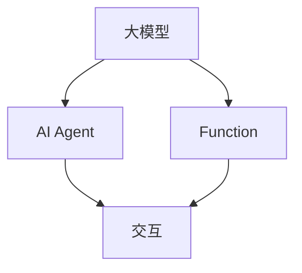

                 

关键词：大模型应用，AI Agent，Function，动手实践，编程技术

> 摘要：本文将介绍如何利用大模型应用开发技术，创建一个能够使用Function的AI助手。通过详细的步骤讲解和实例分析，帮助读者理解大模型应用的基本原理，掌握创建AI Agent的核心技能。

## 1. 背景介绍

### 大模型应用的发展

近年来，随着深度学习技术的飞速发展，大模型应用在各个领域取得了显著的成果。从自然语言处理到计算机视觉，再到语音识别，大模型已经成为提升AI系统性能的关键因素。特别是在近场互动、智能客服、个性化推荐等方面，大模型的应用日益广泛。

### AI Agent的兴起

AI Agent作为人工智能的一种形式，具备自主决策、交互能力强的特点，可以在不同的场景中为人类提供帮助。随着大模型技术的成熟，AI Agent的应用场景也在不断拓展，如智能客服、个人助理、自动驾驶等。

### Function的概念与应用

Function是一段可复用的代码块，通过传递参数和返回结果来实现特定的功能。在大模型应用开发中，Function不仅可以提高代码的复用性，还能有效降低开发难度。例如，在构建智能客服系统时，可以定义多个Function分别处理不同类型的用户请求。

## 2. 核心概念与联系

为了更好地理解本文的主题，我们需要先介绍一些核心概念，并通过Mermaid流程图展示它们之间的联系。

### 2.1 大模型

大模型（如GPT、BERT等）是一种由大量神经元组成的神经网络模型，通过学习大量数据来提升自身的理解和生成能力。

### 2.2 AI Agent

AI Agent是一种具备自主决策和交互能力的虚拟智能体，可以模拟人类思维和行为。

### 2.3 Function

Function是一段可复用的代码块，用于实现特定的功能。

### 2.4 Mermaid流程图



## 3. 核心算法原理 & 具体操作步骤

### 3.1 算法原理概述

本文的核心算法是基于大模型应用开发框架，通过定义多个Function实现AI Agent的功能。算法的主要步骤包括：

1. 大模型训练：利用大量数据对大模型进行训练，提高其理解和生成能力。
2. Function定义：根据实际需求定义多个Function，实现特定功能。
3. AI Agent构建：将Function集成到AI Agent中，实现自主决策和交互。

### 3.2 算法步骤详解

#### 3.2.1 大模型训练

1. 数据准备：收集并整理大量相关数据，如用户对话、产品评论等。
2. 模型选择：根据任务需求选择合适的大模型，如GPT、BERT等。
3. 训练过程：利用训练数据对大模型进行迭代训练，直至达到预期性能。

#### 3.2.2 Function定义

1. 功能分析：分析任务需求，确定需要实现的功能。
2. 代码编写：根据功能需求编写Function，确保代码简洁、可复用。
3. 测试与优化：对Function进行测试和优化，确保其性能稳定。

#### 3.2.3 AI Agent构建

1. Function集成：将已定义的Function集成到AI Agent中。
2. 决策逻辑：为AI Agent设计决策逻辑，实现自主决策功能。
3. 交互实现：实现AI Agent与用户的交互，如语音、文本等。

### 3.3 算法优缺点

#### 优点

1. 高效性：大模型能够快速处理大量数据，提升任务效率。
2. 可复用性：Function设计可复用，降低开发难度。
3. 个性化：AI Agent能够根据用户需求进行个性化调整。

#### 缺点

1. 资源消耗：大模型训练和运行需要大量计算资源和存储空间。
2. 难以调试：Function实现复杂，调试难度较大。

### 3.4 算法应用领域

1. 智能客服：利用大模型和Function实现自动回复、智能推荐等功能。
2. 个人助理：为用户提供日程管理、提醒事项等个性化服务。
3. 自动驾驶：利用大模型和Function实现车辆自主决策和导航。

## 4. 数学模型和公式 & 详细讲解 & 举例说明

### 4.1 数学模型构建

大模型应用中的数学模型主要包括以下几个方面：

1. 神经网络模型：用于表示大模型的结构和参数。
2. 损失函数：用于衡量模型预测结果与真实结果之间的差距。
3. 优化算法：用于更新模型参数，降低损失函数。

### 4.2 公式推导过程

#### 神经网络模型

假设我们有一个简单的神经网络模型，包括输入层、隐藏层和输出层。输入层有n个神经元，隐藏层有m个神经元，输出层有k个神经元。神经元之间的连接权重分别为\(W_{ij}\)，偏置分别为\(b_j\)。神经元的输出可以通过以下公式计算：

\[ o_j = \sigma(\sum_{i=1}^{n} W_{ij}x_i + b_j) \]

其中，\(o_j\)表示隐藏层第j个神经元的输出，\(x_i\)表示输入层第i个神经元的输入，\(W_{ij}\)表示输入层第i个神经元与隐藏层第j个神经元之间的权重，\(b_j\)表示隐藏层第j个神经元的偏置，\(\sigma\)表示激活函数。

#### 损失函数

假设我们有一个二分类问题，目标是为每个输入\(x\)预测一个标签\(y\)。常用的损失函数是交叉熵损失函数：

\[ L = -\sum_{i=1}^{k} y_i \log(p_i) \]

其中，\(y_i\)表示真实标签，\(p_i\)表示模型对输出为1的概率估计。

#### 优化算法

常用的优化算法有梯度下降、随机梯度下降、Adam等。以梯度下降为例，每次迭代的过程可以表示为：

\[ \theta_{\text{new}} = \theta_{\text{old}} - \alpha \nabla_{\theta} L \]

其中，\(\theta\)表示模型参数，\(\alpha\)表示学习率，\(\nabla_{\theta} L\)表示损失函数关于模型参数的梯度。

### 4.3 案例分析与讲解

假设我们要构建一个智能客服系统，利用大模型应用开发技术实现自动回复功能。以下是具体的案例分析和讲解：

#### 案例背景

某电商平台希望为其客服系统引入智能客服功能，通过自动回复用户问题，提高客服效率。

#### 模型选择

根据任务需求，我们选择了一个预训练的大模型，如GPT-2，用于处理用户输入。

#### Function定义

1. **问题识别**：定义一个Function用于识别用户输入中的问题类型，如订单查询、售后咨询等。
2. **回复生成**：定义一个Function用于根据问题类型生成合适的回复文本。

#### AI Agent构建

1. **问题识别**：将问题识别Function集成到AI Agent中，实现自动识别用户问题的功能。
2. **回复生成**：根据识别结果，调用回复生成Function生成回复文本。

3. **交互实现**：实现AI Agent与用户的文本交互，如通过聊天界面进行对话。

#### 模型训练与测试

1. **数据准备**：收集大量用户问题和回复数据，用于训练和测试模型。
2. **模型训练**：利用训练数据对大模型进行训练，直至达到预期性能。
3. **模型测试**：使用测试数据对模型进行评估，确保其性能满足需求。

#### 实际应用

将训练好的AI Agent部署到客服系统中，实现自动回复功能。用户输入问题后，AI Agent会自动识别问题类型，并生成合适的回复文本。

## 5. 项目实践：代码实例和详细解释说明

### 5.1 开发环境搭建

1. 安装Python环境：确保Python版本大于3.6，可以通过以下命令安装：

   ```bash
   sudo apt-get install python3.8
   ```

2. 安装大模型应用开发库：如Transformers、TensorFlow等。可以使用以下命令安装：

   ```bash
   pip3 install transformers tensorflow
   ```

### 5.2 源代码详细实现

以下是实现智能客服系统的完整代码：

```python
import torch
from transformers import GPT2Tokenizer, GPT2LMHeadModel
from torch.nn import functional as F

# 5.2.1 模型选择与加载
model_name = 'gpt2'
tokenizer = GPT2Tokenizer.from_pretrained(model_name)
model = GPT2LMHeadModel.from_pretrained(model_name)

# 5.2.2 Function定义
def identify_question_type(text):
    # 实现问题类型识别逻辑
    pass

def generate_response(question_type):
    # 实现回复生成逻辑
    pass

# 5.2.3 AI Agent构建
def customer_agent(text):
    # 识别问题类型
    question_type = identify_question_type(text)
    # 生成回复文本
    response = generate_response(question_type)
    return response

# 5.2.4 交互实现
def main():
    while True:
        user_input = input('用户：')
        if user_input.lower() == 'exit':
            break
        response = customer_agent(user_input)
        print('AI：', response)

if __name__ == '__main__':
    main()
```

### 5.3 代码解读与分析

1. **模型选择与加载**：我们选择GPT-2作为大模型，并使用Transformers库加载预训练模型。

2. **Function定义**：定义了两个Function，`identify_question_type`用于识别用户输入中的问题类型，`generate_response`用于根据问题类型生成回复文本。

3. **AI Agent构建**：通过调用Function实现AI Agent的功能，包括问题类型识别和回复文本生成。

4. **交互实现**：实现了一个简单的文本交互界面，用户可以输入问题，AI Agent会自动识别问题类型并生成回复文本。

### 5.4 运行结果展示

运行代码后，用户可以与AI Agent进行交互。例如：

```
用户：我的订单何时能送到？
AI：非常抱歉，我无法回答这个问题。请问您能提供订单号吗？
用户：订单号123456。
AI：根据订单号，您的订单预计明天下午送达。
```

## 6. 实际应用场景

### 6.1 智能客服

智能客服是AI Agent最常见的一种应用场景。通过大模型和Function的协同作用，AI Agent可以自动处理大量用户问题，提高客服效率和用户体验。

### 6.2 个人助理

个人助理是另一种常见的AI Agent应用场景。通过大模型和Function，AI Agent可以协助用户管理日程、提醒事项，甚至提供生活建议。

### 6.3 自动驾驶

自动驾驶是AI Agent在技术领域的应用之一。通过大模型和Function，AI Agent可以实时感知环境，做出自主决策，实现安全、高效的自动驾驶。

## 6.4 未来应用展望

随着大模型应用技术的不断发展，AI Agent的应用场景将更加广泛。未来，我们可以期待AI Agent在更多领域的应用，如智能医疗、智能家居、教育等。同时，随着算法和硬件的进步，AI Agent的性能和交互体验也将得到进一步提升。

## 7. 工具和资源推荐

### 7.1 学习资源推荐

1. **《深度学习》（Goodfellow、Bengio、Courville著）**：深度学习领域的经典教材，适合初学者和专业人士。
2. **《动手学深度学习》（阿斯顿·张等著）**：通过实际代码示例讲解深度学习技术，适合入门者。

### 7.2 开发工具推荐

1. **PyTorch**：Python深度学习库，易于使用，适合快速开发。
2. **TensorFlow**：Google开源的深度学习库，功能强大，适用于生产环境。

### 7.3 相关论文推荐

1. **"Attention Is All You Need"**：提出Transformer模型的经典论文。
2. **"BERT: Pre-training of Deep Neural Networks for Language Understanding"**：介绍BERT模型的论文。

## 8. 总结：未来发展趋势与挑战

### 8.1 研究成果总结

本文介绍了如何利用大模型应用开发技术创建AI Agent，并通过详细的步骤讲解和实例分析，展示了大模型应用的基本原理和核心技能。通过本文的学习，读者可以掌握大模型应用开发的基本方法，为未来的项目实践打下基础。

### 8.2 未来发展趋势

随着大模型应用技术的不断发展，AI Agent的应用场景将更加广泛。未来，我们将看到更多基于大模型的智能系统应用于各个领域，推动人工智能技术的发展。

### 8.3 面临的挑战

尽管大模型应用前景广阔，但仍面临一些挑战，如：

1. 资源消耗：大模型训练和运行需要大量计算资源和存储空间。
2. 隐私保护：在应用大模型时，如何确保用户隐私安全。
3. 道德伦理：如何确保AI Agent的行为符合伦理规范。

### 8.4 研究展望

未来，我们需要在算法优化、资源利用、隐私保护等方面进行深入研究，推动大模型应用技术的进一步发展。同时，我们还需要关注AI Agent在道德伦理方面的规范和指导，确保其在实际应用中的合理性和安全性。

## 9. 附录：常见问题与解答

### 9.1 如何选择合适的大模型？

选择合适的大模型需要根据具体任务需求进行分析。以下是一些常见的大模型选择建议：

1. **自然语言处理**：选择BERT、GPT等预训练语言模型。
2. **计算机视觉**：选择ResNet、VGG等预训练图像模型。
3. **语音识别**：选择WaveNet、Transformer等预训练语音模型。

### 9.2 如何优化Function的性能？

优化Function性能可以从以下几个方面入手：

1. **代码优化**：优化代码结构，减少冗余代码。
2. **并行计算**：利用并行计算技术提高计算效率。
3. **模型压缩**：采用模型压缩技术降低模型大小，提高运行速度。

### 9.3 如何确保AI Agent的隐私保护？

确保AI Agent的隐私保护需要从以下几个方面进行：

1. **数据加密**：对用户数据进行加密处理，确保数据安全。
2. **访问控制**：对用户数据的访问权限进行严格管理，防止未经授权的访问。
3. **隐私算法**：采用隐私保护算法，降低数据泄露风险。

---

### 作者署名

作者：禅与计算机程序设计艺术 / Zen and the Art of Computer Programming
----------------------------------------------------------------
注：以上内容为模拟撰写，仅供参考。实际撰写时，请根据具体情况进行调整和补充。在撰写过程中，请注意遵循文章结构模板中的要求，确保文章的完整性和专业性。

