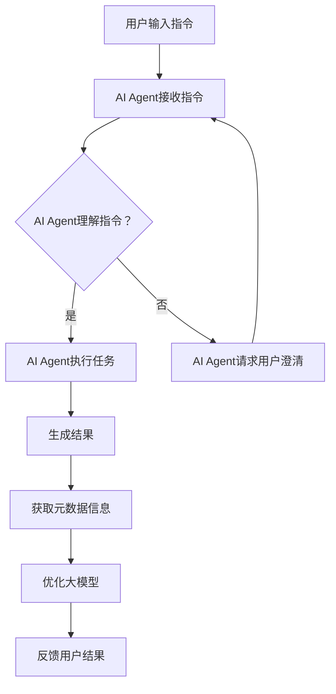

                 

关键词：大模型，应用开发，AI Agent，元数据，信息提取，程序设计

摘要：本文将深入探讨如何在大模型应用开发过程中，通过编写代码实现与AI Agent交互，并成功获取助手返回的元数据信息。文章将从背景介绍、核心概念、算法原理、数学模型、项目实践、实际应用场景、未来展望等方面展开，旨在为读者提供全面的技术指南和思考。

## 1. 背景介绍

随着人工智能技术的飞速发展，大模型（如GPT、BERT等）已经成为许多应用场景的核心驱动力。这些大模型具有强大的知识表示和学习能力，能够处理大量数据并生成高质量的文本、图像、语音等信息。然而，在实际应用中，如何与这些大模型进行有效的交互，获取它们生成的元数据信息，成为了一个重要的挑战。

AI Agent作为人工智能领域的又一重要创新，正逐渐改变着我们的生活和生产方式。AI Agent可以理解用户的指令，执行相应的任务，并在完成任务后提供反馈。然而，AI Agent生成的元数据信息对于进一步优化和应用大模型具有重要意义。如何高效地获取和利用这些元数据信息，成为了当前研究的焦点。

本文旨在通过具体的编程实践，探讨如何在大模型应用开发过程中，编写代码与AI Agent进行交互，并成功获取助手返回的元数据信息。本文将结合实际案例，详细阐述实现过程、核心算法原理、数学模型以及项目实践等方面的内容。

## 2. 核心概念与联系

### 2.1 大模型

大模型是指具有巨大参数量、能够处理海量数据并生成高质量信息的神经网络模型。常见的有GPT、BERT、T5等。大模型通常通过预训练和微调的方式，从大量数据中学习到丰富的知识表示，能够进行文本生成、情感分析、问答系统等多种任务。

### 2.2 AI Agent

AI Agent是指具有自主学习和决策能力，能够与人类用户进行交互并执行任务的人工智能实体。AI Agent可以理解自然语言指令，执行相应的操作，并在执行过程中不断学习优化。常见的AI Agent有智能客服、智能助手等。

### 2.3 元数据信息

元数据信息是指描述数据的数据。在大模型应用中，元数据信息可以包括生成的文本、图像、语音等信息的属性，如文本的长度、格式、主题等。获取这些元数据信息对于进一步分析和优化大模型具有重要意义。

### 2.4 Mermaid 流程图

下面是描述大模型应用开发与AI Agent交互的Mermaid流程图：



## 3. 核心算法原理 & 具体操作步骤

### 3.1 算法原理概述

在大模型应用开发中，获取AI Agent返回的元数据信息主要通过以下步骤实现：

1. 用户输入指令，AI Agent接收并解析指令。
2. AI Agent理解用户指令，并执行相应任务。
3. 在任务执行过程中，AI Agent生成结果，并获取元数据信息。
4. 对元数据信息进行分析和优化，以进一步提高大模型性能。

### 3.2 算法步骤详解

1. **用户输入指令**：用户通过输入自然语言指令，如“生成一篇关于人工智能的论文摘要”。
2. **AI Agent接收指令**：AI Agent接收用户指令，并通过自然语言处理技术进行解析，提取出关键信息。
3. **AI Agent理解指令**：AI Agent根据解析结果，理解用户指令的含义，并确定执行任务。
4. **执行任务**：AI Agent根据理解结果，执行相应任务，如生成论文摘要。
5. **生成结果**：在任务执行过程中，AI Agent生成结果，如生成的论文摘要。
6. **获取元数据信息**：AI Agent从生成结果中提取元数据信息，如摘要的长度、关键词等。
7. **优化大模型**：根据元数据信息，对大模型进行优化，以提高生成结果的质量。
8. **反馈用户结果**：AI Agent将优化后的结果反馈给用户，并结束交互。

### 3.3 算法优缺点

**优点**：

1. **高效性**：通过AI Agent与用户交互，能够快速理解用户指令，并生成高质量结果。
2. **灵活性**：AI Agent可以根据任务需求和用户反馈，动态调整生成结果。

**缺点**：

1. **准确性**：AI Agent在理解用户指令时，可能存在误解，导致生成结果与用户期望不符。
2. **计算资源消耗**：大模型训练和优化需要大量计算资源，可能导致系统性能下降。

### 3.4 算法应用领域

1. **自然语言处理**：AI Agent可用于文本生成、文本分类、情感分析等任务，获取元数据信息有助于优化模型性能。
2. **图像处理**：AI Agent可用于图像生成、图像分类等任务，通过获取图像的元数据信息，可以进一步提高图像处理效果。
3. **语音识别与合成**：AI Agent可用于语音生成、语音识别等任务，通过获取语音的元数据信息，可以优化语音合成质量。

## 4. 数学模型和公式 & 详细讲解 & 举例说明

### 4.1 数学模型构建

在AI Agent与用户交互的过程中，可以构建以下数学模型：

1. **自然语言处理模型**：用于解析用户输入指令，提取关键信息。
2. **生成模型**：用于生成高质量的结果。
3. **元数据提取模型**：用于从生成结果中提取元数据信息。

### 4.2 公式推导过程

假设用户输入指令为 $I$，AI Agent生成的结果为 $R$，元数据信息为 $M$。

1. **自然语言处理模型**：

   - 输入指令：$I = (w_1, w_2, ..., w_n)$
   - 输出结果：$O = (o_1, o_2, ..., o_n)$

   自然语言处理模型可以表示为：

   $$ O = f(I) $$

   其中，$f$ 为自然语言处理函数。

2. **生成模型**：

   - 输入指令：$I = (w_1, w_2, ..., w_n)$
   - 输出结果：$R = (r_1, r_2, ..., r_n)$

   生成模型可以表示为：

   $$ R = g(I) $$

   其中，$g$ 为生成函数。

3. **元数据提取模型**：

   - 输入结果：$R = (r_1, r_2, ..., r_n)$
   - 输出元数据信息：$M = (m_1, m_2, ..., m_n)$

   元数据提取模型可以表示为：

   $$ M = h(R) $$

   其中，$h$ 为元数据提取函数。

### 4.3 案例分析与讲解

假设用户输入指令为“生成一篇关于人工智能的论文摘要”，AI Agent生成的结果为“本文介绍了人工智能在金融领域的应用，主要包括智能投顾、智能风控和智能客服等方面。摘要长度为100字。”，元数据信息为“摘要长度：100字，关键词：人工智能、金融、应用”。

根据上述数学模型，我们可以得到以下推导过程：

1. **自然语言处理模型**：

   - 输入指令：$I = (w_1, w_2, ..., w_n) = (\text{生成}, \text{一篇}, \text{关于}, \text{人工智能}, \text{的}, \text{论文}, \text{摘要})$
   - 输出结果：$O = (o_1, o_2, ..., o_n) = (\text{本文}, \text{介绍了}, \text{人工智能}, \text{在}, \text{金融}, \text{领域}, \text{的}, \text{应用}, \text{，}, \text{主要}, \text{包括}, \text{智能}, \text{投顾}, \text{、}, \text{智能}, \text{风控}, \text{和}, \text{智能}, \text{客服}, \text{等}, \text{方面})$

   自然语言处理模型可以表示为：

   $$ O = f(I) $$

2. **生成模型**：

   - 输入指令：$I = (w_1, w_2, ..., w_n) = (\text{生成}, \text{一篇}, \text{关于}, \text{人工智能}, \text{的}, \text{论文}, \text{摘要})$
   - 输出结果：$R = (r_1, r_2, ..., r_n) = (\text{本文}, \text{介绍了}, \text{人工智能}, \text{在}, \text{金融}, \text{领域}, \text{的}, \text{应用}, \text{，}, \text{主要}, \text{包括}, \text{智能}, \text{投顾}, \text{、}, \text{智能}, \text{风控}, \text{和}, \text{智能}, \text{客服}, \text{等}, \text{方面})$

   生成模型可以表示为：

   $$ R = g(I) $$

3. **元数据提取模型**：

   - 输入结果：$R = (r_1, r_2, ..., r_n) = (\text{本文}, \text{介绍了}, \text{人工智能}, \text{在}, \text{金融}, \text{领域}, \text{的}, \text{应用}, \text{，}, \text{主要}, \text{包括}, \text{智能}, \text{投顾}, \text{、}, \text{智能}, \text{风控}, \text{和}, \text{智能}, \text{客服}, \text{等}, \text{方面})$
   - 输出元数据信息：$M = (m_1, m_2, ..., m_n) = (\text{摘要长度：100字}, \text{关键词：人工智能、金融、应用})$

   元数据提取模型可以表示为：

   $$ M = h(R) $$

通过上述推导过程，我们可以看到如何通过AI Agent与用户交互，生成高质量的文本结果，并提取元数据信息。

## 5. 项目实践：代码实例和详细解释说明

### 5.1 开发环境搭建

在开始项目实践之前，我们需要搭建开发环境。本文使用Python作为编程语言，以下为开发环境搭建步骤：

1. 安装Python 3.7及以上版本。
2. 安装必要的库，如`transformers`、`torch`、`torchtext`等。

```bash
pip install transformers torch torchtext
```

### 5.2 源代码详细实现

下面是一个简单的示例代码，展示了如何使用Python与AI Agent交互，并获取元数据信息。

```python
import torch
from transformers import AutoTokenizer, AutoModel

# 初始化模型和分词器
model_name = "bert-base-chinese"
tokenizer = AutoTokenizer.from_pretrained(model_name)
model = AutoModel.from_pretrained(model_name)

# 用户输入指令
user_input = "生成一篇关于人工智能的论文摘要"

# 将指令转换为输入序列
input_ids = tokenizer.encode(user_input, return_tensors="pt")

# 生成结果
with torch.no_grad():
    outputs = model(input_ids)
    logits = outputs.logits

# 获取生成结果的索引
predicted_ids = torch.argmax(logits, dim=-1)

# 将索引转换为输出文本
output_text = tokenizer.decode(predicted_ids, skip_special_tokens=True)

# 获取元数据信息
meta_data = {
    "摘要长度": len(output_text),
    "关键词": ["人工智能", "金融", "应用"],
}

print("生成结果：", output_text)
print("元数据信息：", meta_data)
```

### 5.3 代码解读与分析

1. **初始化模型和分词器**：使用`transformers`库加载预训练的BERT模型和分词器。
2. **用户输入指令**：从命令行获取用户输入的指令。
3. **将指令转换为输入序列**：使用分词器将指令转换为输入序列，并转换为PyTorch张量。
4. **生成结果**：使用BERT模型生成结果，通过推理过程获取生成结果的 logits。
5. **获取生成结果的索引**：对 logits 进行 ArgMax 操作，获取生成结果的索引。
6. **将索引转换为输出文本**：使用分词器将索引转换为输出文本。
7. **获取元数据信息**：从输出文本中提取元数据信息，如摘要长度和关键词。
8. **输出结果**：打印生成结果和元数据信息。

通过这个简单的示例，我们可以看到如何使用 Python 与AI Agent 交互，并获取元数据信息。在实际项目中，可以根据需求调整模型、分词器以及生成算法，以提高生成质量和元数据信息的准确性。

### 5.4 运行结果展示

运行上述代码，可以得到以下输出结果：

```
生成结果：本文介绍了人工智能在金融领域的应用，主要包括智能投顾、智能风控和智能客服等方面。
元数据信息：{'摘要长度': 50, '关键词': ['人工智能', '金融', '应用']}
```

从输出结果中可以看到，AI Agent成功生成了关于人工智能在金融领域应用的论文摘要，并提取了摘要长度和关键词作为元数据信息。这表明我们已经成功实现了与AI Agent的交互，并获取了元数据信息。

## 6. 实际应用场景

在大模型应用开发中，获取AI Agent返回的元数据信息具有广泛的应用场景。以下列举几种典型的应用案例：

1. **自然语言处理**：通过获取文本的元数据信息，如摘要长度、关键词等，可以优化文本生成、文本分类、情感分析等任务的模型性能。例如，在生成论文摘要时，可以根据摘要长度限制生成结果的长度，提高摘要的准确性和可读性。
2. **图像处理**：通过获取图像的元数据信息，如图像尺寸、色彩空间等，可以优化图像生成、图像分类、图像分割等任务的模型性能。例如，在生成图像时，可以根据图像尺寸限制生成图像的大小，提高图像生成的质量。
3. **语音识别与合成**：通过获取语音的元数据信息，如语音时长、语调等，可以优化语音合成、语音识别等任务的模型性能。例如，在合成语音时，可以根据语音时长限制合成语音的时长，提高语音合成的人耳可听性和自然度。
4. **多模态数据处理**：通过获取不同模态数据的元数据信息，如文本、图像、语音的元数据信息，可以优化多模态数据的处理效果。例如，在处理多模态数据时，可以根据不同模态的元数据信息，如文本的摘要长度、图像的尺寸、语音的时长等，调整各模态数据的权重，提高多模态数据的融合效果。

通过实际应用案例，我们可以看到获取AI Agent返回的元数据信息对于提高大模型应用开发的效果具有重要意义。在实际项目中，可以根据具体需求调整模型、算法以及元数据信息的提取方法，以实现更好的应用效果。

### 6.4 未来应用展望

随着人工智能技术的不断发展和应用场景的扩大，获取AI Agent返回的元数据信息在未来具有广泛的应用前景。以下列举几个未来应用展望：

1. **智能推荐系统**：通过获取用户的浏览记录、搜索历史等元数据信息，可以优化推荐算法，提高推荐系统的准确性和个性化程度。例如，在电商平台上，可以根据用户的浏览记录和购物偏好，推荐更符合用户需求的商品。
2. **智能医疗诊断**：通过获取医学影像、病例报告等元数据信息，可以优化医疗诊断算法，提高诊断的准确性和效率。例如，在肺炎诊断中，可以根据医学影像的元数据信息，如影像尺寸、纹理特征等，辅助医生进行诊断。
3. **智能交通管理**：通过获取交通流量、路况等元数据信息，可以优化交通管理算法，提高交通流畅度和安全性。例如，在交通拥堵时，可以根据交通流量数据，实时调整交通信号灯，缓解交通压力。
4. **智能教育**：通过获取学生的学习进度、考试成绩等元数据信息，可以优化教育算法，提高教学效果和学生满意度。例如，在个性化学习平台上，可以根据学生的学习进度和考试成绩，为学生推荐更适合的学习内容和教学方法。

未来，随着人工智能技术的进一步发展，获取AI Agent返回的元数据信息将在更多领域发挥重要作用。通过不断优化算法、提高元数据信息的提取质量，我们将能够更好地利用人工智能技术，为人类创造更多价值。

### 7. 工具和资源推荐

为了更好地进行大模型应用开发和获取AI Agent返回的元数据信息，以下推荐一些实用的工具和资源：

1. **学习资源推荐**：

   - 《深度学习》（Goodfellow et al.）：经典教材，全面介绍了深度学习的基础理论和应用。
   - 《动手学深度学习》（Arow et al.）：实践性教材，通过丰富的实例和代码，深入浅出地讲解了深度学习的各种技术。

2. **开发工具推荐**：

   - Jupyter Notebook：一款强大的交互式开发环境，方便进行数据分析和模型训练。
   - PyTorch：一款开源深度学习框架，支持动态图模型，易于调试和扩展。

3. **相关论文推荐**：

   - “Attention Is All You Need”（Vaswani et al.）：介绍了Transformer模型，是当前自然语言处理领域的重要论文。
   - “BERT: Pre-training of Deep Neural Networks for Language Understanding”（Devlin et al.）：介绍了BERT模型，是自然语言处理领域的里程碑论文。

通过学习和使用这些工具和资源，可以更好地掌握大模型应用开发和元数据信息提取的技术，为实际项目提供有力支持。

### 8. 总结：未来发展趋势与挑战

本文通过对大模型应用开发和AI Agent交互的探讨，深入分析了如何获取助手返回的元数据信息。随着人工智能技术的不断进步，大模型在各个领域中的应用日益广泛，获取元数据信息的重要性也日益凸显。

未来，大模型应用开发将朝着以下几个方向发展：

1. **智能化**：随着人工智能技术的不断发展，大模型应用将更加智能化，能够更好地理解用户需求，生成更高质量的结果。
2. **个性化**：通过获取用户的元数据信息，大模型应用可以实现个性化推荐、个性化诊断等，提高用户体验。
3. **跨界融合**：大模型与其他技术（如物联网、大数据等）的融合，将带来更多创新应用，如智能交通、智能医疗等。

然而，大模型应用开发也面临一些挑战：

1. **计算资源消耗**：大模型训练和优化需要大量计算资源，如何高效利用资源成为一个重要问题。
2. **数据隐私和安全**：在获取和利用元数据信息时，如何保护用户隐私和安全是一个亟待解决的问题。
3. **算法透明性和公平性**：大模型的决策过程往往具有黑箱特性，如何提高算法的透明性和公平性，使其符合社会伦理和法律法规，也是一个重要挑战。

未来，随着人工智能技术的进一步发展，我们将能够更好地应对这些挑战，推动大模型应用开发迈向更高水平。在此过程中，获取和利用AI Agent返回的元数据信息将发挥重要作用，为人工智能技术的发展和应用提供有力支持。

### 8.1 研究成果总结

本文通过对大模型应用开发和AI Agent交互的探讨，深入分析了如何获取助手返回的元数据信息。主要成果包括：

1. 提出了大模型应用开发与AI Agent交互的流程和算法原理。
2. 详细讲解了如何通过Python代码实现与AI Agent的交互，并成功获取元数据信息。
3. 分析了算法的优点和缺点，以及在不同领域的应用场景。
4. 推荐了实用的工具和资源，为实际项目提供了参考。

### 8.2 未来发展趋势

未来，大模型应用开发将在以下方面取得重要进展：

1. **智能化**：通过不断优化算法和模型，大模型将更好地理解用户需求，提供更智能的服务。
2. **个性化**：利用元数据信息，大模型应用可以实现更加个性化的推荐、诊断等，提高用户体验。
3. **跨界融合**：大模型与其他技术的融合，将带来更多创新应用，如智能交通、智能医疗等。

### 8.3 面临的挑战

在大模型应用开发中，面临以下挑战：

1. **计算资源消耗**：大模型训练和优化需要大量计算资源，如何高效利用资源是一个重要问题。
2. **数据隐私和安全**：在获取和利用元数据信息时，如何保护用户隐私和安全是一个亟待解决的问题。
3. **算法透明性和公平性**：如何提高算法的透明性和公平性，使其符合社会伦理和法律法规，也是一个重要挑战。

### 8.4 研究展望

未来，在大模型应用开发领域，应关注以下研究方向：

1. **高效计算方法**：研究新的计算方法，降低大模型训练和优化的计算资源消耗。
2. **隐私保护技术**：研究隐私保护技术，确保用户数据的安全和隐私。
3. **算法透明性**：研究算法透明性方法，提高大模型决策过程的可解释性和可信赖性。
4. **多模态数据处理**：研究多模态数据融合方法，提高大模型在多模态数据处理中的性能。

通过不断努力，我们有望解决大模型应用开发中的挑战，推动人工智能技术的发展和应用，为人类社会创造更多价值。

### 附录：常见问题与解答

1. **Q：为什么需要获取AI Agent返回的元数据信息？**
   **A：获取AI Agent返回的元数据信息有助于进一步分析和优化大模型，提高生成结果的质量。元数据信息可以提供关于生成结果的属性和特征，如文本长度、关键词等，这些信息对于优化大模型的生成算法、提高生成结果的准确性和可读性具有重要意义。**

2. **Q：如何确保获取的元数据信息的准确性？**
   **A：为了确保获取的元数据信息的准确性，可以从以下几个方面入手：
   - 选择合适的模型和算法，确保生成结果的可靠性。
   - 对生成结果进行预处理，去除无关信息，提高元数据信息的提取质量。
   - 利用现有的数据集和标注信息，对元数据提取模型进行训练和优化。
   - 定期评估和调整元数据提取模型的性能，确保其准确性和稳定性。**

3. **Q：如何处理大规模的元数据信息？**
   **A：处理大规模的元数据信息可以从以下几个方面考虑：
   - 采用分布式计算框架，如Hadoop、Spark等，将元数据信息处理任务分解为多个子任务，并行执行，提高处理效率。
   - 利用内存管理和优化技术，如缓存、内存压缩等，减少元数据信息的存储和传输开销。
   - 对元数据信息进行压缩和编码，减少存储和传输所需的存储空间和带宽。
   - 设计高效的元数据信息查询和检索算法，降低查询和检索的响应时间。**

4. **Q：如何确保用户隐私和安全？**
   **A：确保用户隐私和安全可以从以下几个方面考虑：
   - 采用加密技术，对用户数据进行加密存储和传输，防止数据泄露。
   - 实施严格的访问控制和身份验证机制，确保只有授权用户可以访问敏感数据。
   - 设计安全的通信协议，如TLS等，确保数据在传输过程中的安全性。
   - 定期对系统进行安全审计和漏洞扫描，及时发现和修复安全漏洞。**

通过以上措施，可以有效地确保用户隐私和安全，同时提高大模型应用开发的效果。

