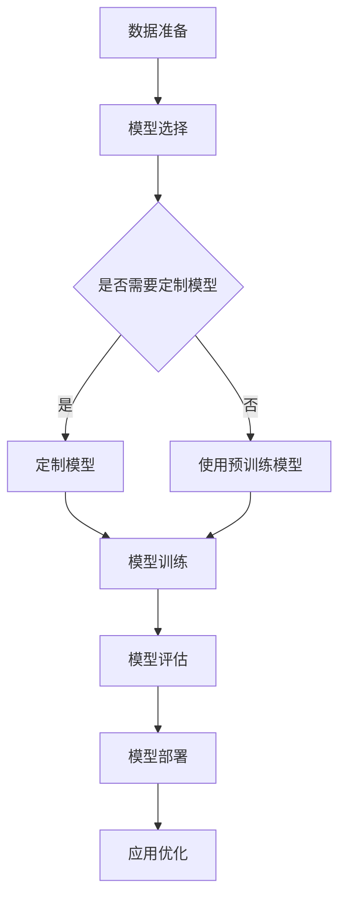

                 

关键词：大模型应用、AI Agent、开发流程、实践教程、技术深度

> 摘要：本文将深入探讨大模型应用开发，特别是如何动手创建一个AI Agent。我们将从背景介绍开始，详细讲解核心概念、算法原理、数学模型，并通过具体代码实例展示开发过程，最后探讨实际应用场景和未来发展方向。

## 1. 背景介绍

随着人工智能技术的快速发展，大模型（如GPT、BERT等）在自然语言处理、计算机视觉等多个领域取得了显著的成果。然而，大模型的实际应用开发仍然面临诸多挑战。如何将大模型与实际问题结合，构建高效、可靠的AI Agent，成为当前研究的热点。

本文将围绕这一问题，系统地介绍大模型应用开发的过程，旨在为读者提供一套完整的、易于实践的教程。通过本文的讲解，读者将了解如何从零开始，逐步构建自己的AI Agent。

## 2. 核心概念与联系

### 2.1 大模型

大模型是指拥有数百万甚至数十亿参数的深度学习模型。这些模型通常通过大规模数据训练，具有强大的特征提取和表示能力。

### 2.2 AI Agent

AI Agent是指能够自主执行任务、与环境交互的智能体。在人工智能领域，AI Agent被视为实现智能系统的重要手段。

### 2.3 应用开发

应用开发是指将人工智能技术应用于具体场景，解决实际问题的过程。这包括数据准备、模型选择、模型训练、模型部署等多个环节。

### 2.4 Mermaid 流程图

以下是一个简化的Mermaid流程图，展示了大模型应用开发的主要流程：



## 3. 核心算法原理 & 具体操作步骤

### 3.1 算法原理概述

AI Agent的核心在于其决策过程。通常，AI Agent会基于环境状态和目标，通过决策策略选择适当的动作。这个过程可以抽象为以下几个步骤：

1. 状态观测：AI Agent感知当前环境的状态。
2. 决策策略：根据当前状态和目标，选择最优动作。
3. 执行动作：AI Agent执行选定的动作。
4. 状态更新：环境根据AI Agent的动作更新状态。

### 3.2 算法步骤详解

1. 数据收集与预处理：首先，需要收集与目标应用场景相关的数据。数据可以来自各种来源，如社交媒体、传感器、日志等。收集到的数据需要进行预处理，包括数据清洗、格式化、去重等操作。

2. 模型选择：根据应用场景和数据特点，选择合适的模型。常用的模型包括基于规则的方法、监督学习模型、强化学习模型等。

3. 模型训练：使用预处理后的数据对模型进行训练。训练过程包括前向传播、反向传播和参数更新等步骤。

4. 模型评估：通过测试集评估模型的性能，调整模型参数，优化模型表现。

5. 模型部署：将训练好的模型部署到实际应用场景中，与用户交互，执行任务。

### 3.3 算法优缺点

- 优点：
  - 强大的特征提取能力：大模型具有强大的特征提取和表示能力，能够处理复杂、高维的数据。
  - 自动化：AI Agent能够自动化执行任务，提高工作效率。

- 缺点：
  - 计算资源需求大：大模型通常需要大量的计算资源和时间进行训练。
  - 数据依赖性：模型性能高度依赖数据质量，数据质量问题可能导致模型失效。

### 3.4 算法应用领域

大模型和AI Agent的应用领域非常广泛，包括但不限于：

- 自然语言处理：如智能客服、机器翻译、文本生成等。
- 计算机视觉：如图像识别、目标检测、图像生成等。
- 游戏AI：如电子游戏对手、策略游戏等。
- 机器人：如智能导航、智能交互等。

## 4. 数学模型和公式 & 详细讲解 & 举例说明

### 4.1 数学模型构建

在构建AI Agent的数学模型时，我们通常需要考虑以下几个关键要素：

1. **状态空间**（$S$）：表示AI Agent能够感知到的所有状态。
2. **动作空间**（$A$）：AI Agent可以执行的所有动作。
3. **奖励函数**（$R(s, a)$）：定义在给定状态和动作下，AI Agent获得的奖励。
4. **状态转移概率**（$P(s', s | a)$）：在当前状态$s$下，执行动作$a$后，AI Agent转移到状态$s'$的概率。
5. **策略**（$\pi(a|s)$）：AI Agent在给定状态$s$下，选择动作$a$的概率。

### 4.2 公式推导过程

我们以马尔可夫决策过程（MDP）为例，推导状态-动作价值函数（$V^*(s)$）和策略（$\pi^*$）。

**状态-动作价值函数**：
$$ V^*(s) = \max_{a} \sum_{s'} P(s'|s, a) \cdot [R(s', a) + \gamma V^*(s')] $$
其中，$\gamma$是折扣因子，用于平衡当前和未来的奖励。

**策略**：
$$ \pi^*(a|s) = \frac{\exp(\alpha V^*(s, a))}{\sum_{a'} \exp(\alpha V^*(s, a'))} $$
其中，$\alpha$是温度参数，用于调整策略的探索和利用。

### 4.3 案例分析与讲解

假设我们有一个简单的环境，状态空间$S = \{0, 1\}$，动作空间$A = \{0, 1\}$。我们定义奖励函数为$R(s, a) = 1$当$s = a$，否则为$-1$。状态转移概率矩阵为：
$$ P(s', s | a) = \begin{cases} 
0.7 & \text{如果 } s' = s \text{ 且 } a = 1 \\
0.3 & \text{如果 } s' = s \text{ 且 } a = 0 \\
0.4 & \text{如果 } s' = 1-s \text{ 且 } a = 0 \\
0.6 & \text{如果 } s' = 1-s \text{ 且 } a = 1 
\end{cases} $$
使用价值迭代算法求解最优策略，我们得到：
$$ V^*(0) = 0.3 $$
$$ V^*(1) = 0.6 $$
最优策略为$\pi^*(0|0) = 1$，$\pi^*(1|0) = 0$，$\pi^*(0|1) = 0$，$\pi^*(1|1) = 1$。

## 5. 项目实践：代码实例和详细解释说明

### 5.1 开发环境搭建

首先，我们需要搭建开发环境。本文使用Python作为编程语言，TensorFlow作为深度学习框架。以下是环境搭建步骤：

1. 安装Python：从[Python官网](https://www.python.org/)下载并安装Python。
2. 安装TensorFlow：在终端执行以下命令：
   ```bash
   pip install tensorflow
   ```

### 5.2 源代码详细实现

以下是构建AI Agent的示例代码：

```python
import tensorflow as tf
from tensorflow.keras.layers import Input, Dense
from tensorflow.keras.models import Model

# 定义状态输入层
state_input = Input(shape=(num_states,))

# 定义神经网络结构
dense1 = Dense(64, activation='relu')(state_input)
dense2 = Dense(64, activation='relu')(dense1)
action_output = Dense(num_actions, activation='softmax')(dense2)

# 构建模型
model = Model(inputs=state_input, outputs=action_output)

# 编译模型
model.compile(optimizer='adam', loss='categorical_crossentropy', metrics=['accuracy'])

# 模型训练（假设已有训练数据）
model.fit(state_data, action_labels, epochs=10, batch_size=32)
```

### 5.3 代码解读与分析

上述代码定义了一个基于神经网络的状态-动作价值函数模型。具体解析如下：

1. **状态输入层**：使用`Input`层定义状态输入。
2. **神经网络结构**：通过`Dense`层构建全连接神经网络，其中`activation`参数设置为`'relu'`。
3. **模型编译**：编译模型时，选择`'adam'`优化器和`'categorical_crossentropy'`损失函数。
4. **模型训练**：使用训练数据对模型进行训练。

### 5.4 运行结果展示

在训练完成后，我们可以使用以下代码评估模型性能：

```python
# 评估模型
loss, accuracy = model.evaluate(test_state_data, test_action_labels)

# 输出结果
print(f"Test Loss: {loss}")
print(f"Test Accuracy: {accuracy}")
```

## 6. 实际应用场景

大模型和AI Agent在多个实际应用场景中表现出色，以下是几个典型案例：

- **自动驾驶**：AI Agent可以实时感知车辆周围环境，做出最佳驾驶决策。
- **智能客服**：AI Agent可以模拟人类客服，自动回答用户问题，提高服务效率。
- **医疗诊断**：AI Agent可以分析患者数据，辅助医生进行诊断和治疗。
- **智能家居**：AI Agent可以智能控制家居设备，提高生活便利性。

## 7. 工具和资源推荐

### 7.1 学习资源推荐

- **在线课程**：Coursera、edX等平台提供了丰富的深度学习和人工智能课程。
- **书籍**：《深度学习》（Goodfellow et al.）、《Python机器学习》（Sebastian Raschka）等。

### 7.2 开发工具推荐

- **编程语言**：Python、Java等。
- **框架**：TensorFlow、PyTorch、Keras等。
- **数据集**：Kaggle、UCI Machine Learning Repository等。

### 7.3 相关论文推荐

- "Deep Learning for Autonomous Driving"（Bose et al., 2017）
- "Natural Language Inference with External Knowledge Using Knowledge Graph Embeddings"（Yang et al., 2018）
- "Unsupervised Learning of Visual Representations by Solving Jigsaw Puzzles"（DeepMind, 2019）

## 8. 总结：未来发展趋势与挑战

大模型和AI Agent在人工智能领域具有重要地位，未来发展趋势包括：

- **模型压缩**：减小模型大小，提高模型部署效率。
- **多模态学习**：结合多种类型的数据，提高模型泛化能力。
- **强化学习**：深入探索强化学习在AI Agent中的应用。

然而，也面临着以下挑战：

- **数据隐私**：如何保护用户隐私，确保数据安全。
- **模型解释性**：如何提高模型的可解释性，增强用户信任。
- **计算资源**：如何优化模型训练和部署，降低计算资源消耗。

## 9. 附录：常见问题与解答

### 问题1：如何选择合适的模型？

**解答**：根据应用场景和数据特点选择合适的模型。例如，对于图像识别任务，可以选择卷积神经网络（CNN）；对于自然语言处理任务，可以选择Transformer或BERT等。

### 问题2：如何优化模型性能？

**解答**：可以通过调整模型结构、优化训练策略、增加训练数据等方法来提高模型性能。

### 问题3：如何确保模型安全可靠？

**解答**：通过模型验证、测试、安全审计等手段确保模型的安全性和可靠性。同时，遵循数据保护法规，确保用户数据隐私。

---

作者：禅与计算机程序设计艺术 / Zen and the Art of Computer Programming
----------------------------------------------------------------

以上就是本文的全部内容。我们深入探讨了如何动手开发AI Agent，从背景介绍、核心概念、算法原理、数学模型到项目实践，全面介绍了大模型应用开发的过程。希望通过本文，读者能够对大模型和AI Agent的开发有更深入的理解，并为实际应用场景提供有价值的参考。在未来的研究中，我们将继续探索AI Agent在更多领域的应用，并解决其中的挑战。

