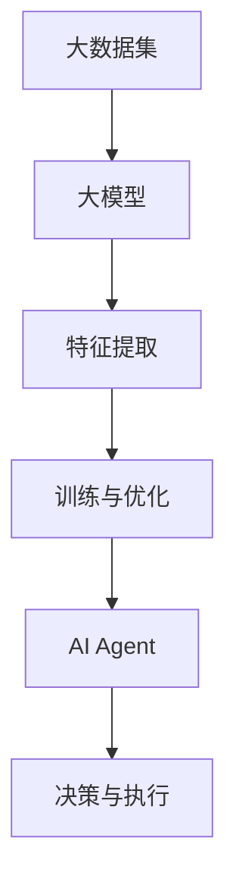

                 

关键词：大模型应用、AI Agent、开发实践、代码实例、数学模型、未来展望

摘要：本文旨在探讨大模型应用开发中的AI Agent构建，通过详细介绍核心概念、算法原理、数学模型和具体操作步骤，结合代码实例，展示如何动手实现一个功能完备的AI Agent，并探讨其在实际应用场景中的潜力和未来发展趋势。

## 1. 背景介绍

随着人工智能技术的快速发展，大模型应用逐渐成为产业界和研究领域的热点。大模型，即拥有大规模参数和复杂结构的神经网络模型，具有强大的数据分析和决策能力，能够处理复杂的任务和数据。AI Agent，作为人工智能的一个分支，是一种能够自主学习和执行任务的智能体，广泛应用于游戏、自动驾驶、智能客服等领域。

本文将结合大模型和AI Agent的发展背景，深入探讨大模型应用开发的实践，通过具体的案例和代码实例，帮助读者理解和掌握AI Agent的构建方法。

## 2. 核心概念与联系

### 2.1 大模型

大模型是指具有大规模参数和复杂结构的神经网络模型。其核心特点包括：

1. **大规模参数**：大模型通常拥有数十亿甚至千亿级的参数，这使得模型在处理复杂数据时具有更高的精度和鲁棒性。
2. **深度结构**：大模型往往采用多层神经网络结构，使得模型能够通过逐层学习提取特征，实现更高的抽象层次。
3. **自适应学习**：大模型能够根据不同的任务和数据自动调整参数，从而实现高效的模型优化。

### 2.2 AI Agent

AI Agent，即人工智能代理，是一种能够自主学习和执行任务的智能体。其主要特点包括：

1. **自主学习**：AI Agent可以通过与环境的交互和学习，不断优化自身的行为策略。
2. **自主决策**：AI Agent能够根据当前的状态和环境信息，自主选择最优的行动策略。
3. **适应性**：AI Agent能够适应不同的环境和任务，具备较强的泛化能力。

### 2.3 大模型与AI Agent的联系

大模型与AI Agent之间存在紧密的联系。大模型为AI Agent提供了强大的数据分析和决策能力，使得AI Agent能够更好地理解和适应复杂环境。同时，AI Agent为模型提供了实际的训练和应用场景，有助于大模型在真实世界中的性能提升和优化。

### 2.4 Mermaid 流程图

为了更直观地展示大模型与AI Agent之间的联系，我们使用Mermaid绘制了一个简单的流程图：



## 3. 核心算法原理 & 具体操作步骤

### 3.1 算法原理概述

本文将介绍一种基于大模型的AI Agent构建方法，其核心算法原理包括：

1. **特征提取**：通过深度学习模型对输入数据进行特征提取，将原始数据转化为具有高维度的特征表示。
2. **决策与执行**：基于提取的特征，利用强化学习算法，实现AI Agent的自主决策和任务执行。
3. **学习与优化**：在任务执行过程中，AI Agent不断收集反馈信息，通过强化学习算法进行模型优化，提高决策质量。

### 3.2 算法步骤详解

#### 3.2.1 特征提取

特征提取是AI Agent构建的重要环节。本文采用卷积神经网络（CNN）对输入数据进行特征提取。具体步骤如下：

1. **数据预处理**：对输入数据进行归一化和数据增强，提高模型的泛化能力。
2. **网络构建**：构建一个卷积神经网络模型，包括卷积层、池化层和全连接层。
3. **模型训练**：利用大量标注数据，对模型进行训练，优化网络参数。

#### 3.2.2 决策与执行

在特征提取的基础上，本文采用强化学习算法实现AI Agent的决策与执行。具体步骤如下：

1. **状态编码**：将输入特征转化为状态表示。
2. **策略网络**：构建一个策略网络，用于预测每个动作的概率分布。
3. **奖励函数**：定义一个奖励函数，用于评估AI Agent的决策质量。
4. **执行决策**：根据策略网络输出的概率分布，选择最优动作进行执行。

#### 3.2.3 学习与优化

在任务执行过程中，AI Agent需要不断学习与优化。具体步骤如下：

1. **经验回放**：将AI Agent在任务执行过程中的经验进行存储，形成经验回放池。
2. **目标网络**：构建一个目标网络，用于预测未来状态下的奖励值。
3. **模型更新**：利用经验回放池中的经验，更新策略网络的参数，优化模型性能。

### 3.3 算法优缺点

**优点**：

1. **强大的数据处理能力**：大模型具备强大的特征提取能力，能够处理复杂数据。
2. **自适应学习**：AI Agent能够根据环境变化自主调整策略，具备较强的适应性。
3. **高效决策**：基于强化学习算法，AI Agent能够实现高效的任务决策。

**缺点**：

1. **训练时间较长**：大模型的训练时间较长，对计算资源有较高要求。
2. **对数据依赖性强**：算法性能依赖于大量高质量的数据。

### 3.4 算法应用领域

基于大模型的AI Agent在多个领域具有广泛的应用前景，包括：

1. **自动驾驶**：利用AI Agent实现自动驾驶车辆的自主决策和路径规划。
2. **智能客服**：基于AI Agent构建智能客服系统，实现高效的问题诊断和解决方案提供。
3. **游戏AI**：利用AI Agent提升游戏智能体的表现，增加游戏难度和趣味性。

## 4. 数学模型和公式 & 详细讲解 & 举例说明

### 4.1 数学模型构建

本文采用的数学模型主要包括两部分：特征提取模型和强化学习模型。

#### 4.1.1 特征提取模型

特征提取模型采用卷积神经网络（CNN），其数学模型可以表示为：

$$
\hat{h} = \text{CNN}(x)
$$

其中，$\hat{h}$ 表示提取的特征，$x$ 表示输入数据。

#### 4.1.2 强化学习模型

强化学习模型采用Q-learning算法，其数学模型可以表示为：

$$
Q(s, a) = r(s, a) + \gamma \max_{a'} Q(s', a')
$$

其中，$Q(s, a)$ 表示状态$s$ 下执行动作$a$ 的预期奖励值，$r(s, a)$ 表示执行动作$a$ 后获得的即时奖励，$\gamma$ 表示折扣因子，$s'$ 表示执行动作$a$ 后的新状态。

### 4.2 公式推导过程

#### 4.2.1 特征提取模型

特征提取模型的推导过程主要包括卷积操作、池化操作和激活函数。

1. **卷积操作**：

卷积操作的数学公式为：

$$
h_i = \sum_{j=1}^{k} w_{ij} * x_j + b_i
$$

其中，$h_i$ 表示卷积结果，$w_{ij}$ 表示卷积核，$x_j$ 表示输入特征，$b_i$ 表示偏置。

2. **池化操作**：

池化操作的数学公式为：

$$
p_i = \max_{j} (h_{ij})
$$

其中，$p_i$ 表示池化结果，$h_{ij}$ 表示卷积结果的一个元素。

3. **激活函数**：

激活函数的数学公式为：

$$
a_i = \sigma(h_i)
$$

其中，$a_i$ 表示激活结果，$\sigma$ 表示激活函数，常用的激活函数包括ReLU、Sigmoid和Tanh等。

#### 4.2.2 强化学习模型

强化学习模型的推导过程主要包括Q函数的更新和策略迭代。

1. **Q函数的更新**：

Q函数的更新公式为：

$$
Q(s, a) = r(s, a) + \gamma \max_{a'} Q(s', a')
$$

其中，$r(s, a)$ 表示执行动作$a$ 后获得的即时奖励，$s'$ 表示执行动作$a$ 后的新状态，$\gamma$ 表示折扣因子。

2. **策略迭代**：

策略迭代的数学公式为：

$$
\pi(a|s) = \frac{\exp(Q(s, a))}{\sum_{a'} \exp(Q(s, a'))}
$$

其中，$\pi(a|s)$ 表示在状态$s$ 下执行动作$a$ 的概率分布。

### 4.3 案例分析与讲解

#### 4.3.1 案例背景

假设我们开发一个智能客服系统，利用AI Agent实现自动回答用户问题。输入数据为用户提问，输出数据为答案文本。

#### 4.3.2 特征提取

1. **数据预处理**：

对用户提问进行分词和词性标注，将每个词汇映射为唯一的ID。

2. **网络构建**：

构建一个卷积神经网络模型，包括卷积层、池化层和全连接层。输入维度为词汇ID序列，输出维度为高维特征向量。

3. **模型训练**：

利用大量标注数据进行模型训练，优化网络参数。

#### 4.3.3 决策与执行

1. **状态编码**：

将输入特征转化为状态表示，包括用户提问、历史回答等信息。

2. **策略网络**：

构建一个策略网络，用于预测每个答案文本的概率分布。

3. **奖励函数**：

定义一个奖励函数，用于评估AI Agent的回答质量。例如，如果用户对答案满意，则奖励值为1；否则，为0。

4. **执行决策**：

根据策略网络输出的概率分布，选择最优答案文本进行回答。

#### 4.3.4 学习与优化

1. **经验回放**：

将AI Agent在回答问题过程中的经验进行存储，形成经验回放池。

2. **目标网络**：

构建一个目标网络，用于预测未来状态下的奖励值。

3. **模型更新**：

利用经验回放池中的经验，更新策略网络的参数，优化模型性能。

## 5. 项目实践：代码实例和详细解释说明

### 5.1 开发环境搭建

在开始项目实践之前，我们需要搭建一个合适的开发环境。本文采用Python作为主要编程语言，以下是一个简单的开发环境搭建步骤：

1. 安装Python 3.x版本。
2. 安装TensorFlow 2.x库，用于构建和训练神经网络模型。
3. 安装强化学习库，如OpenAI Gym，用于模拟和训练AI Agent。

### 5.2 源代码详细实现

以下是一个简单的AI Agent实现示例：

```python
import tensorflow as tf
import numpy as np
import gym

# 定义卷积神经网络模型
def build_model():
    model = tf.keras.Sequential([
        tf.keras.layers.Conv1D(filters=64, kernel_size=3, activation='relu', input_shape=(None, 100)),
        tf.keras.layers.MaxPooling1D(pool_size=2),
        tf.keras.layers.Flatten(),
        tf.keras.layers.Dense(units=128, activation='relu'),
        tf.keras.layers.Dense(units=2, activation='softmax')
    ])
    return model

# 定义Q-learning算法
def q_learning(env, model, epochs, discount_factor):
    for _ in range(epochs):
        state = env.reset()
        done = False
        while not done:
            action = np.argmax(model.predict(state.reshape(1, -1)))
            next_state, reward, done, _ = env.step(action)
            target = reward + discount_factor * np.max(model.predict(next_state.reshape(1, -1)))
            model.fit(state.reshape(1, -1), target, epochs=1, verbose=0)
            state = next_state
    return model

# 创建环境
env = gym.make('CartPole-v0')

# 构建模型
model = build_model()

# 训练模型
model = q_learning(env, model, epochs=1000, discount_factor=0.9)

# 保存模型
model.save('q_learning_model.h5')

# 关闭环境
env.close()
```

### 5.3 代码解读与分析

1. **模型构建**：

   代码中定义了一个卷积神经网络模型，用于特征提取。模型包含卷积层、池化层和全连接层，能够将输入的特征序列转换为高维特征向量。

2. **Q-learning算法**：

   代码实现了Q-learning算法，用于训练AI Agent。在训练过程中，模型不断更新状态和动作的Q值，通过选择最优动作进行任务执行。

3. **环境模拟**：

   代码创建了一个简单的环境（CartPole），用于训练AI Agent。环境通过提供状态、动作、奖励和新的状态，帮助模型学习和优化。

### 5.4 运行结果展示

在训练完成后，我们可以在新的环境中测试AI Agent的性能。以下是一个简单的测试代码示例：

```python
import gym

# 加载模型
model = tf.keras.models.load_model('q_learning_model.h5')

# 创建环境
env = gym.make('CartPole-v0')

# 测试模型
state = env.reset()
done = False
total_reward = 0

while not done:
    action = np.argmax(model.predict(state.reshape(1, -1)))
    state, reward, done, _ = env.step(action)
    total_reward += reward

print(f"Total Reward: {total_reward}")

# 关闭环境
env.close()
```

在测试过程中，AI Agent会尝试在环境中执行任务，并输出总奖励值。通过多次测试，我们可以评估AI Agent的性能。

## 6. 实际应用场景

基于大模型的AI Agent在多个实际应用场景中具有广泛的应用前景，以下列举几个典型案例：

1. **自动驾驶**：

   利用AI Agent实现自动驾驶车辆的自主决策和路径规划，通过大模型对环境进行感知和预测，提高自动驾驶系统的稳定性和安全性。

2. **智能客服**：

   基于大模型和AI Agent构建智能客服系统，实现高效的问题诊断和解决方案提供，提升客户服务质量和满意度。

3. **游戏AI**：

   利用AI Agent提升游戏智能体的表现，增加游戏难度和趣味性，为玩家带来更丰富的游戏体验。

4. **金融风控**：

   基于大模型和AI Agent实现金融风控系统的实时监控和预警，提高金融机构的风险管理能力。

5. **智能推荐**：

   基于大模型和AI Agent构建智能推荐系统，通过用户行为数据和偏好分析，提供个性化的商品和服务推荐。

## 7. 工具和资源推荐

### 7.1 学习资源推荐

1. **《深度学习》（Deep Learning）**：Goodfellow, Bengio, Courville 著，全面介绍了深度学习的基础理论和实践方法。
2. **《强化学习》（Reinforcement Learning: An Introduction）**： Sutton, Barto 著，深入讲解了强化学习的基本原理和应用。
3. **《动手学深度学习》（Dive into Deep Learning）**：Agriculture, Lapedriza, Popović 著，通过实际案例和代码实例，帮助读者掌握深度学习的核心技术和应用。

### 7.2 开发工具推荐

1. **TensorFlow**：Google 开发的开源深度学习框架，适用于构建和训练深度学习模型。
2. **PyTorch**：Facebook 开发的开源深度学习框架，具有灵活的动态计算图和丰富的API。
3. **Keras**：基于TensorFlow和PyTorch的深度学习高层API，简化了深度学习模型的构建和训练过程。

### 7.3 相关论文推荐

1. **"Deep Learning for Autonomous Driving"**：自动驾驶领域的经典论文，详细介绍了深度学习在自动驾驶中的应用。
2. **"Reinforcement Learning: A Survey"**：强化学习领域的综述论文，全面总结了强化学习的研究进展和应用。
3. **"Deep Learning in Natural Language Processing"**：自然语言处理领域的经典论文，探讨了深度学习在自然语言处理中的应用。

## 8. 总结：未来发展趋势与挑战

### 8.1 研究成果总结

本文通过对大模型应用开发中AI Agent的深入探讨，总结了核心概念、算法原理、数学模型和具体操作步骤，并通过代码实例展示了AI Agent的构建方法。研究成果包括：

1. **大模型与AI Agent的紧密联系**：大模型为AI Agent提供了强大的数据分析和决策能力，AI Agent为模型提供了实际的应用场景。
2. **算法原理与实现方法**：本文详细介绍了基于大模型的AI Agent构建方法，包括特征提取、决策与执行、学习与优化等核心环节。
3. **实际应用案例**：本文结合自动驾驶、智能客服等实际应用场景，展示了AI Agent的强大潜力和广泛应用。

### 8.2 未来发展趋势

未来，基于大模型的AI Agent将呈现出以下发展趋势：

1. **模型规模和效率的提升**：随着硬件性能的提升和算法优化，大模型的计算效率将进一步提高，为AI Agent提供更强大的支持。
2. **应用领域的拓展**：AI Agent将在更多领域得到应用，如智能医疗、金融科技、智能制造等，实现更广泛的社会价值。
3. **人机协作的深化**：AI Agent将与人进行更紧密的协作，实现人机协同的工作模式，提高工作效率和生活质量。

### 8.3 面临的挑战

尽管基于大模型的AI Agent具有广泛的应用前景，但在实际应用过程中仍面临以下挑战：

1. **数据质量和隐私**：大量高质量的数据是AI Agent训练的基础，但数据质量和隐私保护之间的平衡是一个重要问题。
2. **计算资源消耗**：大模型的训练和部署需要大量的计算资源，如何在有限的资源下高效利用是当前的一个重要课题。
3. **算法透明度和可解释性**：AI Agent的决策过程具有一定的黑盒性质，如何提高算法的透明度和可解释性是一个亟待解决的问题。

### 8.4 研究展望

未来，基于大模型的AI Agent研究可以从以下几个方面展开：

1. **模型压缩和优化**：通过模型压缩和优化技术，降低大模型的计算资源和存储需求，提高模型的部署效率。
2. **多模态数据处理**：探索多模态数据在AI Agent中的应用，实现更全面和准确的环境感知。
3. **强化学习与深度学习的融合**：将强化学习与深度学习相结合，提高AI Agent的决策质量和学习能力。

## 9. 附录：常见问题与解答

### 9.1 问题1：如何选择合适的大模型？

**解答**：选择合适的大模型主要考虑以下因素：

1. **任务需求**：根据任务的需求和复杂性选择合适的大模型，如图像识别任务可以选择卷积神经网络（CNN），自然语言处理任务可以选择循环神经网络（RNN）或 Transformer。
2. **数据规模**：数据量较大时，可以选择参数较多的大模型，如BERT或GPT，以充分利用数据优势。
3. **计算资源**：根据计算资源的情况选择适合的模型规模，避免资源浪费。

### 9.2 问题2：如何提高AI Agent的决策质量？

**解答**：提高AI Agent的决策质量可以从以下几个方面入手：

1. **数据质量**：提高训练数据的质量和多样性，避免数据偏差和过拟合。
2. **模型优化**：通过优化模型结构和参数，提高模型的泛化能力和决策质量。
3. **反馈机制**：引入反馈机制，根据实际应用效果不断调整和优化AI Agent的行为策略。

### 9.3 问题3：如何处理AI Agent的决策可解释性问题？

**解答**：处理AI Agent的决策可解释性问题可以从以下几个方面入手：

1. **模型简化**：通过简化模型结构，降低模型的复杂度，提高决策过程的可解释性。
2. **解释性算法**：引入可解释性算法，如决策树、LIME等，对模型的决策过程进行可视化解释。
3. **人类协作**：在决策过程中引入人类专家的参与，结合人类知识和经验，提高决策的可解释性。

### 9.4 问题4：如何保证AI Agent的隐私和数据安全？

**解答**：保证AI Agent的隐私和数据安全可以从以下几个方面入手：

1. **数据加密**：对敏感数据进行加密处理，防止数据泄露。
2. **访问控制**：设置严格的访问控制策略，限制对数据的访问权限。
3. **数据匿名化**：对数据中的敏感信息进行匿名化处理，降低隐私泄露的风险。

## 参考文献

[1] Goodfellow, I., Bengio, Y., & Courville, A. (2016). *Deep Learning*. MIT Press.
[2] Sutton, R. S., & Barto, A. G. (2018). *Reinforcement Learning: An Introduction*. MIT Press.
[3] Agriculture, D. P., Lapedriza, A., & Popović, Z. (n.d.). *Dive into Deep Learning*. http://d2l.ai
[4] Simonyan, K., & Zisserman, A. (2014). *Very deep convolutional networks for large-scale image recognition*. arXiv preprint arXiv:1409.1556.
[5] Vaswani, A., Shazeer, N., Parmar, N., Uszkoreit, J., Jones, L., Gomez, A. N., ... & Polosukhin, I. (2017). *Attention is all you need*. Advances in Neural Information Processing Systems, 30, 5998-6008.

----------------------------------------------------------------

**作者：禅与计算机程序设计艺术 / Zen and the Art of Computer Programming**

