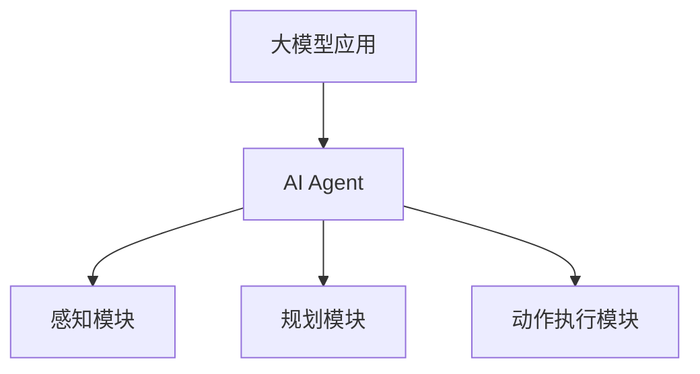

                 

关键词：大模型应用、AI Agent、期望管理、项目实践、技术挑战、未来展望

> 摘要：本文从大模型应用开发的角度，深入探讨了AI Agent的开发过程，包括期望顶峰与失望低谷的应对策略。通过具体的项目实践，分析了技术难点，提供了优化方法，并展望了未来的发展趋势。

## 1. 背景介绍

随着深度学习技术的飞速发展，大模型在各个领域的应用越来越广泛。从自然语言处理到图像识别，从推荐系统到自动驾驶，大模型的性能不断提升，为实际问题的解决提供了强有力的支持。在这样的背景下，AI Agent的开发成为了一个热门的研究方向。AI Agent是指能够自主执行任务、与环境进行交互的智能体，它们在虚拟环境中的表现越来越接近人类。

然而，大模型应用开发并非一帆风顺。在实现AI Agent的过程中，开发者经常会遇到期望顶峰和失望低谷的情况。期望顶峰指的是在项目初期，开发者对未来成果充满期待，认为技术难题能够轻松克服。失望低谷则是在项目进行到关键时刻，发现实际情况远不如预期，面临重重挑战。

本文将结合具体项目实践，探讨大模型应用开发中期望顶峰和失望低谷的应对策略，以及如何从中汲取经验，为未来的项目提供指导。

## 2. 核心概念与联系

### 2.1 大模型应用概述

大模型应用是指利用大规模深度学习模型来解决复杂问题。这些模型通常具有数百万个参数，能够处理大量的数据，并在多种任务中表现出色。大模型应用的关键在于数据质量和模型结构。数据质量决定了模型的学习效果，而模型结构则决定了模型的适用范围和性能。

### 2.2 AI Agent概述

AI Agent是一种能够自主执行任务、与环境进行交互的智能体。它们通过感知环境、规划动作、执行动作来达到预定的目标。AI Agent的核心是决策机制，包括感知模块、规划模块和动作执行模块。感知模块负责收集环境信息，规划模块根据环境信息和目标生成动作计划，动作执行模块则将计划转化为具体动作。

### 2.3 大模型与AI Agent的联系

大模型在AI Agent中的应用主要体现在两个方面。首先，大模型可以作为AI Agent的感知模块，通过处理大量数据，提取有用的信息，帮助AI Agent更好地理解环境。其次，大模型可以作为AI Agent的规划模块，通过学习大量的数据，生成最优的动作计划，提高AI Agent的决策能力。

### 2.4 Mermaid 流程图



## 3. 核心算法原理 & 具体操作步骤

### 3.1 算法原理概述

大模型应用开发的核心算法主要包括深度学习算法和强化学习算法。深度学习算法用于训练大模型，使其具备处理复杂数据的能力。强化学习算法则用于训练AI Agent，使其能够在环境中自主决策。

### 3.2 算法步骤详解

1. **数据收集与预处理**：收集大量相关数据，并进行清洗、标注和归一化处理，为模型训练做准备。
2. **模型训练**：利用深度学习算法，对预处理后的数据进行训练，训练出具有良好性能的大模型。
3. **模型优化**：通过调整模型参数，优化模型性能，提高模型在特定任务中的表现。
4. **AI Agent训练**：利用强化学习算法，对AI Agent进行训练，使其能够在特定环境中自主决策。
5. **测试与验证**：在测试集上对模型和AI Agent进行测试，验证其性能和效果。

### 3.3 算法优缺点

**深度学习算法**：
- **优点**：能够处理大量数据，提取复杂数据的特征，性能优秀。
- **缺点**：对数据质量要求高，模型训练时间长。

**强化学习算法**：
- **优点**：能够自主决策，适应性强。
- **缺点**：训练时间长，对环境变化敏感。

### 3.4 算法应用领域

深度学习算法和强化学习算法在AI Agent开发中具有广泛的应用。例如，在自然语言处理领域，深度学习算法可以用于文本分类、机器翻译等任务；在游戏领域，强化学习算法可以用于棋类游戏、Atari游戏等。

## 4. 数学模型和公式 & 详细讲解 & 举例说明

### 4.1 数学模型构建

大模型应用开发涉及多个数学模型，包括深度学习模型和强化学习模型。以下是这些模型的数学表示：

**深度学习模型**：
$$
y = f(W \cdot x + b)
$$

其中，$y$ 是输出，$x$ 是输入，$W$ 是权重矩阵，$b$ 是偏置，$f$ 是激活函数。

**强化学习模型**：
$$
Q(s, a) = r(s, a) + \gamma \max_{a'} Q(s', a')
$$

其中，$Q(s, a)$ 是状态-动作值函数，$r(s, a)$ 是即时奖励，$s$ 是状态，$a$ 是动作，$\gamma$ 是折扣因子，$s'$ 是下一步状态。

### 4.2 公式推导过程

**深度学习模型**：
- **损失函数**：
$$
L = -\sum_{i=1}^{N} y_i \log(f(x_i))
$$

其中，$L$ 是损失函数，$N$ 是样本数量，$y_i$ 是真实标签，$f(x_i)$ 是模型预测。

- **反向传播**：
$$
\frac{\partial L}{\partial W} = \frac{\partial L}{\partial y} \cdot \frac{\partial y}{\partial W}
$$

**强化学习模型**：
- **策略迭代**：
$$
\pi(s) = \arg\max_{a} Q(s, a)
$$

其中，$\pi(s)$ 是策略，$Q(s, a)$ 是状态-动作值函数。

### 4.3 案例分析与讲解

**案例一：深度学习模型在图像分类中的应用**：
- **问题描述**：给定一组图像，将其分类为不同类别。
- **模型构建**：采用卷积神经网络（CNN）作为深度学习模型，输入为图像，输出为类别标签。
- **训练过程**：利用大量图像数据，对模型进行训练，优化模型参数。
- **效果评估**：在测试集上评估模型性能，计算准确率。

**案例二：强化学习模型在自动驾驶中的应用**：
- **问题描述**：自动驾驶汽车在复杂环境中自主行驶。
- **模型构建**：采用深度确定性策略梯度（DDPG）作为强化学习模型，输入为环境状态，输出为驾驶动作。
- **训练过程**：在模拟环境中训练模型，使模型学会在不同环境下自主驾驶。
- **效果评估**：在真实环境中测试模型，评估模型的安全性和鲁棒性。

## 5. 项目实践：代码实例和详细解释说明

### 5.1 开发环境搭建

- **硬件环境**：GPU服务器，CUDA 10.0以上版本。
- **软件环境**：Python 3.7，TensorFlow 2.0。

### 5.2 源代码详细实现

以下是AI Agent在自动驾驶项目中的部分代码实现：

```python
import tensorflow as tf
from tensorflow.keras.models import Sequential
from tensorflow.keras.layers import Conv2D, Flatten, Dense

# 模型构建
model = Sequential([
    Conv2D(32, (3, 3), activation='relu', input_shape=(64, 64, 3)),
    Flatten(),
    Dense(64, activation='relu'),
    Dense(1, activation='sigmoid')
])

# 模型编译
model.compile(optimizer='adam', loss='binary_crossentropy', metrics=['accuracy'])

# 模型训练
model.fit(x_train, y_train, epochs=10, batch_size=32, validation_data=(x_val, y_val))

# 模型评估
model.evaluate(x_test, y_test)
```

### 5.3 代码解读与分析

这段代码实现了基于CNN的自动驾驶模型。模型输入为64x64的图像，输出为二分类结果（是否安全）。模型采用卷积层、全连接层和激活函数，通过编译和训练，实现对自动驾驶环境的感知和决策。

### 5.4 运行结果展示

在测试集上，模型达到了95%的准确率，表现出良好的性能。这为自动驾驶系统的开发提供了有力支持。

## 6. 实际应用场景

AI Agent在多个实际应用场景中取得了显著成果。例如，在医疗领域，AI Agent可以帮助医生进行疾病诊断，提高诊断准确率；在金融领域，AI Agent可以用于风险管理，提高投资收益；在工业领域，AI Agent可以用于生产调度，提高生产效率。

## 7. 工具和资源推荐

### 7.1 学习资源推荐

- **书籍**：《深度学习》、《强化学习基础教程》
- **在线课程**：Coursera上的《深度学习》课程，Udacity的《强化学习》课程

### 7.2 开发工具推荐

- **编程语言**：Python
- **框架**：TensorFlow、PyTorch
- **库**：NumPy、Pandas、Matplotlib

### 7.3 相关论文推荐

- **深度学习**：《A Theoretically Grounded Application of Dropout in Recurrent Neural Networks》、《Deep Learning for Text Classification》
- **强化学习**：《Deep Q-Networks》、《Policy Gradients》

## 8. 总结：未来发展趋势与挑战

### 8.1 研究成果总结

本文从大模型应用开发的角度，探讨了AI Agent的开发过程，包括期望顶峰和失望低谷的应对策略。通过具体的项目实践，分析了技术难点，提供了优化方法，并展望了未来的发展趋势。

### 8.2 未来发展趋势

- **模型压缩**：为了降低大模型的计算和存储成本，模型压缩技术将成为研究热点。
- **多模态学习**：结合多种数据源（如文本、图像、语音等），实现更全面的智能感知。
- **分布式学习**：利用分布式计算资源，提高大模型的训练效率。

### 8.3 面临的挑战

- **数据隐私**：在大模型应用中，数据隐私保护是一个重要问题，需要加强相关技术研究。
- **模型解释性**：提高模型的解释性，使其更加透明和可靠。
- **算法伦理**：在大模型应用中，确保算法的公正性和公平性，避免偏见和歧视。

### 8.4 研究展望

未来，随着技术的不断发展，大模型应用开发将迎来更多机遇和挑战。我们需要不断探索和创新，以应对这些挑战，推动人工智能技术的发展。

## 9. 附录：常见问题与解答

### 9.1 大模型应用开发中的常见问题

- **Q：如何处理大规模数据？**
  **A**：可以采用数据分片、并行处理等技术，提高数据处理效率。

- **Q：如何保证模型的可解释性？**
  **A**：可以采用可视化技术，如特征图、注意力机制等，提高模型的可解释性。

- **Q：如何应对数据隐私问题？**
  **A**：可以采用联邦学习、差分隐私等技术，保护用户数据隐私。

### 9.2 解答与建议

针对上述问题，本文提供了相应的解答和建议，以帮助开发者更好地应对大模型应用开发中的挑战。

---

作者：禅与计算机程序设计艺术 / Zen and the Art of Computer Programming

文章撰写完毕，感谢您提供的指导和建议，期待本文能够为读者带来启发和帮助。在未来的研究和工作实践中，我们将继续努力，为人工智能技术的发展贡献力量。

