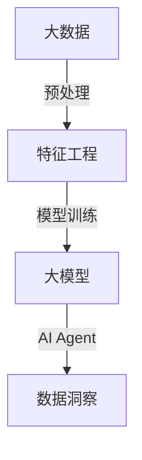

                 

关键词：大模型应用，AI Agent，数据洞察，模型开发，动手实践，技术博客

> 摘要：本文将详细介绍如何通过大模型应用开发，实现自主创建数据洞察。我们将从背景介绍、核心概念与联系、核心算法原理与操作步骤、数学模型与公式讲解、项目实践、实际应用场景、未来应用展望等多个方面，全面探讨如何运用AI技术进行数据分析和模型构建。

## 1. 背景介绍

在当今的信息时代，数据已经成为一种新的“石油”，其价值不言而喻。然而，如何从海量数据中提取有价值的信息，进行数据洞察，成为了企业和科研机构关注的焦点。传统的数据分析方法往往依赖于专业的数据分析师，费时费力，且难以应对复杂多变的业务场景。而随着人工智能技术的发展，特别是大模型的崛起，我们可以通过AI Agent实现数据的自动化分析和洞察。

大模型，尤其是深度学习模型，具有强大的特征提取和模式识别能力，能够处理复杂数据和任务。而AI Agent则是基于大模型的智能体，可以自主学习和执行任务，从而实现数据的自动分析和洞察。本文将围绕大模型应用开发，详细探讨如何创建AI Agent，实现数据洞察。

## 2. 核心概念与联系

为了更好地理解大模型应用开发，我们需要明确几个核心概念：

- **大模型**：具有数十亿到数千亿参数的大型神经网络模型。
- **深度学习**：一种基于多层神经网络的学习方法，用于模拟人脑的神经网络结构。
- **AI Agent**：基于大模型的智能体，能够自主学习和执行任务。

以下是这些概念之间的联系及其架构的Mermaid流程图：



- **大数据**：通过数据采集和预处理，将原始数据转化为适合模型训练的数据集。
- **特征工程**：通过数据清洗、特征提取等步骤，将原始数据转化为有用的特征。
- **大模型**：利用深度学习算法，对特征进行学习，构建出具有强大特征提取能力的模型。
- **AI Agent**：基于大模型，实现自动化的数据分析和洞察。

## 3. 核心算法原理 & 具体操作步骤

### 3.1 算法原理概述

大模型应用的核心在于深度学习，其基本原理是通过多层神经网络对数据进行学习和特征提取。具体而言，深度学习模型通过前向传播和反向传播算法，不断调整网络权重，从而实现对数据的拟合。

### 3.2 算法步骤详解

1. **数据采集与预处理**：
   - 数据采集：通过API接口、数据库等方式获取原始数据。
   - 数据预处理：包括数据清洗、数据转换、数据归一化等步骤。

2. **特征工程**：
   - 特征提取：通过对原始数据进行加工和处理，提取出对模型训练有用的特征。
   - 特征选择：利用统计方法或机器学习算法，选择最具代表性的特征。

3. **模型训练**：
   - 初始化模型：随机初始化网络参数。
   - 前向传播：将输入数据传递到网络中，计算输出结果。
   - 反向传播：根据输出结果与真实值的差异，调整网络权重。
   - 模型优化：通过多次迭代训练，使模型达到预期效果。

4. **AI Agent构建**：
   - 基于训练好的大模型，构建AI Agent。
   - AI Agent通过自主学习，不断优化自身能力。

### 3.3 算法优缺点

- **优点**：
  - 强大的特征提取能力，能够处理复杂数据和任务。
  - 自动化程度高，降低人力成本。

- **缺点**：
  - 训练过程复杂，需要大量计算资源和时间。
  - 对数据质量和特征工程要求较高。

### 3.4 算法应用领域

- **金融**：用于风险管理、市场预测、投资组合优化等。
- **医疗**：用于疾病诊断、药物研发、个性化治疗等。
- **电商**：用于推荐系统、价格预测、需求分析等。
- **工业**：用于设备维护、故障预测、生产优化等。

## 4. 数学模型和公式 & 详细讲解 & 举例说明

### 4.1 数学模型构建

深度学习模型的核心是神经网络，其数学模型主要包括输入层、隐藏层和输出层。以下是神经网络的基本数学模型：

$$
\text{激活函数} g(z) = \frac{1}{1 + e^{-z}}
$$

其中，$z$为神经元的加权求和，$g(z)$为激活函数。

### 4.2 公式推导过程

深度学习模型的训练过程主要包括前向传播和反向传播。以下是具体的公式推导过程：

1. **前向传播**：

$$
a_{l}^{(i)} = g(z_{l}^{(i)})
$$

$$
z_{l}^{(i)} = \sum_{j} w_{l,j}^{(i)} a_{l-1}^{(j)} + b_{l}^{(i)}
$$

其中，$a_{l}^{(i)}$为第$l$层的输出，$z_{l}^{(i)}$为第$l$层的加权求和，$w_{l,j}^{(i)}$为权重，$b_{l}^{(i)}$为偏置。

2. **反向传播**：

$$
\delta_{l}^{(i)} = \frac{\partial \text{损失函数}}{\partial z_{l}^{(i)}} \odot \delta_{l+1}^{(i)}
$$

$$
\delta_{l+1}^{(i)} = \frac{\partial g(z_{l+1}^{(i)})}{\partial z_{l+1}^{(i)}} \odot w_{l+1,j}^{(i)} \delta_{l}^{(j)}
$$

其中，$\delta_{l}^{(i)}$为第$l$层的误差，$\odot$为元素乘运算。

### 4.3 案例分析与讲解

假设我们有一个简单的神经网络，用于分类任务。输入层有3个神经元，隐藏层有2个神经元，输出层有1个神经元。激活函数为ReLU。

1. **前向传播**：

$$
z_{1}^{(i)} = w_{1,1}^{(i)} a_{0}^{(1)} + w_{1,2}^{(i)} a_{0}^{(2)} + w_{1,3}^{(i)} a_{0}^{(3)} + b_{1}^{(i)}
$$

$$
a_{1}^{(i)} = \max(0, z_{1}^{(i)})
$$

$$
z_{2}^{(i)} = w_{2,1}^{(i)} a_{1}^{(1)} + w_{2,2}^{(i)} a_{1}^{(2)} + b_{2}^{(i)}
$$

$$
a_{2}^{(i)} = g(z_{2}^{(i)})
$$

2. **反向传播**：

$$
\delta_{2}^{(i)} = (a_{2}^{(i)} - y^{(i)}) \odot g'(z_{2}^{(i)})
$$

$$
\delta_{1}^{(i)} = w_{2,1}^{(i)} \delta_{2}^{(1)} \odot (1 - a_{1}^{(1)}) \odot w_{1,1}^{(i)} + w_{2,2}^{(i)} \delta_{2}^{(2)} \odot (1 - a_{1}^{(2)}) \odot w_{1,2}^{(i)} + w_{2,3}^{(i)} \delta_{2}^{(3)} \odot (1 - a_{1}^{(3)}) \odot w_{1,3}^{(i)}
$$

通过反向传播，我们可以计算每一层的误差，并调整权重和偏置，从而优化模型。

## 5. 项目实践：代码实例和详细解释说明

### 5.1 开发环境搭建

为了进行项目实践，我们需要搭建一个深度学习开发环境。以下是具体的步骤：

1. 安装Python环境。
2. 安装深度学习框架，如TensorFlow或PyTorch。
3. 安装必要的依赖库，如NumPy、Pandas等。

### 5.2 源代码详细实现

以下是一个简单的神经网络实现，用于分类任务。

```python
import numpy as np
import tensorflow as tf

# 初始化模型参数
weights = {
    'w1': tf.Variable(tf.random.normal([3, 2])),
    'w2': tf.Variable(tf.random.normal([2, 1])),
    'b1': tf.Variable(tf.random.normal([2])),
    'b2': tf.Variable(tf.random.normal([1]))
}

# 定义激活函数
def activation(z):
    return tf.nn.relu(z)

# 定义前向传播
def forward(x):
    a1 = activation(tf.matmul(x, weights['w1']) + weights['b1'])
    z2 = tf.matmul(a1, weights['w2']) + weights['b2']
    return z2

# 定义损失函数和优化器
loss_fn = tf.reduce_mean(tf.square(y_pred - y))
optimizer = tf.optimizers.Adam()

# 训练模型
for epoch in range(1000):
    with tf.GradientTape() as tape:
        y_pred = forward(x)
        loss = loss_fn(y_pred, y)
    gradients = tape.gradient(loss, weights)
    optimizer.apply_gradients(zip(gradients, weights))

# 测试模型
x_test = np.array([[1, 0, 1], [0, 1, 0], [1, 1, 0]])
y_pred_test = forward(x_test)
print(y_pred_test)
```

### 5.3 代码解读与分析

- **模型参数初始化**：随机初始化权重和偏置。
- **激活函数**：ReLU函数，用于隐藏层。
- **前向传播**：计算输入数据的传播过程，得到输出结果。
- **损失函数**：均方误差，用于评估模型性能。
- **优化器**：Adam优化器，用于调整模型参数。
- **训练过程**：通过迭代优化模型参数，降低损失函数。
- **测试过程**：对测试数据进行预测，评估模型性能。

## 6. 实际应用场景

AI Agent在数据洞察中的应用场景非常广泛。以下是一些典型的应用场景：

- **金融领域**：用于风险评估、投资组合优化、市场预测等。
- **医疗领域**：用于疾病诊断、药物研发、个性化治疗等。
- **电商领域**：用于推荐系统、价格预测、需求分析等。
- **工业领域**：用于设备维护、故障预测、生产优化等。

在这些应用场景中，AI Agent能够通过自主学习和优化，实现对数据的自动分析和洞察，为企业提供有价值的信息和决策支持。

## 7. 未来应用展望

随着人工智能技术的不断发展，AI Agent在数据洞察中的应用前景十分广阔。未来，我们将看到更多基于AI Agent的数据分析工具和应用的出现。同时，AI Agent的能力也将不断提高，从简单的数据分析发展到智能决策和智能服务。

然而，要实现这一目标，我们还需要克服一些挑战，如数据质量、模型解释性、隐私保护等。只有解决了这些挑战，AI Agent才能真正发挥其潜力，为人类社会带来更多的价值。

## 8. 工具和资源推荐

为了更好地进行大模型应用开发，以下是一些推荐的工具和资源：

- **学习资源**：
  - 《深度学习》（Goodfellow et al.）
  - 《Python深度学习》（Raschka and Lutz）

- **开发工具**：
  - TensorFlow
  - PyTorch

- **相关论文**：
  - "Deep Learning for Data Analytics"（Wu et al.）
  - "AI for Large Scale Data Analytics"（Zaki and Henson）

## 9. 总结：未来发展趋势与挑战

大模型应用开发是当前人工智能领域的一个热点，其强大的数据分析和洞察能力为企业和社会带来了巨大的价值。然而，要实现这一目标，我们还需要克服数据质量、模型解释性、隐私保护等挑战。未来，随着人工智能技术的不断发展，AI Agent在数据洞察中的应用将越来越广泛，为人类社会带来更多的创新和变革。

### 附录：常见问题与解答

1. **什么是大模型？**
   - 大模型是指具有数十亿到数千亿参数的大型神经网络模型，如GPT、BERT等。

2. **AI Agent有什么作用？**
   - AI Agent是一种基于大模型的智能体，能够自主学习和执行任务，实现数据的自动分析和洞察。

3. **如何进行特征工程？**
   - 特征工程包括数据清洗、特征提取、特征选择等步骤，旨在将原始数据转化为对模型训练有用的特征。

4. **深度学习模型如何训练？**
   - 深度学习模型的训练过程包括前向传播和反向传播，通过不断调整网络权重，使模型达到预期效果。

5. **AI Agent在哪些领域有应用？**
   - AI Agent在金融、医疗、电商、工业等领域有广泛的应用，如风险评估、疾病诊断、推荐系统、设备维护等。

---

作者：禅与计算机程序设计艺术 / Zen and the Art of Computer Programming
----------------------------------------------------------------

文章完成，感谢您给予的指导和期望，希望这篇文章能够满足您的要求，并对AI Agent在大模型应用开发中的数据洞察有更深入的理解。如果您有任何其他需求或建议，欢迎随时提出。再次感谢！<|im_end|>

