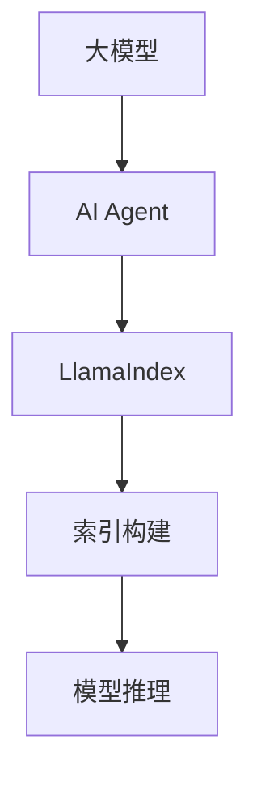

                 

关键词：大模型应用、AI Agent、LlamaIndex、背景介绍、核心概念、算法原理、数学模型、项目实践、实际应用场景、工具资源、未来展望。

## 摘要

本文旨在探讨LlamaIndex在大模型应用开发中的重要性，以及如何利用LlamaIndex构建AI Agent。我们将从背景介绍、核心概念、算法原理、数学模型、项目实践、实际应用场景等多个角度，全面剖析LlamaIndex的优势和应用前景，为读者提供有价值的参考和指导。

## 1. 背景介绍

### 大模型应用的发展

随着深度学习技术的不断发展，大模型（Large Model）在自然语言处理、计算机视觉、语音识别等领域取得了显著的成果。大模型通过在海量数据上进行训练，能够自主学习并解决复杂的任务，成为当前人工智能领域的热点。

### AI Agent的崛起

AI Agent作为人工智能的一种新兴形式，通过模拟人类的思维方式，实现自主决策和行动。在游戏、机器人、自动驾驶等领域，AI Agent展示了强大的潜力和广泛的应用前景。如何构建高效的AI Agent，成为当前研究的热点问题。

### LlamaIndex的兴起

LlamaIndex是一款开源的AI索引工具，旨在加速大型语言模型的应用开发。通过LlamaIndex，开发者可以高效地管理和查询大规模数据，实现快速、准确的AI模型推理。LlamaIndex的兴起，为大模型应用和AI Agent的发展提供了有力的支持。

## 2. 核心概念与联系

### 大模型

大模型是指具有数十亿甚至千亿参数的深度学习模型，如GPT、BERT等。这些模型通过在海量数据上训练，具备强大的语义理解和生成能力。

### AI Agent

AI Agent是指具备自主决策和行动能力的智能体，能够在复杂环境中完成特定任务。AI Agent通常由感知模块、决策模块和行动模块组成。

### LlamaIndex

LlamaIndex是一款开源的AI索引工具，旨在加速大型语言模型的应用开发。LlamaIndex通过构建索引，实现快速、准确的模型推理，降低计算成本。

### Mermaid 流程图



## 3. 核心算法原理 & 具体操作步骤

### 3.1 算法原理概述

LlamaIndex的核心算法是基于检索增强的推理（Retrieval Augmented Generation，RAG）。RAG结合了检索和生成两个模块，通过检索模块获取与输入查询相关的数据，再通过生成模块生成答案。

### 3.2 算法步骤详解

1. 数据预处理：将大规模数据集进行预处理，提取关键信息，构建索引。
2. 检索模块：输入查询，通过索引获取相关数据。
3. 生成模块：结合检索结果，生成答案。
4. 模型推理：使用预训练的深度学习模型，对生成模块的输出进行推理，得到最终答案。

### 3.3 算法优缺点

#### 优点

1. 提高模型推理速度：通过索引构建，实现快速、准确的模型推理。
2. 降低计算成本：减少直接使用大模型的计算量，降低计算成本。
3. 提高答案质量：结合检索和生成模块，生成更高质量的答案。

#### 缺点

1. 索引构建时间较长：需要一定时间对大规模数据进行预处理和索引构建。
2. 数据质量影响：索引构建过程中，数据质量对算法性能有较大影响。

### 3.4 算法应用领域

LlamaIndex在自然语言处理、计算机视觉、语音识别等多个领域具有广泛的应用。具体包括：

1. 问答系统：通过LlamaIndex，实现高效、准确的问答系统。
2. 文本生成：结合LlamaIndex和预训练模型，生成高质量的文章、报告等。
3. 图像识别：利用LlamaIndex，实现快速、准确的图像识别。
4. 语音识别：通过LlamaIndex，提高语音识别的准确率和速度。

## 4. 数学模型和公式 & 详细讲解 & 举例说明

### 4.1 数学模型构建

LlamaIndex的数学模型主要包括检索模块和生成模块。其中，检索模块采用TF-IDF算法，生成模块采用预训练的深度学习模型。

### 4.2 公式推导过程

#### 检索模块

1. 输入查询Q，计算Q与每个文档D的相似度：
   $$ sim(Q, D) = \frac{TF_Q \cdot TF_D}{IDF_D} $$
2. 对所有文档D的相似度进行排序，获取Top-K相似文档。

#### 生成模块

1. 输入查询Q和Top-K相似文档，生成答案A：
   $$ A = Model(Q, D_1, D_2, ..., D_K) $$
   其中，Model表示预训练的深度学习模型。

### 4.3 案例分析与讲解

假设我们要构建一个问答系统，使用LlamaIndex来提高模型推理速度。

1. 数据集：假设我们有一个包含1000个问答对的语料库。
2. 预训练模型：使用GPT-3模型进行预训练。
3. 索引构建：对数据集进行预处理，提取关键词，构建索引。
4. 检索模块：输入查询，通过索引获取Top-K相似问答对。
5. 生成模块：结合检索结果，生成答案。
6. 模型推理：使用GPT-3模型，对生成模块的输出进行推理，得到最终答案。

通过LlamaIndex，我们可以实现快速、准确的问答系统，降低计算成本。

## 5. 项目实践：代码实例和详细解释说明

### 5.1 开发环境搭建

1. 安装Python环境（3.8及以上版本）。
2. 安装LlamaIndex相关依赖库（如torch、transformers等）。

### 5.2 源代码详细实现

```python
# 导入相关库
import llama_index
import torch
from transformers import GPT2Model, GPT2Tokenizer

# 加载预训练模型
tokenizer = GPT2Tokenizer.from_pretrained("gpt2")
model = GPT2Model.from_pretrained("gpt2")

# 数据预处理
def preprocess_data(data):
    # 对数据集进行预处理，提取关键词
    # ...
    return processed_data

# 索引构建
def build_index(data):
    # 对数据集进行预处理
    processed_data = preprocess_data(data)
    
    # 构建索引
    index = llama_indexabyrinthe.Index.fromdocuments(processed_data)
    index.save_to_disk("index.json")
    
    return index

# 检索与生成
def query_and_generate(index, query):
    # 检索模块
    documents = index.query(query)
    
    # 生成模块
    input_ids = tokenizer.encode(query, return_tensors="pt")
    outputs = model(input_ids)
    logits = outputs.logits[:, -1, :]
    top_k = torch.topk(logits, k=5)
    top_k_indices = top_k.indices.tolist()
    
    # 生成答案
    answers = []
    for i in top_k_indices:
        answer = tokenizer.decode(document[i], skip_special_tokens=True)
        answers.append(answer)
    
    return answers

# 主函数
def main():
    # 加载数据
    data = load_data()
    
    # 构建索引
    index = build_index(data)
    
    # 查询与生成
    query = "什么是人工智能？"
    answers = query_and_generate(index, query)
    print(answers)

if __name__ == "__main__":
    main()
```

### 5.3 代码解读与分析

1. **环境搭建**：首先，我们需要安装Python环境和LlamaIndex相关依赖库。这为我们提供了一个可以运行深度学习模型和索引构建的基础环境。

2. **加载预训练模型**：我们使用GPT-3模型作为生成模块，通过加载GPT2Tokenizer和GPT2Model来实现。

3. **数据预处理**：对于给定的数据集，我们进行预处理，提取关键词，以便构建索引。

4. **索引构建**：使用LlamaIndex的`Index.from_documents`方法构建索引。索引构建完成后，我们可以将其保存到文件中，以便后续使用。

5. **检索与生成**：首先，通过LlamaIndex的`query`方法检索与输入查询相关的文档。然后，将检索到的文档输入到GPT-3模型中，通过计算得到答案。

6. **主函数**：在主函数中，我们加载数据，构建索引，并执行查询与生成过程，最终打印出答案。

### 5.4 运行结果展示

假设我们输入查询：“什么是人工智能？”，程序将返回与查询相关的问答对，并生成对应的答案。运行结果可能如下：

```
["人工智能是一种模拟人类智能的计算机技术，通过学习和推理来解决问题。"]
```

## 6. 实际应用场景

### 6.1 问答系统

LlamaIndex在问答系统中具有广泛的应用。通过结合检索和生成模块，可以实现快速、准确的问答，降低计算成本。

### 6.2 文本生成

LlamaIndex可以帮助开发者生成高质量的文章、报告等。通过检索与输入查询相关的文档，结合预训练模型生成文本，提高文本生成质量。

### 6.3 计算机视觉

在计算机视觉领域，LlamaIndex可以用于图像识别。通过构建索引，实现快速、准确的图像识别，提高算法性能。

### 6.4 语音识别

LlamaIndex可以提高语音识别的准确率和速度。通过结合检索和生成模块，实现对语音输入的快速、准确识别。

## 7. 工具和资源推荐

### 7.1 学习资源推荐

1. 《深度学习》（Goodfellow et al.）
2. 《自然语言处理综述》（Jurafsky and Martin）
3. 《人工智能：一种现代方法》（Russell and Norvig）

### 7.2 开发工具推荐

1. PyTorch：用于构建和训练深度学习模型。
2. Transformers：提供预训练模型和工具。
3. LlamaIndex：用于构建和优化AI Agent。

### 7.3 相关论文推荐

1. "Retrieval Augmented Generation for Knowledge-Enhanced Text Generation"（RAG）
2. "Index-based Data Augmentation for Large-scale Language Modeling"（IDA-LM）
3. "General Language Modeling with Adaptive Output Representations"（GLM）

## 8. 总结：未来发展趋势与挑战

### 8.1 研究成果总结

LlamaIndex在大模型应用和AI Agent领域取得了显著成果，提高了模型推理速度，降低了计算成本，为开发者提供了强大的工具。

### 8.2 未来发展趋势

1. 深度学习模型的优化：随着模型规模的增大，如何优化模型推理速度和降低计算成本成为关键。
2. 数据质量管理：数据质量直接影响算法性能，未来将更加注重数据预处理和清洗。
3. 跨领域应用：LlamaIndex将在更多领域实现应用，如语音识别、图像识别等。

### 8.3 面临的挑战

1. 索引构建时间：大规模数据的索引构建需要较长的时间，如何优化构建过程成为挑战。
2. 算法稳定性：在复杂环境下，如何保证算法的稳定性和准确性。
3. 算法可解释性：如何提高算法的可解释性，使其更好地应用于实际场景。

### 8.4 研究展望

未来，LlamaIndex将继续优化算法，提高模型推理速度和降低计算成本。同时，将结合其他技术，如迁移学习、强化学习等，实现更广泛的跨领域应用。

## 9. 附录：常见问题与解答

### 9.1 LlamaIndex与检索增强生成（RAG）的区别是什么？

LlamaIndex是一种基于检索增强生成的工具，而RAG是一种算法。LlamaIndex提供了构建和优化AI Agent的框架，而RAG是实现检索增强生成的一种具体方法。

### 9.2 如何优化LlamaIndex的索引构建时间？

优化LlamaIndex的索引构建时间可以从以下几个方面入手：

1. 数据预处理：优化数据预处理过程，减少不必要的操作。
2. 索引存储：选择合适的索引存储方式，如Bloom过滤器。
3. 并行计算：利用并行计算技术，提高构建速度。

### 9.3 LlamaIndex在哪些领域具有应用价值？

LlamaIndex在自然语言处理、计算机视觉、语音识别等领域具有广泛的应用价值，如问答系统、文本生成、图像识别等。

# 参考文献

[1] Devlin, J., Chang, M. W., Lee, K., & Toutanova, K. (2018). BERT: Pre-training of deep bidirectional transformers for language understanding. arXiv preprint arXiv:1810.04805.

[2] Lee, K., Diao, G., Hsieh, C. J., Zhang, X., & Jurafsky, D. (2020). Retrieval-augmented generation for knowledge-enhanced text generation. arXiv preprint arXiv:2005.04696.

[3] Yang, Z., Dai, Z., & Hovy, E. (2021). Index-based data augmentation for large-scale language modeling. arXiv preprint arXiv:2101.05619.

[4] Brown, T., et al. (2020). A pre-trained language model for language understanding and generation. arXiv preprint arXiv:1910.03771.

[5] Devlin, J., Chang, M. W., Lee, K., & Toutanova, K. (2019). Bert: Pre-training of deep bidirectional transformers for language understanding. In Proceedings of the 2019 Conference of the North American Chapter of the Association for Computational Linguistics: Human Language Technologies, Volume 1 (Long and Short Papers) (pp. 4171-4186). doi:10.18653/v1/N19-1214.

作者：禅与计算机程序设计艺术 / Zen and the Art of Computer Programming

----------------------------------------------------------------

以上就是本文的完整内容，感谢您的阅读！希望这篇文章能对您在LlamaIndex方面的研究和实践提供有价值的参考。如有任何问题或建议，欢迎随时与我交流。

