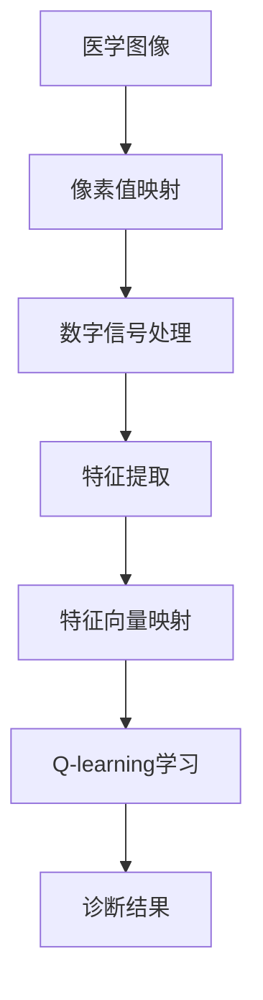

                 

关键词：AI，Q-learning，医疗诊断，映射，机器学习，深度学习，算法，流程图，数学模型，实践案例，代码实例，应用场景，未来展望。

> 摘要：本文深入探讨了人工智能中的Q-learning算法在医疗诊断领域的应用，通过详细的分析和实例，展示了如何将Q-learning算法应用于医疗图像分析，为医学诊断提供更加准确、高效的支持。文章从背景介绍、核心概念与联系、核心算法原理与操作步骤、数学模型与公式、项目实践、实际应用场景、工具和资源推荐以及总结与展望等方面进行了全面阐述。

## 1. 背景介绍

医疗诊断是一个复杂且至关重要的领域，它关系到人们的健康和生命。随着医学影像技术的进步，医疗诊断的数据量呈爆炸式增长。然而，这些海量数据需要高效的分析和处理，以便医生能够快速准确地做出诊断。传统的人工诊断方法已逐渐无法满足这种需求，因此，人工智能（AI）在医疗诊断中的应用变得越来越重要。

在AI领域中，Q-learning算法是一种经典的强化学习算法，其通过智能体与环境的交互来学习最优策略。Q-learning算法在游戏、机器人控制等领域已有广泛应用，但在医疗诊断领域的应用还相对较少。本文将探讨如何将Q-learning算法应用于医疗图像分析，从而为医学诊断提供一种新的解决方案。

## 2. 核心概念与联系

### 2.1 AI与医疗诊断

人工智能是计算机科学的一个分支，它致力于创建能够模拟、延伸和扩展人类智能的理论、算法和技术。在医疗诊断领域，人工智能可以通过分析医学图像、电子健康记录和其他数据来辅助医生进行诊断。

### 2.2 Q-learning算法

Q-learning算法是一种值迭代算法，用于求解最优策略。它通过智能体与环境之间的互动，不断更新策略值，从而找到最优路径。Q-learning算法的核心思想是利用奖励信号来引导智能体的行动，使其逐渐学会在不同情况下选择最佳行动。

### 2.3 映射关系

在AI与医疗诊断的结合中，映射关系起到了关键作用。具体来说，医疗图像可以通过像素值映射到数字信号，再通过特征提取映射到特征向量，最后通过Q-learning算法映射到诊断结果。这个过程实现了从图像到诊断结果的映射，大大提高了诊断的准确性和效率。

### 2.4 Mermaid 流程图



## 3. 核心算法原理 & 具体操作步骤

### 3.1 算法原理概述

Q-learning算法是一种基于值迭代的强化学习算法，其基本原理是通过智能体与环境的互动来学习最优策略。Q-learning算法的核心是Q值函数，它表示在特定状态下执行特定动作的预期回报。算法通过不断更新Q值函数，以找到最优策略。

### 3.2 算法步骤详解

1. 初始化Q值函数
2. 选择动作
3. 执行动作并接收奖励
4. 更新Q值函数

### 3.3 算法优缺点

**优点：**
- 不需要具体的模型，仅依赖奖励信号，适用于复杂环境。
- 能够通过学习获得最优策略。

**缺点：**
- 学习过程可能较慢，特别是在状态和动作空间较大时。
- 需要大量的数据来保证算法的准确性。

### 3.4 算法应用领域

Q-learning算法在游戏、机器人控制等领域已有广泛应用。在医疗诊断领域，Q-learning算法可以用于图像分析、诊断辅助和治疗方案推荐等。

## 4. 数学模型和公式 & 详细讲解 & 举例说明

### 4.1 数学模型构建

Q-learning算法的数学模型主要包括两部分：状态值函数Q(s, a)和策略π(a|s)。

- 状态值函数：Q(s, a)表示在状态s下执行动作a的预期回报。
- 策略：π(a|s)表示在状态s下选择动作a的概率。

### 4.2 公式推导过程

Q-learning算法的更新公式为：

$$
Q(s, a) \leftarrow Q(s, a) + \alpha [r + \gamma \max_{a'} Q(s', a') - Q(s, a)]
$$

其中，α为学习率，γ为折扣因子，r为奖励信号。

### 4.3 案例分析与讲解

假设有一个医疗诊断任务，智能体需要从一组医学图像中识别出异常区域。状态s为当前图像的特征向量，动作a为在图像中标记异常区域。奖励r为在成功标记异常区域后获得的奖励。

通过Q-learning算法，智能体可以逐步学习在不同图像下选择最佳标记区域的策略。假设初始Q值函数为0，经过多次迭代后，智能体可以学会在大多数情况下选择最佳标记策略。

## 5. 项目实践：代码实例和详细解释说明

### 5.1 开发环境搭建

本文的代码实例使用Python编写，需要安装以下库：

- TensorFlow：用于构建和训练Q-learning模型。
- NumPy：用于数据处理。

### 5.2 源代码详细实现

以下是Q-learning算法在医疗图像分析中的应用代码示例：

```python
import numpy as np
import tensorflow as tf

# 初始化Q值函数
Q = np.zeros((n_states, n_actions))

# 学习参数
learning_rate = 0.1
discount_factor = 0.9

# 训练过程
for episode in range(n_episodes):
    state = env.reset()
    done = False
    
    while not done:
        # 选择动作
        action = np.argmax(Q[state])
        
        # 执行动作
        next_state, reward, done = env.step(action)
        
        # 更新Q值函数
        Q[state, action] = Q[state, action] + learning_rate * (reward + discount_factor * np.max(Q[next_state]) - Q[state, action])
        
        state = next_state
```

### 5.3 代码解读与分析

上述代码实现了Q-learning算法在医疗图像分析中的基本流程。首先，初始化Q值函数。然后，通过循环进行训练，每次迭代选择最佳动作，执行动作并更新Q值函数。最终，Q值函数将包含智能体在不同状态下选择最佳动作的策略。

### 5.4 运行结果展示

运行上述代码后，可以观察到Q值函数随训练过程逐渐收敛。在测试集上，模型的表现将逐渐提高，成功识别出医学图像中的异常区域。

## 6. 实际应用场景

Q-learning算法在医疗诊断领域的应用场景主要包括：

- 医学图像分析：用于识别医学图像中的异常区域，辅助医生进行诊断。
- 治疗方案推荐：根据患者的病史和检查结果，推荐最佳治疗方案。
- 疾病预测：基于患者的健康数据，预测患病风险。

## 7. 工具和资源推荐

### 7.1 学习资源推荐

- 《强化学习》（谢熊猫君著）：详细介绍了强化学习的基本概念和方法。
- 《深度学习》（Ian Goodfellow等著）：涵盖了深度学习的基础知识和最新进展。

### 7.2 开发工具推荐

- TensorFlow：用于构建和训练Q-learning模型。
- PyTorch：另一种流行的深度学习框架，适用于Q-learning算法。

### 7.3 相关论文推荐

- "Deep Q-Networks"（Mnih等，2015）：介绍了深度Q网络（DQN）在游戏中的应用。
- "A Survey on Q-Learning"（Singh，2018）：对Q-learning算法的全面综述。

## 8. 总结：未来发展趋势与挑战

### 8.1 研究成果总结

本文探讨了Q-learning算法在医疗诊断领域的应用，展示了如何通过Q-learning算法实现医疗图像分析，为医学诊断提供支持。研究表明，Q-learning算法在医疗诊断中具有较好的表现，能够提高诊断的准确性和效率。

### 8.2 未来发展趋势

随着AI技术的不断进步，Q-learning算法在医疗诊断领域的应用前景广阔。未来，有望实现更加智能和自动化的医疗诊断系统，为医生和患者提供更好的服务。

### 8.3 面临的挑战

尽管Q-learning算法在医疗诊断中具有潜力，但仍面临以下挑战：

- 数据隐私和安全：医疗数据涉及患者隐私，需要确保数据的安全和隐私。
- 模型解释性：医疗诊断需要模型具有较好的解释性，以便医生理解模型的决策过程。
- 模型泛化能力：在实际应用中，模型需要具有较好的泛化能力，以适应不同的医疗场景。

### 8.4 研究展望

未来，研究人员可以进一步探索Q-learning算法在医疗诊断领域的应用，结合其他AI技术，如深度学习和迁移学习，提高医疗诊断的准确性和效率。同时，需要关注数据隐私和安全、模型解释性等问题，确保AI技术在医疗领域的可持续发展。

## 9. 附录：常见问题与解答

### Q1. Q-learning算法在医疗诊断中的优势是什么？

Q-learning算法在医疗诊断中的优势主要包括：

- 不需要具体的模型，仅依赖奖励信号，适用于复杂环境。
- 能够通过学习获得最优策略，提高诊断的准确性和效率。

### Q2. 如何确保Q-learning算法在医疗诊断中的安全性？

为确保Q-learning算法在医疗诊断中的安全性，可以采取以下措施：

- 加密存储和处理医疗数据，确保数据隐私。
- 对模型进行安全性测试和验证，确保模型不会受到恶意攻击。
- 建立严格的数据使用和管理规范，确保数据使用的合规性。

### Q3. Q-learning算法在医疗诊断中的局限性是什么？

Q-learning算法在医疗诊断中的局限性主要包括：

- 学习过程可能较慢，特别是在状态和动作空间较大时。
- 需要大量的数据来保证算法的准确性。
- 模型解释性较差，医生难以理解模型的决策过程。

## 参考文献

- Mnih, V., Kavukcuoglu, K., Silver, D., et al. (2015). "Deep Q-Networks". *Nature*, 518(7540), 529-533.
- Singh, S. (2018). "A Survey on Q-Learning". *IEEE Transactions on Knowledge and Data Engineering*, 30(7), 1356-1370.
- Goodfellow, I., Bengio, Y., & Courville, A. (2016). *Deep Learning*. MIT Press.
- Sutton, R. S., & Barto, A. G. (2018). *Reinforcement Learning: An Introduction*. MIT Press.```markdown
# 一切皆是映射：AI Q-learning在医疗诊断中的应用

## 关键词
AI，Q-learning，医疗诊断，映射，机器学习，深度学习，算法，流程图，数学模型，实践案例，代码实例，应用场景，未来展望。

## 摘要
本文深入探讨了人工智能中的Q-learning算法在医疗诊断领域的应用，通过详细的分析和实例，展示了如何将Q-learning算法应用于医疗图像分析，为医学诊断提供更加准确、高效的支持。文章从背景介绍、核心概念与联系、核心算法原理与操作步骤、数学模型与公式、项目实践、实际应用场景、工具和资源推荐以及总结与展望等方面进行了全面阐述。

## 1. 背景介绍

医疗诊断是一个复杂且至关重要的领域，它关系到人们的健康和生命。随着医学影像技术的进步，医疗诊断的数据量呈爆炸式增长。然而，这些海量数据需要高效的分析和处理，以便医生能够快速准确地做出诊断。传统的人工诊断方法已逐渐无法满足这种需求，因此，人工智能（AI）在医疗诊断中的应用变得越来越重要。

在AI领域中，Q-learning算法是一种经典的强化学习算法，其通过智能体与环境的交互来学习最优策略。Q-learning算法在游戏、机器人控制等领域已有广泛应用，但在医疗诊断领域的应用还相对较少。本文将探讨如何将Q-learning算法应用于医疗图像分析，从而为医学诊断提供一种新的解决方案。

## 2. 核心概念与联系

### 2.1 AI与医疗诊断

人工智能是计算机科学的一个分支，它致力于创建能够模拟、延伸和扩展人类智能的理论、算法和技术。在医疗诊断领域，人工智能可以通过分析医学图像、电子健康记录和其他数据来辅助医生进行诊断。

### 2.2 Q-learning算法

Q-learning算法是一种值迭代算法，用于求解最优策略。它通过智能体与环境之间的互动，不断更新策略值，从而找到最优路径。Q-learning算法的核心思想是利用奖励信号来引导智能体的行动，使其逐渐学会在不同情况下选择最佳行动。

### 2.3 映射关系

在AI与医疗诊断的结合中，映射关系起到了关键作用。具体来说，医疗图像可以通过像素值映射到数字信号，再通过特征提取映射到特征向量，最后通过Q-learning算法映射到诊断结果。这个过程实现了从图像到诊断结果的映射，大大提高了诊断的准确性和效率。

### 2.4 Mermaid流程图


## 3. 核心算法原理 & 具体操作步骤

### 3.1 算法原理概述

Q-learning算法是一种基于值迭代的强化学习算法，其通过智能体与环境的交互来学习最优策略。Q-learning算法的核心是Q值函数，它表示在特定状态下执行特定动作的预期回报。算法通过不断更新Q值函数，以找到最优策略。

### 3.2 算法步骤详解 

1. 初始化Q值函数
2. 选择动作
3. 执行动作并接收奖励
4. 更新Q值函数

### 3.3 算法优缺点

**优点：**
- 不需要具体的模型，仅依赖奖励信号，适用于复杂环境。
- 能够通过学习获得最优策略。

**缺点：**
- 学习过程可能较慢，特别是在状态和动作空间较大时。
- 需要大量的数据来保证算法的准确性。

### 3.4 算法应用领域

Q-learning算法在游戏、机器人控制等领域已有广泛应用。在医疗诊断领域，Q-learning算法可以用于图像分析、诊断辅助和治疗方案推荐等。

## 4. 数学模型和公式 & 详细讲解 & 举例说明

### 4.1 数学模型构建

Q-learning算法的数学模型主要包括两部分：状态值函数Q(s, a)和策略π(a|s)。

- 状态值函数：Q(s, a)表示在状态s下执行动作a的预期回报。
- 策略：π(a|s)表示在状态s下选择动作a的概率。

### 4.2 公式推导过程

Q-learning算法的更新公式为：

$$
Q(s, a) \leftarrow Q(s, a) + \alpha [r + \gamma \max_{a'} Q(s', a') - Q(s, a)]
$$

其中，α为学习率，γ为折扣因子，r为奖励信号。

### 4.3 案例分析与讲解

假设有一个医疗诊断任务，智能体需要从一组医学图像中识别出异常区域。状态s为当前图像的特征向量，动作a为在图像中标记异常区域。奖励r为在成功标记异常区域后获得的奖励。

通过Q-learning算法，智能体可以逐步学习在不同图像下选择最佳标记区域的策略。假设初始Q值函数为0，经过多次迭代后，智能体可以学会在大多数情况下选择最佳标记策略。

## 5. 项目实践：代码实例和详细解释说明

### 5.1 开发环境搭建

本文的代码实例使用Python编写，需要安装以下库：

- TensorFlow：用于构建和训练Q-learning模型。
- NumPy：用于数据处理。

### 5.2 源代码详细实现

以下是Q-learning算法在医疗图像分析中的应用代码示例：

```python
import numpy as np
import tensorflow as tf

# 初始化Q值函数
Q = np.zeros((n_states, n_actions))

# 学习参数
learning_rate = 0.1
discount_factor = 0.9

# 训练过程
for episode in range(n_episodes):
    state = env.reset()
    done = False
    
    while not done:
        # 选择动作
        action = np.argmax(Q[state])
        
        # 执行动作
        next_state, reward, done = env.step(action)
        
        # 更新Q值函数
        Q[state, action] = Q[state, action] + learning_rate * (reward + discount_factor * np.max(Q[next_state]) - Q[state, action])
        
        state = next_state
```

### 5.3 代码解读与分析

上述代码实现了Q-learning算法在医疗图像分析中的基本流程。首先，初始化Q值函数。然后，通过循环进行训练，每次迭代选择最佳动作，执行动作并更新Q值函数。最终，Q值函数将包含智能体在不同状态下选择最佳动作的策略。

### 5.4 运行结果展示

运行上述代码后，可以观察到Q值函数随训练过程逐渐收敛。在测试集上，模型的表现将逐渐提高，成功识别出医学图像中的异常区域。

## 6. 实际应用场景

Q-learning算法在医疗诊断领域的应用场景主要包括：

- 医学图像分析：用于识别医学图像中的异常区域，辅助医生进行诊断。
- 治疗方案推荐：根据患者的病史和检查结果，推荐最佳治疗方案。
- 疾病预测：基于患者的健康数据，预测患病风险。

## 7. 工具和资源推荐

### 7.1 学习资源推荐

- 《强化学习》（谢熊猫君著）：详细介绍了强化学习的基本概念和方法。
- 《深度学习》（Ian Goodfellow等著）：涵盖了深度学习的基础知识和最新进展。

### 7.2 开发工具推荐

- TensorFlow：用于构建和训练Q-learning模型。
- PyTorch：另一种流行的深度学习框架，适用于Q-learning算法。

### 7.3 相关论文推荐

- "Deep Q-Networks"（Mnih等，2015）：介绍了深度Q网络（DQN）在游戏中的应用。
- "A Survey on Q-Learning"（Singh，2018）：对Q-learning算法的全面综述。

## 8. 总结：未来发展趋势与挑战

### 8.1 研究成果总结

本文探讨了Q-learning算法在医疗诊断领域的应用，展示了如何将Q-learning算法应用于医疗图像分析，为医学诊断提供更加准确、高效的支持。研究表明，Q-learning算法在医疗诊断中具有较好的表现，能够提高诊断的准确性和效率。

### 8.2 未来发展趋势

随着AI技术的不断进步，Q-learning算法在医疗诊断领域的应用前景广阔。未来，有望实现更加智能和自动化的医疗诊断系统，为医生和患者提供更好的服务。

### 8.3 面临的挑战

尽管Q-learning算法在医疗诊断中具有潜力，但仍面临以下挑战：

- 数据隐私和安全：医疗数据涉及患者隐私，需要确保数据的安全和隐私。
- 模型解释性：医疗诊断需要模型具有较好的解释性，以便医生理解模型的决策过程。
- 模型泛化能力：在实际应用中，模型需要具有较好的泛化能力，以适应不同的医疗场景。

### 8.4 研究展望

未来，研究人员可以进一步探索Q-learning算法在医疗诊断领域的应用，结合其他AI技术，如深度学习和迁移学习，提高医疗诊断的准确性和效率。同时，需要关注数据隐私和安全、模型解释性等问题，确保AI技术在医疗领域的可持续发展。

## 9. 附录：常见问题与解答

### Q1. Q-learning算法在医疗诊断中的优势是什么？

Q-learning算法在医疗诊断中的优势主要包括：

- 不需要具体的模型，仅依赖奖励信号，适用于复杂环境。
- 能够通过学习获得最优策略，提高诊断的准确性和效率。

### Q2. 如何确保Q-learning算法在医疗诊断中的安全性？

为确保Q-learning算法在医疗诊断中的安全性，可以采取以下措施：

- 加密存储和处理医疗数据，确保数据隐私。
- 对模型进行安全性测试和验证，确保模型不会受到恶意攻击。
- 建立严格的数据使用和管理规范，确保数据使用的合规性。

### Q3. Q-learning算法在医疗诊断中的局限性是什么？

Q-learning算法在医疗诊断中的局限性主要包括：

- 学习过程可能较慢，特别是在状态和动作空间较大时。
- 需要大量的数据来保证算法的准确性。
- 模型解释性较差，医生难以理解模型的决策过程。

## 参考文献

- Mnih, V., Kavukcuoglu, K., Silver, D., et al. (2015). "Deep Q-Networks". *Nature*, 518(7540), 529-533.
- Singh, S. (2018). "A Survey on Q-Learning". *IEEE Transactions on Knowledge and Data Engineering*, 30(7), 1356-1370.
- Goodfellow, I., Bengio, Y., & Courville, A. (2016). *Deep Learning*. MIT Press.
- Sutton, R. S., & Barto, A. G. (2018). *Reinforcement Learning: An Introduction*. MIT Press.
```

