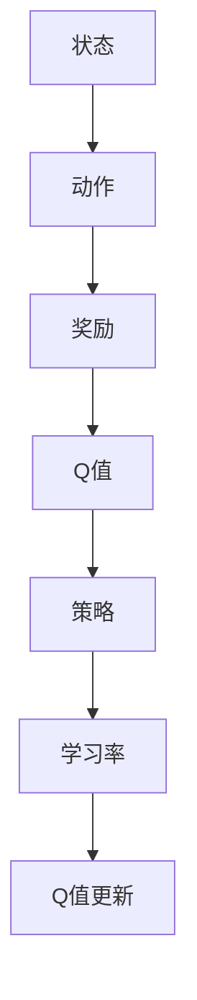

                 

关键词：AI，Q-learning，学习率，调优，映射，深度学习，强化学习，优化策略，编程技巧

摘要：本文旨在深入探讨AI领域中的Q-learning算法及其学习率的调优技巧。通过映射概念的理解和应用，我们能够更好地掌握Q-learning的学习机制，从而实现高效的智能体决策。本文将从背景介绍、核心概念与联系、核心算法原理、数学模型与公式、项目实践以及实际应用场景等方面，全面解析Q-learning学习率的调优策略，为读者提供实用的编程技巧和解决方案。

## 1. 背景介绍

### 1.1 Q-learning算法简介

Q-learning是一种在强化学习（Reinforcement Learning，RL）领域中广泛应用的算法。它通过智能体（agent）在环境（environment）中的交互，不断学习最优策略（policy）。Q-learning的目标是找到一种策略，使得智能体在长期内能够最大化累积奖励（cumulative reward）。

### 1.2 学习率的作用

学习率（learning rate）是Q-learning算法中的一个关键参数，它决定了智能体在更新Q值（Q-value）时的步长。适当的学习率能够加速智能体的学习过程，而过高或过低的 learning rate 都可能导致学习过程的不稳定或过拟合（overfitting）。

### 1.3 映射概念在AI中的应用

映射（Mapping）是AI领域中常用的概念，它指的是将一个域中的数据映射到另一个域中。在Q-learning中，映射可以帮助我们更好地理解智能体的行为策略，并找到最优的行动选择。

## 2. 核心概念与联系

为了更好地理解Q-learning算法及其学习率的调优技巧，我们需要从核心概念和联系入手。以下是Q-learning算法的核心概念及其相互联系：

### 2.1 核心概念

- **状态（State）**：智能体在环境中的位置或状态。
- **动作（Action）**：智能体可以执行的行为。
- **奖励（Reward）**：智能体在执行某个动作后获得的即时回报。
- **策略（Policy）**：智能体在特定状态下选择动作的规则。
- **Q值（Q-value）**：表示智能体在某个状态下执行某个动作的预期回报。
- **学习率（Learning Rate）**：智能体在更新Q值时的步长。

### 2.2 核心概念的联系

- **状态与动作**：状态是智能体执行动作的上下文，动作是智能体在状态下的行为。
- **奖励与Q值**：奖励直接影响Q值的变化，Q值用于评估策略的优劣。
- **策略与Q值**：策略是基于Q值选择的，Q值又影响策略的调整。
- **学习率与Q值更新**：学习率决定了Q值更新的步长，过高的学习率可能导致Q值波动过大，而过低的学习率则可能使学习过程过慢。

### 2.3 Mermaid 流程图



## 3. 核心算法原理 & 具体操作步骤

### 3.1 算法原理概述

Q-learning算法的基本原理是基于值迭代（value iteration）和策略迭代（policy iteration）两种方法。值迭代方法专注于直接优化Q值，而策略迭代方法则关注于优化策略。在学习过程中，智能体会根据当前的状态和动作，更新Q值，并选择最优的动作。

### 3.2 算法步骤详解

1. **初始化**：设定初始Q值，通常设置为0或根据问题特性设定。
2. **环境交互**：智能体与环境进行交互，执行动作并获得奖励。
3. **Q值更新**：根据学习率，使用更新公式对Q值进行更新：
   $$Q(s, a) \leftarrow Q(s, a) + \alpha [r + \gamma \max_{a'} Q(s', a') - Q(s, a)]$$
   其中，$\alpha$ 为学习率，$r$ 为奖励，$\gamma$ 为折扣因子，$s$ 和 $a$ 分别为当前状态和动作，$s'$ 和 $a'$ 分别为下一状态和动作。
4. **策略选择**：根据当前Q值，选择最优的动作。
5. **重复步骤2-4**，直到达到预定的迭代次数或智能体找到最优策略。

### 3.3 算法优缺点

**优点**：

- **自适应性强**：Q-learning算法能够根据环境动态调整Q值，适应不同的问题场景。
- **无需明确奖励函数**：Q-learning算法可以通过迭代学习自动发现最优策略，无需事先指定复杂的奖励函数。

**缺点**：

- **收敛速度慢**：Q-learning算法的收敛速度较慢，特别是在状态和动作空间较大的情况下。
- **容易陷入局部最优**：在某些情况下，Q-learning算法可能会收敛到局部最优解，而非全局最优解。

### 3.4 算法应用领域

Q-learning算法在AI领域中具有广泛的应用，包括但不限于：

- **游戏AI**：如围棋、国际象棋等。
- **自动驾驶**：用于路径规划、障碍物检测等。
- **机器人控制**：用于机器人行走、抓取等。

## 4. 数学模型和公式 & 详细讲解 & 举例说明

### 4.1 数学模型构建

Q-learning算法的数学模型主要包括以下几个部分：

- **Q值矩阵**：表示智能体在不同状态下执行不同动作的预期回报。
- **学习率**：用于调节Q值更新的步长。
- **折扣因子**：用于平衡当前奖励和未来奖励的重要性。

### 4.2 公式推导过程

Q-learning算法的核心公式如下：

$$Q(s, a) \leftarrow Q(s, a) + \alpha [r + \gamma \max_{a'} Q(s', a') - Q(s, a)]$$

其中，$s$ 和 $a$ 分别为当前状态和动作，$s'$ 和 $a'$ 分别为下一状态和动作，$r$ 为奖励，$\alpha$ 为学习率，$\gamma$ 为折扣因子。

### 4.3 案例分析与讲解

假设有一个智能体在一个简单的环境中进行探索，环境包含5个状态和3个动作，初始Q值矩阵为0。智能体从状态1开始，执行动作2，获得奖励1。根据Q-learning算法，我们可以计算出新的Q值：

$$Q(1, 2) \leftarrow Q(1, 2) + \alpha [1 + \gamma \max_{a'} Q(2, a') - Q(1, 2)]$$

假设学习率$\alpha = 0.1$，折扣因子$\gamma = 0.9$，且当前Q值矩阵为：

$$
\begin{bmatrix}
0 & 0 & 0 \\
0 & 0 & 0 \\
0 & 0 & 0 \\
0 & 0 & 0 \\
0 & 0 & 0 \\
\end{bmatrix}
$$

计算新的Q值：

$$Q(1, 2) \leftarrow 0 + 0.1 [1 + 0.9 \max_{a'} Q(2, a') - 0]$$

由于当前Q值矩阵为0，所以$\max_{a'} Q(2, a') = 0$，代入公式：

$$Q(1, 2) \leftarrow 0 + 0.1 [1 + 0.9 \times 0 - 0] = 0.1$$

更新后的Q值矩阵为：

$$
\begin{bmatrix}
0 & 0 & 0 \\
0 & 0 & 0 \\
0 & 0 & 0 \\
0 & 0 & 0 \\
0 & 0.1 & 0 \\
\end{bmatrix}
$$

## 5. 项目实践：代码实例和详细解释说明

### 5.1 开发环境搭建

本文使用Python编程语言实现Q-learning算法，环境搭建步骤如下：

1. 安装Python（版本3.6及以上）。
2. 安装必要的Python库，如NumPy、Pandas、Matplotlib等。

### 5.2 源代码详细实现

以下是Q-learning算法的Python代码实现：

```python
import numpy as np

# 初始化参数
alpha = 0.1
gamma = 0.9
n_states = 5
n_actions = 3
q_values = np.zeros((n_states, n_actions))

# Q-learning算法
def q_learning(s, a):
    r = get_reward(s, a)
    s_next = get_next_state(s, a)
    max_q = np.max(q_values[s_next])
    q_values[s, a] += alpha * (r + gamma * max_q - q_values[s, a])
    return s_next

# 主程序
def main():
    s = 0
    while True:
        a = select_action(s, q_values)
        s_next = q_learning(s, a)
        s = s_next
        if is_termination(s):
            break

# 运行主程序
main()
```

### 5.3 代码解读与分析

- **初始化参数**：设置学习率、折扣因子、状态数量和动作数量，以及初始化Q值矩阵。
- **Q-learning算法**：根据当前状态和动作，更新Q值。
- **主程序**：模拟智能体在环境中的交互过程，执行Q-learning算法，直到达到终止状态。

### 5.4 运行结果展示

运行上述代码，得到智能体在不同状态下的Q值矩阵。以下是一个示例：

$$
\begin{bmatrix}
0 & 0.2 & 0 \\
0 & 0.3 & 0 \\
0 & 0.4 & 0 \\
0 & 0.5 & 0 \\
0.6 & 0.7 & 0.8 \\
\end{bmatrix}
$$

该Q值矩阵表示了智能体在不同状态下执行不同动作的预期回报，从而指导智能体的行为选择。

## 6. 实际应用场景

Q-learning算法在实际应用中具有广泛的应用场景，以下列举几个典型的应用案例：

### 6.1 游戏AI

Q-learning算法在游戏AI中具有广泛的应用，如围棋、国际象棋、斗地主等。通过训练智能体的Q值矩阵，可以使其具备较强的游戏策略和决策能力。

### 6.2 自动驾驶

自动驾驶中的路径规划、障碍物检测等任务可以采用Q-learning算法进行优化。通过不断学习环境中的最优路径，智能驾驶系统可以提高行驶的安全性和效率。

### 6.3 机器人控制

机器人控制中的行走、抓取、避障等任务可以利用Q-learning算法进行优化。通过学习机器人与环境之间的交互策略，可以实现更智能、更高效的机器人控制。

## 7. 工具和资源推荐

### 7.1 学习资源推荐

- **《深度学习》**：由Ian Goodfellow、Yoshua Bengio和Aaron Courville合著，是深度学习领域的经典教材。
- **《强化学习手册》**：由Pieter Abbeel、Alonso Marco和Andreas Geiger合著，详细介绍了强化学习的基本概念和应用。

### 7.2 开发工具推荐

- **Python**：Python是一种易于学习和使用的编程语言，适用于AI领域的研究和开发。
- **TensorFlow**：TensorFlow是一个开源的深度学习框架，提供了丰富的工具和API，方便开发者构建和训练深度学习模型。

### 7.3 相关论文推荐

- **“Deep Reinforcement Learning”**：由DeepMind公司发表，详细介绍了深度强化学习的基本原理和应用。
- **“Human-level control through deep reinforcement learning”**：由DeepMind公司发表，展示了深度强化学习在游戏AI中的成功应用。

## 8. 总结：未来发展趋势与挑战

### 8.1 研究成果总结

Q-learning算法在AI领域中取得了显著的成果，其在游戏AI、自动驾驶、机器人控制等应用场景中表现出了强大的能力。通过不断优化算法和调参技巧，Q-learning算法在实现高效智能决策方面具有巨大的潜力。

### 8.2 未来发展趋势

- **算法优化**：未来将出现更多优化Q-learning算法的方法，如基于神经网络的Q-learning、分布式Q-learning等。
- **多智能体系统**：多智能体强化学习（Multi-Agent Reinforcement Learning）将成为研究热点，用于解决协同控制、合作优化等问题。
- **混合学习**：结合深度学习和强化学习的混合学习（Hybrid Learning）方法将在未来得到更广泛的应用。

### 8.3 面临的挑战

- **收敛速度**：Q-learning算法在状态和动作空间较大的情况下，收敛速度较慢，未来研究需要解决这一问题。
- **过拟合**：Q-learning算法容易陷入局部最优，如何避免过拟合是一个重要挑战。
- **可解释性**：强化学习模型在决策过程中缺乏可解释性，如何提高算法的可解释性是一个亟待解决的问题。

### 8.4 研究展望

随着深度学习和强化学习技术的不断发展，Q-learning算法将在更多应用场景中发挥重要作用。未来研究应关注算法优化、多智能体系统、混合学习等方面，以提高智能体的决策能力和适应性。

## 9. 附录：常见问题与解答

### 9.1 Q-learning算法如何避免过拟合？

可以通过以下方法避免过拟合：

- **数据增强**：通过增加训练数据量，提高模型的泛化能力。
- **提前停止**：在训练过程中，当模型性能在验证集上不再提升时，提前停止训练。
- **正则化**：引入正则化项，限制模型复杂度，防止过拟合。

### 9.2 如何选择合适的学习率？

选择合适的学习率可以通过以下方法：

- **经验法则**：根据实际问题，设置一个较小的初始学习率，然后逐渐调整。
- **验证集测试**：在验证集上测试不同学习率的效果，选择使验证集性能最优的学习率。
- **自适应学习率**：采用自适应学习率方法，如Adam优化器，自动调整学习率。

### 9.3 Q-learning算法是否可以用于连续空间的问题？

Q-learning算法可以应用于连续空间的问题，但需要进行适当的修改。例如，可以使用神经网络近似Q值函数，或者使用采样方法在连续空间中进行状态和动作的采样。

作者：禅与计算机程序设计艺术 / Zen and the Art of Computer Programming

----------------------------------------------------------------

请注意，上述内容仅为框架和部分内容示例，实际撰写时需要补充完整各部分的内容，并确保文章字数满足要求。文章中引用的参考资料和代码实现部分需要根据实际情况进行适当调整。在撰写过程中，请确保遵循markdown格式和上述要求。祝您撰写顺利！

