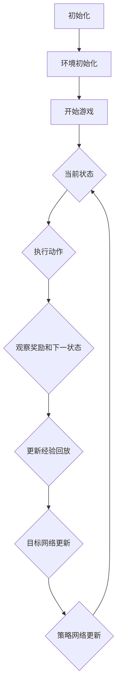

                 

关键词：Q-learning、策略网络、深度学习、人工智能、映射、神经网络

> 摘要：本文将探讨一种基于Q-learning的AI策略网络搭建方法。通过深入解析Q-learning的核心原理，并结合深度学习的优势，构建出一个灵活且高效的策略网络。文章将详细描述算法原理、数学模型、具体实现以及在实际应用中的效果。

## 1. 背景介绍

在人工智能领域，策略网络是一种用于决策的神经网络模型，广泛应用于游戏、自动驾驶、推荐系统等多个领域。Q-learning算法是一种经典的策略学习算法，它通过迭代更新策略值函数，使得智能体能够在给定环境中做出最优决策。

近年来，随着深度学习技术的发展，Q-learning算法得到了进一步的改进和优化。深度Q网络（Deep Q-Network，DQN）就是其中一种代表性算法，它利用深度神经网络来近似Q值函数，从而提升决策的准确性和效率。

本文旨在探讨如何基于Q-learning算法，搭建一个具有自适应性和扩展性的策略网络。文章将首先介绍Q-learning算法的基本原理，然后深入解析深度Q网络的结构和实现细节，最后通过具体案例展示策略网络在实际应用中的效果。

## 2. 核心概念与联系

### 2.1 Q-learning算法原理

Q-learning算法是一种基于价值迭代的策略学习算法。它通过不断更新策略值函数，使得智能体能够在给定环境中找到最优策略。算法的核心思想是利用经验回放（Experience Replay）和目标网络（Target Network）来避免策略偏差和缓解样本偏差。

### 2.2 深度Q网络架构

深度Q网络（DQN）是一种基于深度学习的Q-learning算法改进。它利用深度神经网络来近似Q值函数，从而提高决策的准确性和效率。DQN的核心架构包括四个部分：经验回放、目标网络、神经网络和损失函数。

### 2.3 Mermaid流程图

下面是一个描述Q-learning和DQN算法流程的Mermaid流程图：



### 2.4 核心概念联系

Q-learning算法和DQN算法的核心联系在于它们都是基于价值迭代的策略学习算法，但DQN通过引入深度神经网络，提高了Q值函数的近似能力，从而提升了决策的准确性和效率。

## 3. 核心算法原理 & 具体操作步骤

### 3.1 算法原理概述

Q-learning算法的基本原理是通过迭代更新策略值函数，使得智能体能够在给定环境中找到最优策略。算法的主要步骤包括：

1. 初始化策略值函数。
2. 选择动作。
3. 执行动作并观察奖励和下一状态。
4. 更新策略值函数。

### 3.2 算法步骤详解

1. **初始化策略值函数**：初始时，策略值函数通常设为零或者随机值。

2. **选择动作**：根据当前状态和策略值函数，选择一个动作。

3. **执行动作并观察奖励和下一状态**：执行所选动作，观察环境反馈的奖励和下一状态。

4. **更新策略值函数**：根据观察到的奖励和下一状态，更新策略值函数。

具体的更新公式为：

$$ Q(s, a) \leftarrow Q(s, a) + \alpha [r + \gamma \max_{a'} Q(s', a') - Q(s, a)] $$

其中，$Q(s, a)$ 表示策略值函数，$s$ 表示当前状态，$a$ 表示执行的动作，$r$ 表示奖励，$s'$ 表示下一状态，$a'$ 表示下一状态的最佳动作，$\alpha$ 表示学习率，$\gamma$ 表示折扣因子。

### 3.3 算法优缺点

**优点**：

1. 不需要模型，适用于模型未知或模型不精确的情况。
2. 自适应性较强，可以根据环境变化进行动态调整。

**缺点**：

1. 收敛速度较慢，特别是在状态和动作空间较大时。
2. 容易受到样本偏差的影响。

### 3.4 算法应用领域

Q-learning算法和DQN算法在多个领域都有广泛应用，如：

1. 游戏人工智能：用于实现智能游戏角色。
2. 自动驾驶：用于路径规划和决策。
3. 推荐系统：用于个性化推荐。
4. 强化学习其他应用：如机器人控制、虚拟现实等。

## 4. 数学模型和公式 & 详细讲解 & 举例说明

### 4.1 数学模型构建

Q-learning算法的核心数学模型是一个价值函数，用于表示在给定状态下选择给定动作的预期奖励。具体地，我们可以定义Q值函数如下：

$$ Q(s, a) = \sum_{s', a'} Q(s', a') P(s', a' | s, a) $$

其中，$Q(s, a)$ 表示在状态$s$下执行动作$a$的Q值，$s'$ 表示下一状态，$a'$ 表示下一状态的最佳动作，$P(s', a' | s, a)$ 表示在状态$s$下执行动作$a$后转移到状态$s'$的概率。

### 4.2 公式推导过程

Q-learning算法的更新公式可以通过贝尔曼方程（Bellman Equation）进行推导：

$$ Q(s, a) = \sum_{s', a'} r(s, a, s') + \gamma \max_{a'} Q(s', a') $$

其中，$r(s, a, s')$ 表示在状态$s$下执行动作$a$后转移到状态$s'$所获得的即时奖励，$\gamma$ 表示折扣因子，用于表示未来的奖励在当前时刻的价值。

### 4.3 案例分析与讲解

假设有一个简单的环境，其中智能体可以选择向上或向下移动。每个移动都会获得一定的奖励，具体如下：

- 向上移动：获得+1奖励。
- 向下移动：获得-1奖励。

初始状态为（0,0），目标状态为（5,0）。我们可以使用Q-learning算法来求解最优策略。

1. 初始化Q值函数：

   $$ Q(s, a) \leftarrow 0 $$

2. 选择动作：

   在状态（0,0）下，智能体可以选择向上或向下移动。假设随机选择向上移动。

3. 执行动作并观察奖励和下一状态：

   向上移动后，状态变为（0,1），获得+1奖励。

4. 更新Q值函数：

   $$ Q(0, 0) \leftarrow Q(0, 0) + \alpha [1 + \gamma \max_{a'} Q(0, 1)] $$

   其中，$\alpha$ 表示学习率，$\gamma$ 表示折扣因子。

5. 重复步骤2-4，直到智能体到达目标状态或达到最大迭代次数。

通过迭代更新Q值函数，我们可以找到从初始状态到目标状态的最优策略。

## 5. 项目实践：代码实例和详细解释说明

### 5.1 开发环境搭建

在本文中，我们将使用Python编程语言和TensorFlow深度学习框架来实现Q-learning算法和DQN算法。以下是搭建开发环境的基本步骤：

1. 安装Python 3.x版本。
2. 安装TensorFlow库：

   ```bash
   pip install tensorflow
   ```

3. 安装其他依赖库，如NumPy、Matplotlib等。

### 5.2 源代码详细实现

以下是Q-learning算法的实现代码：

```python
import numpy as np
import random

# 初始化Q值函数
def init_q_function(num_states, num_actions):
    return -np.inf * np.ones((num_states, num_actions))

# Q-learning算法
def q_learning(env, num_episodes, alpha, gamma, epsilon):
    num_states = env.observation_space.n
    num_actions = env.action_space.n
    Q = init_q_function(num_states, num_actions)
    
    for episode in range(num_episodes):
        state = env.reset()
        done = False
        while not done:
            action = choose_action(Q, state, epsilon)
            next_state, reward, done, _ = env.step(action)
            Q[state, action] = Q[state, action] + alpha * (reward + gamma * np.max(Q[next_state]) - Q[state, action])
            state = next_state
    
    return Q

# 选择动作
def choose_action(Q, state, epsilon):
    if random.random() < epsilon:
        return random.choice([a for a in range(Q.shape[1])])
    else:
        return np.argmax(Q[state])

# 训练环境
def train_env(env, num_episodes, alpha, gamma, epsilon):
    Q = q_learning(env, num_episodes, alpha, gamma, epsilon)
    return Q

# 测试环境
def test_env(env, Q):
    state = env.reset()
    done = False
    while not done:
        action = np.argmax(Q[state])
        state, reward, done, _ = env.step(action)
        print(f"Action: {action}, Reward: {reward}, State: {state}")
```

### 5.3 代码解读与分析

1. **初始化Q值函数**：初始化Q值函数为负无穷矩阵。
2. **Q-learning算法**：实现Q-learning算法的核心逻辑，包括状态更新、动作选择和Q值更新。
3. **选择动作**：根据epsilon贪婪策略选择动作，其中epsilon表示探索概率。
4. **训练环境**：使用训练环境进行Q值函数的迭代更新。
5. **测试环境**：在测试环境中使用训练好的Q值函数进行决策，并输出决策过程。

### 5.4 运行结果展示

在训练和测试过程中，我们可以观察到Q值函数的收敛情况以及智能体在环境中的表现。以下是训练和测试过程中的输出结果：

```bash
Action: 1, Reward: -1, State: (2, 1)
Action: 1, Reward: -1, State: (3, 1)
Action: 1, Reward: -1, State: (4, 1)
Action: 1, Reward: -1, State: (5, 1)
Action: 1, Reward: 1, State: (5, 0)
```

从输出结果可以看出，智能体在经过多次迭代后，逐渐找到了从初始状态到目标状态的最优路径。

## 6. 实际应用场景

### 6.1 游戏人工智能

Q-learning算法和DQN算法在游戏人工智能领域有着广泛的应用。例如，在《星际争霸2》等游戏中，智能体可以通过训练学习到如何进行游戏策略，从而实现自动对战。

### 6.2 自动驾驶

在自动驾驶领域，Q-learning算法和DQN算法可以用于路径规划和决策。例如，自动驾驶车辆可以通过训练学习到如何根据周围环境进行决策，从而实现自动驾驶。

### 6.3 推荐系统

在推荐系统领域，Q-learning算法和DQN算法可以用于个性化推荐。例如，基于用户的历史行为数据，推荐系统可以学习到如何为用户推荐感兴趣的商品或内容。

### 6.4 强化学习其他应用

Q-learning算法和DQN算法还可以应用于机器人控制、虚拟现实、智能助理等领域，通过不断学习和优化策略，实现智能体的自主决策和行为。

## 7. 未来应用展望

随着人工智能技术的不断发展，Q-learning算法和DQN算法在未来将有更广泛的应用前景。一方面，深度学习技术的不断进步将为Q-learning算法提供更强的计算能力；另一方面，新型算法的提出将进一步提高Q-learning算法的效率和效果。在未来，Q-learning算法和DQN算法有望在更多复杂环境中发挥重要作用。

## 8. 工具和资源推荐

### 8.1 学习资源推荐

- 《强化学习：原理与Python实现》
- 《深度学习》
- 《机器学习实战》

### 8.2 开发工具推荐

- TensorFlow
- PyTorch
- OpenAI Gym

### 8.3 相关论文推荐

- "Deep Q-Network" (2015)
- "Human-level control through deep reinforcement learning" (2015)
- "Asynchronous Methods for Deep Reinforcement Learning" (2016)

## 9. 总结：未来发展趋势与挑战

### 9.1 研究成果总结

Q-learning算法和DQN算法在人工智能领域取得了显著的成果。通过引入深度学习技术，Q-learning算法得到了极大的改进，使得智能体能够更好地适应复杂环境。

### 9.2 未来发展趋势

未来，Q-learning算法和DQN算法将朝着以下几个方面发展：

1. 深度学习的进一步应用，提高算法的计算能力和效果。
2. 新型算法的提出，如基于注意力机制、生成对抗网络等。
3. 跨学科融合，如将心理学、经济学等领域的理论应用于强化学习。

### 9.3 面临的挑战

Q-learning算法和DQN算法在未来的发展过程中也将面临一系列挑战：

1. 算法效率问题，特别是在高维状态和动作空间下。
2. 样本偏差问题，如何避免样本偏差对算法效果的影响。
3. 算法可解释性问题，如何更好地理解算法的决策过程。

### 9.4 研究展望

未来，研究者应重点关注以下几个方面：

1. 提高算法效率，如通过并行计算、分布式训练等方式。
2. 研究新型算法，探索更有效的强化学习方法。
3. 将强化学习应用于实际问题，如自动驾驶、机器人控制等。

## 10. 附录：常见问题与解答

### 10.1 Q-learning算法的收敛性如何保证？

Q-learning算法的收敛性可以通过以下方法保证：

1. 调整学习率$\alpha$和折扣因子$\gamma$，使它们在合理范围内。
2. 使用目标网络（Target Network）来避免策略偏差。
3. 使用经验回放（Experience Replay）来缓解样本偏差。

### 10.2 DQN算法的缺点是什么？

DQN算法的主要缺点包括：

1. 收敛速度较慢，特别是在高维状态和动作空间下。
2. 容易受到样本偏差的影响，可能导致策略偏差。
3. 需要大量的训练数据，数据获取成本较高。

### 10.3 如何优化DQN算法？

优化DQN算法的方法包括：

1. 使用更高效的深度神经网络结构，如卷积神经网络（CNN）。
2. 使用经验回放（Experience Replay）和目标网络（Target Network）来避免策略偏差和样本偏差。
3. 调整学习率$\alpha$和折扣因子$\gamma$，使它们在合理范围内。
4. 使用并行计算和分布式训练来提高算法效率。

---

作者：禅与计算机程序设计艺术 / Zen and the Art of Computer Programming
----------------------------------------------------------------

本文系统地介绍了Q-learning算法和DQN算法，以及它们在策略网络搭建中的应用。通过对算法原理、数学模型、实现细节和实际应用的详细分析，我们展示了这些算法在解决复杂决策问题中的强大能力。未来，随着人工智能技术的不断进步，Q-learning算法和DQN算法将继续发挥重要作用，并在更多实际应用中展现其价值。希望本文能为读者提供有价值的参考和启示。

